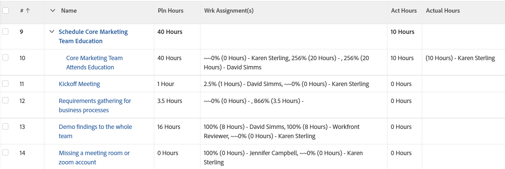

# Visualizzazione: Ore pianificate rispetto alle ore effettive per assegnazione in una visualizzazione delle attività

<!--Audited: 11/2024-->

In questa visualizzazione vengono visualizzate le ore pianificate totali di un&#39;attività, il numero di ore pianificate assegnate a ciascun assegnatario (quando l&#39;attività è assegnata a più utenti), le ore effettive totali dell&#39;attività e il numero di ore effettive registrate da ciascun assegnatario.



## Requisiti di accesso

+++ Espandi per visualizzare i requisiti di accesso per la funzionalità in questo articolo.

Per eseguire i passaggi descritti in questo articolo, è necessario disporre dei seguenti diritti di accesso:

<table style="table-layout:auto"> 
 <col> 
 <col> 
 <tbody> 
  <tr> 
   <td role="rowheader">piano Adobe Workfront</td> 
   <td> <p>Qualsiasi</p> </td> 
  </tr> 
  <tr> 
   <td role="rowheader">Licenza Adobe Workfront</td> 
   <td> <p> Corrente: 
   <ul>
   <li>Richiesta di modifica di una vista</li> 
   <li>Pianificare la modifica di un rapporto</li>
   </ul>
     </p>
     <p> Nuovo: 
   <ul>
   <li>Collaboratore per modificare una visualizzazione</li> 
   <li>Standard per modificare un rapporto</li>
   </ul>
     </p>
    </td> 
  </tr> 
  <tr> 
   <td role="rowheader">Configurazioni del livello di accesso*</td> 
   <td> <p>Modificare l’accesso a Rapporti, Dashboard, Calendari per modificare un rapporto</p> <p>Modificare l'accesso a Filtri, Viste, Raggruppamenti per modificare una vista</p> </td> 
  </tr> 
  <tr> 
   <td role="rowheader">Autorizzazioni oggetto</td> 
   <td> <p>Gestire le autorizzazioni per un rapporto</p> </td> 
  </tr> 
 </tbody> 
</table>

Per ulteriori dettagli sulle informazioni contenute in questa tabella, vedere [Requisiti di accesso nella documentazione di Workfront](/help/quicksilver/administration-and-setup/add-users/access-levels-and-object-permissions/access-level-requirements-in-documentation.md).

+++

## Visualizzare le ore pianificate e le ore effettive per assegnazione in una visualizzazione delle attività

1. Consente di passare a un elenco di attività.
1. Dal menu a discesa **Visualizza**, selezionare **Nuova visualizzazione**.

1. Nell&#39;area **Anteprima colonna** eliminare tutte le colonne tranne una.
1. Fare clic sull&#39;intestazione della colonna rimanente e fare clic su **Passa a modalità testo** > **Modifica modalità testo**.
1. Rimuovere il testo trovato nella casella **Modifica modalità testo** e sostituirlo con il seguente codice:

   ```
   column.0.descriptionkey=name
   column.0.isInlineEditable=false
   column.0.link.linkproperty.0.name=ID
   column.0.link.linkproperty.0.valuefield=ID
   column.0.link.linkproperty.0.valueformat=int
   column.0.link.lookup=link.view
   column.0.link.valuefield=objCode
   column.0.link.valueformat=val
   column.0.linkedname=direct
   column.0.listsort=string(name)
   column.0.namekey=name.abbr
   column.0.querysort=name
   column.0.section=0
   column.0.shortview=false
   column.0.stretch=0
   column.0.valuefield=name
   column.0.valueformat=HTML
   column.0.width=150
   column.1.descriptionkey=workrequired
   column.1.isInlineEditable=false
   column.1.linkedname=direct
   column.1.listsort=doubleAsDouble(workRequired)
   column.1.namekey=workrequired.abbr
   column.1.querysort=workRequired
   column.1.section=0
   column.1.shortview=false
   column.1.stretch=0
   column.1.valuefield=workFieldLong
   column.1.valueformat=compound
   column.1.viewalias=workrequired
   column.1.width=100
   column.2.listdelimiter=
   column.2.listmethod=nested(assignments).lists
   column.2.name=Wrk Assignment(s)
   column.2.stretch=0
   column.2.type=iterate
   column.2.valueexpression=CONCAT(right(CONCAT('~~~',{assignmentPercent}),3),'% (', {workRequired}/60 ,' Hours) - ',{assignedTo}.{name})
   column.2.valueformat=HTML
   column.2.width=300
   column.3.descriptionkey=actualworkrequired
   column.3.isInlineEditable=false
   column.3.linkedname=direct
   column.3.listsort=intAsInt(actualWorkRequired)
   column.3.namekey=actualworkrequired.abbr
   column.3.querysort=actualWork
   column.3.section=0
   column.3.shortview=false
   column.3.stretch=100
   column.3.valuefield=actualWorkFieldLong
   column.3.valueformat=compound
   column.3.viewalias=actualworkrequired
   column.3.width=100
   column.4.listdelimiter=
   column.4.listmethod=nested(hours).lists
   column.4.name=Actual Hours
   column.4.stretch=0
   column.4.type=iterate
   column.4.valueexpression=CONCAT('(', {hours} ,' Hours) - ',{owner}.{name})
   column.4.valueformat=HTML
   column.4.width=300
   ```

1. Fai clic su **Fine** > **Salva visualizzazione**.
