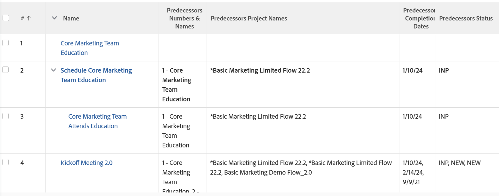

# Visualizzazione: dettagli dei predecessori

<!--Audited: 11/2024-->

Questa visualizzazione delle attività mostra i dettagli dei predecessori delle attività utilizzando una visualizzazione di raccolta. In una visualizzazione di insieme è possibile visualizzare informazioni sugli oggetti che si trovano in una relazione uno-a-molti. In questo caso, ogni attività (una) può avere più predecessori (molti). Nella visualizzazione vengono visualizzati il nome delle attività, nonché i nomi dei predecessori, i nomi dei progetti dei predecessori, le date di completamento pianificate dei predecessori e gli stati dei predecessori.

Per informazioni sui riferimenti alle raccolte nei report, vedere [Raccolte di riferimento in un report](../../../reports-and-dashboards/reports/text-mode/reference-collections-report.md).



## Requisiti di accesso

+++ Espandi per visualizzare i requisiti di accesso per la funzionalità descritta in questo articolo.

<table style="table-layout:auto"> 
 <col> 
 <col> 
 <tbody> 
  <tr> 
   <td role="rowheader">Pacchetto Adobe Workfront</td> 
   <td> <p>Qualsiasi</p> </td> 
  </tr> 
  <tr> 
   <td role="rowheader">Licenza di Adobe Workfront</td> 
   <td> 
   <p>Collaboratore o richiesta di modifica di una visualizzazione </p>
   <p>Standard o piano per modificare un report</p>
  </tr> 
  <tr> 
   <td role="rowheader">Configurazioni del livello di accesso</td> 
   <td> <p>Modificare l’accesso a report, dashboard, calendari</p> <p>Modificare l'accesso a Filtri, Viste, Raggruppamenti per modificare una vista</p> </td> 
  </tr> 
  <tr> 
   <td role="rowheader">Autorizzazioni sugli oggetti</td> 
   <td> <p>Gestire le autorizzazioni per un report</p>  </td> 
  </tr> 
 </tbody> 
</table>

Per ulteriori dettagli sulle informazioni contenute in questa tabella, consulta [Requisiti di accesso nella documentazione Workfront](/help/quicksilver/administration-and-setup/add-users/access-levels-and-object-permissions/access-level-requirements-in-documentation.md).


+++

## Visualizza dettagli predecessore

1. Consente di passare a un elenco di attività.
1. Dal menu a discesa **Visualizza**, seleziona **Nuova vista**.

1. Nell&#39;area **Anteprima colonna**, eliminare tutte le colonne tranne una.
1. Fare clic sull&#39;intestazione della colonna rimanente e fare clic su **Passa alla modalità Testo** > **Modifica modalità Testo**.
1. Rimuovere il testo trovato nella casella **Modifica modalità testo** e sostituirlo con il codice seguente:

   ```
   column.0.displayname=
   column.0.linkedname=direct
   column.0.namekey=name
   column.0.querysort=name
   column.0.valuefield=name
   column.0.valueformat=HTML
   column.1.displayname=Predecessors Numbers & Names
   column.1.listdelimiter=
   column.1.listmethod=nested(predecessors).lists
   column.1.textmode=true
   column.1.type=iterate
   column.1.valueexpression=CONCAT({predecessor}.{taskNumber},' - ',{predecessor}.{name})
   column.1.valueformat=HTML
   column.2.displayname=Predecessors Project Names
   column.2.listdelimiter=
   column.2.listmethod=nested(predecessors).lists
   column.2.textmode=true
   column.2.type=iterate
   column.2.valueexpression={predecessor}.{project}.{name}
   column.2.valueformat=HTML
   column.3.displayname=Predecessors Completion Dates
   column.3.listdelimiter=
   column.3.listmethod=nested(predecessors).lists
   column.3.textmode=true
   column.3.type=iterate
   column.3.valueexpression={predecessor}.{plannedCompletionDate}
   column.3.valueformat=HTML
   column.4.displayname=Predecessors Status
   column.4.listdelimiter=
   column.4.listmethod=nested(predecessors).lists
   column.4.textmode=true
   column.4.type=iterate
   column.4.valueexpression={predecessor}.{status}
   column.4.valueformat=HTML
   ```

1. Fai clic su **Fine** > **Salva vista**.
