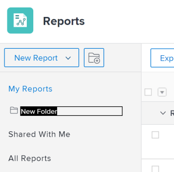

# Accedere e organizzare i rapporti

È possibile utilizzare i rapporti in Adobe Workfront per rivedere o modificare le informazioni sugli oggetti nel sistema. Puoi creare rapporti personalizzati, organizzare i rapporti creati e visualizzare quelli condivisi con te o con un pubblico.

## Requisiti di accesso

Per eseguire i passaggi descritti in questo articolo, è necessario disporre dei seguenti diritti di accesso:

<table style="table-layout:auto"> 
 <col> 
 <col> 
 <tbody> 
  <tr> 
   <td role="rowheader">piano Adobe Workfront*</td> 
   <td> 
Qualsiasi
 </td> 
  </tr> 
  <tr> 
   <td role="rowheader">Licenza Adobe Workfront*</td> 
   <td> 
Piano 
 </td> 
  </tr> 
  <tr> 
   <td role="rowheader">Configurazioni a livello di accesso*</td> 
   <td> 
Accesso a rapporti, dashboard, calendari
 
Modificare l’accesso a Filtri, Visualizzazioni, Gruppi
 
Nota: Se non disponi ancora dell’accesso, chiedi all’amministratore Workfront se ha impostato ulteriori restrizioni nel livello di accesso. Per informazioni su come un amministratore Workfront può modificare il livello di accesso, consulta <a href="../../../administration-and-setup/add-users/configure-and-grant-access/create-modify-access-levels.md" class="MCXref xref">Creare o modificare livelli di accesso personalizzati</a>.
 </td> 
  </tr> 
  <tr> 
   <td role="rowheader">Autorizzazioni oggetto</td> 
   <td> 
Gestire le autorizzazioni per un rapporto
 
Per informazioni sulla richiesta di accesso aggiuntivo, vedi <a href="../../../workfront-basics/grant-and-request-access-to-objects/request-access.md" class="MCXref xref">Richiedere l’accesso agli oggetti </a>.
 </td> 
  </tr> 
 </tbody> 
</table>

&#42;Per informazioni sul piano, il tipo di licenza o l&#39;accesso, contattare l&#39;amministratore Workfront.

## Visualizzare i rapporti

Per accedere ai rapporti creati o condivisi con te o pubblicamente:

1. Da **Menu principale** , fai clic su **Rapporti**.

1. Fai clic su una delle seguenti opzioni, a seconda del rapporto che desideri visualizzare:

   * Fai clic su **Report personali** per visualizzare i rapporti creati.
   * Fai clic su **Condiviso con me** per visualizzare i rapporti che altri utenti hanno condiviso con te.
   * Fai clic su **Tutti i report** per visualizzare sia i rapporti creati che quelli condivisi con te o condivisi pubblicamente.

## Organizzare i rapporti creati

Puoi utilizzare le cartelle per organizzare i rapporti creati. Non puoi organizzare rapporti condivisi con te, condivisi pubblicamente o rapporti di sistema.

* [Creare una nuova cartella per i rapporti](#create-a-new-folder-for-reports)
* [Aggiungere rapporti a una cartella](#add-reports-to-a-folder)

### Creare una nuova cartella per i rapporti {#create-a-new-folder-for-reports}

1. Da **Menu principale** , fai clic su **Rapporti**.

1. Fai clic sul pulsante **Nuova cartella** icona.\
   

1. Specificare un nome per la nuova cartella, quindi premere Invio.
1. Da **Report personali** aggiungere report alla nuova cartella.\
   Per informazioni sull&#39;aggiunta di un rapporto a una nuova cartella, consulta la sezione [Aggiungere rapporti a una cartella](#add-reports-to-a-folder) in questo articolo.

   >[!NOTE]
   >
   >È possibile aggiungere solo nuove cartelle al **Report personali** cartella. Non è possibile aggiungere nuove cartelle o nuovi rapporti al **Condiviso con me** o **Tutti i report** cartelle.

### Aggiungere rapporti a una cartella {#add-reports-to-a-folder}

1. Da **Menu principale** , fai clic su **Rapporti**.

1. Fai clic su **Report personali**.\
   Oppure\
   Fai clic su una cartella nidificata sotto la **Report personali** cartella.

1. Trascinare un report dall&#39;elenco dei report nella cartella in cui si desidera risiedere e rilasciarlo quando si raggiunge la cartella.

   >[!NOTE]
   >
   >È possibile spostare solo i rapporti dal **Report personali** cartella in altre cartelle nidificate sotto **Report personali**. Non è possibile spostare i rapporti da o verso il **Condiviso con me** o **Tutti i report** in o da altre cartelle.

   
