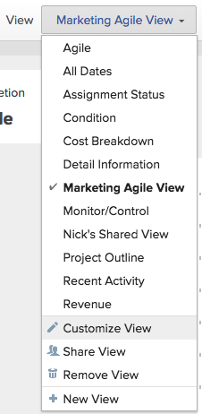

# Creare o modificare viste in Adobe Workfront

<!-- Audited: 11/2024 -->

È possibile personalizzare il tipo di informazioni visualizzate sullo schermo utilizzando le viste. In Adobe Workfront è possibile utilizzare diversi tipi di visualizzazioni.

Questo articolo descrive come creare e modificare le viste standard per gli elenchi e i rapporti e come creare viste agili. Per ulteriori informazioni, vedere [Panoramica delle visualizzazioni in Adobe Workfront](../../../reports-and-dashboards/reports/reporting-elements/views-overview.md).

## Requisiti di accesso

+++ Espandi per visualizzare i requisiti di accesso per la funzionalità in questo articolo.

Per eseguire i passaggi descritti in questo articolo, è necessario disporre dei seguenti diritti di accesso:

<table style="table-layout:auto"> 
 <col> 
 <col> 
 <tbody> 
  <tr> 
   <td role="rowheader"><strong>piano Adobe Workfront</strong></td> 
   <td> 
Qualsiasi
 </td> 
  </tr> 
  <tr> 
   <td role="rowheader"><strong>Licenza Adobe Workfront*</strong></td> 
   <td> 
      
Nuovo:

         <ul>
         <li>
Collaboratore o versione successiva
</li>
         </ul>
      
Corrente:

         <ul>
         <li>
Richiedi o superiore
</li>
         </ul>
   </td>
  </tr> 
  <tr> 
   <td role="rowheader"><strong>Configurazioni del livello di accesso*</strong></td> 
   <td> 
Modifica accesso a Filtri, Viste, Raggruppamenti
 
Modifica l’accesso a Rapporti, Dashboard, Calendari per creare una visualizzazione in un rapporto

   </td> 
  </tr> 
  <tr> 
   <td role="rowheader"><strong>Autorizzazioni oggetto*</strong></td> 
   <td> 
Gestire le autorizzazioni per un report per creare o modificare una visualizzazione in un report
 
Gestire le autorizzazioni per una visualizzazione per modificarla

   </td> 
  </tr> 
 </tbody> 
</table>

*Per informazioni, consulta [Requisiti di accesso nella documentazione di Workfront](/help/quicksilver/administration-and-setup/add-users/access-levels-and-object-permissions/access-level-requirements-in-documentation.md).

+++

## Creare o personalizzare una visualizzazione

Il processo di creazione o personalizzazione di una vista varia a seconda che si crei o si personalizzi una vista standard o una vista agile.

* [Creare o personalizzare una visualizzazione standard](#create-or-customize-a-standard-view)
* [Creare o personalizzare una visualizzazione Agile](#create-or-customize-an-agile-view)

### Creare o personalizzare una visualizzazione standard {#create-or-customize-a-standard-view}

Potete creare una nuova vista standard oppure personalizzare una vista standard esistente creata in precedenza.

1. Fare clic sul menu a discesa **Visualizza** in qualsiasi elenco in cui si desidera creare o personalizzare una visualizzazione.

1. Fare clic sul pulsante **+ Nuova visualizzazione** per creare una nuova visualizzazione.
Oppure
Fai clic sull&#39;icona **Modifica**  visualizzata al passaggio del mouse a destra di una visualizzazione esistente che desideri modificare.
Viene visualizzata la finestra di dialogo **Personalizza visualizzazione**.

1. Nella sezione **Anteprima colonna** eseguire una delle operazioni seguenti:

   * Modificare il valore di una colonna facendo clic sul titolo della colonna e selezionando un nuovo campo.
   * Aggiungere una colonna facendo clic su **Aggiungi colonna**, digitare il nome della colonna che si desidera aggiungere, quindi fare clic su di essa quando viene visualizzata nell&#39;elenco a discesa.
   * Modificare l&#39;ordine di visualizzazione delle colonne trascinando il titolo della colonna in una nuova posizione.

   * Nell&#39;area **Impostazioni colonna**, fare clic su **Riepiloga colonna per** e scegliere la modalità di visualizzazione dei dati nella colonna:

     <table style="table-layout:auto"> 
         <col> 
         <col> 
         <tbody> 
          <tr> 
           <td role="rowheader"><strong>Campi data</strong></td> 
           <td><ul>
           <li>Massimo</li>
         <li>Minimo</li>
           </ul></td> 
          </tr> 
          <tr>
           <td role="rowheader"><strong>Campi valuta</strong></td> 
           <td><ul>
           <li>Conteggio</li>
         <li>Somma</li>
           <li>Media</li>
         <li>Massimo</li>
           <li>Minimo</li>
         </ul></td> 
          </tr> 
         <tr>
           <td role="rowheader"><strong>Campi stringa e booleani</strong></td> 
           <td><ul><li>Conteggio</li></ul>
           
Nota: Workfront in genere non consiglia di riepilogare un campo booleano in base al conteggio, perché il valore sarà sempre true/false.
</td> 
          </tr> 
         </tbody> 
        </table>

     >[!NOTE]
     >
     >Le eccezioni riportate di seguito si applicano agli oggetti padre, ad esempio i task padre, quando si riepilogano i valori dei campi seguenti nei raggruppamenti:
     >   
     > * Tutti i campi relativi al numero e alla divisa tranne Ore effettive (ad esempio Costo manodopera pianificato/effettivo, Costo spesa pianificato/effettivo, Costo pianificato/effettivo, Ore pianificate) aggregano solo i valori per le attività figlio e le attività autonome. Non aggregano i valori per le attività padre o i padri dei padri.
     > * Le ore effettive aggregano i valori per le attività padre principale e le attività autonome; non aggregano i numeri per le attività padre o figlio.
     > * I campi dati personalizzati per i valori numerici e di valuta aggregano tutte le attività: padri, figli, padri e attività autonome.
     >
     >Per ulteriori informazioni sull&#39;utilizzo dei raggruppamenti in un report, vedere l&#39;articolo [Panoramica sui raggruppamenti in Adobe Workfront](../../../reports-and-dashboards/reports/reporting-elements/groupings-overview.md).

      * (Facoltativo) Fare clic su **Opzioni avanzate** per specificare le seguenti informazioni per la colonna:

        <table style="table-layout:auto"> 
         <col> 
         <col> 
         <tbody> 
          <tr> 
           <td role="rowheader"><strong>Etichetta colonna personalizzata</strong></td> 
           <td>
Specifica un’etichetta personalizzata per la colonna. Questa etichetta sostituisce quella predefinita. Per evitare problemi di compatibilità, si consiglia di utilizzare solo caratteri UTF-8.
</td> 
          </tr> 
          <tr> 
           <td role="rowheader"><strong>Formato campo</strong></td> 
           <td>Selezionare il formato in cui si desidera visualizzare i valori per i campi della colonna.</td> 
          </tr> 
          <tr> 
           <td role="rowheader"><strong>Mostra questa colonna quando in un dashboard</strong></td> 
           <td>
Selezionare questa opzione per visualizzare questa colonna in un dashboard quando il report viene visualizzato affiancato a un altro report. Se questa opzione non è selezionata, questa colonna non viene visualizzata quando si visualizza il report su un dashboard in cui i report vengono visualizzati affiancati.
</td> 
          </tr> 
          <tr> 
           <td role="rowheader"><strong>Regole colonna</strong></td> 
           <td>
Fare clic su <strong>+ Aggiungi una regola per questa colonna</strong> per definire una regola per la colonna. Dopo aver aggiunto una regola, è possibile definire stili di campo e di testo per la visualizzazione dei campi corrispondenti alla regola. Fai clic su <strong>Aggiungi regola</strong> dopo aver completato la definizione della regola.
</td> 
          </tr> 
         </tbody> 
        </table>

        Per ulteriori informazioni sulla formattazione condizionale delle visualizzazioni nei report, vedere l&#39;articolo [Utilizzare la formattazione condizionale in modalità testo](../../../reports-and-dashboards/reports/text-mode/use-conditional-formatting-text-mode.md).

1. (Condizionale) Se hai selezionato **Opzioni avanzate**, fai clic su **Fine**.

1. Fai clic su **Salva visualizzazione** per creare una nuova visualizzazione o per sostituire la visualizzazione corrente con le modifiche.\
   Oppure\
   Fai clic su **Salva come nuova visualizzazione** per salvare le modifiche come nuova visualizzazione.

   >[!TIP]
   >
   >**Salva come nuova visualizzazione** è l&#39;unica opzione disponibile quando si personalizza una visualizzazione predefinita di Workfront.

   Il modo in cui la vista viene salvata dipende dal tuo accesso. Se la vista è stata creata in origine, è possibile salvare le modifiche; in caso contrario, viene richiesto di salvare una versione. Le modifiche apportate alla visualizzazione hanno un impatto sugli utenti con cui la visualizzazione è stata condivisa.

### Creare o personalizzare una visualizzazione Agile {#create-or-customize-an-agile-view}

Puoi creare una vista Agile o personalizzare una vista Agile esistente creata in precedenza.

>[!IMPORTANT]
>
>Le visualizzazioni Agile sono disponibili solo quando si visualizza un progetto.

Per ulteriori informazioni sulle visualizzazioni Agile, vedi l&#39;articolo [Gestione di un progetto in Visualizzazione Agile](../../../manage-work/projects/manage-projects/manage-projects-in-agile-view.md).

>[!NOTE]
>
>Questa procedura si applica solo alla vista Agile legacy, non alla vista bacheca di un progetto.

Per creare o personalizzare una visualizzazione Agile:

1. Consente di passare all&#39;elenco delle attività di un progetto.
1. Fai clic sull&#39;icona **Bacheca** , quindi fai clic su **Utilizza legacy agile** nella visualizzazione Bacheca.

1. (Condizionale) Per personalizzare una visualizzazione Agile esistente:

   1. Fai clic sul menu a discesa **Visualizza**, quindi seleziona la visualizzazione Agile che desideri personalizzare.\
      Non è possibile personalizzare la visualizzazione Agile predefinita.

   1. Fai di nuovo clic sul menu a discesa **Visualizza**, quindi fai clic su **Personalizza visualizzazione**.\
      

1. (Condizionale) Per creare una nuova visualizzazione Agile, fai clic su **Nuova visualizzazione**.\
   Viene visualizzata la finestra di dialogo **Personalizza visualizzazione Agile**.

1. Nella finestra di dialogo **Personalizza visualizzazione Agile**, specifica un nome per la visualizzazione Agile.\
   È consigliabile includere la parola &quot;Agile&quot; nel nome della visualizzazione, in modo che gli utenti sappiano che si tratta di una visualizzazione Agile.\
   Questo nome viene visualizzato nel menu a discesa **Visualizza** quando si seleziona una visualizzazione.

1. Definite le colonne di stato da visualizzare sullo storyboard nella visualizzazione agile. Questi sono gli stati delle attività definiti dall&#39;amministratore di Workfront, come descritto in [Creare o modificare uno stato](../../../administration-and-setup/customize-workfront/creating-custom-status-and-priority-labels/create-or-edit-a-status.md).

   Nella bacheca delle storie di Agile sono disponibili solo gli stati di sistema. Se uno stato è disponibile solo per un singolo gruppo di cui sei membro, non sarà disponibile sullo storyboard Agile. Inoltre, le attività con uno stato disponibile solo per un gruppo personalizzato non sono visibili quando si visualizza il progetto in una visualizzazione Agile.

   Gli utenti possono spostare le storie tra queste colonne di stato sulla bacheca delle storie di Agile.\
   Quando si definiscono le colonne di stato, è possibile effettuare le seguenti operazioni:

   <table style="table-layout:auto"> 
    <col> 
    <col>
    <tbody> 
     <tr> 
      <td role="rowheader"><strong>Riordina colonne stato:</strong> </td> 
      <td> Trascinare una colonna di stato nell'ordine in cui si desidera visualizzarla. </td> 
     </tr> 
     <tr> 
      <td role="rowheader"><strong>Rimuovi le colonne di stato:</strong> </td> 
      <td>Fare clic sull'icona (x) nella colonna che si desidera rimuovere. Non è possibile rimuovere lo stato "Nuovo" a meno che non sia stato aggiunto uno stato personalizzato alla visualizzazione e tale stato personalizzato non sia uguale a "Nuovo". Per informazioni sulla creazione di uno stato personalizzato, vedere <a href="../../../administration-and-setup/customize-workfront/creating-custom-status-and-priority-labels/create-or-edit-a-status.md" class="MCXref xref">Creare o modificare uno stato</a>.</td> 
     </tr> 
     <tr> 
      <td role="rowheader"><strong>Aggiungi colonne di stato:</strong> </td> 
      <td> 
Fai clic sull'icona <strong>Plus</strong>, quindi seleziona lo stato che desideri aggiungere. Vengono visualizzati tutti gli stati di sistema predefiniti e gli eventuali stati personalizzati condivisi con l'utente. È possibile configurare fino a 10 stati da visualizzare.
</td> 
     </tr> 
    </tbody> 
   </table>

   <!--
        
(NOTE FOR ADD STATUS COLUMNS: research this and add: [! What if the status has been shared with me or a group I'm in (so I can see it here), but the status hasn't been shared with another user who also has access to a project where I later apply this view? Can that user still see this status on the project?]) 

       -->

1. Nell&#39;area **Associa colore scheda a** selezionare una delle opzioni seguenti:

   <table style="table-layout:auto"> 
    <col> 
    <col>
    <tbody> 
     <tr> 
      <td role="rowheader"><strong>Storia:</strong> </td> 
      <td>Tutte le sottoattività corrispondono al colore dell'attività padre, in modo che i colori di tutti i brani di una determinata corsia siano gli stessi. I colori vengono assegnati in modo casuale alle attività quando vengono create se l'attività non ha sottoattività o non ha un'attività padre.</td> 
     </tr> 
     <tr> 
      <td role="rowheader"><strong>Formato libero:</strong> </td> 
      <td> Tutte le schede sono visualizzate in blu per impostazione predefinita finché un utente non cambia il colore manualmente, come descritto nell'articolo <a href="../../../agile/use-scrum-in-an-agile-team/scrum-board/categorize-stories-by-color.md" class="MCXref xref">Categorizzare le storie per colore sulla bacheca Scrum</a>. </td> 
     </tr> 
     <tr> 
      <td role="rowheader"><strong>Priorità:</strong> </td> 
      <td> 
 I colori sono associati alla priorità del brano, come segue:
 
       <ul> 
        <li>Alto = Rosso</li> 
        <li>Medium = Giallo</li> 
        <li>Bassa = Verde Se l'amministratore di Workfront ha configurato priorità personalizzate per il sistema Workfront, la priorità più alta è rossa, la seconda più alta è gialla e le rimanenti sono verdi.</li> 
       </ul> </td> 
     </tr> 
     <tr> 
      <td role="rowheader"><strong>Proprietario attività:</strong> </td> 
      <td> Tutti i brani con lo stesso assegnatario principale sono dello stesso colore. L'assegnatario principale è l'utente che è stato assegnato per la prima volta all'attività. </td> 
     </tr> 
    </tbody> 
   </table>

1. Nell&#39;area **Campi aggiuntivi**, fare clic su **Aggiungi campo**, quindi selezionare il campo che si desidera aggiungere alle schede delle storie. Si tratta degli stessi campi che è possibile aggiungere quando si crea una visualizzazione personalizzata o si creano colonne per un report.\
   Ripetete questa procedura per aggiungere fino a tre campi aggiuntivi alle schede delle storie.\
   Quando si aggiungono campi alle schede delle storie, i campi sono di sola visualizzazione e vengono visualizzati solo quando il campo è popolato.

   Per impostazione predefinita, nella scheda brani vengono visualizzati i seguenti tipi di dati:

   * Nome della storia con un collegamento diretto all’attività
   * Il nome del progetto con un collegamento diretto al progetto\
     Questo collegamento viene visualizzato solo quando si utilizza la vista agile in un’iterazione e non quando si utilizza una vista agile in un progetto.
   * Descrizione dell’attività
   * Impegno attuale
   * Visualizzare e modificare la percentuale di completamento regolando la percentuale stessa o il numero di punti o ore completate
   * Utenti assegnati

   È possibile visualizzare dati aggiuntivi, inclusi dati personalizzati, sulle schede delle storie. È possibile visualizzare campi aggiuntivi sulle schede delle storie per diversi motivi. Ad esempio, potresti voler visualizzare l’ID cliente se stai lavorando su storie per più clienti all’interno del progetto, oppure potresti voler visualizzare la Data di inizio attività.

1. Fai clic su **Salva**.\
   Il modo in cui la vista viene salvata dipende dal tuo accesso. Se la vista è stata creata in origine, è possibile salvare le modifiche; in caso contrario, viene richiesto di salvare una versione. Le modifiche apportate alla visualizzazione hanno un impatto sugli utenti con cui la visualizzazione è stata condivisa.

1. (Facoltativo) Fai clic sull&#39;icona **Elenco** per tornare all&#39;elenco delle attività.
