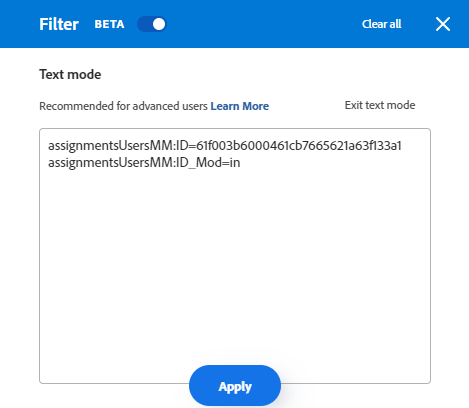

# Creare o modificare filtri in Adobe Workfront

<!--Audited: 12/2023-->

È possibile limitare la quantità di informazioni visualizzate sullo schermo in un elenco di elementi con un filtro. È possibile definire determinati criteri in base a informazioni specifiche relative a un oggetto e visualizzare solo gli oggetti che soddisfano tali criteri.

Puoi applicare i seguenti tipi di filtri in Adobe Workfront:

* Filtri rapidi in un elenco di oggetti per trovare un elemento utilizzando una parola chiave. Si tratta di filtri temporanei che non è possibile salvare per utilizzi futuri.

  Per informazioni sui filtri rapidi, consulta [Applicare il filtro rapido a un elenco](../../../workfront-basics/navigate-workfront/use-lists/apply-quick-filter-list.md).

* Filtri permanenti che è possibile salvare e utilizzare più volte su più elenchi e rapporti. In questo articolo viene descritto come creare un filtro permanente o modificarne uno esistente in un elenco o in un report.

* Filtri in altre aree di Workfront, al di fuori di elenchi e rapporti.

  Per un elenco di tutti i filtri in Workfront e delle aree in cui puoi applicarli, consulta [Panoramica sui filtri in Adobe Workfront](../../../reports-and-dashboards/reports/reporting-elements/filters-overview.md).

## Requisiti di accesso

Per eseguire i passaggi descritti in questo articolo, è necessario disporre dei seguenti diritti di accesso:

<table style="table-layout:auto"> 
 <col> 
 <col> 
 <tbody> 
  <tr> 
   <td role="rowheader"><strong>Piano Adobe Workfront*</strong></td> 
   <td> 
Qualsiasi
 </td> 
  </tr> 
  <tr> 
   <td role="rowheader"><strong>Licenza Adobe Workfront*</strong></td> 
   <td> 
Nuovo: Collaboratore o versione successiva

Oppure

Corrente: richiesta o successiva

<b>NOTA:</b>

Per modificare un filtro in un rapporto, è necessario disporre della seguente licenza:

Nuovo: Piano

Oppure

Corrente: Standard

</td> 
  </tr> 
  <tr> 
   <td role="rowheader"><strong>Configurazioni del livello di accesso*</strong></td> 
   <td> <ul><li>
Modificare l’accesso a Filtri, Viste e Raggruppamenti
</li></ul>
    
<b>NOTA:</b>

   Per modificare un filtro in un rapporto, è necessario disporre della seguente configurazione del livello di accesso, oltre all’accesso di modifica a filtri, viste e raggruppamenti:

<ul><li>
Modificare l’accesso a rapporti, dashboard e calendari
</li></ul>

<b>NOTA:</b>
 
 Se non disponi dell’accesso, chiedi all’amministratore di Workfront se ha impostato restrizioni aggiuntive nel tuo livello di accesso. Per informazioni su come un amministratore di Workfront può modificare il tuo livello di accesso, consulta <a href="../../../administration-and-setup/add-users/configure-and-grant-access/create-modify-access-levels.md" class="MCXref xref">Creare o modificare livelli di accesso personalizzati</a>.
 </td> 
  </tr> 
  <tr> 
   <td role="rowheader"><strong>Autorizzazioni oggetto</strong></td> 
   <td> 
Gestire le autorizzazioni per un filtro
 
Per informazioni sulla richiesta di accesso aggiuntivo, consulta <a href="../../../workfront-basics/grant-and-request-access-to-objects/request-access.md" class="MCXref xref">Richiedi accesso agli oggetti </a>.
 </td> 
  </tr> 
 </tbody> 
</table>

&#42;Per conoscere il piano, il tipo di licenza o l&#39;accesso di cui si dispone, contattare l&#39;amministratore Workfront.

## Tipi di interfacce per la creazione di filtri

Puoi creare filtri utilizzando i tipi di generatori di filtri descritti nella tabella seguente:

<table style="table-layout:auto">
<col>
<col>
<col>
<tbody>
<tr>
<td><strong>Tipo di generatore</strong></td>
<td><strong>Filtra oggetto</strong></td>
<td><strong>Se disponibile</strong></td>
</tr>
<tr>
<td>Generatore standard</td>
<td>
<ul>
<li> 
Progetti
 </li>
<li> 
Attività 
 </li>
<li> 
Problemi
 </li>
<li> 
Portfolio
 </li>
<li> 
Programmi
 </li>
<li> 
Utenti
 </li>
<li> 
Modelli
 </li>
<li> 
Gruppi
 </li>
</ul>
</td>
<td>
<ul>
<li> 
Elenchi 
 </li>
</ul>
<ul>
<li> 
Elenco Progetti nella Pianificazione scenario
 
Scenario Planner richiede una licenza aggiuntiva. Per informazioni su Workfront Scenario Planner, consulta <a href="../../../scenario-planner/scenario-planner-overview.md">Panoramica sulla pianificazione degli scenari</a>. 
 </li>
</ul>

<b>NOTA:</b>
 
I generatori standard di filtri non sono disponibili nei rapporti.
</td>
</tr>
<tr>
<td>Generatore legacy</td>
<td>Tutti gli oggetti </td>
<td>Elenchi e rapporti</td>
</tr>
</tbody>
</table>

Per informazioni sugli oggetti di Workfront, vedere [Comprendere gli oggetti in Adobe Workfront](/help/quicksilver/workfront-basics/navigate-workfront/workfront-navigation/understand-objects.md).

Quando crei filtri utilizzando le diverse interfacce, tieni presente quanto segue:

* Puoi trovare il generatore di standard nelle stesse posizioni in cui si trova l’interfaccia filtro legacy per le aree elencate nella tabella precedente.
* Il generatore di standard è l&#39;esperienza predefinita per tutte le aree in cui è disponibile. Per passare al generatore di filtri legacy, fai clic sul pulsante **Altro** menu accanto a [!UICONTROL **Filtri**] e seleziona [!UICONTROL **Torna a Filtri legacy**].

  

* I filtri salvati sono disponibili in entrambi i generatori, indipendentemente dall’esperienza utilizzata per generarli originariamente. Ad esempio, se hai creato un filtro utilizzando il generatore legacy, puoi trovarlo e modificarlo anche nell’interfaccia del generatore standard.

  >[!TIP]
  >
  >Il filtro &quot;All&quot; (Tutti) non è incluso nel generatore standard perché quando non si applicano filtri vengono visualizzate tutte le voci di elenco. Clic [!UICONTROL **Cancella tutto**] in alto a destra nel generatore per cancellare tutti i filtri attivi e visualizzare tutti gli elementi. Se [!UICONTROL **Cancella tutto**] è disattivato, quindi non vengono applicati filtri.

* I generatori standard e legacy hanno una sintassi leggermente diversa durante la creazione di filtri con più istruzioni che combinano gli operatori AND e OR. Di conseguenza, questi filtri possono essere visualizzati in modo diverso quando si passa da un generatore all’altro.

  >[!INFO]
  >
  >Esiste lo scenario seguente:
  >
  >1. Utilizza il generatore di standard per creare un filtro con la seguente sintassi:
  >
  >      `(A OR B) AND C`
  >
  >1. Passa al generatore legacy e modifica il filtro utilizzando la sintassi del generatore legacy come descritto nella sezione [Creare o modificare un filtro nel generatore legacy](#create-filter-in-legacy-builder) in questo articolo. La sintassi per il generatore legacy di visualizza le istruzioni del filtro come segue:
  >
  >      `A AND C`
  >      `OR`
  >      `B AND C`
  >
  >1. Apporta una modifica al filtro nell’interfaccia legacy.
  >1. Torna al generatore standard. L’istruzione di filtro viene visualizzata in base alla logica supportata nel generatore di versioni precedenti, come descritto in precedenza.
  >
  >      Il filtro viene visualizzato nell’interfaccia standard di generazione come segue:
  >  
  >      `A AND C`
  >      `OR`
  >      `B AND C`
  > 
  >      Ciò si verifica perché il filtro è stato modificato nell’interfaccia legacy.

## Creare o modificare un filtro nel generatore di standard

Puoi creare filtri utilizzando l’interfaccia standard di generazione nei seguenti modi:

* Da zero
* Modificare un filtro esistente
* Duplica un filtro esistente
* Duplica un filtro esistente, modificalo e salvalo come nuovo filtro

Crea un filtro tramite l’interfaccia standard di generazione:

1. Passa a un elenco in cui desideri creare un filtro o che contiene il filtro che desideri personalizzare.
1. Fai clic su **Filtro** icona  per aprire l&#39;interfaccia del generatore.

   

1. Rivedi i seguenti elenchi di filtri:

   <table style="table-layout:auto">
   <col>
   <col>
   <tbody>
   <tr>
   <td role="rowheader"><strong>Preferiti</strong></td>
   <td>Filtri contrassegnati come preferiti. Quando si preferisce un filtro, la posizione originale viene visualizzata sotto il nome del filtro e viene nascosta dall'elenco originale a meno che non venga rimosso come preferito.</td>
   </tr>
   <tr>
   <td role="rowheader"><strong>Salvato</strong></td>
   <td>Filtri creati e salvati personalmente. Per impostazione predefinita, in questo elenco vengono visualizzati i filtri salvati in ordine di quelli salvati più di recente, ma i nomi dei filtri possono essere trascinati per riordinare manualmente l’elenco.</td>
   </tr>
   <tr>
   <td role="rowheader"><strong>Impostazioni predefinite di sistema</strong></td>
   <td>I filtri predefiniti di Workfront e i filtri aggiunti dall’amministratore di Workfront all’elenco dei filtri, a livello di sistema o nel modello di layout.</td>
   </tr>
   <tr>
   <td role="rowheader"><strong>Condivisi con me</strong></td>
   <td>Filtri creati e condivisi da altri utenti con te o condivisi a livello di sistema.</td>
   </tr>
   </tbody>
   </table>

1. Esegui una delle operazioni seguenti:

   * Clic **Nuovo filtro** per creare un filtro da zero.
   * Passa il puntatore del mouse su un filtro esistente che disponi delle autorizzazioni per gestire e fai clic su **Modifica** icona  per modificarlo.

     Oppure

     Passa il puntatore del mouse su un filtro esistente per il quale disponi delle autorizzazioni di visualizzazione, fai clic sul pulsante **Altro** menu e fai clic su **Duplica** per copiare il filtro esistente e modificare una copia.

   

1. (Condizionale) A seconda che si desideri trovare oggetti che corrispondano a tutte o a una qualsiasi delle istruzioni di un gruppo di filtri, selezionare una delle opzioni seguenti:

   <table style="table-layout:auto">
   <col>
   <col>
   <tbody>
   <tr>
   <td role="rowheader"><strong>Includi se tutti sono true</strong></td>
   <td>Gli oggetti trovati dal filtro devono corrispondere a tutti i criteri di filtro in un gruppo di filtri. In questo caso, le istruzioni di filtro sono collegate dall’operatore AND. Questa è la selezione predefinita.</td>
   </tr>
   <tr>
   <td role="rowheader"><strong>Includi se almeno una è true</strong></td>
   <td>Gli oggetti trovati dal filtro devono corrispondere a qualsiasi criterio di filtro in un gruppo di filtri. In questo caso, le istruzioni di filtro sono collegate dall’operatore OR.</td>
   </tr>
   </tbody>
   </table>

   

   Per ulteriori informazioni sugli operatori di filtro, consulta [Panoramica sui filtri in Adobe Workfront](/help/quicksilver/reports-and-dashboards/reports/reporting-elements/filters-overview.md).

1. Fai clic sul menu a discesa dei campi per visualizzare un elenco degli ultimi campi utilizzati e dei campi consigliati in base ai quali filtrare. I campi suggeriti sono attualmente visualizzati nell’elenco che si sta filtrando.

   Puoi anche selezionare **Sfoglia campi** per visualizzare un elenco di tutti i campi in base ai quali è possibile filtrare. I campi nella ricerca avanzata sono raggruppati per categoria di oggetti.

   

1. Fare clic sul menu a discesa del modificatore per selezionare un modificatore. Il modificatore predefinito è &quot;Uguale a&quot;.

   Per ulteriori informazioni, consulta [Modificatori di filtri e condizioni](/help/quicksilver/reports-and-dashboards/reports/reporting-elements/filter-condition-modifiers.md).

   >[!TIP]
   >
   >Quando si crea il filtro, i risultati vengono visualizzati immediatamente nell’elenco. Se il pannello dei filtri copre l’elenco, puoi chiuderlo per visualizzarlo. Le informazioni immesse rimangono nel generatore quando aprite nuovamente il pannello.

1. Inizia a digitare il valore di un campo in base al quale desideri filtrare. Ad esempio, inizia a digitare il nome di un problema, se desideri filtrare per `Issue:Name`. Seleziona il valore quando viene visualizzato nell’elenco.

   >[!TIP]
   >
   >A seconda del modificatore selezionato, è possibile selezionare più valori.

1. Clic **Aggiungi filtro** per selezionare un altro campo, aggiungi un criterio di filtro all’istruzione di filtro.
1. (Facoltativo) Fai clic su **Elimina** icona  per rimuovere le istruzioni di filtro esistenti.

   Oppure

   Clic **Cancella tutto** per cancellare tutti i criteri di filtraggio.

1. (Facoltativo) Fai clic su **Aggiungi gruppo di filtri** per aggiungere un altro set di criteri di filtro. L&#39;operatore predefinito tra i set è **E**. Fai clic sull’operatore per modificarlo in **OPPURE**.

   >[!TIP]
   >
   >È possibile utilizzare un altro gruppo di filtri quando si desidera che i gruppi siano connessi da un operatore diverso rispetto all&#39;operatore in un&#39;istruzione di filtro.

   >[!INFO]
   >
   >Quando si filtra per progetti che contengono &quot;marketing&quot; nel nome che non sono completi e non sono in sospeso, è possibile utilizzare i seguenti gruppi di filtri:
   >`(Project: Name Contains Marketing AND Project: Percent Complete Does not equal 100)`
   >`OR`
   >`(Project: Name Contains Marketing AND Project: Status Does not equal On Hold)`
   >In questo caso, ogni istruzione di filtro è connessa da un AND e i gruppi di filtri sono connessi da un OR.

1. (Facoltativo) Fai clic su **Modalità testo** per continuare a creare il filtro utilizzando la modalità testo.

   

   Viene visualizzata l&#39;interfaccia della modalità testo.

   

   >[!TIP]
   >
   >È consigliabile creare il maggior numero possibile di filtri utilizzando l’interfaccia standard di generazione e utilizzando la modalità testo solo quando è necessario modificare i filtri supportati solo in modalità testo.

   Per ulteriori informazioni sulla creazione di un filtro tramite l’interfaccia in modalità testo, consulta [Modificare un filtro utilizzando la modalità testo](/help/quicksilver/reports-and-dashboards/reports/text-mode/edit-text-mode-in-filter.md).

1. Clic **Esci dalla modalità testo** per tornare all&#39;interfaccia standard del generatore.

   >[!WARNING]
   >
   >Alcune istruzioni della modalità testo non sono supportate nel generatore standard o nell’interfaccia legacy. L’uscita dalla modalità testo dopo aver creato questi tipi di istruzioni potrebbe generare un messaggio di avviso.

1. (Facoltativo) Fai clic su **Applica** per applicare il filtro all’elenco e visualizzare i risultati.

   Se il filtro non produce risultati, l’elenco è vuoto.

1. Clic **Salva come nuovo** per salvare il filtro per utilizzi futuri.

   

1. Seleziona **Filtro senza titolo** e digita il nome del nuovo filtro.

   >[!TIP]
   >
   >Assicurati di denominare il filtro in modo da poterlo trovare in un secondo momento. Se non si assegna un nome al filtro, nel sistema verrà chiamato Filtro senza titolo.

1. Seleziona un’icona per il nuovo filtro dal menu **Icona** menu a discesa.

   

1. (Facoltativo) Aggiungi una descrizione del filtro per indicare cosa c’è di univoco. La descrizione viene visualizzata sotto il nome del filtro nell’elenco dei filtri.

   >[!TIP]
   >
   >Clic **Annulla** in qualsiasi momento ti riporta all’area di creazione del filtro.

1. Clic **Salva**. Il filtro viene salvato nell’elenco Salvato e applicato all’elenco di elementi.
1. (Facoltativo) Per spostare un filtro nell’elenco Preferiti, passa il cursore del mouse su un filtro nel cassetto dei filtri e fai clic su **Preferito** icona .

   Oppure

   Passare il puntatore del mouse su un filtro nel cassetto del filtro, quindi scegliere il menu Altro e fai clic su **Preferito**.

1. (Facoltativo) Fai clic su **Sovrapponi filtri** per attivare i filtri sovrapposti. Questa opzione consente di applicare più di un filtro salvato. Le regole del filtro vengono applicate nell’ordine in cui le selezioni.

   >[!TIP]
   >
   >Non esiste alcun limite al numero di filtri selezionabili.
   >
   >Quando selezioni più filtri, tutte le relative condizioni devono essere soddisfatte contemporaneamente per visualizzare i risultati corrispondenti.

   

   Il numero di filtri selezionati viene visualizzato accanto all’icona del filtro nella parte superiore dell’elenco degli elementi.

   

1. (Facoltativo) Effettuate una delle seguenti operazioni:

   * Condividi il filtro con altri utenti o rendilo disponibile a livello di sistema. Per ulteriori informazioni, consulta [Condividere un filtro, una visualizzazione o un raggruppamento](/help/quicksilver/reports-and-dashboards/reports/reporting-elements/share-filter-view-grouping.md).

   * Elimina il filtro se non è più valido o se è un duplicato. Puoi eliminare solo i filtri di tua proprietà. Puoi rimuovere i filtri condivisi con te. Per informazioni, consulta [Rimuovere filtri, visualizzazioni e raggruppamenti](/help/quicksilver/reports-and-dashboards/reports/reporting-elements/remove-filters-views-groupings.md).

## Creare o modificare un filtro nel generatore legacy {#create-filter-in-legacy-builder}

Puoi creare filtri legacy negli elenchi e nei rapporti nei seguenti modi:

* Da zero
* Modificare un filtro esistente e salvarlo come nuovo filtro

Indipendentemente dal metodo utilizzato per creare i filtri, la creazione di un filtro da zero o da un filtro esistente è simile.

1. Passare a un elenco o a un report contenente il filtro che si desidera personalizzare.
1. Fai clic su **Filtro** icona .

   >[!TIP]
   >
   >Il creatore del report deve consentire la modifica dei filtri per visualizzare l’elenco a discesa Filtro in un report. Il filtro Report predefinito viene applicato a un report per impostazione predefinita. Il filtro Report predefinito può essere personalizzato solo quando si modifica il report.

   

1. Clic **Nuovo filtro** nella parte superiore dell’elenco dei filtri.

   Oppure

   Passa il puntatore del mouse sul filtro che desideri modificare e fai clic sul pulsante **Modifica** icona .

   Il generatore per personalizzare i lanci del filtro.

1. Effettua una delle seguenti operazioni:

   * Modifica le regole di filtro esistenti facendo clic sulla regola esistente e selezionando una nuova opzione.
   * Aggiungere una regola di filtro facendo clic su **Aggiungi un&#39;altra regola filtro**, inizia a digitare il nome dell’opzione per la quale desideri aggiungere una regola nel **Inizia a digitare il nome del campo** , quindi fare clic su di esso quando viene visualizzato nell&#39;elenco a discesa.

     I campi associati all’oggetto del filtro sono elencati nella sezione **Inizia a digitare il nome del campo** casella.

   * Clic **E** o **OPPURE** quando si aggiunge una regola di filtro.\
     Quando aggiungi le regole del filtro, utilizza i modificatori del filtro per stabilire la condizione del filtro. Per ulteriori informazioni sui modificatori di filtri, consulta [Modificatori di filtri e condizioni](../../../reports-and-dashboards/reports/reporting-elements/filter-condition-modifiers.md).

     >[!NOTE]
     >
     >Quando si connette un gruppo di istruzioni AND da più istruzioni OR, è necessario ripetere i campi che non cambiano tra le istruzioni OR per ogni gruppo di istruzioni.
     >
     >
     >
     >Quando si crea un filtro per i task che contengono la parola &quot;marketing&quot; e si trovano in progetti con lo stato Attuale o Pianificazione, è necessario disporre delle seguenti regole di filtro:
     >
     >`Task: Name Contains Marketing`
     >`AND`
     >`Project: Status Equals Current`
     >`OR`
     >`Task: Name Contains Marketing`
     >`AND`
     >`Project: Status Equals Planning`
     >
     >Sebbene Task: Name Contains &quot;marketing&quot; non cambi tra i due gruppi di filtri AND, deve essere ripetuto nel secondo gruppo.

   * Elimina una regola di filtro esistente facendo clic sull’icona &quot;X&quot;.

1. (Facoltativo) Fai clic su **Passa alla modalità testo** per aggiungere un filtro tramite l&#39;interfaccia Text Mode.

   Per ulteriori informazioni sulla creazione di un filtro tramite l’interfaccia in modalità testo, consulta [Modificare un filtro utilizzando la modalità testo](../../../reports-and-dashboards/reports/text-mode/edit-text-mode-in-filter.md).

1. Clic **Salva filtro** per creare un filtro o sostituire quello selezionato con le modifiche.

   Oppure

   Clic **Salva come nuovo filtro** per creare un filtro da quello selezionato.

   Il nuovo filtro viene visualizzato nell’elenco dei filtri e viene applicato automaticamente all’elenco o al report selezionato.

1. (Facoltativo) Effettuate una delle seguenti operazioni:

   * Condividi i filtri creati con altri utenti o rendili disponibili a livello di sistema. Per informazioni, consulta [Condividere un filtro, una visualizzazione o un raggruppamento](/help/quicksilver/reports-and-dashboards/reports/reporting-elements/share-filter-view-grouping.md).
   * Rimuovere i filtri che non si desidera più visualizzare nell&#39;elenco. Per informazioni, consulta [Rimuovere filtri, visualizzazioni e raggruppamenti](/help/quicksilver/reports-and-dashboards/reports/reporting-elements/remove-filters-views-groupings.md).

