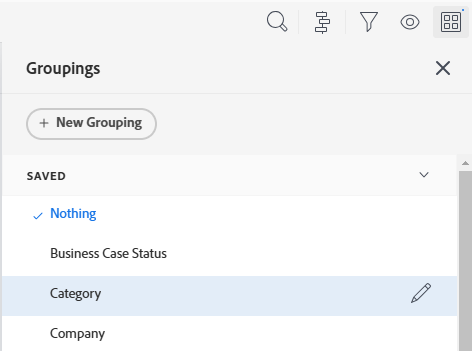

# Modificare raggruppamenti esistenti

<!-- Audited: 11/2024 -->

<!--NOTE: This is the third part of a former article split in 3: two how-tos and one reference article about creating and customizing groupings)-->

Puoi personalizzare un raggruppamento esistente che hai creato originariamente o che è stato condiviso con te. Quindi puoi salvarlo come nuovo raggruppamento.

## Requisiti di accesso

+++ Espandi per visualizzare i requisiti di accesso per la funzionalità descritta in questo articolo. 

<table style="table-layout:auto"> 
 <col> 
 <col> 
 <tbody> 
  <tr> 
   <td role="rowheader">Pacchetto Adobe Workfront</td> 
   <td> 
Qualsiasi
 </td> 
  </tr> 
  <tr> 
   <td role="rowheader">Licenza di Adobe Workfront</strong></td> 
   <td> 
    
Collaboratore o successiva

    
Richiedente o successiva

   </td>
  </tr> 
  <tr> 
   <td role="rowheader">Configurazioni del livello di accesso</td> 
   <td> 
Modifica accesso a Filtri, Viste, Raggruppamenti
 
Modificare l’accesso a Rapporti, Dashboard, Calendari per modificare un raggruppamento in un rapporto

   </td> 
  </tr> 
  <tr> 
   <td role="rowheader">Autorizzazioni sugli oggetti</td> 
    <td> 
Gestire le autorizzazioni per un report per modificare un raggruppamento in un report
 
Gestire le autorizzazioni per un raggruppamento
</td> 
   </td> 
  </tr> 
 </tbody> 
</table>

Per ulteriori dettagli sulle informazioni contenute in questa tabella, consulta [Requisiti di accesso nella documentazione Workfront](/help/quicksilver/administration-and-setup/add-users/access-levels-and-object-permissions/access-level-requirements-in-documentation.md).
+++

## Prerequisiti

È necessario creare un raggruppamento prima di poterlo modificare.

Per informazioni sulla creazione di un raggruppamento, vedere [Creare raggruppamenti in Adobe Workfront](../../../reports-and-dashboards/reports/reporting-elements/create-groupings.md).

## Passaggi pratici

1. Passare a un elenco di oggetti contenente il raggruppamento che si desidera personalizzare.
1. Fai clic sull&#39;icona **Raggruppamento**.
1. Seleziona il raggruppamento da personalizzare, quindi fai clic sull&#39;icona **Modifica** .

   

   Viene aperto il generatore di interfacce per personalizzare il raggruppamento.

1. Nella sezione **Anteprima raggruppamento** fare clic su **Aggiungi raggruppamento** per definire la modalità di organizzazione delle informazioni nel report. Di seguito è riportata un’anteprima dell’aspetto del raggruppamento nel rapporto.

1. Iniziare a digitare il nome del campo che rappresenta la modalità di organizzazione delle informazioni nel report, quindi fare clic su di esso quando viene visualizzato nell&#39;elenco a discesa.
1. (Facoltativo e condizionale) Quando visualizzi un elenco aggiornato, seleziona **Comprimi questo raggruppamento per impostazione predefinita** se desideri che i risultati del raggruppamento vengano visualizzati compressi anziché espansi. Questa impostazione è disabilitata per impostazione predefinita e i risultati del raggruppamento vengono sempre visualizzati nell&#39;elenco espanso.

   Per informazioni sugli elenchi aggiornati e legacy, vedere la sezione &quot;Differenza tra gli elenchi aggiornati e legacy&quot; nell&#39;articolo [Introduzione agli elenchi in Adobe Workfront](../../../workfront-basics/navigate-workfront/use-lists/view-items-in-a-list.md).

   <!--
   
(NOTE: the tips repeat in the Create grouping article and Common uses of text mode)

   -->

   >[!TIP]
   >
   >* Quando si modificano manualmente i raggruppamenti durante la visualizzazione di un elenco, Workfront ricorda la preferenza manuale fino alla disconnessione. Quando effettui di nuovo l’accesso, l’elenco viene visualizzato in base a questa impostazione.
   >* I risultati di un raggruppamento vengono sempre visualizzati in modalità espansa dopo essere stati accessibili da un elemento del grafico o in un elenco legacy. In questi casi, questa impostazione viene ignorata.

1. Ripeti i passaggi 4, 5 e 6 per definire raggruppamenti aggiuntivi.\
   È possibile definire fino a tre raggruppamenti per organizzare le informazioni. È possibile organizzare ulteriormente le informazioni con un massimo di quattro raggruppamenti creando un rapporto matrice. Per ulteriori informazioni sui report matrice, vedere [Creare un report matrice](../../../reports-and-dashboards/reports/creating-and-managing-reports/create-matrix-report.md).

1. Fai clic su **Salva raggruppamento** per sostituire il raggruppamento corrente con le modifiche.
