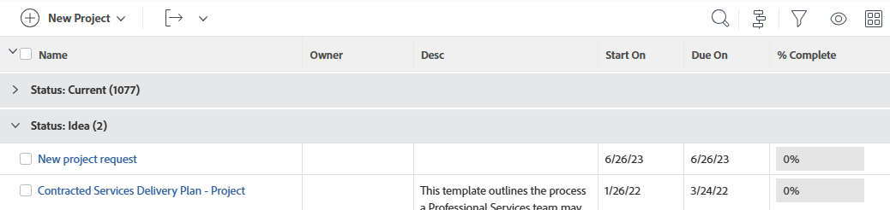

# Panoramica sui raggruppamenti in Adobe Workfront

<!-- Audited: 11/2024 -->

<!--(NOTE: This article was supposed to be replaced by "Groupings overview", but decided to keep this here because this is linked in too many places. "Create groupings" and "Edit existing groupings" have been added also (with videos) to replace portions of the old content here.)-->

È possibile aggiungere raggruppamenti per gestire il layout delle informazioni nei report e negli elenchi.

È possibile aggiungere raggruppamenti ai rapporti nei modi seguenti:

* Puoi creare i raggruppamenti modificando quelli esistenti.

  Per informazioni sulla personalizzazione di un raggruppamento esistente, vedere [Modifica raggruppamenti esistenti](../../../reports-and-dashboards/reports/reporting-elements/edit-existing-groupings.md).

* Puoi creare raggruppamenti da zero.

  Per informazioni sulla creazione di un raggruppamento da zero, vedere [Creare raggruppamenti in Adobe Workfront](../../../reports-and-dashboards/reports/reporting-elements/create-groupings.md).

Per impostazione predefinita, i raggruppamenti sono evidenziati in grigio nel report o nell’elenco. I risultati del report o dell&#39;elenco sono elencati nel relativo raggruppamento, senza evidenziarli.

Puoi aggiungere fino a tre raggruppamenti a un rapporto. È possibile organizzare le informazioni con un massimo di quattro raggruppamenti creando un rapporto matrice. Per ulteriori informazioni sui report matrice, vedere [Creare un report matrice](../../../reports-and-dashboards/reports/creating-and-managing-reports/create-matrix-report.md).

Il numero tra parentesi che segue il nome del raggruppamento rappresenta il numero di risultati del raggruppamento. Se il report si estende su più pagine, assicurati di visualizzare *Tutti* i risultati nel report o nell&#39;elenco per ottenere un conteggio accurato dei risultati in ogni raggruppamento.

Quando si lavora con i raggruppamenti, considera quanto segue:

* È possibile personalizzare le informazioni nei raggruppamenti esistenti. Anche tutti gli utenti che possono visualizzare i raggruppamenti possono visualizzare le modifiche.
* L’amministratore di Workfront deve concedere l’accesso a Modifica filtri, viste e raggruppamenti per creare i raggruppamenti.

  Per informazioni sulla concessione dell&#39;accesso a Filtri, Viste e Raggruppamenti, vedere [Concedere l&#39;accesso a filtri, viste e raggruppamenti](../../../administration-and-setup/add-users/configure-and-grant-access/grant-access-fvg.md).

* Il livello di autorizzazioni per un raggruppamento determina il modo in cui viene salvato il raggruppamento. Se il raggruppamento è stato creato in origine, è possibile salvare le modifiche, altrimenti verrà richiesto di salvare una versione del raggruppamento. Le modifiche apportate a un raggruppamento condiviso con altri utenti hanno un impatto anche su di essi.
* Puoi personalizzare un raggruppamento condiviso con te solo se l’utente che lo ha condiviso ti ha concesso l’accesso Gestisci. Per informazioni sulla condivisione di un raggruppamento, vedere [Condividere un filtro, una visualizzazione o un raggruppamento](../../../reports-and-dashboards/reports/reporting-elements/share-filter-view-grouping.md).
* Impossibile modificare un raggruppamento in linea.
* Non è possibile eseguire il raggruppamento in base a campi personalizzati a selezione multipla, ad esempio caselle di controllo, o in base a campi che possono avere più valori, ad esempio Gestione risorse DITA.

## Informazioni aggiuntive sui raggruppamenti

È possibile gestire ulteriormente le informazioni del rapporto quando si utilizzano i raggruppamenti aggregando i valori in ogni colonna della riga Raggruppamento e ordinando le informazioni in base al campo del raggruppamento. È inoltre possibile rimuovere un raggruppamento quando non è più necessario.

* [Aggregare valori in raggruppamenti](#aggregate-values-in-groupings)
* [Ordina per raggruppamento](#sort-by-a-grouping)
* [Rimuovere un raggruppamento](#remove-a-grouping)

### Aggregare i valori nei raggruppamenti {#aggregate-values-in-groupings}

È possibile aggregare i dati visualizzati nel report nella riga di raggruppamento riepilogando i valori in ogni colonna del report. Per ulteriori informazioni sul riepilogo dei dati delle colonne in un raggruppamento, vedere [Panoramica delle visualizzazioni in Adobe Workfront](../../../reports-and-dashboards/reports/reporting-elements/views-overview.md).

>[!NOTE]
>
>Le eccezioni seguenti si applicano agli oggetti padre (ad esempio, attività padre) quando si aggregano i valori per i campi seguenti in >raggruppamenti:
>
>* Tutti i campi relativi a numero, valuta e data, ad eccezione delle ore effettive, aggregano i valori solo per le attività figlio e le attività autonome. Non aggregano i valori per le attività padre o i padri dei padri. L&#39;aggregazione dei campi numerici, di valuta e di data in un elenco che include solo le attività padre non comporta la visualizzazione di un valore aggregato nella barra di raggruppamento.
>
>* Le ore effettive aggregano i valori per le attività principali padre e autonome, ma non aggregano i numeri delle attività figlio o padre delle attività padre. <!--Examples of Actual hours include Planned/Actual Labor Cost, Planned/Actual Expense Cost, Planned/Actual Cost, and Planned Hours.-->
>
>* I campi dati personalizzati per i valori numerici e di valuta aggregano tutte le attività: padri, figli, padri e attività autonome.

### Ordina per raggruppamento {#sort-by-a-grouping}

Impossibile ordinare i raggruppamenti. È possibile ordinare le visualizzazioni. Per ordinare un elenco in base al valore acquisito nel raggruppamento, è necessario includere lo stesso valore in una delle colonne della visualizzazione e applicare l&#39;ordinamento nella visualizzazione. In questo modo, l’elenco ordina indirettamente in base al valore del raggruppamento (ordina in base al valore nella vista che viene acquisito anche nel raggruppamento). Per ulteriori informazioni sulla creazione di visualizzazioni e sull&#39;ordinamento per valori all&#39;interno delle visualizzazioni, vedere [Panoramica delle visualizzazioni in Adobe Workfront](../../../reports-and-dashboards/reports/reporting-elements/views-overview.md).

### Rimuovere un raggruppamento {#remove-a-grouping}

La modalità di rimozione di un raggruppamento dipende dal fatto che il raggruppamento sia stato creato inizialmente o che il raggruppamento sia stato condiviso con te. Non è possibile rimuovere un raggruppamento predefinito.

* **Se il raggruppamento è stato creato e rimosso**, il raggruppamento verrà rimosso dal sistema Workfront. Il raggruppamento non è più disponibile per gli utenti con cui l’hai condiviso in precedenza.
* **Se il raggruppamento è stato condiviso con te e lo rimuovi**, il raggruppamento verrà rimosso solo per te. L’utente che l’ha creato originariamente e tutti gli altri utenti con cui è stato condiviso hanno ancora accesso al raggruppamento.

Per informazioni sulla rimozione di un raggruppamento, vedere l&#39;articolo [Rimuovere filtri, visualizzazioni e raggruppamenti](../../../reports-and-dashboards/reports/reporting-elements/remove-filters-views-groupings.md).

<!--Original note

The following exceptions apply for parent objects (for example, parent tasks) when you are aggregating values for the following fields in groupings:
All the number and currency fields except Actual Hours (for example, Planned/ Actual Labor Cost, Planned/ Actual Expense Cost, Planned/ Actual Cost, Planned Hours) aggregate only the values for the children tasks, and standalone tasks. They do not aggregate the values for the parent tasks or parents of parents.
Actual Hours aggregate the values for the main parent and the standalone tasks; they do not aggregate the numbers for the parents of parent tasks or the children tasks.
Custom data fields for number and currency values aggregate all tasks: parents, children, parents of parents, and standalone tasks.

-->
