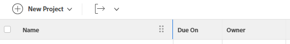

# Modifica la larghezza e l&#39;ordine delle colonne

Di seguito sono riportate le linee guida sul funzionamento delle larghezze delle colonne in Adobe Workfront:

* Per impostazione predefinita, Workfront definisce la larghezza delle colonne in elenchi e rapporti.
* Workfront regola automaticamente la larghezza delle colonne in base al `valueformat`informazioni in tutti gli elenchi e i report, se non diversamente specificato nella modalità testo della colonna.

   >[!NOTE]
   >
   >Workfront non regola la larghezza delle colonne in base al `valueformat` negli elenchi disponibili nelle aree Configura e Rapporti.

   Il `valueformat` value definisce il tipo di informazioni visualizzate nella colonna. Ad esempio, le colonne che visualizzano un numero sono più strette delle colonne che visualizzano il campo Descrizione.

* Puoi personalizzare la larghezza delle colonne negli elenchi e nei rapporti di Workfront in base alle tue esigenze, a seconda del tipo di informazioni che desideri visualizzare nelle colonne.

   È possibile modificare temporaneamente la larghezza delle colonne durante la visualizzazione di un elenco o di un report oppure in modo permanente, modificando la larghezza della colonna nel generatore di viste. Per informazioni sulla modifica temporanea della larghezza delle colonne, vedere [Considerazioni durante la modifica temporanea della larghezza e dell’ordine delle colonne](#considerations-when-temporarily-modifying-the-width-and-order-of-columns) in questo articolo.

* Le colonne visualizzate nelle viste incorporate hanno larghezze precedentemente definite da Workfront e sono codificate a livello di codice. Per modificare queste larghezze, dovete aggiornare manualmente la larghezza di queste colonne utilizzando la modalità testo nel generatore di viste.

   Per informazioni sulla modifica della colonna in modalità testo, vedere [Visualizza: modifica definitivamente la larghezza di una colonna](../../../reports-and-dashboards/reports/custom-view-filter-grouping-samples/view-edit-column-width-permanently.md).

## Requisiti di accesso

Per eseguire i passaggi descritti in questo articolo, è necessario disporre dei seguenti diritti di accesso:

<table style="table-layout:auto"> 
 <col> 
 <col> 
 <tbody> 
  <tr> 
   <td role="rowheader"><strong>Piano Adobe Workfront*</strong></td> 
   <td> 
Qualsiasi
 </td> 
  </tr> 
  <tr> 
   <td role="rowheader"><strong>Licenza Adobe Workfront*</strong></td> 
   <td> 
Richiedi o superiore 
 </td> 
  </tr> 
  <tr> 
   <td role="rowheader"><strong>Configurazioni del livello di accesso*</strong></td> 
   <td> 
Modifica accesso a Filtri, Viste, Raggruppamenti
 
Modificare l’accesso a Rapporti, Dashboard, Calendari per modificare la visualizzazione in un rapporto
 
Nota: se non disponi ancora dell’accesso, chiedi all’amministratore di Workfront se ha impostato restrizioni aggiuntive nel tuo livello di accesso. Per informazioni su come un amministratore di Workfront può modificare il tuo livello di accesso, consulta <a href="../../../administration-and-setup/add-users/configure-and-grant-access/create-modify-access-levels.md" class="MCXref xref">Creare o modificare livelli di accesso personalizzati</a>.
 </td> 
  </tr> 
  <tr> 
   <td role="rowheader"><strong>Autorizzazioni oggetto</strong></td> 
   <td> 
Gestire le autorizzazioni per un report per modificare una visualizzazione in un report
 
Gestire le autorizzazioni per una visualizzazione per modificarla
 
Per informazioni sulla richiesta di accesso aggiuntivo, consulta <a href="../../../workfront-basics/grant-and-request-access-to-objects/request-access.md" class="MCXref xref">Richiedi accesso agli oggetti </a>.
 </td> 
  </tr> 
 </tbody> 
</table>

&#42;Per conoscere il piano, il tipo di licenza o l&#39;accesso di cui si dispone, contattare l&#39;amministratore Workfront.

## Modifica la larghezza e l&#39;ordine delle colonne

Puoi modificare la larghezza e l’ordine delle colonne nei rapporti nei seguenti modi:

* [Modifica temporaneamente la larghezza e l&#39;ordine delle colonne](#modify-width-and-order-of-columns-temporarily)
* [Modifica definitivamente la larghezza e l&#39;ordine delle colonne](#modify-width-and-order-of-columns-permanently)

### Modifica temporaneamente la larghezza e l&#39;ordine delle colonne {#modify-width-and-order-of-columns-temporarily}

È possibile trascinare i bordi delle colonne per ridimensionare le colonne e trascinare le colonne per riordinarle temporaneamente nella maggior parte degli elenchi del sito Workfront. Sono inclusi report, visualizzazioni, report sulle dashboard e la visualizzazione Gantt.

Per ulteriori informazioni sugli elenchi di Workfront, consulta l’articolo [Introduzione agli elenchi in Adobe Workfront](../../../workfront-basics/navigate-workfront/use-lists/view-items-in-a-list.md).

* [Considerazioni durante la modifica temporanea della larghezza e dell’ordine delle colonne](#considerations-when-temporarily-modifying-the-width-and-order-of-columns)
* [Ridimensionare temporaneamente le colonne](#resize-columns-temporarily)
* [Riordina temporaneamente le colonne](#reorder-columns-temporarily)

#### Considerazioni durante la modifica temporanea della larghezza e dell’ordine delle colonne {#considerations-when-temporarily-modifying-the-width-and-order-of-columns}

È possibile modificare temporaneamente la larghezza e l&#39;ordine delle colonne di un elenco senza modificarne la visualizzazione.

Quando ridimensionate e ordinate temporaneamente le colonne, tenete presente quanto segue:

* Durante il ridimensionamento delle colonne, le nuove dimensioni delle colonne vengono memorizzate nell&#39;archivio locale del browser e salvate per impostazione predefinita. Se si utilizza un browser diverso, si cancella la cache o si sfogliano i dati, le dimensioni delle colonne vengono ripristinate a quelle predefinite. Quando si aggiorna la pagina, vengono mantenute le modifiche apportate alla larghezza delle colonne.
* Quando riordini le colonne, l’ordine scelto viene mantenuto solo fino a quando non esci dall’elenco o non aggiorni la pagina del browser. Dopo essere usciti dall’elenco o aver aggiornato la pagina del browser, le colonne tornano nell’ordine predefinito.
* Per ottenere prestazioni ottimali, le colonne da riordinare non devono contenere più di 100 elementi nell’elenco.
* Quando si ridimensionano le colonne, le modifiche vengono applicate solo alla visualizzazione attualmente in uso e sono visibili solo all&#39;utente. La condivisione di una visualizzazione con un altro utente non comporta la condivisione delle dimensioni delle colonne definite.
* Dopo aver ridimensionato una colonna trascinandone il bordo verso destra, la larghezza della colonna adiacente viene mantenuta, ad eccezione dei seguenti elementi:

   * L’area Configurazione
   * Area Rapporti
   * Elenchi e report di documenti

   >[!NOTE]
   >
   >Non è possibile spostare il bordo sinistro di una colonna oltre il bordo sinistro della colonna adiacente in alcun elenco.

* Se si esporta un elenco in un file, l&#39;ordine temporaneo delle colonne non viene trasferito nel file esportato. Il file esportato visualizza l&#39;ordine delle colonne nell&#39;elenco originale prima che le colonne siano state riordinate.

Per ulteriori informazioni sull’esportazione di dati da elenchi e rapporti, consulta l’articolo [Esporta dati](../../../reports-and-dashboards/reports/creating-and-managing-reports/export-data.md).

#### Ridimensionare temporaneamente le colonne {#resize-columns-temporarily}

1. Passare all&#39;elenco da modificare.
1. Trascinare il bordo di una colonna fino a raggiungere le dimensioni desiderate.\
   

#### Riordina temporaneamente le colonne {#reorder-columns-temporarily}

1. Passa all’elenco da modificare.
1. Fare clic su una colonna che si desidera spostare in un&#39;altra posizione per selezionarla.
1. Trascinare la colonna nella posizione corretta.
1. Rilascia la colonna nella posizione, per spostarla.

   

>[!TIP]
>
>Questa funzione è particolarmente utile quando si visualizzano contemporaneamente il diagramma di Gantt e la vista a elenco. Quando si visualizza il diagramma di Gantt, le colonne possono risultare nascoste. Per visualizzare una colonna mentre è visualizzato il diagramma di Gantt, trascinare la colonna che si desidera visualizzare in modo che venga visualizzata sul lato sinistro della pagina.

### Modifica definitivamente la larghezza e l&#39;ordine delle colonne {#modify-width-and-order-of-columns-permanently}

Per riordinare definitivamente le colonne, consulta la sezione [Creare o personalizzare una visualizzazione standard](../../../reports-and-dashboards/reports/reporting-elements/views-overview.md#customizing-a-standard-view) nell’articolo [Panoramica delle visualizzazioni in Adobe Workfront](../../../reports-and-dashboards/reports/reporting-elements/views-overview.md).

È possibile modificare in modo permanente la larghezza di una colonna solo utilizzando la modalità testo.

Per ulteriori informazioni sull&#39;utilizzo della modalità testo e sulla modifica definitiva della larghezza di una colonna, vedere l&#39;articolo [Panoramica sugli usi comuni della modalità testo](../../../reports-and-dashboards/reports/text-mode/understand-common-uses-text-mode.md).
