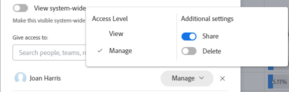

# Condividere un filtro, una visualizzazione o un raggruppamento

<!--

(NOTE: CONSIDER SPLITTING THIS in three articles for each reporting element?)

(NOTE: This is linked from the TOC article in WF Basics > permissions section)&nbsp;

-->

L’amministratore di Adobe Workfront consente agli utenti di visualizzare o modificare gli oggetti quando assegnano i livelli di accesso. Per ulteriori informazioni sulla concessione dell&#39;accesso agli oggetti, vedere [Creare o modificare livelli di accesso personalizzati](../../../administration-and-setup/add-users/configure-and-grant-access/create-modify-access-levels.md).

Oltre al livello di accesso concesso agli utenti, è possibile concedere loro anche le autorizzazioni per visualizzare o modificare oggetti specifici creati o di cui si dispone dell&#39;accesso alla condivisione. Per ulteriori informazioni sui livelli di accesso e sulle autorizzazioni, consulta [Funzionamento congiunto dei livelli di accesso e delle autorizzazioni](../../../administration-and-setup/add-users/access-levels-and-object-permissions/how-access-levels-permissions-work-together.md).

Puoi condividere filtri, viste e raggruppamenti a cui hai accesso per visualizzarli con altri utenti.

Quando un filtro, una visualizzazione o un raggruppamento è condiviso con l&#39;utente, è possibile applicarlo agli elenchi. A seconda dell’accesso concesso all’utente, potrebbe essere possibile modificarlo e condividerlo con altri utenti.

Per informazioni su come creare un filtro, una visualizzazione o un raggruppamento, vedere gli articoli seguenti:

* [Panoramica sui filtri](../../../reports-and-dashboards/reports/reporting-elements/filters-overview.md)
* [Panoramica delle visualizzazioni in Adobe Workfront](../../../reports-and-dashboards/reports/reporting-elements/views-overview.md)
* [Panoramica sui raggruppamenti in Adobe Workfront](../../../reports-and-dashboards/reports/reporting-elements/groupings-overview.md)

## Requisiti di accesso

Devi avere i seguenti:

<table style="table-layout:auto"> 
 <col> 
 <col> 
 <tbody> 
  <tr> 
   <td role="rowheader"><strong>Piano Adobe Workfront*</strong></td> 
   <td> 
Qualsiasi 
 </td> 
  </tr> 
  <tr> 
   <td role="rowheader"><strong>Licenza Adobe Workfront*</strong></td> 
   <td> 
Richiedi o superiore
 </td> 
  </tr> 
  <tr> 
   <td role="rowheader"><strong>Configurazioni del livello di accesso*</strong></td> 
   <td> 
Accesso di visualizzazione o superiore a filtri, visualizzazioni, raggruppamenti
 
Nota: se non disponi ancora dell’accesso, chiedi all’amministratore di Workfront se ha impostato restrizioni aggiuntive nel tuo livello di accesso. Per informazioni su come un amministratore di Workfront può modificare il tuo livello di accesso, consulta <a href="../../../administration-and-setup/add-users/configure-and-grant-access/create-modify-access-levels.md" class="MCXref xref">Creare o modificare livelli di accesso personalizzati</a>.
 </td> 
  </tr> 
  <tr> 
   <td role="rowheader"><strong>Autorizzazioni oggetto</strong></td> 
   <td> 
Autorizzazioni di visualizzazione o di livello superiore con accesso alla condivisione di una visualizzazione, un filtro o un raggruppamento
 
Per informazioni sulla richiesta di accesso aggiuntivo, consulta <a href="../../../workfront-basics/grant-and-request-access-to-objects/request-access.md" class="MCXref xref">Richiedi accesso agli oggetti </a>.
 </td> 
  </tr> 
 </tbody> 
</table>

&#42;Per conoscere il piano, il tipo di licenza o l&#39;accesso di cui si dispone, contattare l&#39;amministratore Workfront.

## Condividere un filtro, una visualizzazione o un raggruppamento

<!--

(NOTE: when the beta filters/ groupings come out either consider splitting this in different kinds of FVGs or splitting this article in FVGs for showing sharing on each one of them??)

-->

La condivisione di filtri negli elenchi di selezione varia a seconda dell’interfaccia utilizzata per condividere il filtro da: standard o legacy. Per informazioni sui tipi di interfacce per la creazione di filtri, vedere [Creare o modificare filtri in Adobe Workfront](/help/quicksilver/reports-and-dashboards/reports/reporting-elements/create-filters.md).

Puoi condividere viste e raggruppamenti solo nell’interfaccia legacy.

### Condivisione di filtri tramite l’interfaccia standard di generazione

Nell’interfaccia standard puoi condividere un filtro da elenchi di progetti, attività, problemi, portfolio, programmi, utenti, modelli o gruppi. L’interfaccia standard del generatore di filtri non è disponibile per altri oggetti o per viste o raggruppamenti.

Condividi un filtro tramite l’interfaccia standard di generazione:

1. Consente di passare a un elenco di progetti, attività o problemi.
1. Fai clic su **Filtro** icona .

   

1. Rivedi i seguenti elenchi di filtri:

   <table style="table-layout:auto">
   <col>
   <col>
   <tbody>
   <tr>
   <td role="rowheader"><strong>Preferiti</strong></td>
   <td>Filtri contrassegnati come preferiti. Quando si preferisce un filtro, la posizione originale viene visualizzata sotto il nome del filtro e viene nascosta dall'elenco originale a meno che non venga rimosso come preferito.</td>
   </tr>
   <tr>
   <td role="rowheader"><strong>Salvato</strong></td>
   <td>Filtri creati e salvati personalmente. Per impostazione predefinita, in questo elenco vengono visualizzati i filtri salvati in ordine di quelli salvati più di recente, ma i nomi dei filtri possono essere trascinati per riordinare manualmente l’elenco.</td>
   </tr>
   <tr>
   <td role="rowheader"><strong>Impostazioni predefinite di sistema</strong></td>
   <td>Filtri predefiniti di Workfront e filtri aggiunti dall’amministratore Workfront all’elenco dei filtri, a livello di sistema o nel modello di layout.</td>
   </tr>
   <tr>
   <td role="rowheader"><strong>Condivisi con me</strong></td>
   <td>Filtri creati e condivisi da altri utenti con te o condivisi a livello di sistema.</td>
   </tr>
   </tbody>
   </table>

1. Passa il puntatore del mouse su un filtro a cui hai accesso per visualizzare e condividere almeno, quindi fai clic sul pulsante **Altro** menu , quindi fai clic su **Condividi**.

   

   Viene visualizzata la casella Condivisione filtro.

1. Abilita **Visualizza a livello di sistema** impostazione. In questo modo, chiunque disponga dell’autorizzazione Workfront potrà visualizzare il filtro.

   >[!IMPORTANT]
   >
   >Usare questa impostazione con cautela. L’aggiunta di molti filtri per tutti gli utenti ridurrà l’esperienza del filtro e renderà più difficile trovare i filtri.

   Oppure inizia a digitare i nomi di utenti, team, ruoli, gruppi o aziende con cui desideri condividere in **Concedi accesso a** campo.

   

1. (Facoltativo) Fai clic sulla freccia rivolta a destra accanto al nome di un’entità per modificare le relative autorizzazioni per il filtro, quindi abilita **Visualizza** o **Gestisci** opzione. **Visualizza** è il valore predefinito.

   

1. (Facoltativo) Abilita o disabilita le autorizzazioni aggiuntive per un’entità effettuando una delle seguenti operazioni:

   1. Clic **Visualizza** e disattiva **Condividi** opzione. È attivata per impostazione predefinita.
   1. Clic **Gestisci** e disabilitare **Condividi** o **Elimina** opzione. Sono attivati per impostazione predefinita.

      >[!NOTE]
      >
      >Se abiliti l’accesso Gestisci con l’opzione Elimina, questi utenti potranno eliminare il filtro da tutti gli utenti, anche se non sono i proprietari del filtro.

   >[!TIP]
   >
   >Gli utenti non possono ricevere un’autorizzazione superiore al loro livello di accesso. Se non hanno accesso a Modifica filtri nel loro livello di accesso, non possono ricevere le autorizzazioni per gestire un filtro. Workfront disabilita l’opzione Gestisci per questi utenti e l’opzione è disabilitata.

1. Clic **Condividi**. Il filtro viene condiviso con le entità specificate.

   >[!TIP]
   >
   >La condivisione con i gruppi consente di assegnare le autorizzazioni per il filtro ai membri del gruppo e di tutti i sottogruppi.

   I filtri condivisi vengono visualizzati in **Condiviso con me** sezione del pannello dei filtri per tali entità.

   

### Condividere filtri, visualizzazioni e raggruppamenti utilizzando l’interfaccia legacy

La condivisione di filtri, viste e raggruppamenti nell’interfaccia legacy è identica.

1. Consente di passare a un elenco di oggetti o a un report.
1. (Condizionale) Da un elenco, fai clic su **Filtro**, **Visualizza**, o **Raggruppamento** , quindi passare il puntatore del mouse sul filtro, la visualizzazione o il raggruppamento che si desidera condividere, fare clic sul pulsante **Altro** icona , quindi **Condividi**.

   Da un rapporto, fai clic su **Filtro**, **Visualizza**, o **Raggruppamento** , quindi selezionare il filtro, la visualizzazione o il raggruppamento da condividere.

1. (Condizionale) Se condividi da un rapporto, fai clic sul pulsante **Filtro**, **Visualizza**, o **Raggruppamento** nuovamente, quindi fai clic su **Condividi filtro**, **Condividi visualizzazione**, o **Condividi raggruppamento**.\
   Il **Filtra accesso**, **Accesso visualizzazione**, o **Accesso al raggruppamento** viene visualizzata.

   

1. Completa una delle seguenti operazioni, a seconda di chi desideri condividere con:

   **Per condividere con singoli utenti, team, ruoli, gruppi o aziende:** Nel campo fornito, inizia a digitare il nome dell’utente, del team, della mansione, del gruppo o dell’azienda con cui desideri condividere il nome, quindi fai clic sul nome quando viene visualizzato nell’elenco a discesa.\
   Ripeti questa procedura per condividere l’accesso con più utenti, team, ruoli, gruppi o aziende.

   >[!TIP]
   >
   >La condivisione con i gruppi consente di assegnare le autorizzazioni per il filtro, la visualizzazione o il raggruppamento ai membri del gruppo e di tutti i sottogruppi.

   **Per condividere con tutti gli utenti del sistema:** Fai clic su **Impostazioni** , quindi fai clic su **Rendi visibile a livello di sistema**.\
   Per rendere disponibile questa opzione, l&#39;amministratore deve selezionare l&#39;opzione Condividi a livello di sistema. Per ulteriori informazioni, consulta gli articoli [Creare o modificare livelli di accesso personalizzati](../../../administration-and-setup/add-users/configure-and-grant-access/create-modify-access-levels.md) e [Condividere report, dashboard e calendari](../../../workfront-basics/grant-and-request-access-to-objects/permissions-reports-dashboards-calendars.md).

1. (Condizionale) Se condividi con singoli utenti, team, ruoli, gruppi o società, fai clic sul menu a discesa per definire il livello di accesso che desideri concedere.

   Puoi scegliere tra le seguenti opzioni:

   <table style="table-layout:auto"> 
    <col> 
    <col> 
    <tbody> 
     <tr> 
      <td role="rowheader"><strong>Visualizzare</strong></td> 
      <td> 
Selezionare questa opzione per consentire ai destinatari della condivisione di utilizzare solo il filtro, la visualizzazione o il raggruppamento condivisi. Quando questa opzione è selezionata, i destinatari non possono apportare modifiche all’elemento condiviso.
 </td> 
     </tr> 
     <tr> 
      <td role="rowheader"><strong>Gestire</strong></td> 
      <td> 
Selezionare questa opzione per consentire ai destinatari della condivisione di utilizzare e modificare il filtro, la visualizzazione o il raggruppamento condivisi.
 </td> 
     </tr> 
     <tr> 
      <td role="rowheader"><strong>Condividi</strong></td> 
      <td> 
Clic <strong>Impostazioni avanzate</strong>, quindi selezionare o deselezionare <strong>Condividi</strong> a seconda che si desideri che i destinatari possano condividere con altri.
 </td> 
     </tr> 
    </tbody> 
   </table>

1. Fai clic su **Salva**.

   Gli utenti con cui hai condiviso il filtro, la visualizzazione o il raggruppamento possono accedervi facendo clic sul pulsante **Filtro**, **Visualizza**, o **Raggruppamento** menu a discesa o icona e scorrere verso il basso fino al **Condiviso con me** sezione.

