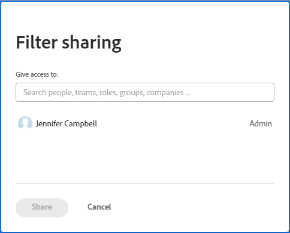

# Condividere un filtro, una visualizzazione o un raggruppamento

<!--

(NOTE: CONSIDER SPLITTING THIS in three articles for each reporting element?)

(NOTE: This is linked from the TOC article in WF Basics > permissions section)&nbsp;

-->

L’amministratore Adobe Workfront consente agli utenti di visualizzare o modificare gli oggetti quando assegnano i livelli di accesso. Per ulteriori informazioni sulla concessione dell&#39;accesso agli oggetti, vedere [Creare o modificare livelli di accesso personalizzati](../../../administration-and-setup/add-users/configure-and-grant-access/create-modify-access-levels.md).

Oltre al livello di accesso concesso agli utenti, puoi anche concedere loro le autorizzazioni per visualizzare o modificare oggetti specifici creati o con accesso da condividere. Per ulteriori informazioni sui livelli di accesso e le autorizzazioni, consulta [Funzionamento congiunto dei livelli di accesso e delle autorizzazioni](../../../administration-and-setup/add-users/access-levels-and-object-permissions/how-access-levels-permissions-work-together.md).

Puoi condividere con altri utenti filtri, viste e raggruppamenti a cui hai accesso per la visualizzazione.

Quando condividi con te un filtro, una visualizzazione o un raggruppamento, puoi applicare tale filtro, visualizzazione o raggruppamento agli elenchi. A seconda dell’accesso concesso, potresti essere in grado di modificarlo e condividerlo con altri utenti.

Per informazioni su come creare un filtro, una visualizzazione o un raggruppamento, consulta i seguenti articoli:

* [Panoramica sui filtri in Adobe Workfront](../../../reports-and-dashboards/reports/reporting-elements/filters-overview.md)
* [Panoramica delle visualizzazioni in Adobe Workfront](../../../reports-and-dashboards/reports/reporting-elements/views-overview.md)
* [Panoramica sui raggruppamenti in Adobe Workfront](../../../reports-and-dashboards/reports/reporting-elements/groupings-overview.md)

## Requisiti di accesso

Devi disporre dei seguenti elementi:

<table style="table-layout:auto"> 
 <col> 
 <col> 
 <tbody> 
  <tr> 
   <td role="rowheader"><strong>piano Adobe Workfront*</strong></td> 
   <td> 
Qualsiasi 
 </td> 
  </tr> 
  <tr> 
   <td role="rowheader"><strong>Licenza Adobe Workfront*</strong></td> 
   <td> 
Richiesta o superiore
 </td> 
  </tr> 
  <tr> 
   <td role="rowheader"><strong>Configurazioni a livello di accesso*</strong></td> 
   <td> 
Visualizza o un accesso superiore a Filtri, Visualizzazioni, Gruppi
 
Nota: Se non disponi ancora dell’accesso, chiedi all’amministratore Workfront se ha impostato ulteriori restrizioni nel livello di accesso. Per informazioni su come un amministratore Workfront può modificare il livello di accesso, consulta <a href="../../../administration-and-setup/add-users/configure-and-grant-access/create-modify-access-levels.md" class="MCXref xref">Creare o modificare livelli di accesso personalizzati</a>.
 </td> 
  </tr> 
  <tr> 
   <td role="rowheader"><strong>Autorizzazioni oggetto</strong></td> 
   <td> 
Visualizza o autorizzazioni superiori con accesso alla condivisione su una visualizzazione, un filtro o un raggruppamento
 
Per informazioni sulla richiesta di accesso aggiuntivo, vedi <a href="../../../workfront-basics/grant-and-request-access-to-objects/request-access.md" class="MCXref xref">Richiedere l’accesso agli oggetti </a>.
 </td> 
  </tr> 
 </tbody> 
</table>

&#42;Per informazioni sul piano, il tipo di licenza o l&#39;accesso, contattare l&#39;amministratore Workfront.

## Condividere un filtro, una visualizzazione o un raggruppamento

<!--

(NOTE: when the beta filters/ groupings come out either consider splitting this in different kinds of FVGs or splitting this article in FVGs for showing sharing on each one of them??)

-->

La condivisione di filtri negli elenchi selezionati varia a seconda dell’interfaccia utilizzata per condividere il filtro: standard o legacy. Per informazioni sui tipi di interfacce per la creazione di filtri, vedi [Creare o modificare filtri in Adobe Workfront](/help/quicksilver/reports-and-dashboards/reports/reporting-elements/create-filters.md).

Puoi condividere viste e raggruppamenti solo nell’interfaccia legacy.

### Condivisione di filtri tramite l’interfaccia standard di generazione

È possibile condividere un filtro nell’interfaccia standard da elenchi di progetti, attività, problemi, portfolio, programmi, utenti, modelli o gruppi. L’interfaccia standard del generatore per i filtri non è disponibile per altri oggetti o per viste o raggruppamenti.

Condividi un filtro utilizzando l’interfaccia standard del generatore:

1. Passare a un elenco di progetti, attività o problemi.
1. Fai clic sul pulsante **Filtro** icona .

   

1. Rivedi i seguenti elenchi di filtri:

   <table style="table-layout:auto">
   <col>
   <col>
   <tbody>
   <tr>
   <td role="rowheader"><strong>Preferiti</strong></td>
   <td>Filtri contrassegnati come preferiti. Quando si preferisce un filtro, la sua posizione originale viene visualizzata sotto il nome del filtro e viene nascosta dall'elenco originale a meno che non lo si rimuova come preferito.</td>
   </tr>
   <tr>
   <td role="rowheader"><strong>Salvato</strong></td>
   <td>Filtri creati e salvati da soli.</td>
   </tr>
   <tr>
   <td role="rowheader"><strong>Impostazioni predefinite di sistema</strong></td>
   <td>Filtri predefiniti del sistema Workfront e filtri aggiunti dall’amministratore di Workfront all’elenco dei filtri, a livello di sistema o nel modello di layout.</td>
   </tr>
   <tr>
   <td role="rowheader"><strong>Condivisi con me</strong></td>
   <td>Filtri creati e condivisi da altri utenti o condivisi a livello di sistema.</td>
   </tr>
   </tbody>
   </table>

1. Passa il puntatore del mouse su un filtro a cui puoi accedere per lo meno per visualizzarlo e condividerlo, quindi fai clic sul pulsante **Altro** menu , quindi fai clic su **Condividi**.

   

   Viene visualizzata la casella Condivisione filtro .

1. Abilita la **Visualizza a livello di sistema** impostazione. Questo consente a chiunque in Workfront di visualizzare il filtro.

   >[!IMPORTANT]
   >
   >Usa questa impostazione con cautela. L’aggiunta di molti filtri per tutti gli utenti ingombrerà l’esperienza del filtro e renderà i filtri più difficili da trovare.

   Oppure inizia a digitare i nomi di utenti, team, ruoli, gruppi o aziende con cui desideri condividere nel **Dare accesso a** campo .

   

1. (Facoltativo) Fai clic sulla freccia rivolta a destra accanto al nome di un’entità per modificare le proprie autorizzazioni al filtro, quindi attiva la **Visualizza** o **Gestisci** opzione . **Visualizza** è il valore predefinito.

   

1. (Facoltativo) Abilita o disabilita le autorizzazioni aggiuntive per un&#39;entità eseguendo una delle operazioni seguenti:

   1. Fai clic su **Visualizza** e disattivare **Condividi** opzione . È attivata per impostazione predefinita.
   1. Fai clic su **Gestisci** e disattivare **Condividi** o **Elimina** opzione . Sono attivati per impostazione predefinita.

      >[!NOTE]
      >
      >Se abiliti Gestisci accesso con l’opzione Elimina , questi utenti potranno eliminare il filtro da tutti gli utenti, anche se non sono proprietari del filtro.
   >[!TIP]
   >
   >Gli utenti non possono ricevere autorizzazioni più elevate del loro livello di accesso. Se non hanno accesso ai filtri di modifica nel loro livello di accesso, non possono ricevere le autorizzazioni per gestire un filtro. Workfront disabilita l’opzione Gestisci per questi utenti e l’opzione è disattivata.

1. Fai clic su **Condividi**. Il filtro viene condiviso con le entità specificate.

   >[!TIP]
   >
   >La condivisione con i gruppi consente di assegnare le autorizzazioni al filtro ai membri del gruppo e a tutti i sottogruppi.

   I filtri condivisi vengono visualizzati nel **Condiviso con me** della sezione del pannello dei filtri per tali entità.

   

### Condivisione di filtri, visualizzazioni e raggruppamenti tramite l’interfaccia legacy

La condivisione di filtri, visualizzazioni e raggruppamenti nell’interfaccia legacy è identica.

1. Passare a un elenco di oggetti o a un report.
1. (Condizionale) Da un elenco, fai clic sul pulsante **Filtro**, **Visualizza** oppure **Raggruppamento** quindi fai clic sul pulsante **Altro** icona , quindi **Condividi**.

   Da un rapporto, fai clic su **Filtro**, **Visualizza** oppure **Raggruppamento** dal menu a discesa, quindi seleziona il filtro, la visualizzazione o il raggruppamento che desideri condividere.

1. (Condizionale) Se condividi da un rapporto, fai clic sul pulsante **Filtro**, **Visualizza** oppure **Raggruppamento** menu a discesa, quindi fare clic **Filtro condivisione**, **Visualizzazione condivisione** oppure **Condivisione raggruppamento**.\
   La **Accesso filtro**, **Visualizza accesso** oppure **Accesso al raggruppamento** viene visualizzata la finestra di dialogo.

   

1. Completa una delle seguenti operazioni, a seconda dell’utente con cui vuoi condividerla:

   **Per condividere con singoli utenti, team, ruoli, gruppi o aziende:** Nel campo fornito, inizia a digitare il nome dell’utente, del team, del ruolo, del gruppo o della società con cui desideri condividere, quindi fai clic sul nome quando viene visualizzato nell’elenco a discesa.\
   Ripeti questo processo per condividere l’accesso con più utenti, team, ruoli, gruppi o aziende.

   >[!TIP]
   >
   >La condivisione con i gruppi consente di filtrare, visualizzare o raggruppare i membri del gruppo e di tutti i sottogruppi.

   **Per condividere con tutti gli utenti del sistema:** Fai clic sul pulsante **Impostazioni** icona, quindi fai clic su **Rendere visibile il sistema a livello di sistema**.\
   Per rendere disponibile questa opzione, l’amministratore deve selezionare l’opzione Condividi a livello di sistema. Per ulteriori informazioni, consulta gli articoli [Creare o modificare livelli di accesso personalizzati](../../../administration-and-setup/add-users/configure-and-grant-access/create-modify-access-levels.md) e [Condividere rapporti, dashboard e calendari](../../../workfront-basics/grant-and-request-access-to-objects/permissions-reports-dashboards-calendars.md).

1. (Facoltativo) Se condividi con singoli utenti, team, ruoli, gruppi o aziende, fai clic sul menu a discesa per definire il livello di accesso che desideri concedere.

   Puoi scegliere tra le seguenti opzioni:

   <table style="table-layout:auto"> 
    <col> 
    <col> 
    <tbody> 
     <tr> 
      <td role="rowheader"><strong>Visualizzare</strong></td> 
      <td> 
Selezionare questa opzione per consentire ai destinatari della condivisione di utilizzare solo il filtro, la visualizzazione o il raggruppamento condivisi. Quando questa opzione è selezionata, i destinatari non possono apportare alcuna modifica all’elemento condiviso.
 </td> 
     </tr> 
     <tr> 
      <td role="rowheader"><strong>Gestire</strong></td> 
      <td> 
Selezionare questa opzione per consentire ai destinatari della condivisione di utilizzare e modificare il filtro, la visualizzazione o il raggruppamento condivisi.
 </td> 
     </tr> 
     <tr> 
      <td role="rowheader"><strong>Condividi</strong></td> 
      <td> 
Fai clic su <strong>Impostazioni avanzate</strong>, quindi seleziona o cancella il <strong>Condividi</strong> a seconda che desideri che i destinatari siano in grado di condividere con altri.
 </td> 
     </tr> 
    </tbody> 
   </table>

1. Fai clic su **Salva**.

   Gli utenti con i quali hai condiviso il filtro, la visualizzazione o il raggruppamento possono accedervi facendo clic sul pulsante **Filtro**, **Visualizza** oppure **Raggruppamento** menu a discesa o icona e scorri verso il basso fino a **Condiviso con me** sezione .

