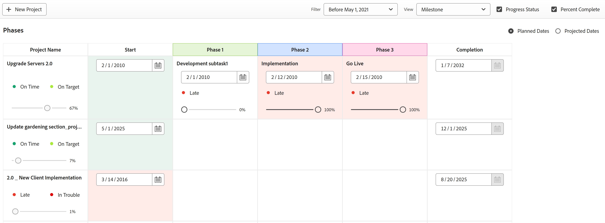

# Utilizzare la vista Milestone

<!-- Audited: 11/2024 -->

<!--remove Preview and Production mentions from the article when this comes out live-->

<!--

 

The highlighted information on this page refers to functionality not yet generally available. It is available only in the Preview environment for all customers. The same features will also be available in the Production environment for all customers after a week from the Preview release.      

For more information, see [Interface modernization](/help/quicksilver/product-announcements/product-releases/interface-modernization/interface-modernization.md).  

 
-->

Puoi applicare la vista Milestone (Attività cardine) a un elenco o a un rapporto di progetto. È possibile utilizzare la vista Milestone (Attività cardine) per visualizzare tutte le attività cardine associate alle attività all&#39;interno dei progetti visualizzati.

Prima di poter utilizzare la vista milestone, è necessario che siano presenti i seguenti elementi:

* I percorsi delle milestone sono configurati. Per informazioni, vedere [Creare un percorso milestone](../../../administration-and-setup/customize-workfront/configure-approval-milestone-processes/create-milestone-path.md).
* I percorsi delle milestone necessari vengono aggiunti ai progetti. Per informazioni, vedere [Modifica progetti](/help/quicksilver/manage-work/projects/manage-projects/edit-projects.md).
* Le attività cardine sono associate alle attività. Per informazioni, vedere [Associa attività cardine alle attività](../../../manage-work/tasks/manage-tasks/associate-milestones-with-tasks.md).

La vista Milestone (Attività cardine) è disponibile quando si visualizza un elenco di progetti o un rapporto di progetto. Nelle sezioni seguenti viene descritto come visualizzare e utilizzare la vista milestone.

## Requisiti di accesso

+++ Espandi per visualizzare i requisiti di accesso per la funzionalità in questo articolo.

Per eseguire i passaggi descritti in questo articolo, è necessario disporre dei seguenti diritti di accesso:

<table style="table-layout:auto"> 
 <col> 
 </col> 
 <col> 
 </col> 
 <tbody> 
  <tr> 
   <td role="rowheader"><strong>piano Adobe Workfront</strong></td> 
   <td> 
Qualsiasi
 </td> 
  </tr> 
  <tr> 
   <td role="rowheader"><strong>Licenza Adobe Workfront</strong></td> 
   <td> 
      
Novità:

         <ul>
         <li>
Standard
</li>
         </ul>
      
Corrente:

         <ul>
         <li>
Lavoro o superiore
</li>
         </ul>
   </td>
  </tr> 
  <tr> 
   <td role="rowheader"><strong>Configurazioni del livello di accesso*</strong></td> 
   <td> 
Accesso di visualizzazione o superiore a report, dashboard, calendari
</td> 
  </tr> 
  <tr> 
   <td role="rowheader"><strong>Autorizzazioni oggetto</strong></td> 
   <td> 
Visualizzare le autorizzazioni per un report di progetti per applicare la vista Milestone a un report
 </td> 
  </tr> 
 </tbody> 
</table>

Per ulteriori dettagli sulle informazioni contenute in questa tabella, vedere [Requisiti di accesso nella documentazione di Workfront](/help/quicksilver/administration-and-setup/add-users/access-levels-and-object-permissions/access-level-requirements-in-documentation.md).

+++

## Passa alla vista Milestone {#switch-to-the-milestone-view}

{{step1-to-projects}}

1. Fai clic sul menu a discesa **Visualizza**, quindi fai clic su **Milestone**.

   L’elenco o il rapporto viene visualizzato in una vista Milestone.

   Per informazioni sulla visualizzazione milestone, vedere la sezione [Panoramica della visualizzazione milestone](#milestone-view-overview) in questo articolo.

## Panoramica della vista Milestone {#milestone-view-overview}

La vista Milestone (Attività cardine) è disponibile negli elenchi dei progetti e nei rapporti sui progetti. Puoi visualizzare rapidamente tutte le attività cardine associate alle attività all’interno dei progetti che stai visualizzando.

>[!NOTE]
>
>La vista Milestone (Attività cardine) non è disponibile nelle seguenti aree:
>
>* Schede orario, nell’elenco dei progetti quando si aggiunge un progetto.

Per informazioni su come passare alla vista Milestone, vedere la sezione [Passare alla vista Milestone](#switch-to-the-milestone-view) in questo articolo.

<!--add new screen shot for preview or production release-->

### Sezioni della vista Milestone

Quando si applica la vista Milestone (Attività cardine) a un elenco di progetti, i progetti vengono visualizzati nelle sezioni seguenti:

* I progetti associati a un Percorso milestone vengono visualizzati per primi, elencati sotto il nome dei rispettivi Percorsi milestone.

  Workfront ordina i progetti nella prima sezione in base ai seguenti criteri, nell’ordine indicato:

   1. ID Percorso Milestone. Puoi visualizzare l’ID del percorso milestone in un rapporto del percorso milestone.

   2. Il campo selezionato come primo campo di ordinamento per l’elenco dei progetti nella vista precedentemente applicata all’elenco dei progetti, prima di selezionare la vista Milestone (Attività cardine).

* I progetti non associati a un Percorso Milestobe vengono visualizzati accanto, nella sezione Non assegnato. Workfront ordina i progetti nella sezione Non assegnato in base al campo selezionato come primo campo di ordinamento per l’elenco dei progetti nella vista precedentemente applicata all’elenco dei progetti, prima di selezionare la vista Milestone.

### Informazioni sul progetto nella vista Milestone

Quando si visualizza l’elenco o il rapporto di un progetto nella vista Milestone (Attività cardine), sono disponibili le seguenti informazioni:

* **Date pianificate o date previste:** Specificare se si desidera visualizzare le date pianificate o le date previste nella vista Milestone.\
  Le date vengono visualizzate per le date di inizio e di completamento del progetto, nonché per il completamento di ogni attività milestone nel Percorso milestone.

  Se si visualizzano le Date previste, le date non possono essere modificate. Le date previste vengono calcolate da Workfront e non possono essere modificate manualmente.

  Se visualizzi le Date pianificate e hai anche l’accesso Gestisci al progetto, puoi modificare le seguenti date direttamente dalla vista Milestone:

   * **Date inizio progetto:** Se un progetto è programmato a partire dalla data di inizio, è possibile modificare manualmente la Data inizio pianificata del progetto, quindi calcolare la Data completamento pianificata.
   * **Date di completamento del progetto:** Se un progetto è programmato dalla Data di completamento pianificata, è possibile modificare manualmente la Data di completamento pianificata del progetto, quindi calcolare la Data di inizio pianificata.
   * **Date di completamento attività:** Puoi aggiornare manualmente la Data di completamento pianificata per le attività direttamente dalla vista Milestone.

* **Percentuale completamento:** Visualizza la percentuale di completamento di ogni attività e progetto.

  È possibile disattivare la visualizzazione della percentuale di completamento, come descritto nella sezione [Configurare le informazioni visualizzate nella vista Milestone](#configure-what-information-displays-in-the-milestone-view) in questo articolo.

  Puoi regolare la percentuale di completamento direttamente dalla vista Milestone, come descritto nella sezione [Regola percentuale di completamento per le attività nella vista Milestone](#adjust-percent-complete-for-tasks-in-the-milestone-view) in questo articolo.

* **Icone di stato avanzamento attività:** Accanto a ogni progetto e attività nella visualizzazione Milestone viene visualizzata un&#39;icona di stato. <!--get new screen shots or hide them for preview or production - could not display all in devtest; idea: use color dots from Task Details tab - New status is blue; Some concerns condition is yellow etc-->

  <!--A progress status icon in the shape of a colored circle displays next to each project and task in the Milestone view. The possible statuses and circle colors are: 
   * On Time - green
   * Behind - yellow
   * At Risk - blue
   * Late - red-->

   * Nei Tempi\
     

   * Indietro\
     

   * A Rischio\
     

   * In Ritardo\
     

  È possibile disattivare la visualizzazione di queste icone di stato, come descritto nella sezione [Configurare le informazioni visualizzate nella vista Milestone](#configure-what-information-displays-in-the-milestone-view) in questo articolo.

  Per informazioni più dettagliate su ciascun tipo di stato, vedere l&#39;articolo [Panoramica sullo stato di avanzamento dell&#39;attività](../../../manage-work/tasks/task-information/task-progress-status.md).

* **Ombreggiatura stato attività per attività completate**: dopo aver contrassegnato un&#39;attività come Completa, lo sfondo dell&#39;attività viene ombreggiato nella vista Milestone per indicare se l&#39;attività è stata completata in tempo o in ritardo:

   * **Sfondo rosso per la colonna attività**: lo sfondo di un&#39;attività è rosso quando lo stato di avanzamento è **In ritardo**.

   * **Ombreggiatura verde per la colonna attività**: lo sfondo di un&#39;attività è verde quando lo stato di avanzamento è **Ora di attivazione**.

* **Ombreggiatura stato progetto per le colonne Inizio progetto e Completamento del progetto**:

   * **Colonna inizio progetto**: lo sfondo della colonna Inizio progetto è rosso o verde solo quando la data di inizio effettivo è popolata:

      * **Ombreggiatura rossa per colonna inizio progetto**: lo sfondo della colonna inizio progetto è rosso quando lo stato di avanzamento del progetto è **In ritardo**.

      * **Ombreggiatura verde per la colonna Inizio progetto**: lo sfondo della colonna Inizio progetto è verde quando lo stato di avanzamento del progetto è **Ora di inizio**.

     >[!TIP]
     >
     >Per visualizzare la data di inizio effettiva del progetto, è necessario passare alla pagina Dettagli progetto.

   * **Colonna completamento progetto**: lo sfondo della colonna Completamento progetto è rosso o verde solo quando viene popolata la data di completamento effettiva:

      * **Sfondo rosso per la colonna di completamento del progetto**: lo sfondo della colonna di completamento del progetto è rosso quando lo stato di avanzamento del progetto è **In ritardo**.

      * **Ombreggiatura verde per la colonna di completamento del progetto**: lo sfondo della colonna di completamento del progetto è verde quando lo stato di avanzamento del progetto è **Nei tempi**.

     >[!TIP]
     >
     >Per visualizzare la data di completamento effettiva del progetto, è necessario passare alla pagina Dettagli progetto.

   * Alle colonne Inizio e Completamento non viene assegnata alcuna ombreggiatura colore quando le attività hanno lo stato Avanzamento A rischio o Indietro.

  <!--add new screen shot for preview or production release-->

  

* **Nome progetto**: il nome del progetto viene visualizzato con un collegamento al progetto.
* **Icona condizione progetto**: accanto al nome del progetto viene visualizzata un&#39;icona che indica la condizione del progetto.

  <!--
   

   A condition icon in the shape of a colored circle displays next to each project in the Milestone view. The possible project conditions and circle colors are: 
   * On Target - green
   * At Risk - yellow
   * In Trouble - red
   

   -->

  La condizione del progetto può essere una delle seguenti:

   * Puntuale
   * A Rischio
   * In difficoltà

## Configurare le informazioni da visualizzare nella vista Milestone {#configure-what-information-displays-in-the-milestone-view}

Puoi configurare se i seguenti elementi vengono visualizzati nella vista Milestone:

* Icone di stato di avanzamento
* Percentuale di completamento di progetti e attività

Per impostazione predefinita, vengono visualizzate le icone di stato di avanzamento e la percentuale di completamento dei progetti e delle attività.

Qualsiasi modifica apportata a queste opzioni è valida solo per te; gli altri utenti non saranno interessati. Le modifiche apportate verranno mantenute al successivo accesso a Workfront.

Per configurare la visualizzazione delle icone di stato del progetto e della percentuale di completamento dei progetti:

{{step1-to-projects}}

1. Fai clic sul menu a discesa **Visualizza**, quindi fai clic su **Milestone**.
   <!--No longer available: If you are viewing a list of projects inside a Portfolio or a Program, select the **Milestone** subtab.  -->

1. &#x200B;<!--In the Production environment,--> Fai clic su **Opzioni** nell&#39;angolo superiore destro della visualizzazione Milestone.

   <!--
In the Preview environment, select from the options in the next step, from the upper-right corner of the Milestone view.
-->

   <!--at Production release, replace this screen shot and adjust the Production/ Preview text above-->

   

1. Selezionare una delle opzioni seguenti:

   <table style="table-layout:auto"> 
    <col> 
    <col> 
    <tbody> 
     <tr> 
      <td role="rowheader">Stato di avanzamento</td> 
      <td> 
Selezionare questa opzione per visualizzare le icone di stato di avanzamento accanto a ogni progetto e attività.
 
Questa opzione è attivata per impostazione predefinita.
 </td> 
     </tr> 
     <tr> 
      <td role="rowheader">Percentuale completato</td> 
      <td> 
Selezionare questa opzione per visualizzare la percentuale di completamento accanto a ogni progetto e attività.
 
Questa opzione è attivata per impostazione predefinita.
 </td> 
     </tr> 
    </tbody> 
   </table>

## Regola percentuale di completamento per le attività nella vista Milestone {#adjust-percent-complete-for-tasks-in-the-milestone-view}

Nella vista Milestone (Attività cardine) è possibile regolare la percentuale di completamento delle attività. Non è possibile modificare la percentuale di completamento per un&#39;attività padre, ovvero un&#39;attività che contiene sottoattività, o per un progetto.

Per regolare la percentuale di completamento di un&#39;attività nella vista Milestone:

{{step1-to-projects}}

1. Fai clic sul menu a discesa **Visualizza**, quindi fai clic su **Milestone**.

1. (Condizionale) Se le percentuali di completamento non sono visualizzate nella visualizzazione Milestone, abilita la visualizzazione della percentuale di completamento di attività e progetti, come descritto nella sezione [Configura le informazioni visualizzate nella visualizzazione Milestone](#configure-what-information-displays-in-the-milestone-view) in questo articolo.

1. &#x200B;<!--In the Production environment,--> Fare clic sulla percentuale di completamento al di sotto di un&#39;attività, specificare una nuova percentuale, quindi premere Invio.

   <!--
In the Preview environment, move the Percent Complete slide to the new percent complete to update it. 
-->
