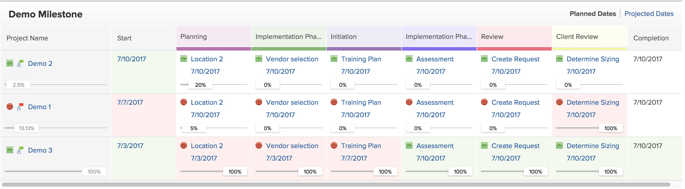

# Utilizzare la vista Milestone

È possibile applicare la visualizzazione Milestone a un elenco o a un rapporto di progetto.

Prima di poter utilizzare la visualizzazione delle attività cardine, è necessario configurare le attività cardine, aggiungere i percorsi cardine ai progetti e associare le attività cardine alle attività, come descritto negli articoli [Creare un percorso cardine](../../../administration-and-setup/customize-workfront/configure-approval-milestone-processes/create-milestone-path.md) e [Associa milestone alle attività](../../../manage-work/tasks/manage-tasks/associate-milestones-with-tasks.md).

La visualizzazione Milestone è disponibile quando si visualizza un elenco di progetti o un rapporto di progetto. Nelle sezioni seguenti viene descritto come visualizzare e utilizzare la visualizzazione delle attività cardine.

## Requisiti di accesso

Per eseguire i passaggi descritti in questo articolo, è necessario disporre dei seguenti diritti di accesso:

<table style="table-layout:auto"> 
 <col> 
 </col> 
 <col> 
 </col> 
 <tbody> 
  <tr> 
   <td role="rowheader"><strong>piano Adobe Workfront*</strong></td> 
   <td> 
Qualsiasi
 </td> 
  </tr> 
  <tr> 
   <td role="rowheader"><strong>Licenza Adobe Workfront*</strong></td> 
   <td> 
Lavoro o superiore 
 </td> 
  </tr> 
  <tr> 
   <td role="rowheader"><strong>Configurazioni a livello di accesso*</strong></td> 
   <td> 
Visualizzazione o accesso successivo a Report, Dashboard, Calendari
 
<b>NOTA</b>

Se non disponi ancora dell’accesso, chiedi all’amministratore Workfront se ha impostato ulteriori restrizioni nel livello di accesso. Per informazioni su come un amministratore Workfront può modificare il livello di accesso, consulta <a href="../../../administration-and-setup/add-users/configure-and-grant-access/create-modify-access-levels.md" class="MCXref xref">Creare o modificare livelli di accesso personalizzati</a>.
 </td>
</tr> 
  <tr> 
   <td role="rowheader"><strong>Autorizzazioni oggetto</strong></td> 
   <td> 
Visualizzare le autorizzazioni per un rapporto di progetto per applicare la visualizzazione Milestone a un rapporto
 
Per informazioni sulla richiesta di accesso aggiuntivo, vedi <a href="../../../workfront-basics/grant-and-request-access-to-objects/request-access.md" class="MCXref xref">Richiedere l’accesso agli oggetti </a>.
 </td> 
  </tr> 
 </tbody> 
</table>

&#42;Per informazioni sul piano, il tipo di licenza o l&#39;accesso, contattare l&#39;amministratore Workfront.

## Passa alla vista Milestone {#switch-to-the-milestone-view}

1. Passa all’elenco dei progetti o al rapporto del progetto contenente le tappe da visualizzare.
1. Fai clic sul pulsante **Visualizza** menu a discesa, quindi fai clic su **Milestone**.

   L’elenco o il rapporto viene visualizzato in una vista Milestone.

   Per informazioni sulla visualizzazione delle attività cardine, consulta la sezione . [Panoramica sulla vista Milestone](#milestone-view-overview) in questo articolo.

## Panoramica sulla vista Milestone {#milestone-view-overview}

La vista Milestone è disponibile negli elenchi di progetti e nei rapporti sui progetti. Questa visualizzazione consente di visualizzare rapidamente tutte le fasi cardine associate alle attività all’interno dei progetti visualizzati.

>[!NOTE]
>
>La vista Milestone non è disponibile nelle seguenti aree:
>* Schede temporali nell’elenco dei progetti durante l’aggiunta di un progetto.

Per informazioni su come passare alla visualizzazione Milestone, consulta la sezione [Passa alla vista Milestone](#switch-to-the-milestone-view) in questo articolo.

### Sezioni di visualizzazione Milestone

Quando si applica la visualizzazione Milestone a un elenco di progetti, i progetti vengono visualizzati nelle sezioni seguenti:

* I progetti associati a un Percorso Milestone vengono visualizzati per primi, elencati con il nome dei rispettivi Percorsi Milestone.

   Workfront ordina i progetti nella prima sezione in base ai seguenti criteri, in questo ordine:

   1. ID Percorso Milestone. Puoi visualizzare l’ID del percorso Milestone in un rapporto Percorso Milestone.

   2. Il campo selezionato come primo campo di ordinamento per l’elenco dei progetti nella visualizzazione applicata in precedenza all’elenco dei progetti, prima di selezionare la vista Milestone.

* I progetti non associati a un Percorso Milestobe vengono visualizzati successivamente, nella sezione Non assegnato . Workfront ordina i progetti nella sezione Non assegnato in base al campo selezionato come primo campo di ordinamento per l’elenco dei progetti nella visualizzazione applicata in precedenza all’elenco dei progetti, prima di selezionare la vista Milestone.

### Informazioni sul progetto nella vista Milestone

Quando si visualizza un elenco di progetti o un rapporto di progetti nella visualizzazione Attività cardine, sono disponibili le seguenti informazioni:

* **Date previste o date previste:** Specificare se si desidera visualizzare le date pianificate o le date previste nella visualizzazione Milestone.\
   Vengono visualizzate le date per Inizio e Completamento, nonché per ogni Milestone nel percorso Milestone.\
   Se visualizzi le date pianificate e disponi anche dell’accesso Gestione al progetto, puoi modificare le date seguenti direttamente dalla vista Milestone: (Se visualizzi le date previste, queste non possono essere modificate perché le date previste vengono calcolate e non possono essere modificate manualmente.)

   * **Date di inizio del progetto:** Se un progetto è programmato a partire dalla data di inizio, è possibile modificare manualmente la data di inizio del progetto e quindi calcolare la data di completamento.
   * **Date di completamento del progetto:** Se un progetto è programmato a partire dalla data di completamento, è possibile modificare manualmente la data di completamento del progetto e quindi calcolare la data di inizio.
   * **Date completamento attività:** È possibile aggiornare manualmente Completamento per le attività direttamente dalla vista Attività cardine.

* **Percentuale completata:** Visualizza la percentuale di completamento di ogni attività e progetto.\
   È possibile disattivare la visualizzazione della percentuale di completamento, come descritto nella sezione [Configurare le informazioni visualizzate nella vista Milestone](#configure-what-information-displays-in-the-milestone-view) in questo articolo.\
   È possibile regolare la percentuale di completamento direttamente dalla vista Milestone, come descritto nella sezione [Regolare la percentuale di completamento per le attività nella vista Attività cardine](#adjust-percent-complete-for-tasks-in-the-milestone-view) in questo articolo.

* **Icone di stato dell’attività:** Nella vista Milestone viene visualizzata un’icona di stato accanto a ciascun progetto e attività.

   * Nei Tempi\
      

   * Indietro\
      

   * A Rischio\
      

   * In Ritardo\
      
   È possibile disattivare la visualizzazione di queste icone di stato, come descritto nella sezione [Configurare le informazioni visualizzate nella vista Milestone](#configure-what-information-displays-in-the-milestone-view) in questo articolo.\
   Per informazioni più dettagliate su ciascun tipo di stato, consulta l’articolo [Panoramica sullo stato dell&#39;avanzamento dell&#39;attività](../../../manage-work/tasks/task-information/task-progress-status.md).

* **Ombreggiatura stato attività per le attività completate**: Dopo aver contrassegnato l&#39;attività Completato, lo sfondo dell&#39;attività viene ombreggiato nella visualizzazione Milestone per indicare se l&#39;attività è stata completata in tempo o in ritardo:

   * **Ombreggiatura rossa per la colonna attività**: Lo sfondo di un&#39;attività è rosso quando lo stato di avanzamento è **In ritardo**.

   * **Ombreggiatura verde per la colonna attività**: Lo sfondo di un&#39;attività è verde quando lo stato di avanzamento è **Ora di attivazione**.

* **Ombreggiatura dello stato del progetto per le colonne Inizio e Completamento progetto**:

   * **Colonna di avvio del progetto**: Lo sfondo della colonna Inizio progetto è rosso o verde solo quando la data Inizio effettivo è compilata:

      * **Ombreggiatura rossa per la colonna Avvio progetto**: Lo sfondo della colonna Avvio progetto è rosso quando lo stato di avanzamento del progetto è **In ritardo**.

      * **Ombreggiatura verde per la colonna Avvio progetto**: Lo sfondo della colonna Avvio progetto è verde quando lo stato di avanzamento del progetto è **Ora di attivazione**.
   * **Colonna Completamento progetto**: Lo sfondo della colonna Completamento progetto è rosso o verde solo quando la data di completamento effettivo è compilata:

      * **Ombreggiatura rossa per la colonna Completamento progetto**: Lo sfondo della colonna Completamento progetto è rosso quando lo stato di avanzamento del progetto è **In ritardo**.

      * **Ombreggiatura verde per la colonna Completamento progetto**: Lo sfondo della colonna Completamento progetto è verde quando lo stato di avanzamento del progetto è **Ora di attivazione**.
   * Alle colonne Inizio e Completamento non viene assegnata alcuna ombreggiatura colore quando le attività presentano lo stato di avanzamento su Rischio o Dietro.

   

* **Nome del progetto**: Il nome del progetto viene visualizzato con un collegamento al progetto.
* **Icona Condizione progetto**: Accanto al nome del progetto viene visualizzata un’icona che indica la condizione del progetto.

## Configurare le informazioni visualizzate nella vista Milestone {#configure-what-information-displays-in-the-milestone-view}

Puoi configurare la visualizzazione dei seguenti elementi nella vista Milestone:

* Icone dello stato di avanzamento
* Percentuale di completamento di progetti e attività

Per impostazione predefinita vengono visualizzate le icone dello stato del progetto e la percentuale di completamento dei progetti.

Tutte le modifiche apportate a queste opzioni si applicano solo a te; gli altri utenti non sono interessati. Le modifiche apportate vengono mantenute al successivo accesso ad Adobe Workfront.

Per configurare la visualizzazione delle icone dello stato del progetto e della percentuale di completamento dei progetti:

1. Passa all’elenco dei progetti o al rapporto del progetto contenente le tappe da visualizzare.
1. Fai clic sul pulsante **Visualizza** menu a discesa, quindi fai clic su **Milestone**.\
   Se visualizzi un elenco di progetti all’interno di un Portfolio o di un programma, seleziona la **Milestone** sottoscheda.

1. Fai clic su **Opzioni** nell’angolo superiore destro della vista Milestone.\
   

1. Seleziona tra le seguenti opzioni:

   <table style="table-layout:auto"> 
    <col> 
    <col> 
    <tbody> 
     <tr> 
      <td role="rowheader">Stato di Avanzamento</td> 
      <td> 
Selezionare questa opzione per visualizzare le icone dello stato di avanzamento accanto a ciascun progetto e attività.
 
Questa opzione è attivata per impostazione predefinita.
 </td> 
     </tr> 
     <tr> 
      <td role="rowheader">Percentuale completato</td> 
      <td> 
Selezionare questa opzione per visualizzare la percentuale di completamento accanto a ciascun progetto e task.
 
Questa opzione è attivata per impostazione predefinita.
 </td> 
     </tr> 
    </tbody> 
   </table>

## Regolare la percentuale di completamento per le attività nella vista Attività cardine {#adjust-percent-complete-for-tasks-in-the-milestone-view}

È possibile regolare la percentuale di completamento per le attività nella vista Attività cardine. Non è possibile regolare la percentuale di completamento per un&#39;attività padre (un&#39;attività che contiene sottoattività).

Per regolare la percentuale di completamento per un&#39;attività nella vista Milestone:

1. Passa all’elenco dei progetti o al rapporto del progetto contenente le tappe da visualizzare.
1. Fai clic sul pulsante **Visualizza** menu a discesa, quindi fai clic su **Milestone**.

1. (Condizionale) Se le percentuali di completamento non vengono visualizzate nella vista Milestone, fare clic su **Opzioni** nell’angolo in alto a destra della vista Milestone, quindi assicurati che **Percentuale completata** è abilitato.

1. Fare clic sulla percentuale di completamento sotto un&#39;attività, specificare una nuova percentuale, quindi premere Invio.
