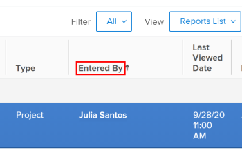

# Guida introduttiva ai rapporti in Adobe Workfront

I rapporti forniscono visibilità su ciò che accade con gli utenti e sul lavoro. Utilizzando i rapporti, è possibile visualizzare informazioni sugli oggetti in Adobe Workfront.

Per informazioni sulla comprensione degli oggetti e sulle modalità di generazione dei rapporti nell’applicazione Workfront, consulta [Comprendere gli oggetti in Adobe Workfront](../../../workfront-basics/navigate-workfront/workfront-navigation/understand-objects.md).

## Elementi report

I rapporti sono una combinazione dei tre elementi seguenti in Workfront:

<table style="table-layout:auto"> 
 <col> 
 <col> 
 <tbody> 
  <tr> 
   <td role="rowheader">Visualizza</td> 
   <td> <li>Definisce le colonne del rapporto e quali informazioni è possibile includere in ogni colonna.</li> <li>Per informazioni sulle visualizzazioni, consulta l’articolo <a href="../../../reports-and-dashboards/reports/reporting-elements/views-overview.md" class="MCXref xref">Panoramica delle visualizzazioni in Adobe Workfront</a>.</li> </td> 
  </tr> 
  <tr> 
   <td role="rowheader">Raggruppamento</td> 
   <td> <li>Categorizza le informazioni in base a informazioni comuni ed elenca i risultati del rapporto in intestazioni blu.</li> <li>Per informazioni sui raggruppamenti, consulta l’articolo <a href="../../../reports-and-dashboards/reports/reporting-elements/groupings-overview.md" class="MCXref xref">Panoramica sui raggruppamenti in Adobe Workfront</a>.</li> </td> 
  </tr> 
  <tr> 
   <td role="rowheader">Filtro</td> 
   <td> <li>Controlla la quantità di informazioni visualizzate in un rapporto.</li> <li>Per informazioni sui filtri, consulta l’articolo <a href="../../../reports-and-dashboards/reports/reporting-elements/filters-overview.md" class="MCXref xref">Panoramica sui filtri in Adobe Workfront</a>.</li> <li>Per informazioni sui modificatori del filtro, consulta l’articolo <a href="../../../reports-and-dashboards/reports/reporting-elements/filter-condition-modifiers.md" class="MCXref xref">Modificatori di filtri e condizioni</a>.</li> <li>Puoi filtrare utilizzando i caratteri jolly, per rendere i filtri più generali e offrire loro maggiore flessibilità di utilizzo.</li> <li>Per informazioni sull’utilizzo dei caratteri jolly nei filtri, consulta l’articolo <a href="../../../reports-and-dashboards/reports/reporting-elements/understand-wildcard-filter-variables.md" class="MCXref xref">Variabili filtro caratteri jolly</a>.</li> </td> 
  </tr> 
 </tbody> 
</table>

>[!NOTE]
>
>Quando selezioni un nuovo filtro, visualizzazione o raggruppamento da un elenco, tale selezione viene mantenuta anche se disconnetti da Workfront o chiudi il browser.

Per informazioni sugli elementi dei rapporti, consulta l’articolo [Elementi di reporting: filtri, visualizzazioni e raggruppamenti](../../../reports-and-dashboards/reports/reporting-elements/reporting-elements-filters-views-groupings.md).

Per migliorare i rapporti, puoi aggiungere i seguenti elementi:

* Grafico: una rappresentazione visiva dei risultati nel rapporto.\
   Per informazioni sui rapporti sui grafici, consulta l’articolo [Aggiungere un grafico a un report](../../../reports-and-dashboards/reports/creating-and-managing-reports/add-chart-report.md).

* Un raggruppamento di matrici: riassume le informazioni del rapporto in un formato di tabella aggregata.\
   Per informazioni sui rapporti sulle matrici, consulta l’articolo [Creare un rapporto sulla matrice](../../../reports-and-dashboards/reports/creating-and-managing-reports/create-matrix-report.md).

* Richiesta: un filtro aperto personalizzabile e applicato in modo diverso ogni volta che si esegue il rapporto.\
   Per informazioni sui prompt, vedere [Aggiungere un prompt a un report](../../../reports-and-dashboards/reports/creating-and-managing-reports/add-prompt-report.md).

Quando crei un rapporto, puoi modificare singolarmente uno qualsiasi di questi elementi nel generatore di rapporti.

Un altro modo per migliorare la pertinenza delle informazioni incluse nei rapporti consiste nell’applicare la formattazione condizionale alle visualizzazioni.\
Per informazioni sull’utilizzo della formattazione condizionale, consulta [Utilizzare la formattazione condizionale nelle visualizzazioni](../../../reports-and-dashboards/reports/reporting-elements/use-conditional-formatting-views.md).

## Rapporti sul sistema

Workfront fornisce diversi rapporti di sistema caricati nel sistema per impostazione predefinita.\
Dopo aver inserito le informazioni nel sistema, è possibile utilizzare questi rapporti per visualizzare visivamente le informazioni.

Per informazioni su come accedere ai rapporti sul sistema, consulta la sezione . [Utilizzare i report incorporati di Adobe Workfront](../../../reports-and-dashboards/reports/using-built-in-reports/use-workfront-built-in-reports.md) nell&#39;articolo [Utilizzare i report incorporati di Adobe Workfront](../../../reports-and-dashboards/reports/using-built-in-reports/use-workfront-built-in-reports.md).

Per ulteriori informazioni sui rapporti di sistema disponibili, consulta l’articolo [Utilizzare i report incorporati di Adobe Workfront](../../../reports-and-dashboards/reports/using-built-in-reports/use-workfront-built-in-reports.md).

## Creare rapporti

Oltre ai report di sistema forniti da Workfront, puoi creare report personalizzati per soddisfare le esigenze della tua organizzazione.

Per creare un rapporto è possibile effettuare una delle seguenti operazioni:

* Crea un rapporto da zero.
* Copia un rapporto esistente.\
   Per copiare un report creato da un altro utente, è necessario disporre almeno dell&#39;autorizzazione Visualizza. Per ulteriori informazioni sulla copia di un rapporto, consulta l’articolo [Creare una copia di un rapporto](../../../reports-and-dashboards/reports/creating-and-managing-reports/create-copy-report.md).

Per informazioni sulla creazione di rapporti, consulta l’articolo [Panoramica dei rapporti sul calendario](../../../reports-and-dashboards/reports/calendars/calendar-reports-overview.md).

* [Prerequisiti per la creazione di rapporti](#prerequisites-for-creating-reports)
* [Proprietà del report](#report-ownership)
* [Creare rapporti nell’interfaccia del generatore](#create-reports-in-the-builder-interface)
* [Creare rapporti in modalità testo](#create-reports-in-text-mode)

### Prerequisiti per la creazione di rapporti {#prerequisites-for-creating-reports}

* È necessario disporre di una licenza Plan per creare rapporti personalizzati.\
   Per informazioni sui tipi di licenza Workfront, consulta l’articolo [Panoramica sulle licenze di Adobe Workfront](../../../administration-and-setup/add-users/access-levels-and-object-permissions/wf-licenses.md).

* L’amministratore di Workfront deve consentire l’accesso a Modifica rapporti nel livello di accesso.\
   Per informazioni sulla concessione dell’accesso ai rapporti di Modifica, consulta l’articolo [Consentire l’accesso a report, dashboard e calendari](../../../administration-and-setup/add-users/configure-and-grant-access/grant-access-reports-dashboards-calendars.md).

* L’amministratore di Workfront deve consentire l’accesso a Modifica filtri, visualizzazioni e raggruppamenti nel livello di accesso.

   Per informazioni su come concedere l’accesso a Modifica filtri, visualizzazioni e raggruppamenti, consulta [Consentire l’accesso a filtri, visualizzazioni e raggruppamenti](../../../administration-and-setup/add-users/configure-and-grant-access/grant-access-fvg.md).

* È necessario definire un oggetto su cui si desidera creare un rapporto. I rapporti sono oggetti specifici in Workfront ed è necessario iniziare a selezionare un tipo di oggetto prima di poter iniziare a creare il rapporto. È possibile creare rapporti solo sugli oggetti disponibili nell’interfaccia di Workfront.

### Proprietà del report {#report-ownership}

Quando crei un rapporto in Workfront, diventa il proprietario predefinito del rapporto e viene visualizzato nella sezione Report personali . Non è possibile modificare il proprietario di un report.

Quando copi un rapporto, diventi automaticamente proprietario del rapporto copiato.

Per informazioni sulla copia dei rapporti, consulta l’articolo [Creare una copia di un rapporto](../../../reports-and-dashboards/reports/creating-and-managing-reports/create-copy-report.md).

Puoi vedere chi possiede un rapporto controllando il **Inserito da** campo .

### Creare rapporti nell’interfaccia del generatore {#create-reports-in-the-builder-interface}

È consigliabile utilizzare prima l’interfaccia di creazione dei rapporti per creare un nuovo rapporto. L’interfaccia offre un set di strumenti semplificato che ti guida attraverso la creazione di elementi per creare il rapporto desiderato. È possibile selezionare oggetti e campi dagli elenchi e aggiungerli a tutti gli elementi di reporting.\
Per ulteriori informazioni sulla creazione di rapporti nell’interfaccia di creazione dei rapporti, consulta l’articolo [Creare un rapporto personalizzato](../../../reports-and-dashboards/reports/creating-and-managing-reports/create-custom-report.md).

Per un elenco degli oggetti su cui è possibile creare rapporti, vedere la [Rapporto sugli oggetti](../../../workfront-basics/navigate-workfront/workfront-navigation/understand-objects.md#reporting-on-objects) sezione dell&#39;articolo [Comprendere gli oggetti in Adobe Workfront](../../../workfront-basics/navigate-workfront/workfront-navigation/understand-objects.md).

Per ulteriori informazioni sui campi che puoi visualizzare nei rapporti, consulta l’articolo [Glossario della terminologia di Adobe Workfront](../../../workfront-basics/navigate-workfront/workfront-navigation/workfront-terminology-glossary.md).

### Creare rapporti in modalità testo {#create-reports-in-text-mode}

A volte, potrebbe non essere possibile trovare alcuni campi nell’interfaccia del generatore, ma potrebbero essere disponibili nell’API.\
Per informazioni sui campi disponibili nell’API, consulta l’articolo [Esplora API](../../../wf-api/general/api-explorer.md).

Per informazioni su come utilizzare API Explorer, consulta l’articolo [Utilizzo di API Explorer](../../../wf-api/general/using-api-explorer.md).

>[!NOTE]
>
>Nell’interfaccia di Workfront non è possibile creare rapporti su oggetti non disponibili nel generatore di report. Tuttavia, puoi creare rapporti sui campi associati agli oggetti nel generatore di report se tali campi sono disponibili tramite l’API . A questo scopo, è necessario utilizzare l’interfaccia Modalità testo .

La modalità testo consente di creare viste, filtri, raggruppamenti e prompt più complessi, consentendo di utilizzare campi non disponibili nell’interfaccia in modalità standard.

* [Terminologia della modalità testo](#text-mode-terminology)
* [Colonne calcolate, Formattazione condizionale e altri utilizzi della modalità di testo](#calculated-columns-conditional-formatting-and-other-uses-of-text-mode)
* [Esempi di modalità testo](#text-mode-samples)

#### Terminologia della modalità testo {#text-mode-terminology}

È necessario utilizzare una sintassi specifica per utilizzare l’interfaccia Workfront Text Mode.

Per ulteriori dettagli sulla sintassi Workfront per la modalità testo, vedi [Panoramica della sintassi della modalità testo](../../../reports-and-dashboards/reports/text-mode/text-mode-syntax-overview.md).

#### Colonne calcolate, Formattazione condizionale e altri utilizzi della modalità di testo {#calculated-columns-conditional-formatting-and-other-uses-of-text-mode}

Al di fuori del reporting sui campi che non sono disponibili nell&#39;interfaccia del generatore, è possibile utilizzare la modalità testo per visualizzare calcoli o confronti tra determinati campi.

Per un elenco degli usi più comuni della modalità di testo in un rapporto, consulta l’articolo [Panoramica degli usi comuni della modalità testo](../../../reports-and-dashboards/reports/text-mode/understand-common-uses-text-mode.md).

Per informazioni sull’inclusione dei dati personalizzati calcolati nei rapporti, consulta la sezione . [Dati personalizzati calcolati nei rapporti](../../../reports-and-dashboards/reports/calc-cstm-data-reports/calculated-custom-data-reports.md).

Per informazioni sul confronto dei campi nella formattazione condizionale, vedere l’articolo [Confronto dei campi nella formattazione condizionale](../../../reports-and-dashboards/reports/text-mode/compare-fields-conditional-formatting.md).

Puoi anche fare riferimento ai campi di raccolta utilizzando la modalità testo nei rapporti.\
Per informazioni sull’utilizzo della modalità di testo per visualizzare le informazioni sulla raccolta in un rapporto, consulta l’articolo [Riferimento alle raccolte in un rapporto](../../../reports-and-dashboards/reports/text-mode/reference-collections-report.md).

#### Esempi di modalità testo {#text-mode-samples}

È disponibile una libreria di esempi delle visualizzazioni, dei filtri e dei raggruppamenti più utilizzati che è possibile creare con la modalità testo.

Per sfogliare questa libreria e utilizzare alcuni degli esempi che offriamo, vedi l&#39;articolo [Esempi di visualizzazione, filtro e raggruppamento personalizzati](../../../reports-and-dashboards/reports/custom-view-filter-grouping-samples/custom-view-filter-grouping-samples.md).

## Schede di un rapporto

Un rapporto può contenere diverse schede quando lo esegui nell’interfaccia.

Per informazioni sull’esecuzione di un rapporto, consulta l’articolo [Eseguire un rapporto](../../../reports-and-dashboards/reports/creating-and-managing-reports/run-report.md).

In ogni scheda, le informazioni incluse nel rapporto vengono visualizzate in formati leggermente diversi. Scegli il formato più adatto alle esigenze della tua organizzazione.

È possibile impostare qualsiasi scheda come scheda predefinita del rapporto. La scheda predefinita è la prima scheda visualizzata quando si fa clic sul nome di un rapporto per aprirlo, ed è la scheda che viene visualizzata quando si posiziona il rapporto in un dashboard.

A seconda degli elementi scelti nel rapporto, il rapporto può contenere le seguenti schede:

* [Scheda Dettagli](#details-tab)
* [Scheda Riepilogo](#summary-tab)
* [Scheda Matrice](#matrix-tab)
* [Scheda Grafico](#chart-tab)
* [Scheda Prompt](#prompts-tab)

### Scheda Dettagli {#details-tab}

Nella scheda Dettagli di un rapporto viene visualizzato l’oggetto dei rapporti e gli attributi selezionati per l’oggetto in un modulo elenco. Ogni rapporto ha una scheda Dettagli.

>[!IMPORTANT]
>
>Le informazioni nella scheda Dettagli potrebbero essere visualizzate in modo diverso rispetto alla scheda Grafico in base al fuso orario.\
>Ad esempio, un utente in California ha completato un’attività alle 21:30 PST del 12 febbraio. Quando un utente di New York visualizza un rapporto che include questo completamento attività, la Data completamento effettivo viene visualizzata come 13 febbraio in entrambe le schede Dettagli, perché è stata completata alle 12:30 EST del 13 febbraio. Tuttavia, nel grafico viene incluso nel raggruppamento del 12 febbraio fino a quando non espandi l’elemento grafico.

### Scheda Riepilogo {#summary-tab}

I rapporti che includono un raggruppamento hanno una scheda Riepilogo .

Le stesse informazioni visualizzate in formato elenco nella scheda Dettagli vengono riepilogate e aggregate in base ai raggruppamenti presenti nel rapporto nella scheda Riepilogo.

Per informazioni sui gruppi, consulta l’articolo [Panoramica sui raggruppamenti in Adobe Workfront](../../../reports-and-dashboards/reports/reporting-elements/groupings-overview.md).

### Scheda Matrice {#matrix-tab}

I rapporti che includono un raggruppamento a matrice hanno una scheda Matrice.

Le stesse informazioni visualizzate in formato elenco nella scheda Dettagli vengono visualizzate in formato tabella, raggruppate per i raggruppamenti nel rapporto nella scheda Matrice.

Quando si aggiunge un raggruppamento di matrice a un rapporto, la scheda Riepilogo viene sostituita dalla scheda Matrice.

Per informazioni sulla creazione di un raggruppamento a matrice, consulta l’articolo [Creare un rapporto sulla matrice](../../../reports-and-dashboards/reports/creating-and-managing-reports/create-matrix-report.md).

### Scheda Grafico {#chart-tab}

I rapporti che includono un grafico presentano una scheda Grafico.

Prendi in considerazione l’inclusione di un grafico nei rapporti per individuare dashboard di impatto per i dirigenti. I grafici sono un modo conciso per visualizzare le informazioni in un rapporto. È possibile espandere un elemento grafico facendo clic su di esso per visualizzare gli elementi inclusi in tale elemento.

>[!IMPORTANT]
>
>Quando fai clic su un elemento grafico, le informazioni espanse possono essere visualizzate in modo diverso rispetto al grafico in base al tuo fuso orario.\
>Ad esempio, un utente in California ha completato un’attività alle 21:30 PST del 12 febbraio. Quando un utente di New York visualizza un rapporto che include questo completamento attività, la Data completamento effettivo viene visualizzata come 13 febbraio sia nella scheda Dettagli che nei dettagli del grafico, in quanto è stata completata alle 12.30 EST del 13 febbraio. Tuttavia, nel grafico viene incluso nel raggruppamento del 12 febbraio fino a quando non espandi l’elemento grafico.

Per informazioni sulla creazione di un rapporto con un grafico, consulta l’articolo [Aggiungere un grafico a un report](../../../reports-and-dashboards/reports/creating-and-managing-reports/add-chart-report.md).

### Scheda Prompt {#prompts-tab}

I rapporti che includono un prompt dispongono di una scheda Prompt.

Un prompt ti consente di aggiungere un filtro a un rapporto ogni volta che lo esegui. Quando si aggiunge un prompt al rapporto, la scheda Prompts diventa automaticamente la scheda predefinita del rapporto. Non è possibile modificare questa impostazione in un’altra scheda.

Per informazioni sulla creazione di un prompt per un rapporto, consulta l’articolo [Aggiungere un prompt a un report](../../../reports-and-dashboards/reports/creating-and-managing-reports/add-prompt-report.md).

## Condividere i rapporti

Dopo aver creato un rapporto, puoi condividerlo con altri utenti.

Puoi condividere un rapporto con altri utenti nei seguenti modi:

* [Assegnare autorizzazioni di condivisione a un rapporto](#give-sharing-permissions-to-a-report)
* [Pianificare una consegna del rapporto](#schedule-a-report-delivery)
* [Esportare i risultati di un rapporto](#export-the-results-of-a-report)
* [Aggiungere un rapporto a un dashboard](#add-a-report-to-a-dashboard)

### Assegnare autorizzazioni di condivisione a un rapporto {#give-sharing-permissions-to-a-report}

Puoi assegnare le autorizzazioni di condivisione a un altro utente per visualizzare o gestire un rapporto creato. Puoi assegnare a un altro utente un livello di autorizzazioni pari o inferiore al tuo. Puoi anche rendere pubblico un rapporto utilizzando le autorizzazioni di condivisione. Per informazioni sulla condivisione di un rapporto, vedi [Condivisione di un rapporto in Adobe Workfront](../../../reports-and-dashboards/reports/creating-and-managing-reports/share-report.md).

### Pianificare una consegna del rapporto {#schedule-a-report-delivery}

Puoi pianificare la consegna di un rapporto. Gli utenti con cui condividi il rapporto ricevono un’e-mail con un allegato dei risultati del rapporto. L&#39;allegato può avere i seguenti formati:

* HTML
* PDF
* Excel
* .TSV

Per informazioni sulla pianificazione della consegna dei rapporti, consulta l’articolo [Panoramica sulla consegna dei rapporti](../../../reports-and-dashboards/reports/creating-and-managing-reports/set-up-report-deliveries.md).

### Esportare i risultati di un rapporto {#export-the-results-of-a-report}

È possibile esportare i risultati di un rapporto nei seguenti formati di file

* PDF
* Excel (formati .xls e .xlsx)
* Delimitato da tabulazioni

Per informazioni sull’esportazione dei risultati di un rapporto, consulta l’articolo [Esportare i dati](../../../reports-and-dashboards/reports/creating-and-managing-reports/export-data.md).

Una volta esportato il rapporto in uno di questi formati, puoi condividerlo con altri utenti inviandolo via e-mail come allegato o stampandolo.

### Aggiungere un rapporto a un dashboard {#add-a-report-to-a-dashboard}

Puoi aggiungere un rapporto a una dashboard e condividerlo con altri utenti. Per informazioni sull’aggiunta di rapporti a una dashboard, consulta l’articolo [Aggiungere un rapporto a un dashboard](../../../reports-and-dashboards/dashboards/creating-and-managing-dashboards/add-report-dashboard.md).

## Creazione di calendari

Se si desidera visualizzare i dati in un formato calendario, è possibile creare calendari anziché rapporti.

Per informazioni sulla creazione di calendari, consulta l’articolo .

Per informazioni sull&#39;utilizzo dei calendari, consulta l&#39;articolo [Panoramica dei rapporti sul calendario](../../../reports-and-dashboards/reports/calendars/calendar-reports-overview.md).

## Utilizzo dei rapporti

Dopo aver creato i rapporti e averli condivisi con altri utenti, puoi tenere traccia della frequenza con cui questi vengono utilizzati.\
Per informazioni sull’utilizzo dei rapporti, tra cui la frequenza con cui vengono visualizzati, l’utente e le dashboard su cui vengono visualizzate, consulta l’articolo [Panoramica sull’utilizzo dei rapporti](../../../reports-and-dashboards/reports/report-usage/report-usage-overview.md).

## Termini comuni utilizzati per i rapporti

I termini seguenti sono utilizzati in riferimento ai rapporti di Workfront:

<table style="table-layout:auto"> 
 <col> 
 <col> 
 <thead> 
  <tr> 
   <th><strong>Termine o frase</strong> </th> 
   <th><strong>Definizione</strong> </th> 
  </tr> 
 </thead> 
 <tbody> 
  <tr> 
   <td>Opzioni avanzate</td> 
   <td> 
Si riferisce al collegamento presente nella scheda Colonne (visualizzazione) del generatore di report che consente di eseguire le operazioni seguenti:
 
    <ul> 
     <li>Impostare la formattazione condizionale dello stile delle colonne di testo e immagini in base ai criteri selezionati.</li> 
     <li>Riabilita la colonna.</li> 
     <li>Formatta i valori nella colonna.</li> 
    </ul> 
Ad esempio, è possibile visualizzare tutte le attività principali in grassetto oppure visualizzare in rosso la data di completamento pianificata se l'attività è in ritardo.
 </td> 
  </tr> 
  <tr> 
   <td>Attributo</td> 
   <td> Campo di un oggetto definito nel database. Viene utilizzato in un’espressione Modalità testo.  Ad esempio, il campo Stato viene visualizzato come <em>status</em> se utilizzato in un'espressione in modalità testo. </td> 
  </tr> 
  <tr> 
   <td>Bean o JavaBean</td> 
   <td>Un Fagiolo rappresenta un elemento di programmazione riutilizzabile. Il termine Bean identifica le relazioni tra diversi oggetti nell'applicazione Workfront. È importante avere familiarità con queste relazioni quando si tenta di visualizzare attributi aggiuntivi su un oggetto che non sono disponibili negli strumenti di reporting di base.</td> 
  </tr> 
  <tr> 
   <td>Interfaccia o Report Builder di generazione</td> 
   <td>L’interfaccia di Generatore è la serie di menu a discesa contenenti i campi visualizzati nelle schede Colonne (vista), Filtro e Raggruppamento. Fornisce una mappatura intuitiva delle relazioni dei fagioli per aiutare a identificare le colonne in una vista, i criteri di un filtro e gli attributi comuni di un raggruppamento.</td> 
  </tr> 
  <tr> 
   <td>Cammello</td> 
   <td> 
Camel Case si riferisce a un modo specifico per scrivere elementi di programmazione in attributi stringa multi-parola insieme. Quando si scrive un attributo in Camel Case, la prima lettera della prima parola è minuscola, non c'è spazio tra le parole e la prima lettera di qualsiasi parola successiva è maiuscola.
 
Ad esempio, Home Group viene scritto come <em>homeGroup</em>, Pool di risorse <em>resourcePool</em>, e la data di inizio effettiva sarebbe <em>effectiveStartDate</em>.
 </td> 
  </tr> 
  <tr> 
   <td>Diagramma</td> 
   <td> 
Una scheda all’interno di Report Builder, una scheda Report, dopo aver salvato il report, nonché un elemento facoltativo di un report che consente di aggiungere un grafico a qualsiasi report. È necessario definire un raggruppamento nel rapporto prima di creare un grafico.
 
Di seguito sono riportati i tipi di grafici che possono essere aggiunti a qualsiasi rapporto: 
 
    <ul> 
     <li>Colonna</li> 
     <li>Barra</li> 
     <li>Torta</li> 
     <li>Linee</li> 
     <li>Indicatori</li> 
     <li>Bolla</li> 
    </ul> 
Per ulteriori informazioni sull’aggiunta di grafici ai rapporti, consulta l’articolo <a href="../../../reports-and-dashboards/reports/creating-and-managing-reports/add-chart-report.md" class="MCXref xref">Aggiungere un grafico a un report</a>.
 </td> 
  </tr> 
  <tr> 
   <td>Dettagli</td> 
   <td>Questa è una delle schede di un rapporto, dopo aver salvato il rapporto. Mostra i risultati del rapporto, visualizzati nella visualizzazione e nel raggruppamento desiderato.</td> 
  </tr> 
  <tr> 
   <td>Espressione</td> 
   <td>Un’espressione è una formula scritta in Modalità testo per trasmettere informazioni da cercare o visualizzare quando si utilizza l’interfaccia Modalità testo. Si tratta in genere di una riga in un’istruzione di tipo Testo più grande.</td> 
  </tr> 
  <tr> 
   <td>Campi</td> 
   <td> 
Si riferisce agli attributi degli oggetti. Ad esempio, "Stato" è un campo per Progetto, Attività o Problemi. "Portfoli Manager" è un campo per l'oggetto Portfolio.
 
Puoi anche disporre di campi personalizzati che crei te stesso e che aggiungi a Custom Forms. Per informazioni sulla creazione di Custom Forms, consulta l’articolo <a href="../../../administration-and-setup/customize-workfront/create-manage-custom-forms/create-or-edit-a-custom-form.md" class="MCXref xref">Creare o modificare un modulo personalizzato</a>.
 </td> 
  </tr> 
  <tr> 
   <td>Nome Campo </td> 
   <td>Il valore di un attributo visualizzato in una visualizzazione o utilizzato nella condizione di un filtro o come elemento comune di un raggruppamento. Le opzioni per Nome campo dipendono dalla selezione Origine campo.</td> 
  </tr> 
  <tr> 
   <td>Sorgente Campo </td> 
   <td>Il valore di un oggetto visualizzato in una visualizzazione o utilizzato nella condizione di un filtro o come elemento comune di un raggruppamento. Le opzioni nell’origine campo dipendono dal tipo di oggetto dell’elemento dell’interfaccia utente che si sta creando. L’origine campo consente di fare riferimento agli attributi di oggetti diversi dal tipo di oggetto dell’elemento dell’interfaccia utente.</td> 
  </tr> 
  <tr> 
   <td>Filtro</td> 
   <td>Elemento del report principale che determina i risultati da visualizzare nel report.</td> 
  </tr> 
  <tr> 
   <td>Modulo </td> 
   <td>Utilizzato in modo intercambiabile con "Modulo personalizzato". I campi e le sezioni vengono aggiunti ai moduli, che vengono quindi associati a un oggetto per aumentare il numero di campi che è possibile associare a un oggetto.</td> 
  </tr> 
  <tr> 
   <td>Raggruppamento </td> 
   <td>Elemento report principale che identifica l'organizzazione di un elenco di risultati. Il raggruppamento crea barre orizzontali in tutto il rapporto per raggruppare i risultati in base agli attributi comuni definiti al momento della creazione. I raggruppamenti vengono utilizzati nei rapporti matrice per aggregare i dati, nonché nei grafici, per determinare gli assi dei grafici.</td> 
  </tr> 
  <tr> 
   <td>Oggetto o tipo di oggetto</td> 
   <td> Un oggetto è un elemento dell’applicazione Workfront (ad esempio, Progetto, Attività, Gruppo, Società, Filtro). Il tipo di oggetto viene utilizzato durante la creazione di un nuovo rapporto, vista, filtro o raggruppamento per identificare quale oggetto è l’oggetto principale del rapporto. I rapporti possono avere un solo tipo di oggetto, che è l'oggetto principale del rapporto. È possibile fare riferimento agli oggetti principali nello stesso rapporto. Per ulteriori informazioni sulla gerarchia degli oggetti, vedere la sezione "Comprensione dell’interdipendenza e della gerarchia degli oggetti" nell’articolo <a href="../../../workfront-basics/navigate-workfront/workfront-navigation/understand-objects.md" class="MCXref xref">Comprendere gli oggetti in Adobe Workfront</a>.</td> 
  </tr> 
  <tr> 
   <td>Prompt</td> 
   <td> 
Elemento di report facoltativo che può essere aggiunto a un report quando è necessario eseguire un filtro diverso prima di ogni esecuzione del report.
 
Per informazioni sui prompt, consulta l’articolo <a href="../../../reports-and-dashboards/reports/reporting-elements/filter-condition-modifiers.md" class="MCXref xref">Modificatori di filtri e condizioni</a>.
 </td> 
  </tr> 
  <tr> 
   <td>Modificatori di qualificatore o condizione</td> 
   <td> 
Questo campo viene visualizzato nelle seguenti aree di un rapporto:
 
    <ul> 
     <li>Nella scheda Filtro</li> 
     <li>La schermata Opzioni avanzate per la colonna nella scheda Colonne (visualizzazione). Definendo un qualificatore è possibile confrontare il Nome campo con un altro campo o valore.</li> 
     <li> In un prompt personalizzato Per informazioni sui prompt personalizzati, consulta la sezione "Creazione di un prompt" nell’articolo <a href="../../../reports-and-dashboards/reports/reporting-elements/filter-condition-modifiers.md" class="MCXref xref">Modificatori di filtri e condizioni</a>.</li> 
    </ul> 
Ad esempio, quando si crea un filtro per le attività con una data di completamento pianificata di oggi, selezionare <strong>Uguale</strong> nel campo Qualificatore e nella data odierna nel campo Data:
 
<em>Attività&gt; Data completamento pianificato&gt;Uguale&gt;(data odierna)</em> 
 
In questo scenario il qualificatore è <strong>Uguale</strong>. Per ulteriori informazioni sui qualificatori, consulta l’articolo <a href="../../../reports-and-dashboards/reports/reporting-elements/filter-condition-modifiers.md" class="MCXref xref">Modificatori di filtri e condizioni</a>.
 </td> 
  </tr> 
  <tr> 
   <td>Rapporto </td> 
   <td>Combinazione di una visualizzazione, un filtro e (a volte) un raggruppamento. Lo scopo di un rapporto è quello di visualizzare i dati in modo coerente nell’interfaccia, distribuire le informazioni ed eliminare la necessità di eseguire regolarmente la stessa ricerca o query.</td> 
  </tr> 
  <tr> 
   <td>Dichiarazione</td> 
   <td>È costituito da diverse espressioni che vengono combinate per definire quali informazioni visualizzare in un rapporto quando si utilizza la modalità testo. È possibile creare un'istruzione per una visualizzazione, un filtro, un raggruppamento o un prompt personalizzato in un rapporto.</td> 
  </tr> 
  <tr> 
   <td>Riepilogo</td> 
   <td>Questa è una delle schede di un rapporto, dopo aver salvato il rapporto. Questa scheda viene creata solo quando si definisce un raggruppamento per il rapporto. Riassume le informazioni in base al raggruppamento definito durante la creazione del rapporto e fornisce una rapida panoramica degli oggetti aggregati del rapporto. Non visualizza ogni oggetto del rapporto, solo quelli aggregati.</td> 
  </tr> 
  <tr> 
   <td>Interfaccia modalità testo</td> 
   <td>Consente di creare o modificare il codice di visualizzazioni, filtri, raggruppamenti e prompt personalizzati creati originariamente tramite l’interfaccia di Generatore. Si consiglia di creare gli elementi del report inizialmente tramite l’interfaccia di Generatore e quindi di convertirli in Modalità testo dopo il salvataggio per semplificare la codifica di visualizzazioni avanzate, filtri, raggruppamenti o prompt.</td> 
  </tr> 
  <tr> 
   <td>Interfaccia utente</td> 
   <td>Si riferisce ai componenti o ai blocchi predefiniti di ciò che viene visualizzato sullo schermo di un utente in un dato momento.</td> 
  </tr> 
  <tr> 
   <td>Visualizza (o Colonne)</td> 
   <td>Uno degli elementi principali di un rapporto. Identifica le intestazioni di colonna che verranno visualizzate nell’elenco di un rapporto.</td> 
  </tr> 
 </tbody> 
</table>
