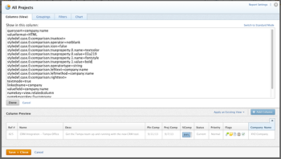

# Utilizzare la formattazione condizionale nella modalità Testo

<!--
(NOTE: Alina: this article might need to be split in its sections. Tony asked that numbers and dates should be in separate articles (??))
-->

Il generatore di interfacce standard offre un’ampia gamma di flessibilità nella creazione di elementi di reporting per soddisfare le esigenze dell’organizzazione.

È possibile applicare la formattazione condizionale in una visualizzazione utilizzando l’interfaccia standard.\
Per ulteriori informazioni sull&#39;applicazione della formattazione condizionale a una visualizzazione, vedere [Utilizzare la formattazione condizionale nelle visualizzazioni](../../../reports-and-dashboards/reports/reporting-elements/use-conditional-formatting-views.md).

## Requisiti di accesso

Per eseguire i passaggi descritti in questo articolo, è necessario disporre dei seguenti diritti di accesso:

<table style="table-layout:auto"> 
 <col> 
 <col> 
 <tbody> 
  <tr> 
   <td role="rowheader">piano Adobe Workfront*</td> 
   <td> <p>Qualsiasi</p> </td> 
  </tr> 
  <tr> 
   <td role="rowheader">Licenza Adobe Workfront*</td> 
   <td> <p>Piano </p> </td> 
  </tr> 
  <tr> 
   <td role="rowheader">Configurazioni a livello di accesso*</td> 
   <td> <p>Modificare l’accesso a Filtri, Visualizzazioni, Gruppi</p> <p>Modificare l’accesso a Report, Dashboard e Calendari per modificare le visualizzazioni in un report</p> <p>Nota: Se non disponi ancora dell’accesso, chiedi all’amministratore Workfront se ha impostato ulteriori restrizioni nel livello di accesso. Per informazioni su come un amministratore Workfront può modificare il livello di accesso, consulta <a href="../../../administration-and-setup/add-users/configure-and-grant-access/create-modify-access-levels.md" class="MCXref xref">Creare o modificare livelli di accesso personalizzati</a>.</p> </td> 
  </tr> 
  <tr> 
   <td role="rowheader">Autorizzazioni oggetto</td> 
   <td> <p>Gestire le autorizzazioni per un rapporto per modificare le visualizzazioni in un rapporto</p> <p>Gestire le autorizzazioni per una visualizzazione per modificarla</p> <p>Per informazioni sulla richiesta di accesso aggiuntivo, vedi <a href="../../../workfront-basics/grant-and-request-access-to-objects/request-access.md" class="MCXref xref">Richiedere l’accesso agli oggetti </a>.</p> </td> 
  </tr> 
 </tbody> 
</table>

&#42;Per informazioni sul piano, il tipo di licenza o l&#39;accesso, contattare l&#39;amministratore Workfront.

## Formattazione condizionale in modalità testo

La modalità testo consente di creare viste, filtri, raggruppamenti e prompt più complessi, consentendo di utilizzare campi non disponibili nell’interfaccia standard.

Per un elenco completo di tutti i campi da segnalare, vedi  [Esplora API](../../../wf-api/general/api-explorer.md).

Per ulteriori informazioni sull&#39;utilizzo della sintassi della modalità testo, consulta [Panoramica della sintassi della modalità testo](../../../reports-and-dashboards/reports/text-mode/text-mode-syntax-overview.md).

È inoltre possibile utilizzare la modalità testo per formattare le visualizzazioni in rapporti ed elenchi. Utilizzando la formattazione condizionale, puoi modificare le visualizzazioni dei rapporti modificando il tipo di font e lo sfondo dei risultati nel rapporto, nonché icone e flag. È consigliabile creare sempre le visualizzazioni utilizzando prima l’interfaccia standard e passare all’interfaccia in modalità testo solo quando è assolutamente necessario.

>[!NOTE]
>
> L’utilizzo dello stile CSS per personalizzare la formattazione condizionale non è supportato. È invece necessario utilizzare le opzioni di formattazione predefinite disponibili in Adobe Workfront.

## Aggiungere formattazione condizionale alle visualizzazioni

Per ulteriori informazioni sull&#39;applicazione della formattazione condizionale a una visualizzazione nell&#39;interfaccia standard del generatore, consulta [Utilizzare la formattazione condizionale nelle visualizzazioni](../../../reports-and-dashboards/reports/reporting-elements/use-conditional-formatting-views.md).

Per aggiungere la formattazione condizionale a una visualizzazione nell’interfaccia in modalità testo:

1. Passare a un elenco di oggetti.
1. Espandi il menu a discesa di una vista alla quale desideri aggiungere la formattazione condizionale.
1. Fai clic su **Personalizza visualizzazione**.
1. Fare clic sulla colonna nella visualizzazione a cui si desidera applicare la formattazione condizionale.
1. Fai clic su **Passa alla modalità testo**.
1. In **Mostra in questa colonna:** area, fai clic su **Fare clic per modificare il testo**.
1. Aggiungi gli esempi di codice forniti in [Formattare le visualizzazioni con la modalità Testo](#format-views-using-text-mode) nella parte inferiore del testo della colonna selezionata.
1. Fai clic su **Salva**, quindi fai clic su **Salva visualizzazione**.

## Formattare le visualizzazioni con la modalità Testo {#format-views-using-text-mode}

È possibile aggiungere i seguenti componenti a una colonna in una vista per formattarla in modo condizionale in modalità testo:

* [Impostazioni colonna](#column-settings)
* [Regole colonna](#column-rules)
* [Formattazione condizionale di un&#39;espressione di valore](#conditionally-format-a-valueexpression)

### Impostazioni colonna {#column-settings}

È necessario avere familiarità con l’interfaccia della modalità testo prima di poter aggiungere la formattazione condizionale alle viste.

È possibile personalizzare i seguenti elementi di una colonna quando si utilizza la formattazione condizionale in una visualizzazione:

* [Intestazioni colonna](#column-headers)
* [Date del formato](#format-dates)
* [Numeri di formato](#format-numbers)

#### Intestazioni colonna {#column-headers}

Per modificare l’intestazione della colonna visualizzata, aggiungi il codice seguente alla colonna: `displayname= [Name of column]`. Ad esempio, per assegnare un nome a una colonna Proprietario progetto, il codice di testo sarà simile al seguente:

```
displayname=Project Owner
```

#### Date del formato {#format-dates}

Le date possono essere configurate per la visualizzazione in diversi formati.

Per ulteriori informazioni, consulta [Formattare le date nei report in modalità testo](../../../reports-and-dashboards/reports/text-mode/format-dates-in-text-mode-reports.md).

<!--
<div data-mc-conditions="QuicksilverOrClassic.Draft mode"> 
<p data-mc-conditions="QuicksilverOrClassic.Draft mode">(NOTE: this is drafted and replaced by the article linked above)</p>
<p>To establish a date format, you must modify the <code>valueformat</code> line of the text mode code in the column.</p>
<pre>valueformat= [new date format]</pre>
<p>For example, if you wanted the Projected Completion Date to be displayed as MM/DD/YY the code would look like:</p>
<pre>valueformat=atDate<br>valuefield=projectedCompletionDate </pre>
<p>If you wanted to show the Planned Completion Date as <em>Mth, DD, Year</em>, the code would look like:</p>
<pre>valueformat=mediumAtdate<br>valuefield=plannedCompletionDate</pre>
<p>You can format dates using the following <code>valueformat</code> text mode values:</p>
<table style="table-layout:auto">
<col>
<col>
<col>
<thead>
<tr>
<th scope="col"><strong>Format</strong> </th>
<th scope="col">Example </th>
<th scope="col"><em><strong>valueformat=</strong></em> </th>
</tr>
</thead>
<tbody>
<tr>
<td>MM/DD/YY</td>
<td>10/11/18</td>
<td><pre>atDate</pre> </td>
</tr>
<tr>
<td>MM/DD/YY Time</td>
<td>10/11/18 12:00pm</td>
<td><pre>longAtDate</pre> </td>
</tr>
<tr>
<td>MM/DD/YY</td>
<td>10/11/18</td>
<td><pre>shortAtDate</pre> </td>
</tr>
<tr>
<td>Mth, DD, YR</td>
<td>Oct, 11, 2018</td>
<td><pre>mediumAtDate</pre> </td>
</tr>
<tr>
<td>DW, Mth, Day, YR</td>
<td>Mon, Oct, 11, 2018</td>
<td><pre>partialAtDate</pre> </td>
</tr>
<tr>
<td>DW, Mth, Day, YR Time</td>
<td>Mon, Oct, 11, 2018 12:00 pm</td>
<td><pre>fullAtDate</pre> </td>
</tr>
</tbody>
</table>
</div>
-->

#### Numeri di formato {#format-numbers}

È possibile formattare i valori numerici per visualizzare le informazioni più adatte alle esigenze di reporting.

Per ulteriori informazioni, consulta [Valori di formato, valuta e percentuale nei report in modalità testo](../../../reports-and-dashboards/reports/text-mode/format-numbers-in-text-mode-reports.md).

<!--
<div data-mc-conditions="QuicksilverOrClassic.Draft mode">
<p>To modify the format of a numeric value, you must edit the <strong>valueformat</strong> line of your column.</p> 
<p data-mc-conditions="QuicksilverOrClassic.Draft mode">(NOTE: this is drafted and replaced by the article linked above) </p>
<p>For example, if you wanted to display the Budget column as $1000, the value format line would look like:</p>
<pre>valueformat=currencyStringCurrencyRounded<br>valuefield=budget</pre>
<p>You can format numbers using the following values for the <code>valueformat</code> line of your column:</p>
<table border="2" cellspacing="15" cellpadding="1">
<col>
<col>
<thead>
<tr>
<th scope="col"><strong>Example</strong> </th>
<th scope="col"><em><code>valueformat=</code></em> </th>
</tr>
</thead>
<tbody>
<tr>
<td>1234</td>
<td><pre>doubleAsString</pre> or <pre>int</pre></td>
</tr>
<tr>
<td>1,234</td>
<td><pre>doubleAsInt</pre> </td>
</tr>
<tr>
<td>$1,234</td>
<td><pre>currencyStringCurrencyRounded</pre> </td>
</tr>
<tr>
<td>1234.56</td>
<td><pre>doubleAsDouble</pre> </td>
</tr>
<tr>
<td>$1,234.56</td>
<td><pre>currencyStringCurrency</pre> </td>
</tr>
<tr>
<td>12%</td>
<td><pre>doubleAsPercentRounded</pre> </td>
</tr>
<tr>
<td>12.34%</td>
<td><pre>doubleAsPercent</pre> </td>
</tr>
<tr>
<td>(1,234.56)</td>
<td><pre>doubleAsFinancial</pre> </td>
</tr>
<tr>
<td>(1,234)</td>
<td><pre>doubleAsFiancialRounded</pre> </td>
</tr>
</tbody>
</table>
</div>
-->

### Regole colonna {#column-rules}

Le regole colonna consentono l’aggiunta di immagini, colori, formattazione e sostituzioni di testo all’interno di una visualizzazione. Le regole di colonna possono essere stabilite in modo indipendente o possono contenere più condizioni per una colonna.

* [Formattazione condizionale](#conditional-formatting)
* [Formati condizionali multipli](#multiple-conditional-formats)
* [Applica testo](#apply-text)
* [Applicare formati di riga](#apply-row-formats)
* [Applicare immagini](#apply-images)

#### Formattazione condizionale {#conditional-formatting}

Quando si incorpora colore o si formatta testo, è necessario applicare un’istruzione specifica per la modalità testo.

>[!NOTE]
>
>La formattazione condizionale potrebbe non essere supportata nelle colonne unite.\
>Per ulteriori informazioni sull’unione delle colonne con la modalità testo, consulta [Visualizza: unire informazioni da più colonne in una colonna condivisa](../../../reports-and-dashboards/reports/custom-view-filter-grouping-samples/view-merge-columns.md).

Inserisci il seguente codice in una colonna in cui desideri aggiungere la formattazione condizionale:

```
styledef.case.0.comparison.leftmethod= [field name]
styledef.case.0.comparison.lefttext= [field name]
styledef.case.0.comparison.righttext= [field value]
styledef.case.0.comparison.operator= [qualifier]
styledef.case.0.comparison.operatortype= [data type]
styledef.case.0.comparison.icon=false
styledef.case.0.comparison.truetext= 
styledef.case.0.comparison.trueproperty.0.name= [format option]
styledef.case.0.comparison.trueproperty.0.value= [format style]
```

>[!NOTE]
>
>La *styledef.case.0.comparison.icon* line è sempre false a meno che non si lavori con le icone.
>
>La *styledef.case.0.comparison.truetext* la riga viene sempre lasciata vuota finché non si lavora con la sovrascrittura del testo.
>
>La *styledef.case.0.comparison.rightext* la riga è vuota quando il qualificatore non è vuoto.

Ad esempio, se desideri mostrare il nome dell’azienda in verde in un rapporto di progetto, puoi utilizzare il seguente codice:

```
styledef.case.0.comparison.leftmethod=company:name
styledef.case.0.comparison.lefttext=company:name ;
styledef.case.0.comparison.righttext= 
styledef.case.0.comparison.operator=notblank
styledef.case.0.comparison.operatortype=string
styledef.case.0.comparison.icon=false
styledef.case.0.comparison.truetext=
styledef.case.0.comparison.trueproperty.0.name=textcolor
styledef.case.0.comparison.trueproperty.0.value=03a219
```

>[!NOTE]
>
>* Anche se questa dichiarazione può essere applicata a una colonna Nome società, può essere applicata anche a qualsiasi altra colonna del rapporto. Il testo verde viene visualizzato solo se al progetto è associata una Società . Ricorda `[field name]`, `[value]`e `[qualifier]` guidare indipendentemente dal fatto che il condizionamento venga visualizzato in ultima analisi sulla colonna.
>* Quando si lavora con i qualificatori, si consiglia di utilizzare `cicontains` piuttosto che `equal`. Per impostazione predefinita, `equal` cerca i numeri ID. Utilizzo della `cicontains` qualificatore, puoi accedere agli elementi in base al loro nome.


Se il colore del testo, l’allineamento, lo stile del font o il colore dello sfondo vengono applicati a una modalità di testo, viene utilizzata la stessa istruzione (mostrata sopra).

Le righe seguenti devono essere modificate per riflettere la formattazione corrispondente necessaria per la colonna:

```
styledef.case.0.comparison.trueproperty.0.name= [format option]
styledef.case.0.comparison.trueproperty.0.value= [format style]
```

Utilizzare le tabelle seguenti per identificare le righe da modificare e i valori da specificare per definire lo stile di formato della colonna:

| **Colore testo** | **Linea: textcolor=** |
|---|---|
| Nero | `000000` |
| Blu scuro | `0c6aca` |
| Teal | `1b878c` |
| Verde | `03a219` |
| Viola | `6408c4` |
| Grigio | `767676` |
| Rosso | `d30519` |
| Giallo | `e19503` |

{style=&quot;table-layout:auto&quot;}

| **Allineamento** | **Linea: align=** |
|---|---|
| Allineamento a sinistra | `left` |
| Allineamento a destra | `right` |
| Allineamento al centro | `center` |

{style=&quot;table-layout:auto&quot;}

| Font | Linea: ***fontstyle=*** |
|---|---|
| Bold | `bold` |
| Italic | `italic` |

{style=&quot;table-layout:auto&quot;}

| **Colore di fondo** | **Linea: bgcolor=** |
|---|---|
| Teal | `dcf6f7` |
| Verde | `def6e2` |
| Grigio | `e8e8e8` |
| Blu | `e8f1ff` |
| Viola | `e9def4` |
| Rosso | `eac6c9` |
| Giallo | `feecc8` |
| Bianco | `ffffff` |

{style=&quot;table-layout:auto&quot;}

#### Formati condizionali multipli {#multiple-conditional-formats}

È possibile applicare più stili di formattazione a un&#39;istruzione. L’istruzione di base rimarrà invariata ed eventuali espressioni di formattazione aggiuntive verranno aggiunte all’istruzione.

Ad esempio, l’utilizzo dell’istruzione precedente per includere Nome società in un testo con grassetto verde. L&#39;istruzione viene scritta utilizzando il seguente codice:

```
styledef.case.0.comparison.leftmethod=company:name
styledef.case.0.comparison.lefttext=company:name
styledef.case.0.comparison.righttext=
styledef.case.0.comparison.operator=notblank
styledef.case.0.comparison.operatortype=string
styledef.case.0.comparison.icon=false
styledef.case.0.comparison.truetext= 
styledef.case.0.comparison.trueproperty.0.name=textcolor
styledef.case.0.comparison.trueproperty.0.value=03a219
styledef.case.0.comparison.trueproperty.1.name=fontstyle
styledef.case.0.comparison.trueproperty.1.value=bold
```

>[!NOTE]
>
>Quando si includono più espressioni di formattazione condizionale, è necessario identificare numericamente ogni espressione nell’istruzione. Si noti che sono state identificate l’espressione 0 e l’espressione 1.



#### Applica testo {#apply-text}

Per sostituire i valori predefiniti che vengono compilati in una colonna con un valore scelto, è possibile applicare il testo alla colonna.

Ad esempio, in un rapporto di progetto, impostare il valore della colonna Data inizio pianificata in modo che non visualizzi la data di inizio pianificata per il progetto, ma il testo &quot;Oggi non&quot;. Utilizzare il codice seguente per la colonna Data inizio pianificata:

```
case.0.comparison.leftmethod=plannedStartDate
case.0.comparison.lefttext=plannedStartDate
case.0.comparison.righttext=2013-04-10T10:45:00:000
case.0.comparison.operator=ne
case.0.comparison.operatortype=date
case.0.comparison.icon=false
case.0.comparison.truetext=not today
styledef.case.0.comparison.leftmethod=plannedStartDate
styledef.case.0.comparison.lefttext=plannedStartDate
styledef.case.0.comparison.righttext=2013-04-10T10:45:00:000 
styledef.case.0.comparison.operator=ne
styledef.case.0.comparison.operatortype=date&
styledef.case.0.comparison.icon=false
styledef.case.0.comparison.truetext=not today
```

>[!NOTE]
>
>Le linee che iniziano con `case.0.` confronti tra casi d&#39;uso per identificare l&#39;uso del testo. Le linee che iniziano con **styledef.case.0.** sono istruzioni di formattazione condizionale iniziali in cui viene identificato l’uso del testo attraverso `truetext` espressione. Assicurati di impostare `truetext` a un valore, anziché lasciarlo vuoto.


#### Applicare formati di riga {#apply-row-formats}

Se desideri applicare una condizione all’intera riga, utilizza il codice seguente con il codice della colonna:

```
styledef.case.0.comparison.icon=false
```

```
styledef.case.0.comparison.isrowcase=true
```

```
styledef.case.0.comparison.leftmethod= [field name]
```

```
styledef.case.0.comparison.lefttext= [field name]
```

```
styledef.case.0.comparison.operator= [qualifier]
```

```
styledef.case.0.comparison.operatortype= [data type]
```

```
styledef.case.0.comparison.righttext= [field value]
```

```
styledef.case.0.comparison.trueproperty.0.name= [format option]
```

```
styledef.case.0.comparison.trueproperty.0.value= [format style]
```

```
styledef.case.0.comparison.truetext=
```

```
row.0.styledef.applyallcases=true
```

```
row.0.styledef.case.0.comparison.icon=false
```

```
row.0.styledef.case.0.comparison.isrowcase=true
```

```
row.0.styledef.case.0.comparison.leftmethod= [field name]
```

```
row.0.styledef.case.0.comparison.lefttext= [field name]
```

```
row.0.styledef.case.0.comparison.operator= [qualifier]
```

```
row.0.styledef.case.0.comparison.operatortype= [data type]
```

```
row.0.styledef.case.0.comparison.righttext= [field value]
```

```
row.0.styledef.case.0.comparison.trueproperty.0.name= [format option]
```

```
row.0.styledef.case.0.comparison.trueproperty.0.value= [format style]
```

```
row.0.styledef.case.0.comparison.truetext=
```


#### Applicare immagini {#apply-images}

Analogamente alla formattazione con il testo, le immagini possono essere utilizzate per visualizzare le informazioni nei rapporti. Workfront dispone di diverse immagini incorporate per trasmettere informazioni visive in un’impostazione di rapporto. Per utilizzare le immagini nella formattazione condizionale, è necessaria la seguente istruzione:

```
image.case.0.comparison.leftmethod= [field name]
image.case.0.comparison.lefttext= [field name]
image.case.0.comparison.righttext= [field value]
image.case.0.comparison.operator= [qualifier]
image.case.0.comparison.operatortype= [data type]
image.case.0.comparison.icon=true
image.case.0.comparison.truetext=
```

Ad esempio, in un rapporto di progetto, si desidera creare una colonna in cui visualizzare una faccia anteriore per ogni data di completamento pianificata che non sia uguale alla data odierna. Utilizza il seguente codice della modalità testo per aggiungere l’icona alla colonna:

```
image.case.0.comparison.leftmethod=plannedCompletionDate
image.case.0.comparison.lefttext=plannedCompletionDate
image.case.0.comparison.righttext=2013-04-10T13:00:00:000 
image.case.0.comparison.operator=ne 
image.case.0.comparison.operatortype=date
image.case.0.comparison.icon=true
image.case.0.comparison.truetext=/interface/images/v4_redux/icons/casebuilder/emoticon_frown.gif
```

>[!NOTE]
>
>Si noti che l&#39;istruzione utilizza la variabile `icon=true` espressione. Questa istruzione è anche diversa dalle altre istruzioni di formattazione condizionale in quanto non utilizza la `style.def` ma un formato immagine unico.


Per utilizzare le immagini disponibili, applica il codice e i valori seguenti:

| **Icona** | **Linea: image.case.0.comparison.truetext=** |
|---|---|
| Faccia in gelo  | =`/interface/images/v4_redux/icons/casebuilder/emoticon_frown.gif` |
| Faccia felice  | =`/interface/images/v4_redux/icons/casebuilder/emoticon_smile.gif` |
| Bandiera blu   | =`/interface/images/v4_redux/icons/casebuilder/flag_blue.gif` |
| Bandiera verde   | =`/interface/images/v4_redux/icons/casebuilder/flag_green.gif` |
| Bandiera rossa   | =`/interface/images/v4_redux/icons/casebuilder/flag_red.gif` |
| Bandiera gialla   | =`/interface/images/v4_redux/icons/casebuilder/flag_yellow.gif` |
| Cerchio nero   | =`/interface/images/v4_redux/icons/casebuilder/light_black.gif` |
| Cerchio blu  | =`/interface/images/v4_redux/icons/casebuilder/light_blue.gif` |
| Cerchio grigio  | =`/interface/images/v4_redux/icons/casebuilder/light_grey.gif` |
| Cerchio verde  | =`/interface/images/v4_redux/icons/casebuilder/light_green.gif` |
| Cerchio arancione  | =`/interface/images/v4_redux/icons/casebuilder/light_orange.gif` |
| Cerchio rosa  | =`/interface/images/v4_redux/icons/casebuilder/light_pink.gif` |
| Cerchio viola  | =`/interface/images/v4_redux/icons/casebuilder/light_purple.gif` |
| Cerchio rosso  | =`/interface/images/v4_redux/icons/casebuilder/light_red.gif` |
| Cerchio bianco  | =`/interface/images/v4_redux/icons/casebuilder/light_white.gif` |
| Cerchio giallo  | =`/interface/images/v4_redux/icons/casebuilder/light_yellow.gif` |

{style=&quot;table-layout:auto&quot;}

### Formato condizionale di un `valueexpression` {#conditionally-format-a-valueexpression}

Per visualizzare un valore calcolato in una colonna, è possibile sostituire `valuefield` riga di codice nella colonna con un `valueexpression`. Un valore calcolato consente di visualizzare un nuovo valore per un oggetto in base al calcolo tra due campi esistenti sullo stesso oggetto.

Per ulteriori informazioni su come formattare il `valueexpression line`, vedi [Panoramica della sintassi della modalità testo](../../../reports-and-dashboards/reports/text-mode/text-mode-syntax-overview.md).

Non è possibile formattare in modo condizionale una colonna contenente un `valueexpression` riga di codice. È invece possibile aggiungere un campo personalizzato calcolato a un modulo personalizzato e associarlo agli oggetti visualizzati nel rapporto. È quindi possibile formattare in modo condizionale le colonne che visualizzano questo campo.

Per ulteriori informazioni sui campi personalizzati calcolati, consulta [Aggiungere dati calcolati a un modulo personalizzato](../../../administration-and-setup/customize-workfront/create-manage-custom-forms/add-calculated-data-to-custom-form.md).

## Aggiungere un valore di aggregazione in una colonna Modalità testo

È consigliabile creare prima la colonna nell’interfaccia del generatore, aggiungere qui il valore dell’aggregatore e quindi modificare la colonna in Modalità testo.

Quando si aggiungono aggregatori a una colonna in Modalità testo, tenere presente quanto segue:

* I valori della colonna devono avere un formato che può essere riepilogato. Ad esempio, devono avere uno dei seguenti formati:

   * Numero
   * Data
   * Valuta

* È possibile aggiungere un aggregatore a una colonna che visualizza un calcolo. Il valore aggregato viene visualizzato nel raggruppamento della visualizzazione o del report. Per ulteriori informazioni, consulta [Raggruppamento: visualizzare il risultato dell&#39;aggregazione di più valori calcolati in un raggruppamento](../../../reports-and-dashboards/reports/custom-view-filter-grouping-samples/grouping-calculation-between-two-fields-aggregated-in-grouping.md).
* Le righe di codice per la definizione della colonna devono essere identiche alle righe di codice che introducono l&#39;aggregatore e precedute da &quot;aggregatore&quot;. Ad esempio, se disponi di una colonna in cui vengono visualizzate le ore pianificate su un progetto, la modalità testo delle righe principali della colonna è:

   ```
   valuefield=workRequired
   valueformat=compound
   ```

   Per aggregare il valore di tutte le linee nel raggruppamento della vista, è possibile aggiungere il codice seguente per aggiungere i valori di aggregazione: `aggregator.valuefield=workRequired` (2) `aggregator.valuefield` La riga deve essere la stessa del `valuefield` che descrive la colonna) `aggregator.valueformat=compound` (2) `aggregator.valueformat` la riga deve avere lo stesso valore della `valueformat` che descrive la colonna) `aggregator.function=SUM` (questa è una riga obbligatoria che indica come si desidera aggregare la colonna, in questo caso si desidera aggiungere tutte le singole ore pianificate in un numero nella riga di raggruppamento) `aggregator.displayformat=minutesAsHoursString` (poiché le ore sono memorizzate in Workfront in minuti, vogliamo indicare la `displayformat` per le ore in cui sono conservati in minuti)
