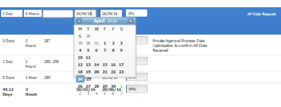

# Le date di modifica in linea spostano la visualizzazione del calendario al di fuori della casella

## Problema

Quando si modificano le date in linea in un elenco di oggetti, il calendario visualizza più date di quelle che dovrebbe. In questo modo i giorni vengono visualizzati al di fuori della casella del calendario.\

## Causa

La visualizzazione della finestra del browser è stata modificata per visualizzare un livello di zoom superiore al 100%.

## Soluzione

È necessario modificare il livello di zoom del browser in modo che sia pari o inferiore al 100%.

La modifica del livello di zoom sul browser dipende dal browser in uso.

Per modificare il livello di zoom in Google Chrome:

1. All&#39;interno di una finestra del browser, passa a **Visualizza**.
1. Fai clic su **Zoom in** per ridurre il livello di zoom nella finestra del browser corrente.\
   L&#39;area di visualizzazione nel browser viene ridotta.
