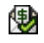

# Icone di stato incorporate nelle visualizzazioni

<!--

(NOTE: ALina: ***Link this from the Understanding Fields in Lists and Reports.) 

-->

È possibile aggiungere il campo Icone di stato incorporato come colonna nelle viste per migliorare la visibilità nei punti chiave degli oggetti. Utilizzando le icone di stato, è possibile vedere rapidamente quando sono presenti le seguenti condizioni:

* Un oggetto presenta documenti allegati
* Un oggetto è associato a un processo di approvazione
* A un oggetto sono associate note aggiuntive
* Una spesa è fatturabile o rimborsabile
* Un&#39;attività si trova su un percorso critico
* Un utente appartiene a una società, a un team o si trova in un fuso orario diverso

La maggior parte degli indicatori nel campo Icone di stato sono collegamenti rapidi all’oggetto o all’area effettiva dell’oggetto che rappresentano.

Se nell’oggetto manca uno degli elementi rappresentati dalle icone, l’icona che rappresenta l’elemento mancante viene visualizzata come un contorno nella colonna Icone di stato anziché come immagine completa.\
\
Per ulteriori informazioni, consulta la sezione [Panoramica delle icone di stato e dei flag](#overview-of-status-icons-and-flags) in questo articolo.\
In alcune visualizzazioni, il **Icone di stato** campo denominato **Flag** o **Visualizza icone**.\
Non è possibile personalizzare l’aspetto delle icone incluse nel campo Icone di stato .

## Requisiti di accesso

Per eseguire i passaggi descritti in questo articolo, è necessario disporre dei seguenti diritti di accesso:

<table style="table-layout:auto"> 
 <col> 
 <col> 
 <tbody> 
  <tr> 
   <td role="rowheader">piano Adobe Workfront*</td> 
   <td> 
Qualsiasi
 </td> 
  </tr> 
  <tr> 
   <td role="rowheader">Licenza Adobe Workfront*</td> 
   <td> 
Richiesta o superiore
 </td> 
  </tr> 
  <tr> 
   <td role="rowheader"> </td> 
   <td> </td> 
  </tr> 
  <tr> 
   <td role="rowheader">Configurazioni a livello di accesso*</td> 
   <td> 
Modificare l’accesso a Filtri, Visualizzazioni, Gruppi
 
Modificare l’accesso a Report, Dashboard e Calendari per aggiungere colonne a un report
 
Nota: Se non disponi ancora dell’accesso, chiedi all’amministratore Workfront se ha impostato ulteriori restrizioni nel livello di accesso. Per informazioni su come un amministratore Workfront può modificare il livello di accesso, consulta <a href="../../../administration-and-setup/add-users/configure-and-grant-access/create-modify-access-levels.md" class="MCXref xref">Creare o modificare livelli di accesso personalizzati</a>.
 </td> 
  </tr> 
  <tr> 
   <td role="rowheader">Autorizzazioni oggetto</td> 
   <td> 
Gestire le autorizzazioni per una visualizzazione esistente
 
Gestisci le autorizzazioni per un report per aggiungergli colonne
 
Per informazioni sulla richiesta di accesso aggiuntivo, vedi <a href="../../../workfront-basics/grant-and-request-access-to-objects/request-access.md" class="MCXref xref">Richiedere l’accesso agli oggetti </a>.
 </td> 
  </tr> 
 </tbody> 
</table>

&#42;Per informazioni sul piano, il tipo di licenza o l&#39;accesso, contattare l&#39;amministratore Workfront.

## Aggiungere il campo Icone di stato a una visualizzazione

Alcune viste e rapporti incorporati dispongono già del campo Icone di stato incluso.

Non è possibile aggiungere il campo Icone di stato a tutte le visualizzazioni.

Per aggiungere il campo Icone di stato a una visualizzazione personalizzata creata da zero:

1. Passare a un elenco di uno dei seguenti oggetti:

   * Attività
   * Problemi
   * Progetti
   * Attività modello
   * Modelli
   * Spese
   * Documenti
   * Utenti\
      Solo questi oggetti hanno **Icone di stato** campo disponibile.\
      Per informazioni sugli elenchi di oggetti, vedere [Guida introduttiva agli elenchi in Adobe Workfront](../../../workfront-basics/navigate-workfront/use-lists/view-items-in-a-list.md).

1. Da **Visualizza** menu a discesa, seleziona **Nuova vista**.

1. Fai clic su **Aggiungi colonna**.
1. In **Mostra in questa colonna** iniziare a digitare uno dei seguenti nomi di campo, quindi selezionarlo quando viene visualizzato nell&#39;elenco:

   * *Le icone di Stato*
   * *Flag*
   * *Visualizza icone *(solo nelle viste documento).

   Le icone incorporate sono elencate sotto uno qualsiasi di questi nomi.\
   Una visualizzazione Modello contiene sia la **Icone di stato** e **Flag** campi. In questo caso, le due colonne contengono icone identiche.\
   Le visualizzazioni documenti contengono un **Visualizza icone** campo .

1. Fai clic su **Salva visualizzazione**.
1. (Facoltativo) Specifica un nuovo nome per la visualizzazione, quindi fai clic su **Salva visualizzazione**.\
   Questo aggiunge il **Icone di stato** nella tua visualizzazione.
1. (Facoltativo) Passa il puntatore del mouse su un&#39;icona per capire cosa rappresenta.
1. (Facoltativo) Fai clic su un&#39;icona per passare all&#39;area dell&#39;oggetto da essa rappresentato.\
   Non tutte le icone sono collegamenti agli oggetti.\
   Per un elenco completo degli attributi per ciascuna icona, consulta [Panoramica delle icone di stato e dei flag](#overview-of-status-icons-and-flags) sezione .

## Panoramica delle icone di stato e dei flag {#overview-of-status-icons-and-flags}

Nella tabella seguente sono elencate tutte le icone di stato disponibili in Workfront, il tipo di oggetti che possono essere associati ad esse e ciò che accade quando si fanno clic su di esse.

Per poter fare clic su alcune delle icone seguenti e accedere a tali oggetti, è necessario disporre delle autorizzazioni per visualizzare almeno gli oggetti.

<table style="table-layout:auto"> 
 <col> 
 <col> 
 <col> 
 <col> 
 <col> 
 <thead> 
  <tr> 
   <th><strong>Icona o contrassegno di stato</strong> </th> 
   <th><strong>Descrizione</strong> </th> 
   <th><strong>Oggetto</strong> </th> 
   <th>Al clic</th> 
   <th> </th> 
  </tr> 
 </thead> 
 <tbody> 
  <tr> 
   <td> o   o   o </td> 
   <td>Indica che la condizione del progetto è On Target (verde), In Trouble (rosso) o At Risk (giallo). Per informazioni sulla condizione del progetto, consulta <a href="../../../manage-work/projects/manage-projects/project-condition-and-condition-type.md" class="MCXref xref">Panoramica del tipo di condizione e condizione del progetto</a>.</td> 
   <td>Progetti</td> 
   <td>Fai clic su per aprire l’elenco delle attività del progetto. </td> 
   <td> </td> 
  </tr> 
  <tr> 
   <td>  </td> 
   <td>Indica che l’oggetto contiene note (aggiornamenti) nella scheda Aggiornamenti.</td> 
   <td> 
Progetti Attività Problemi Modelli Attività dei modelli
 </td> 
   <td> 
Fare clic per aprire la scheda Aggiornamenti dell’oggetto. 
 </td> 
   <td> </td> 
  </tr> 
  <tr> 
   <td> oppure </td> 
   <td>Indica che all’oggetto sono associati documenti. </td> 
   <td> Progetti Attività Problemi Modelli Attività dei modelli </td> 
   <td>Fare clic per aprire la scheda Documenti dell'oggetto. </td> 
   <td> </td> 
  </tr> 
  <tr> 
   <td> oppure </td> 
   <td>Indica che sono presenti problemi aperti nel progetto o nell’attività.</td> 
   <td> Progetti Attività </td> 
   <td>Fare clic per aprire l’oggetto. </td> 
   <td> </td> 
  </tr> 
  <tr> 
   <td>  oppure </td> 
   <td>Indica che sull'oggetto è presente un'approvazione.</td> 
   <td> Progetti Attività Problemi Modelli Attività dei modelli </td> 
   <td>Fare clic per aprire l’oggetto. </td> 
   <td> </td> 
  </tr> 
  <tr> 
   <td>  </td> 
   <td> 
Puoi aggiungere una colonna Icona Spese nella visualizzazione per visualizzare questa icona. Ciò indica che il progetto o l'attività hanno le relative spese associate.
 </td> 
   <td> 
Progetti
 
Attività
 </td> 
   <td>Fai clic su per aprire la scheda Spese del progetto o dell’attività. </td> 
   <td> </td> 
  </tr> 
  <tr> 
   <td>           </td> 
   <td> 
Indica che lo stato di avanzamento di un'attività è uno dei seguenti:
 
    <ul> 
     <li>Ora di attivazione (quadrato verde)</li> 
     <li>Ritardo (cerchio rosso)</li> 
     <li>A rischio (diamante blu)</li> 
     <li>Dietro (triangolo giallo)</li> 
    </ul> 
Per informazioni sullo stato di avanzamento delle attività, vedere <a href="../../../manage-work/tasks/task-information/task-progress-status.md" class="MCXref xref">Panoramica sullo stato dell'avanzamento dell'attività</a>.
 </td> 
   <td>Attività</td> 
   <td>Fare clic per aprire l'attività. </td> 
   <td> </td> 
  </tr> 
  <tr> 
   <td>  oppure </td> 
   <td>Indica che l'attività è attualmente nel percorso critico.  Per informazioni sulle attività in un percorso critico del progetto, consulta <a href="../../../manage-work/tasks/manage-tasks/critical-path.md" class="MCXref xref">Panoramica del progetto Percorso critico</a>.</td> 
   <td>Attività</td> 
   <td>Fare clic per aprire l'attività.</td> 
   <td> </td> 
  </tr> 
  <tr> 
   <td>  </td> 
   <td>Indica che l'attività è associata a un'attività cardine. L’amministratore di sistema può personalizzare il colore del rombo nell’ambiente. Per informazioni sulle milestone, vedi <a href="../../../administration-and-setup/customize-workfront/configure-approval-milestone-processes/create-milestone-path.md" class="MCXref xref">Creare un percorso cardine</a>.</td> 
   <td>Attività</td> 
   <td>Fare clic per aprire l'attività. </td> 
   <td> </td> 
  </tr> 
  <tr> 
   <td>  </td> 
   <td>Collega all'oggetto sorgente di un problema. L'oggetto di origine di un problema è l'oggetto in cui è stato registrato il problema. Un'attività o un progetto può essere oggetto di origine dei problemi. </td> 
   <td>Problemi</td> 
   <td>Fare clic per aprire l'oggetto di origine (attività o progetto) di un problema. </td> 
   <td> </td> 
  </tr> 
  <tr> 
   <td>  </td> 
   <td>Indica che esiste un oggetto di risoluzione che risolve il problema. In questo caso, non è possibile completare il problema. Viene completato al completamento dell'oggetto di risoluzione.  Per informazioni sulla risoluzione degli oggetti, vedere <a href="../../../manage-work/issues/convert-issues/resolving-and-resolvable-objects.md" class="MCXref xref">Panoramica sulla risoluzione e risoluzione di oggetti </a>.</td> 
   <td>Problemi</td> 
   <td>Fare clic per aprire l'oggetto di risoluzione del problema. </td> 
   <td> </td> 
  </tr> 
  <tr> 
   <td>  </td> 
   <td>Visualizza un documento.</td> 
   <td>Documenti</td> 
   <td>Fai clic su per scaricare il documento.</td> 
   <td> </td> 
  </tr> 
  <tr> 
   <td>  </td> 
   <td>Scarica un documento.</td> 
   <td>Documenti</td> 
   <td>Fai clic su per scaricare il documento.</td> 
   <td> </td> 
  </tr> 
  <tr> 
   <td>  </td> 
   <td>Indica il tipo di documento.</td> 
   <td>Documenti</td> 
   <td>Fai clic su per scaricare il documento.</td> 
   <td> </td> 
  </tr> 
  <tr> 
   <td>  </td> 
   <td>Indica che l'utente è associato a un'azienda. </td> 
   <td>Utenti</td> 
   <td>Non disponibile</td> 
   <td> </td> 
  </tr> 
  <tr> 
   <td>  </td> 
   <td>Indica che l'utente è associato a un team.</td> 
   <td>Utenti</td> 
   <td>Fai clic su per aprire il profilo utente.</td> 
   <td> </td> 
  </tr> 
  <tr> 
   <td>  </td> 
   <td>Collegamento alla scheda Allocazione dell’utente. </td> 
   <td>Utenti</td> 
   <td>Fai clic su per aprire la scheda Allocazione dell’utente e scopri gli elementi di lavoro assegnati all’utente.</td> 
   <td> </td> 
  </tr> 
  <tr> 
   <td>  </td> 
   <td>Indica che l'utente si trova in un fuso orario diverso da quello del sistema.</td> 
   <td>Utenti</td> 
   <td>Non disponibile</td> 
   <td> </td> 
  </tr> 
  <tr> 
   <td>  </td> 
   <td>Indica che una spesa è fatturabile. Per informazioni sulle spese, vedi <a href="../../../manage-work/projects/project-finances/manage-project-expenses.md" class="MCXref xref">Gestione delle spese di progetto </a>.</td> 
   <td>Spese</td> 
   <td>Non disponibile</td> 
   <td> </td> 
  </tr> 
  <tr> 
   <td>  </td> 
   <td> Indica che una spesa è rimborsabile. Per informazioni sulle spese, vedi <a href="../../../manage-work/projects/project-finances/manage-project-expenses.md" class="MCXref xref">Gestione delle spese di progetto </a>.</td> 
   <td>Spese</td> 
   <td>Non disponibile</td> 
   <td> </td> 
  </tr> 
  <tr> 
   <td> </td> 
   <td> Indica che una spesa è stata rimborsata. Per informazioni sulle spese, vedi <a href="../../../manage-work/projects/project-finances/manage-project-expenses.md" class="MCXref xref">Gestione delle spese di progetto </a>.</td> 
   <td>Spese</td> 
   <td>Non disponibile</td> 
   <td> </td> 
  </tr> 
 </tbody> 
</table>
