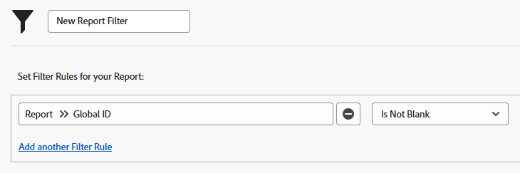

# Utilizzare i rapporti incorporati di Adobe Workfront

<!--Audited: 11/2024-->

Adobe Workfront dispone di un ampio elenco di report incorporati che è possibile utilizzare.

Gli amministratori di Workfront possono nascondere i report incorporati in modo che gli utenti non possano accedervi. Per ulteriori informazioni su come nascondere i report predefiniti, vedere [Nascondere i report predefiniti](../../../administration-and-setup/manage-workfront/configure-reports/hide-built-in-reports.md).

## Requisiti di accesso

+++ Espandi per visualizzare i requisiti di accesso per la funzionalità descritta in questo articolo. 

<table style="table-layout:auto"> 
 <col> 
 <col> 
 <tbody> 
  <tr> 
   <td role="rowheader">Pacchetto Adobe Workfront</td> 
   <td> 
Qualsiasi
 </td> 
  </tr> 
  <tr> 
   <td role="rowheader">Licenza di Adobe Workfront</td> 
   <td> 
      
Collaboratore o successiva

      
Richiedente o successiva

   </td>
  </tr>
  <tr> 
   <td role="rowheader">Configurazioni del livello di accesso</td> 
   <td> 
Modifica accesso a Filtri, Viste, Raggruppamenti
 
Accesso di visualizzazione o superiore a report, dashboard, calendari
 </td> 
  </tr> 
  <tr> 
   <td role="rowheader">Autorizzazioni sugli oggetti</td> 
   <td> 
Gestire le autorizzazioni di un report per aggiungere o modificare un filtro in un report
 
Gestire le autorizzazioni per un filtro per modificarlo in un elenco
 </td> 
  </tr> 
 </tbody> 
</table>

Per ulteriori dettagli sulle informazioni contenute in questa tabella, consulta [Requisiti di accesso nella documentazione Workfront](/help/quicksilver/administration-and-setup/add-users/access-levels-and-object-permissions/access-level-requirements-in-documentation.md).

+++

## Panoramica dei rapporti incorporati {#overview-of-built-in-reports}

È possibile creare una copia di un report predefinito e salvarla come nuovo report. Per ulteriori informazioni sulla creazione di copie di report incorporati, vedere [Creare una nuova versione di un report](/help/quicksilver/reports-and-dashboards/reports/creating-and-managing-reports/create-copy-report.md#create-a-new-version-of-a-report) nell&#39;articolo [Creare una copia di un report](/help/quicksilver/reports-and-dashboards/reports/creating-and-managing-reports/create-copy-report.md).

I seguenti report vengono forniti con il pacchetto Workfront. I report sono disponibili per tutti gli utenti che dispongono almeno dei diritti di visualizzazione per i report incorporati nel proprio livello di accesso.

<table style="table-layout:auto"> 
 <col> 
 <col> 
 <thead> 
  <tr> 
   <th><strong>Nome report</strong> </th> 
   <th><strong>Descrizione report</strong> </th> 
  </tr> 
 </thead> 
 <tbody> 
  <tr> 
   <td>Costo Reale di Portfolio per Programma</td> 
   <td>Rapporto Progetto in cui vengono visualizzati il costo pianificato e il costo effettivo dei progetti. Il report è raggruppato in base al nome del programma, richiesto dal nome del Portfolio, e include un grafico.</td> 
  </tr> 
  <tr> 
   <td>Costo Reale di Portfolio per Progetto</td> 
   <td>Rapporto Progetto in cui vengono visualizzati il costo pianificato e il costo effettivo dei progetti. Il report è raggruppato in base al nome del progetto, richiesto dal nome del Portfolio, e include un grafico.</td> 
  </tr> 
  <tr> 
   <td>Reddito reale di portfolio per programma</td> 
   <td>Rapporto Progetto in cui vengono visualizzati i ricavi pianificati e i ricavi effettivi dei progetti. Il report è raggruppato in base al nome del programma, richiesto dal nome del Portfolio, e include un grafico.</td> 
  </tr> 
  <tr> 
   <td>Entrate effettive portfolio per progetto</td> 
   <td>Rapporto Progetto in cui vengono visualizzati i ricavi pianificati e i ricavi effettivi dei progetti. Il report è raggruppato in base al nome del progetto, richiesto dal nome del Portfolio, e include un grafico.</td> 
  </tr> 
  <tr> 
   <td>Entrate effettive per Azienda</td> 
   <td>Rapporto Progetto che visualizza i ricavi effettivi e la società dei progetti. Il report è raggruppato per Nome società e include un grafico.</td> 
  </tr> 
  <tr> 
   <td>Entrate effettive per gruppo</td> 
   <td>Rapporto Progetto che visualizza i ricavi effettivi e il gruppo dei progetti. Il report è raggruppato per Nome gruppo e include un grafico.</td> 
  </tr> 
  <tr> 
   <td>Tutti i Timesheets Aperti</td> 
   <td>Un report Scheda attività che visualizza Schede attività aperte. Il rapporto visualizza i campi seguenti: Intervallo di date, Nome proprietario, Ore totali, Straordinario, Nome approvatore e Stato delle schede attività.</td> 
  </tr> 
  <tr> 
   <td>Timesheets da Approvare(Suggeriti)</td> 
   <td>Un report Scheda attività che visualizza le schede attività Inviate o Rifiutate con approvatori. Il rapporto visualizza i campi seguenti: Intervallo di date, Proprietario, Ore totali, Straordinario, Nome approvatore e Stato delle schede attività. Il report viene richiesto da: Data inizio scheda attività, Data fine scheda attività, Nome approvatore scheda attività e Nome utente.</td> 
  </tr> 
  <tr> 
   <td>Progetti a Rischio</td> 
   <td>Report di progetto che visualizza i progetti correnti e di pianificazione con una condizione di rischio o in difficoltà. Nel rapporto vengono visualizzati i seguenti campi: Descrizione, Data di completamento pianificata, Data di completamento prevista, Percentuale di completamento, Stato e Priorità dei progetti. Il report è raggruppato per Nome Portfolio.</td> 
  </tr> 
  <tr> 
   <td>Entrate fatturazione per azienda</td> 
   <td>Report di progetto in cui vengono visualizzati i ricavi società e fatturazione dei progetti. Il report è raggruppato per Nome società e include un grafico.</td> 
  </tr> 
  <tr> 
   <td>Entrate fatturazione per gruppo</td> 
   <td>Report di progetto che visualizza i ricavi di fatturazione e il gruppo dei progetti. Il report è raggruppato per Nome gruppo e include un grafico.</td> 
  </tr> 
  <tr> 
   <td>Entrate fatturazione per mese</td> 
   <td>Rapporto Record di fatturazione che visualizza il nome del progetto, i ricavi di fatturazione del progetto e la data di fatturazione dei record di fatturazione. Il report viene raggruppato in base al mese della data di fatturazione dei record di fatturazione e include un grafico.</td> 
  </tr> 
  <tr> 
   <td>Issues Completate per Settimana</td> 
   <td>Un rapporto Problema che visualizza la data di completamento effettivo dei problemi. Il rapporto è raggruppato per la settimana della data di completamento effettivo delle emissioni e include un grafico.</td> 
  </tr> 
  <tr> 
   <td>Issues Completate per Utente per Settimana</td> 
   <td>Un rapporto Problema che visualizza la data di completamento effettivo e le assegnazioni dei problemi. Il rapporto è raggruppato per l'assegnatario principale e per la settimana della data di completamento effettivo delle emissioni e include un grafico.</td> 
  </tr> 
  <tr> 
   <td>Progetti Attuali</td> 
   <td>Report di progetto che visualizza tutti i progetti correnti. Nel rapporto vengono visualizzati i seguenti campi: Descrizione, Data di completamento pianificata, Data di completamento prevista, Percentuale di completamento, Stato e Priorità dei progetti.</td> 
  </tr> 
  <tr> 
   <td>Costo orario per utente per mese</td> 
   <td>Un rapporto Ora matrice che visualizza il numero di ore registrate e il relativo costo effettivo. Il report viene raggruppato in base al nome del proprietario e al mese della data di immissione delle ore.</td> 
  </tr> 
  <tr> 
   <td>Ore per utente</td> 
   <td>Report ore che visualizza il numero di ore registrate. Il report è raggruppato in base al nome del proprietario e include un grafico.</td> 
  </tr> 
  <tr> 
   <td>Ore per utente per settimana</td> 
   <td>Un report di ore matrice che visualizza il numero di ore registrate nelle ultime quattro settimane e la data di immissione delle ore. Il report viene richiesto in base alla Data di immissione delle ore ed è raggruppato per Nome proprietario e per il mese della Data di immissione delle ore.</td> 
  </tr> 
  <tr> 
   <td>Problemi per stato</td> 
   <td>Un report di problemi che visualizza lo Stato dei problemi. Il report è raggruppato per stato dei problemi e include un grafico.</td> 
  </tr> 
  <tr> 
   <td>Problemi per stato e progetto</td> 
   <td>Un report di problemi matrice che visualizza lo Stato dei problemi nei progetti correnti e il Nome del progetto. Il report è raggruppato per Nome progetto e Stato dei problemi.</td> 
  </tr> 
  <tr> 
   <td>Costi Lavoro vs. Costi Spese per Portfolio</td> 
   <td>Un report di progetti che visualizza Costo manodopera pianificata, Costo effettivo manodopera, Costo spesa pianificata e Costo spesa effettivo dei progetti. Il report è raggruppato per nome Portfolio e include un grafico.</td> 
  </tr> 
  <tr> 
   <td>Costi Lavoro vs. Costi Spese per Programma</td> 
   <td>Un report di progetti che visualizza Costo manodopera pianificata, Costo effettivo manodopera, Costo spesa pianificata e Costo spesa effettivo dei progetti. Il report è raggruppato per nome Portfolio e nome programma e include un grafico.</td> 
  </tr> 
  <tr> 
   <td>Costo pianificato rispetto al costo effettivo portfolio mensile per Progetto</td> 
   <td>Un rapporto Progetto di matrice (dati finanziari) che visualizza la data di allocazione, il costo totale pianificato, il costo totale effettivo e lo scostamento costo totale dei progetti. Il report è raggruppato per Nome progetto, trimestre e mese della Data di allocazione.</td> 
  </tr> 
  <tr> 
   <td>Entrate mensili pianificate ed effettive dei portfolio per progetto</td> 
   <td>Rapporto Progetto di matrice (dati finanziari) che visualizza la data di allocazione, il totale dei ricavi pianificati, il totale dei ricavi effettivi e lo scostamento totale dei ricavi dei progetti. Il report è raggruppato per Nome progetto, trimestre e mese della Data di allocazione.</td> 
  </tr> 
  <tr> 
   <td>Costi pianificati del progetto mensili rispetto ai costi effettivi</td> 
   <td>Un rapporto Progetto di matrice (dati finanziari) che visualizza la data di allocazione, il costo totale pianificato, il costo totale effettivo e lo scostamento costo totale dei progetti. Il report viene raggruppato in base al nome del progetto, al trimestre e al mese della data di allocazione e viene richiesto in base al nome del progetto.</td> 
  </tr> 
  <tr> 
   <td>Entrate mensili pianificate ed effettive dei progetti</td> 
   <td>Rapporto Progetto di matrice (dati finanziari) che visualizza la data di allocazione, il totale dei ricavi pianificati, il totale dei ricavi effettivi e lo scostamento totale dei ricavi dei progetti. Il report viene raggruppato in base al nome del progetto, al trimestre e al mese della data di allocazione e viene richiesto in base al nome del progetto.</td> 
  </tr> 
  <tr> 
   <td>I Miei Documenti</td> 
   <td>Report di documento che visualizza i documenti caricati dall'utente che ha effettuato l'accesso. Il report visualizza i seguenti campi: Nome proprietario, Data modifica, Dimensioni, Conteggio versioni, Origine e Tipo dei documenti.</td> 
  </tr> 
  <tr> 
   <td>I Miei Preferiti</td> 
   <td>Un report Preferiti che visualizza un elenco di oggetti contrassegnati come preferiti dall'utente che ha effettuato l'accesso. Il report visualizza i seguenti campi: Tipo di oggetto e Nome dei preferiti.</td> 
  </tr> 
  <tr> 
   <td>I miei problemi</td> 
   <td>Un Report di problema che visualizza i problemi incompleti assegnati all'utente che ha effettuato l'accesso. Il rapporto visualizza i seguenti campi: Nome origine, Tipo di problema, Assegnatario principale, Data inserimento, Stato e Priorità dei problemi.</td> 
  </tr> 
  <tr> 
   <td>I Miei Portfolio</td> 
   <td>Un report Portfolio che visualizza i Portfoli attivi in cui l’utente che ha effettuato l’accesso è il Gestore Portfolio.</td> 
  </tr> 
  <tr> 
   <td>I Miei Programmi</td> 
   <td>Un report del programma che visualizza i programmi e la relativa descrizione, in cui l'utente che ha effettuato l'accesso è il Program Manager.</td> 
  </tr> 
  <tr> 
   <td>Le Mie Issues Aperte nei Progetti</td> 
   <td>Report di problema che visualizza i problemi incompleti nei progetti in cui il team di progetto include l'utente connesso. Il rapporto visualizza i seguenti campi: Nome origine, Tipo di problema, Assegnatario principale, Data inserimento, Stato e Priorità dei problemi.</td> 
  </tr> 
  <tr> 
   <td>I miei progetti</td> 
   <td>Report di progetto che visualizza i progetti correnti il cui team di progetto include l'utente connesso. Nel rapporto vengono visualizzati i seguenti campi: Descrizione, Data di completamento pianificata, Data di completamento prevista, Percentuale di completamento, Stato e Priorità dei progetti.</td> 
  </tr> 
  <tr> 
   <td>Problemi inviati</td> 
   <td>Un Report di problema che visualizza i problemi inviati dall'utente connesso, che sono stati chiusi negli ultimi tre mesi o sono attualmente aperti. Il rapporto visualizza i seguenti campi: Nome origine, Tipo di problema, Data inserimento, Stato e Priorità dei problemi.</td> 
  </tr> 
  <tr> 
   <td>Le mie attività</td> 
   <td>Report di task che visualizza i task incompleti nei progetti correnti assegnati all'utente connesso. Il rapporto visualizza i campi seguenti: Durata pianificata, Nome progetto, Assegnatario principale, Inizio pianificato, Completamento pianificato, Percentuale completamento e Priorità delle attività.</td> 
  </tr> 
  <tr> 
   <td>Le mie schede orario</td> 
   <td>Un report Scheda attività che visualizza tutte le schede attività dell'utente connesso. Il rapporto visualizza i campi seguenti: Intervallo di date, Nome proprietario, Ore totali, Straordinario, Nome approvatore e Stato delle schede attività.</td> 
  </tr> 
  <tr> 
   <td>Issues non Assegnate a Me</td> 
   <td>Report di problema che visualizza i problemi aperti assegnati a uno qualsiasi dei ruoli di lavoro dell'utente connesso e non assegnati all'utente. Il rapporto visualizza i seguenti campi: Nome origine, Tipo di problema, Data inserimento, Stato e Priorità dei problemi.</td> 
  </tr> 
  <tr> 
   <td>Le Mie Attività non Assegnate</td> 
   <td>Report di attività che visualizza le attività incomplete assegnate a uno qualsiasi dei ruoli di lavoro dell'utente connesso e non assegnate all'utente. Il rapporto visualizza i campi seguenti: Durata pianificata, Nome progetto, Assegnatario principale, Data inizio pianificata, Data completamento pianificata, Percentuale completamento e Priorità delle attività.</td> 
  </tr> 
  <tr> 
   <td>Le Mie prossime Attività</td> 
   <td>Report di attività che visualizza le attività incomplete che dovrebbero iniziare nelle due settimane successive, sono in progetti correnti e sono assegnate all'utente connesso. Nel rapporto vengono visualizzati i seguenti campi: Nome progetto, Data di completamento pianificata, Data di completamento prevista, Percentuale di completamento e Stato delle attività.</td> 
  </tr> 
  <tr> 
   <td>Apri i Timesheets(Suggeriti)</td> 
   <td>Un report di timesheet che visualizza i Timesheet aperti. Il rapporto visualizza i campi seguenti: Intervallo di date, Proprietario, Ore totali, Straordinario, Nome approvatore, Stato delle schede attività. Il report viene richiesto da: Data inizio scheda attività, Data fine scheda attività, Nome approvatore scheda attività e Nome utente.</td> 
  </tr> 
  <tr> 
   <td>Progetti Fuori Budget per Portfolio</td> 
   <td>Rapporto Progetto in cui vengono visualizzati il costo pianificato e il costo effettivo dei progetti. Il report è raggruppato per Nome Portfolio.</td> 
  </tr> 
  <tr> 
   <td>Costo Pianifcato Portfolio per Programma</td> 
   <td>Rapporto Progetto in cui vengono visualizzati il costo pianificato e il costo effettivo dei progetti. Il report viene richiesto in base al nome del Portfolio, raggruppato in base al nome del programma e include un grafico.</td> 
  </tr> 
  <tr> 
   <td>Costo Pianificato Portfolio per Progetto</td> 
   <td>Un report di progetti che visualizza il costo pianificato e il costo effettivo dei progetti. Il report viene richiesto da Nome Portfolio, raggruppato per Nome progetto e include un grafico.</td> 
  </tr> 
  <tr> 
   <td>Entrate pianificate portfolio per programma</td> 
   <td>Un report di progetti che visualizza la Retribuzione pianificata e la Retribuzione effettiva dei progetti. Il report viene richiesto da Nome Portfolio, raggruppato per Nome programma e include un grafico.</td> 
  </tr> 
  <tr> 
   <td>Entrate pianificate portfolio per progetto</td> 
   <td>Un report di progetti che visualizza la Retribuzione pianificata e la Retribuzione effettiva dei progetti. Il report viene richiesto da Nome Portfolio, raggruppato per Nome progetto e include un grafico.</td> 
  </tr> 
  <tr> 
   <td>Costi Reali vs. Costi Pianificati per Portfolio</td> 
   <td>Un report di progetti che visualizza il Costo pianificato e il Costo effettivo dei progetti per Portfolio. Il report è raggruppato per nome Portfolio e include un grafico.</td> 
  </tr> 
  <tr> 
   <td>Costi Reali vs. Costi Pianificati per Programma</td> 
   <td>Rapporto Progetto in cui vengono visualizzati il costo pianificato e il costo effettivo dei progetti per programma. Il report è raggruppato in base al nome del Portfolio e include un grafico.</td> 
  </tr> 
  <tr> 
   <td>Entrate pianificate ed effettive per portfolio</td> 
   <td>Rapporto Progetto in cui vengono visualizzati i ricavi pianificati e i ricavi effettivi dei progetti. Il report è raggruppato in base al nome del Portfolio e include un grafico.</td> 
  </tr> 
  <tr> 
   <td>Entrate pianificate ed effettive per programma</td> 
   <td>Rapporto Progetto in cui vengono visualizzati i ricavi pianificati e i ricavi effettivi dei progetti. Il report è raggruppato in base al nome del programma e include un grafico.</td> 
  </tr> 
  <tr> 
   <td>Costi portfolio raggruppati per programma e mese</td> 
   <td>Un report di progetti matrice che visualizza il Costo pianificato, il Costo preventivato e il Costo effettivo dei progetti. Il rapporto è raggruppato per nome Portfolio, nome del programma e mese della data di inizio pianificata dei progetti.</td> 
  </tr> 
  <tr> 
   <td>Progetti di Portfolio divisi per Stato e Programma</td> 
   <td>Un report di progetti che visualizza lo Stato dei progetti. Il report è raggruppato per Nome programma e Stato progetto e include un grafico.</td> 
  </tr> 
  <tr> 
   <td>Progetti di Portfolio divisi per condizione e Portfolio</td> 
   <td>Un report di progetti che visualizza il Nome Portfolio e lo Stato dei progetti. Il report è raggruppato per nome Portfolio e stato dei progetti e include un grafico.</td> 
  </tr> 
  <tr> 
   <td>Entrate dei portfolio per programma</td> 
   <td>Un report di progetti che visualizza il Nome Portfolio, il Nome programma, la Retribuzione pianificata e la Retribuzione effettiva dei progetti. Il report è raggruppato per nome Portfolio e nome del programma e include un grafico.</td> 
  </tr> 
  <tr> 
   <td>Entrate dei portfolio raggruppate per programma e mese</td> 
   <td>Rapporto di Project matrice che visualizza i ricavi pianificati, i ricavi effettivi, il nome del Portfolio e il nome del programma. Il report è raggruppato in base al Nome Portfolio, al Nome programma e al mese della Data di inizio pianificata dei progetti.</td> 
  </tr> 
  <tr> 
   <td>Costi ed entrate dei progetti per stato attività</td> 
   <td>Rapporto Attività matrice in cui vengono visualizzati il costo pianificato, il costo effettivo, i ricavi pianificati, i ricavi effettivi e il nome del progetto delle attività. Il report è raggruppato in base al nome del progetto e allo stato delle attività.</td> 
  </tr> 
  <tr> 
   <td>Costi ed entrate dei progetti per portfolio</td> 
   <td>Report di progetto in cui vengono visualizzati il nome del Portfolio, il costo effettivo e i ricavi effettivi dei progetti. Il report è raggruppato in base al nome del Portfolio e include un grafico.</td> 
  </tr> 
  <tr> 
   <td>Spese progetto per mese e trimestre</td> 
   <td>Matrice Nota spese che visualizza la data di inserimento, l'importo pianificato, l'importo effettivo e il progetto delle spese. La relazione è raggruppata in base al nome del progetto, al trimestre e al mese della data di inserimento delle spese.</td> 
  </tr> 
  <tr> 
   <td>Costo orario progetto per tipo di ore per mese</td> 
   <td>Rapporto Ora matrice che visualizza i seguenti campi: Ore, Data inserimento, Costo effettivo dei progetti, Tipo ora, Nome progetto. Il report è raggruppato per Nome progetto, mese della data di immissione delle ore e Tipo di ora.</td> 
  </tr> 
  <tr> 
   <td>Costo spese e manodopera progetto per mese e trimestre</td> 
   <td>Matrice Rapporto Progetto che visualizza il costo della manodopera pianificato, il costo effettivo della manodopera, il costo delle spese pianificate e il costo effettivo delle spese dei progetti. Il report è raggruppato in base al nome del progetto e al trimestre e al mese della data di inizio effettivo dei progetti.</td> 
  </tr> 
  <tr> 
   <td>Prestazioni progetto</td> 
   <td>Rapporto Progetto che visualizza i seguenti campi dei progetti correnti: Data di scadenza, CPI, SPI, CSI, Costo pianificato, Budget, EAC e Spese dei progetti.</td> 
  </tr> 
  <tr> 
   <td>Richieste Progetto</td> 
   <td>Report di progetto che visualizza i progetti richiesti. Nel rapporto vengono visualizzati i seguenti campi: Descrizione, Data di completamento pianificata, Data di completamento prevista, Percentuale di completamento, Stato e Priorità dei progetti.</td> 
  </tr> 
  <tr> 
   <td>Progetti per Condizione</td> 
   <td>Report di Project che visualizza la condizione dei progetti. Il report è raggruppato per condizione e include un grafico.</td> 
  </tr> 
  <tr> 
   <td>Progetti per Condizione per Gruppo</td> 
   <td>Report di progetto che visualizza lo stato di avanzamento e il gruppo dei progetti. Il report è raggruppato per Nome gruppo e Stato avanzamento e include un grafico.</td> 
  </tr> 
  <tr> 
   <td>Progetti per Priorità</td> 
   <td>Report di Project che visualizza la priorità dei progetti. Il rapporto è raggruppato per priorità e include un grafico.</td> 
  </tr> 
  <tr> 
   <td>Grafico Progetti per Stato Avanzamento</td> 
   <td>Report di progetto che visualizza lo stato di avanzamento dei progetti. Il report è raggruppato in base allo stato di avanzamento e include un grafico.</td> 
  </tr> 
  <tr> 
   <td>Attività per stato di avanzamento</td> 
   <td>Un report Attività che visualizza lo stato di avanzamento di tutte le attività nei progetti correnti. Il report è raggruppato per stato di avanzamento e include un grafico.</td> 
  </tr> 
  <tr> 
   <td>Attività per stato</td> 
   <td>Un report di attività che visualizza lo Stato di tutte le attività. Il report è raggruppato per Stato e include un grafico.</td> 
  </tr> 
  <tr> 
   <td>Timesheets da Revisionare</td> 
   <td>Un report di timesheet che visualizza i timesheet inviati e rifiutati il cui approvatore è l'utente connesso. Il rapporto visualizza i campi seguenti: Intervallo date, Proprietario, Ore totali, Straordinario, Nome approvatore e Stato delle schede orario.</td> 
  </tr> 
  <tr> 
   <td>Le attività in pericolo</td> 
   <td>Un report di attività che visualizza le attività incomplete con uno Stato di avanzamento di In ritardo o In ritardo, una Data di handoff precedente a domani e dove l'utente connesso fa parte del Team di progetto del progetto in cui si trovano le attività. Il rapporto visualizza i campi seguenti: Durata pianificata, Nome progetto, Assegnatario principale, Inizio pianificato, Completamento pianificato, Percentuale completata e Priorità delle attività.</td> 
  </tr> 
  <tr> 
   <td>I Login Utente</td> 
   <td>Un report Utente che visualizza i seguenti campi: ID univoco, Conteggio accessi (il numero di volte che l'utente ha effettuato l'accesso dall'inizio con Workfront), Data ultimo accesso degli utenti. Il report è raggruppato per livello di accesso degli utenti.</td> 
  </tr> 
 </tbody> 
 
 
 
</table>

## Accesso ai report incorporati

<!--

(NOTE: Section directly linked to "Getting Started with Workfront Reporting." Do not change/ rename.) 

-->

{{step1-click-main-menu}}

1. Fai clic su **Report**.
1. Fai clic su **Tutti i report**.
1. Espandete il menu a discesa **Filtro** e selezionate **Nuovo filtro**.

1. Fare clic su **Aggiungi regola filtro**.
1. Nel campo **Inizia a digitare nome campo**, inizia a digitare **ID globale**.

1. Nell&#39;oggetto **Report**, seleziona **ID globale**.

1. Nel menu a discesa del modificatore del filtro, seleziona **Non è vuoto**.\
   

1. Fai clic su **Salva filtro**.\
   L’elenco dei rapporti mostra solo i rapporti incorporati.\
   Per ulteriori informazioni sui report incorporati disponibili, vedere la sezione [Panoramica dei report incorporati](#overview-of-built-in-reports) in questo articolo.
