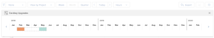

# Correggere le date di budget in pianificazione risorse

Se si riscontrano sovrassegnazioni di risorse dopo averle preventivate nella Programmazione risorse, è possibile esplorare gli scenari di simulazione spostando le ore preventivate, l&#39;FTE o i costi in un altro intervallo di tempo. In base ai risultati ottenuti in questi scenari, è possibile adeguare le ore, il FTE o il costo preventivati.

Le sovrassegnazioni possono essere visualizzate quando le ore preventivate, il valore FTE o i costi delle risorse sono superiori alle ore disponibili, al valore FTE o ai costi. Questo genera un valore netto negativo.

## Requisiti di accesso

+++ Espandi per visualizzare i requisiti di accesso per la funzionalità descritta in questo articolo.

<table style="table-layout:auto"> 
 <col> 
 <col> 
 <tbody> 
  <tr> 
   <td>Pacchetto Adobe Workfront</td> 
   <td>
Qualsiasi
</td>
  </tr> 
  <tr> 
   <td>Licenza di Adobe Workfront</td> 
   <td>
Standard

       
Piano
</td> 
  </tr> 
  <tr> 
   <td>Configurazioni del livello di accesso</td> 
   <td> 
Modifica l'accesso a Gestione risorse, incluso l'accesso a Modifica priorità e ore preventivate nella Programmazione risorse
 
Modifica l'accesso ai dati finanziari che include l'accesso a Modifica tassi di costo e Modifica contabilità generale

   
Modifica accesso a progetti e utenti
</td> 
  </tr> 
  <tr> 
   <td>Autorizzazioni sugli oggetti</td> 
   <td> 
Consente di gestire le autorizzazioni per i progetti per i quali si desidera preventivare le informazioni, con la possibilità di modificare i tassi di costo e le informazioni finanziarie generali
</td> 
  </tr> 
 </tbody> 
</table>

Per informazioni, consulta [Requisiti di accesso nella documentazione di Workfront](/help/quicksilver/administration-and-setup/add-users/access-levels-and-object-permissions/access-level-requirements-in-documentation.md).

+++

## Modifica date budget

1. Vai alla Programmazione delle risorse e seleziona **Visualizza per progetto**.

   >[!NOTE]
   >
   >È possibile utilizzare l&#39;opzione Adegua date preventivate solo quando si visualizza la Programmazione risorse per progetto.

1. Passa il puntatore del mouse sul nome di un progetto, quindi fai clic sul menu **Altro**.
1. Fare clic su **Modifica date budget**.\
   Viene visualizzata la timeline di allocazione del progetto.\
   L&#39;intervallo di tempo in cui le ore sono attualmente preventivate è evidenziato in arancione se si verifica un conflitto di budget e in blu se non si verificano conflitti.

   

1. Trascina e rilascia l’intervallo di tempo evidenziato in un altro momento per capire dove non sono presenti conflitti di budget per il progetto selezionato. Quando si trova un intervallo di tempo in cui il valore Netto è positivo, l&#39;intervallo di tempo evidenziato diventa blu.
1. Fai clic sulla &quot;x&quot; nell’angolo superiore destro della timeline di allocazione del progetto per chiuderla.
1. Rimuovi le ore preventivate dalla timeline esistente del progetto e aggiungile alla timeline che mostra la maggiore disponibilità.
1. Fai clic su **Salva**.
1. (Condizionale e facoltativo) Se gli intervalli di tempo senza conflitti di budget non rientrano nella cronologia del progetto, fare clic sul nome del progetto per accedere al progetto.
1. (Condizionale e facoltativo) Fai clic su **Modifica progetto**, quindi modifica la **Data inizio pianificata** o la **Data completamento pianificata** per modificare la sequenza temporale del progetto per l&#39;intervallo di tempo senza conflitti di budget.\
   Per ulteriori informazioni sulla modifica di progetti, vedere l&#39;articolo [Modifica progetti](../../manage-work/projects/manage-projects/edit-projects.md).

1. (Condizionale e facoltativo) Fai clic su **Salva modifiche**.
1. Tornare alla Programmazione delle risorse e inserire nuovamente le ore, i FTE o i costi preventivati nel periodo di tempo senza conflitti di budget.
1. Fai clic su **Salva**.
