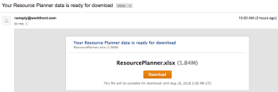

# Esporta informazioni dalla Programmazione risorse

È possibile esportare le informazioni da qualsiasi visualizzazione della Programmazione delle risorse in un file Excel (con estensione xlsx) salvato nel computer.

>[!IMPORTANT]
>
>La visualizzazione delle informazioni e le informazioni che è possibile esportare dalla Programmazione delle risorse sono limitate. Per informazioni su queste limitazioni, consulta [Limitazioni di visualizzazione della Programmazione delle risorse](../../resource-mgmt/resource-planning/resource-planner-display-limitations.md)

## Requisiti di accesso

+++ Espandi per visualizzare i requisiti di accesso per la funzionalità in questo articolo.

Per eseguire i passaggi descritti in questo articolo, è necessario disporre dei seguenti diritti di accesso:

<table style="table-layout:auto"> 
 <col> 
 <col> 
 <tbody> 
  <tr> 
   <td role="rowheader">piano Adobe Workfront</td> 
   <td>
Nuovo: Qualsiasi

       
oppure

       
Corrente: Pro o superiore
 </td> 
  </tr> 
  <tr> 
   <td role="rowheader">Licenza Adobe Workfront</td> 
   <td>
Nuovo: Chiaro o superiore

       
oppure

       
Corrente: revisione o versione successiva
</td>
  </tr> 
  <tr> 
   <td role="rowheader">Configurazioni del livello di accesso</td> 
   <td> 
Accesso di visualizzazione o superiore a progetti, utenti e gestione delle risorse
 </td> 
  </tr> 
  <tr> 
   <td role="rowheader">Autorizzazioni oggetto</td> 
   <td> 
Visualizza autorizzazioni o versioni successive per i progetti
 </td> 
  </tr> 
 </tbody> 
</table>

Per ulteriori dettagli sulle informazioni contenute in questa tabella, vedere [Requisiti di accesso nella documentazione di Workfront](/help/quicksilver/administration-and-setup/add-users/access-levels-and-object-permissions/access-level-requirements-in-documentation.md).

+++

## Esporta informazioni dalla Programmazione risorse

{{step1-to-resourcing}}

Il **Planner** viene visualizzato per impostazione predefinita.

1. Selezionate la vista per il planner. Puoi selezionare una delle seguenti opzioni:

   * Visualizza per utente
   * Visualizza per progetto
   * Visualizza per ruolo

1. Fai clic su **Esporta**.

   Viene visualizzata la finestra di dialogo Opzioni di esportazione.

   

1. Specifica le seguenti informazioni:\
   **Data inizio**: la data di inizio dell&#39;esportazione. Il file esportato contiene informazioni sull&#39;allocazione e sulla disponibilità a partire dal primo giorno della settimana che contiene il giorno specificato.\
   **Numero di periodi**: il numero di periodi di tempo che si desidera includere nel file. Il valore predefinito è 4 punti.\
   **Tipo**: il tipo di periodi di tempo in base ai quali si desidera visualizzare le informazioni nel file esportato (settimane, mesi o trimestri).\
   Di seguito sono riportati i periodi di tempo massimi che è possibile esportare:

   * 52 settimane
   * 36 mesi
   * 12 trimestri

   **Seleziona per esportazione**: a seconda della vista selezionata, è possibile scegliere di esportare le informazioni di disponibilità e budget per tutti gli oggetti elencati nella schermata o per quelli specifici.
Puoi scegliere di esportare le seguenti informazioni:

   * Nella Vista progetto, seleziona per esportare:

      * Progetti
      * Progetti e Ruoli
      * Tutto (opzione predefinita)

   * Nella Vista utente, seleziona per esportare:

      * Utenti
      * Utenti e Progetti
      * Tutto (opzione predefinita)

   * Nella Vista ruolo, seleziona per esportare:

      * Mansioni
      * Ruoli e Progetti
      * Tutto (opzione predefinita)

   **Formattazione dati**: a seconda di come si desidera visualizzare il file Excel, selezionare le opzioni seguenti:

   * **Raw**: selezionare questa opzione per visualizzare nel file Excel le informazioni sulla disponibilità e sull&#39;allocazione separate dagli oggetti a cui appartiene. (opzione predefinita)
   * **Raggruppato**: selezionare questa opzione per visualizzare le informazioni sulla disponibilità e sull&#39;allocazione raggruppate in base agli oggetti a cui appartiene. In questo modo le informazioni esportate vengono visualizzate così come appaiono sullo schermo.

   Nella finestra di dialogo Opzioni di esportazione viene visualizzato un esempio dell&#39;aspetto delle informazioni nel file esportato.

1. Fai clic su **Esporta** per esportare le informazioni dalla Programmazione delle risorse.\
   Vengono esportate solo le informazioni salvate.

1. (Condizionale) Se nelle visualizzazioni Ruolo o Progetto sono presenti ore preventivate non salvate, fare clic su **Salva e continua.**
Nel computer viene scaricato un file di Excel (.xlsx).\
   L&#39;esportazione dalla Programmazione delle risorse non è disponibile durante la preparazione del file per il download.\
   (Condizionale) Se esporti una grande quantità di dati, ricevi un’e-mail con un collegamento da cui puoi scaricare il file.\
   

1. (Condizionale) Quando ricevi l&#39;e-mail con il file esportato, fai clic su **Scarica** per scaricare il file.\
   In questo modo si ritorna a Workfront dove è possibile scaricare il file.\
   Per completare il download, devi aver effettuato l’accesso a Workfront.\
   Se non scarichi il file quando viene consegnato, il collegamento Scarica rimane attivo per 7 giorni dopo l’avvio dell’esportazione.
