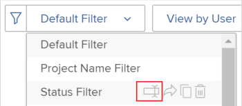

# Filtrare le informazioni nella Programmazione delle risorse

<!--

(AL:*Iterate on this article: filtering by custom data. Other enhancements? Special characters caveat might change - follow the story to know when. It originally came in Beta 3 17.3.)

-->

Utilizzando i filtri, puoi modificare le informazioni visualizzate nella Programmazione delle risorse da tutte le informazioni memorizzate nel sistema.

## Requisiti di accesso

+++ Espandi per visualizzare i requisiti di accesso per la funzionalità in questo articolo.

Per eseguire i passaggi descritti in questo articolo, è necessario disporre dei seguenti diritti di accesso:

<table style="table-layout:auto"> 
 <col> 
 <col> 
 <tbody> 
  <tr> 
   <td role="rowheader">piano Adobe Workfront</td> 
   <td>
Nuovo: Qualsiasi

       
oppure

       
Corrente: Pro o superiore
 </td> 
  </tr> 
  <tr> 
   <td role="rowheader">Licenza Adobe Workfront</td> 
   <td>
Nuovo: Chiaro o superiore

       
oppure

       
Corrente: revisione o versione successiva
</td>
  </tr> 
  <tr> 
   <td role="rowheader">Configurazioni del livello di accesso</td> 
   <td> 
Accesso di visualizzazione o superiore a progetti, utenti e gestione delle risorse
 </td> 
  </tr> 
  <tr> 
   <td role="rowheader">Autorizzazioni oggetto</td> 
   <td> 
Visualizza autorizzazioni o versioni successive per i progetti
 </td> 
  </tr> 
 </tbody> 
</table>

Per ulteriori dettagli sulle informazioni contenute in questa tabella, vedere [Requisiti di accesso nella documentazione di Workfront](/help/quicksilver/administration-and-setup/add-users/access-levels-and-object-permissions/access-level-requirements-in-documentation.md).

+++

## Panoramica dei filtri di programmazione delle risorse

Per ridurre al minimo la quantità di informazioni visualizzate nella pianificazione risorse, Adobe Workfront fornisce un filtro predefinito con criteri preconfigurati. Per informazioni sul filtro predefinito, vedere la sezione [Panoramica del filtro predefinito nella Programmazione delle risorse](#overview-of-the-default-filter-in-the-resource-planner) in questo articolo.

Puoi anche creare filtri personalizzati. Per informazioni sulla personalizzazione dei filtri nella Programmazione delle risorse, vedere la sezione [Creare filtri per la programmazione delle risorse](#create-resource-planner-filters) in questo articolo.

Quando si utilizzano i filtri nella Programmazione delle risorse, considera quanto segue:

* I filtri creati sono visibili solo a te. Puoi condividere i filtri per renderli disponibili ad altri utenti.
* In qualità di amministratore di Workfront, puoi visualizzare solo i filtri creati o condivisi con te.
* I risultati filtrati non cambiano quando si seleziona una visualizzazione diversa per la Programmazione delle risorse.\
  Per ulteriori informazioni sulla modifica della visualizzazione nella Programmazione delle risorse, vedere la sezione di selezione &quot;Project/ Role/ User view&quot; in [Panoramica sulla navigazione nella Programmazione delle risorse](../../resource-mgmt/resource-planning/resource-planner-navigation.md).

* L’applicazione di un filtro non modifica l’allocazione e la disponibilità dei dati nella Programmazione delle risorse per progetti, ruoli o utenti. Un filtro modifica solo il numero di oggetti visualizzati nella Programmazione delle risorse.
* Il filtro si applica a tutti gli oggetti visualizzati contemporaneamente nella Programmazione delle risorse. Ad esempio, se si applica un filtro per un utente specifico, la Programmazione delle risorse visualizza solo i seguenti risultati:

   * Progetti in cui l’utente fa parte del Pool di Risorse (per le viste Progetto e Ruolo) o ha un’assegnazione sul progetto (per la vista Utente)
   * Ruoli associati all’utente in tali progetti\
     Gli altri ruoli o utenti nei progetti a cui l’utente è associato non vengono visualizzati.

## Panoramica del filtro predefinito nella pianificazione risorse {#overview-of-the-default-filter-in-the-resource-planner}

Quando apri la Programmazione delle risorse per la prima volta, Workfront applica il filtro Predefinito. Puoi modificare il filtro Predefinito per filtrare solo gli elementi che desideri visualizzare. Per informazioni sulla modifica di un filtro, vedere la sezione [Modificare un filtro nella Programmazione delle risorse](#edit-a-filter-in-the-resource-planner) in questo articolo.

Quando utilizzi il filtro Predefinito, tieni presente quanto segue:

* Il filtro predefinito recupera le informazioni solo dai progetti con i seguenti elementi:

   * Una data di completamento pianificata che si verifica dopo la prima data del mese corrente
   * Una data di inizio pianificata che si verifica prima dell&#39;ultimo giorno del quarto mese dalla data corrente
   * Stato corrente o pianificazione

  >[!IMPORTANT]
  >
  >Il filtro Predefinito recupera le informazioni dai progetti che si verificano sempre entro quattro mesi a partire dal primo giorno del mese corrente, indipendentemente dall’intervallo di tempo selezionato per la visualizzazione nella Programmazione delle risorse.

* Nella Vista utente vengono visualizzati tutti gli utenti del sistema, ma solo quelli associati ai progetti filtrati mostrano le informazioni sulle ore.
* Puoi modificare le informazioni nel filtro Predefinito senza salvare il filtro.
* Puoi duplicare e modificare una copia del filtro Predefinito, modificare i criteri desiderati in esso, quindi salvarlo come nuovo filtro.
* Non puoi eliminare o condividere il filtro Predefinito.

  

## Creare filtri di programmazione delle risorse {#create-resource-planner-filters}

<!--

(Alina: **^ This section is somewhat duplicated (format more than content) from the "Filtering Utilization Information" section in "Viewing Utilization Information for Projects, Programs, and Portfolios.")

-->

La creazione di un filtro nella Programmazione delle risorse è identica per tutte le visualizzazioni.

Prima di creare un filtro, assicurati che siano presenti i prerequisiti per la visualizzazione delle informazioni corrette nella Programmazione delle risorse.\
Per informazioni sul rispetto dei prerequisiti necessari per l&#39;utilizzo di Pianificazione risorse, vedere la sezione &quot;Prerequisiti per l&#39;utilizzo di Pianificazione risorse&quot; nell&#39;articolo [Panoramica di Pianificazione risorse](../../resource-mgmt/resource-planning/get-started-resource-planner.md).

Quando crei un filtro, considera quanto segue:

* Non esiste alcun limite al numero di oggetti per i quali è possibile filtrare contemporaneamente.
* I campi disponibili che è possibile aggiungere a un filtro cambiano in base all&#39;oggetto della visualizzazione applicata alla Programmazione delle risorse. Ad esempio, è possibile filtrare i campi Problema o Attività solo nella Visualizzazione utente, poiché questi oggetti vengono visualizzati solo nella Visualizzazione utente. Se si crea un filtro per Problemi o Attività nella vista Utente e quindi lo si applica alle viste Progetto o Ruolo, questo viene ignorato perché i campi non esistono nelle viste Progetto o Ruolo. In questo caso, il filtro non risulta disponibile.

Per creare un filtro in Pianificazione risorse:

{{step1-to-resourcing}}

Il **Planner** viene visualizzato per impostazione predefinita.

Per impostazione predefinita, al primo accesso alla pianificazione risorse viene applicato il <strong>filtro predefinito</strong>. Per ulteriori informazioni sul filtro predefinito, vedere la <a href="#overview-of-the-default-filter-in-the-resource-planner" class="MCXref xref">Panoramica del filtro predefinito nella sezione Pianificazione risorse</a> in questo articolo.

1. Nell&#39;angolo superiore sinistro del , fare clic sull&#39;icona **Filtro**.
   
Oppure
Espandi il menu a discesa **Filtro** e fai clic su **Aggiungi nuovo filtro**.
   

1. Per creare un filtro utilizzando i criteri incorporati, specifica uno dei campi seguenti:

   * **Portfolio**: inizia a digitare il nome del portfolio che contiene le informazioni da includere nella Programmazione delle risorse, quindi fai clic sul nome quando viene visualizzato nell&#39;elenco.\
     Ripeti questo processo per includere informazioni da più portfolio.

   * **Stato progetto**: espandere il menu a discesa Stato progetto e selezionare uno o più stati di progetto disponibili nell&#39;elenco.
   * **Team**: inizia a digitare il nome di uno o più team associati agli utenti assegnati alle attività nei progetti che desideri visualizzare.
   * **Ruolo**: iniziare a digitare il nome di uno o più ruoli associati agli utenti assegnati alle attività nei progetti che si desidera visualizzare.
   * **Pool**: inizia a digitare il nome di uno o più Pool di Risorse associati ai progetti (per la Vista Progetto), agli utenti (per la Vista Utente) o associati sia ai progetti che agli utenti (per la Vista Ruolo) che desideri visualizzare.
   * **Gruppo**: inizia a digitare il nome di uno o più gruppi associati agli utenti (nella visualizzazione Utente) o ai progetti (nelle visualizzazioni Progetto e Ruolo) che desideri visualizzare.

1. Fare clic su **Aggiungi regola filtro**, quindi iniziare a digitare il nome del campo in base al quale si desidera filtrare nella casella **Digitare per filtrare gli elementi**. Se il campo è disponibile, viene compilato per ogni oggetto a cui può essere associato.

   >[!IMPORTANT]
   >
   >Quando si fa riferimento a campi personalizzati, è necessario digitare il nome del campo e non l’etichetta del campo. L’etichetta del campo viene visualizzata in un modulo personalizzato associato a un oggetto. Per informazioni sulla differenza tra l&#39;etichetta e il nome di un campo personalizzato, vedere [Creare un modulo personalizzato](/help/quicksilver/administration-and-setup/customize-workfront/create-manage-custom-forms/form-designer/design-a-form/design-a-form.md).

1. Fare clic sul nome del campo per aggiungerlo al filtro quando viene visualizzato nell&#39;elenco.\
   Per ulteriori informazioni sui campi visualizzati nell&#39;elenco, vedere [Glossario della terminologia di Adobe Workfront](../../workfront-basics/navigate-workfront/workfront-navigation/workfront-terminology-glossary.md).

1. (Facoltativo) Seleziona i modificatori di filtro e condizione per il filtro. I modificatori disponibili sono descritti in [Filtri e modificatori di condizioni](../../reports-and-dashboards/reports/reporting-elements/filter-condition-modifiers.md).

   È possibile utilizzare caratteri jolly basati su utente o su data per filtrare le informazioni associate all&#39;utente connesso.\
   Per informazioni sui caratteri jolly supportati nei filtri, vedi [Panoramica sulle variabili dei filtri con caratteri jolly](../../reports-and-dashboards/reports/reporting-elements/understand-wildcard-filter-variables.md).

1. Fai clic su **Salva** per salvare la regola del filtro.
1. (Facoltativo) Fai clic su **Aggiungi regola filtro** per aggiungere una nuova regola per un altro oggetto o campo.
1. Fai clic su **Applica** per applicare il filtro senza salvarlo.

   Oppure

   Fai clic su **Salva filtro** per salvare il filtro.\
   

1. (Condizionale) Dopo aver fatto clic su **Salva**, specificare un nome per il filtro nella casella **Nome filtro** della finestra di dialogo **Salva filtro**. Questo è un campo obbligatorio.\
   

   >[!NOTE]
   >
   >Se il nome del filtro include caratteri speciali, vengono utilizzati solo i seguenti caratteri:
   >
   >* Virgola
   >* Barra
   >* Trattino
   >* Sottolineatura

1. Fai clic su **Salva**.

   I risultati nella Programmazione delle risorse ora vengono filtrati in base alle informazioni incluse nelle regole di filtro.

## Applicare un filtro esistente

Quando un utente con accesso alla Pianificazione risorse salva un filtro, questo diventa disponibile per tutti coloro che utilizzano la Pianificazione risorse.

Per applicare un filtro esistente:

1. Vai alla Programmazione delle risorse.
1. Nell&#39;angolo superiore sinistro espandere il menu a discesa **Filtro**.

   Puoi visualizzare i filtri creati o altri creati e condivisi con te in questo menu.\
   

1. Seleziona un filtro nel menu a discesa. Puoi visualizzare i filtri creati da te o da altri utenti in questo menu.\
   Quando selezioni un filtro, questo riduce automaticamente la quantità di informazioni visualizzate nella Programmazione delle risorse.

## Modificare un filtro nella Programmazione delle risorse {#edit-a-filter-in-the-resource-planner}

È possibile modificare un filtro nella Programmazione delle risorse eseguendo una delle operazioni seguenti:

* [Rinominare un filtro](#rename-a-filter)
* [Modifica le informazioni in un filtro](#edit-the-information-in-a-filter)
* [Duplicare un filtro](#duplicate-a-filter)

Quando modifichi un filtro, questo viene aggiornato per tutti gli utenti del sistema che hanno accesso alla Programmazione delle risorse.

### Rinominare un filtro {#rename-a-filter}

È possibile modificare il nome di un filtro senza modificarne i criteri. È consigliabile informare altri utenti del sistema di questa modifica, in quanto i filtri sono visibili agli altri utenti. Questa modifica influisce sugli elenchi di filtri per tutti coloro che possono visualizzare la Programmazione delle risorse.

1. Vai alla Programmazione delle risorse ed espandi il menu a discesa **Filtro** per selezionare un filtro salvato.
1. Espandere il menu a discesa **Filtro**. Individua il filtro che desideri rinominare e passa il cursore sul nome.
1. Selezionare l&#39;icona **Rinomina filtro** accanto al nome del filtro.

   

1. Specificare un nuovo nome per il filtro nella casella **Nome filtro**.
1. Fai clic su **Salva**.\
   Le informazioni incluse nel filtro sono le stesse e il nome viene aggiornato.

### Modificare le informazioni in un filtro {#edit-the-information-in-a-filter}

È possibile modificare le informazioni incluse in un filtro senza modificarne il nome. È consigliabile informare altri utenti del sistema di questa modifica, in quanto i filtri sono visibili. Questa modifica influisce sugli elenchi di filtri per tutti coloro che possono visualizzare la Programmazione delle risorse.

1. Vai alla Programmazione delle risorse ed espandi il menu a discesa **Filtro** nell&#39;angolo in alto a sinistra.
1. Seleziona un filtro esistente da modificare.
1. Fai clic sull&#39;icona **Filtro**.\
   

1. Aggiungi nuovi campi al filtro.\
   Per informazioni sulla creazione di filtri, vedere [Creare filtri di programmazione delle risorse](#create-resource-planner-filters).

1. Passa il puntatore del mouse sui campi esistenti selezionati per il filtro e fai clic sull&#39;icona **Modifica** per selezionare un altro campo oppure sull&#39;icona **Elimina** per eliminare il campo.\
   

1. (Facoltativo) Fai clic su **Aggiungi regola filtro** per aggiungere nuovi campi al filtro.\
   Per ulteriori informazioni sulla definizione dei criteri di filtro, vedere [Creare filtri di programmazione delle risorse](#create-resource-planner-filters).

1. Fai clic su **Applica** per applicare il filtro senza salvarlo.

   Oppure

   Fai clic su **Salva** per salvare il filtro.\
   Il filtro viene salvato con lo stesso nome ma con i nuovi criteri di filtro.

### Duplicare un filtro {#duplicate-a-filter}

Puoi duplicare un filtro esistente. I criteri di filtro originali rimangono gli stessi nel filtro duplicato ed è possibile salvare il nuovo filtro con un nuovo nome.

1. Vai alla Programmazione delle risorse ed espandi il menu a discesa **Filtro** nell&#39;angolo in alto a sinistra.
1. Passa il puntatore del mouse sul nome di un filtro salvato che desideri duplicare.
1. Fai clic sull&#39;icona **Duplica**.

   \
   Viene visualizzata la casella Duplica filtro.

1. Nel campo **Nome filtro**, specificare un nuovo nome per il filtro duplicato.\
   Il nome predefinito per il nuovo filtro è *`<Original Filter Name>`(copia)*.

1. Fai clic su **Salva**. Viene creato un nuovo filtro con gli stessi criteri del filtro originale e con un nuovo nome.

   >[!NOTE]
   >
   >Sebbene sia possibile avere 2 filtri con lo stesso nome e con criteri identici, si consiglia di salvare i filtri con criteri e nomi di filtro univoci nella Programmazione delle risorse per evitare confusione.

## Eliminare un filtro

Puoi eliminare un filtro quando non è più necessario. Non è possibile eliminare il filtro predefinito.

Per informazioni sul filtro predefinito, vedere la sezione [Panoramica del filtro predefinito nella Programmazione delle risorse](#overview-of-the-default-filter-in-the-resource-planner) in questo articolo.

Quando elimini un filtro, questo viene eliminato per tutti gli utenti di Workfront che hanno accesso alla Programmazione delle risorse. Prima di rimuoverlo, assicurati che il filtro che desideri rimuovere non sia più utilizzato da altri utenti che lavorano nella Programmazione delle risorse. Non è possibile recuperare un filtro eliminato.

Per rimuovere un filtro:

1. Vai alla Programmazione delle risorse.
1. Espandere il menu a discesa **Filtro**.
1. Individua il filtro da rimuovere e passa il cursore sul nome.
1. Selezionare l&#39;icona **Elimina filtro** accanto al nome del filtro.

   

1. Fare clic su **Elimina** nella finestra di dialogo **Elimina filtro**.

1. Il filtro viene eliminato e rimosso dalla pianificazione risorse.

## Condividere un filtro

Puoi condividere un filtro che hai creato o che puoi condividere con altri utenti. Non puoi condividere il Filtro predefinito, ma puoi duplicarlo e condividere la copia.

>[!NOTE]
>
>Tutti gli utenti, inclusi gli amministratori di Workfront, possono accedere solo ai filtri che hanno creato o che sono stati condivisi con loro. Puoi condividere un filtro con utenti specifici per renderlo disponibile a tutti gli utenti di Programmazione delle risorse.

Per informazioni sul filtro predefinito, vedere la sezione [Panoramica del filtro predefinito nella Programmazione delle risorse](#overview-of-the-default-filter-in-the-resource-planner) in questo articolo.

Per informazioni sulla duplicazione dei filtri, vedere la sezione [Duplicare un filtro](#duplicate-a-filter) in questo articolo.

1. Vai alla Programmazione delle risorse.
1. Espandere il menu a discesa **Filtro**.
1. Individua il filtro da condividere e passa il cursore sul nome.
1. Selezionare l&#39;icona **Condividi filtro** accanto al nome del filtro.

   

   Viene visualizzata la finestra di dialogo Accesso al filtro.

1. (Facoltativo) Per rendere il filtro disponibile a tutti gli utenti di Resource Planner, fai clic sull&#39;icona **Impostazioni**, quindi seleziona **Rendi visibile a livello di sistema**.

   

1. Nella casella **Assegna accesso al filtro di programmazione delle risorse a:**, inizia a digitare i nomi di utenti, team, ruoli, gruppi o società con cui desideri condividere il filtro.
1. Seleziona tra i seguenti livelli di autorizzazione:

   * Visualizza
   * Gestire

     Per informazioni sulle autorizzazioni in Workfront, vedere [Panoramica sulla condivisione delle autorizzazioni sugli oggetti](../../workfront-basics/grant-and-request-access-to-objects/sharing-permissions-on-objects-overview.md)

1. (Facoltativo) Fai clic su **Impostazioni avanzate** per aggiungere le autorizzazioni per ogni livello selezionandole o rimuoverle per ogni livello deselezionandole.

   

1. Fai clic su **Salva**.

   Il filtro è condiviso con le entità selezionate e viene visualizzato nell&#39;area **Condiviso con me**.

   
