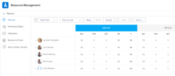

# Panoramica di Programmazione delle risorse {#resource-planner-overview}

>[!CONTEXTUALHELP]
>id="wf-resourcing-planner"
>title="Pianificazione risorse"
>abstract="È possibile utilizzare la Pianificazione risorse per stimare e preventivare l&#39;allocazione delle risorse ai progetti a cui sono assegnate e per prevedere la loro disponibilità per il lavoro futuro."

<!-- Audited: 12/2023 -->

<!--

(Alina: this used to be the beginning of Planning in the Resource Planner - consider restructuring it further? Merging some of this information with information about Understanding Navigation in the RP?!)

-->

È possibile stimare e preventivare l&#39;allocazione delle risorse ai progetti a cui sono assegnate e prevedere la loro disponibilità per il lavoro futuro utilizzando la Programmazione risorse.

Per una panoramica generale della pianificazione delle risorse in Adobe Workfront, vedere l&#39;articolo [Introduzione alla pianificazione delle risorse](../../resource-mgmt/resource-planning/get-started-resource-planning.md).

## Panoramica di Programmazione delle risorse

È possibile utilizzare la Programmazione delle risorse per comprendere facilmente la disponibilità di utenti e mansioni, nonché il tempo pianificato necessario per completare il lavoro sui progetti. Puoi quindi decidere come allocare gli utenti e le loro mansioni ai progetti a cui sono assegnati in base al tempo disponibile.

>[!IMPORTANT]
>
>Non è possibile utilizzare la Programmazione delle risorse per assegnare il lavoro effettivo (attività e problemi) agli utenti. È possibile solo stimare il tempo necessario affinché gli utenti o le mansioni completino un progetto, indipendentemente dalle attività e dai problemi a cui sono assegnati.\
>Per assegnare il lavoro effettivo agli utenti è necessario utilizzare il Bilanciatore dei carichi di lavoro. Per ulteriori informazioni sul Bilanciatore dei carichi di lavoro, consulta [Panoramica sul Bilanciatore dei carichi di lavoro](../../resource-mgmt/workload-balancer/overview-workload-balancer.md).

È possibile visualizzare le informazioni nella Programmazione delle risorse utilizzando tre visualizzazioni separate. È possibile utilizzare ciascuna visualizzazione per eseguire una delle seguenti operazioni:

* Preventivare il tempo o il costo delle risorse per il lavoro da eseguire utilizzando le visualizzazioni Progetto e Ruolo. Questo è lo scopo principale della Programmazione delle risorse.\
  Per ulteriori informazioni sulla pianificazione delle risorse, vedere l&#39;articolo [Risorse preventivate nella pianificazione delle risorse utilizzando le visualizzazioni Progetto e Ruolo](../resource-planning/budget-resources-project-role-views-resource-planner.md).

* Per visualizzare le seguenti informazioni utilizzando la vista Utente:

   * Disponibilità degli utenti in base alla loro pianificazione
   * Quantità di tempo pianificata necessaria per completare il lavoro in base al piano del progetto
   * Quantità di tempo per cui gli utenti hanno già effettuato l&#39;accesso agli elementi di lavoro effettivi

  Per ulteriori informazioni sulla visualizzazione delle ore o dell&#39;FTE disponibili, pianificate ed effettive per gli utenti nella Programmazione delle risorse, vedere l&#39;articolo [Visualizzazione delle ore o dell&#39;FTE disponibili, pianificate ed effettive nella Programmazione delle risorse quando si utilizza la visualizzazione Utente](../../resource-mgmt/resource-planning/view-hours-fte-user-view-resource-planner.md#using).

## Considerazioni sulla programmazione delle risorse

* È possibile assegnare un ordine di priorità ai progetti su cui si sta lavorando e assegnare un budget all&#39;allocazione delle risorse in base alla relativa priorità, in modo da assicurarsi che le risorse siano allocate prima ai progetti più importanti.

  Per informazioni sull&#39;assegnazione delle priorità ai progetti nella Programmazione delle risorse, vedere [Assegnare priorità ai progetti nella Programmazione delle risorse](../../resource-mgmt/resource-planning/prioritize-projects-resource-planner.md).

* È possibile visualizzare ore, FTE e informazioni sui costi dalle attività e dai problemi dei progetti.

  >[!NOTE]
  >
  >Le attività e i problemi non vengono visualizzati nella Programmazione delle risorse. Tuttavia, le informazioni su ore, FTE e costi relative alle allocazioni di risorse nelle attività vengono visualizzate nella Programmazione risorse come numero totale per il progetto.

* Le informazioni su ore, FTE e costi delle attività padre sono escluse dai progetti visualizzati nella Programmazione delle risorse. È consigliabile assegnare le risorse solo alle attività figlio se si desidera gestire il tempo o il costo di tali risorse nella Programmazione delle risorse.

  Per informazioni sulle attività padre, vedere gli articoli seguenti:

   * [Panoramica attività](../../manage-work/tasks/task-information/tasks-overview.md)
   * [Crea sottoattività](../../manage-work/tasks/create-tasks/create-subtasks.md)

  >[!TIP]
  >
  >Le attività padre visualizzano un totale di ore e costi delle attività figlio. Per questo motivo, il conteggio delle ore, dell&#39;FTE e del costo delle attività figlio e delle attività padre conteggerebbe questi importi due volte. Per questo motivo le informazioni sull&#39;attività padre vengono escluse dalla Programmazione risorse.

* Non è possibile gestire l&#39;allocazione di team nei progetti per i quali sono presenti attività o problemi nella Programmazione delle risorse.
* È possibile preventivare le risorse per più progetti alla volta utilizzando la Programmazione risorse oppure per un singolo progetto utilizzando l&#39;area Budget risorse del Business Case. Le informazioni preventivate per un progetto vengono visualizzate anche nella Programmazione delle risorse.

  Per informazioni su come preventivare le risorse per un singolo progetto, vedere l&#39;articolo [Risorse preventivo nel caso di business](../../manage-work/projects/define-a-business-case/budget-resources-in-business-case.md).

  Per informazioni su come preventivare le risorse nella Programmazione delle risorse per più progetti contemporaneamente, vedere la sezione &quot;Risorse preventivate nella Programmazione delle risorse&quot; nell&#39;articolo [Risorse preventivate nella Programmazione delle risorse utilizzando le visualizzazioni Progetto e Ruolo](../../resource-mgmt/resource-planning/budget-resources-project-role-views-resource-planner.md).

## Prerequisiti per lavorare nella Programmazione delle risorse {#prerequisites-for-working-in-the-resource-planner}

<!--

(<b>THIS SECTION IS LINKED TO ALL RES PLANNING ARTICLES. DO NOT RENAME OF DELETE THIS!</b> - do NOT ADD the variable here, because it might break this link!)

-->

Per utilizzare correttamente la Pianificazione risorse per la definizione del budget delle risorse, è necessario innanzitutto verificare che i progetti e le attività soddisfino una serie di prerequisiti. Questi prerequisiti sono obbligatori per visualizzare le informazioni corrette nella Programmazione delle risorse e per gestire in modo accurato le risorse.

>[!IMPORTANT]
>
>Se manca uno dei seguenti prerequisiti, alcune informazioni sull’allocazione o sulla disponibilità delle risorse potrebbero essere mancanti o avere un valore zero.\
>Per ulteriori informazioni sul motivo per cui i campi non contengono dati o non contengono valori, passa il puntatore del mouse sui campi.

>[!NOTE]
>
>I seguenti prerequisiti sono necessari solo quando si visualizza la Programmazione delle risorse per progetto o per mansione o quando si definiscono i budget delle risorse nel Business Case di un progetto.

I seguenti tipi di prerequisiti sono necessari per la corretta funzionalità di Programmazione delle risorse quando la si visualizza in base al progetto o al ruolo:

* [Prerequisiti utente](#user-prerequisites)
* [Prerequisiti del progetto](#project-prerequisites)
* [Prerequisiti per attività e problemi](#tasks-and-issues-prerequisites)
* [Prerequisiti a livello di sistema](#system-level-prerequisites)

### Prerequisiti utente {#user-prerequisites}

Prima di iniziare a utilizzare la Programmazione risorse, accertati che sia presente la seguente configurazione utente:

* L&#39;accesso alle risorse del budget è corretto.

  Per informazioni sull&#39;accesso necessario alle risorse del budget, vedere l&#39;articolo [Accesso necessario alle risorse del budget in Adobe Workfront](../../resource-mgmt/resource-planning/access-needed-to-budget-resources.md).

* Gli utenti assegnati alle attività vengono aggiunti ai pool di risorse associati al progetto.

  Per informazioni sull&#39;aggiunta di utenti ai pool di risorse, vedere [Associare i pool di risorse agli utenti](../../resource-mgmt/resource-planning/resource-pools/associate-resource-pools-with-users.md).

  >[!NOTE]
  >
  >Quando gli utenti non vengono aggiunti ai pool di risorse, possono verificarsi i seguenti scenari:
  >
  >   
  >   
  >   * Gli utenti non vengono visualizzati nella Programmazione delle risorse, anche se potrebbero essere assegnati ad attività sui progetti.
  >   * Se le attività a cui sono associate hanno Ore pianificate, queste non vengono visualizzate per il progetto nella Programmazione delle risorse, a meno che l&#39;utente non sia associato anche a una mansione per tali attività.
  >   * Se gli utenti sono associati a una mansione in un&#39;attività del progetto, le ore pianificate vengono visualizzate nella Programmazione delle risorse per la mansione, ma questa non può essere preventivata.
  >   
  >

* Gli utenti assegnati ai gruppi di lavoro e di risorse devono avere Schedules e Ruoli associati al loro profilo.

  Per informazioni sull&#39;associazione di pianificazioni e mansioni agli utenti, vedere [Modificare il profilo di un utente](../../administration-and-setup/add-users/create-and-manage-users/edit-a-users-profile.md).

  >[!NOTE]
  >
  >Gli utenti che non sono associati a una pianificazione ma si trovano nel gruppo di risorse del progetto non possono essere inseriti nel budget nella pianificazione risorse.

* Per ottenere informazioni precise sulle ore disponibili, accertati che le pianificazioni associate agli utenti presentino le eccezioni alla pianificazione e il tempo libero aggiornato.

  >[!NOTE]
  >
  >Se un utente non è associato a una pianificazione, la pianificazione predefinita del sistema Workfront viene associata all&#39;utente per impostazione predefinita, ai fini della pianificazione delle risorse.

  Per informazioni sulla creazione di pianificazioni, vedere l&#39;articolo [Creare una pianificazione](../../administration-and-setup/set-up-workfront/configure-timesheets-schedules/create-schedules.md).

* Se si desidera preventivare le risorse in base al costo, è necessario associare i ruoli mansione a Costo/Ora. tariffe. Il costo associato alle mansioni assegnate agli utenti nei pool di risorse viene utilizzato per calcolare il costo manodopera preventivato e il costo preventivato del progetto.\
  Per informazioni sull&#39;associazione dei ruoli ai tassi, vedere l&#39;articolo [Creare e gestire ruoli](../../administration-and-setup/set-up-workfront/organizational-setup/create-manage-job-roles.md).\
  Per informazioni sul calcolo del costo manodopera preventivato, vedere l&#39;articolo [Comprendere il costo manodopera preventivato e le ore preventivate per i progetti](../../manage-work/projects/project-finances/budgeted-labor-cost.md).\
  Per informazioni sul calcolo del costo preventivato, vedere l&#39;articolo [Calcola costo preventivato](../../manage-work/projects/project-finances/budgeted-cost.md).

### Prerequisiti del progetto {#project-prerequisites}

Prima di iniziare a utilizzare la Programmazione risorse, verifica che sia presente la seguente configurazione del progetto:

* I progetti sono associati a pool di risorse.\
  Per ulteriori informazioni sull&#39;aggiunta di gruppi di risorse ai progetti, vedere [Associare gruppi di risorse a progetti e modelli](../../resource-mgmt/resource-planning/resource-pools/associate-resource-pools-with-projects-and-templates.md).

  >[!IMPORTANT]
  >
  >Nei progetti senza gruppi di risorse non vengono visualizzate le informazioni sull&#39;Ora pianificata o sulle assegnazioni nella Programmazione delle risorse.

### Prerequisiti per attività e problemi {#tasks-and-issues-prerequisites}

Sebbene non sia possibile visualizzare attività e problemi nella Programmazione risorse, le relative informazioni vengono trasferite ai progetti visualizzati nella Programmazione risorse.

Prima di iniziare a definire il budget delle risorse nella Programmazione risorse, verificare che siano presenti le seguenti impostazioni relative a attività e problemi:

* Le attività o i problemi relativi ai progetti per i quali si stanno preventivando le risorse vengono assegnati a una delle seguenti entità:

   * Utenti nei gruppi di risorse del progetto associati anche a Ruoli
   * Ruoli

  >[!NOTE]
  >
  >Le ore pianificate delle attività e dei problemi assegnati alle mansioni vengono visualizzate nella Programmazione delle risorse, ma non possono essere preventivate a meno che un utente associato alla mansione non sia elencato in un pool di risorse associato al progetto.

* Non assegnare le attività padre a utenti o ruoli.

  Per visualizzare le informazioni sulle ore nella Programmazione delle risorse per gli utenti o i ruoli associati alle attività padre, è necessario assegnarli anche alle attività figlio. La Programmazione delle risorse non visualizza le informazioni delle attività padre.

* Le attività e i problemi hanno un valore per Ore pianificate maggiore di zero.
* Le attività e i problemi hanno un valore per la durata maggiore di zero.
* Le Date Pianificate dei problemi rientrano nella timeline del progetto.

### Prerequisiti a livello di sistema {#system-level-prerequisites}

È necessario comprendere in che modo l&#39;istanza di Workfront calcola la disponibilità dell&#39;utente in base alle preferenze di gestione delle risorse del sistema. Workfront può calcolare la disponibilità dell&#39;utente utilizzando la pianificazione definita nella pagina Profilo utente o la pianificazione predefinita del sistema.

L&#39;amministratore di Workfront configura le preferenze di gestione delle risorse.

Per ulteriori informazioni, vedere [Configurare le preferenze di Gestione risorse](../../administration-and-setup/set-up-workfront/configure-system-defaults/configure-resource-mgmt-preferences.md).

## Individua la Programmazione delle risorse

<!--

(This became another standalone article; drfat this section here when article is live.)

-->

È possibile individuare la Programmazione delle risorse in due aree di Workfront, a seconda che si desideri preventivare le risorse per più progetti o per un solo progetto.

Per informazioni sull&#39;individuazione della Programmazione delle risorse, vedere [Individuazione della Programmazione delle risorse](../../resource-mgmt/resource-planning/locate-resource-planner.md).

<!--

(this is drafted and moved to its own article: locate-resource-planner) 

Ensure that all prerequisites are met before starting to use the Resource Planner. This way, you ensure that the Resource Planner displays the correct information before you start budgeting your resources. For information about the prerequisites that must be met before you can start using the Resource Planner, see the <a href="#prerequisites-for-working-in-the-resource-planner" class="MCXref xref">Prerequisites for working in the Resource Planner</a> section in this article. 

You can locate the Resource Planner in two areas of Workfront, depending on whether you want to budget your resources for multiple projects, or for just one project.

<ul>
<li><a href="#use-the-resource-planner-for-multiple-projects" class="MCXref xref">Use the Resource Planner for multiple projects</a> </li>
<li> 
<a href="#use-the-resource-planner-for-one-project" class="MCXref xref">Use the Resource Planner for one project</a> 
 </li>
</ul>

<strong>Use the Resource Planner for multiple projects</strong>

When using the Resource Planner for multiple projects, the allocation numbers for your resources represent numbers across multiple projects. 

To access the  Planner section  in the  Resourcing area: 

<ol>
<li value="1">  Click the <strong>Main Menu</strong> icon  in the upper-right corner of Adobe Workfront.  </li>
<li value="2"> 
  Click <strong>Resourcing</strong>. The Resource Planner displays by default.  For information about budgeting resources in the Resource Planner, see the article <a href="../../resource-mgmt/resource-planning/budget-resources-project-role-views-resource-planner.md" class="MCXref xref">Budget resources in the Resource Planner using the Project and Role views</a>. 
 
  
 </li>
<li value="3">  Hover over the left panel, and click <strong>Resource Pools</strong>.  For information about creating new resource pools, see <a href="../../resource-mgmt/resource-planning/resource-pools/create-resource-pools.md" class="MCXref xref">Create resource pools</a>.</li>
</ol>

<strong>Use the Resource Planner for one project</strong>

When using the Resource Planner for one project, the allocation numbers for your resources represent numbers for the selected project. 

<ol>
<li value="1"> 
Go to a project you want to budget resources for.
 </li>
<li value="2"> 
Click <strong>Business Case</strong> in the left panel.
 </li>
<li value="3"> 
Scroll to the <strong>Resource Budgeting</strong> section of the Business Case.
 </li>
<li value="4"> 
Click <strong>Edit Resource Budgeting</strong> to add resource pools to your project and start budgeting your resources. 
 <note type="tip">
You can only add a resource pool in the Resource Budgeting area of the Business Case when the project has no resource pools associated with it. When the project already has a resource pool, the users in the pool and their job roles display in the Resource Budgeting area by default.
</note> 
  
 
For information about budgeting resources for one project, see the article <a href="../../manage-work/projects/define-a-business-case/budget-resources-in-business-case.md" class="MCXref xref">Budget resources in the Business Case</a>.
 </li>
</ol>

-->

## Aree della Programmazione delle risorse

È possibile visualizzare le informazioni seguenti o eseguire le azioni seguenti nella Programmazione risorse:

* Informazioni generali sulle risorse assegnate ai progetti nella Programmazione delle risorse.
* Sovrassegnazione o sottoutilizzo delle risorse nella pianificazione risorse.
* Preventivare le risorse per il lavoro manualmente o automaticamente.

Per ulteriori informazioni sulle aree visualizzate nella Programmazione delle risorse e su come configurare le informazioni visualizzate in tali aree, vedere l&#39;articolo [Panoramica sulla navigazione nella Programmazione delle risorse](../../resource-mgmt/resource-planning/resource-planner-navigation.md).

## Limitazioni nella visualizzazione delle informazioni nella pianificazione risorse

Per migliorare le prestazioni, Workfront limita la quantità di elementi che è possibile visualizzare nella Programmazione delle risorse.

Per ulteriori informazioni su queste limitazioni, consulta l&#39;articolo [Limitazioni di visualizzazione della Programmazione delle risorse](../../resource-mgmt/resource-planning/resource-planner-display-limitations.md) .

## Calcola FTE nella Programmazione delle risorse

È possibile visualizzare la disponibilità, l&#39;allocazione e i valori pianificati nella Programmazione risorse in Ore, FTE o Costo.

Per ulteriori informazioni sulla modifica delle informazioni visualizzate nella Programmazione delle risorse, vedere la sezione [Visualizzare le informazioni in base all&#39;ora, all&#39;FTE o al costo](../../resource-mgmt/resource-planning/resource-availability-allocation-resource-planner.md#display-by-hour-or-fte-menu) nell&#39;articolo [Verificare la disponibilità e l&#39;allocazione delle risorse mediante la Programmazione delle risorse di Adobe Workfront](../../resource-mgmt/resource-planning/resource-availability-allocation-resource-planner.md).

Per ulteriori informazioni su come vengono calcolati le ore e l&#39;FTE per utenti e ruoli in Workfront, vedere l&#39;articolo [Panoramica sul calcolo delle ore e dell&#39;FTE per utenti e ruoli in Pianificazione risorse](../../resource-mgmt/resource-planning/calculate-hours-fte-for-users-roles-resource-planner.md).

## Calcola costi nella programmazione delle risorse

Per visualizzare le informazioni in base al costo nella Programmazione risorse, è necessario disporre dell&#39;accesso di visualizzazione ai dati finanziari e delle autorizzazioni di visualizzazione per contabilità sui progetti.

Oltre a visualizzare i valori di disponibilità, allocazione e pianificati nella Programmazione delle risorse in Ore e FTE, è possibile visualizzarli per Costo.

>[!TIP]
>
>È necessario associare gli utenti e le mansioni alle tariffe Costo orario per visualizzare le informazioni in base ai costi nella Programmazione delle risorse.

Per ulteriori informazioni sull&#39;associazione delle tariffe orarie con le mansioni, vedere l&#39;articolo [Creare e gestire le mansioni](../../administration-and-setup/set-up-workfront/organizational-setup/create-manage-job-roles.md).\
Per ulteriori informazioni sull&#39;associazione delle tariffe orarie con gli utenti, vedere l&#39;articolo [Modifica il profilo di un utente](../../administration-and-setup/add-users/create-and-manage-users/edit-a-users-profile.md).

Quando si visualizzano le informazioni in base al costo nella Programmazione risorse, tenere presente quanto segue:

* Il costo di ciascun tipo di ore (Pianificato, Disponibile, Preventivato, Effettivo per Utenti, Ruoli o Progetti) viene calcolato utilizzando un tasso di costo diverso.
* Il Costo Pianificato è influenzato dal Tipo di Costo delle attività sui progetti.
* Quando si applica la Vista utente alla Programmazione delle risorse, non è possibile visualizzare le informazioni sull&#39;allocazione e sulla disponibilità in base al costo.

Per ulteriori informazioni sul metodo di calcolo dei costi in Pianificazione risorse per utenti e ruoli, vedere l&#39;articolo [Calcolare i costi in Pianificazione risorse](../../resource-mgmt/resource-planning/calculate-costs-resource-planner.md).

<!--

<h2>Use the User View to view Available, Planned, and Actual Hours or FTE </h2>

(this information is repeated from above where it exists in shorter form. Drafted to simplify the amount of info of this article.) 

You can use the User View of the Resource Planner to display information about the Planned, Available, and Actual Hours or FTE values for projects and resources. 

For information about using the Resource Planner to review the Available, Planned, and Actual Hours and FTE for resources, see the article <a href="../../resource-mgmt/resource-planning/view-hours-fte-user-view-resource-planner.md" class="MCXref xref">View Available, Planned, and Actual Hours or FTE in the Resource Planner when using the User view</a>.

<strong>Use the Project and Role Views to budget resources </strong>

 The main function of the Resource Planner is to budget your resources for the work that needs to be completed on the projects that you can manage. 

 You can budget your resources only if you apply the <strong>View by Project</strong> or <strong>View by Role</strong> views to the Resource Planner.

For information about budgeting resources using the Project and Role views in the Resource Planner, see the article <a href="../../resource-mgmt/resource-planning/budget-resources-project-role-views-resource-planner.md"><a href="../../resource-mgmt/resource-planning/budget-resources-project-role-views-resource-planner.md" class="MCXref xref">Budget resources in the Resource Planner using the Project and Role views</a></a>.

-->

## Filtrare le informazioni nella Programmazione delle risorse

È possibile ridurre il numero di progetti, ruoli o utenti visualizzati in Pianificazione risorse creando un filtro.\
Per ulteriori informazioni, vedere l&#39;articolo [Informazioni sul filtro in Pianificazione risorse](../../resource-mgmt/resource-planning/filter-resource-planner.md).
