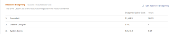

# Individua la Programmazione delle risorse

<!--

(This came off this article: draft that content in the article when this comes live: /Content/Resource Mgmt/Resource Planning/get-started-resource-planner.html)

-->

È possibile utilizzare la Programmazione delle risorse per gestire l&#39;allocazione delle risorse ai progetti. È possibile accedere alla pianificazione risorse per più progetti contemporaneamente o per un progetto dall&#39;area Caso di business del progetto.

## Requisiti di accesso

Devi avere i seguenti:

<table style="table-layout:auto"> 
 <col> 
 <col> 
 <tbody> 
  <tr> 
   <td role="rowheader">Piano Adobe Workfront*</td> 
   <td> 
Pro e superiore
 </td> 
  </tr> 
  <tr> 
   <td role="rowheader">Licenza Adobe Workfront*</td> 
   <td> 
Revisione o successiva<!--
      <MadCap:conditionalText data-mc-conditions="QuicksilverOrClassic.Draft mode">
        (this seems to be the case in NWE only, not classic. Waiting on Vazgen's response for this)
      </MadCap:conditionalText>
     -->
 
Pianificare o versione successiva per individuare la Programmazione delle risorse nell'area globale
 </td> 
  </tr> 
  <tr> 
   <td role="rowheader">Configurazioni del livello di accesso*</td> 
   <td> 
Accesso di visualizzazione o superiore a Gestione risorse
 
<b>NOTA</b>

Se non disponi ancora dell’accesso, chiedi all’amministratore di Workfront se ha impostato restrizioni aggiuntive nel tuo livello di accesso. Per informazioni su come un amministratore di Workfront può modificare il tuo livello di accesso, consulta <a href="../../administration-and-setup/add-users/configure-and-grant-access/create-modify-access-levels.md" class="MCXref xref">Creare o modificare livelli di accesso personalizzati</a>.
 </td>
</tr> 
  <tr> 
   <td role="rowheader">Autorizzazioni oggetto</td> 
   <td> 
Visualizzare le autorizzazioni per progetti e utenti 
 
Per informazioni sulla richiesta di accesso aggiuntivo, vedere <a href="../../workfront-basics/grant-and-request-access-to-objects/request-access.md" class="MCXref xref">Richiedere l'accesso agli oggetti </a>.
 </td> 
  </tr> 
 </tbody> 
</table>

&#42;Per conoscere il piano, il tipo di licenza o l&#39;accesso di cui si dispone, contattare l&#39;amministratore di Workfront.

## Prerequisiti

Prima di iniziare a utilizzare la pianificazione risorse, assicurati che siano soddisfatti tutti i prerequisiti per accedere e lavorare con essa. In questo modo, è possibile assicurarsi che la Programmazione delle risorse visualizzi le informazioni corrette prima di iniziare a definire il budget delle risorse.

Per informazioni sui prerequisiti di Pianificazione risorse, vedere [Introduzione alla pianificazione risorse](../../resource-mgmt/resource-planning/get-started-resource-planning.md).

## Individua la Programmazione delle risorse

<!--

(this was moved from the get-started-resource-planner article)

-->

È possibile individuare la Programmazione delle risorse in due aree di Workfront, a seconda che si desideri preventivare le risorse per più progetti o per un solo progetto.

* [Utilizza la pianificazione risorse per più progetti](#use-the-resource-planner-for-multiple-projects)
* [Utilizzare la Programmazione delle risorse per un progetto](#use-the-resource-planner-for-one-project)

### Utilizzare la programmazione delle risorse per più progetti {#use-the-resource-planner-for-multiple-projects}

Quando si utilizza la pianificazione risorse per più progetti, i numeri di allocazione per le risorse rappresentano i numeri per più progetti.

Per accedere alla sezione Planner nell&#39;area Risorse:

1. Fai clic sull&#39;icona  del **menu principale** nell&#39;angolo superiore destro di Adobe Workfront.

1. Fare clic su **Risorse**. Il Planner viene visualizzato per impostazione predefinita.  Per informazioni sulla definizione del budget delle risorse nella Programmazione delle risorse, vedere l&#39;articolo [Risorse preventivo nella Programmazione delle risorse utilizzando le visualizzazioni Progetto e Ruolo](../../resource-mgmt/resource-planning/budget-resources-project-role-views-resource-planner.md).

   

1. Passa il puntatore del mouse sul pannello sinistro e fai clic su **Pool di Risorse**.\
   Per informazioni sulla creazione di pool di risorse, vedere [Creare pool di risorse](../../resource-mgmt/resource-planning/resource-pools/create-resource-pools.md).

### Utilizzare la Programmazione delle risorse per un progetto {#use-the-resource-planner-for-one-project}

Quando si utilizza la pianificazione risorse per un progetto, i numeri di allocazione per le risorse rappresentano i numeri per il progetto selezionato.

1. Vai a un progetto per il quale vuoi preventivare le risorse.
1. Fai clic su **Business Case** nel pannello a sinistra.
1. Scorri fino alla sezione **Budget risorse** del Business Case.
1. Fai clic su **Modifica budget risorse** per aggiungere gruppi di risorse al progetto e iniziare a pianificare le risorse.

   >[!TIP]
   >
   >È possibile aggiungere un gruppo di risorse nell&#39;area Budget risorse del Business Case solo se al progetto non è associato alcun gruppo di risorse. Quando il progetto ha già un Pool di Risorse, gli utenti nel pool e le loro mansioni vengono visualizzati nell&#39;area Budget risorse per impostazione predefinita.

   

   Per informazioni sulla definizione del budget delle risorse per un progetto, vedere l&#39;articolo [Risorse budget nel caso aziendale](../../manage-work/projects/define-a-business-case/budget-resources-in-business-case.md).
