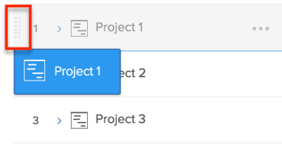
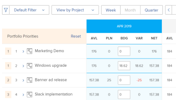

# Assegna priorità ai progetti nella Programmazione delle risorse

I progetti sono elencati in ordine di priorità nella Programmazione delle risorse, con il progetto più importante in alto.

## Requisiti di accesso

+++ Espandi per visualizzare i requisiti di accesso per la funzionalità in questo articolo.

<table style="table-layout:auto"> 
 <col> 
 <col> 
 <tbody> 
  <tr> 
   <td>Pacchetto Adobe Workfront</td> 
   <td>
Qualsiasi
</td>
  </tr> 
  <tr> 
   <td>Licenza Adobe Workfront</td> 
   <td>
Standard

       
Piano
</td> 
  </tr> 
  <tr> 
   <td>Configurazioni del livello di accesso</td> 
   <td> 
Modifica l'accesso a Gestione risorse, incluso l'accesso a Modifica priorità e ore preventivate nella Programmazione risorse
 
Modifica accesso a dati finanziari, progetti e utenti
</td> 
  </tr> 
  <tr> 
   <td>Autorizzazioni oggetto</td> 
   <td> 
Gestire le autorizzazioni per i progetti per i quali si desidera preventivare le informazioni con la possibilità di gestire le finanze
</td>
  </tr> 
 </tbody> 
</table>

Per informazioni, consulta [Requisiti di accesso nella documentazione di Workfront](/help/quicksilver/administration-and-setup/add-users/access-levels-and-object-permissions/access-level-requirements-in-documentation.md).

+++

## Ordine predefinito dei progetti nella Programmazione delle risorse

Per impostazione predefinita, i progetti sono elencati nella Vista progetto della Programmazione delle risorse tenendo conto dei criteri riportati di seguito.

>[!IMPORTANT]
>
>I progetti vengono elencati in base ai tre criteri riportati di seguito solo la prima volta che si apre la Programmazione delle risorse. Tuttavia, questa priorità predefinita diventa automaticamente la tua priorità personalizzata e non può essere ripristinata alla priorità originale quando effettui una delle seguenti operazioni:
>
>* Quando fai clic su Salva in qualsiasi momento.
>* Quando si modifica manualmente la priorità di pianificazione del progetto. Per informazioni sulla modifica manuale della priorità di pianificazione del progetto, vedere la sezione [Modificare manualmente la priorità di pianificazione del progetto](#manually-change-the-project-planning-priority) in questo articolo.
>
>Quando la priorità del progetto diventa personalizzata, eventuali modifiche apportate alle informazioni del progetto non influiscono più sull’ordine dei progetti che utilizzano questi criteri. Dopodiché, puoi assegnare la priorità ai progetti solo manualmente.

I criteri predefiniti originali per l’elenco dei progetti nella visualizzazione Progetto sono i seguenti, nell’ordine indicato:

1. In base al punteggio di allineamento sul progetto.\
   Per ulteriori informazioni sul punteggio di allineamento del progetto, vedere [Applicare una scorecard a un progetto e generare un punteggio di allineamento](../../manage-work/projects/define-a-business-case/apply-scorecard-to-project-to-generate-alignment-score.md) .

1. Dalla data di inizio pianificata del progetto (se il campo Allineamento è nullo o è lo stesso per diversi progetti).
1. In ordine alfabetico (se il campo Allineamento è nullo o è lo stesso e la data di inizio pianificata è la stessa per diversi progetti).

Quando si lavora con le priorità del progetto nella Programmazione risorse, considera quanto segue:

* È possibile personalizzare manualmente la priorità del progetto solo quando si applica la Vista progetto. Questo cambia anche l&#39;ordine dei progetti nella Programmazione delle risorse.
* Quando si applicano le visualizzazioni Ruolo o Utente nella Programmazione delle risorse, i progetti vengono visualizzati nello stesso ordine di priorità stabilito nella Visualizzazione Progetto.
* L&#39;ordine dei progetti nella Programmazione delle risorse è univoco. Gli altri utenti possono visualizzare gli stessi progetti nella Programmazione delle risorse, ma in un ordine diverso. Non è possibile creare rapporti sul campo Priorità pianificazione progetto. È visibile solo nella Programmazione delle risorse e serve come indicatore per assegnare la priorità ai progetti.

I progetti associati a un portfolio potrebbero avere una priorità a livello di portfolio. È possibile abilitare la visualizzazione della priorità del portfolio di un progetto nella Programmazione delle risorse, oltre alla priorità della Programmazione delle risorse. Puoi anche ordinare i progetti in base alla loro priorità di portfolio.

## Modificare manualmente la priorità di pianificazione del progetto {#manually-change-the-project-planning-priority}

Per riordinare i progetti in Pianificazione risorse, è necessario disporre dell&#39;accesso in Modifica a Gestione risorse e delle autorizzazioni Gestione risorse per i progetti.

Assegnando una nuova priorità ai progetti, è possibile classificarli in ordine di importanza.

Per modificare la Priorità di pianificazione del progetto:

1. Vai alla **Programmazione risorse**.

1. Fare clic all&#39;interno del campo a sinistra del nome del progetto che contiene un numero e immettere un numero per modificare la priorità di pianificazione, quindi premere Invio.\
   \
   Oppure\
   Passa il puntatore del mouse sul nome del progetto, fai clic sull’indicatore a sinistra del nome del progetto, trascinalo e rilascialo nel punto corretto per modificare la priorità.

   

   Quando selezioni i numeri per assegnare la priorità ai progetti, seleziona numeri più bassi per priorità più alte (più importanti) e numeri più alti per priorità più basse (meno importanti). Quando modifichi il numero di priorità di un progetto in un numero inferiore (priorità più alta), tutti gli altri progetti nella Programmazione delle risorse vengono spostati verso il basso nell’elenco (diventa meno importante).\
   Quando si modifica il numero di priorità di un progetto in un numero più alto (priorità inferiore), tutti gli altri progetti nella Programmazione delle risorse vengono spostati verso l&#39;alto nell&#39;elenco (diventa più importante).

1. Fai clic su **Salva**.\
   L’ordine dei progetti cambia in base alle selezioni effettuate e questa diventa la priorità del progetto personalizzato nella Programmazione delle risorse. Gli altri utenti non possono visualizzare l&#39;ordine di priorità per i progetti nella Programmazione delle risorse, anche se potrebbero essere in grado di visualizzare gli stessi progetti nella Programmazione delle risorse.

## Ordinare i progetti in base alla loro priorità Portfolio nella Programmazione delle risorse

>[!IMPORTANT]
>
>L&#39;azienda deve disporre di un piano Business o Workfront di livello superiore per assegnare la priorità ai progetti in Portfolio Optimizer.
>
>Per ulteriori informazioni sui piani di Workfront, vedere [I nostri piani](https://business.adobe.com/it/products/workfront/pricing.html).
>
>Per informazioni sull&#39;assegnazione delle priorità ai progetti in Portfolio Optimizer, vedere [Assegnare priorità ai progetti in Portfolio Optimizer](../../manage-work/portfolios/portfolio-optimizer/prioritize-projects-in-portfolio-optimizer.md).

1. Apri **Programmazione risorse** nella **Visualizzazione progetto**.
1. Fai clic sull&#39;icona **Impostazioni**.
1. Abilita l&#39;impostazione **Visualizza priorità Portfolio** per visualizzare le priorità del progetto in base al Portfolio a cui sono assegnate. La priorità dei progetti in base al loro portfolio viene visualizzata accanto alla priorità Pianificazione risorse. Questa impostazione è disabilitata per impostazione predefinita.

   <!--
   
(NOTE: check screen shot to see if this is accurate still - should say Order, and not Sort:)

   -->

   

   Le priorità del portfolio dei progetti vengono visualizzate solo nella visualizzazione Progetto della Programmazione delle risorse.

1. Fai clic su **Ordine** per ordinare i progetti in base alle priorità del portfolio.

   Se ci sono progetti che appartengono a più portfolio, nella Programmazione delle risorse puoi vedere più progetti con la stessa priorità di portfolio. In questo caso, i progetti con la stessa priorità di portafoglio sono elencati in base ai seguenti criteri, nell’ordine indicato:

   1. Punteggio dell&#39;Allineamento
   1. Data di inizio pianificata
   1. Nome progetto

   

1. Fai clic su **Salva**.

## Effetto della modifica della priorità di pianificazione del progetto sulle ore disponibili per l&#39;utente

La priorità di pianificazione del progetto influisce sulle ore disponibili degli utenti. Gli utenti associati al progetto con priorità più alta mostrano la massima disponibilità per la colonna Ore disponibili (AVL) per questo progetto, in base alle loro pianificazioni.

Gli stessi utenti associati al secondo progetto in ordine di priorità mostreranno un valore Ore disponibili che è la differenza tra l’intero importo di Ore disponibili e quello che è già stato preventivato per il primo progetto nella colonna Ore preventivate e così via. Per informazioni sull&#39;impostazione del budget delle risorse nella Programmazione delle risorse, vedere [Risorse preventivate nella Programmazione delle risorse utilizzando le visualizzazioni Progetto e Ruolo](../../resource-mgmt/resource-planning/budget-resources-project-role-views-resource-planner.md).

Se non sono state preventivate ore per il primo progetto (in ordine di priorità) per un utente, ma sono state preventivate ore per il secondo progetto per lo stesso utente, l’utente mostrerà l’intera quantità di ore disponibili per entrambi i progetti.

È consigliabile aggiornare la colonna Ore preventivate per gli utenti in base all&#39;ordine dei progetti nella Programmazione delle risorse, per garantire che sia sempre possibile visualizzare con precisione le Ore disponibili per l&#39;utente.

>[!NOTE]
>
>Poiché la Priorità di pianificazione del progetto è specifica per ogni responsabile delle risorse, il secondo progetto prioritario potrebbe essere un progetto prioritario per un altro utente che visualizza gli stessi progetti nella programmazione delle risorse. Se un altro responsabile delle risorse assegna una risorsa per il primo progetto, le ore disponibili diminuiranno per tale risorsa per il primo progetto in base a tale modifica.
>
>L&#39;utente che esegue il budget delle ore assegna per primo tale risorsa e ne riduce il numero in tutto il sistema. La quantità di Ore disponibili deve essere aggiornata per tutti gli utenti non appena le Ore preventivate vengono salvate per una risorsa nella Programmazione delle risorse.
>
>Per ulteriori informazioni sulle ore disponibili, vedere [Disponibilità e allocazione delle risorse](../../resource-mgmt/resource-planning/resource-availability-allocation-resource-planner.md#availability-and-allocation-of-resources).
