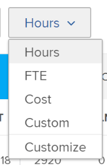

# Verificare la disponibilità e l&#39;allocazione delle risorse mediante Adobe Workfront Resource Planner

Nella Programmazione risorse è possibile visualizzare la disponibilità delle risorse e la quantità di lavoro pianificato o preventivato per i progetti. Questi valori vengono visualizzati in Ore, FTE (Full Time Equivalent) o Importi costi e sono organizzati in colonne.

## Requisiti di accesso

+++ Espandi per visualizzare i requisiti di accesso per la funzionalità in questo articolo.

Per eseguire i passaggi descritti in questo articolo, è necessario disporre dei seguenti diritti di accesso:

<table style="table-layout:auto"> 
 <col> 
 <col> 
 <tbody> 
  <tr> 
   <td role="rowheader">piano Adobe Workfront</td> 
   <td>
Nuovo: Qualsiasi

       
oppure

       
Corrente: Pro o superiore
 </td> 
  </tr> 
  <tr> 
   <td role="rowheader">Licenza Adobe Workfront</td> 
   <td>
Nuovo: Chiaro o superiore

       
oppure

       
Corrente: revisione o versione successiva
</td>
  </tr> 
  <tr> 
   <td role="rowheader">Configurazioni del livello di accesso</td> 
   <td> 
Accesso di visualizzazione o superiore ai seguenti elementi:
 
    <ul> 
     <li> 
Gestione risorse
 </li> 
     <li> 
Dati finanziari
 </li> 
     <li> 
Utenti
 </li> 
     <li> 
Progetti
 </li> 
    </ul> </td> 
  </tr> 
  <tr> 
   <td role="rowheader">Autorizzazioni oggetto</td> 
   <td> 
Visualizza o autorizzazioni superiori per i progetti che desideri visualizzare nella Programmazione delle risorse
 </td> 
  </tr> 
 </tbody> 
</table>

Per ulteriori dettagli sulle informazioni contenute in questa tabella, vedere [Requisiti di accesso nella documentazione di Workfront](/help/quicksilver/administration-and-setup/add-users/access-levels-and-object-permissions/access-level-requirements-in-documentation.md).

+++

## Prerequisiti

Devi soddisfare tutti i prerequisiti necessari per lavorare con la Programmazione delle risorse. Per ulteriori informazioni, vedere [Panoramica di Programmazione delle risorse](../../resource-mgmt/resource-planning/get-started-resource-planner.md).

>[!IMPORTANT]
>
>Se manca uno dei prerequisiti necessari per la corretta funzionalità della Programmazione delle risorse, alcuni numeri potrebbero essere zero o le Ore preventivate potrebbero essere inattive.

## Disponibilità e assegnazione delle risorse

Le colonne che visualizzano la disponibilità e l&#39;allocazione delle risorse variano a seconda della visualizzazione applicata alla Programmazione delle risorse. Per informazioni sulla visualizzazione delle informazioni nella Programmazione delle risorse per progetto, mansione o utente, vedere [Panoramica sulla navigazione nella Programmazione delle risorse](../../resource-mgmt/resource-planning/resource-planner-navigation.md).

Quando si modifica la visualizzazione in Pianificazione risorse, tenere presente quanto segue:

* Quando applichi le visualizzazioni **Visualizza per progetto** o **Visualizza per ruolo**, puoi visualizzare le colonne seguenti:

  <!--
  <MadCap:conditionalText data-mc-conditions="QuicksilverOrClassic.Draft mode">
  (NOTE: Alina: (some of the information in this area is also covered in Calculating Costs in the RP - https://workfront.zendesk.com/hc/en-us/articles/115004186433 - update this article also, when changes here occur)
  </MadCap:conditionalText>
  -->

   * Ore, FTE o Costo disponibili
   * Ore pianificate, FTE o Costo
   * Ore preventivate, FTE o Costo
   * Ore, FTE o Scostamento costo
   * Ore nette, FTE o Costo

* Quando si applica la visualizzazione **Visualizza per utente**, è possibile visualizzare le colonne seguenti:

   * Ore disponibili o FTE
   * Ore pianificate o FTE
   * Differenza ore o FTE
   * Percentuale allocazione ore pianificate

>[!TIP]
>
>Le informazioni non sono disponibili come costo quando si applica la visualizzazione **Visualizza per utente** alla Programmazione delle risorse.
>
>Per ulteriori informazioni sulla visualizzazione di ogni colonna, posizionare il puntatore del mouse sul nome della colonna in cui viene visualizzato il numero.\
>
>
>Per ulteriori informazioni sui dati visualizzati in ciascuna colonna, vedi i seguenti articoli:
>
>* [Panoramica di ore, FTE e informazioni sui costi nelle visualizzazioni Progetto e Ruolo della Programmazione delle risorse](../../resource-mgmt/resource-planning/overview-of-planner-hour-fte-cost-information-in-role-project-views.md)
>* [Visualizzazione ore o FTE disponibili, pianificate ed effettive nella Programmazione delle risorse quando si utilizza la Visualizzazione utente](../../resource-mgmt/resource-planning/view-hours-fte-user-view-resource-planner.md)
>

## Visualizza le informazioni per Ora, FTE o Costo

1. Vai alla Programmazione delle risorse.

   Per impostazione predefinita, le informazioni vengono visualizzate per ore nella Programmazione delle risorse.

1. Espandi il menu a discesa.\
   

1. Selezionare una delle opzioni seguenti:

   <table style="table-layout:auto"> 
    <col> 
    <col> 
    <tbody> 
     <tr> 
      <td role="rowheader">Ore</td> 
      <td>Visualizza le informazioni sulla disponibilità e sull'allocazione in Ore.</td> 
     </tr> 
     <tr> 
      <td role="rowheader">FTE</td> 
      <td> 
Visualizza informazioni sulla disponibilità e sull'allocazione in FTE.
 
Per ulteriori informazioni sul calcolo dell'FTE nella Programmazione delle risorse, vedere <a href="../../resource-mgmt/resource-planning/calculate-hours-fte-for-users-roles-resource-planner.md" class="MCXref xref">Panoramica sul calcolo delle ore e dell'FTE per utenti e ruoli nella Programmazione delle risorse</a>. 
 </td> 
     </tr> 
     <tr> 
      <td role="rowheader">Costo</td> 
      <td> 
Visualizza le informazioni sulla disponibilità e sull'allocazione in base al costo, se si sta visualizzando la Programmazione delle risorse nelle visualizzazioni Progetto o Ruolo. Le informazioni visualizzano i valori nella valuta del sistema. L'amministratore di Workfront definisce la valuta di sistema. Per ulteriori informazioni sull'impostazione della valuta di sistema in Workfront, vedere <a href="../../administration-and-setup/manage-workfront/exchange-rates/set-up-exchange-rates.md" class="MCXref xref">Impostare i tassi di cambio</a>.
 
<b>NOTA</b>

   È necessario associare utenti e mansioni alle tariffe Costo orario per visualizzare le informazioni sul costo nella Programmazione delle risorse. Per ulteriori informazioni sull&#39;associazione delle tariffe orarie con le mansioni, vedere <a href="../../administration-and-setup/set-up-workfront/organizational-setup/create-manage-job-roles.md" class="MCXref xref">Creare e gestire le mansioni</a>. Per ulteriori informazioni sull&#39;associazione delle tariffe orarie con gli utenti, vedere <a href="../../administration-and-setup/add-users/create-and-manage-users/edit-a-users-profile.md" class="MCXref xref">Modificare il profilo di un utente</a>. Per ulteriori informazioni sul calcolo del costo nella Programmazione delle risorse, vedere <a href="../../resource-mgmt/resource-planning/calculate-costs-resource-planner.md" class="MCXref xref">Calcolare i costi nella Programmazione delle risorse </a>.
 </td>
   </tr> 
     <tr> 
      <td role="rowheader">Personalizza</td> 
      <td>Crea una visualizzazione personalizzata delle colonne visualizzate nella Programmazione delle risorse. Selezionare le opzioni che si desidera visualizzare nella Programmazione delle risorse, come descritto nei passaggi seguenti. </td> 
     </tr> 
    </tbody> 
   </table>

1. (Condizionale) Se hai selezionato **Personalizza**, indica le opzioni nella casella **Personalizza metriche visualizzate** per configurare la visualizzazione personalizzata.

   

1. Nella colonna **Tipo di visualizzazione** a sinistra, selezionare una delle visualizzazioni seguenti:

   * Progetto
   * Ruolo
   * Utente

1. Nella sezione **Visualizza elementi selezionati** selezionare il tipo di informazioni che si desidera visualizzare nelle colonne della visualizzazione selezionata. Nella tabella seguente vengono illustrate le opzioni disponibili in ciascuna visualizzazione:

   | **Opzione** | Visualizzazione utente | Vista Project | Visualizzazione Ruolo |
   |---|---|---|---|
   | Disponibile | ✔ | ✔ | ✔ |
   | Pianificato | ✔ | ✔ | ✔ |
   | Preventivato |   | ✔ | ✔ |
   | Varianza |   | ✔ | ✔ |
   | Net |   | ✔ | ✔ |
   | Effettivo | ✔ |   |   |
   | Differenza | ✔ |   |   |
   | Percentuale | ✔ |   |   |

1. Selezionare **Usa valori pianificati (PLN) nei calcoli NET** per utilizzare le informazioni Pianificati anziché Preventivati durante il calcolo dei valori Netti nelle visualizzazioni Progetto e Ruolo.

   Quando si seleziona questa opzione, Workfront calcola i valori netti utilizzando la formula seguente:

   `Net = Available - Planned`

   >[!TIP]
   >
   >**Questa opzione viene applicata solo quando si seleziona almeno un&#39;opzione per personalizzare la visualizzazione nella sezione Visualizza elementi selezionati.**

1. Fai clic su **Salva**.

   Viene visualizzata la vista personalizzata che include le colonne selezionate.

   Nel menu a discesa Ore la visualizzazione personalizzata viene elencata come Personalizzata.

   >[!NOTE]
   >
   >È possibile disporre di una sola visualizzazione personalizzata.

   

## Visualizzare il grafico Allocazione utenti

Puoi visualizzare in un grafico l’Allocazione pianificata degli utenti in base alla loro disponibilità.

Per visualizzare l&#39;allocazione degli utenti in un grafico:

1. Vai alla Programmazione delle risorse.

   Per ulteriori informazioni sull&#39;accesso alla pianificazione risorse, vedere la sezione [Individuare la pianificazione risorse](../../resource-mgmt/resource-planning/get-started-resource-planner.md#accessing-the-resource-planner) nell&#39;articolo [Panoramica sulla pianificazione risorse](../../resource-mgmt/resource-planning/get-started-resource-planner.md).

1. Selezionare **Visualizza per utente**.

   >[!TIP]
   >
   >È possibile visualizzare il grafico di allocazione utente solo nella visualizzazione utente.

1. Fai clic sull&#39;icona  del **Grafico di allocazione utente** per visualizzare le seguenti informazioni:

   <table style="table-layout:auto"> 
    <col> 
    <col> 
    <tbody> 
     <tr> 
      <td role="rowheader">% disponibilità senza allocazione eccessiva per tutti gli utenti</td> 
      <td>Si tratta della quantità di tempo in cui tutti gli utenti sono disponibili per il lavoro in un periodo di tempo, espressa in percentuale rispetto al tempo totale disponibile. </td> 
     </tr> 
     <tr> 
      <td role="rowheader">% allocazione eccessiva per tutti gli utenti </td> 
      <td> 
Quantità di tempo in cui gli utenti vengono sovrassegnati in un periodo di tempo, espressa in percentuale rispetto al tempo totale disponibile.
 
<b>NOTA</b>

   Una sovrassegnazione si verifica quando le ore pianificate sono superiori alle ore disponibili. 
 </td>
   </tr> 
     <tr> 
      <td role="rowheader">% sottoutilizzo per tutti gli utenti</td> 
      <td> 
Si tratta della quantità di tempo in cui gli utenti vengono sottoutilizzati in un periodo di tempo, indicato come percentuale rispetto al tempo totale disponibile.
 
<b>NOTA</b>

   La sottoutilizzazione si verifica quando le ore pianificate sono inferiori alle ore disponibili. 
 </td>
   </tr> 
     <tr> 
      <td role="rowheader">È presente un'allocazione eccessiva per almeno un utente durante questo periodo</td> 
      <td>Ciò indica che esiste una sovrassegnazione per almeno un utente in un periodo di tempo, anche se la quantità totale di tempo di tutti gli utenti non è sovrassegnata per il periodo di tempo. È necessario scorrere l'elenco degli utenti e le ore per l'utente sovrassegnato sono evidenziate in rosso.</td> 
     </tr> 
    </tbody> 
   </table>

   

1. (Facoltativo) Fai clic sull&#39;area **Sovrallocazione% per tutti gli utenti** nel grafico.\
   Tutti gli utenti sovrassegnati vengono evidenziati in rosso.
1. (Facoltativo) Fai clic sull&#39;area **Sottoutilizzo% per tutti gli utenti** nel grafico.\
   Tutti gli utenti sottoutilizzati vengono evidenziati in blu.

1. (Facoltativo) Fai clic sull&#39;icona dell&#39;indicatore  che mostra dove hai almeno un utente sovrassegnato.\
   Gli utenti sovrassegnati vengono evidenziati in rosso.

1. (Facoltativo) Aggiorna la pagina per comprimere il grafico.
