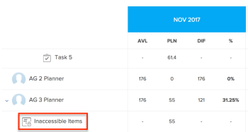
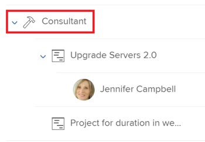

# Panoramica sulla navigazione in planner risorse

Utilizzando Adobe Workfront Resource Planner puoi comprendere facilmente la disponibilità delle risorse e il tempo pianificato necessario per completare il lavoro sui progetti. Puoi quindi gestire l’allocazione degli utenti e dei relativi ruoli in base ai progetti a cui sono assegnati.

>[!TIP]
>
>Non è possibile gestire l&#39;allocazione dei team sulle attività a cui sono assegnati nel Planner risorse.

È necessario soddisfare i prerequisiti necessari per utilizzare completamente il Planner risorse. Per ulteriori informazioni sul planner risorse, vedere [Panoramica di Resource Planner](../../resource-mgmt/resource-planning/get-started-resource-planner.md).

Le sezioni seguenti descrivono tutte le aree del Planner risorse.

## Calendario dei progetti

Utilizza il calendario nella parte superiore del Planner risorse per navigare nella timeline dei progetti che stai visualizzando. Per impostazione predefinita, la timeline inizia con il mese corrente.\
Per ulteriori informazioni sulla modifica dell’intervallo temporale della timeline che stai visualizzando nel Planner risorse, consulta la sezione . [Selezione del timecode](#timeframe-selection) in questo articolo.

## Selezione del timecode  {#timeframe-selection}

Per impostazione predefinita, il Planner risorse mostra le informazioni sulle risorse per tre o quattro mesi alla volta, a partire dal mese corrente. Il numero di periodi di tempo visualizzati dipende dalla larghezza dello schermo.

>[!TIP]
>
>Nel Planner risorse non è possibile visualizzare più di quattro periodi alla volta.

Per spostarsi nella timeline:

1. Fare clic sulle frecce indietro e avanti per spostarsi avanti e indietro sulla timeline.
1. Selezionare tra le seguenti opzioni dell&#39;intervallo di date nel Planner risorse facendo clic sui pulsanti appropriati:

   <table style="table-layout:auto"> 
    <col> 
    <col> 
    <tbody> 
     <tr> 
      <td role="rowheader">Settimana</td> 
      <td>Visualizza le informazioni per settimana. Il numero della settimana viene visualizzato accanto alle date nell’intestazione della colonna. </td> 
     </tr> 
     <tr> 
      <td role="rowheader">Mese</td> 
      <td> Visualizza le informazioni per mese.</td> 
     </tr> 
     <tr> 
      <td role="rowheader">Trimestre</td> 
      <td>Visualizza le informazioni per trimestre. Il numero del trimestre viene visualizzato accanto alle date nell’intestazione della colonna. I trimestri personalizzati non vengono visualizzati nel Planner risorse. </td> 
     </tr> 
     <tr> 
      <td role="rowheader">Oggi</td> 
      <td>Restituisce al mese, alla settimana o al trimestre odierni.</td> 
     </tr> 
    </tbody> 
   </table>

## Selezione visualizzazione Progetto/Ruolo/Utente

È possibile modificare la visualizzazione nel Planner risorse a seconda di come si desidera visualizzare le informazioni.

Per impostazione predefinita, il Planner risorse viene visualizzato nella visualizzazione utente. Puoi modificare la visualizzazione in Visualizzazioni progetto o ruolo. Quando lo si cambia in un&#39;altra visualizzazione, la scelta diventa la visualizzazione predefinita.

Quando si modifica la visualizzazione, vengono modificate anche le seguenti informazioni:

* La gerarchia degli oggetti (informazioni nelle righe del Planner risorse).
* Informazioni sull&#39;allocazione dell&#39;ora (informazioni nelle colonne del Planner risorse).

   Per ulteriori informazioni sulla visualizzazione delle colonne nel Planner risorse a seconda della visualizzazione selezionata, vedere [Verifica la disponibilità e l’allocazione delle risorse utilizzando Adobe Workfront Resource Planner](../../resource-mgmt/resource-planning/resource-availability-allocation-resource-planner.md).

Per visualizzare informazioni precise nel Planner risorse, è necessario soddisfare un set di prerequisiti. Per ulteriori informazioni sui prerequisiti, consulta la sezione &quot;Prerequisiti per lavorare nel planner risorse&quot; nella sezione [Panoramica di Resource Planner](../../resource-mgmt/resource-planning/get-started-resource-planner.md) articolo.  Per modificare la visualizzazione nel planner risorse:

1. Vai a **Planner risorse**.\
   Per ulteriori informazioni sull&#39;accesso al Planner risorse, vedere la [Individua il planner risorse](../../resource-mgmt/resource-planning/get-started-resource-planner.md#accessing-the-resource-planner) nella sezione [Panoramica di Resource Planner](../../resource-mgmt/resource-planning/get-started-resource-planner.md) articolo.

1. In **Visualizza per** dal menu a discesa, seleziona una delle visualizzazioni seguenti:

   * [Visualizza per progetto](#view-by-project)
   * [Visualizza per ruolo](#view-by-role)
   * [Visualizza per utente](#view-by-user)

### Visualizza per progetto {#view-by-project}

Quando si seleziona Vista progetto nel planner risorse, tenere presente quanto segue:

* Puoi visualizzare progetti per i quali disponi delle autorizzazioni di almeno visualizzazione.
* Quando si accede al Planner risorse per la prima volta, è possibile visualizzare i progetti filtrati dal filtro predefinito.\
   Per ulteriori informazioni sul filtro delle informazioni nel planner risorse, vedere [Filtrare le informazioni nel planner risorse](../../resource-mgmt/resource-planning/filter-resource-planner.md).

* Per migliorare le prestazioni, è limitato il numero di elementi visualizzati o che è possibile esportare dalla visualizzazione Progetto.\
   Per ulteriori informazioni sulle limitazioni durante la visualizzazione del planner risorse nella visualizzazione Progetto, vedere la [Limitazioni nella vista Progetto](../../resource-mgmt/resource-planning/resource-planner-display-limitations.md#project-view-limits) nella sezione [Limitazioni della visualizzazione di Resource Planner](../../resource-mgmt/resource-planning/resource-planner-display-limitations.md) articolo.

* I progetti vengono elencati in base all’ordine di priorità nella visualizzazione Progetto.\
   Per ulteriori informazioni sulla priorità del progetto nel Planner risorse, consulta la sezione [Priorità di pianificazione del progetto](#project-planning-priority) in questo articolo.

* Quando espandi ogni progetto, puoi visualizzare i ruoli del lavoro associati ad esso.\
   Man mano che espandi ogni ruolo, puoi visualizzare gli utenti associati ad esso.\
   Scorri per caricare più ruoli e utenti sotto ogni progetto.

* Quando viene applicata questa visualizzazione, le ore ruolo, FTE o Costo vengono sommate alle ore del progetto, FTE o Costo.\
   

* Nella visualizzazione Progetto è possibile visualizzare le seguenti informazioni su ora, FTE o Costo:

   * Disponibile
   * Pianificato
   * Preventivato
   * Varianza
   * Net

      Per ulteriori informazioni, consulta [Risorse di budget nel planner risorse utilizzando le visualizzazioni Progetto e Ruolo](../../resource-mgmt/resource-planning/budget-resources-project-role-views-resource-planner.md).

### Visualizza per ruolo {#view-by-role}

Quando si seleziona Vista ruolo nel planner risorse, tenere presente quanto segue:

* Per visualizzare i ruoli associati a tali progetti, è necessario disporre almeno dell&#39;opzione Visualizza accesso a Gestione risorse e delle autorizzazioni per i progetti.
* È possibile espandere ogni ruolo per visualizzare un elenco di progetti e ogni progetto per visualizzare un elenco di utenti in grado di eseguire tali ruoli nei progetti.
* Per migliorare le prestazioni, è limitato il numero di elementi visualizzati o che è possibile esportare dalla Vista ruolo .\
   Per ulteriori informazioni sulle limitazioni durante la visualizzazione del planner risorse nella vista Ruolo, consulta la sezione [Limitazioni nella vista Ruolo](../../resource-mgmt/resource-planning/resource-planner-display-limitations.md#role-view-limits) sezione [Limitazioni della visualizzazione di Resource Planner](../../resource-mgmt/resource-planning/resource-planner-display-limitations.md) .

* I progetti sono elencati sotto il ruolo di lavoro nello stesso ordine di priorità in cui sono elencati nella visualizzazione Progetto.
* Quando viene applicata questa visualizzazione, le ore di progetto, le FTE o i costi vengono sommati alle ore ruolo, FTE o Costo.\
   

* Nella visualizzazione Ruolo è possibile visualizzare le seguenti informazioni relative a ora, FTE o Costo:

   * Disponibile
   * Pianificato
   * Preventivato
   * Varianza
   * Net

      Per ulteriori informazioni, consulta [Risorse di budget nel planner risorse utilizzando le visualizzazioni Progetto e Ruolo](../../resource-mgmt/resource-planning/budget-resources-project-role-views-resource-planner.md).

### Visualizza per utente {#view-by-user}

È possibile visualizzare il planner risorse nella visualizzazione utente per comprendere la differenza tra le ore pianificate e quelle disponibili o FTE per gli utenti o per vedere la quantità di ore effettive registrate.

Non è possibile eseguire il budget delle risorse quando si applica la visualizzazione utente al planner risorse. È necessario allocare le risorse utilizzando le visualizzazioni Progetto o Ruolo e utilizzare la visualizzazione Utente per esaminare l&#39;allocazione e la disponibilità degli utenti in relazione al lavoro pianificato.*

La visualizzazione utente è la visualizzazione predefinita del planner risorse.

Quando si seleziona la visualizzazione utente nel planner risorse, tenere presente quanto segue:

* Puoi visualizzare tutti gli utenti con autorizzazioni di visualizzazione fino a 2000 utenti attivi che hanno effettuato l’accesso ad Adobe Workfront almeno una volta.\
   Filtra l’elenco di utenti in base a Team, Ruolo lavoro o Pool per visualizzare gli utenti associati solo a tali entità.
* Se l’elenco degli utenti è stato filtrato in base ai progetti, è possibile espandere solo gli utenti associati ai progetti filtrati e visualizzare anche le informazioni relative all’ora.\
   Per ulteriori informazioni sul filtro delle informazioni nel planner risorse, vedere [Filtrare le informazioni nel planner risorse](../../resource-mgmt/resource-planning/filter-resource-planner.md) .

* Per migliorare le prestazioni, è limitato il numero di elementi visualizzati o che è possibile esportare dalla visualizzazione utente.\
   Per ulteriori informazioni sulle limitazioni durante la visualizzazione di Resource Plannerer nella visualizzazione utente, vedere la [Limitazioni nella visualizzazione utente](../../resource-mgmt/resource-planning/resource-planner-display-limitations.md#user-view-limits) sezione [Limitazioni della visualizzazione di Resource Planner](../../resource-mgmt/resource-planning/resource-planner-display-limitations.md) .

* I progetti vengono elencati con il nome dell’utente nello stesso ordine di priorità in cui sono elencati nella visualizzazione Progetto.\
   Per ulteriori informazioni sulla priorità del progetto nel Planner risorse, consulta la sezione [Priorità di pianificazione del progetto](#project-planning-priority) in questo articolo.

* Se gli utenti non hanno un ruolo di lavoro associato, i valori Ore o FTE sono elencati in **Nessun ruolo** sezione .
* Quando questa visualizzazione viene applicata, le ore del progetto o l’FTE vengono sommate alle ore utente o all’FTE.

   >[!TIP]
   >
   >Nella visualizzazione Utente non è possibile visualizzare l&#39;allocazione e la disponibilità degli utenti in base al costo.

* Le autorizzazioni per progetti e attività determinano cosa viene visualizzato sotto i nomi degli utenti visualizzati nella visualizzazione utente.\
   Esistono i seguenti scenari:

   * Se non si dispone delle autorizzazioni necessarie per visualizzare i progetti e le attività o i problemi assegnati agli utenti visualizzati nel Planner risorse, tali elementi sono elencati in **Elementi inaccessibili** sezioni. La **Elementi inaccessibili** in questo caso, le sezioni Progetto o Attività sostituiscono.

   * Se non si dispone delle autorizzazioni necessarie per visualizzare i progetti, ma si dispone dell&#39;accesso per visualizzare le attività o i problemi relativi ai progetti, i progetti, le attività e i problemi sono elencati con i nomi degli utenti assegnati.
   * Quando si dispone delle autorizzazioni necessarie per visualizzare i progetti, ma non di attività o problemi relativi ai progetti, viene visualizzato il nome del progetto e le attività e i problemi sono elencati nella sezione **Elementi inaccessibili** sezione .\
      Per ulteriori informazioni sulle autorizzazioni in Workfront, vedi [Panoramica della condivisione delle autorizzazioni sugli oggetti](../../workfront-basics/grant-and-request-access-to-objects/sharing-permissions-on-objects-overview.md).

      
    

* Nella visualizzazione Utente è possibile visualizzare le seguenti informazioni relative all’ora e all’ora dell’Editor Rich Text:

   * Disponibile
   * Pianificato
   * Effettivo
   * Differenza tra Pianificato e Effettivo
   * Percentuale di allocazione prevista

      Per ulteriori informazioni, consulta [Visualizza Ore disponibili, pianificate e effettive o FTE nel planner risorse quando si utilizza la visualizzazione Utente](../../resource-mgmt/resource-planning/view-hours-fte-user-view-resource-planner.md)

## Nome progetto

È possibile visualizzare i seguenti progetti nel Planner risorse:

* Progetti per i quali si dispone di autorizzazioni di almeno visualizzazione.

   È inoltre necessario avere accesso almeno a Visualizza gestione risorse nel livello di accesso.

   Per informazioni sull&#39;accesso necessario per utilizzare il Planner risorse, vedi [Accesso necessario alle risorse di budget in Adobe Workfront](../../resource-mgmt/resource-planning/access-needed-to-budget-resources.md).

* Progetti limitati dal filtro applicato al planner risorse.

   Per ulteriori informazioni sul filtro delle informazioni nel planner risorse, vedere [Filtrare le informazioni nel planner risorse](../../resource-mgmt/resource-planning/filter-resource-planner.md).

   >[!NOTE]
   >
   >È consigliabile utilizzare i filtri per ridurre il numero di progetti da visualizzare nel planner risorse.

## Priorità di pianificazione del progetto {#project-planning-priority}

I progetti sono elencati in ordine di priorità nel Planner risorse con il progetto più importante nella parte superiore. La priorità è indicata da un numero davanti al nome del progetto.

Puoi anche abilitare un’impostazione per visualizzare le priorità del progetto in base al loro portfolio, quando sono associate a un portfolio. Per informazioni sulla definizione della priorità dei progetti e sulla visualizzazione delle priorità del portfolio nel Resource Planner , vedi [Assegnare priorità ai progetti nel planner risorse](../../resource-mgmt/resource-planning/prioritize-projects-resource-planner.md).

## Nome Ruolo

Le seguenti categorie di ruoli di lavoro sono elencate nel Planner risorse:

* Ruoli di lavoro assegnati alle attività.
* I ruoli di lavoro non assegnati alle attività, ma sono i ruoli di lavoro principali degli utenti associati ai pool di risorse dei progetti.
* I ruoli di lavoro secondari degli utenti assegnati alle attività in tali ruoli di lavoro.
* Ruoli di lavoro secondari degli utenti che hanno una **Percentuale di disponibilità FTE** nel loro profilo.\
   Per ulteriori informazioni sulla **Percentuale di disponibilità FTE** per i ruoli di lavoro, consulta [Modificare il profilo di un utente](../../administration-and-setup/add-users/create-and-manage-users/edit-a-users-profile.md) .

>[!NOTE]
>
>I ruoli di lavoro assegnati ai problemi vengono elencati anche quando **Includi ore dal problema** è abilitata. Per ulteriori informazioni sull&#39;abilitazione delle ore di problema in Resource Planner, vedi la [Impostazioni](#settings) sezione .

## Nome utente

Gli utenti elencati nelle visualizzazioni Progetto e Ruolo nel Planner risorse appartengono ai pool di risorse associati ai progetti.\
Per ulteriori informazioni sulla compilazione dei pool di risorse con gli utenti, consulta [Associare pool di risorse con gli utenti](../../resource-mgmt/resource-planning/resource-pools/associate-resource-pools-with-users.md).

Tutti gli utenti a cui hai accesso a Visualizza e che hanno effettuato l’accesso a Workfront almeno una volta vengono visualizzati nella visualizzazione utente.

Nelle visualizzazioni Progetto e Ruolo , gli utenti possono essere elencati nei seguenti tipi di ruoli di lavoro:

* Il loro ruolo principale
* Il loro ruolo secondario, nei seguenti scenari:

   * Se il ruolo del lavoro secondario ha un numero valido per il **Percentuale di disponibilità FTE** nel loro profilo utente.
   * Se l’utente viene assegnato alle attività di tali ruoli.

Per ulteriori informazioni sulla **Percentuale di disponibilità FTE** per un ruolo di lavoro, vedi [Modificare il profilo di un utente](../../administration-and-setup/add-users/create-and-manage-users/edit-a-users-profile.md) .

## sezioni &quot;Nessun ruolo&quot; e &quot;Nessun utente&quot;

* [Sezione &quot;Nessun ruolo&quot;](#no-role-section)
* [Sezione &quot;Nessun utente&quot;](#no-user-section)

### Sezione &quot;Nessun ruolo&quot;  {#no-role-section}

Quando un utente appartiene a un pool di risorse associato a un progetto, ma non dispone di un ruolo di lavoro associato, viene visualizzato nel **Nessun ruolo** anziché sotto un ruolo di lavoro specifico.

Non è possibile calcolare le ore di un utente in un **Nessun ruolo** sezione . L&#39;utente deve avere almeno un ruolo di lavoro associato a esso per essere inserito in budget per il lavoro.\

### Sezione &quot;Nessun utente&quot;  {#no-user-section}

Quando assegni un&#39;attività a un team o la lasci non assegnata, sotto la sezione **Nessun utente** sezione che appare sotto **Nessun ruolo** nella sezione Planner risorse. Queste attività non vengono visualizzate nel Planner risorse quando si utilizza il **Visualizza per utente** visualizza.

Puoi vedere la quantità di ore pianificate attribuite alle attività del progetto nel **Nessun utente** in Planner risorse, ma non è possibile eseguire il budget per queste allocazioni.

 

## Filtri

Utilizzando i filtri è possibile limitare le informazioni visualizzate nel Planner risorse.

Per ulteriori informazioni sul filtro nel planner risorse, vedi [Filtrare le informazioni nel planner risorse](../../resource-mgmt/resource-planning/filter-resource-planner.md) .

## Impostazioni {#settings}

Nell’area Impostazioni è possibile abilitare o disabilitare le opzioni per visualizzare o nascondere le informazioni nel Planner risorse.

Per abilitare le impostazioni nel Planner risorse:

1. Apri il Planner risorse.
1. Fai clic sul pulsante **Impostazioni** icona.

   

   Viene visualizzata la casella Impostazioni planner risorse.

   

1. Abilita la **Includi ore da problemi** impostazione per visualizzare le ore pianificate dai problemi nel planner risorse. Questa impostazione è disabilitata per impostazione predefinita.

   Quando abiliti questa impostazione, tieni presente quanto segue:

   * Il nome dell&#39;utente assegnato ai problemi viene visualizzato sotto il ruolo del lavoro associato al problema e puoi specificare le ore previste per l&#39;utente e il ruolo del lavoro nelle visualizzazioni Progetto e Ruolo.
   * I problemi a cui sono assegnati gli utenti sono elencati sotto i nomi dei ruoli del processo nella visualizzazione Utente.

      >[!IMPORTANT]
      >
      >**Quando il problema delle date di inizio e di completamento pianificati non è riportato nella timeline del progetto, le ore pianificate per il problema vengono visualizzate in base alle date del problema. Ad esempio, se la timeline del progetto è compresa tra gennaio e marzo ma la cronologia dei problemi è ad agosto, l’ora pianificata per i problemi verrà visualizzata nel periodo di tempo di agosto.**

1. (Condizionale e facoltativo) Se hai selezionato la vista Progetto, abilita l’impostazione Visualizza priorità Portfolio per visualizzare le priorità del progetto in base al Portfolio a cui sono assegnate. La priorità dei progetti in base al loro portfolio viene visualizzata accanto alla priorità Planner risorse. Questa impostazione è disabilitata per impostazione predefinita.

   Per informazioni sulla priorità dei progetti nel Planner risorse, vedi [Assegnare priorità ai progetti nel planner risorse](../../resource-mgmt/resource-planning/prioritize-projects-resource-planner.md).

## Opzione a schermo intero

È possibile visualizzare il Planner risorse a schermo intero per ingrandire la quantità di informazioni che è possibile visualizzare sullo schermo.

L’opzione per visualizzare le informazioni a schermo intero è disponibile per tutte le visualizzazioni del planner risorse.

Per visualizzare il planner risorse a schermo intero:

1. Vai a **Planner risorse**.
1. Fai clic sul pulsante **Icona a schermo intero** per visualizzare il planner risorse a schermo intero.\
   \
   Il planner risorse si espande per occupare l&#39;intera finestra del browser e l&#39;icona si trasforma in un **Chiudi schermo intero** opzione di visualizzazione.

1. (Facoltativo) Fai clic sul pulsante **Icona Chiudi a schermo intero** per ripristinare la visualizzazione precedente.

## Opzione Esporta

È possibile esportare le informazioni in un file Excel (.xlsx) da qualsiasi visualizzazione del Planner risorse.\
Per informazioni sull&#39;esportazione di informazioni dal Planner risorse, vedere [Esporta informazioni dal planner risorse](../../resource-mgmt/resource-planning/export-resource-planner.md).

Puoi gestire la quantità di informazioni e la visualizzazione del file esportato.\
Per informazioni sulle informazioni che è possibile esportare dal Planner risorse e su come gestire l’aspetto del file esportato, consulta [Limitazioni della visualizzazione di Resource Planner](../../resource-mgmt/resource-planning/resource-planner-display-limitations.md).
