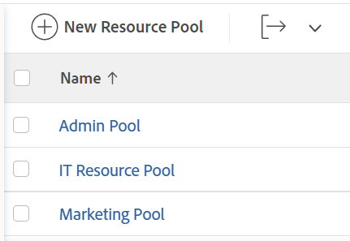

# Creare i pool di risorse {#create-resource-pools}

>[!CONTEXTUALHELP]
>id="wf_resource_pools"
>title="Gruppi di risorse"
>abstract="Un Pool di Risorse è una raccolta di utenti necessari contemporaneamente per il completamento di un progetto. Dopo aver creato un pool di risorse, è possibile associarlo a progetti e modelli."

{{preview-and-fast-release-Q424}}

I pool di risorse sono insiemi di utenti che consentono di gestire più facilmente le risorse in Adobe Workfront. Per ulteriori informazioni sui pool di risorse, vedere [Panoramica sui pool di risorse](../../../resource-mgmt/resource-planning/resource-pools/work-with-resource-pools.md).

## Requisiti di accesso

+++ Espandi per visualizzare i requisiti di accesso per la funzionalità in questo articolo.

Per eseguire i passaggi descritti in questo articolo, è necessario disporre dei seguenti diritti di accesso:

<table style="table-layout:auto"> 
 <col> 
 <col> 
 <tbody> 
  <tr> 
   <td role="rowheader">piano Adobe Workfront</td> 
   <td>
Nuovo: Qualsiasi

       
oppure

       
Corrente: Pro o superiore
 </td> 
  </tr> 
  <tr> 
   <td role="rowheader">Licenza Adobe Workfront</td> 
   <td>
Nuovo: Standard

       
oppure

       
Corrente: Piano
</td>
  </tr> 
  <tr> 
   <td role="rowheader">Configurazioni del livello di accesso</td> 
   <td> 
Modifica l'accesso a Gestione risorse, incluso l'accesso a Gestisci gruppi di risorse
 
Modificare l’accesso a progetti, modelli e utenti
</td> 
  </tr> 
  <tr data-mc-conditions=""> 
   <td role="rowheader">Autorizzazioni oggetto</td> 
   <td>Gestisci le autorizzazioni per i progetti, i modelli e gli utenti a cui vuoi associare i Pool di Risorse</td> 
  </tr> 
 </tbody> 
</table>

Per ulteriori dettagli sulle informazioni contenute in questa tabella, vedere [Requisiti di accesso nella documentazione di Workfront](/help/quicksilver/administration-and-setup/add-users/access-levels-and-object-permissions/access-level-requirements-in-documentation.md).

+++

## Creare un gruppo di risorse {#create-a-resource-pool}

{{step1-to-resourcing}}

1. Fai clic su **Pool di Risorse** nel pannello a sinistra.

   Immagine di esempio nell&#39;ambiente di anteprima:
   

   Immagine di esempio nell’ambiente di produzione:
   

1. Fare clic su **Nuovo pool di risorse**.
1. Specifica quanto segue:

   <table style="table-layout:auto">
    <col>
    <col>
    <tbody>
     <tr>
      <td role="rowheader"><strong>Nome</strong></td>
      <td>Questo è il nome del Pool di Risorse.</td>
     </tr>
     <tr>
      <td role="rowheader"><strong>Descrizione</strong></td>
      <td>Breve descrizione del gruppo di risorse. Ad esempio, puoi specificare a quale scopo deve essere utilizzato.</td>
     </tr>
     <tr>
      <td role="rowheader"><strong>Membri del gruppo</strong></td>
      <td>
 Aggiungere singolarmente gli utenti al Pool di Risorse. Oppure  Per aggiungere contemporaneamente molti utenti al gruppo di risorse. Puoi aggiungere una delle seguenti entità associate a utenti o a una raccolta di utenti:
        <ul>
         <li><strong>Team</strong>: tutti i membri del team vengono aggiunti al Pool di Risorse.</li>
         <li><strong>Gruppi</strong>: tutti i membri del gruppo vengono aggiunti al Pool di Risorse.</li>
         <li><strong>Ruoli</strong>: tutti gli utenti associati a tale ruolo vengono aggiunti al Pool di Risorse.</li>
         <li><strong>Società</strong>: tutti gli utenti della società vengono aggiunti al Pool di Risorse.</li>
        </ul>
Suggerimento: puoi aggiungere solo utenti attivi, team, ruoli, o aziende.
 Potrebbe essere necessario scorrere verso il basso la finestra di dialogo per visualizzare tutti gli utenti nel Pool di Risorse.
        
Nota: se un utente diventa membro di un gruppo, team, società o è associato a una mansione dopo che il gruppo, il team, la società o la mansione sono stati aggiunti al Pool di risorse, il nuovo membro non viene aggiunto automaticamente al Pool di risorse.  Se un utente appartiene al team, al gruppo, alla società e alla mansione che si sta aggiungendo, l'utente verrà aggiunto una sola volta al Pool di Risorse. Gli utenti disattivati dopo essere stati aggiunti al Pool di Risorse vengono visualizzati in grigio nell'elenco degli utenti e contrassegnati come disattivati.

</td>
     </tr>
    </tbody>
   </table>

1. (Facoltativo) Usa il collegamento **Annulla** per rimuovere gli utenti aggiunti tramite un gruppo, un team, una società o una mansione.

   >[!NOTE]
   >
   >Non esiste alcun limite al numero di utenti che è possibile avere in un Pool di Risorse. Tuttavia, si consiglia di non aggiungere troppi utenti a un Pool di Risorse, altrimenti la gestione delle risorse potrebbe diventare una sfida. L&#39;elenco degli utenti mostra solo i primi 2.000 utenti nel Pool di Risorse e sono elencati in ordine alfabetico.

   Immagine di esempio nell&#39;ambiente di anteprima:
   

   Immagine di esempio nell’ambiente di produzione:
   

1. (Facoltativo) Fai clic sull’icona X a destra del nome di un utente per rimuoverlo. Per ulteriori informazioni sulla rimozione degli utenti da un pool di risorse, vedere [Rimuovere gli utenti dai pool di risorse](../../../resource-mgmt/resource-planning/resource-pools/remove-users-from-resource-pool.md).
1. (Facoltativo) Utilizza l&#39;opzione **Cerca** per trovare un utente nel Pool di Risorse.
1. Fai clic su **Crea**.
