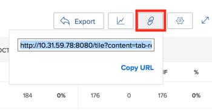

# Condividere la visualizzazione utente di Programmazione delle risorse con un collegamento

Adobe Workfront può generare un URL univoco per la Visualizzazione utente della Programmazione delle risorse, che puoi incorporare in una dashboard come pagina esterna, oppure aprire separatamente in una nuova scheda del browser. Questa funzione è utile quando si condividono le informazioni sulla Programmazione delle risorse con utenti che potrebbero non avere accesso diretto all&#39;area Risorse.

## Requisiti di accesso

+++ Espandi per visualizzare i requisiti di accesso per la funzionalità in questo articolo.

Per eseguire i passaggi descritti in questo articolo, è necessario disporre dei seguenti diritti di accesso:

<table style="table-layout:auto"> 
 <col> 
 <col> 
 <tbody> 
  <tr> 
   <td role="rowheader">piano Adobe Workfront</td> 
    <td>
Nuovo: Qualsiasi

       
oppure

       
Corrente: Pro o superiore
 </td> 
  </tr> 
  <tr> 
   <td role="rowheader">Licenza Adobe Workfront</td> 
   <td>
Nuovo: Standard

       
oppure

       
Corrente: Piano
</td> 
  </tr> 
  <tr> 
   <td role="rowheader">Configurazioni del livello di accesso</td> 
   <td> 
Accesso di visualizzazione o superiore a Gestione risorse, Progetti e Utenti
 
Visualizzazione dell'accesso ai dati finanziari per visualizzare le informazioni sui costi
</td> 
  </tr> 
  <tr> 
   <td role="rowheader">Autorizzazioni oggetto</td> 
   <td> 
Visualizza o autorizzazioni superiori per i progetti da visualizzare nella Programmazione delle risorse
</td> 
  </tr> 
 </tbody> 
</table>

Per ulteriori dettagli sulle informazioni contenute in questa tabella, vedere [Requisiti di accesso nella documentazione di Workfront](/help/quicksilver/administration-and-setup/add-users/access-levels-and-object-permissions/access-level-requirements-in-documentation.md).

+++

Quando generi l’URL univoco per la visualizzazione utente della Programmazione risorse, considera quanto segue:

* Puoi ottenere un URL univoco solo per la Visualizzazione utente. L’opzione per generare l’URL non esiste nelle visualizzazioni Progetto o Ruolo.
* Puoi condividere l’URL con altri utenti, inclusi gli utenti con licenza Lavoro e Revisione.\
  Devono avere accesso per visualizzare altri utenti per poter visualizzare le informazioni nella Programmazione delle risorse dall&#39;URL condiviso con loro.
* Le seguenti informazioni vengono salvate quando condividi l’URL con altri utenti:

   * Il tipo di periodi di tempo (settimana, mese, trimestre).
   * I filtri applicati.
   * Tipo di visualizzazione (ore o FTE).

Per ottenere un URL univoco nella Vista utente della Programmazione delle risorse e condividerlo con altri utenti:

{{step1-to-resourcing}}

1. Selezionare **Visualizza per utente**.
1. (Facoltativo) Selezionare l&#39;intervallo di tempo entro il quale si desidera visualizzare le informazioni nella Programmazione delle risorse. Selezionare una delle opzioni seguenti:

   * Settimana
   * Mese
   * Trimestre

1. (Facoltativo) Seleziona se desideri visualizzare le informazioni entro **FTE** o **Ore**.\
   

1. (Facoltativo) Applica i filtri alla Programmazione delle risorse.\
   Per informazioni sull&#39;applicazione dei filtri, vedere [Informazioni sui filtri nella programmazione delle risorse](../../resource-mgmt/resource-planning/filter-resource-planner.md).

1. Fare clic sull&#39;icona **collegamento ipertestuale**.\
   

1. Fare clic su **Copia URL**.\
   Copia negli Appunti l&#39;URL univoco della Programmazione delle risorse nella Vista utente.

1. (Facoltativo) Effettuate una delle seguenti operazioni:  

   * Incolla l’URL in un’altra applicazione per inviarlo a un altro utente.\
     L’utente deve aver effettuato l’accesso a Workfront per visualizzare la Programmazione delle risorse nella Vista utente.
   * Apri una nuova scheda o finestra del browser e incolla il collegamento copiato, quindi fai clic su Invio sulla tastiera per aprire la Programmazione delle risorse in una nuova scheda o finestra.
   * Effettua le seguenti operazioni:

     <!--   
     <MadCap:conditionalText data-mc-conditions="QuicksilverOrClassic.Draft mode">   
     (NOTE:&nbsp;turn this into a numbered list)   
     </MadCap:conditionalText>   
     -->

      1. Vai a **Reporting**>**Dashboard**>**Nuovo dashboard**>**Aggiungi pagina esterna.**

      1. Incolla il collegamento copiato negli Appunti nel campo **URL**.
      1. Fai clic su **Salva**, quindi su **Salva + Chiudi**.\
         L’URL verrà incorporato nel dashboard e la vista Utente della Programmazione delle risorse verrà visualizzata in un dashboard separato.

1. (Facoltativo) Se hai incorporato l’URL in un dashboard, puoi aggiungerlo a un modello di layout o condividerlo con altri utenti che potrebbero non avere accesso all’area Gestione risorse.\
   Per informazioni sull&#39;aggiunta di dashboard a un modello di layout, vedere [Creare e gestire modelli di layout](../../administration-and-setup/customize-workfront/use-layout-templates/create-and-manage-layout-templates.md).\
   Per informazioni sulla condivisione delle dashboard, vedere [Condividere una dashboard](../../reports-and-dashboards/dashboards/creating-and-managing-dashboards/share-dashboard.md).\
   Quando si visualizza l&#39;URL condiviso, gli utenti possono visualizzare le informazioni con le impostazioni originariamente applicate alla Programmazione delle risorse. Devono aver effettuato l’accesso a Workfront per visualizzare l’URL condiviso.\
   
