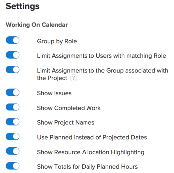

# Configurare le impostazioni nelle aree di programmazione

>[!IMPORTANT]
>  
>La funzionalità di pianificazione descritta in questo articolo è stata rimossa e rimossa da Adobe Workfront a partire dalla versione 23.1 di gennaio 2023.   
>  
>  Questo articolo verrà rimosso anche poco dopo la versione 23.1, all’inizio del 2023. Al momento, è consigliabile aggiornare di conseguenza tutti i segnalibri. 
> 
> Ora puoi utilizzare il servizio di bilanciamento del carico di lavoro per pianificare il lavoro per le risorse. 
>  
> Per informazioni sulla pianificazione delle risorse tramite il servizio di bilanciamento del carico di lavoro, consulta la sezione . [Il servizio di bilanciamento del carico di lavoro](../../resource-mgmt/workload-balancer/workload-balancer.md). 

<!--  

>[!CAUTION] 
> 
> 
> The information in this article refers to the Adobe Workfront's Scheduling tools. The Scheduling areas have been removed from the Preview environment and will be removed from the Production environment in **January 2023**. 
>  Instead, you can schedule resources in the Workload Balancer.  
> 
>*  For information about scheduling resources using the Workload Balancer, see the section [The Workload Balancer](../../resource-mgmt/workload-balancer/workload-balancer.md). 
> 
>*  For more information about the deprecation and removal of the Scheduling tools, see [Deprecation of Resource Scheduling tools in Adobe Workfront](../../resource-mgmt/resource-mgmt-overview/deprecate-resource-scheduling.md). 
-->

Puoi configurare diverse impostazioni per personalizzare come e quali informazioni visualizzare nella timeline della pianificazione.

## Requisiti di accesso

Per eseguire i passaggi descritti in questo articolo, è necessario disporre dei seguenti diritti di accesso:

<table style="table-layout:auto"> 
 <col> 
 <col> 
 <tbody> 
  <tr> 
   <td role="rowheader">piano Adobe Workfront*</td> 
   <td> 
Qualsiasi
 </td> 
  </tr> 
  <tr> 
   <td role="rowheader">Licenza Adobe Workfront*</td> 
   <td> 
Lavoro o superiore
 </td> 
  </tr> 
  <tr> 
   <td role="rowheader">Livello di accesso*</td> 
   <td> 
Visualizza l'accesso o superiore a Progetti, Attività e Problemi
 
<b>NOTA</b>

Se non disponi ancora dell’accesso, chiedi all’amministratore Workfront se ha impostato ulteriori restrizioni nel livello di accesso. Per informazioni su come un amministratore Workfront può modificare il livello di accesso, consulta <a href="../../administration-and-setup/add-users/configure-and-grant-access/create-modify-access-levels.md" class="MCXref xref">Creare o modificare livelli di accesso personalizzati</a>.
 </td>
</tr> 
  <tr> 
   <td role="rowheader">Autorizzazioni oggetto</td> 
   <td> 
Autorizzazioni di Contribute o superiori a progetti, attività e problemi
 
Per informazioni sulla richiesta di accesso aggiuntivo, vedi <a href="../../workfront-basics/grant-and-request-access-to-objects/request-access.md" class="MCXref xref">Richiedere l’accesso agli oggetti </a>.
 </td> 
  </tr> 
 </tbody> 
</table>

*Per sapere quale piano, tipo di licenza o accesso si dispone, contattare l&#39;amministratore Workfront.

## Configurare i problemi da visualizzare sulla timeline della pianificazione

<!--

(NOTE: ALL THE SECTIONS BELOW ARE LINKED TO PRODUCT. DO NOT CHANGE TITLES) 

-->

È possibile configurare i problemi da visualizzare oltre alle attività nella timeline della pianificazione.\
Quando si pianificano risorse nella sezione Pianificazione per un team , i problemi vengono visualizzati per impostazione predefinita oltre alle attività. Quando si pianificano risorse per i progetti, per impostazione predefinita vengono visualizzate solo le attività.

1. Passa alla timeline della programmazione per più progetti, per un singolo progetto o per un team:

   * **Per progetti multipli**:  Fai clic sul pulsante **Menu principale** icona  nell’angolo in alto a destra di Workfront, fai clic su **Origine > Bilanciamento carico di lavoro**, quindi seleziona **Pianificazione** nel menu a discesa in alto a sinistra.
   * **Per un singolo progetto**: Passa a un progetto e fai clic sul pulsante **Bilanciamento del carico di lavoro** nel pannello a sinistra, quindi seleziona **Pianificazione** dal menu a discesa in alto a sinistra.
   * **Per un team**: Fai clic sul pulsante **Menu principale** icona  nell’angolo in alto a destra di Workfront, quindi fai clic su **Team**, seleziona un team e fai clic su **Bilanciamento del carico di lavoro** nel pannello a sinistra, seleziona **Pianificazione** dal menu a discesa in alto a sinistra.

1. Fai clic sul pulsante **Impostazioni** sulla timeline della pianificazione.

1. Nella finestra di dialogo Impostazioni programmazione risorse, abilita **Mostra problemi** opzione .\
   

1. Fai clic su **Torna alla pianificazione**. 

## Configura il lavoro completato da visualizzare sulla timeline della pianificazione

È possibile configurare la timeline di pianificazione in modo da visualizzare il lavoro già contrassegnato come Completo. Per impostazione predefinita, il lavoro completato non viene visualizzato nella timeline della pianificazione. 

1. Passa alla timeline della programmazione per più progetti, per un singolo progetto o per un team:

   * **Per progetti multipli**:  Fai clic sul pulsante **Menu principale** icona  nell’angolo in alto a destra di Workfront, fai clic su **Origine > Bilanciamento carico di lavoro**, quindi seleziona **Pianificazione** nel menu a discesa in alto a sinistra.
   * **Per un singolo progetto**: Passa a un progetto e fai clic sul pulsante **Bilanciamento del carico di lavoro** nel pannello a sinistra, quindi seleziona **Pianificazione** dal menu a discesa in alto a sinistra.
   * **Per un team**: Fai clic sul pulsante **Menu principale** icona  nell’angolo in alto a destra di Workfront, quindi fai clic su **Team**, seleziona un team e fai clic su **Bilanciamento del carico di lavoro** nel pannello a sinistra, seleziona **Pianificazione** dal menu a discesa in alto a sinistra.

1. Fai clic sul pulsante **Impostazioni** sulla timeline della pianificazione.

1. Nella finestra di dialogo Impostazioni programmazione risorse, abilita **Mostra lavoro completato** opzione .\
   

1. Fai clic su **Torna alla pianificazione**.\
   Il lavoro completato viene visualizzato con un segno di spunta nell&#39;angolo superiore destro dell&#39;elemento di lavoro.

## Configurare i nomi dei progetti da visualizzare nella timeline della pianificazione 

Puoi configurare il nome del progetto in modo che venga visualizzato su ogni attività e il problema nella timeline della pianificazione. Questo consente agli utenti di visualizzare la timeline della pianificazione per vedere rapidamente il nome del progetto in cui si trova l’attività o il problema.

Quando si attivano i nomi dei progetti da visualizzare, ogni attività e problema consuma più spazio verticale nella timeline della pianificazione, con conseguente minor numero di attività e problemi di visualizzazione in una singola vista.

Per impostazione predefinita, i nomi dei progetti non vengono visualizzati per le attività e i problemi nella timeline della pianificazione.

Per visualizzare i nomi dei progetti sulle attività e i problemi nella timeline della pianificazione:

1. Passa alla tempistica di programmazione per più progetti o per un team:

   * **Per progetti multipli**:  Fai clic sul pulsante **Menu principale** icona  nell’angolo in alto a destra di Workfront, fai clic su **Origine > Bilanciamento carico di lavoro**, quindi seleziona **Pianificazione** nel menu a discesa in alto a sinistra.
   * **Per un team**: Fai clic sul pulsante **Menu principale** icona  nell’angolo in alto a destra di Workfront, quindi fai clic su **Team**, seleziona un team e fai clic su **Bilanciamento del carico di lavoro** nel pannello a sinistra, seleziona **Pianificazione** dal menu a discesa in alto a sinistra.

1. Fai clic sul pulsante **Impostazioni** sulla timeline della pianificazione.

1. Nella finestra di dialogo Impostazioni programmazione risorse, abilitare l&#39;opzione **Mostra nomi di progetto**.\
   

1. Fai clic su **Torna alla pianificazione**.\
   Ogni attività e problema nella timeline della pianificazione visualizza il nome del progetto in cui si trova l’attività o il problema.\
   

## Configura le date previste da visualizzare sulla timeline della pianificazione

Per impostazione predefinita, nella timeline della pianificazione vengono utilizzate le date pianificate. In alternativa, è possibile configurare la timeline di pianificazione in modo che utilizzi le date previste.

Considera le seguenti informazioni sulle date pianificate e previste:

* Le date previste per le attività possono essere impostate manualmente oppure automaticamente, a seconda del vincolo di attività e del tipo di durata. Per ulteriori informazioni, consulta gli articoli [Panoramica sul vincolo di attività](../../manage-work/tasks/task-constraints/task-constraint-overview.md) e  [Panoramica del tipo di durata e durata dell’attività](../../manage-work/tasks/taskdurtn/task-duration-and-duration-type.md) .

   Le date pianificate per i problemi vengono impostate manualmente sui problemi da parte degli utenti. Tuttavia, l’amministratore di sistema può impedire agli utenti di regolare le date previste per i problemi.

* Le date previste per le attività e i problemi vengono impostate automaticamente. Per ulteriori informazioni sulle date previste, consulta gli articoli [Panoramica della data di completamento prevista per progetti, attività e problemi](../../manage-work/projects/planning-a-project/project-projected-completion-date.md).

>[!NOTE]
>
>Quando si utilizzano le date previste nella timeline della pianificazione, non è possibile visualizzare le informazioni sull’allocazione degli utenti. Per ulteriori informazioni sulle allocazioni degli utenti, consulta l’articolo [Assegnazione manuale di attività e problemi non assegnati nelle aree di programmazione](../../resource-mgmt/resource-scheduling/manually-assign-items-scheduling-areas.md).

Per configurare la tempistica di pianificazione in modo da visualizzare le attività e i problemi in base alle date previste: 

1. Passa alla timeline della programmazione per più progetti, per un singolo progetto o per un team:

   * **Per progetti multipli**:  Fai clic sul pulsante **Menu principale** icona  nell’angolo in alto a destra di Workfront, fai clic su **Origine > Bilanciamento carico di lavoro**, quindi seleziona **Pianificazione** nel menu a discesa in alto a sinistra.
   * **Per un singolo progetto**: Passa a un progetto e fai clic sul pulsante **Bilanciamento del carico di lavoro** nel pannello a sinistra, quindi seleziona **Pianificazione** dal menu a discesa in alto a sinistra.
   * **Per un team**: Fai clic sul pulsante **Menu principale** icona  nell’angolo in alto a destra di Workfront, quindi fai clic su **Team**, seleziona un team e fai clic su **Bilanciamento del carico di lavoro** nel pannello a sinistra, seleziona **Pianificazione** dal menu a discesa in alto a sinistra.

1. Fai clic sul pulsante **Impostazioni** sulla timeline della pianificazione.

1. Nella finestra di dialogo Impostazioni programmazione risorse, disattiva la **Usa date pianificate invece delle date previste** opzione .
1. Fai clic su **Torna alla pianificazione**.

## Configurare la modalità di visualizzazione degli utenti nella timeline della pianificazione

>[!NOTE]
>
>Questa sezione si applica solo durante la pianificazione delle risorse per i team (dalla sezione Pianificazione per un team ). Quando si pianificano risorse per più progetti (dalla scheda Pianificazione) o per un singolo progetto (dalla scheda Gestione risorse), gli utenti non possono essere visualizzati in ordine alfabetico; sono sempre organizzati per ruolo.

Quando pianifichi le risorse per un team, puoi configurare gli utenti affinché vengano visualizzati nella timeline della pianificazione in ordine alfabetico o in base al ruolo. Per impostazione predefinita, gli utenti vengono visualizzati in ordine alfabetico (i ruoli non vengono visualizzati).

1. Fai clic sul pulsante **Menu principale** icona  nell’angolo in alto a destra di Workfront, quindi fai clic su Team. Per impostazione predefinita, un team è selezionato.

1. Fai clic sul pulsante **Impostazioni** sulla timeline della pianificazione.

1. Nella finestra di dialogo Impostazioni, seleziona se abilitare il **Raggruppa per ruolo** opzione .\
   Quando questa opzione è disabilitata, gli utenti vengono visualizzati in ordine alfabetico e i ruoli non vengono visualizzati nella timeline della pianificazione.\
   Quando questa opzione è abilitata, i ruoli vengono visualizzati nella timeline di pianificazione e gli utenti sono raggruppati all’interno del rispettivo ruolo. Se un determinato utente dispone di più ruoli definiti nel sistema, questo viene visualizzato più volte nella timeline di pianificazione, sotto ogni ruolo appropriato.\
   

1. Fai clic su **Torna alla pianificazione**.

## Configurare la visualizzazione delle attività padre nella timeline della pianificazione

<!--

(NOTE: This section is linked to the UI in a tooltip inside the Settings of the scheduler. do not rename/ remove/ edit the tag!! - Resource Scheduling (People> Scheduling>Settings>Show Parent Tasks tooltip)

-->

Le attività principali vengono visualizzate in modo diverso a seconda della timeline di pianificazione a cui si accede. 

* [Visualizzazione delle attività principali per più progetti](#display-parent-tasks-for-multiple-projects)
* [Visualizzazione delle attività principali di un progetto o di un team](#display-parent-tasks-for-a-project-or-a-team)

### Visualizzazione delle attività principali per più progetti {#display-parent-tasks-for-multiple-projects}

Quando si pianificano risorse per più progetti nella sezione Pianificazione , l&#39;eventuale visualizzazione delle attività padre dipende dalle seguenti impostazioni:

* Modalità di completamento del progetto.
* Modalità completamento riepilogo del progetto.
* Mostra attività padre nella scheda Pianificazione.

La tabella seguente illustra quando le attività principali vengono visualizzate nella scheda Pianificazione e quando vengono visualizzate solo le sottoattività. 

| **Mostra impostazione task padre** | **Modalità di completamento del progetto** | **Modalità completamento riepilogo del progetto** | **Tipo di attività visualizzato nella cronologia di programmazione** |
|---|---|---|---|
| Disabilitato | Manuale | Automatico | Solo sottoattività |
| Disabilitato | Manuale | Manuale | Solo sottoattività |
| Disabilitato | Automatico | Automatico | Solo sottoattività |
| Disabilitato | Automatico | Manuale | Solo sottoattività |
| Abilitato | Automatico | Manuale | Sottoattività e attività principali |
| Abilitato | Automatico | Automatico | Solo sottoattività |
| Abilitato | Manuale | Manuale | Sottoattività e attività principali |
| Abilitato | Manuale | Automatico | Solo sottoattività |

Per informazioni sulla configurazione della **Modalità completamento** e **Modalità completamento riepilogo** per ogni progetto, consulta la sezione &quot;Impostazioni&quot; nell’articolo [Modifica progetti](../../manage-work/projects/manage-projects/edit-projects.md).

È possibile configurare manualmente l&#39;impostazione Mostra attività padre nella sezione Pianificazione per più progetti. 

Per configurare l&#39;impostazione Mostra attività padre: 

1. Fai clic sul pulsante **Menu principale** icona  nell’angolo in alto a destra di Workfront, fai clic su **Origine > Bilanciamento carico di lavoro**, quindi seleziona **Pianificazione** nel menu a discesa in alto a sinistra.
1. Fai clic sul pulsante **Impostazioni** sulla timeline della pianificazione.

1. Nella finestra di dialogo Impostazioni programmazione risorse, selezionare se attivare l&#39;opzione, **Mostra attività padre.**
Quando questa opzione è attivata, le attività principali di tutti i progetti vengono visualizzate in base alle impostazioni della modalità di completamento del riepilogo e della modalità di completamento dei progetti, come descritto nella tabella precedente. Questa opzione è attivata per impostazione predefinita.
\
   

1. Fai clic su **Torna alla pianificazione** nell&#39;angolo in basso a sinistra.

### Visualizzazione delle attività principali di un progetto o di un team {#display-parent-tasks-for-a-project-or-a-team}

Quando si pianificano risorse nella sezione Gestione risorse di un progetto o nella sezione Pianificazione , l&#39;eventuale visualizzazione di Attività padre dipende dalle seguenti impostazioni:

* Modalità di completamento del progetto.
* Modalità completamento riepilogo del progetto.

Per informazioni sulla configurazione della **Modalità completamento** e **Modalità completamento riepilogo** per ogni progetto, consulta la sezione &quot;Impostazioni&quot; nell’articolo [Modifica progetti](../../manage-work/projects/manage-projects/edit-projects.md).

La tabella seguente illustra quando vengono visualizzate le attività padre nella sezione Gestione risorse di un progetto o nella sezione Pianificazione e quando vengono visualizzate solo le sottoattività. 

| Modalità di completamento del progetto | Modalità completamento riepilogo del progetto | Tipo di attività visualizzato nella sezione Pianificazione | Tipo di attività visualizzato nella sezione Pianificazione team |
|---|---|---|---|
| Manuale | Automatico | Solo sottoattività | Solo sottoattività |
| Manuale | Manuale | Sottoattività e attività principali | Solo sottoattività |
| Automatico | Automatico | Solo sottoattività | Solo sottoattività |
| Automatico | Manuale | Sottoattività e attività principali | Solo sottoattività |
| Automatico | Manuale | Sottoattività e attività principali | Solo sottoattività |
| Automatico | Automatico | Solo sottoattività | Solo sottoattività |
| Manuale | Manuale | Sottoattività e attività principali | Solo sottoattività |
| Manuale | Automatico | Solo sottoattività | Solo sottoattività |

## Configurare la visualizzazione degli orari pianificati giornalieri nella timeline della pianificazione

Per configurare la timeline della pianificazione in modo da visualizzare i totali giornalieri per le ore pianificate per ogni utente: 

1. Passa alla timeline della programmazione per più progetti, per un singolo progetto o per un team:

   * **Per progetti multipli**:  Fai clic sul pulsante **Menu principale** icona  nell’angolo in alto a destra di Workfront, fai clic su **Origine > Bilanciamento carico di lavoro**, quindi seleziona **Pianificazione** nel menu a discesa in alto a sinistra.
   * **Per un singolo progetto**: Passa a un progetto e fai clic sul pulsante **Bilanciamento del carico di lavoro** nel pannello a sinistra, quindi seleziona **Pianificazione** dal menu a discesa in alto a sinistra.
   * **Per un team**: Fai clic sul pulsante **Menu principale** icona  nell’angolo in alto a destra di Workfront, quindi fai clic su **Team**, seleziona un team e fai clic su **Bilanciamento del carico di lavoro** nel pannello a sinistra, seleziona **Pianificazione** dal menu a discesa in alto a sinistra.

1. Fai clic sul pulsante **Impostazioni** sulla timeline della pianificazione.

1. Nella finestra di dialogo Impostazioni, attivare le seguenti opzioni:

   *  **Mostra totali per ore pianificate giornaliere**: Mostra il totale delle ore pianificate giornaliere per ogni utente.
   * **Mostra evidenziazione allocazione risorse**: Evidenzia la distribuzione dell’utente per attività e problemi, oltre a evidenziare i giorni in cui gli utenti sono sovrassegnati.\
      Queste opzioni sono disattivate per impostazione predefinita.\
      

1. Fai clic su **Torna alla pianificazione**.\
   Totale delle ore pianificate assegnate all’utente per ogni giorno.\
   Le ore pianificate per i giorni in cui l’utente è sovrapassegnato sono evidenziate in rosso.\
   Per ulteriori informazioni sulle allocazioni degli utenti, consulta l’articolo [Assegnazione manuale di attività e problemi non assegnati nelle aree di programmazione](../../resource-mgmt/resource-scheduling/manually-assign-items-scheduling-areas.md).

## Configura se tutte le attività utente vengono visualizzate nella timeline della pianificazione

>[!NOTE]
>
>Questa opzione si applica solo quando si pianificano risorse per singoli progetti (dalla sezione Pianificazione del progetto ). Questa opzione non è disponibile quando si pianificano risorse per più progetti (dalla sezione Pianificazione ) o per team (dalla sezione Pianificazione per un team ).

Per configurare la visualizzazione di tutte le attività assegnate a ciascun utente (non solo delle attività associate al progetto che si sta visualizzando) nella timeline della pianificazione:

1. Passa al progetto in cui desideri configurare la timeline di pianificazione per visualizzare tutte le attività assegnate a ciascun utente.
1. Fai clic sul pulsante **Bilanciamento del carico di lavoro** nel pannello a sinistra (potrebbe trovarsi in **Mostra altro**), quindi seleziona **Pianificazione** dal menu a discesa in alto a sinistra.
1. Fai clic sul pulsante **Impostazioni** sulla timeline della pianificazione.

1. Nell’area Impostazioni, seleziona se abilitare l’opzione , **Mostra tutte le attività utente**.\
   Quando questa opzione è abilitata, tutte le attività assegnate a ciascun utente vengono visualizzate nella timeline di pianificazione, indipendentemente dal progetto in cui si trovano le attività.\
   Questa opzione è disabilitata per impostazione predefinita.\
   

1. Fai clic su **Torna alla pianificazione**.
