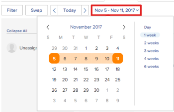

# Guida introduttiva alla pianificazione delle risorse

>[!IMPORTANT]
>  
>La funzionalità di pianificazione descritta in questo articolo è stata rimossa e rimossa da Adobe Workfront a partire dalla versione 23.1 di gennaio 2023.   
>  
>  Questo articolo verrà rimosso anche poco dopo la versione 23.1, all’inizio del 2023. Al momento, è consigliabile aggiornare di conseguenza tutti i segnalibri. 
> 
> Ora puoi utilizzare il servizio di bilanciamento del carico di lavoro per pianificare il lavoro per le risorse. 
>  
> Per informazioni sulla pianificazione delle risorse tramite il servizio di bilanciamento del carico di lavoro, consulta la sezione . [Il servizio di bilanciamento del carico di lavoro](../../resource-mgmt/workload-balancer/workload-balancer.md). 

<!--  

>[!CAUTION] 
> 
> 
> The information in this article refers to the Adobe Workfront's Scheduling tools. The Scheduling areas have been removed from the Preview environment and will be removed from the Production environment in **January 2023**.   
>  Instead, you can schedule resources in the Workload Balancer.  
> 
>*  For information about scheduling resources using the Workload Balancer, see the section [The Workload Balancer](../../resource-mgmt/workload-balancer/workload-balancer.md). 
> 
>*  For more information about the deprecation and removal of the Scheduling tools, see [Deprecation of Resource Scheduling tools in Adobe Workfront](../../resource-mgmt/resource-mgmt-overview/deprecate-resource-scheduling.md). 
-->

<!--

(NOTE: LINKED TO THE PRODUCT FROM: ALL SCHEDULING TOOLS: GLOBAL, TEAM, PROJECT STAFFING *** LINKED TO LOTS OF ARTICLES, AS WELL!) 

(NOTE: Alina: this article should be divided in multiple articles, but CAREFULLY because some sections are linked to the UI)

-->

Quando utilizzi la funzionalità di pianificazione delle risorse in Adobe Workfront puoi assegnare più facilmente attività e problemi agli utenti appropriati. Puoi determinare quali utenti sono in grado di completare l’attività o il problema, tenendo conto sia del ruolo che della disponibilità dell’utente.

Le sezioni seguenti forniscono ulteriori dettagli sull&#39;utilizzo delle aree di pianificazione in Workfront.

## Prerequisiti per l’utilizzo degli strumenti di pianificazione in Workfront

>[!IMPORTANT]
>
>I prerequisiti documentati in questo articolo si applicano solo alle aree di pianificazione di Workfront. Per informazioni sulle best practice per l’utilizzo del bilanciamento del carico di lavoro, vedi [Panoramica del servizio di bilanciamento del carico di lavoro](../../resource-mgmt/workload-balancer/overview-workload-balancer.md).

Per utilizzare correttamente la funzionalità di pianificazione delle risorse in Workfront, è necessario assicurarsi innanzitutto che tu, i tuoi progetti, le tue attività e i tuoi problemi soddisfino i seguenti prerequisiti:

* [Prerequisiti utente](#user-prerequisites)
* [Prerequisiti per il progetto](#project-prerequisites)
* [Prerequisiti per attività e problemi](#task-and-issue-prerequisites)

### Prerequisiti utente {#user-prerequisites}

È possibile utilizzare gli strumenti di pianificazione delle risorse disponibili nella scheda Pianificazione, nella scheda Gestione risorse o nella scheda Lavoro in cui sono soddisfatte ciascuna delle seguenti condizioni:

**Quando pianifichi le risorse come gestore risorse (dalla scheda Pianificazione):**

* È designato come Gestione risorse per i progetti per i quali si desidera gestire le risorse.

   Per ulteriori informazioni sulla designazione dei gestori delle risorse per un progetto, consulta l’articolo [Designare i responsabili delle risorse per un progetto o un modello](../../manage-work/projects/planning-a-project/designate-resource-managers-for-projects-and-templates.md).

* Sei un utente con una licenza Plan.

Per impostazione predefinita, gli utenti vengono visualizzati nella timeline della pianificazione solo quando dispongono di un ruolo di lavoro definito nel sistema (il ruolo di lavoro principale o secondario) e tale ruolo di lavoro corrisponde al ruolo di lavoro assegnato a un&#39;attività o a un problema attualmente visibile nel **Non assegnato** area sulla timeline della programmazione. È possibile disattivare questa funzionalità per consentire l&#39;assegnazione di attività e problemi a qualsiasi utente, indipendentemente dal fatto che l&#39;utente abbia un ruolo definito sul proprio profilo utente che corrisponda all&#39;assegnazione del ruolo dell&#39;attività o del problema a cui è assegnato. Per ulteriori informazioni, consulta l’articolo [Consenti assegnazioni utente indipendentemente dal ruolo e dall&#39;appartenenza al gruppo nelle aree di programmazione](../../resource-mgmt/resource-scheduling/assignments-regardless-of-role-or-group-scheduling-areas.md).

Per impostazione predefinita, le assegnazioni possono essere effettuate solo agli utenti che hanno un ruolo definito nel proprio profilo utente che corrisponde all&#39;assegnazione del ruolo dell&#39;attività o del problema a cui sono assegnate.

**Quando si pianificano risorse come membro del team di progetto (dalla scheda Staffing in un progetto):**

* Autorizzazioni per visualizzare, Contribute o gestire il progetto
* Hai una licenza Piano o Lavoro

<!--
<note type="note">  If Workfront has not removed the Use New Scheduling Area option from your Scheduling settings, users must have a Plan license and Manage permissions to the project to view the Scheduling timeline. For more information about the removal of the Use New Scheduling Area option, see the article
<a href="../../product-announcements/announcements/announcement-archive/replace-flash-tools.md" class="MCXref xref">Replacement of Flash-based tools in Adobe Workfront</a>.
</note>
-->

**Quando si pianificano le risorse come membro del team (dalla scheda Lavoro in corso):**

* Sei membro del team\
   Tutti i membri del team vengono visualizzati nella sequenza temporale di pianificazione. Le attività e i problemi assegnati al team e non assegnati a un utente vengono visualizzati nell&#39;area Non assegnata. Le attività e i problemi assegnati al team e a un utente del team vengono visualizzati nella riga dell’utente a cui sono assegnati.

### Prerequisiti per il progetto {#project-prerequisites}

I prerequisiti del progetto descritti in questa sezione si applicano solo quando si pianificano risorse come gestore risorse dalla timeline di pianificazione.

I progetti gestiti devono trovarsi in uno dei seguenti stati (o uno stato che sia uguale a uno di questi stati) affinché gli elementi di lavoro di tali progetti vengano visualizzati nella sequenza temporale di programmazione: Pianificazione, Corrente o Approvato. Per impostazione predefinita, vengono visualizzati solo i progetti con lo stato Corrente.

Per ulteriori informazioni sugli stati del progetto, consulta l’articolo [Creare o modificare uno stato](../../administration-and-setup/customize-workfront/creating-custom-status-and-priority-labels/create-or-edit-a-status.md).

<!--

(NOTE: [! I assume this doesn't apply when using the Staffing tab on a single project? The project can be in whatever status?]) 

-->

### Prerequisiti per attività e problemi {#task-and-issue-prerequisites}

Per essere più efficace quando utilizzi gli strumenti di pianificazione delle risorse in Workfront, assicurati che le attività e i problemi nel tuo sistema abbiano i seguenti criteri definiti:

* Durate
* Date di inizio pianificate
* Lavoro Necessario\
   Sono necessarie ore pianificate per modificare le allocazioni degli utenti, come descritto nell’articolo [Gestione delle allocazioni utente nelle aree di programmazione](../../resource-mgmt/resource-scheduling/manage-allocations-scheduling-areas.md).

   >[!NOTE]
   >
   >Il campo Orari pianificati nella scheda Programmazione risorse mostra in realtà la somma di tutti i valori workPerDay e non delle ore pianificate sull&#39;attività. i valori workPerDay vengono calcolati dividendo il valore Ora pianificata per la durata dell&#39;attività. Per le durate diverse da zero, i valori generalmente corrispondono alle ore pianificate dell&#39;attività, anche se potrebbero verificarsi alcune piccole discrepanze dovute all&#39;arrotondamento. Quando la durata è impostata su 0 giorni, l’ora pianificata viene visualizzata su 0 ore.

* Assegnazioni ruoli

## Visualizza informazioni nelle aree di programmazione

* [Individuare e visualizzare le informazioni nelle aree di programmazione](#locate-and-view-information-in-the-scheduling-areas)
* [Visualizza assegnazioni risorse e dettagli](#view-resource-assignments-and-details)
* [Ridurre al minimo le attività e i problemi relativi alle aree di programmazione](#minimize-tasks-and-issues-on-the-scheduling-areas)
* [Regola l&#39;intervallo di date delle aree di programmazione](#adjust-the-date-range-of-the-scheduling-areas)

### Individuare e visualizzare le informazioni nelle aree di programmazione {#locate-and-view-information-in-the-scheduling-areas}

A seconda di dove desideri pianificare le risorse, puoi accedere alla timeline Pianificazione nelle seguenti aree di Workfront:

* Per più progetti, nell&#39;area Pianificazione
* Per un progetto nella sezione Pianificazione
* Per un team, nella sezione Pianificazione

1. Passa alla timeline della programmazione per più progetti, per un singolo progetto o per un team:

   * **Per progetti multipli**:  Fai clic sul pulsante **Menu principale** icona  nell’angolo in alto a destra di Workfront, fai clic su **Origine > Bilanciamento carico di lavoro**, quindi seleziona **Pianificazione** nel menu a discesa in alto a sinistra.
   * **Per un singolo progetto**: Passa a un progetto e fai clic sul pulsante **Bilanciamento del carico di lavoro** nel pannello a sinistra, quindi seleziona **Pianificazione** dal menu a discesa in alto a sinistra.
   * **Per un team**: Fai clic sul pulsante **Menu principale** icona  nell’angolo in alto a destra di Workfront, quindi fai clic su **Team**, seleziona un team e fai clic su **Bilanciamento del carico di lavoro** nel pannello a sinistra, seleziona **Pianificazione** dal menu a discesa in alto a sinistra.

1. (Facoltativo) Fai clic sul pulsante **Schermo intero** nell’angolo in alto a destra della timeline della pianificazione.\
   \
   La timeline della programmazione viene visualizzata in modalità a schermo intero. Quando si visualizza la timeline della programmazione in modalità a schermo intero, la timeline della programmazione occupa l’intero schermo; tutte le altre informazioni sono nascoste (comprese le informazioni relative a team o progetti, la barra di navigazione globale e le informazioni relative al browser).

1. (Facoltativo) Per uscire dalla modalità a schermo intero, effettuare una delle seguenti operazioni:

   * Fai clic sul pulsante **Schermo intero** icona.
   * Premere il tasto Esc.

### Visualizza assegnazioni risorse e dettagli {#view-resource-assignments-and-details}

È possibile visualizzare le assegnazioni di risorse correnti e altri dettagli sulle singole attività e problemi nella timeline della pianificazione.

1. Passa alla timeline della programmazione per più progetti, per un singolo progetto o per un team:

   * **Per progetti multipli**:  Fai clic sul pulsante **Menu principale** icona  nell’angolo in alto a destra di Workfront, fai clic su **Origine > Bilanciamento carico di lavoro**, quindi seleziona **Pianificazione** nel menu a discesa in alto a sinistra.
   * **Per un singolo progetto**: Passa a un progetto e fai clic sul pulsante **Bilanciamento del carico di lavoro** nel pannello a sinistra, quindi seleziona **Pianificazione** dal menu a discesa in alto a sinistra.
   * **Per un team**: Fai clic sul pulsante **Menu principale** icona  nell’angolo in alto a destra di Workfront, quindi fai clic su **Team**, seleziona un team e fai clic su **Bilanciamento del carico di lavoro** nel pannello a sinistra, seleziona **Pianificazione** dal menu a discesa in alto a sinistra.

1. (Facoltativo) Per personalizzare il contenuto visualizzato nella timeline della pianificazione, crea un filtro come descritto in [Filtrare le informazioni nell&#39;area Pianificazione](../../resource-mgmt/resource-scheduling/filter-scheduling-area.md).
1. Espandi un’attività o un problema per visualizzare le seguenti informazioni:

   * **Progetto:** Nome e collegamento al progetto in cui si trova l&#39;attività.

   * **Date:** Le date di inizio e scadenza associate all’attività.

   * **Orari pianificati:** Numero di ore pianificate associate all&#39;attività.\
      Le ore pianificate vengono visualizzate solo se l’attività è assegnata a un utente o a un ruolo di lavoro.

   * **Icona Predecessore:** Tutti i predecessori associati all’attività. L’icona predecessore viene visualizzata solo se sono presenti predecessori associati all’attività. L’icona predecessore è verde al termine del predecessore e l’attività è pronta per essere elaborata.

   * **Assegnazioni:** Qualsiasi assegnazione di ruoli utente o di lavoro associata all&#39;attività. Le assegnazioni dei ruoli di lavoro vengono visualizzate tra parentesi accanto all&#39;assegnazione utente.\
      Le assegnazioni del team non vengono visualizzate.\
      Se disponi dell&#39;accesso a Contribute per l&#39;attività o il problema, puoi modificare le ore per le quali gli utenti vengono allocati ogni giorno all&#39;interno dell&#39;attività o della durata del problema. Per ulteriori informazioni sulla modifica delle allocazioni degli utenti, consulta l’articolo [Gestione delle allocazioni utente nelle aree di programmazione](../../resource-mgmt/resource-scheduling/manage-allocations-scheduling-areas.md).

### Ridurre al minimo le attività e i problemi relativi alle aree di programmazione {#minimize-tasks-and-issues-on-the-scheduling-areas}

Riducendo al minimo le attività e i problemi, è possibile visualizzare le assegnazioni utente per un numero elevato di utenti su un&#39;unica schermata.\
Per impostazione predefinita, tutte le attività e i problemi nella timeline della pianificazione vengono ridotti a icona.

Quando le attività e i problemi vengono ridotti a icona, puoi:

* Visualizza la durata dell&#39;attività
* Visualizza colore del progetto
* Assegnare le attività dall&#39;area non assegnata agli utenti nella timeline di pianificazione

Quando le attività e i problemi vengono ridotti a icona, non è possibile:

* Visualizza nomi attività
* Trascina le attività già assegnate a un utente e riassegnale
* Espandi le attività per visualizzare i dettagli

Se abiliti l’impostazione Mostra totali per ore pianificate giornaliere, quando le attività e i problemi vengono ridotti a icona puoi solo:

* Visualizza il totale delle ore pianificate giornaliere per ogni utente.

Quando riduci al minimo le attività e i problemi descritti in questa sezione, tali modifiche vengono visualizzate solo per te. Le attività e i problemi rimangono ridotti al minimo finché non li espandi o fino alla fine della sessione del browser. L’aggiornamento della pagina non ripristina le attività e i problemi ridotti allo stato espanso.

Nella timeline della pianificazione è possibile ridurre al minimo le attività e i problemi visualizzati per i singoli utenti, per i ruoli di lavoro o per tutti gli utenti.

* [Minimizzare attività e problemi per i singoli utenti](#minimize-tasks-and-issues-for-individual-users)
* [Ridurre al minimo attività e problemi per un ruolo di lavoro](#minimize-tasks-and-issues-for-a-job-role)
* [Minimizzare attività e problemi per tutti gli utenti](#minimize-tasks-and-issues-for-all-users)

#### Minimizzare attività e problemi per i singoli utenti {#minimize-tasks-and-issues-for-individual-users}

1. Fai clic sul cursore accanto all’utente nella timeline della pianificazione di cui desideri ridurre al minimo le attività e i problemi.\
   \
   Il modo in cui le attività e la visualizzazione dei problemi dipendono dalle seguenti impostazioni:

   * Se si abilita **Mostra totali per ore pianificate giornaliere** si applicano le seguenti condizioni:

      * Solo ore pianificate per la visualizzazione utente
      * Attività e problemi nascosti
   * Se si abilita **Mostra totali per ore pianificate giornaliere** le attività e i problemi per l’utente vengono ridotti al minimo.\
      

#### Ridurre al minimo attività e problemi per un ruolo di lavoro {#minimize-tasks-and-issues-for-a-job-role}

È possibile ridurre al minimo le attività e i problemi per tutti gli utenti associati a un ruolo di lavoro specifico.

1. Fare clic sul cursore accanto al ruolo del lavoro nella timeline di pianificazione che contiene gli utenti di cui si desidera ridurre al minimo le attività e i problemi.\
   \
   Le attività e i problemi per tutti gli utenti associati a tale ruolo vengono ridotti a icona se si disattiva la **Mostra totali per ore pianificate giornaliere** impostazione.\
   Le attività e i problemi sono nascosti e, se abiliti questa impostazione, viene visualizzata solo l’ora pianificata per gli utenti.\
   

#### Minimizzare attività e problemi per tutti gli utenti {#minimize-tasks-and-issues-for-all-users}

1. Fai clic su **Comprimi tutto** nella parte superiore dell’area Utenti e ruoli.\
   \
   Oppure\
   Fai clic sul cursore accanto a qualsiasi utente o ruolo di lavoro nella timeline della programmazione tenendo premuto il tasto Maiusc.\
   \
   Le attività e i problemi per tutti gli utenti e i ruoli vengono ridotti a icona se si disattiva la **Mostra totali per ore pianificate giornaliere** e le attività e i problemi sono nascosti se lo si abilita.\
   Se la **Mostra totali per ore pianificate giornaliere** è attivato solo l’orario pianificato per la visualizzazione degli utenti. Le attività e i problemi rimangono ridotti al minimo per l&#39;area non assegnata.\
   

### Regola l&#39;intervallo di date delle aree di programmazione {#adjust-the-date-range-of-the-scheduling-areas}

Per impostazione predefinita, nella timeline della pianificazione vengono visualizzati 14 giorni consecutivi (compresi i fine settimana), a partire dal giorno corrente.

Utilizza una delle seguenti opzioni per modificare l’intervallo di date per il quale i dati vengono visualizzati sulla sequenza temporale di programmazione:

* **Opzioni intervallo date:** Fai clic sull’intervallo di date corrente, quindi seleziona il numero di settimane da visualizzare sulla timeline. È possibile visualizzare il giorno (giorno singolo), 1 settimana (7 giorni), 2 settimane (14 giorni), 3 settimane (21 giorni), 4 settimane (28 giorni) o 6 settimane (42 giorni).\
   Quando regoli l’intervallo di date della timeline della pianificazione, considera quanto segue:

   * Le opzioni dell’intervallo di date selezionate vengono mantenute al successivo accesso alla timeline di pianificazione.

      <!--   
     
(NOTE: [! Not sure if this is going to apply to all 3 scheduling areas...]) 
   
     -->

   * Quando si visualizza la timeline della pianificazione nella visualizzazione Giorno, le allocazioni degli utenti non vengono visualizzate.\
      

* **Calendario:** Fai clic sull’intervallo di date corrente, quindi fai clic sul giorno precedente o successivo al giorno corrente. L’intervallo tra il giorno corrente e il giorno selezionato è il nuovo intervallo.\
   

* **Oggi:** Fai clic su questa opzione per visualizzare il giorno corrente. Il giorno corrente viene quindi visualizzato all’estrema sinistra dell’intervallo di date.\
   Fai clic sulle frecce sinistra e destra per visualizzare le date passate o future.

   >[!NOTE]
   >
   >L’intervallo di tempo selezionato viene mantenuto durante l’aggiornamento della pagina.

   

* **Trascinamento dell’intervallo di date:** Trascina l’intervallo di date nella parte superiore della timeline di pianificazione.\
   

## Configurare le impostazioni nelle aree di programmazione

Per impostazione predefinita, alcune informazioni vengono visualizzate nella timeline Pianificazione. Puoi anche configurare le impostazioni per visualizzare ulteriori informazioni.

Per informazioni sulla configurazione delle impostazioni nella timeline Pianificazione, consulta i seguenti articoli:

[Configurare le impostazioni nelle aree di programmazione](../../resource-mgmt/resource-scheduling/configure-settings-scheduling-areas.md)

[Consenti assegnazioni utente indipendentemente dal ruolo e dall&#39;appartenenza al gruppo nelle aree di programmazione](../../resource-mgmt/resource-scheduling/assignments-regardless-of-role-or-group-scheduling-areas.md)

[Assegnazione automatica di attività e problemi non assegnati nelle aree di programmazione](../../resource-mgmt/resource-scheduling/automatically-assign-items-scheduling-areas.md)

## Filtrare le informazioni nelle aree di programmazione

Puoi definire cosa visualizzare nella timeline della pianificazione creando un filtro.

Per ulteriori informazioni, consulta l’articolo [Filtrare le informazioni nell&#39;area Pianificazione](../../resource-mgmt/resource-scheduling/filter-scheduling-area.md).

## Modifica assegnazioni e allocazioni utente

* [Modificare le assegnazioni utente](#modify-user-assignments)
* [Modificare le allocazioni degli utenti](#modify-user-allocations)

### Modificare le assegnazioni utente {#modify-user-assignments}

È possibile modificare le assegnazioni utente dalla scheda Pianificazione (durante la pianificazione delle risorse per i progetti) utilizzando lo strumento di scambio o modificando attività e problemi direttamente dalla timeline della pianificazione. È possibile modificare le assegnazioni utente dalla scheda Attivato (durante la pianificazione delle risorse per i team) modificando attività e problemi direttamente dalla timeline della pianificazione.

Per ulteriori informazioni, consulta l’articolo [Assegnazione manuale di attività e problemi non assegnati nelle aree di programmazione](../../resource-mgmt/resource-scheduling/manually-assign-items-scheduling-areas.md).

### Modificare le allocazioni degli utenti {#modify-user-allocations}

È possibile determinare in che modo le ore pianificate per un&#39;attività o un problema vengono assegnate agli utenti. Le ore pianificate possono essere suddivise nei seguenti modi:

* Tra gli utenti assegnati all’attività o al problema.
* In tutta la durata dell&#39;attività o del problema.

Per ulteriori informazioni, consulta l’articolo [Gestione delle allocazioni utente nelle aree di programmazione](../../resource-mgmt/resource-scheduling/manage-allocations-scheduling-areas.md).
