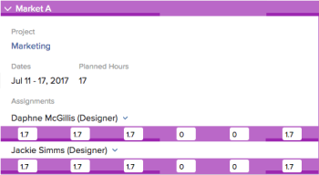

# Gestione delle allocazioni utente nelle aree di programmazione

>[!IMPORTANT]
>  
>La funzionalità di pianificazione descritta in questo articolo è stata rimossa e rimossa da Adobe Workfront a partire dalla versione 23.1 di gennaio 2023.   
>  
>  Questo articolo verrà rimosso anche poco dopo la versione 23.1, all’inizio del 2023. Al momento, è consigliabile aggiornare di conseguenza tutti i segnalibri. 
> 
> Ora puoi utilizzare il servizio di bilanciamento del carico di lavoro per pianificare il lavoro per le risorse. 
>  
> Per informazioni sulla pianificazione delle risorse tramite il servizio di bilanciamento del carico di lavoro, consulta la sezione . [Il servizio di bilanciamento del carico di lavoro](../../resource-mgmt/workload-balancer/workload-balancer.md). 

<!--  

>[!CAUTION] 
> 
> 
> The information in this article refers to the Adobe Workfront's Scheduling tools. The Scheduling areas have been removed from the Preview environment and will be removed from the Production environment in **January 2023**.   
>  Instead, you can schedule resources in the Workload Balancer.  
> 
>*  For information about scheduling resources using the Workload Balancer, see the section [The Workload Balancer](../../resource-mgmt/workload-balancer/workload-balancer.md). 
> 
>*  For more information about the deprecation and removal of the Scheduling tools, see [Deprecation of Resource Scheduling tools in Adobe Workfront](../../resource-mgmt/resource-mgmt-overview/deprecate-resource-scheduling.md). 

-->

Le allocazioni degli utenti sono quantità di ore che indicano il tempo che un utente deve trascorrere in un dato giorno per completare un elemento di lavoro. Sono inclusi nelle ore pianificate dell&#39;elemento di lavoro.

Questo articolo descrive come aggiornare le allocazioni giornaliere orarie per gli utenti assegnati a attività o problemi utilizzando l&#39;area di programmazione delle risorse. Per informazioni sulla gestione delle allocazioni complessive per gli utenti e i ruoli di lavoro per le attività, vedere [Gestione delle ore di allocazione di utenti e ruoli sulle attività](../../manage-work/tasks/assign-tasks/manage-allocation-hours-on-tasks.md). Non è possibile aggiornare le allocazioni complessive per gli utenti e i ruoli di lavoro per i problemi.

Puoi visualizzare le allocazioni degli utenti nelle seguenti aree di Adobe Workfront:

* Nella sezione Programmazione dell&#39;area Risorse.
* Nella sezione Programmazione di un progetto (durante la pianificazione delle risorse per un singolo progetto).
* Nella sezione Pianificazione di un team (durante la pianificazione delle risorse per un team).

## Requisiti di accesso

Devi disporre dei seguenti elementi:

<table style="table-layout:auto"> 
 <col> 
 <col> 
 <tbody> 
  <tr> 
   <td role="rowheader">piano Adobe Workfront*</td> 
   <td> 
Qualsiasi
 </td> 
  </tr> 
  <tr> 
   <td role="rowheader">Licenza Adobe Workfront*</td> 
   <td> 
Lavoro o superiore
 </td> 
  </tr> 
  <tr> 
   <td role="rowheader">Livello di accesso*</td> 
   <td> 
Accesso a progetti, attività e problemi
 
<b>NOTA</b>

Se non disponi ancora dell’accesso, chiedi all’amministratore Workfront se ha impostato ulteriori restrizioni nel livello di accesso. Per informazioni su come un amministratore Workfront può modificare il livello di accesso, consulta <a href="../../administration-and-setup/add-users/configure-and-grant-access/create-modify-access-levels.md" class="MCXref xref">Creare o modificare livelli di accesso personalizzati</a>.
 </td>
</tr> 
  <tr> 
   <td role="rowheader">Autorizzazioni oggetto</td> 
   <td> 
Autorizzazioni di Contribute per progetti, attività e problemi
 
Per informazioni sulla richiesta di accesso aggiuntivo, vedi <a href="../../workfront-basics/grant-and-request-access-to-objects/request-access.md" class="MCXref xref">Richiedere l’accesso agli oggetti </a>.
 </td> 
  </tr> 
 </tbody> 
</table>

*Per sapere quale piano, tipo di licenza o accesso si dispone, contattare l&#39;amministratore Workfront.

## Allocazione degli utenti nelle aree di programmazione

Prima di iniziare ad allocare il tempo agli utenti come descritto in questo articolo, acquisisci familiarità con il funzionamento della pianificazione delle risorse in Workfront, come descritto in [Guida introduttiva alla pianificazione delle risorse](../../resource-mgmt/resource-scheduling/get-started-resource-scheduling.md).

È possibile pianificare le risorse per lavorare su attività e problemi per un singolo team di cui si è membri, per un singolo progetto in cui si è membri del team di progetto o per più progetti di cui si è il manager delle risorse.

Le sezioni seguenti descrivono come abilitare e gestire le allocazioni di utenti in Workfront:

* [Utilizzare le aree di programmazione per assegnare il lavoro](#use-the-scheduling-areas-to-assign-work)
* [Allocazioni impostate nelle caselle Modifica attività o Modifica problema rispetto alle aree di programmazione](#allocations-set-on-the-edit-task-or-the-edit-issue-boxes-vs-in-the-scheduling-areas)
* [Indicatori di allocazione](#allocation-indicators)
* [Allocazione predefinita per ore pianificate](#default-allocation-for-planned-hours)
* [Chi può visualizzare e modificare le allocazioni?](#who-can-view-and-modify-allocations)
* [Considerazioni sul fuso orario nelle aree di programmazione](#time-zone-considerations-in-the-scheduling-areas)

### Utilizzare le aree di programmazione per assegnare il lavoro {#use-the-scheduling-areas-to-assign-work}

Quando si assegna nuovo lavoro agli utenti nella timeline Pianificazione, è possibile determinare in che modo gli utenti allocano gli orari pianificati per un&#39;attività o un problema.\
Per ulteriori informazioni sulle ore pianificate, vedi [Panoramica sull’orario pianificato](../../manage-work/tasks/task-information/planned-hours.md).

Le ore pianificate possono essere suddivise nei seguenti modi:

* Tra gli utenti assegnati all’attività o al problema
* Per tutta la durata dell&#39;attività o del problema\
   Ad esempio, un&#39;attività relativa alle vendite potrebbe richiedere più lavoro per la fine della durata dell&#39;attività. Puoi pianificare questa distribuzione diseguale di ore nell&#39;attività.

>[!TIP]
>
>Quando si pianificano risorse per più progetti dalle aree Programmazione, non tutti gli utenti e gli elementi di lavoro vengono visualizzati nella timeline Pianificazione. Per informazioni sulle informazioni visualizzate nella timeline di Pianificazione, consulta [Guida introduttiva alla pianificazione delle risorse](../../resource-mgmt/resource-scheduling/get-started-resource-scheduling.md).

### Allocazioni impostate nelle caselle Modifica attività o Modifica problema rispetto alle aree di programmazione {#allocations-set-on-the-edit-task-or-the-edit-issue-boxes-vs-in-the-scheduling-areas}

Puoi modificare le allocazioni degli utenti per un&#39;attività o un problema dalle seguenti posizioni all&#39;interno di Workfront:

* Timeline di programmazione\
   La timeline Pianificazione si trova nelle seguenti aree:

   * Nella sezione Programmazione dell&#39;area Risorse.
   * Nella sezione Programmazione di un progetto (durante la pianificazione delle risorse per un singolo progetto).
   * Nella sezione Pianificazione di un team (durante la pianificazione delle risorse per un team).

   Quando si modificano le allocazioni degli utenti dalla timeline di Pianificazione (come descritto in [Modificare le allocazioni degli utenti](#modify-user-allocations) in questo articolo), è possibile definire le allocazioni per ogni utente sull&#39;attività o sul problema, nonché per ogni giorno all&#39;interno dell&#39;attività o della durata del problema.\
   

* Finestra di dialogo Modifica attività o Modifica problema.\
   Quando si modificano le allocazioni degli utenti da una finestra di dialogo Modifica attività o Problema (come descritto in [Gestisci la percentuale di allocazione di utenti o ruoli sulle attività](../../manage-work/tasks/assign-tasks/manage-allocation-percentage-on-tasks.md)), è possibile definire le allocazioni per l&#39;attività o il problema solo nel suo insieme per ogni utente. Se si desidera gestire tali allocazioni su base giornaliera, è necessario modificare le allocazioni nella timeline Pianificazione, come descritto in [Modificare le allocazioni degli utenti](#modify-user-allocations) in questo articolo.

   >[!IMPORTANT]
   >
   >Quando si modificano le allocazioni degli utenti da una finestra di dialogo Modifica attività o Problema, le allocazioni configurate in precedenza nella timeline Pianificazione vengono sovrascritte. Inoltre, qualsiasi modifica apportata alle allocazioni nella timeline Pianificazione non viene visualizzata in una finestra di dialogo Modifica attività o Problema.

È consigliabile gestire le allocazioni degli utenti dalla timeline di Pianificazione anziché dall’attività o dal problema di modifica per beneficiare dei seguenti vantaggi:

* È possibile vedere chiaramente quando gli utenti vengono sovrassegnati utilizzando gli indicatori di allocazione, come descritto in [Indicatori di allocazione](#allocation-indicators) sezione .
* È possibile assegnare più tempo a un utente rispetto a un altro.\
   Gli indicatori di allocazione forniscono una rappresentazione visiva del modo in cui un utente è assegnato rispetto ad altri utenti, come descritto in [Indicatori di allocazione](#allocation-indicators) sezione .

* È possibile allocare più tempo al lavoro in un giorno in un altro.\
   Gli indicatori di allocazione forniscono una rappresentazione visiva del modo in cui gli utenti allocati si trovano in un dato giorno, come descritto in [Indicatori di allocazione](#allocation-indicators).

* È possibile eseguire tutte le responsabilità di risorse in un&#39;unica posizione, nella timeline Pianificazione.

### Indicatori di allocazione {#allocation-indicators}

Sono disponibili vari indicatori visivi per fornire informazioni rapide sul livello di assegnazione di un utente al lavoro in un dato giorno.

L’amministratore di sistema determina il modo in cui Workfront calcola la disponibilità degli utenti a livello di sistema (considerando le ore e la disponibilità di FTE). A seconda di questa impostazione a livello di sistema, la disponibilità dell’utente viene calcolata utilizzando la pianificazione predefinita o la pianificazione dell’utente. Per ulteriori informazioni, consulta [Configurare il modo in cui Workfront calcola la disponibilità di ore risorsa e FTE per l’area di pianificazione](../../resource-mgmt/resource-scheduling/calculate-hours-fte-scheduling-area.md).

* **Ombreggiatura allocazione**
L’allocazione viene visualizzata visivamente sulle attività assegnate agli utenti sotto forma di ombreggiatura. L’ombreggiatura più scura indica le ore assegnate come percentuale dell’ETP (Full Time Equivalent) degli utenti assegnati in un dato giorno. (Per ulteriori informazioni su come configurare FTE in Workfront, vedi [Configurare il modo in cui Workfront calcola la disponibilità di ore risorsa e FTE per l’area di pianificazione](../../resource-mgmt/resource-scheduling/calculate-hours-fte-scheduling-area.md).)\
   Ad esempio, un singolo utente viene assegnato a un’attività con un valore di 4 ore pianificate e una durata di 1 giorno. L’FTE per l’utente è definito nel sistema come 1 (ovvero l’utente deve lavorare a tempo pieno, o piuttosto 40 ore alla settimana o 8 ore al giorno). L’ombreggiatura per l’attività in un dato giorno occupa la metà dello spazio verticale dell’attività, il che indica che all’utente è assegnata la metà dell’ETP (4 ore) in quel giorno.\
   \
   L&#39;attività o il problema visualizza l&#39;allocazione cumulativa tra tutti gli utenti assegnati all&#39;elemento di lavoro. È possibile espandere un elemento di lavoro per visualizzare ulteriori dettagli, tra cui l&#39;utente assegnato all&#39;elemento di lavoro e quante ore sono assegnate a ciascun utente.\
   L&#39;ombreggiatura non viene visualizzata sulle attività nel **Non assegnato** nella timeline Pianificazione.\
   

* **Totali giornalieri per ogni utente:** È possibile visualizzare il totale delle ore pianificate assegnate a un determinato utente ogni giorno. Queste informazioni vengono visualizzate nella parte superiore della riga di ciascun utente nella timeline Pianificazione. Queste informazioni non vengono visualizzate per impostazione predefinita. Puoi attivarlo come descritto in [Abilita allocazioni utente](#enable-user-allocations). Le attività dei progetti con uno dei seguenti stati sono incluse nella determinazione dei totali giornalieri: Corrente, Pianificazione o Approvata.\
   

* **Indicatori di sovrallocazione**
Quando il numero totale di ore pianificate assegnate a un utente in un dato giorno supera il numero di ore in cui l’utente lavora in un giorno (in tutte le attività), tale utente viene considerato sovrassegnato in quel giorno.\
   Quando un utente viene sovrapassegnato, viene visualizzata una barra rossa che descrive ogni attività del giorno.\
   Quando si determina la sovrallocazione di un utente, vengono incluse le attività dei progetti con uno dei seguenti stati: Corrente, Pianificazione o Approvata.\
   Il numero di ore in cui un utente lavora in un giorno è definito tramite il campo FTE nel profilo di ciascun utente, come descritto in [Configurare il modo in cui Workfront calcola la disponibilità di ore risorsa e FTE per l’area di pianificazione](../../resource-mgmt/resource-scheduling/calculate-hours-fte-scheduling-area.md).\
   \
   Quando si abilita la **Mostra totali per ore pianificate giornaliere** e **Mostra evidenziazione allocazione risorse** nelle impostazioni, il numero totale giornaliero di ore pianificate viene visualizzato in rosso quando l’utente viene sovrapassegnato. Per impostazione predefinita, le ore vengono visualizzate al decimo più vicino (ad esempio, 1.3).\
   

### Allocazione predefinita per ore pianificate {#default-allocation-for-planned-hours}

Workfront tenta di distribuire le ore pianificate tra gli utenti e i giorni assegnati come segue:

* Quando più utenti vengono assegnati a un’attività o a un problema, le ore vengono suddivise in modo uniforme tra gli utenti.\
   La distribuzione riflette le assegnazioni avanzate già effettuate sull&#39;attività.\
   Per ulteriori informazioni sulle assegnazioni avanzate, consulta [Creazione di assegnazioni avanzate](../../manage-work/tasks/assign-tasks/create-advanced-assignments.md).

* Quando la durata dell&#39;attività o del problema si estende per più giorni, l&#39;orario pianificato viene distribuito equamente tra i giorni e tra tutti gli utenti assegnati all&#39;attività, in base alla pianificazione dell&#39;utente.
* Quando l&#39;orario pianificato di un&#39;attività si estende per più giorni, un utente che visualizza l&#39;attività da un fuso orario diverso potrebbe notare una differenza nella durata dell&#39;attività o nella data di inizio pianificata o nella data di completamento pianificata.

Per impostazione predefinita, le ore vengono visualizzate al centesimo più vicino (ad esempio, 1,33). Puoi scorrere verso destra per visualizzare altre informazioni.\

### Chi può visualizzare e modificare le allocazioni? {#who-can-view-and-modify-allocations}

I seguenti tipi di utenti possono visualizzare o modificare le allocazioni degli utenti in Workfront:

* **Manager risorse:** È possibile visualizzare e modificare le allocazioni degli utenti per le attività e i problemi relativi a qualsiasi progetto per il quale si è il responsabile risorse. Puoi eseguire questa operazione nella timeline Pianificazione nell’area Persone o nella scheda Gestione risorse di un progetto.\
   Per informazioni su come i responsabili risorse possono apportare modifiche alle attività e ai problemi nei progetti, consulta [Assegnazione manuale di attività e problemi non assegnati nelle aree di programmazione](../../resource-mgmt/resource-scheduling/manually-assign-items-scheduling-areas.md).

* **Pianificare e lavorare gli utenti:** È possibile visualizzare le allocazioni per tutte le attività e i problemi a cui si è assegnati utilizzando il nuovo calendario di lavoro personale o il calendario di lavoro su un team di cui si è membri.\
   Oltre a visualizzare le allocazioni, è possibile modificare le allocazioni se si dispone dell&#39;accesso di Contribute alle attività e ai problemi.

   <!--
  <MadCap:conditionalText data-mc-conditions="QuicksilverOrClassic.Draft mode">
  (NOTE: Article is conditioned to classic.)
  </MadCap:conditionalText>
  -->

### Considerazioni sul fuso orario nelle aree di programmazione  {#time-zone-considerations-in-the-scheduling-areas}

In rari casi, gli utenti che visualizzano la timeline di pianificazione potrebbero vedere incongruenze nelle quali le ore pianificate di un&#39;attività non corrispondono alle ore totali allocate dei singoli giorni. Ciò può verificarsi quando l&#39;impostazione del fuso orario del sistema operativo di un utente è tale che la data di inizio pianificata o la data di completamento pianificata differisca da un altro utente.

Ad esempio, se la data di completamento pianificata di un&#39;attività è impostata alle 00:00 del 18/3/11, MST, un utente in Australia che visualizza l&#39;attività vedrà la data di completamento pianificata alle 00:00 del 11/4/18, il giorno successivo. Se l’utente in Australia assegna ore il 18/11/4, queste ore assegnate non sono visibili all’utente al MST. Tuttavia, queste ore sono sempre prese in considerazione nelle ore previste del progetto.

## Abilita allocazioni utente {#enable-user-allocations}

La funzionalità di allocazione utente è disabilitata per impostazione predefinita nella timeline di Pianificazione. Prima di poter utilizzare la funzionalità di allocazione utente descritta in questa sezione, devi prima abilitarla.

>[!NOTE]
>
>Le allocazioni degli utenti possono essere abilitate solo quando la timeline di pianificazione è configurata per l’utilizzo di date pianificate. Se la timeline di pianificazione è configurata per l’utilizzo di date previste, non è possibile visualizzare le allocazioni degli utenti. Per ulteriori informazioni sulla configurazione della timeline di programmazione per l’utilizzo di date pianificate o previste, vedere &quot;Configurazione di date previste da visualizzare sulla timeline di programmazione&quot; in [Configurare le impostazioni nelle aree di programmazione](../../resource-mgmt/resource-scheduling/configure-settings-scheduling-areas.md).

Per abilitare le allocazioni degli utenti nella cronologia di programmazione:

1. Passa alla timeline della programmazione per più progetti, per un singolo progetto o per un team:

   * **Per progetti multipli**:  Fai clic sul pulsante **Menu principale** icona  nell’angolo in alto a destra di Workfront, fai clic su **Origine > Bilanciamento carico di lavoro**, quindi seleziona **Pianificazione** nel menu a discesa in alto a sinistra.
   * **Per un singolo progetto**: Passa a un progetto e fai clic sul pulsante **Bilanciamento del carico di lavoro** nel pannello a sinistra, quindi seleziona **Pianificazione** dal menu a discesa in alto a sinistra.
   * **Per un team**: Fai clic sul pulsante **Menu principale** icona  nell’angolo in alto a destra di Workfront, quindi fai clic su **Team**, seleziona un team e fai clic su **Bilanciamento del carico di lavoro** nel pannello a sinistra, seleziona **Pianificazione** dal menu a discesa in alto a sinistra.

   

1. Fai clic sul pulsante **Impostazioni** nella timeline di programmazione.\
   \
   Viene visualizzata la finestra di dialogo Impostazioni programmazione risorse.\
   

1. Abilitare una o entrambe le opzioni seguenti per visualizzare le allocazioni degli utenti nella timeline di Pianificazione:

   <table style="table-layout:auto"> 
    <col> 
    <col> 
    <tbody> 
     <tr> 
      <td role="rowheader">Mostra l'evidenziazione dell'allocazione delle risorse</td> 
      <td> 
Visualizza l'ombreggiatura dell'allocazione utente per le attività e i problemi nella timeline di Pianificazione. 
 
Questa opzione è disabilitata per impostazione predefinita.
 </td> 
     </tr> 
     <tr> 
      <td role="rowheader">Mostra i totali per le ore pianificate giornaliere</td> 
      <td>Visualizza il numero totale di ore pianificate assegnate a ogni utente per ogni giorno nella timeline Pianificazione. L’ora pianificata viene visualizzata al decimo più vicino (ad esempio, 1.3). Questa opzione è disabilitata per impostazione predefinita.</td> 
     </tr> 
    </tbody> 
   </table>

1. (Facoltativo) In **Includi problemi** Selezionare se si desidera visualizzare i problemi nella timeline Pianificazione.\
   Questa opzione è disabilitata per impostazione predefinita.

1. Fai clic su **Torna alla pianificazione**.\
   Le allocazioni degli utenti vengono ora visualizzate nella timeline Pianificazione.\
   

## Modificare le allocazioni degli utenti {#modify-user-allocations}

È possibile modificare le allocazioni degli utenti per un&#39;attività o un problema dalla timeline Pianificazione (come descritto in questa sezione) o dalla finestra di dialogo Modifica attività o problema. Per ulteriori informazioni, consulta [Allocazioni impostate nelle caselle Modifica attività o Modifica problema rispetto alle aree di programmazione](#allocations-set-on-the-edit-task-or-the-edit-issue-boxes-vs-in-the-scheduling-areas).

Per impostazione predefinita, gli utenti vengono assegnati a un&#39;attività o a un problema in modo uniforme tra gli assegnatari e tra i giorni della durata, come descritto in [Allocazione predefinita per ore pianificate](#default-allocation-for-planned-hours).

Per modificare le allocazioni degli utenti per un&#39;attività o un problema dalla cronologia di programmazione:

1. Passa alla timeline della programmazione per più progetti, per un singolo progetto o per un team:

   * **Per progetti multipli**:  Fai clic sul pulsante **Menu principale** icona  nell’angolo in alto a destra di Workfront, fai clic su **Origine > Bilanciamento carico di lavoro**, quindi seleziona **Pianificazione** nel menu a discesa in alto a sinistra.
   * **Per un singolo progetto**: Passa a un progetto e fai clic sul pulsante **Bilanciamento del carico di lavoro** nel pannello a sinistra, quindi seleziona **Pianificazione** dal menu a discesa in alto a sinistra.
   * **Per un team**: Fai clic sul pulsante **Menu principale** icona  nell’angolo in alto a destra di Workfront, quindi fai clic su **Team**, seleziona un team e fai clic su **Bilanciamento del carico di lavoro** nel pannello a sinistra, seleziona **Pianificazione** dal menu a discesa in alto a sinistra.

   

1. Assicurati che le allocazioni degli utenti siano abilitate nella timeline di programmazione, come descritto in [Abilita allocazioni utente](#enable-user-allocations) in questo articolo.
1. Espandi l’attività in cui desideri gestire le allocazioni degli utenti.\
   Per impostazione predefinita, le ore pianificate sono suddivise in modo uniforme tra gli utenti assegnati e i giorni della durata dell&#39;attività. Le ore non vengono aggiunte nei fine settimana (sabato e domenica). Per ulteriori informazioni, consulta la sezione [Allocazione predefinita per ore pianificate](#default-allocation-for-planned-hours) in questo articolo.

1. Fare clic sul campo dell&#39;utente di cui si desidera regolare le ore in un dato giorno.

   >[!NOTE]
   >
   >Per mantenere la distribuzione originale dopo aver modificato le ore, fai clic su **Annulla**.

1. Specifica il numero di ore corretto.
1. Fai clic su **Salva**.\
   È possibile salvare le modifiche solo quando il numero totale di ore per l&#39;attività è uguale al numero di ore pianificate originali. Questo numero viene visualizzato nella **Orari pianificati** campo dell&#39;attività. Il numero viene visualizzato in rosso quando il totale non è uguale al numero totale di ore pianificate.\
   

## Criteri che ripristinano le allocazioni degli utenti

Workfront ripristina le allocazioni utente modificate manualmente nella timeline Pianificazione quando si verificano diverse azioni sulle attività o sul progetto. In genere, Workfront ripristina le allocazioni degli utenti ogni volta che la cronologia del progetto viene ricalcolata se in questo processo è stato modificato il numero di ore pianificate per le attività e i problemi.\
Per ulteriori informazioni sul ricalcolo della cronologia dei progetti, consulta [Ricalcolare le timeline dei progetti](../../manage-work/projects/manage-projects/recalculate-project-timeline.md).

Alcuni dei criteri più comuni che potrebbero ripristinare le allocazioni degli utenti nella timeline di Pianificazione sono:

* Aggiunta di un’attività a un’iterazione.\
   Poiché le iterazioni hanno date fisse, le date delle attività e delle allocazioni vengono ricalcolate.\
   Per informazioni su come le iterazioni possono influenzare le date delle attività, vedere [Aggiungere storie a un&#39;iterazione esistente](../../agile/use-scrum-in-an-agile-team/iterations/add-stories-to-existing-iteration.md).

* Modifica del tipo di durata di un&#39;attività in Unità sforzo.
* Modifica del tipo di durata di un&#39;attività in Assegnazione calcolata quando vengono assegnate più di una persona.\
   Per informazioni sulla durata dell&#39;attività, consulta [Panoramica del tipo di durata e durata dell’attività](../../manage-work/tasks/taskdurtn/task-duration-and-duration-type.md).

* Modifica delle date di inizio e di completamento pianificati del progetto.\
   Per informazioni sulle date pianificate del progetto, vedi [Panoramica del progetto Data di inizio prevista](../../manage-work/projects/planning-a-project/project-planned-start-date.md) e [Imposta la data di completamento pianificato del progetto](../../manage-work/projects/planning-a-project/project-planned-completion-date.md).

   Per informazioni sull&#39;attività Data completamento pianificato, vedere [Panoramica dell&#39;attività Data completamento pianificata](../../manage-work/tasks/task-information/task-planned-completion-date.md).

* Modifica delle date di un&#39;attività predecessore se il Vincolo attività è un vincolo flessibile.\
   Ad esempio, il più presto possibile o il più tardi possibile.\
   Per informazioni sul vincolo di attività, vedere [Panoramica sul vincolo di attività](../../manage-work/tasks/task-constraints/task-constraint-overview.md).

* Modifica della quantità di ore pianificate di attività o problemi.

   Per informazioni sulle ore pianificate in Workfront, vedi [Panoramica sull’orario pianificato](../../manage-work/tasks/task-information/planned-hours.md).
