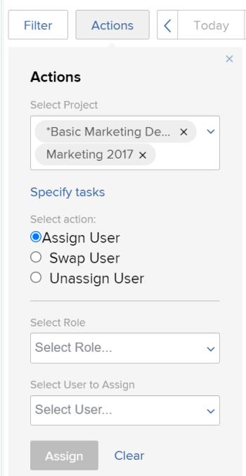

# Modificare più assegnazioni di utenti in attività nelle aree di programmazione

>[!IMPORTANT]
>  
>La funzionalità di pianificazione descritta in questo articolo è stata rimossa e rimossa da Adobe Workfront a partire dalla versione 23.1 di gennaio 2023.   
>  
>  Questo articolo verrà rimosso anche poco dopo la versione 23.1, all’inizio del 2023. Al momento, è consigliabile aggiornare di conseguenza tutti i segnalibri. 
> 
> Ora puoi utilizzare il servizio di bilanciamento del carico di lavoro per pianificare il lavoro per le risorse. 
>  
> Per informazioni sulla pianificazione delle risorse tramite il servizio di bilanciamento del carico di lavoro, consulta la sezione . [Il servizio di bilanciamento del carico di lavoro](../../resource-mgmt/workload-balancer/workload-balancer.md). 

<!--   

>[!CAUTION] 
> 
> 
> The information in this article refers to the Adobe Workfront's Scheduling tools. The Scheduling areas have been removed from the Preview environment and will be removed from the Production environment in **January 2023**.  
>  Instead, you can schedule resources in the Workload Balancer.  
> 
>*  For information about scheduling resources using the Workload Balancer, see the section [The Workload Balancer](../../resource-mgmt/workload-balancer/workload-balancer.md). 
> 
>*  For more information about the deprecation and removal of the Scheduling tools, see [Deprecation of Resource Scheduling tools in Adobe Workfront](../../resource-mgmt/resource-mgmt-overview/deprecate-resource-scheduling.md). 

This article refers to modifying user assignments for multiple tasks using the Scheduling area of Adobe Workfront. Also see the following articles for modifying assignments on multiple tasks in other areas:

* For information about modifying assignments on multiple tasks in a task list, see [Modify multiple user assignments in a task list](../../manage-work/tasks/assign-tasks/modify-multiple-assignments-in-task-list.md). 
* For information about scheduling resources using the new Workload Balancer, see the section [The Workload Balancer](../../resource-mgmt/workload-balancer/workload-balancer.md).
-->
È possibile assegnare gli utenti a più attività contemporaneamente quando si utilizza lo strumento di pianificazione delle risorse.

>[!NOTE]
>
>Questo articolo si applica solo quando si pianificano risorse per più progetti (dalla sezione Pianificazione ) o per un singolo progetto (dalla sezione Pianificazione ); non è possibile gestire le assegnazioni utente per più attività come descritto in questa sezione durante la pianificazione delle risorse per un team (dalla sezione Pianificazione ).

## Requisiti di accesso

Devi disporre dei seguenti elementi:

<table style="table-layout:auto"> 
 <col> 
 <col> 
 <tbody> 
  <tr> 
   <td role="rowheader">piano Adobe Workfront*</td> 
   <td> 
Qualsiasi
 </td> 
  </tr> 
  <tr> 
   <td role="rowheader">Panoramica delle licenze Adobe Workfront*</td> 
   <td> 
Lavoro o superiore
 </td> 
  </tr> 
  <tr> 
   <td role="rowheader">Livello di accesso*</td> 
   <td> 
Accesso a progetti, attività e problemi
 
<b>NOTA</b> Se non disponi ancora dell’accesso, chiedi all’amministratore Workfront se ha impostato ulteriori restrizioni nel livello di accesso. Per informazioni su come un amministratore Workfront può modificare il livello di accesso, consulta <a href="../../administration-and-setup/add-users/configure-and-grant-access/create-modify-access-levels.md" class="MCXref xref">Creare o modificare livelli di accesso personalizzati</a>.
 </td> 
  </tr> 
  <tr> 
   <td role="rowheader">Autorizzazioni oggetto</td> 
   <td> 
Autorizzazioni di Contribute o superiori ai progetti, alle attività e ai problemi per i quali vengono aggiornate le assegnazioni
 
Per informazioni sulla richiesta di accesso aggiuntivo, vedi <a href="../../workfront-basics/grant-and-request-access-to-objects/request-access.md" class="MCXref xref">Richiedere l’accesso agli oggetti </a>.
 </td> 
  </tr> 
 </tbody> 
</table>

*Per sapere quale piano, tipo di licenza o accesso si dispone, contattare l&#39;amministratore Workfront.

## Considerazioni per l&#39;esecuzione di più assegnazioni nelle aree di programmazione

È possibile gestire rapidamente le assegnazioni utente per più attività e problemi in uno o più progetti (le modifiche vengono quindi riportate nella timeline della pianificazione).

È possibile assegnare un utente a tutte le attività attualmente assegnate a un ruolo di lavoro, scambiare le assegnazioni utente tra utenti o annullare l&#39;assegnazione di un utente da tutte le attività.

Ad esempio:

* Un gestore delle risorse è responsabile dell&#39;esecuzione delle assegnazioni utente per un nuovo progetto. Il progetto è stato creato originariamente come modello e i ruoli di lavoro sono già assegnati alle varie attività all’interno del progetto. Il gestore risorse desidera assegnare un utente specifico a tutte le attività attualmente assegnate a un ruolo di lavoro.
* 45 attività su 3 progetti diversi sono assegnati a Jackie Simms. Jackie lascia l&#39;organizzazione e ora il responsabile delle risorse deve riassegnare le sue attività a un altro utente.

>[!NOTE]
>
>Quando si gestiscono le assegnazioni utente per più attività, tenere conto delle seguenti limitazioni:
>
>* Quando si pianificano risorse per più progetti, i progetti gestiti devono trovarsi in uno dei seguenti stati (o uno stato che sia uguale a uno di questi stati): Pianificazione, Corrente o Approvato. Per ulteriori informazioni sugli stati del progetto, consulta [Creare o modificare uno stato](../../administration-and-setup/customize-workfront/creating-custom-status-and-priority-labels/create-or-edit-a-status.md).
>* Quando si pianificano risorse per un singolo progetto, lo stato del progetto non influisce sulla disponibilità di questa funzionalità.
>* Puoi apportare modifiche alle risorse per gli utenti con le seguenti licenze: Pianificare, lavorare e rivedere. Non è possibile apportare modifiche alle risorse per gli utenti con una licenza di richiesta.
>

## Gestione delle assegnazioni utente per uno o più progetti

1. Passa alla tempistica di programmazione per più progetti o per un singolo progetto:

   * **Per progetti multipli**:  Fai clic sul pulsante **Menu principale** icona  nell’angolo in alto a destra di Workfront, fai clic su **Origine > Bilanciamento carico di lavoro**, quindi seleziona **Pianificazione** nel menu a discesa in alto a sinistra.
   * **Per un singolo progetto**: Passa a un progetto e fai clic sul pulsante **Bilanciamento del carico di lavoro** nel pannello a sinistra, quindi seleziona **Pianificazione** dal menu a discesa in alto a sinistra.

1. Fai clic su **Azioni**.\
   

1. In **Seleziona progetto** a seconda che venga visualizzata la tempistica di programmazione per più progetti (dalla scheda Pianificazione) o per un singolo progetto (dalla scheda Staffing ), effettuare una delle seguenti operazioni:

   * **Per più progetti:** Inizia a digitare il nome del progetto in cui desideri apportare modifiche all&#39;assegnazione, quindi fai clic sul nome quando viene visualizzato nell&#39;elenco a discesa. Oppure fai clic sulla freccia a discesa per scegliere da un elenco di progetti. Ripetere questo processo per apportare modifiche alle assegnazioni in più progetti.\
      Lascia vuoto questo campo per apportare modifiche alle assegnazioni per tutti i progetti per i quali sei il gestore risorse.

      >[!NOTE]
      >
      >I progetti sono disponibili per la selezione solo se:
      >
      >   
      >   
      >   * Sei designato come gestore delle risorse per il progetto\
         >     Per ulteriori informazioni, consulta [Designare i responsabili delle risorse per un progetto o un modello](../../manage-work/projects/planning-a-project/designate-resource-managers-for-projects-and-templates.md).
      >   
      >   * Il progetto si trova in uno dei seguenti stati (o uno stato che equivale a uno di questi stati): Pianificazione, corrente o approvata\
         >     Per ulteriori informazioni sugli stati del progetto, consulta [Creare o modificare uno stato](../../administration-and-setup/customize-workfront/creating-custom-status-and-priority-labels/create-or-edit-a-status.md).
      >   
      >   * Sei un utente con una licenza Plan.

   * **Per un singolo progetto:** La **Seleziona progetto** impossibile modificare il campo. La **Seleziona progetto** contiene sempre il nome del progetto che stai visualizzando.

1. (Facoltativo) Fai clic su **Specificare le attività** per modificare le modifiche di assegnazione per le singole attività. Quando si specificano singole attività, tutti i progetti selezionati nella **Seleziona progetto** vengono ignorati.\
   In **Seleziona attività** iniziare a digitare il nome dell&#39;attività in cui si desidera apportare modifiche all&#39;assegnazione. Ripetere questo passaggio per apportare modifiche alle assegnazioni per ulteriori attività.\
   Se si lascia vuoto questo campo, vengono interessate tutte le attività all’interno dei progetti selezionati al passaggio 3.\
   Quando si apportano modifiche all&#39;assegnazione per le singole attività, le modifiche vengono applicate a tutte le sottoattività per le attività specificate. Le modifiche vengono applicate anche a tutti i problemi associati alle attività se i problemi sono configurati per essere visualizzati sulla tempistica di programmazione, come descritto in [Puoi configurare diverse impostazioni per personalizzare come e quali informazioni visualizzare nella timeline della pianificazione.](../../resource-mgmt/resource-scheduling/configure-settings-scheduling-areas.md#configuring-issues-to-display-on-the-scheduling-timeline) in [Configurare le impostazioni nelle aree di programmazione](../../resource-mgmt/resource-scheduling/configure-settings-scheduling-areas.md).

1. Procedi con una delle seguenti sezioni:

   * [Assegnare un utente](#assign-a-user)
   * [Scambiare un utente](#swap-a-user)
   * [Annullare l’assegnazione di un utente](#unassign-a-user)

### Assegnare un utente {#assign-a-user}

È possibile assegnare un utente a tutte le attività attualmente assegnate a un ruolo specifico all’interno dei progetti selezionati.

Quando si assegna un utente in questo modo, l&#39;utente non viene assegnato ai seguenti tipi di attività:

* Assegnazioni relative a attività già assegnate a un utente
* Attività completate

Per assegnare un utente alle attività in tutti i progetti o le attività selezionati:

1. Seleziona **Assegna utente** in **Seleziona azione** sezione .\
   

1. In **Seleziona ruolo** fare clic sulla freccia a discesa per scegliere da un elenco di ruoli. Vengono visualizzati solo i ruoli attualmente assegnati alle attività all’interno dei progetti specificati.\
   Quando assegni un utente, l’utente sostituisce i ruoli selezionati.

1. In **Seleziona utente da assegnare** fare clic sulla freccia a discesa per scegliere da un elenco di utenti.\
   Se la **Limitare le assegnazioni agli utenti con un ruolo corrispondente** È abilitata nell’area Impostazioni , gli utenti possono selezionare solo se dispongono del ruolo selezionato assegnato loro nelle impostazioni utente (come Ruolo principale o Altro ruolo). Se questa opzione è disabilitata, è possibile iniziare a digitare il nome di un altro utente che si desidera assegnare, anche se tale utente non ha un ruolo corrispondente definito nel sistema. L’opzione è attivata per impostazione predefinita.\
   Per ulteriori informazioni su questa opzione, consulta [Consenti assegnazioni utente indipendentemente dal ruolo e dall&#39;appartenenza al gruppo nelle aree di programmazione](../../resource-mgmt/resource-scheduling/assignments-regardless-of-role-or-group-scheduling-areas.md). Per impostazione predefinita, le assegnazioni possono essere effettuate solo agli utenti che hanno un ruolo definito nel proprio profilo utente che corrisponde all&#39;assegnazione del ruolo dell&#39;attività o del problema a cui sono assegnate.

1. Fai clic su **Assegna**.\
   È possibile effettuare un massimo di 1.000 assegnazioni in una singola azione. Se le selezioni effettuate apportano più di 1.000 modifiche all&#39;assegnazione, è necessario modificare di nuovo le selezioni e riprovare.

### Scambiare un utente {#swap-a-user}

È possibile scambiare le assegnazioni di attività di un utente con le assegnazioni di attività di un altro utente nei progetti selezionati o per le attività selezionate.

Quando si scambiano le assegnazioni di attività di un utente come descritto in questa sezione, le assegnazioni già contrassegnate come Complete non vengono scambiate.

Per scambiare le assegnazioni di un utente con le assegnazioni di attività di un altro utente:

1. Seleziona **Scambia utente** in **Seleziona azione** sezione .\
   

1. In **Seleziona utente** fare clic sulla freccia a discesa per scegliere da un elenco di utenti (oppure iniziare a digitare il nome dell&#39;utente che si desidera scambiare, quindi fare clic sul nome quando viene visualizzato nell&#39;elenco a discesa).\
   Gli utenti vengono visualizzati solo quando sono assegnati a una o più attività incomplete all’interno dei progetti specificati.

1. (Condizionale) Il **Selezionare un ruolo** Il campo viene visualizzato solo quando l’utente selezionato viene assegnato a più attività con ruoli diversi. Per visualizzare il ruolo di lavoro impostato sull&#39;attività per un utente, vedere **Ruolo dell&#39;assegnatario** nella finestra di dialogo Assegnazione avanzata dell&#39;attività, come descritto in [Creazione di assegnazioni avanzate](../../manage-work/tasks/assign-tasks/create-advanced-assignments.md)).\
   In **Selezionare un ruolo** selezionare il ruolo per determinare il tipo di attività che si desidera scambiare. Al nuovo utente verranno assegnate solo le attività per le quali l’utente è assegnato con questo ruolo.\
   Ad esempio, Hanna Marin è assegnata a 5 attività sul progetto. Su 2 dei compiti il suo ruolo di lavoro è definito come &quot;Ingegnere&quot;. Nelle altre tre attività il suo ruolo di lavoro è definito come &quot;Designer&quot;. Se si seleziona Designer nel campo Seleziona ruolo, è necessario modificare le assegnazioni per tutte e tre le attività di Hanna in cui il suo ruolo di lavoro è definito come &quot;Designer&quot;. I 2 compiti in cui il suo ruolo di lavoro è definito come &quot;Ingegnere&quot; rimangono invariati.\
   

1. In **Seleziona utente da assegnare** fare clic sulla freccia a discesa per scegliere da un elenco di utenti. Gli utenti possono assegnare solo se i loro ruoli (come definiti nelle impostazioni utente) corrispondono ai ruoli del lavoro assegnato all’utente che stai sostituendo.\
   Se la **Limitare le assegnazioni agli utenti con un ruolo corrispondente** è abilitata nell’area Impostazioni , gli utenti sono disponibili per assegnare solo se i loro ruoli (come definiti nelle impostazioni utente) corrispondono ai ruoli del lavoro assegnato all’utente che stai sostituendo. Se questa opzione è disabilitata, è possibile iniziare a digitare il nome di un altro utente che si desidera assegnare, anche se tale utente non ha un ruolo corrispondente definito nel sistema. L’opzione è attivata per impostazione predefinita.\
   Per ulteriori informazioni su questa opzione, consulta [Consenti assegnazioni utente indipendentemente dal ruolo e dall&#39;appartenenza al gruppo nelle aree di programmazione](../../resource-mgmt/resource-scheduling/assignments-regardless-of-role-or-group-scheduling-areas.md). Per impostazione predefinita, le assegnazioni possono essere effettuate solo agli utenti che hanno un ruolo definito nel proprio profilo utente che corrisponde all&#39;assegnazione del ruolo dell&#39;attività o del problema a cui sono assegnate.\
   Se l&#39;utente che stai sostituendo viene assegnato a più ruoli nelle attività dei progetti selezionati e selezioni più di un ruolo nel **Selezionare un ruolo** campo **Seleziona utente da assegnare** mostra solo gli utenti che hanno tutti i ruoli specificati.

1. Fai clic su **Scambio**.\
   È possibile effettuare un massimo di 1.000 assegnazioni in una singola azione. Se le selezioni effettuate apportano più di 1.000 modifiche all&#39;assegnazione, è necessario modificare di nuovo le selezioni e riprovare.

### Annullare l’assegnazione di un utente {#unassign-a-user}

È possibile annullare l&#39;assegnazione di un utente da tutte le attività a cui l&#39;utente è assegnato nei progetti selezionati o per le attività selezionate. Quando si annulla l&#39;assegnazione di un utente, tutte le attività assegnate a tale utente vengono ripristinate sullo stato dell&#39;assegnazione prima dell&#39;assegnazione dell&#39;utente.

Se un utente ha un ruolo primario definito nel sistema e si annulla l&#39;assegnazione dell&#39;utente, l&#39;attività viene assegnata automaticamente al ruolo principale dell&#39;utente quando si annulla l&#39;assegnazione dell&#39;utente. Oppure viene assegnato al ruolo a cui è stato assegnato prima dell’assegnazione dell’utente.

Se un utente non ha un ruolo primario definito nel sistema e si annulla l&#39;assegnazione dell&#39;utente, l&#39;attività viene eseguita in uno stato non assegnato quando si annulla l&#39;assegnazione dell&#39;utente.

Impossibile annullare l&#39;assegnazione delle attività contrassegnate come Completato.

Per annullare l&#39;assegnazione di un utente dalle attività in tutti i progetti selezionati o per le attività selezionate:

1. Seleziona **Annulla assegnazione utente** in **Seleziona azione** sezione .\
   

1. In **Seleziona utente** fare clic sulla freccia a discesa per scegliere da un elenco di utenti (oppure iniziare a digitare il nome dell&#39;utente che si desidera annullare l&#39;assegnazione, quindi fare clic sul nome quando viene visualizzato nell&#39;elenco a discesa). È possibile annullare l’assegnazione di un solo utente alla volta.
1. (Condizionale) Il **Selezionare un ruolo** Il campo viene visualizzato solo quando l’utente selezionato viene assegnato a più attività con ruoli diversi. Per visualizzare il ruolo di un processo impostato per un utente, consulta **Ruolo dell&#39;assegnatario** nella finestra di dialogo Assegnazione avanzata dell&#39;attività, come descritto in [Creazione di assegnazioni avanzate](../../manage-work/tasks/assign-tasks/create-advanced-assignments.md)).\
   In **Selezionare un ruolo** selezionare il ruolo per determinare il tipo di attività da annullare. Verranno annullate solo le attività a cui l’utente è assegnato con questo ruolo.\
   Ad esempio, Hanna Marin viene assegnata a 5 attività su un progetto. Per 2 attività, il suo ruolo di lavoro è definito come Ingegnere. Nelle altre tre attività il suo ruolo di lavoro è definito come Designer. Se si seleziona Designer nel campo Seleziona ruolo, è necessario annullare l’assegnazione di Hanna a tutte e tre le attività in cui il ruolo di lavoro è definito come Designer. I 2 compiti in cui il suo ruolo di ingegnere è definito come un ingegnere rimarranno invariati.\
   

1. Fai clic su **Annulla assegnazione**.\
   È possibile effettuare un massimo di 1.000 assegnazioni in una singola azione. Se le selezioni effettuate apportano più di 1.000 modifiche all&#39;assegnazione, è necessario modificare di nuovo le selezioni e riprovare.
