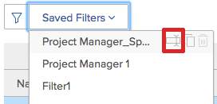

# Visualizza informazioni sull&#39;utilizzo delle risorse

{{highlighted-preview}}

<!--

(NOTE:&nbsp;this is linked to the UI from the Utilization report. ALWAYS keep this information. DO NOT DELETE!!)

-->

È possibile visualizzare l&#39;utilizzo delle risorse utilizzando il rapporto Utilizzo.

<!--

(NOTE: Vazgen's response about these hours ie below and he asked us to NOT document them:

It queries Assignments first to get the tasks, issues, projects to display in the view. And then from those gets the hours.

In some cases, like for Planned Hours, it takes them from Assignments

But Budgeted Hours come from projects.

And Actual Hours are their own object - Hour)

-->

<!--

This report displays information about the assignments on work items for projects in your environment, like Planned, Actual, and Budgeted Hours, FTE, or Cost.&nbsp;These are hours,&nbsp;FTE, or costs associated with the assignments and not with the tasks and issues themselves.(PRIVATE NOTE:&nbsp;Vazgen's response about these hours: It queries Assignments first to get the tasks, issues, projects to display in the view. And then from those gets the hours. In some cases, like for Planned Hours, it takes them from Assignments; But Budgeted Hours come from projects. And Actual Hours are their own object - Hour.)

-->

## Requisiti di accesso

Per accedere al rapporto Utilizzo, è necessario disporre dei seguenti elementi:

<table style="table-layout:auto"> 
 <col> 
 <col> 
 <tbody> 
  <tr> 
   <td role="rowheader">Piano Adobe Workfront*</td> 
   <td> 
Pro o superiore
 </td> 
  </tr> 
  <tr> 
   <td role="rowheader">Licenza Adobe Workfront*</td> 
   <td> 
Piano 
 </td> 
  </tr> 
  <tr> 
   <td role="rowheader">Configurazioni del livello di accesso*</td> 
   <td> 
Accesso di visualizzazione o superiore ai seguenti elementi:
 
    <ul> 
     <li> 
Gestione risorse 
 </li> 
     <li> 
Progetti
 </li> 
     <li> 
Portfolio
 </li> 
     <li> 
Programmi
 </li> 
     <li> 
Dati finanziari se si desidera visualizzare le informazioni in base al costo
 </li> 
    </ul> 
<b>NOTA</b>

Se non disponi ancora dell’accesso, chiedi all’amministratore di Workfront se ha impostato restrizioni aggiuntive nel tuo livello di accesso. Per informazioni su come un amministratore di Workfront può modificare il livello di accesso, consulta <a href="../../administration-and-setup/add-users/configure-and-grant-access/create-modify-access-levels.md" class="MCXref xref">Creare o modificare livelli di accesso personalizzati</a>.
 </td>
</tr> 
  <tr> 
   <td role="rowheader">Autorizzazioni oggetto</td> 
   <td> 
Visualizzare l'accesso a progetti, portfolio e programmi per accedere alla sezione Utilizzo nell'area Risorse
 
  
 
Gestire l’accesso al progetto per accedere alla sezione Utilizzo di un progetto
 
  
 
Per informazioni sulla richiesta di accesso aggiuntivo, consulta <a href="../../workfront-basics/grant-and-request-access-to-objects/request-access.md" class="MCXref xref">Richiedi accesso agli oggetti </a>.
 </td> 
  </tr> 
 </tbody> 
</table>

*Per informazioni sulla pianificazione, il tipo di licenza o l&#39;accesso disponibili, contattare l&#39;amministratore Workfront.

<!--

You must have View access to the projects you want to view utilization information for as described in this section. If you are still unable to access this information, contact your Workfront administrator. (NOTE:&nbsp;replaced with above table)

-->

Nelle sezioni seguenti viene descritto come visualizzare e utilizzare le informazioni sull&#39;utilizzo.

<!--

<h2>Prerequisites for accessing utilization information</h2>

(NOTE: drafted, replaced with above table)

To access utilization information as described in this section, ensure that the following conditions are met:

<ul>
<li>You have at least&nbsp;View access to the project, program, or portfolio for which you want to view the utilization information.</li>
<li>Your Workfront administrator must grant you at least View access to&nbsp;Financial&nbsp;Data in your Access Level to be able to view cost and revenue information in the Utilization report. The Workfront administrator must enable both View Role Billing & Cost Rates as well as View User Billing &&nbsp;Cost Rates when they grant you the View access to Financial Data. For information about granting access to&nbsp;Financial&nbsp;Data, see <a href="../../administration-and-setup/add-users/configure-and-grant-access/grant-access-financial.md" class="MCXref xref">Grant access to financial data</a>. </li>
<li>

(NOTE:&nbsp;drafted. No longer the case.) 

The Utilization tab is included on any layout template that is assigned to you and that is applied to either the projects you view or to the Reporting area. 

The Utilization section is included on any layout template that is assigned to you and that is applied to either the projects you view or to the Resourcing area. 

</li>
<li>

The Utilization tab is available by default in the Reporting area if the system administrator has not assigned a custom layout template to you. 

The Utilization section is available by default in the Resourcing area if the system administrator has not assigned a custom layout template to you. 

</li>
</ul>

-->

## Panoramica del rapporto Utilizzo {#overview-of-the-utilization-report}

Utilizzando il rapporto Utilizzo è possibile visualizzare l&#39;avanzamento, il costo o i ricavi di un progetto, programma o portfolio in un unico rapporto. Puoi anche confrontare i ricavi con i costi.

È possibile visualizzare il rapporto Utilizzo nell&#39;area Risorse per visualizzare l&#39;utilizzo in più progetti oppure a livello di progetto per visualizzare l&#39;utilizzo per le singole risorse (mansioni e utenti) associate al progetto.

Per informazioni sull&#39;accesso e l&#39;utilizzo del rapporto Utilizzo, vedere [Con il rapporto Utilizzo puoi tenere traccia di avanzamento, costi e ricavi](#track-progress-cost-and-revenue-with-the-utilization-report) in questo articolo.

* [Tracciare le ore (avanzamento)](#track-hours-progress)
* [Tracciare il costo](#track-cost)
* [Tracciare i ricavi](#track-revenue)
* [Confronto dei ricavi con i costi pianificati ed effettivi](#compare-revenue-against-planned-and-actual-costs)

### Tracciare le ore (avanzamento) {#track-hours-progress}

Puoi tenere traccia dell’avanzamento visualizzando il confronto tra le ore preventivate e quelle pianificate e le ore effettive.

Quando si tiene traccia dell&#39;avanzamento di un progetto, programma o portfolio, l&#39;avanzamento rispetto alle attività e ai problemi viene incluso nel report Utilizzo.

Quando si tiene traccia delle ore, nel rapporto Utilizzo sono disponibili le seguenti informazioni:

<table style="table-layout:auto"> 
 <col> 
 <col> 
 <thead> 
  <tr> 
   <th><strong>Titolo colonna durante la visualizzazione delle ore</strong> </th> 
   <th><strong>Funzione</strong> </th> 
  </tr> 
 </thead> 
 <tbody> 
  <tr> 
   <td scope="col"><strong>Ore preventivate</strong> </td> 
   <td scope="col"> 
Il totale delle ore preventivate per i progetti inclusi. È possibile visualizzare le ore preventivate totali per l'intera durata dei progetti inclusi oppure le ore preventivate totali solo per l'intervallo di date specificato (è possibile specificare una singola settimana o mese). 
 
Le ore preventivate vengono compilate dalle informazioni disponibili nella nuova area Budget risorse del Business Case o della Programmazione risorse<em>.</em>
 
Le ore preventivate vengono visualizzate nel rapporto Utilizzo in una delle seguenti righe:
 
    <ul> 
     <li> Le ore preventivate vengono riepilogate per mansione e per singolo utente nel rapporto Utilizzo, come segue: <strong>Utente singolo:</strong> Le ore preventivate vengono riepilogate per ciascun utente nel rapporto utilizzo. Queste ore preventivate sono associate alle attività e ai problemi che l’utente è assegnato ai progetti inclusi. È possibile espandere la riga del ruolo corrispondente per visualizzare un elenco di utenti con tale ruolo. <strong>Ruolo:</strong> Le ore preventivate vengono riepilogate in base alla mansione nel rapporto sull'utilizzo. Le ore preventivate vengono visualizzate in una particolare mansione come risultato di uno dei seguenti scenari: 
     <li>Il ruolo è definito come il ruolo principale dell'utente assegnato all'attività o al problema a cui sono associate le ore preventivate. </li> 
       <li>Quando si visualizzano le informazioni sull'utilizzo per un singolo progetto, viene utilizzata la mansione dell'utente a cui sono state assegnate le ore, sia che non vi sia alcuna assegnazione nell'attività o nel problema, che a un altro utente non sia stata assegnata alcuna mansione, che a un altro utente sia stata assegnata una mansione diversa o che sia stato assegnato un altro team.</li> 
       <li>Quando si visualizzano le informazioni sull'utilizzo per diversi progetti, programmi o portfolio, il ruolo dell'utente a cui sono state assegnate le ore viene utilizzato solo quando il ruolo è stato assegnato a un'attività o a un problema in un progetto. </li> 
       <li>La mansione è assegnata all'attività o al problema a cui sono associate le ore preventivate e all'utente assegnato all'attività o al problema non è stata definita una mansione nel sistema.</li> 
      </ul></li> 
    </ul> 
    <ul> 
     <li> 
<strong>Ore non assegnate</strong>: le ore preventivate vengono visualizzate nel rapporto sull’utilizzo nella sezione Ore non assegnate quando le ore preventivate sono associate a un’attività o a un problema e non è stato assegnato alcun utente o ruolo all’attività o al problema. Questa sezione viene visualizzata solo quando il progetto contiene ore corrispondenti a questa descrizione e quando si visualizza il rapporto Utilizzo per o da un progetto. 
 
Questa sezione viene visualizzata solo quando il progetto contiene ore corrispondenti a questa descrizione e quando si visualizza il rapporto Utilizzo per o da un progetto. 
 </li> 
    </ul> 
Per ulteriori informazioni sulle ore preventivate, consulta la sezione "Individuare le ore preventivate di un progetto" nella sezione <a href="../../manage-work/projects/project-finances/budgeted-labor-cost.md" class="MCXref xref">Comprendere il costo manodopera preventivato e le ore preventivate per i progetti</a> articolo.
 </td> 
  </tr> 
  <tr> 
   <td scope="col"><strong>Lavoro Necessario</strong> </td> 
   <td scope="col"> <!-- Yay, no errors, warnings, or alerts! -->

Le ore pianificate sui progetti inclusi che sono associati alle assegnazioni per ogni attività e problema. È possibile visualizzare il totale delle ore pianificate di tutte le assegnazioni del progetto per l'intera durata dei progetti inclusi oppure visualizzare il totale delle ore pianificate solo per l'intervallo di date specificato (è possibile specificare una singola settimana o mese). 

<strong>SUGGERIMENTO </strong>

Le ore pianificate dagli articoli con una durata di 0 non vengono prese in considerazione. 

Le ore pianificate nel rapporto Utilizzo considerano se le ore pianificate sono state riallocate per l'intera durata di un'attività o di un problema. 

Quando l'allocazione giornaliera degli utenti per le ore è stata modificata utilizzando il Bilanciatore dei carichi di lavoro, i dati nel rapporto Utilizzo possono essere interessati se le date selezionate nel rapporto Utilizzo contengono solo una parte della Durata di un'attività o di un problema. 

Per informazioni sulla modifica delle allocazioni per gli utenti, consulta <a href="../workload-balancer/manage-user-allocations-workload-balancer.md">Gestire le allocazioni utente nel Bilanciatore dei carichi di lavoro</a>.

Le ore pianificate vengono visualizzate nel rapporto Utilizzo in una delle seguenti righe:

<ul>

<li>Le ore pianificate vengono riepilogate in base alla mansione e al singolo utente nel rapporto utilizzo, come segue: 
<ul>

<li><strong>Utente singolo</strong>: le ore pianificate vengono riepilogate per ogni utente nel rapporto sull’utilizzo. Queste ore pianificate sono associate alle attività e ai problemi che l’utente è assegnato ai progetti inclusi. È possibile espandere la riga del ruolo corrispondente per visualizzare un elenco di utenti con tale ruolo.

<li><strong>Ruolo</strong>: le ore pianificate vengono riepilogate per ruolo nel rapporto utilizzo di un singolo progetto. Le ore pianificate vengono visualizzate in una particolare mansione come risultato di uno dei seguenti scenari:  
<ul>

<li>Il ruolo è definito come il ruolo principale dell'utente assegnato all'attività o al problema a cui sono associate le ore pianificate.

<li>Quando si visualizzano le informazioni sull'utilizzo per un singolo progetto, le ore associate a una mansione non vengono visualizzate per la mansione nei seguenti scenari:   
<ul>

<li>Nessuna assegnazione per l’attività o il problema

<li>Un utente viene assegnato senza assegnazione di mansioni

<li>Un utente viene assegnato con una mansione diversa

<li>Un team è assegnato all’attività o al problema
</li>   
</ul>

<li>Quando si visualizzano le informazioni sull'utilizzo per diversi progetti, programmi o portfolio, il ruolo dell'utente a cui sono state assegnate le ore viene utilizzato solo quando il ruolo è stato assegnato a un'attività o a un problema in un progetto. Le ore dei ruoli non vengono visualizzate separatamente quando si visualizza il rapporto Utilizzo per più progetti.

<li>La mansione è assegnata all'attività o al problema a cui sono associate le ore pianificate e l'utente assegnato all'attività o al problema non ha una mansione definita nel sistema.
</li>  
</ul>

<li><strong>Ore non assegnate</strong>: le ore pianificate vengono visualizzate nel rapporto sull’utilizzo nella sezione Ore non assegnate quando le ore pianificate sono associate a un’attività o a un problema e non vi sono utenti o ruoli assegnati all’attività o al problema. Questa sezione viene visualizzata solo quando il progetto contiene ore che corrispondono a questa descrizione e quando si visualizza il rapporto Utilizzo per un singolo progetto.  Per ulteriori informazioni sulle ore pianificate, consulta <a href="../../manage-work/tasks/task-information/planned-hours.md">Panoramica sulle ore pianificate</a>.
</li> 
</ul>
</li> 
</ul> </td> 
  </tr> 
  <tr> 
   <td><strong>Lavoro Necessario Reale</strong> </td> 
   <td> 
 Il totale delle ore registrate per attività, problemi, e sul progetto per i progetti inclusi. È possibile visualizzare le ore effettive totali per la durata complessiva dei progetti inclusi oppure le ore effettive totali solo per l'intervallo di date specificato (è possibile specificare una singola settimana o mese). 
 
Avviso: il rapporto sull'utilizzo include le ore registrate nel progetto, le attività figlio, i problemi e le attività padre con almeno un'assegnazione. Non include le ore registrate per le attività padre senza assegnazioni. È consigliabile non utilizzare le attività padre come attività di lavoro e assegnare solo le attività figlio alle risorse. 
 
Le ore effettive vengono visualizzate nel rapporto sull'utilizzo in una delle seguenti righe:
 
    <ul> 
     <li> Le ore effettive vengono riepilogate per mansione e per singolo utente nel rapporto utilizzo di un progetto, come segue: <strong>Utente singolo:</strong> Le ore effettive vengono visualizzate nel rapporto utilizzo nella riga dell’utente che ha registrato le ore. È possibile espandere la riga del ruolo corrispondente per visualizzare un elenco di utenti con tale ruolo che hanno registrato ore. <strong>Ruolo:</strong> Le ore effettive registrate dagli utenti associati a tali ruoli vengono riepilogate nel rapporto utilizzo nella riga del ruolo corrispondente. Le ore effettive vengono visualizzate in una particolare mansione come risultato di uno dei seguenti scenari: 
      <ul> 
       <li>Il ruolo è definito come il ruolo principale dell’utente che ha registrato le ore.</li> 
       <li>Nessuna assegnazione per l’attività o il problema</li> 
       <li>A un altro utente non è stata assegnata alcuna mansione</li> 
       <li>A un altro utente viene assegnata una mansione diversa</li> 
       <li> 
Viene assegnato un team.
 </li> 
      </ul></li>  
     
Se l’utente che registra le ore non ha una mansione associata al suo profilo, la mansione utilizzata per il rapporto Utilizzo è la mansione assegnata all’attività o al problema in cui vengono registrate le ore o la mansione associata al proprietario principale dell’attività o del problema. 
 
     <li><strong>Altre ore:</strong> Le ore effettive vengono visualizzate nel rapporto utilizzo nella sezione Altre ore, nella riga dell’utente che ha effettuato l’accesso. Le ore vengono visualizzate in questa sezione quando l’utente che ha effettuato l’accesso non ha una mansione definita nel sistema. Questa sezione viene visualizzata solo se il progetto contiene ore corrispondenti a questa descrizione. </li> 
    </ul> </td> 
  </tr> 
  <tr> 
   <td><strong>Variazione preventivata (per ore)</strong> </td> 
   <td> 
Il totale delle ore preventivate meno il totale delle ore effettive sui progetti inclusi. È possibile visualizzare lo scostamento totale preventivato per la durata complessiva dei progetti inclusi oppure lo scostamento totale preventivato solo per l'intervallo di date specificato (è possibile specificare una singola settimana o mese). 
 
Se il valore è positivo, viene visualizzato in verde. Questo indica che il totale delle ore preventivate è maggiore delle ore effettive.
 
Se il valore è negativo, viene visualizzato in rosso. Ciò indica che il totale delle ore preventivate è inferiore alle ore effettive.
 
  
 </td> 
  </tr> 
  <tr> 
   <td><strong>Varianza pianificata (per ore)</strong> </td> 
   <td> 
Il totale delle ore pianificate meno il totale delle ore effettive sui progetti inclusi. È possibile visualizzare lo scostamento pianificato totale per la durata complessiva dei progetti inclusi oppure lo scostamento pianificato totale solo per l'intervallo di date specificato (è possibile specificare una singola settimana o mese).
 
Se il valore è positivo, viene visualizzato in verde. Ciò indica che il totale delle ore pianificate è maggiore delle ore effettive.
 
Se il valore è negativo, viene visualizzato in rosso. Ciò indica che il totale delle ore pianificate è inferiore alle ore effettive.
 </td> 
  </tr> 
 </tbody> 
</table>

### Tracciare il costo {#track-cost}

È possibile tenere traccia dei costi visualizzando il confronto tra il Costo preventivato e il Costo pianificato e i Costi effettivi.

Quando si tiene traccia del costo di un progetto, programma o portfolio, le informazioni contenute nel rapporto Utilizzo provengono dalle attività. Le informazioni sui costi delle attività sono sempre disponibili nel rapporto Utilizzo. Il costo delle attività viene calcolato in base al tipo di costo dell&#39;attività. Per informazioni sul tipo di costo dei task, vedere &quot;Modificare i tipi di costo per i singoli task&quot; in [Tracciare i costi](../../manage-work/projects/project-finances/track-costs.md).

È possibile visualizzare le informazioni sui costi nel rapporto Utilizzo nei modi seguenti:

* Per una determinata settimana o mese oppure per il progetto, il programma o il portfolio complessivo.
* Per ruolo o per singolo, per i progetti.

La valuta utilizzata nel report sull&#39;utilizzo è determinata dalla valuta impostata nel progetto. Per informazioni sulla modifica della valuta per un progetto, consulta [Modificare la valuta del progetto](../../manage-work/projects/project-finances/change-project-currency.md).

Quando si tiene traccia di Costo, nel rapporto Utilizzo sono disponibili le seguenti informazioni:

<table style="table-layout:auto"> 
 <col> 
 <col> 
 <thead> 
  <tr> 
   <th><strong>Titolo colonna durante la visualizzazione del costo</strong> </th> 
   <th> 
<strong>Funzione</strong> 
 </th> 
  </tr> 
 </thead> 
 <tbody> 
  <tr> 
   <td scope="col"><strong>Bdg prv</strong> </td> 
   <td scope="col"> 
Costo preventivato dei progetti inclusi. È possibile visualizzare il costo preventivato totale per l'intera durata dei progetti inclusi oppure il costo preventivato totale solo per l'intervallo di date specificato (è possibile specificare una singola settimana o mese).
 
Poiché il costo preventivato nel rapporto Utilizzo è incentrato sul costo per ruolo, il calcolo è identico al costo manodopera preventivato in altre aree di Workfront. Per informazioni sulle modalità di calcolo del costo manodopera preventivato, vedere <a href="../../manage-work/projects/project-finances/budgeted-labor-cost.md" class="MCXref xref">Comprendere il costo manodopera preventivato e le ore preventivate per i progetti</a>.
 </td> 
  </tr> 
  <tr> 
   <td scope="col"><strong>Costo Pianificato</strong> </td> 
   <td scope="col"> 
Costo pianificato totale dei progetti inclusi. È possibile visualizzare il Costo pianificato totale per l'intera durata dei progetti inclusi oppure il Costo pianificato totale solo per l'intervallo di date specificato (è possibile specificare una singola settimana o mese).
 
Si noti che per le visualizzazioni settimana, mese e trimestre, i costi pianificati vengono calcolati come media del periodo scelto quando i tassi di costo per mansioni o utenti sono validi per la data.

Per informazioni sulle modalità di calcolo del costo pianificato per il progetto, vedere la sezione "Modalità di calcolo dei costi pianificati, preventivati ed effettivi in Workfront" nell'articolo <a href="../../manage-work/projects/project-finances/track-costs.md" class="MCXref xref">Tracciare i costi</a>.
 </td> 
  </tr> 
  <tr> 
   <td scope="col"><strong>Costo Reale</strong> </td> 
   <td scope="col"> 
Costo effettivo totale dei progetti inclusi. È possibile visualizzare il Costo effettivo totale per l'intera durata dei progetti inclusi oppure il Costo effettivo totale solo per l'intervallo di date specificato (è possibile specificare una singola settimana o mese).
 
Per informazioni sulle modalità di calcolo del costo effettivo del progetto, vedere la sezione "Modalità di calcolo dei costi pianificati, preventivati ed effettivi in Workfront" nell'articolo <a href="../../manage-work/projects/project-finances/track-costs.md" class="MCXref xref">Tracciare i costi</a>.
 </td> 
  </tr> 
  <tr> 
   <td><strong>Scostamento preventivato (per costo)</strong> </td> 
   <td scope="col"> 
Costo preventivato totale meno il Costo effettivo totale dei progetti inclusi. È possibile visualizzare lo scostamento totale preventivato per la durata complessiva dei progetti inclusi oppure lo scostamento totale preventivato solo per l'intervallo di date specificato (è possibile specificare una singola settimana o mese).
 
Se il valore è positivo, viene visualizzato in verde. Indica che il costo preventivato totale è maggiore del costo effettivo.
 
Se il valore è negativo, viene visualizzato in rosso. Ciò indica che il costo preventivato totale è inferiore al costo effettivo.
 </td> 
  </tr> 
  <tr> 
   <td><strong>Varianza pianificata (per costo)</strong> </td> 
   <td> 
Costo pianificato totale meno il costo effettivo totale dei progetti inclusi. È possibile visualizzare lo scostamento pianificato totale per la durata complessiva dei progetti inclusi oppure lo scostamento pianificato totale solo per l'intervallo di date specificato (è possibile specificare una singola settimana o mese). 
 
Se il valore è positivo, viene visualizzato in verde. Ciò indica che il costo pianificato totale è maggiore del costo effettivo.
 
Se il valore è negativo, viene visualizzato in rosso. Ciò indica che il costo pianificato totale è inferiore al costo effettivo.
 </td> 
  </tr> 
 </tbody> 
</table>

### Tracciare i ricavi {#track-revenue}

È possibile tenere traccia dei ricavi visualizzando il confronto tra i ricavi preventivati e pianificati e i ricavi effettivi.

Quando si tiene traccia dei ricavi di un progetto, programma o portfolio, nel rapporto Utilizzo vengono inclusi solo i ricavi derivanti dalle attività.

Le informazioni riportate nella tabella seguente sono disponibili nel rapporto Utilizzo quando si tiene traccia dei ricavi.

Per informazioni sui campi specifici e sul modo in cui Workfront li calcola, vedi anche i seguenti articoli:

* [Tracciare i costi](../../manage-work/projects/project-finances/track-costs.md)
* [Panoramica su fatturazione e ricavi](../../manage-work/projects/project-finances/billing-and-revenue-overview.md)

<table style="table-layout:auto"> 
 <col> 
 <col> 
 <thead> 
  <tr> 
   <th><strong>Titolo colonna durante la visualizzazione dei ricavi</strong> </th> 
   <th> <strong>Funzione</strong></th> 
  </tr> 
 </thead> 
 <tbody> 
  <tr> 
   <td scope="col"><strong>Retribuzioni preventivate</strong> </td> 
   <td scope="col"> 
Le ore preventivate totali moltiplicate per la tariffa di fatturazione del ruolo sui progetti inclusi. È possibile visualizzare i ricavi preventivati totali per l'intera durata dei progetti inclusi oppure i ricavi preventivati totali solo per l'intervallo di date specificato (è possibile specificare una singola settimana o mese).
 </td> 
  </tr> 
  <tr> 
   <td scope="col"><strong>Reddito Pianificato</strong> </td> 
   <td scope="col"> 
Ricavi pianificati nel rapporto Utilizzo indica i ricavi associati alle ore pianificate assegnati alle risorse assegnate alle attività del progetto.
 
Workfront calcola la Retribuzione pianificata del progetto per il rapporto Utilizzo utilizzando la formula seguente:
 
<code>Project Planned Revenue = SUM&nbsp;(All Tasks Planned Revenue)</code> 
 
   
<b>NOTA</b>
   
Il campo Retribuzione pianificata del progetto visualizzato nel rapporto Utilizzo è diverso dal campo Retribuzione pianificata visualizzato nell'area Dettagli progetto e nei rapporti del progetto. 
 
La Retribuzione pianificata nell'area Dettagli progetto riflette le entrate dell'attività e le Retribuzioni fisse del progetto. Nel rapporto Utilizzo della voce Retribuzione pianificata viene visualizzata la Retribuzione pianificata associata solo alle attività del progetto. 
 
     
Example: </b>">  
      
Se il progetto ha 1 attività con 10 ore, assegnata a un consulente con una tariffa oraria di 20 $ e il progetto ha un reddito fisso di 100 $, il rapporto Utilizzo visualizza 200 $ per il reddito pianificato (il reddito pianificato associato alle ore dell'attività). La sezione Dettagli progetto visualizza $ 300 (la Retribuzione pianificata dall'attività e la Retribuzione fissa per il progetto). 
 
     
 
Per ulteriori informazioni sull'attività e sul ricavo pianificato del progetto al di fuori del rapporto Utilizzo, vedere <a href="../../manage-work/projects/project-finances/billing-and-revenue-overview.md" class="MCXref xref">Panoramica su fatturazione e ricavi</a>.
 
 
Il modo in cui il rapporto Utilizzo calcola e visualizza la Retribuzione pianificata per i progetti inclusi tiene conto del Tipo di retribuzione impostato sull'attività. 
 
A seconda del tipo di retribuzione di ogni attività del progetto, esistono i seguenti scenari: 
 
<strong>Reddito Fisso:</strong> Indipendentemente dalle assegnazioni dell'attività, i ricavi relativi all'attività vengono sempre calcolati utilizzando l'importo fisso specificato per l'attività.
 
<b>IMPORTANTE</b>

A differenza di altre aree di Workfront, il rapporto Utilizzo calcola la Retribuzione pianificata per le attività Retribuzione fissa dividendo in modo uniforme la Retribuzione fissa per il numero di Ore pianificate per l&#39;attività. 
 
Ad esempio, un&#39;attività ha un ricavo di 200 $. Se l&#39;attività prevede 4 ore pianificate, ogni ora corrisponderebbe a 50 $. Viene distribuito a livello di utente e ruolo. Questa distribuzione è univoca per il rapporto Utilizzo.
 
<b>NOTA</b>

Se si dispone di un&#39;attività Retribuzioni fisse e non sono presenti ore pianificate per l&#39;attività, la Retribuzione non viene visualizzata nel rapporto Utilizzo perché non è possibile distribuirla alle ore. Se sono presenti ore pianificate per attività con retribuzione fissa e nessuna assegnazione, la retribuzione viene visualizzata come retribuzione non allocata. 
 
<strong>Ore Ruolo:</strong> I ricavi sull&#39;attività vengono calcolati utilizzando la tariffa di fatturazione impostata per un ruolo specifico, moltiplicata per il numero di ore pianificate associate a tale ruolo. Workfront utilizza la seguente formula:
 
<code>Retribuzione oraria pianificata per il ruolo = SUM(Planned Hours from role on all tasks) * Tariffa fatturazione per il ruolo</code>

<b>NOTA:</b> La tariffa oraria di fatturazione nella formula considera eventuali modifiche effettive alla data della tariffa.
   
<strong>Ore utente:</strong> I ricavi sull&#39;attività vengono calcolati utilizzando la tariffa di fatturazione impostata per un utente specifico, moltiplicata per il numero di ore pianificate associate a tale utente. Workfront utilizza la seguente formula:
 
<code>Retribuzione oraria pianificata utente = SOMMA (le ore pianificate dagli utenti su tutte le attività) * Tariffa di fatturazione utente</code> 
 
<b>NOTA:</b> La tariffa oraria di fatturazione nella formula considera eventuali modifiche effettive alla data della tariffa.
 
<b>Ore Ruolo o Ore Utente più Fisso</b> 
 
<b>IMPORTANTE</b>

A differenza di altre aree di Workfront, il rapporto Utilizzo calcola la Retribuzione pianificata dividendo uniformemente la Retribuzione fissa per il numero di Ore pianificate per l&#39;attività. 
 
Esistono i seguenti casi: 

<ul>
<li> 
<strong>Ore Ruolo più Fisso:</strong> I ricavi per l&#39;attività vengono calcolati utilizzando la tariffa di fatturazione impostata per un ruolo specifico, moltiplicata per il numero di ore pianificate associate al ruolo. Al tasso di ruolo viene inoltre aggiunto un importo fisso specificato per l&#39;attività. Workfront utilizza la seguente formula:
 
<code>Ore Ruolo più Reddito Pianificato Fisso = [SUM(Lavoro Necessario dal Ruolo su tutte le Attività) * Tariffa di Fatturazione Ruolo] + SOMMA(Limite o importo fisso dell&#39;attività / Ore pianificate dell&#39;attività)</code> 
 </li>
</ul>
<ul>
<li> 
<strong>Ore Utente Più Fisso:</strong> Tariffa di fatturazione impostata per un utente specifico, moltiplicata per il numero di ore pianificate per l&#39;attività da parte di tale utente. Alla tariffa utente viene inoltre aggiunto un importo fisso specificato per l&#39;attività. Workfront utilizza la seguente formula:
 
<code>Ore Utente Più Reddito Pianificato Fisso = [SUM(Ore pianificate dall&#39;utente su tutte le attività) * Tariffa di fatturazione utente] + SOMMA(Limite o importo fisso dell&#39;attività / Ore pianificate dell&#39;attività)</code> 
 </li>
</ul> 
<b>Ore Ruolo o Utente con Limite</b> 
 
<b>IMPORTANTE</b>

A differenza di altre aree di Workfront, se la Retribuzione pianificata supera il limite, l&#39;importo oltre l&#39;Importo limite è considerato Reddito fisso. La Retribuzione pianificata viene calcolata dividendo equamente la Retribuzione fissa per il numero di Ore pianificate per l&#39;attività, quindi aggiungendo l&#39;Importo limite e la Retribuzione oraria per ruolo o utente.  
 
Esistono i seguenti casi: 

<ul>
<li> 
<strong>Ore Ruolo w/Cap:</strong> Le attività vengono fatturate su base oraria come in Ore ruolo, ma hanno un importo massimo che puoi specificare. Workfront utilizza la seguente formula:
 
<code>Ore Ruolo con Ricavo Pianificato Limite = [SUM(Lavoro Necessario dal Ruolo su tutte le Attività e Issues) * Tasso di Fatturazione Ruolo] + Importo limite dell&#39;attività + SOMMA (Importo oltre l&#39;Importo limite / Ore pianificate dell&#39;attività)</code> 
 </li>
</ul>
<ul>
<li> 
<strong>Ore Utente w/Cap:</strong> Le attività vengono fatturate su base oraria come in Ore utente, ma hanno un massimale che puoi specificare. Workfront utilizza la seguente formula: 
 
<code>Ore Utente w/ Cap Reddito Pianificato = [SUM(Ore pianificate dall&#39;utente su tutte le attività) * Tariffa di fatturazione utente] + Importo limite dell&#39;attività + SOMMA (Importo oltre l&#39;Importo limite / Ore pianificate dell&#39;attività)</code> 
 </li>
</ul> 
Per ulteriori informazioni su quale ruolo o utente viene preso in considerazione durante il calcolo della Retribuzione Pianificata, vedi <a href="../../manage-work/projects/project-finances/billing-and-revenue-overview.md" class="MCXref xref">Panoramica su fatturazione e ricavi</a>.
 </td>
</tr> 
  <tr> 
   <td><strong>Reddito Reale</strong> </td> 
   <td> 
Il reddito effettivo è il reddito associato alle ore effettive delle attività e del progetto. Per ulteriori informazioni sui ricavi effettivi, consulta la sezione "Tracciare gli importi dei ricavi" nell’articolo <a href="../../manage-work/projects/project-finances/billing-and-revenue-overview.md" class="MCXref xref">Panoramica su fatturazione e ricavi</a>.

Il modo in cui il rapporto Utilizzo calcola la Retribuzione effettiva per i progetti inclusi varia a seconda del tipo di retribuzione impostato per l'attività, come illustrato di seguito.
 
<strong>Reddito Fisso:</strong> Indipendentemente dalle assegnazioni dell'attività, i ricavi relativi all'attività vengono sempre calcolati utilizzando l'importo fisso specificato per l'attività.
 
<b>IMPORTANTE</b>

A differenza di altre aree di Workfront, il rapporto Utilizzo calcola i Ricavi effettivi dividendo uniformemente i Ricavi fissi per il numero di ore registrate sull&#39;attività. 
 
 
 
Ad esempio, un&#39;attività ha un reddito effettivo di 200 dollari. Se l&#39;attività contiene 4 ore effettive, ogni ora corrisponderebbe a 50 $. Viene distribuito a livello di utente e ruolo. Questa distribuzione è univoca per il rapporto Utilizzo.
 
<b>NOTA</b>

Se si dispone di un&#39;attività Reddito fisso e non sono presenti ore effettive sull&#39;attività, la retribuzione effettiva non viene visualizzata nel rapporto Utilizzo perché non è possibile distribuire le ore. 
 
<strong>Ore Ruolo:</strong> I ricavi dell&#39;attività vengono calcolati utilizzando la tariffa di fatturazione impostata per un ruolo specifico, moltiplicata per il numero di ore effettive.
 
Workfront utilizza la seguente formula:
 
<code>Ore Ruolo Reddito Reale = SOMMA (Ore Reali dal Ruolo su tutte le Attività) * Tariffa di Fatturazione Ruolo</code> 
 
<b>NOTA:</b> La tariffa oraria di fatturazione nella formula considera eventuali modifiche effettive alla data della tariffa.
 
<strong>Ore utente:</strong> I ricavi sull&#39;attività vengono calcolati utilizzando la tariffa di fatturazione impostata per un utente specifico, moltiplicata per il numero di ore registrate per l&#39;attività da tale utente. Workfront utilizza la seguente formula:
 
<code>Retribuzione effettiva oraria utente = SUM(Ore effettive dall&#39;utente su tutte le attività) * Tariffa di fatturazione utente</code>
 
<b>NOTA:</b> La tariffa oraria di fatturazione nella formula considera eventuali modifiche effettive alla data della tariffa.
 
<b>Ore Ruolo o Utente più Fisso</b> 
 
<b>IMPORTANTE</b>

A differenza di altre aree di Workfront, il rapporto Utilizzo calcola i Ricavi effettivi dividendo uniformemente i Ricavi fissi per il numero di ore registrate sull&#39;attività. 
 
Esistono i seguenti casi: 

<ul>
<li> 
<strong>Ore Ruolo più Fisso:</strong> Tariffa di fatturazione impostata per un ruolo specifico, moltiplicata per il numero di ore registrate per l’attività da un utente con quel ruolo. Al tasso di ruolo viene inoltre aggiunto un importo fisso specificato per l&#39;attività. 
 
Workfront utilizza la seguente formula:
 
<code>Ore Ruolo più Reddito Reale Fisso = [SUM(Ore effettive dalla mansione per tutte le attività) * Tariffa di fatturazione mansione] + SOMMA(Limite o importo fisso dell&#39;attività / Ore effettive dell&#39;attività)</code> 
 </li>
</ul>
<ul>
<li> 
<strong>Ore Utente Più Fisso:</strong> Tariffa di fatturazione impostata per un utente specifico, moltiplicata per il numero di ore registrate per l’attività da tale utente. Alla tariffa utente viene inoltre aggiunto un importo fisso specificato per l&#39;attività. 
 
Workfront utilizza la seguente formula:
 
<code>Ore Utente Più Reddito Fisso Reale = [SUM(Ore effettive dal ruolo per tutte le attività) * Tariffa di fatturazione utente] + SUM(Limite o importo fisso dell&#39;attività / Ore utente dell&#39;attività)</code> 
 </li>
</ul> 
<b>Ore Ruolo o Utente con Limite</b> 
 
<b>IMPORTANTE</b>

A differenza di altre aree di Workfront, se la Retribuzione pianificata supera il limite, l&#39;importo oltre l&#39;Importo limite è considerato Reddito fisso. La Retribuzione pianificata viene calcolata dividendo equamente la Retribuzione fissa per il numero di Ore pianificate per l&#39;attività, quindi aggiungendo l&#39;Importo limite e la Retribuzione oraria per ruolo o utente.  
 
Esistono i seguenti scenari:

<ul>
<li> 
<strong>Ore Ruolo w/Cap:</strong> Le attività vengono fatturate su base oraria come in Ore ruolo, ma hanno un importo massimo che puoi specificare. Workfront utilizza la seguente formula:
 
<code>Ore Ruolo con Cap Reddito Reale = [SUM(Ore effettive dalla mansione per tutte le attività e le Issues) * Tariffa di fatturazione mansione] + Importo limite del task + SOMMA (importo oltre l&#39;importo limite / ore effettive del task)</code>
 </li>
</ul>
<ul>
<li> 
<strong>Ore Utente w/Cap:</strong> Le attività vengono fatturate su base oraria come in Ore utente, ma hanno un massimale che puoi specificare.
 
 Workfront utilizza la seguente formula:
 
<code>Ore Utente w/ Cap Reddito Reale = [SUM(Ore effettive dal ruolo per tutte le attività e le Issues) * Tariffa di fatturazione utente] + Importo limite del task + SOMMA (importo oltre l&#39;importo limite / ore effettive del task)</code> 
 </li>
</ul>

<strong>Reddito Progetto</strong>: i ricavi associati alle ore registrate nel progetto vengono calcolati tenendo conto della quantità di Fatturazione ad Ore della mansione principale dell’utente che registra l’ora. Si sconsiglia di registrare il tempo sul progetto. 

<b>NOTA</b>

Se l&#39;utente non è associato a una mansione o se la Fatturazione ad Ore del Ruolo Principale è zero, Workfront calcola la Retribuzione Effettiva utilizzando l&#39;importo della Fatturazione ad Ore per l&#39;utente. Se l&#39;utente non ha un importo di Fatturazione ad Ore nel suo profilo, il Reddito Reale è zero. 

 </td>
</tr> 
  <tr> 
   <td><strong>Variazione preventivata (per ricavi)</strong> </td> 
   <td> 
Ricavo effettivo totale meno Ricavo preventivato sui progetti inclusi. È possibile visualizzare lo scostamento totale preventivato per la durata complessiva dei progetti inclusi oppure lo scostamento totale preventivato solo per l'intervallo di date specificato (è possibile specificare una singola settimana o mese).
 
Se il valore è positivo, viene visualizzato in verde. Ciò indica che il totale delle entrate preventivate è maggiore del reddito effettivo.
 
Se il valore è negativo, viene visualizzato in rosso. Ciò indica che il totale dei ricavi preventivati è inferiore al reddito effettivo.
 </td> 
  </tr> 
  <tr> 
   <td><strong>Varianza pianificata (per ricavo)</strong> </td> 
   <td> 
Ricavo effettivo totale meno Ricavo pianificato totale sui progetti inclusi. È possibile visualizzare lo scostamento pianificato totale per la durata complessiva dei progetti inclusi oppure lo scostamento pianificato totale solo per l'intervallo di date specificato (è possibile specificare una singola settimana o mese). 
 
Se il valore è positivo, viene visualizzato in verde. Questo indica che la Retribuzione pianificata totale è maggiore della Retribuzione effettiva.
 
Se il valore è negativo, viene visualizzato in rosso. Ciò indica che la Retribuzione pianificata totale è inferiore alla Retribuzione effettiva.
 </td> 
  </tr> 
 </tbody> 
</table>

<!--Note from the table about Actual revenue: 
     
Actual Revenue is displayed in the Utilization report only after the task is marked as Complete or Done (or a status that equates with Complete).

    -->

<!--More notes from the table: 
     
(NOTE:&nbsp;the note below is duplicated in this article: /Content/Manage work/Projects/Project Finances/billing-and-revenue-overview.html and in the glossary)

   -->

### Confronto dei ricavi con i costi pianificati ed effettivi {#compare-revenue-against-planned-and-actual-costs}

Puoi visualizzare il Costo pianificato o effettivo insieme alla Retribuzione pianificata. Viene inoltre visualizzato il margine (%), che viene calcolato come Ricavo - Costo / Ricavo.

Nel rapporto Utilizzo sono disponibili le seguenti informazioni quando si confrontano i ricavi con i costi pianificati e i costi effettivi:

<table style="table-layout:auto"> 
 <col> 
 <col> 
 <thead> 
  <tr> 
   <th><strong>Titolo colonna durante la visualizzazione di ricavi e costi (pianificato)</strong> </th> 
   <th> <strong>Funzione</strong></th> 
  </tr> 
 </thead> 
 <tbody> 
  <tr> 
   <td scope="col"><strong>Costo Pianificato</strong> </td> 
   <td scope="col"> Costo pianificato totale dei progetti inclusi. È possibile visualizzare il Costo pianificato totale per l'intera durata dei progetti inclusi oppure il Costo pianificato totale solo per l'intervallo di date specificato (è possibile specificare una singola settimana o mese). </td> 
  </tr> 
  <tr> 
   <td scope="col"><strong>Reddito Pianificato</strong> </td> 
   <td scope="col"> 
Retribuzione pianificata indica le entrate associate alle ore pianificate delle attività. 
 
Il modo in cui il rapporto Utilizzo calcola e visualizza la Retribuzione pianificata per i progetti inclusi varia a seconda del Tipo di retribuzione impostato per l'attività, come descritto nella <a href="#track-revenue" class="MCXref xref">Tracciare i ricavi</a> in questo articolo.
 </td> 
  </tr> 
  <tr> 
   <td scope="col"><strong>Margine</strong> </td> 
   <td scope="col"> 
La percentuale del margine viene calcolata nel modo seguente:
 
<code>Planned Revenue - Planned Cost / Planned Revenue * 100. </code>
 
<b>NOTA</b>

Se Reddito pianificato è uguale a 0, il margine viene visualizzato come 0. 
 </td>
</tr> 
  <tr> 
   <td scope="col"> 
<strong>Titolo colonna durante la visualizzazione di ricavi e costi (effettivo)</strong> 
  </td> 
   <td scope="col">
<strong>Funzione</strong>
</td> 
  </tr> 
  <tr> 
   <td scope="col"><strong>Costo Reale</strong> </td> 
   <td scope="col"> 
Costo effettivo totale dei progetti inclusi. È possibile visualizzare il Costo effettivo totale per l'intera durata dei progetti inclusi oppure il Costo effettivo totale solo per l'intervallo di date specificato (è possibile specificare una singola settimana o mese).
 </td> 
  </tr> 
  <tr> 
   <td scope="col"><strong>Reddito Reale</strong> </td> 
   <td> 
Ricavi effettivi sono i ricavi associati alle ore effettive delle attività.
 
Nel rapporto Uso i ricavi effettivi vengono visualizzati solo dopo che l'attività è stata contrassegnata come Completata o Completata (oppure dopo uno stato che equivale a Completata).
 
Il modo in cui il rapporto Utilizzo calcola la retribuzione effettiva per i progetti inclusi varia a seconda del tipo di retribuzione impostato per l'attività, come descritto nella <a href="#track-revenue" class="MCXref xref">Tracciare i ricavi</a> in questo articolo. 
 </td> 
  </tr> 
  <tr> 
   <td scope="col"><strong>Margine</strong> </td> 
   <td> 
La percentuale del margine viene calcolata nel modo seguente:
 
Ricavi effettivi - Costo effettivo / Ricavi effettivi * 100. 
 
<b>NOTA</b>

Se la retribuzione effettiva è uguale a 0, il margine viene visualizzato come 0. 
 </td>
</tr> 
 </tbody> 
</table>

<!--Note from the table from above "Function" header in the middle of the table; right after the "Planned Revenue"/"Margin" definition: 
     
(NOTE: This needs to be either split in two tables of formatted differently)

    -->

## Con il rapporto Utilizzo puoi tenere traccia di avanzamento, costi e ricavi {#track-progress-cost-and-revenue-with-the-utilization-report}

È possibile tenere traccia dell&#39;avanzamento o del costo di un progetto, programma o portfolio.

È possibile visualizzare informazioni sul rapporto Utilizzo per una data settimana o mese oppure per l&#39;intera durata dei progetti.

Per tenere traccia dell&#39;avanzamento o del costo di uno o più progetti con un rapporto Utilizzo:

1. Eseguire una delle operazioni seguenti, a seconda che si visualizzino le informazioni sull&#39;utilizzo per un singolo progetto, più progetti, un programma o un portfolio:

   * Per visualizzare le informazioni sull&#39;utilizzo per un singolo progetto:

      1. Vai a un progetto per il quale vuoi visualizzare le informazioni sull’utilizzo, quindi fai clic su **Mostra altro> Utilizzo**.
      1. Le informazioni sull’utilizzo vengono visualizzate automaticamente quando si visualizza un singolo progetto e non è necessario applicare un filtro.\
         Per filtrare il rapporto Utilizzo, puoi applicare un filtro e fare clic su **Esegui**.\
         Per informazioni su come filtrare il rapporto Utilizzo, vedere la sezione [Filtra informazioni sull’utilizzo](#filter-utilization-information) in questo articolo.\
         Le informazioni sull&#39;utilizzo vengono visualizzate per singoli utenti e ruoli (gli utenti sono raggruppati all&#39;interno del ruolo associato).

   * Per visualizzare le informazioni sull&#39;utilizzo per più progetti:

      1. Fai clic su **Menu principale** icona  nell’angolo superiore destro di Workfront, quindi fai clic su **Risorse**, quindi **Utilizzo** nel pannello a sinistra.
      1. Applicare un filtro al rapporto Utilizzo, quindi fare clic su **Esegui**.\
         È necessario specificare uno o più progetti nel filtro prima di eseguire il rapporto Utilizzo. Per informazioni su come filtrare il rapporto Utilizzo, vedere la sezione [Filtra informazioni sull’utilizzo](#filter-utilization-information) in questo articolo.\
         Le informazioni sull’utilizzo vengono visualizzate per singoli ruoli e progetti (i ruoli sono raggruppati all’interno del progetto associato).

   * Per visualizzare le informazioni sull&#39;utilizzo di un programma:

      1. Fai clic su **Menu principale** icona  nell’angolo superiore destro di Workfront, quindi fai clic su **Risorse**, quindi **Utilizzo** nel pannello a sinistra e fai clic su **Spettacolo**>**Programmi**.
      1. Applicare un filtro al rapporto Utilizzo, quindi fare clic su **Esegui**.\
         Prima di eseguire il rapporto Utilizzo, è necessario specificare uno o più programmi nel filtro. Per informazioni su come filtrare il rapporto Utilizzo, vedere la sezione [Filtra informazioni sull’utilizzo](#filter-utilization-information) in questo articolo.\
         Le informazioni sull&#39;utilizzo vengono visualizzate per i singoli progetti e programmi (i progetti sono raggruppati nel relativo programma associato).

   * Per visualizzare le informazioni sull&#39;utilizzo per un portfolio:

      1. Fai clic su **Menu principale** icona  nell’angolo superiore destro di Workfront, quindi fai clic su **Risorse**, quindi **Utilizzo** nel pannello a sinistra e fai clic su **Spettacolo**>**Portfoli**.
      1. Applicare un filtro al rapporto Utilizzo, quindi fare clic su **Esegui**.\
         È necessario specificare uno o più portfolio nel filtro prima di eseguire il rapporto Utilizzo. Per informazioni su come filtrare il rapporto Utilizzo, vedere la sezione [Filtra informazioni sull’utilizzo](#filter-utilization-information) in questo articolo.\
         Le informazioni sull&#39;utilizzo vengono visualizzate per singoli progetti, programmi e portafogli (i progetti sono raggruppati all&#39;interno del programma associato e i programmi sono raggruppati all&#39;interno del portfolio associato).

1. Nell&#39;angolo superiore destro del rapporto Utilizzo fare clic sul pulsante **Visualizza** menu a discesa, quindi selezionare una delle opzioni seguenti:

   * **Costo**
   * **Ore**
   * **Ricavi**
   * **Ricavi - Costi (pianificato)**
   * **Ricavi - Costi (effettivo)**.

   L&#39;opzione selezionata determina le colonne e le informazioni disponibili nel rapporto. Per ulteriori dettagli sulle informazioni disponibili in ciascuna colonna, vedere la tabella al punto 5.\
   

1. (Facoltativo) Selezionare l&#39;intervallo di date per il quale vengono visualizzate le informazioni sull&#39;utilizzo. È possibile visualizzare le informazioni per una data settimana o mese a sinistra del **Complessivo** colonna. Le informazioni relative al progetto, al programma o al portfolio generale vengono sempre visualizzate nel **Complessivo** colonna.\
   Per ulteriori informazioni, consulta la sezione [Regola l’intervallo di date per il quale vengono visualizzate le informazioni](#adjust-the-date-range-for-which-information-is-displayed) in questo articolo.

1. (Facoltativo) Fai clic sul titolo di una colonna per ordinare il rapporto sull’utilizzo in base alle informazioni contenute in tale colonna. L&#39;ordinamento funziona solo quando si includono più elementi nel report. Ad esempio, puoi ordinare i risultati del rapporto quando stai esaminando più di un progetto (o portfolio o programma). Non è possibile ordinare i risultati quando si esamina un solo progetto (o un portfolio o un programma) alla volta.
1. Utilizza le informazioni nella sezione [Panoramica del rapporto Utilizzo](#overview-of-the-utilization-report) in questo articolo per informazioni su ogni colonna nel rapporto Utilizzo.

## Filtra informazioni sull’utilizzo {#filter-utilization-information}

Puoi filtrare il contenuto visualizzato in un rapporto Utilizzo su un progetto. Puoi filtrare per attività, problemi, ruoli e dati personalizzati. Quando si applica un filtro al rapporto Utilizzo, il rapporto Utilizzo contiene informazioni basate sui criteri selezionati.

Puoi creare un filtro o applicarne uno creato in precedenza.

* [Creare o modificare un filtro](#create-or-modify-a-filter)
* [Applicare un filtro salvato](#apply-a-saved-filter)
* [Duplicare un filtro](#duplicate-a-filter)
* [Rinominare un filtro](#rename-a-filter)
* [Eliminare un filtro](#delete-a-filter)

### Creare o modificare un filtro {#create-or-modify-a-filter}

Quando crei un filtro, anche tutti gli utenti di Workfront che hanno accesso al rapporto Utilizzo hanno accesso al filtro creato. Analogamente, quando si modifica un filtro esistente, il filtro viene modificato per tutti gli utenti che hanno accesso al rapporto Utilizzo.

Per creare o modificare un filtro:

1. Per filtrare le informazioni sull’utilizzo per un singolo progetto, passa al progetto per il quale vuoi filtrare le informazioni sull’utilizzo, quindi fai clic su **Mostra altro>Utilizzo** nel pannello a sinistra.

   Oppure

   Per filtrare le informazioni sull’utilizzo per più progetti, per un programma o per un portfolio, fai clic sull’icona Menu principale  nell’angolo superiore destro di Workfront, **Risorse**, **Utilizzo** nel pannello a sinistra, quindi **Spettacolo**>**Programmi** o **Portfoli** o **Progetti**.

1. Fai clic su **Filtro** per visualizzare le opzioni del filtro.

1. (Condizionale) Per modificare un filtro esistente, fai clic sul pulsante **Filtro** , quindi selezionare il filtro che si desidera modificare.
1. Specifica le seguenti informazioni per creare o modificare il filtro:

   * **Portfoli:** Iniziare a digitare il nome del portfolio che contiene le informazioni da includere nel report Utilizzo, quindi fare clic sul nome quando viene visualizzato nel menu a discesa.\
     Ripetere questo processo per includere le informazioni di più portfolio nel rapporto Utilizzo.\
     Per includere nel filtro tutti i portfolio del sistema, fai clic su **Aggiungi tutto**. Questa opzione è disponibile solo se nel sistema sono presenti meno di 10 portfolio.

   * **Programmi:** Iniziare a digitare il nome del programma contenente le informazioni che si desidera includere nel report Utilizzo, quindi fare clic sul nome quando viene visualizzato nel menu a discesa.\
     Ripetere questo processo per includere informazioni relative a più attività nel report Utilizzo.\
     Se hai già designato un portfolio nel filtro, il programma specificato deve provenire dai portfolio già inclusi nel filtro. In caso contrario, i dati del programma non vengono inclusi nel rapporto Utilizzo.\
     Per includere nel filtro tutti i programmi del sistema, fare clic su **Aggiungi tutto**. Questa opzione è disponibile solo se nel sistema sono presenti meno di 20 programmi.

   * **Progetti:** Iniziare a digitare il nome del progetto che contiene le informazioni da includere nel report Utilizzo, quindi fare clic sul nome quando viene visualizzato nel menu a discesa.\
     Ripetere questo processo per includere le informazioni di più progetti nel rapporto Utilizzo.\
     Se hai già specificato un portfolio o un programma nel filtro, il progetto specificato deve appartenere a uno dei portfolio o dei programmi già inclusi nel filtro. In caso contrario, i dati del progetto non verranno inclusi nel rapporto Utilizzo.\
     Per includere nel filtro tutti i progetti del sistema, fai clic su **Aggiungi tutto**. Questa opzione è disponibile solo se nel sistema sono presenti meno di 250 progetti.

   * **Attività:** Iniziare a digitare il nome dell&#39;attività che contiene le informazioni da includere nel report Utilizzo, quindi fare clic sul nome quando viene visualizzato nel menu a discesa.\
     Ripetere questo processo per includere informazioni relative a più attività nel report Utilizzo.\
     Se nel filtro sono già stati specificati portafogli, programmi o progetti, l&#39;attività specificata deve appartenere a uno dei portafogli, programmi o progetti già inclusi nel filtro. In caso contrario, i dati dell&#39;attività non verranno inclusi nel rapporto Utilizzo.

   * **Problemi:** Iniziare a digitare il nome del problema che contiene le informazioni che si desidera includere nel report Utilizzo, quindi fare clic sul nome quando viene visualizzato nel menu a discesa.\
     Ripetere questo processo per includere informazioni relative a più problemi nel rapporto Utilizzo.\
     Se hai già specificato portfolio, programmi o progetti nel filtro, il problema specificato deve appartenere a uno dei portfolio, programmi o progetti già inclusi nel filtro. In caso contrario, i dati del problema non vengono inclusi nel rapporto Utilizzo.\
     Le informazioni sui costi per i problemi non vengono sempre incluse nel rapporto Utilizzo. Per ulteriori informazioni su quando le informazioni sui costi per i problemi vengono incluse nel rapporto Utilizzo, vedere la sezione [Con il rapporto Utilizzo puoi tenere traccia di avanzamento, costi e ricavi](#track-progress-cost-and-revenue-with-the-utilization-report) in questo articolo.

   * **Ruoli:** Iniziare a digitare il nome del ruolo che si desidera venga rappresentato nel Report utilizzo, quindi fare clic sul nome quando viene visualizzato nel menu a discesa. Ripeti questo processo per includere ruoli aggiuntivi.\
     Il rapporto Utilizzo contiene informazioni solo per i ruoli specificati. Ad esempio, un&#39;attività contiene 10 ore effettive. 6 di queste ore appartengono al ruolo Designer e 4 al ruolo Sviluppatore. Se si filtra il report Utilizzo in base al ruolo per Designer, le 4 ore provenienti dal ruolo Sviluppatore vengono escluse dal report.

   * **Aggiungi regola filtro:** Clic **Aggiungi regola filtro**, fare clic nel primo campo, quindi iniziare a digitare il nome del campo su cui si desidera applicare il filtro. Se il campo è disponibile, viene compilato per ogni oggetto a cui può essere associato. Fai clic sul nome del campo per aggiungerlo al filtro.

     >[!IMPORTANT]
     >
     >Digitare il nome del campo e non l&#39;etichetta del campo. L’etichetta del campo viene visualizzata in un modulo personalizzato associato a un oggetto. Per informazioni sulla differenza tra l’etichetta e il nome di un campo personalizzato, consulta  [Creare o modificare un modulo personalizzato](../../administration-and-setup/customize-workfront/create-manage-custom-forms/create-or-edit-a-custom-form.md).

     Per ulteriori informazioni sui campi visualizzati nelle colonne, consulta [Glossario della terminologia di Adobe Workfront](../../workfront-basics/navigate-workfront/workfront-navigation/workfront-terminology-glossary.md).\
     Scegli il filtro e i modificatori di condizione per il filtro. I modificatori disponibili sono descritti in [Modificatori di filtri e condizioni](../../reports-and-dashboards/reports/reporting-elements/filter-condition-modifiers.md).

1. Per creare un nuovo filtro, fai clic su **Salva filtro**.\
   Oppure\
   Per modificare un filtro esistente, fai clic sulla freccia a discesa accanto al **Salva filtro** , quindi fare clic su **Salva nuovo filtro**.\
   In **Nome filtro** , specifica un nome per il filtro, quindi fai clic su **Salva**.\
   L&#39;area Utilizzazione viene filtrata in base alle informazioni incluse nel filtro.

### Applicare un filtro salvato {#apply-a-saved-filter}

1. Per applicare un filtro al Report utilizzo per un singolo progetto, passa al progetto per il quale vuoi filtrare, quindi fai clic su **Mostra altro>Utilizzo** nel pannello a sinistra.

   Oppure

   Per applicare un filtro al Rapporto utilizzo per più progetti, per un programma o per un portfolio, fare clic sul pulsante **Menu principale** icona  nell’angolo superiore destro di Workfront, **Risorse**, **Utilizzo** nel pannello a sinistra, quindi **Spettacolo**>**Programmi** o **Portfoli** o **Progetti**.

1. Clic **Filtri salvati**, quindi seleziona il filtro che desideri applicare dal menu a discesa.

### Duplicare un filtro {#duplicate-a-filter}

1. Per duplicare un filtro in Rapporto utilizzo per un singolo progetto, passa al progetto per il quale vuoi duplicare il filtro, quindi fai clic su **Mostra altro>Utilizzo** nel pannello a sinistra.

   Oppure

   Per duplicare un filtro nel Rapporto utilizzo per più progetti, per un programma o per un portfolio, fare clic sul pulsante **Menu principale** icona  nell’angolo superiore destro di Workfront, quindi fai clic su **Risorse**, quindi **Utilizzo** nel pannello a sinistra.

1. Clic **Filtri salvati**, passa il puntatore del mouse sul filtro da duplicare nel menu a discesa, quindi fai clic sul pulsante **Duplica** icona.

   \
   Viene visualizzata la finestra di dialogo Duplica filtro.

1. In **Nome filtro** , specifica un nome per il nuovo filtro, quindi fai clic su **Salva**.

### Rinominare un filtro {#rename-a-filter}

Quando rinomini un filtro, tutti gli utenti di Workfront che hanno accesso al rapporto Utilizzo visualizzano il nuovo nome scelto.

Per rinominare un filtro:

1. Per rinominare un filtro in Rapporto utilizzo per un singolo progetto, passa al progetto per il quale vuoi rinominare il filtro, quindi fai clic su **Mostra altro>Utilizzo** nel pannello a sinistra.

   Oppure

   Per rinominare un filtro del Rapporto utilizzo per più progetti, per un programma o per un portfolio, fare clic sul pulsante **Menu principale** icona  nell’angolo superiore destro di Workfront, quindi fai clic su **Risorse**, quindi **Utilizzo** nel pannello a sinistra.

1. Clic **Filtri salvati**, passa il puntatore del mouse sul filtro da duplicare nel menu a discesa, quindi fai clic sul pulsante **Rinomina** icona.\
   \
   Viene visualizzata la finestra di dialogo Rinomina filtro.

1. In **Nome filtro** , specifica un nome per il nuovo filtro, quindi fai clic su **Salva**.

### Eliminare un filtro {#delete-a-filter}

Quando elimini un filtro, questo viene eliminato per tutti gli utenti di Workfront che hanno accesso al rapporto Utilizzo.

Per eliminare un filtro:

1. Per eliminare un filtro del Rapporto utilizzo per un singolo progetto, passa al progetto per il quale vuoi eliminare il filtro, quindi fai clic su **Mostra altro>Utilizzo** nel pannello a sinistra.

   Oppure

   Per eliminare un filtro del Rapporto utilizzo per più progetti, per un programma o per un portfolio, fare clic sul pulsante **Menu principale** icona  nell’angolo superiore destro di Workfront, quindi fai clic su **Risorse**, quindi **Utilizzo** nel pannello a sinistra.

1. Clic **Filtri salvati**, passa il puntatore del mouse sul filtro da duplicare nel menu a discesa, quindi fai clic sul pulsante **Elimina** icona.

   

1. Clic **Elimina** quando viene richiesto se si desidera eliminare il filtro.

## Regola l’intervallo di date per il quale vengono visualizzate le informazioni {#adjust-the-date-range-for-which-information-is-displayed}

È possibile modificare l&#39;intervallo di date per il quale vengono visualizzate le informazioni sull&#39;utilizzo. Puoi selezionare una data passata o futura. Le modifiche apportate sono visibili solo a te.

1. Per modificare l’intervallo di date del rapporto Utilizzo per un singolo progetto, passa al progetto per il quale desideri modificare l’intervallo di date, quindi fai clic su **Mostra altro>Utilizzo** nel pannello a sinistra.

   Oppure

   Per modificare l&#39;intervallo di date del rapporto Utilizzo per più progetti, per un programma o per un portfolio, fare clic su **Menu principale** icona  nell’angolo superiore destro di Workfront, quindi fai clic su **Risorse**, quindi **Utilizzo** nel pannello a sinistra.

1. Fai clic sull’intervallo di date accanto al **Esporta** pulsante.

   La settimana corrente è selezionata per impostazione predefinita.

1. Selezionare una delle opzioni seguenti:

   * **Settimana:** Seleziona questa opzione per selezionare una data settimana (da domenica a sabato).
   * **Mese:** Seleziona questa opzione per selezionare un dato mese.

   L&#39;intervallo di date selezionato viene visualizzato nel rapporto di utilizzo, a sinistra del **Complessivo** colonna.\
   Workfront ricorda se si desidera visualizzare la visualizzazione per settimana o per mese. Al successivo accesso al rapporto sull&#39;utilizzo, viene visualizzata la settimana o il mese corrente, a seconda dell&#39;opzione selezionata.

## Esporta informazioni sull&#39;utilizzo

È possibile esportare informazioni sull&#39;utilizzo di un progetto, programma o portfolio da Workfront. Le informazioni possono essere esportate solo nei formati XLSX, TSV e PDF.

In Microsoft Excel, i numeri negativi vengono visualizzati tra parentesi.

Per esportare le informazioni sull&#39;utilizzo:

1. Per esportare le informazioni sull&#39;utilizzo per un singolo progetto, passare al progetto per il quale si desidera esportare le informazioni sull&#39;utilizzo, quindi fare clic su **Utilizzo** (a seconda delle impostazioni di layout, è possibile che si trovi nella scheda **Altro** ).

   Oppure

   Per esportare le informazioni sull&#39;utilizzo per più progetti, per un programma o per un portfolio, fare clic su **Menu principale** icona  nell’angolo superiore destro di Workfront, quindi fai clic su **Risorse**, quindi **Utilizzo** nel pannello a sinistra.

1. Clic **Esporta**, situato nell&#39;angolo superiore sinistro della **Utilizzo** scheda.

1. Selezionare una delle opzioni seguenti:

   * **PDF:** Esporta il rapporto in formato PDF. Questo è il formato consigliato se intendi stampare il rapporto.\
     Seleziona una **Lettera - Verticale**, **Lettera - Orizzontale**, o **Altre dimensioni** (fornisce opzioni per l&#39;esportazione in Legal (8,5&quot; x 14&quot;), Ledger (11&quot; x 17&quot;) e A4).\
     A seconda del sistema operativo utilizzato, è possibile che sia possibile aprire o salvare il file. Aprire il file con l&#39;applicazione associata o salvarlo sul disco rigido.

   * **Excel:** Esporta il report in formato XLSX. Questo è il formato consigliato se intendi analizzare ulteriormente i dati in Excel.\
     A seconda del sistema operativo utilizzato, è possibile che sia possibile aprire o salvare il file. Aprire il file con l&#39;applicazione associata o salvarlo sul disco rigido.

   * **Linguetta delimitata:** Esporta il rapporto in formato TSV. Questo è il formato consigliato se intendi importare i dati in un software di terze parti per ulteriori analisi.\
     A seconda del sistema operativo utilizzato, è possibile che sia possibile aprire o salvare il file. Aprire il file con l&#39;applicazione associata o salvarlo sul disco rigido.

1. Leggi le informazioni nell’articolo [Esporta dati](../../reports-and-dashboards/reports/creating-and-managing-reports/export-data.md) per capire come utilizzare il file esportato.

## Visualizzare le informazioni sull&#39;utilizzo in un grafico

Puoi visualizzare i dati del rapporto Utilizzo in una vista grafico.

1. Per visualizzare un report Utilizzo per un singolo progetto in formato grafico, passare al progetto che si desidera visualizzare, quindi fare clic su **Mostra altro> Utilizzo** nel pannello a sinistra.

   Oppure

   Per visualizzare un rapporto Utilizzo in formato grafico per più progetti, per un programma o per un portfolio, fare clic su **Generazione rapporti** nella barra di navigazione globale per passare all&#39;area Reporting, quindi fare clic sul pulsante **Utilizzo** scheda.

1. Nell&#39;angolo superiore destro del rapporto Utilizzo fare clic sul pulsante **Grafico** icona.\
   \
   Il report Utilizzo viene visualizzato in una visualizzazione grafico.

1. (Facoltativo) Per visualizzare progetti, programmi o Portfoli, seleziona l’opzione appropriata dalla scheda **Spettacolo** menu a discesa.
1. (Facoltativo) Passa il puntatore del mouse su un punto nel tempo specifico del rapporto per visualizzare i dati di quel punto nel tempo.

   

1. (Facoltativo) Regola i filtri per decidere quali informazioni visualizzare nel grafico. Per informazioni sulla regolazione dei filtri, consulta la sezione [Filtra informazioni sull’utilizzo](#filter-utilization-information) in questo articolo.
1. (Facoltativo) Configura l’intervallo di tempo del rapporto grafico, come descritto nella sezione [Regola l’intervallo di date per il quale vengono visualizzate le informazioni](#adjust-the-date-range-for-which-information-is-displayed) in questo articolo.
