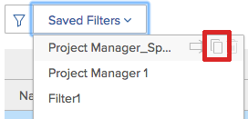
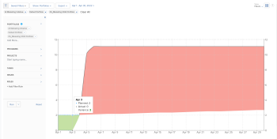

# Visualizza informazioni sull’utilizzo delle risorse

<!--

(NOTE:&nbsp;this is linked to the UI from the Utilization report. ALWAYS keep this information. DO NOT DELETE!!)

-->

È possibile visualizzare l&#39;utilizzo delle risorse utilizzando il rapporto Utilizzo.

<!--

(NOTE: Vazgen's response about these hours ie below and he asked us to NOT document them:

It queries Assignments first to get the tasks, issues, projects to display in the view. And then from those gets the hours.

In some cases, like for Planned Hours, it takes them from Assignments

But Budgeted Hours come from projects.

And Actual Hours are their own object - Hour)

-->

<!--

This report displays information about the assignments on work items for projects in your environment, like Planned, Actual, and Budgeted Hours, FTE, or Cost.&nbsp;These are hours,&nbsp;FTE, or costs associated with the assignments and not with the tasks and issues themselves.(PRIVATE NOTE:&nbsp;Vazgen's response about these hours: It queries Assignments first to get the tasks, issues, projects to display in the view. And then from those gets the hours. In some cases, like for Planned Hours, it takes them from Assignments; But Budgeted Hours come from projects. And Actual Hours are their own object - Hour.)

-->

## Requisiti di accesso

Per accedere al rapporto Utilizzo è necessario disporre dei seguenti elementi:

<table style="table-layout:auto"> 
 <col> 
 <col> 
 <tbody> 
  <tr> 
   <td role="rowheader">piano Adobe Workfront*</td> 
   <td> 
Pro o superiore
 </td> 
  </tr> 
  <tr> 
   <td role="rowheader">Licenza Adobe Workfront*</td> 
   <td> 
Piano 
 </td> 
  </tr> 
  <tr> 
   <td role="rowheader">Configurazioni a livello di accesso*</td> 
   <td> 
Visualizza o accedi di più a quanto segue:
 
    <ul> 
     <li> 
Gestione risorse 
 </li> 
     <li> 
Progetti
 </li> 
     <li> 
Portfolio
 </li> 
     <li> 
Programmi
 </li> 
     <li> 
Dati finanziari se si desidera visualizzare le informazioni per costo
 </li> 
    </ul> 
<b>NOTA</b>

Se non disponi ancora dell’accesso, chiedi all’amministratore Workfront se ha impostato ulteriori restrizioni nel livello di accesso. Per informazioni su come un amministratore Workfront può modificare il livello di accesso, consulta <a href="../../administration-and-setup/add-users/configure-and-grant-access/create-modify-access-levels.md" class="MCXref xref">Creare o modificare livelli di accesso personalizzati</a>.
 </td>
</tr> 
  <tr> 
   <td role="rowheader">Autorizzazioni oggetto</td> 
   <td> 
Visualizza l'accesso a progetti, portfolio e programmi per accedere alla sezione Utilizzo nell'area Risorse
 
  
 
Gestisci l'accesso al progetto per accedere alla sezione Utilizzo di un progetto
 
  
 
Per informazioni sulla richiesta di accesso aggiuntivo, vedi <a href="../../workfront-basics/grant-and-request-access-to-objects/request-access.md" class="MCXref xref">Richiedere l’accesso agli oggetti </a>.
 </td> 
  </tr> 
 </tbody> 
</table>

*Per sapere quale piano, tipo di licenza o accesso si dispone, contattare l&#39;amministratore Workfront.

<!--

You must have View access to the projects you want to view utilization information for as described in this section. If you are still unable to access this information, contact your Workfront administrator. (NOTE:&nbsp;replaced with above table)

-->

Le sezioni seguenti descrivono come visualizzare e utilizzare le informazioni sull’utilizzo.

<!--

<h2>Prerequisites for accessing utilization information</h2>

(NOTE: drafted, replaced with above table)

To access utilization information as described in this section, ensure that the following conditions are met:

<ul>
<li>You have at least&nbsp;View access to the project, program, or portfolio for which you want to view the utilization information.</li>
<li>Your Workfront administrator must grant you at least View access to&nbsp;Financial&nbsp;Data in your Access Level to be able to view cost and revenue information in the Utilization report. The Workfront administrator must enable both View Role Billing & Cost Rates as well as View User Billing &&nbsp;Cost Rates when they grant you the View access to Financial Data. For information about granting access to&nbsp;Financial&nbsp;Data, see <a href="../../administration-and-setup/add-users/configure-and-grant-access/grant-access-financial.md" class="MCXref xref">Grant access to financial data</a>. </li>
<li>

(NOTE:&nbsp;drafted. No longer the case.) 

The Utilization tab is included on any layout template that is assigned to you and that is applied to either the projects you view or to the Reporting area. 

The Utilization section is included on any layout template that is assigned to you and that is applied to either the projects you view or to the Resourcing area. 

</li>
<li>

The Utilization tab is available by default in the Reporting area if the system administrator has not assigned a custom layout template to you. 

The Utilization section is available by default in the Resourcing area if the system administrator has not assigned a custom layout template to you. 

</li>
</ul>

-->

## Panoramica del rapporto Utilizzo {#overview-of-the-utilization-report}

Utilizzando il rapporto Utilizzo è possibile visualizzare l&#39;avanzamento, il costo o i ricavi di un progetto, programma o portfolio in un unico rapporto. È inoltre possibile confrontare le entrate con i costi.

È possibile visualizzare il rapporto Utilizzo nell&#39;area Origine per visualizzare l&#39;utilizzo in più progetti oppure visualizzarlo al livello di un progetto per visualizzare l&#39;utilizzo delle singole risorse (ruoli e utenti del processo) associate al progetto.

Per informazioni sull&#39;accesso e l&#39;utilizzo del rapporto Utilizzo, vedere la [Tracciare l&#39;avanzamento, i costi e i ricavi con il rapporto Utilizzo](#track-progress-cost-and-revenue-with-the-utilization-report) in questo articolo.

* [Tracciamento ore (avanzamento)](#track-hours-progress)
* [Costo del tracciamento](#track-cost)
* [Tracciare i ricavi](#track-revenue)
* [Confrontare i ricavi con i costi pianificati e effettivi](#compare-revenue-against-planned-and-actual-costs)

### Tracciamento ore (avanzamento) {#track-hours-progress}

Puoi tenere traccia dell’avanzamento visualizzando il modo in cui le ore previste e a budget si confrontano con le ore effettive.

Durante il monitoraggio dell&#39;avanzamento di un progetto, un programma o un portfolio, l&#39;avanzamento rispetto a attività e problemi è incluso nel rapporto Utilizzo.

Le seguenti informazioni sono disponibili nel rapporto Utilizzo durante il tracciamento delle ore:

<table style="table-layout:auto"> 
 <col> 
 <col> 
 <thead> 
  <tr> 
   <th><strong>Titolo colonna durante la visualizzazione delle ore</strong> </th> 
   <th><strong>Funzione</strong> </th> 
  </tr> 
 </thead> 
 <tbody> 
  <tr> 
   <td scope="col"><strong>Ore Preventivate</strong> </td> 
   <td scope="col"> 
Il totale delle ore di budget per i progetti inclusi. È possibile visualizzare le ore di budget totali per la durata complessiva dei progetti inclusi oppure visualizzare le ore di budget totali solo per l'intervallo di date specificato (è possibile specificare una settimana o un mese individuale). 
 
Le ore a budget sono popolate dalle informazioni disponibili nella nuova area Resource Budgeting del Business Case o del Resource Planner<em>.</em>
 
Nel rapporto Utilizzo vengono visualizzate le ore previste in una delle seguenti righe:
 
    <ul> 
     <li> Le ore previste vengono riepilogate per ruolo di lavoro e per singolo utente nel rapporto Utilizzazione, come segue: <strong>Utente singolo:</strong> Le ore previste vengono riepilogate per ogni utente nel rapporto di utilizzo. Questi orari in budget sono associati alle attività e ai problemi a cui l'utente è assegnato nei progetti inclusi. È possibile espandere la riga del ruolo di lavoro corrispondente per visualizzare un elenco di utenti con tale ruolo. <strong>Ruolo lavoro:</strong> Le ore previste vengono riepilogate in base al ruolo del lavoro nel rapporto di utilizzo. Le ore previste vengono visualizzate in un particolare ruolo di lavoro a seguito di uno dei seguenti scenari: 
     <li>Il ruolo di processo è definito come il ruolo di lavoro principale dell'utente assegnato all'attività o al problema a cui sono associati gli orari previsti in budget. </li> 
       <li>Quando si visualizzano le informazioni di utilizzo per un singolo progetto, il ruolo dell'utente assegnato alle ore viene utilizzato indipendentemente dal fatto che non vi sia alcuna assegnazione sull'attività o sul problema, un altro utente viene assegnato senza assegnazione di ruoli, un altro utente viene assegnato con un ruolo diverso o un altro team viene assegnato.</li> 
       <li>Quando si visualizzano le informazioni di utilizzo per diversi progetti, programmi o portfolio, il ruolo di lavoro dell'utente assegnato alle ore viene utilizzato solo quando il ruolo viene assegnato a un'attività o a un problema in un progetto. </li> 
       <li>Il ruolo del lavoro viene assegnato all'attività o al problema a cui è associato l'orario previsto e l'utente assegnato all'attività o al problema non dispone di un ruolo di lavoro definito nel sistema.</li> 
      </ul></li> 
    </ul> 
    <ul> 
     <li> 
<strong>Ore non assegnate</strong>: Le ore previste vengono visualizzate nel rapporto di utilizzo nella sezione Ore non allocate quando le ore previste in budget sono associate a un'attività o a un problema e non vi è alcun utente o ruolo assegnato all'attività o al problema. Questa sezione viene visualizzata solo quando sono presenti ore nel progetto che corrispondono a questa descrizione e quando il rapporto Utilizzo viene visualizzato da o da un progetto. 
 
Questa sezione viene visualizzata solo quando sono presenti ore nel progetto che corrispondono a questa descrizione e quando il rapporto Utilizzo viene visualizzato da o da un progetto. 
 </li> 
    </ul> 
Per ulteriori informazioni sulle ore di budget, consulta la sezione "Individuare le ore previste di un progetto" nella sezione <a href="../../manage-work/projects/project-finances/budgeted-labor-cost.md" class="MCXref xref">Comprendere i costi del lavoro e le ore previste per i progetti</a> articolo.
 </td> 
  </tr> 
  <tr> 
   <td scope="col"><strong>Lavoro Necessario</strong> </td> 
   <td scope="col"> <!-- Yay, no errors, warnings, or alerts! -->

Orario pianificato per i progetti inclusi associati alle assegnazioni per ogni attività e problema. È possibile visualizzare le ore pianificate totali di tutte le assegnazioni del progetto per la durata complessiva dei progetti inclusi oppure visualizzare le ore pianificate totali solo per l'intervallo di date specificato (è possibile specificare una settimana o un mese individuale). 

<strong>SUGGERIMENTO </strong>

Non vengono prese in considerazione le ore pianificate dagli articoli con una durata pari a 0. 

Orari pianificati nel rapporto Utilizzo tengono conto del fatto che gli orari pianificati sono stati riallocati per tutta la durata di un'attività o di un problema. 

Quando l'allocazione giornaliera dell'utente per le ore è stata modificata utilizzando il servizio di bilanciamento del carico di lavoro, i dati nel rapporto Utilizzo possono essere influenzati se le date selezionate nel rapporto Utilizzo contengono solo una parte della durata di un'attività o di un problema. 

Per informazioni sulla modifica delle allocazioni per gli utenti, consulta <a href="../workload-balancer/manage-user-allocations-workload-balancer.md">Gestire le allocazioni di utenti nel load balancer</a>.

Nel rapporto Utilizzo vengono visualizzate le ore pianificate in una delle seguenti righe:

<ul>

<li>Le ore pianificate sono riepilogate dal ruolo del lavoro e dai singoli utenti nel rapporto di utilizzo, come segue: 
<ul>

<li><strong>Utente singolo</strong>: Le ore pianificate sono riepilogate per ogni utente nel rapporto di utilizzo. Queste ore pianificate sono associate alle attività e ai problemi a cui l’utente è assegnato nei progetti inclusi. È possibile espandere la riga del ruolo di lavoro corrispondente per visualizzare un elenco di utenti con tale ruolo.

<li><strong>Ruolo</strong>: Le ore pianificate vengono riepilogate in base al ruolo del lavoro nel rapporto di utilizzo di un singolo progetto. Le ore pianificate vengono visualizzate in un particolare ruolo di lavoro a seguito di uno dei seguenti scenari:  
<ul>

<li>Il ruolo di processo è definito come il ruolo principale dell'utente assegnato all'attività o al problema a cui sono associati gli orari pianificati.

<li>Quando si visualizzano le informazioni di utilizzo per un singolo progetto, le ore associate a un ruolo di lavoro non vengono visualizzate per il ruolo di processo nei seguenti scenari:   
<ul>

<li>Nessuna assegnazione per l'attività o il problema

<li>Un utente viene assegnato senza l'assegnazione di ruoli di lavoro

<li>A un utente viene assegnato un ruolo diverso

<li>Un team viene assegnato all'attività o al problema
</li>   
</ul>

<li>Quando si visualizzano le informazioni di utilizzo per diversi progetti, programmi o portfolio, il ruolo di lavoro dell'utente assegnato alle ore viene utilizzato solo quando il ruolo viene assegnato a un'attività o a un problema in un progetto. Le ore del ruolo del lavoro non vengono visualizzate separatamente quando si visualizza il rapporto Utilizzo per più progetti.

<li>Il ruolo di processo viene assegnato all'attività o al problema a cui è associato l'orario pianificato e l'utente assegnato all'attività o al problema non ha un ruolo di lavoro definito nel sistema.
</li>  
</ul>

<li><strong>Ore non assegnate</strong>: Le ore pianificate vengono visualizzate nel rapporto di utilizzo nella sezione Ore non allocate quando le ore pianificate sono associate a un'attività o a un problema e non vi è alcun utente o ruolo assegnato all'attività o al problema. Questa sezione viene visualizzata solo quando il progetto presenta ore corrispondenti a questa descrizione e quando viene visualizzato il rapporto Utilizzo per un singolo progetto.  Per ulteriori informazioni sulle ore pianificate, vedi <a href="../../manage-work/tasks/task-information/planned-hours.md">Panoramica sull’orario pianificato</a>.
</li> 
</ul>
</li> 
</ul> </td> 
  </tr> 
  <tr> 
   <td><strong>Lavoro Necessario Reale</strong> </td> 
   <td> 
 Le ore totali registrate sulle attività, i problemi, e sul progetto per i progetti inclusi. È possibile visualizzare le ore effettive totali per la durata complessiva dei progetti inclusi oppure le ore effettive totali solo per l'intervallo di date specificato (è possibile specificare una settimana o un mese individuale). 
 
Avviso: Il rapporto di utilizzo include ore registrate nel progetto, attività secondarie, problemi e attività principali con almeno un'assegnazione. Non include le ore registrate alle attività principali senza assegnazioni. È consigliabile non utilizzare le attività principali come attività di lavoro e assegnare alle risorse solo le attività figlio. 
 
Le ore effettive vengono visualizzate nel rapporto di utilizzo in una delle righe seguenti:
 
    <ul> 
     <li> Nel rapporto di utilizzo di un progetto, le ore effettive sono riepilogate per ruolo di lavoro e per singolo utente, come segue: <strong>Utente singolo:</strong> Le ore effettive vengono visualizzate nel rapporto di utilizzo nella riga dell’utente che ha registrato le ore. È possibile espandere la riga del ruolo di lavoro corrispondente per visualizzare un elenco di utenti con quel ruolo di lavoro che hanno registrato ore. <strong>Ruolo lavoro:</strong> Le ore effettive registrate dagli utenti associati a tali ruoli vengono riepilogate nel rapporto di utilizzo nella riga del ruolo di lavoro corrispondente. Le ore effettive vengono visualizzate in un particolare ruolo di lavoro a seguito di uno dei seguenti scenari: 
      <ul> 
       <li>Il ruolo di processo è definito come il ruolo principale dell'utente che ha registrato le ore.</li> 
       <li>Nessuna assegnazione per l'attività o il problema</li> 
       <li>Un altro utente viene assegnato senza l'assegnazione di ruoli di lavoro</li> 
       <li>A un altro utente viene assegnato un ruolo diverso</li> 
       <li> 
Viene assegnata una squadra.
 </li> 
      </ul></li>  
     
Se l'utente che registra le ore non dispone di un ruolo di lavoro associato al proprio profilo, il ruolo di lavoro utilizzato per il rapporto Utilizzo è il ruolo di lavoro assegnato all'attività o al problema in cui vengono registrate le ore o il ruolo di lavoro associato al proprietario principale dell'attività o del problema. 
 
     <li><strong>Altre ore:</strong> Le ore effettive vengono visualizzate nel rapporto di utilizzo nella sezione Altre ore , nella riga dell’utente che ha effettuato l’accesso alle ore. Le ore vengono visualizzate in questa sezione quando l’utente che ha effettuato l’accesso alle ore non ha un ruolo di lavoro definito nel sistema. Questa sezione viene visualizzata solo quando sono presenti ore nel progetto che corrispondono a questa descrizione. </li> 
    </ul> </td> 
  </tr> 
  <tr> 
   <td><strong>Varianza budget (per ore)</strong> </td> 
   <td> 
Il totale delle ore di budget meno le ore effettive totali sui progetti inclusi. È possibile visualizzare la varianza budget totale per la durata complessiva dei progetti inclusi oppure la varianza budget totale solo per l'intervallo di date specificato (è possibile specificare una settimana o un mese). 
 
Se il valore è positivo, viene visualizzato in verde. Indica che le ore totali a budget sono maggiori delle ore effettive.
 
Se il valore è negativo, viene visualizzato in rosso. Indica che le ore totali a budget sono inferiori alle ore effettive.
 
  
 </td> 
  </tr> 
  <tr> 
   <td><strong>Varianza pianificata (per ore)</strong> </td> 
   <td> 
Le ore pianificate totali meno le ore effettive totali sui progetti inclusi. È possibile visualizzare la varianza totale pianificata per la durata complessiva dei progetti inclusi oppure visualizzare la varianza totale pianificata solo per l'intervallo di date specificato (è possibile specificare una settimana o un mese individuale).
 
Se il valore è positivo, viene visualizzato in verde. Indica che le ore pianificate totali sono maggiori delle ore effettive.
 
Se il valore è negativo, viene visualizzato in rosso. Indica che le ore pianificate totali sono inferiori alle ore effettive.
 </td> 
  </tr> 
 </tbody> 
</table>

### Costo del tracciamento {#track-cost}

È possibile tenere traccia dei costi visualizzando il confronto tra Costo preventivato e Costo pianificato e Costi effettivi.

Quando si tiene traccia del costo di un progetto, di un programma o di un portfolio, le informazioni contenute nel rapporto Utilizzo provengono dalle attività. Le informazioni sui costi delle attività sono sempre disponibili nel rapporto Utilizzo. Il costo per le attività viene calcolato in base al tipo di costo dell&#39;attività. Per informazioni sul tipo di costo delle attività, vedere &quot;Modificare i tipi di costo per le singole attività&quot; in [Costi di tracciamento](../../manage-work/projects/project-finances/track-costs.md).

È possibile visualizzare le informazioni sui costi nel rapporto Utilizzo nei seguenti modi:

* Per una determinata settimana o mese, o per il progetto, il programma o il portafoglio complessivo.
* Per ruolo o per singolo, per progetti.

La valuta utilizzata nel rapporto di utilizzo è determinata dalla divisa impostata nel progetto. Per informazioni su come regolare la valuta di un progetto, vedere [Modificare la valuta del progetto](../../manage-work/projects/project-finances/change-project-currency.md).

Le seguenti informazioni sono disponibili nel rapporto Utilizzo durante il tracciamento dei costi:

<table style="table-layout:auto"> 
 <col> 
 <col> 
 <thead> 
  <tr> 
   <th><strong>Titolo colonna durante la visualizzazione del costo</strong> </th> 
   <th> 
<strong>Funzione</strong> 
 </th> 
  </tr> 
 </thead> 
 <tbody> 
  <tr> 
   <td scope="col"><strong>Bdg prv</strong> </td> 
   <td scope="col"> 
Costo previsto per i progetti inclusi. È possibile visualizzare il costo preventivato totale per la durata complessiva dei progetti inclusi oppure il costo preventivato totale solo per l'intervallo di date specificato (è possibile specificare una settimana o un mese individuale).
 
Poiché il costo preventivato nel rapporto Utilizzo è incentrato sul costo per ruolo, il calcolo è lo stesso del costo del lavoro preventivato in altre aree di Workfront. Per informazioni sul calcolo del costo del lavoro a budget, vedere <a href="../../manage-work/projects/project-finances/budgeted-labor-cost.md" class="MCXref xref">Comprendere i costi del lavoro e le ore previste per i progetti</a>.
 </td> 
  </tr> 
  <tr> 
   <td scope="col"><strong>Costo Pianificato</strong> </td> 
   <td scope="col"> 
Costo totale pianificato per i progetti inclusi. È possibile visualizzare il costo totale pianificato per la durata complessiva dei progetti inclusi oppure il costo totale pianificato solo per l'intervallo di date specificato (è possibile specificare una singola settimana o mese).
 
Per informazioni sul calcolo del costo pianificato per il progetto, vedere la sezione "Modalità di calcolo dei costi pianificati, preventivati e effettivi da parte di Workfront" nell'articolo <a href="../../manage-work/projects/project-finances/track-costs.md" class="MCXref xref">Costi di tracciamento</a>.
 </td> 
  </tr> 
  <tr> 
   <td scope="col"><strong>Costo Reale</strong> </td> 
   <td scope="col"> 
Costo effettivo totale per i progetti inclusi. È possibile visualizzare il costo effettivo totale per la durata complessiva dei progetti inclusi oppure il costo effettivo totale solo per l'intervallo di date specificato (è possibile specificare una settimana o un mese individuale).
 
Per informazioni sul calcolo del costo effettivo per il progetto, vedere la sezione "Modalità di calcolo dei costi pianificati, preventivati e effettivi da parte di Workfront" nell'articolo <a href="../../manage-work/projects/project-finances/track-costs.md" class="MCXref xref">Costi di tracciamento</a>.
 </td> 
  </tr> 
  <tr> 
   <td><strong>Varianza budget (per costo)</strong> </td> 
   <td scope="col"> 
Costo totale preventivato meno il costo effettivo totale per i progetti inclusi. È possibile visualizzare la varianza budget totale per la durata complessiva dei progetti inclusi oppure la varianza budget totale solo per l'intervallo di date specificato (è possibile specificare una settimana o un mese).
 
Se il valore è positivo, viene visualizzato in verde. Indica che il costo totale preventivato è maggiore del costo effettivo.
 
Se il valore è negativo, viene visualizzato in rosso. Indica che il costo totale preventivato è inferiore al costo effettivo.
 </td> 
  </tr> 
  <tr> 
   <td><strong>Varianza pianificata (per costo)</strong> </td> 
   <td> 
Costo totale pianificato meno il costo effettivo totale per i progetti inclusi. È possibile visualizzare la varianza totale pianificata per la durata complessiva dei progetti inclusi oppure visualizzare la varianza totale pianificata solo per l'intervallo di date specificato (è possibile specificare una settimana o un mese individuale). 
 
Se il valore è positivo, viene visualizzato in verde. Indica che il costo totale pianificato è maggiore del costo effettivo.
 
Se il valore è negativo, viene visualizzato in rosso. Indica che il costo totale pianificato è inferiore al costo effettivo.
 </td> 
  </tr> 
 </tbody> 
</table>

### Tracciare i ricavi {#track-revenue}

È possibile tenere traccia delle entrate visualizzando il modo in cui le entrate in budget e pianificate si confrontano con le entrate effettive.

Nel rapporto Utilizzo, quando si tiene traccia dei ricavi di un progetto, programma o portfolio, i ricavi provenienti solo dalle attività vengono inclusi nel rapporto Utilizzo.

Le informazioni nella tabella seguente sono disponibili nel rapporto Utilizzo durante il tracciamento dei ricavi.

Per informazioni su campi specifici e su come Workfront li calcola, consulta anche i seguenti articoli:

* [Costi di tracciamento](../../manage-work/projects/project-finances/track-costs.md)
* [Panoramica di fatturazione e ricavi](../../manage-work/projects/project-finances/billing-and-revenue-overview.md)

<table style="table-layout:auto"> 
 <col> 
 <col> 
 <thead> 
  <tr> 
   <th><strong>Titolo colonna durante la visualizzazione dei ricavi</strong> </th> 
   <th> <strong>Funzione</strong></th> 
  </tr> 
 </thead> 
 <tbody> 
  <tr> 
   <td scope="col"><strong>Retribuzioni preventivate</strong> </td> 
   <td scope="col"> 
Il totale delle ore previste moltiplicato per il tasso di fatturazione dei ruoli per i progetti inclusi. È possibile visualizzare le entrate a budget totali per la durata complessiva dei progetti inclusi oppure visualizzare le entrate a budget totali solo per l'intervallo di date specificato (è possibile specificare una settimana o un mese individuale).
 </td> 
  </tr> 
  <tr> 
   <td scope="col"><strong>Reddito Pianificato</strong> </td> 
   <td scope="col"> 
Ricavi pianificati nel rapporto Utilizzo sono i ricavi associati alle ore pianificate assegnate alle risorse assegnate alle attività del progetto.
 
Workfront calcola i ricavi pianificati del progetto per il rapporto Utilizzo con la formula seguente:
 
<code>Project Planned Revenue = SUM&nbsp;(All Tasks Planned Revenue)</code> 
 
   
<b>NOTA</b>
   
Le entrate pianificate del progetto visualizzate nel rapporto Utilizzo sono diverse dalle entrate pianificate visualizzate nell'area Dettagli progetto e nei rapporti sul progetto. 
 
I ricavi pianificati nell’area Dettagli progetto riflettono i ricavi dell’attività e i ricavi fissi del progetto. Nel rapporto Utilizzo dei ricavi pianificati vengono visualizzati i ricavi pianificati associati solo alle attività del progetto. 
 
     
Example: </b>">  
      
Se il progetto dispone di 1 attività con 10 ore, assegnata a un Consulente con una tariffa oraria di $ 20 e il progetto ha un Ricavo fisso di $ 100, il rapporto Utilizzo visualizza $ 200 per Ricavi pianificati (i Ricavi pianificati associati alle ore dell'attività). Nella sezione Dettagli progetto viene visualizzato $300 (Ricavi pianificati dall'attività e Ricavi fissi per il progetto). 
 
     
 
Per ulteriori informazioni sull'attività e sui ricavi pianificati del progetto al di fuori del rapporto Utilizzo, vedi <a href="../../manage-work/projects/project-finances/billing-and-revenue-overview.md" class="MCXref xref">Panoramica di fatturazione e ricavi</a>.
 
 
Il modo in cui il rapporto Utilizzo calcola e visualizza le entrate pianificate per i progetti inclusi tiene conto del tipo di ricavi impostato sull'attività. 
 
A seconda del tipo di ricavi di ogni attività del progetto, esistono i seguenti scenari: 
 
<strong>Entrate fisse:</strong> Indipendentemente dalle assegnazioni delle attività, i ricavi relativi all'attività vengono sempre calcolati utilizzando l'Importo fisso specificato nell'attività.
 
<b>IMPORTANTE</b>

A differenza di altre aree di Workfront, il rapporto Utilizzo calcola i ricavi pianificati per le attività Ricavo fisso dividendo in modo uniforme i Ricavi fissi per il numero di Ore pianificate per l&#39;attività. 
 
Ad esempio, un&#39;attività ha un fatturato di $ 200. Se ci sono 4 ore pianificate sull&#39;attività, ogni ora sarebbe $50. Questa viene distribuita a livello di utente e ruolo. Questa distribuzione è univoca per il report Utilizzo.
 
<b>NOTA</b>

Se si dispone di un&#39;attività Ricavo fisso e non sono disponibili ore pianificate per l&#39;attività, nel rapporto Utilizzo non viene visualizzato Ricavo perché non è possibile distribuirlo nelle ore. Se si dispone di Orari pianificati per attività con Ricavo fisso e nessuna assegnazione, i Ricavi vengono visualizzati come Ricavi non allocati. 
 
<strong>Ruolo orario:</strong> I ricavi relativi all&#39;attività vengono calcolati utilizzando il tasso di fatturazione impostato per un ruolo specifico, moltiplicato per il numero di ore pianificate associate a tale ruolo. Workfront utilizza la seguente formula:
 
Ruolo Ricavo pianificato orario = SOMMA (ore pianificate dal ruolo su tutte le attività) * Tasso di fatturazione ruolo</code>
 
<strong>Utente orario:</strong> I ricavi relativi all&#39;attività vengono calcolati utilizzando il tasso di fatturazione impostato per un utente specifico, moltiplicato per il numero di ore pianificate associate a tale utente. Workfront utilizza la seguente formula:
 
Ricavo pianificato orario utente = SOMMA (ore pianificate dagli utenti su tutte le attività) * Tasso di fatturazione utente</code> 
 
<b>Ruolo fisso orario o utente più orario</b> 
 
<b>IMPORTANTE</b>

A differenza di altre aree di Workfront, il rapporto Utilizzo calcola i ricavi pianificati dividendo in modo uniforme i ricavi fissi per il numero di ore pianificate sull&#39;attività. 
 
Esistono i seguenti casi: 

<ul>
<li> 
<strong>Ruolo orario più fisso:</strong> I ricavi relativi all’attività vengono calcolati utilizzando il tasso di fatturazione impostato per un ruolo specifico, moltiplicato per il numero di ore pianificate associate al ruolo. Inoltre, un importo fisso specificato per l&#39;attività viene aggiunto al tasso di ruolo. Workfront utilizza la seguente formula:
 
Ruolo A Orario Più Entrate Fisse Pianificate = [SOMMA (orario pianificato dal ruolo su tutte le attività) * Tasso di fatturazione del ruolo] + SOMMA (cap o Fixed Amount of the task / Planned Hours of the task)</code> 
 </li>
</ul>
<ul>
<li> 
<strong>Utente orario più fisso:</strong> Il tasso di fatturazione impostato per un utente specifico, moltiplicato per il numero di ore pianificate sull&#39;attività da parte di tale utente. Inoltre, alla frequenza utente viene aggiunto un importo fisso specificato per l&#39;attività. Workfront utilizza la seguente formula:
 
Ricavi fissi orari più utenti = [SUM (orario pianificato dall&#39;utente su tutte le attività) * Tasso di fatturazione utente] + SOMMA (cap o Fixed Amount of the task / Planned Hours of the task)</code> 
 </li>
</ul> 
<b>Ruolo o utente ogni ora con cap</b> 
 
<b>IMPORTANTE</b>

A differenza di altre aree di Workfront, se il Ricavo pianificato supera il tetto, l’importo relativo all’Importo dell’offerta è considerato Ricavo fisso. Il Ricavo pianificato viene calcolato dividendo in modo uniforme i Ricavi fissi per il numero di Ore pianificate sull&#39;attività, quindi aggiungendo a tale importo cap e il ruolo o i ricavi orari dell&#39;utente.  
 
Esistono i seguenti casi: 

<ul>
<li> 
<strong>Ruolo orario con cap:</strong> Le attività vengono fatturate ogni ora come in Role Hourly, ma dispongono di un importo massimo di cap che è possibile specificare. Workfront utilizza la seguente formula:
 
Ruolo orario con ricavo pianificato cap = [SUM(Orari pianificati dal ruolo su tutte le attività e i problemi) * Tasso di fatturazione del ruolo] + Importo cap dell&#39;attività + SOMMA (Importo su Importo cap / Ore previste dell&#39;attività)</code> 
 </li>
</ul>
<ul>
<li> 
<strong>Utente orario con cappuccio:</strong> Le attività vengono fatturate ogni ora come nell’orario utente, ma dispongono di un importo massimo di sollecito che è possibile specificare. Workfront utilizza la seguente formula: 
 
Orario utente con ricavo pianificato per cap = [SUM (orario pianificato dall&#39;utente su tutte le attività) * Tasso di fatturazione utente] + Importo cap dell&#39;attività + SOMMA (Importo su Importo cap / Ore previste dell&#39;attività)</code> 
 </li>
</ul> 
Per ulteriori informazioni su quale ruolo o utente viene preso in considerazione durante il calcolo dei ricavi pianificati, consulta <a href="../../manage-work/projects/project-finances/billing-and-revenue-overview.md" class="MCXref xref">Panoramica di fatturazione e ricavi</a>.
 </td>
</tr> 
  <tr> 
   <td><strong>Reddito Reale</strong> </td> 
   <td> 
Le entrate effettive sono le entrate associate alle ore effettive delle attività e del progetto. Per ulteriori informazioni sui ricavi effettivi, consulta la sezione "Tracciare gli importi dei ricavi" nell’articolo <a href="../../manage-work/projects/project-finances/billing-and-revenue-overview.md" class="MCXref xref">Panoramica di fatturazione e ricavi</a>.

Il modo in cui il rapporto Utilizzazione calcola i ricavi effettivi per i progetti inclusi varia a seconda del tipo di ricavi impostato sull'attività, come segue:
 
<strong>Entrate fisse:</strong> Indipendentemente dalle assegnazioni delle attività, i ricavi relativi all'attività vengono sempre calcolati utilizzando l'Importo fisso specificato nell'attività.
 
<b>IMPORTANTE</b>

A differenza di altre aree di Workfront, il rapporto Utilizzo calcola i ricavi effettivi dividendo in modo uniforme i ricavi fissi per il numero di ore registrate sull&#39;attività. 
 
 
 
Ad esempio, un&#39;attività ha un ricavo effettivo di $ 200. Se l&#39;attività è suddivisa in 4 ore effettive, ogni ora sarà di $ 50. Questa viene distribuita a livello di utente e ruolo. Questa distribuzione è univoca per il report Utilizzo.
 
<b>NOTA</b>

Se si dispone di un&#39;attività Ricavo fisso e non sono presenti ore effettive sull&#39;attività, i Ricavi effettivi non vengono visualizzati nel rapporto Utilizzo perché non è possibile distribuire le ore. 
 
<strong>Ruolo orario:</strong> I ricavi relativi all&#39;attività vengono calcolati utilizzando il tasso di fatturazione impostato per un ruolo specifico, moltiplicato per il numero di ore pianificate.
 
Workfront utilizza la seguente formula:
 
Ruolo Ricavi effettivi orari = SOMMA (ore effettive dal ruolo su tutte le attività) * Tasso di fatturazione ruoli</code> 
 
<strong>Utente orario:</strong> I ricavi dell&#39;attività vengono calcolati utilizzando il tasso di fatturazione impostato per un utente specifico, moltiplicato per il numero di ore registrate rispetto all&#39;attività da tale utente. Workfront utilizza la seguente formula:
 
Entrate effettive orarie dell&#39;utente = SOMMA (ore effettive dell&#39;utente su tutte le attività) * Tasso di fatturazione dell&#39;utente</code>
 
<b>Ruolo o utente fisso con valore orario più</b> 
 
<b>IMPORTANTE</b>

A differenza di altre aree di Workfront, il rapporto Utilizzo calcola i ricavi effettivi dividendo in modo uniforme i ricavi fissi per il numero di ore registrate sull&#39;attività. 
 
Esistono i seguenti casi: 

<ul>
<li> 
<strong>Ruolo orario più fisso:</strong> Il tasso di fatturazione impostato per un ruolo specifico, moltiplicato per il numero di ore registrate rispetto all&#39;attività da un utente con quel ruolo. Inoltre, un importo fisso specificato per l&#39;attività viene aggiunto al tasso di ruolo. 
 
Workfront utilizza la seguente formula:
 
Ricavi effettivi fissi per ruolo più orari = [SOMMA (ore effettive dal ruolo su tutte le attività) * Tasso di fatturazione del ruolo] + SOMMA (Cappuccio o Importo fisso dell&#39;attività/Ore effettive dell&#39;attività)</code> 
 </li>
</ul>
<ul>
<li> 
<strong>Utente orario più fisso:</strong> Il tasso di fatturazione impostato per un utente specifico, moltiplicato per il numero di ore registrate rispetto all&#39;attività da tale utente. Inoltre, alla frequenza utente viene aggiunto un importo fisso specificato per l&#39;attività. 
 
Workfront utilizza la seguente formula:
 
Entrate effettive fisse orarie + utente = [SUM(Ore effettive dal ruolo su tutte le attività) * Tasso di fatturazione utente] + SOMMA (cap o Fixed Amount of the task / User Hours of the task)</code> 
 </li>
</ul> 
<b>Ruolo o utente ogni ora con cap</b> 
 
<b>IMPORTANTE</b>

A differenza di altre aree di Workfront, se il Ricavo pianificato supera il tetto, l’importo relativo all’Importo dell’offerta è considerato Ricavo fisso. Il Ricavo pianificato viene calcolato dividendo in modo uniforme i Ricavi fissi per il numero di Ore pianificate sull&#39;attività, quindi aggiungendo a tale importo cap e il ruolo o i ricavi orari dell&#39;utente.  
 
Esistono i seguenti scenari:

<ul>
<li> 
<strong>Ruolo orario con cap:</strong> Le attività vengono fatturate ogni ora come in Role Hourly, ma dispongono di un importo massimo di cap che è possibile specificare. Workfront utilizza la seguente formula:
 
Ruolo orario con ricavo effettivo = [SUM(Ore effettive dal ruolo su tutte le attività e i problemi) * Tasso di fatturazione del ruolo] + Importo cap dell&#39;attività + SOMMA (Importo su Importo cap / Ore effettive dell&#39;attività)</code>
 </li>
</ul>
<ul>
<li> 
<strong>Utente orario con cappuccio:</strong> Le attività vengono fatturate ogni ora come nell’orario utente, ma dispongono di un importo massimo di sollecito che è possibile specificare.
 
 Workfront utilizza la seguente formula:
 
Utente orario con ricavo effettivo = [SUM(Ore effettive dal ruolo su tutte le attività e i problemi) * Tasso di fatturazione utente] + Importo cap dell&#39;attività + SOMMA (Importo su Importo cap / Ore effettive dell&#39;attività)</code> 
 </li>
</ul>

<strong>Ricavi dal progetto</strong>: I ricavi associati alle ore di accesso al progetto vengono calcolati tenendo conto della quantità di fatturazione per ora del ruolo di lavoro principale dell’utente che registra il tempo. Non consigliamo di eseguire l’accesso al progetto. 

<b>NOTA</b>

Se l’utente non è associato a un ruolo di lavoro o se la fatturazione per ora del ruolo principale è pari a zero, Workfront calcola i ricavi effettivi utilizzando l’importo di fatturazione per ora per l’utente. Se nel profilo dell’utente non è presente un importo di fatturazione per ora, il Ricavo effettivo è pari a zero. 

 </td>
</tr> 
  <tr> 
   <td><strong>Varianza budget (per i ricavi)</strong> </td> 
   <td> 
Il totale delle entrate effettive meno le entrate a budget per i progetti inclusi. È possibile visualizzare la varianza budget totale per la durata complessiva dei progetti inclusi oppure la varianza budget totale solo per l'intervallo di date specificato (è possibile specificare una settimana o un mese).
 
Se il valore è positivo, viene visualizzato in verde. Ciò indica che le entrate totali in budget sono maggiori delle entrate effettive.
 
Se il valore è negativo, viene visualizzato in rosso. Ciò indica che le entrate totali in budget sono inferiori alle entrate effettive.
 </td> 
  </tr> 
  <tr> 
   <td><strong>Varianza pianificata (per ricavi)</strong> </td> 
   <td> 
Il totale dei ricavi effettivi meno il totale dei ricavi pianificati sui progetti inclusi. È possibile visualizzare la varianza totale pianificata per la durata complessiva dei progetti inclusi oppure visualizzare la varianza totale pianificata solo per l'intervallo di date specificato (è possibile specificare una settimana o un mese individuale). 
 
Se il valore è positivo, viene visualizzato in verde. Indica che il totale dei ricavi pianificati è maggiore dei ricavi effettivi.
 
Se il valore è negativo, viene visualizzato in rosso. Indica che il totale dei ricavi pianificati è inferiore ai ricavi effettivi.
 </td> 
  </tr> 
 </tbody> 
</table>

<!--Note from the table about Actual revenue: 
     
Actual Revenue is displayed in the Utilization report only after the task is marked as Complete or Done (or a status that equates with Complete).

    -->

<!--More notes from the table: 
     
(NOTE:&nbsp;the note below is duplicated in this article: /Content/Manage work/Projects/Project Finances/billing-and-revenue-overview.html and in the glossary)

   -->

### Confrontare i ricavi con i costi pianificati e effettivi {#compare-revenue-against-planned-and-actual-costs}

È possibile visualizzare il costo pianificato o effettivo accanto ai ricavi pianificati. Viene visualizzato anche il margine (%) (il margine è calcolato come Ricavo - Costo / Entrate).

Le seguenti informazioni sono disponibili nel rapporto Utilizzo quando si confrontano i ricavi con i costi pianificati e effettivi:

<table style="table-layout:auto"> 
 <col> 
 <col> 
 <thead> 
  <tr> 
   <th><strong>Titolo colonna quando si visualizzano i ricavi e i costi (pianificati)</strong> </th> 
   <th> <strong>Funzione</strong></th> 
  </tr> 
 </thead> 
 <tbody> 
  <tr> 
   <td scope="col"><strong>Costo Pianificato</strong> </td> 
   <td scope="col"> Costo totale pianificato per i progetti inclusi. È possibile visualizzare il costo totale pianificato per la durata complessiva dei progetti inclusi oppure il costo totale pianificato solo per l'intervallo di date specificato (è possibile specificare una singola settimana o mese). </td> 
  </tr> 
  <tr> 
   <td scope="col"><strong>Reddito Pianificato</strong> </td> 
   <td scope="col"> 
Ricavi pianificati è il ricavo associato all'orario pianificato delle attività. 
 
Il modo in cui il rapporto Utilizzo calcola e visualizza i ricavi pianificati per i progetti inclusi varia a seconda del tipo di ricavi impostato sull'attività, come descritto in <a href="#track-revenue" class="MCXref xref">Tracciare i ricavi</a> in questo articolo.
 </td> 
  </tr> 
  <tr> 
   <td scope="col"><strong>Margine</strong> </td> 
   <td scope="col"> 
La percentuale di margine è calcolata come segue:
 
<code>Planned Revenue - Planned Cost / Planned Revenue * 100. </code>
 
<b>NOTA</b>

Se il Ricavo pianificato è uguale a 0, il Margine viene visualizzato come 0. 
 </td>
</tr> 
  <tr> 
   <td scope="col"> 
<strong>Titolo colonna quando si visualizzano i ricavi e i costi (effettivi)</strong> 
  </td> 
   <td scope="col">
<strong>Funzione</strong>
</td> 
  </tr> 
  <tr> 
   <td scope="col"><strong>Costo Reale</strong> </td> 
   <td scope="col"> 
Costo effettivo totale per i progetti inclusi. È possibile visualizzare il costo effettivo totale per la durata complessiva dei progetti inclusi oppure il costo effettivo totale solo per l'intervallo di date specificato (è possibile specificare una settimana o un mese individuale).
 </td> 
  </tr> 
  <tr> 
   <td scope="col"><strong>Reddito Reale</strong> </td> 
   <td> 
I ricavi effettivi sono i ricavi associati all'orario effettivo delle attività.
 
I ricavi effettivi vengono visualizzati nel rapporto Utilizzazione solo dopo che l'attività è stata contrassegnata come Completa o Fine (o uno stato che equivale a Completo).
 
Il modo in cui il rapporto Utilizzazione calcola i ricavi effettivi per i progetti inclusi varia a seconda del tipo di ricavi impostato sull'attività, come descritto in <a href="#track-revenue" class="MCXref xref">Tracciare i ricavi</a> in questo articolo. 
 </td> 
  </tr> 
  <tr> 
   <td scope="col"><strong>Margine</strong> </td> 
   <td> 
La percentuale di margine è calcolata come segue:
 
Ricavi effettivi - Costo effettivo / Ricavi effettivi * 100. 
 
<b>NOTA</b>

Se le entrate effettive sono uguali a 0, il margine viene visualizzato come 0. 
 </td>
</tr> 
 </tbody> 
</table>

<!--Note from the table from above "Function" header in the middle of the table; right after the "Planned Revenue"/"Margin" definition: 
     
(NOTE: This needs to be either split in two tables of formatted differently)

    -->

## Tracciare l&#39;avanzamento, i costi e i ricavi con il rapporto Utilizzo {#track-progress-cost-and-revenue-with-the-utilization-report}

Puoi tenere traccia dell’avanzamento o del costo di un progetto, programma o portfolio.

È possibile visualizzare informazioni sul rapporto Utilizzo per una determinata settimana o mese o per la durata complessiva dei progetti.

Per tenere traccia dell&#39;avanzamento o del costo di uno o più progetti con un rapporto Utilizzo:

1. Effettua una delle seguenti operazioni, a seconda che visualizzi le informazioni di utilizzo per un singolo progetto, più progetti, un programma o un portfolio:

   * Per visualizzare le informazioni di utilizzo per un singolo progetto:

      1. Passa a un progetto per il quale desideri visualizzare le informazioni sull&#39;utilizzo, quindi fai clic su **Mostra altro> Utilizzo**.
      1. Le informazioni sull’utilizzo vengono visualizzate automaticamente quando si visualizza un singolo progetto e non è necessario applicare un filtro.\
         Se desideri filtrare il rapporto Utilizzo, puoi applicare un filtro, quindi fare clic su **Esegui**.\
         Per informazioni su come filtrare il rapporto Utilizzo, consulta la sezione . [Informazioni sull’utilizzo del filtro](#filter-utilization-information) in questo articolo.\
         Le informazioni sull’utilizzo vengono visualizzate per i singoli utenti e ruoli (gli utenti sono raggruppati all’interno del ruolo associato).
   * Per visualizzare le informazioni di utilizzo per più progetti:

      1. Fai clic sul pulsante **Menu principale** icona  nell’angolo in alto a destra di Workfront, quindi fai clic su **Risorsa**, quindi **Utilizzo** nel pannello a sinistra.
      1. Applicare un filtro al rapporto Utilizzo, quindi fare clic su **Esegui**.\
         È necessario specificare uno o più progetti nel filtro prima di eseguire il rapporto Utilizzo. Per informazioni su come filtrare il rapporto Utilizzo, consulta la sezione . [Informazioni sull’utilizzo del filtro](#filter-utilization-information) in questo articolo.\
         Le informazioni sull’utilizzo vengono visualizzate per i singoli ruoli e progetti (i ruoli sono raggruppati all’interno del progetto associato).
   * Per visualizzare le informazioni sull&#39;utilizzo di un programma:

      1. Fai clic sul pulsante **Menu principale** icona  nell’angolo in alto a destra di Workfront, quindi fai clic su **Risorsa**, quindi **Utilizzo** nel pannello a sinistra e fai clic su **Mostra**>**Programmi**.
      1. Applicare un filtro al rapporto Utilizzo, quindi fare clic su **Esegui**.\
         È necessario specificare uno o più programmi nel filtro prima di eseguire il rapporto Utilizzo. Per informazioni su come filtrare il rapporto Utilizzo, consulta la sezione . [Informazioni sull’utilizzo del filtro](#filter-utilization-information) in questo articolo.\
         Le informazioni sull&#39;utilizzo vengono visualizzate per i singoli progetti e programmi (i progetti sono raggruppati all&#39;interno del relativo programma associato).
   * Per visualizzare le informazioni sull&#39;utilizzo di un portfolio:

      1. Fai clic sul pulsante **Menu principale** icona  nell’angolo in alto a destra di Workfront, quindi fai clic su **Risorsa**, quindi **Utilizzo** nel pannello a sinistra e fai clic su **Mostra**>**Portfoli**.
      1. Applicare un filtro al rapporto Utilizzo, quindi fare clic su **Esegui**.\
         È necessario specificare uno o più portfolio nel filtro prima di eseguire il rapporto Utilizzo. Per informazioni su come filtrare il rapporto Utilizzo, consulta la sezione . [Informazioni sull’utilizzo del filtro](#filter-utilization-information) in questo articolo.\
         Le informazioni sull’utilizzo vengono visualizzate per i singoli progetti, programmi e portfolio (i progetti sono raggruppati all’interno del programma associato e i programmi sono raggruppati all’interno del portafoglio associato).

1. Nell&#39;angolo in alto a destra del rapporto Utilizzo, fai clic su **Visualizza** menu a discesa, quindi selezionare una delle opzioni seguenti:

   * **Costo**
   * **Ore**
   * **Ricavi**
   * **Ricavi - Costi (pianificato)**
   * **Ricavi e costi (effettivi)**.

   L’opzione selezionata determina quali colonne e informazioni sono disponibili nel rapporto. Per ulteriori dettagli sulle informazioni disponibili in ciascuna colonna, vedere la tabella al passaggio 5.\
   

1. (Facoltativo) Seleziona l’intervallo di date per il quale vengono visualizzate le informazioni sull’utilizzo. Puoi visualizzare le informazioni relative a una settimana o a un mese specifici a sinistra del **Generale** colonna. Le informazioni relative al progetto, al programma o al portafoglio complessivo sono sempre visualizzate nel **Generale** colonna.\
   Per ulteriori informazioni, consulta la sezione . [Regola l’intervallo di date per il quale vengono visualizzate le informazioni](#adjust-the-date-range-for-which-information-is-displayed) in questo articolo.

1. (Facoltativo) Fai clic su un titolo di colonna per ordinare il rapporto di utilizzo in base alle informazioni presenti nella colonna. L’ordinamento funziona solo quando nel rapporto sono inclusi più elementi. Ad esempio, è possibile ordinare i risultati del rapporto quando si esaminano più progetti (o portfolio o programma). Non è possibile ordinare i risultati quando si guarda un solo progetto (o un portfolio o un programma) alla volta.
1. Utilizza le informazioni nella sezione . [Panoramica del rapporto Utilizzo](#overview-of-the-utilization-report) in questo articolo per informazioni su ogni colonna del rapporto Utilizzo.

## Informazioni sull’utilizzo del filtro {#filter-utilization-information}

Puoi filtrare il contenuto visualizzato in un rapporto Utilizzo di un progetto. Puoi filtrare attività, problemi, ruoli e dati personalizzati. Quando si applica un filtro al rapporto Utilizzo, il rapporto Utilizzo contiene informazioni in base ai criteri selezionati.

Puoi creare un filtro o applicare un filtro creato in precedenza.

* [Creare o modificare un filtro](#create-or-modify-a-filter)
* [Applicazione di un filtro salvato](#apply-a-saved-filter)
* [Duplicare un filtro](#duplicate-a-filter)
* [Rinominare un filtro](#rename-a-filter)
* [Eliminare un filtro](#delete-a-filter)

### Creare o modificare un filtro {#create-or-modify-a-filter}

Quando crei un filtro, anche tutti gli utenti Workfront che hanno accesso al report Utilizzo hanno accesso al filtro creato. Allo stesso modo, quando modifichi un filtro esistente, il filtro viene modificato per tutti gli utenti che hanno accesso al report Utilizzo.

Per creare o modificare un filtro:

1. Per filtrare le informazioni di utilizzo per un singolo progetto, passare al progetto per il quale si desidera filtrare le informazioni di utilizzo, quindi fare clic su **Mostra altro>Utilizzo** nel pannello a sinistra.

   Oppure

   Per filtrare le informazioni di utilizzo per più progetti, per un programma o per un portfolio, fai clic sull’icona Menu principale  nell&#39;angolo superiore destro di Workfront, **Risorsa**, **Utilizzo** nel pannello a sinistra, quindi **Mostra**>**Programmi** o **Portfoli** o **Progetti**.

1. Fai clic sul pulsante **Filtro** per visualizzare le opzioni del filtro.

1. (Condizionale) Per modificare un filtro esistente, fai clic sul pulsante **Filtro** menu a discesa, quindi selezionare il filtro da modificare.
1. Specifica le seguenti informazioni per creare o modificare il filtro:

   * **Portfoli:** Inizia a digitare il nome del portfolio che contiene le informazioni da includere nel rapporto Utilizzo, quindi fai clic sul nome quando viene visualizzato nel menu a discesa.\
      Ripetere questo processo per includere informazioni provenienti da più portafogli nel rapporto Utilizzo.\
      Per includere nel filtro tutti i portfolio del sistema, fai clic su **Aggiungi tutto**. Questa opzione è disponibile solo se nel sistema sono presenti meno di 10 portfolio.

   * **Programmi:** Iniziare a digitare il nome del programma contenente le informazioni che si desidera includere nel rapporto Utilizzo, quindi fare clic sul nome quando viene visualizzato nel menu a discesa.\
      Ripetere questo processo per includere informazioni provenienti da più attività nel rapporto Utilizzo.\
      Se hai già designato dei portfolio nel filtro, il programma specificato deve provenire dai portfolio già inclusi nel filtro. In caso contrario, i dati del programma non vengono inclusi nel rapporto Utilizzo.\
      Per includere nel filtro tutti i programmi del sistema, fai clic su **Aggiungi tutto**. Questa opzione è disponibile solo se nel sistema sono presenti meno di 20 programmi.

   * **Progetti:** Inizia a digitare il nome del progetto contenente le informazioni da includere nel rapporto Utilizzo, quindi fai clic sul nome quando viene visualizzato nel menu a discesa.\
      Ripetere questo processo per includere informazioni provenienti da più progetti nel rapporto Utilizzo.\
      Se hai già designato portfolio o programmi nel filtro, il progetto specificato deve provenire da uno dei portfolio o programmi già inclusi nel filtro. In caso contrario, i dati del progetto non vengono inclusi nel rapporto Utilizzo.\
      Per includere nel filtro tutti i progetti del sistema, fai clic su **Aggiungi tutto**. Questa opzione è disponibile solo se nel sistema sono presenti meno di 250 progetti.

   * **Attività:** Iniziare a digitare il nome dell&#39;attività contenente le informazioni che si desidera includere nel rapporto Utilizzo, quindi fare clic sul nome quando viene visualizzato nel menu a discesa.\
      Ripetere questo processo per includere informazioni provenienti da più attività nel rapporto Utilizzo.\
      Se hai già designato portfolio, programmi o progetti nel filtro, l’attività specificata deve provenire da uno dei portfolio, programmi o progetti già inclusi nel filtro. In caso contrario, i dati dell&#39;attività non vengono inclusi nel rapporto Utilizzo.

   * **Problemi:** Inizia a digitare il nome del problema contenente le informazioni che desideri includere nel rapporto Utilizzo, quindi fai clic sul nome quando viene visualizzato nel menu a discesa.\
      Ripetere questo processo per includere informazioni provenienti da più problemi nel rapporto Utilizzo.\
      Se hai già designato portfolio, programmi o progetti nel filtro, il problema specificato deve provenire da uno dei portfolio, programmi o progetti già inclusi nel filtro. In caso contrario, i dati del problema non vengono inclusi nel rapporto Utilizzo.\
      Le informazioni sui costi per i problemi non vengono sempre incluse nel rapporto Utilizzo. Per ulteriori informazioni su quando le informazioni sui costi per i problemi sono incluse nel rapporto Utilizzo, consulta la sezione [Tracciare l&#39;avanzamento, i costi e i ricavi con il rapporto Utilizzo](#track-progress-cost-and-revenue-with-the-utilization-report) in questo articolo.

   * **Ruoli:** Inizia a digitare il nome del ruolo che desideri rappresentare nel rapporto Utilizzo, quindi fai clic sul nome quando viene visualizzato nel menu a discesa. Ripeti questo processo per includere altri ruoli.\
      Il rapporto Utilizzo contiene informazioni solo sui ruoli specificati. Ad esempio, un&#39;attività contiene 10 ore effettive. 6 di queste ore provengono da un ruolo di Designer e 4 da un ruolo di sviluppatore. Se si applica un filtro al rapporto di utilizzo in base al ruolo di Designer, le 4 ore del ruolo Sviluppatore sono escluse dal rapporto.

   * **Aggiungi regola filtro:** Fai clic su **Aggiungi regola filtro**, fai clic su nel primo campo, quindi inizia a digitare il nome del campo su cui desideri filtrare. Se il campo è disponibile, viene compilato per ciascun oggetto in cui può essere associato. Fai clic sul nome del campo per aggiungerlo al filtro.

      >[!IMPORTANT]
      >
      >È necessario digitare il nome del campo e non l’etichetta del campo. L’etichetta del campo viene visualizzata in un modulo personalizzato associato a un oggetto. Per informazioni sulla differenza tra l’etichetta e il nome di un campo personalizzato, consulta  [Creare o modificare un modulo personalizzato](../../administration-and-setup/customize-workfront/create-manage-custom-forms/create-or-edit-a-custom-form.md).

      Per ulteriori informazioni sui campi visualizzati nelle colonne, vedere [Glossario della terminologia di Adobe Workfront](../../workfront-basics/navigate-workfront/workfront-navigation/workfront-terminology-glossary.md).\
      Scegli il filtro e i modificatori di condizione per il filtro. I modificatori disponibili sono descritti in [Modificatori di filtri e condizioni](../../reports-and-dashboards/reports/reporting-elements/filter-condition-modifiers.md).

1. Per creare un nuovo filtro, fai clic su **Salva filtro**.\
   Oppure\
   Per modificare un filtro esistente, fai clic sulla freccia a discesa accanto alla **Salva filtro** quindi fai clic su **Salva nuovo filtro**.\
   In **Nome filtro** campo , specifica un nome per il filtro, quindi fai clic su **Salva**.\
   L&#39;area Utilizzo viene filtrata con le informazioni incluse nel filtro.

### Applicazione di un filtro salvato {#apply-a-saved-filter}

1. Per applicare un filtro al rapporto Utilizzo per un singolo progetto, passare al progetto per il quale si desidera filtrare, quindi fare clic su **Mostra altro>Utilizzo** nel pannello a sinistra.

   Oppure

   Per applicare un filtro al rapporto Utilizzo per più progetti, per un programma o per un portfolio, fai clic sul pulsante **Menu principale** icona  nell&#39;angolo superiore destro di Workfront, **Risorsa**, **Utilizzo** nel pannello a sinistra, quindi **Mostra**>**Programmi** o **Portfoli** o **Progetti**.

1. Fai clic su **Filtri salvati**, quindi seleziona il filtro da applicare dal menu a discesa.

### Duplicare un filtro {#duplicate-a-filter}

1. Per duplicare un filtro nel rapporto Utilizzo per un singolo progetto, passare al progetto per il quale si desidera duplicare il filtro, quindi fare clic su **Mostra altro>Utilizzo** nel pannello a sinistra.

   Oppure

   Per duplicare un filtro nel rapporto Utilizzo per più progetti, per un programma o per un portfolio, fai clic sul pulsante **Menu principale** icona  nell’angolo in alto a destra di Workfront, quindi fai clic su **Risorsa**, quindi **Utilizzo** nel pannello a sinistra.

1. Fai clic su **Filtri salvati**, passa il mouse sul filtro da duplicare nel menu a discesa, quindi fai clic sul pulsante **Duplica** icona.

   \
   Viene visualizzata la finestra di dialogo Filtro duplicato.

1. In **Nome filtro** campo , specifica un nome per il nuovo filtro, quindi fai clic su **Salva**.

### Rinominare un filtro {#rename-a-filter}

Quando rinomini un filtro, tutti gli utenti di Workfront che hanno accesso al report Utilizzo visualizzano il nuovo nome scelto.

Per rinominare un filtro:

1. Per rinominare un filtro nel rapporto Utilizzo per un singolo progetto, passare al progetto per il quale si desidera rinominare il filtro, quindi fare clic su **Mostra altro>Utilizzo** nel pannello a sinistra.

   Oppure

   Per rinominare un filtro nel rapporto Utilizzo per più progetti, per un programma o per un portfolio, fai clic sul pulsante **Menu principale** icona  nell’angolo in alto a destra di Workfront, quindi fai clic su **Risorsa**, quindi **Utilizzo** nel pannello a sinistra.

1. Fai clic su **Filtri salvati**, passa il mouse sul filtro da duplicare nel menu a discesa, quindi fai clic sul pulsante **Rinomina** icona.\
   \
   Viene visualizzata la finestra di dialogo Rinomina filtro.

1. In **Nome filtro** campo , specifica un nome per il nuovo filtro, quindi fai clic su **Salva**.

### Eliminare un filtro {#delete-a-filter}

Quando elimini un filtro, questo viene eliminato per tutti gli utenti Workfront che hanno accesso al rapporto Utilizzo.

Per eliminare un filtro:

1. Per eliminare un filtro dal rapporto Utilizzo per un singolo progetto, passare al progetto per il quale si desidera eliminare il filtro, quindi fare clic su **Mostra altro>Utilizzo** nel pannello a sinistra.

   Oppure

   Per eliminare un filtro nel rapporto Utilizzo per più progetti, per un programma o per un portfolio, fai clic sul pulsante **Menu principale** icona  nell’angolo in alto a destra di Workfront, quindi fai clic su **Risorsa**, quindi **Utilizzo** nel pannello a sinistra.

1. Fai clic su **Filtri salvati**, passa il mouse sul filtro da duplicare nel menu a discesa, quindi fai clic sul pulsante **Elimina** icona.

   

1. Fai clic su **Elimina** quando viene richiesto se si desidera eliminare il filtro.

## Regola l’intervallo di date per il quale vengono visualizzate le informazioni {#adjust-the-date-range-for-which-information-is-displayed}

È possibile modificare l’intervallo di date per il quale vengono visualizzate le informazioni sull’utilizzo. Puoi selezionare una data passata o futura. Le modifiche apportate sono visibili solo a te.

1. Per modificare l&#39;intervallo di date del rapporto Utilizzo per un singolo progetto, passare al progetto per il quale si desidera modificare l&#39;intervallo di date, quindi fare clic su **Mostra altro>Utilizzo** nel pannello a sinistra.

   Oppure

   Per regolare l&#39;intervallo di date del rapporto Utilizzo per più progetti, per un programma o per un portfolio, fai clic sul pulsante **Menu principale** icona  nell’angolo in alto a destra di Workfront, quindi fai clic su **Risorsa**, quindi **Utilizzo** nel pannello a sinistra.

1. Fai clic sull’intervallo di date accanto al **Esporta** pulsante .

   La settimana corrente è selezionata per impostazione predefinita.

1. Seleziona tra le seguenti opzioni:

   * **Settimana:** Seleziona questa opzione per selezionare una data settimana (da domenica a sabato).
   * **Mese:** Seleziona questa opzione per selezionare un mese specifico.

   L&#39;intervallo di date selezionato viene visualizzato nel rapporto di utilizzo, a sinistra del **Generale** colonna.\
   Workfront ricorda se visualizzare una visualizzazione a settimana o a un mese. Al successivo accesso al rapporto di utilizzo viene visualizzata la settimana o il mese corrente, a seconda dell’opzione selezionata.

## Informazioni sull’utilizzo delle esportazioni

Puoi esportare le informazioni di utilizzo per un progetto, un programma o un portfolio da Workfront. Le informazioni possono essere esportate solo nei formati XLSX, TSV e PDF.

Se visualizzato in Microsoft Excel, i numeri negativi vengono visualizzati tra parentesi.

Per esportare le informazioni di utilizzo:

1. Per esportare le informazioni di utilizzo per un singolo progetto, passare al progetto per il quale si desidera esportare le informazioni di utilizzo, quindi fare clic su **Utilizzo** a seconda delle impostazioni di layout, potrebbe trovarsi sotto **Altro** ).

   Oppure

   Per esportare le informazioni di utilizzo per più progetti, per un programma o per un portfolio, fai clic sul pulsante **Menu principale** icona  nell’angolo in alto a destra di Workfront, quindi fai clic su **Risorsa**, quindi **Utilizzo** nel pannello a sinistra.

1. Fai clic su **Esporta**, situato nell&#39;angolo superiore sinistro del **Utilizzo** scheda .

1. Seleziona tra le seguenti opzioni:

   * **PDF:** Esporta il rapporto in formato PDF. Questo è il formato consigliato per la stampa del report.\
      Seleziona o **Lettera - Verticale**, **Lettera - Orizzontale** oppure **Altre dimensioni** (fornisce opzioni per l&#39;esportazione in Legal (8,5&quot; x 14&quot;), Ledger (11&quot; x 17&quot;) e A4).\
      A seconda del sistema operativo utilizzato, è possibile aprire o salvare il file. Aprire il file con l&#39;applicazione associata o salvarlo sul disco rigido.

   * **Excel:** Esporta il rapporto in formato XLSX. Questo è il formato consigliato se si prevede di analizzare ulteriormente i dati in Excel.\
      A seconda del sistema operativo utilizzato, è possibile aprire o salvare il file. Aprire il file con l&#39;applicazione associata o salvarlo sul disco rigido.

   * **Delimitato da tabulazione:** Esporta il rapporto in formato TSV. Si tratta del formato consigliato se si intende importare i dati in software di terze parti per ulteriori analisi.\
      A seconda del sistema operativo utilizzato, è possibile aprire o salvare il file. Aprire il file con l&#39;applicazione associata o salvarlo sul disco rigido.

1. Leggi le informazioni nell&#39;articolo [Esportare i dati](../../reports-and-dashboards/reports/creating-and-managing-reports/export-data.md) per comprendere come utilizzare il file esportato.

## Visualizzare le informazioni sull&#39;utilizzo in un grafico

È possibile visualizzare i dati del rapporto Utilizzo in una visualizzazione grafico.

1. Per visualizzare un rapporto Utilizzo per un singolo progetto in formato grafico, passare al progetto che si desidera visualizzare, quindi fare clic su **Mostra altro> Utilizzo** nel pannello a sinistra.

   Oppure

   Per visualizzare un rapporto Utilizzo in formato grafico per più progetti, per un programma o per un portfolio, fare clic su **Reporting** nella barra di navigazione globale per passare all&#39;area Reporting, quindi fare clic sul pulsante **Utilizzo** scheda .

1. Nell&#39;angolo in alto a destra del rapporto Utilizzo, fai clic su **Grafico** icona.\
   \
   Il rapporto Utilizzo viene visualizzato in visualizzazione grafico.

1. (Facoltativo) Configura questa opzione per visualizzare progetti, programmi o Portfoli selezionando l’opzione appropriata dalla **Mostra** menu a discesa.
1. (Facoltativo) Passa il cursore sopra un punto specifico del rapporto per visualizzare i dati per quel momento.

   

1. (Facoltativo) Regola i filtri per decidere quali informazioni visualizzare nel grafico. Per informazioni sulla regolazione dei filtri, consulta la sezione . [Informazioni sull’utilizzo del filtro](#filter-utilization-information) in questo articolo.
1. (Facoltativo) Configura l&#39;intervallo di tempo del rapporto grafico, come descritto nella sezione . [Regola l’intervallo di date per il quale vengono visualizzate le informazioni](#adjust-the-date-range-for-which-information-is-displayed) in questo articolo.
