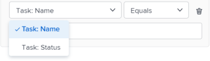

# Assegnare il lavoro in blocco utilizzando il Bilanciatore dei carichi di lavoro

<!--Audited: 07/2024-->

Puoi assegnare risorse a più attività e problemi in blocco utilizzando il Bilanciatore dei carichi di lavoro di Adobe Workfront.

Per informazioni generali sull&#39;assegnazione del lavoro agli utenti che utilizzano il Bilanciatore dei carichi di lavoro, vedere [Panoramica sull&#39;assegnazione del lavoro nel Bilanciatore dei carichi di lavoro](../../resource-mgmt/workload-balancer/assign-work-in-workload-balancer.md).

## Requisiti di accesso

+++ Espandi per visualizzare i requisiti di accesso per la funzionalità in questo articolo.

Per eseguire i passaggi descritti in questo articolo, è necessario disporre dei seguenti diritti di accesso:

<table style="table-layout:auto"> 
 <col> 
 <col> 
 <tbody> 
  <tr> 
   <td role="rowheader">piano Adobe Workfront</td> 
   <td> 
Qualsiasi 
 </td> 
  </tr> 
  <tr> 
   <td role="rowheader">Licenza Adobe Workfront</td> 
   <td>
Nuovo: Standard

       
oppure

       
Corrente: piano, quando si utilizza il Bilanciatore dei carichi di lavoro nell'area Risorse; 
       Utilizzare il Bilanciatore dei carichi di lavoro di un team o di un progetto
</td>
  </tr>
  <tr> 
   <td role="rowheader">Configurazioni del livello di accesso</td> 
   <td> 
Modifica accesso a:
 
    <ul> 
     <li>Gestione risorse</li> 
     <li>Progetti</li> 
     <li>Attività</li> 
     <li>Problemi</li> 
    </ul>
   </td> 
  </tr> 
  <tr> 
   <td role="rowheader">Autorizzazioni oggetto</td> 
   <td>Autorizzazioni Contribute o superiori per progetti, attività e problemi che includono l'opzione Crea assegnazioni</td> 
  </tr> 
 </tbody> 
</table>

Per ulteriori dettagli sulle informazioni contenute in questa tabella, vedere [Requisiti di accesso nella documentazione di Workfront](/help/quicksilver/administration-and-setup/add-users/access-levels-and-object-permissions/access-level-requirements-in-documentation.md).

+++

## Considerazioni per l&#39;esecuzione di assegnazioni in blocco nel Bilanciatore dei carichi di lavoro

* Puoi gestire rapidamente le assegnazioni degli utenti per più attività e problemi in uno o più progetti. Le modifiche nelle assegnazioni sono immediatamente visibili nel Bilanciatore dei carichi di lavoro.
* Non è possibile assegnare risorse ad elementi di lavoro completati o ad elementi di un progetto completato.
* Quando si assegnano gli utenti in blocco, è possibile effettuare le seguenti operazioni:

   * Assegnare un utente a tutti gli elementi di lavoro attualmente assegnati a una mansione.
   * Sostituisce le assegnazioni utente tra gli utenti.
   * Annulla l’assegnazione di un utente da tutti i suoi elementi di lavoro.

**ESEMPI**

* L&#39;utente è responsabile dell&#39;esecuzione delle assegnazioni utente per diversi nuovi progetti. I progetti sono stati creati originariamente da modelli e le mansioni sono già assegnate alle varie attività all’interno dei progetti. Si desidera assegnare un utente specifico, Jackie Simms, a tutte le attività attualmente assegnate a una mansione. È possibile utilizzare la funzione Assegna per assegnare queste attività a Jackie Simms.
* A Jackie Simms vengono assegnate 45 attività in 3 progetti diversi. Jackie lascia l&#39;organizzazione e ora devi riassegnare le sue attività a un altro utente. È possibile utilizzare la funzione Sostituisci per assegnare queste attività alla nuova persona.
* A un altro utente, Rick Kuvec, vengono assegnate 10 attività per 2 progetti diversi. Ti rendi conto che Rick è stato assegnato a queste attività per errore, ma non sai a chi devono essere assegnate in questo momento. È necessario annullare l&#39;assegnazione di Rick a tutte le attività contemporaneamente. È possibile utilizzare la funzione Annulla assegnazione per rimuovere Rick da queste attività.

## Assegnare il lavoro in blocco nel Bilanciatore dei carichi di lavoro

1. Andare al Bilanciatore dei carichi di lavoro nel punto in cui si desidera assegnare il lavoro.

   È possibile assegnare il lavoro agli utenti utilizzando il Bilanciatore dei carichi di lavoro nell&#39;area Risorse, a livello di progetto o di team. Per ulteriori informazioni sulla posizione del Bilanciatore dei carichi di lavoro in Workfront, vedere [Individuare il Bilanciatore dei carichi di lavoro](../../resource-mgmt/workload-balancer/locate-workload-balancer.md).

1. Fai clic su **Assegnazioni in blocco**  nella parte superiore del Bilanciatore dei carichi di lavoro.

   Il pannello Assegnazioni in blocco si apre a destra del Bilanciatore dei carichi di lavoro.

1. (Condizionale) Se accedi al Bilanciatore dei carichi di lavoro dall&#39;area Risorse o per un team, espandi il menu a discesa **Progetto: Nome** e utilizza i modificatori di filtro per selezionare il progetto o i progetti per i quali desideri effettuare le assegnazioni. Puoi selezionare i progetti per Nome (opzione predefinita) o per Stato.

   Per informazioni sui modificatori di filtri di Workfront, vedere [Filtri e modificatori di condizioni](../../reports-and-dashboards/reports/reporting-elements/filter-condition-modifiers.md).

   >[!NOTE]
   >
   >Il Nome progetto è selezionato per impostazione predefinita quando si accede al Bilanciatore dei carichi di lavoro per un progetto.

   

1. (Facoltativo) Fai clic su **Seleziona attività progetto** per selezionare l&#39;attività o le attività per le quali desideri effettuare le assegnazioni. Quindi, nel menu a discesa **Attività: Nome**, seleziona le attività per Nome (questa è l&#39;opzione predefinita) o Stato e utilizza i modificatori di filtro per cercare attività specifiche.

   Per informazioni sui modificatori di filtri di Workfront, vedere [Filtri e modificatori di condizioni](../../reports-and-dashboards/reports/reporting-elements/filter-condition-modifiers.md).

   >[!NOTE]
   >
   >Non è possibile selezionare le attività in stato Completato.

   

   >[!TIP]
   >
   >Lasciare vuota questa selezione se si desidera effettuare assegnazioni in blocco per problemi e attività.

1. (Facoltativo) Fai clic sull&#39;icona **Elimina**  accanto a uno dei criteri selezionati

   Oppure

   Fai clic su **Cancella tutto** nell&#39;angolo superiore destro del pannello Assegnazioni in blocco per rimuovere tutte le selezioni.

1. Seleziona una delle seguenti opzioni e continua con i passaggi descritti di seguito:

   * [Assegna utente](#assign-user)
   * [Sostituisci utente](#replace-user)
   * [Revoca assegnazione utente](#unassign-user)

   >[!TIP]
   >
   >Se nessun elemento corrisponde ai filtri selezionati, queste opzioni vengono disattivate.

### Assegna utente {#assign-user}

Quando si assegna un utente utilizzando Bulk Assignments (Assegnazioni in blocco) nel Bilanciatore dei carichi di lavoro, si verificano gli eventi seguenti:

* Un utente viene assegnato a tutti gli elementi di lavoro attualmente assegnati a un ruolo specificato all’interno dei progetti selezionati.
* L’utente non è assegnato ai seguenti tipi di elementi di lavoro:

   * Elementi già assegnati a un utente.
   * Elementi completati.

* Se l&#39;utente selezionato non è associato al ruolo specificato, il ruolo viene sostituito dall&#39;utente nel ruolo principale dell&#39;utente.

Per assegnare un utente agli elementi di lavoro precedentemente assegnati alle mansioni:

1. Inizia ad assegnare gli elementi di lavoro utilizzando le assegnazioni in blocco nel Bilanciatore dei carichi di lavoro come descritto in precedenza e seleziona **Assegna**.

1. Nel campo **Assegnazione ruolo**, fare clic sulla freccia dell&#39;elenco a discesa per scegliere da un elenco di ruoli. Vengono visualizzati solo i ruoli attualmente assegnati all’interno dei progetti specificati. Questo è un campo obbligatorio.

   

1. Nel campo **Utente da assegnare**, fare clic sulla freccia dell&#39;elenco a discesa per scegliere da un elenco di utenti suggeriti o per digitare il nome di un altro utente.

   Seleziona gli utenti dalle seguenti aree:

   * **Assegnazioni suggerite**: utenti che possono soddisfare il ruolo selezionato e che soddisfano i criteri per le assegnazioni avanzate. Per ulteriori informazioni, vedere [Panoramica assegnazioni avanzate](../../manage-work/tasks/assign-tasks/smart-assignments.md).
   * **Altre assegnazioni**: tutti gli utenti del sistema che possono eseguire il ruolo selezionato.

     >[!TIP]
     >
     >Solo i primi 50 utenti sono elencati nell&#39;area Altre assegnazioni.

   Dopo aver selezionato un utente, Workfront visualizza una nota relativa al numero di elementi a cui l’utente specificato verrà assegnato e alla mansione che sostituirà.

   >[!TIP]
   >
   >Tutti i ruoli dell’utente vengono visualizzati nell’elenco, sotto il nome dell’utente.

1. Fai clic su **Assegna**.

   I ruoli specificati vengono sostituiti con gli utenti selezionati.

   Viene visualizzata una conferma del numero di elementi di lavoro per i quali il ruolo selezionato è stato sostituito con l&#39;utente selezionato.

   

### Sostituisci utente {#replace-user}

È possibile sostituire un utente già assegnato agli elementi di lavoro con un altro utente nei progetti selezionati.

Quando sostituisci un utente con un altro utente utilizzando Bulk Assignments (Assegnazioni in blocco) nel Bilanciatore dei carichi di lavoro, si verificano gli eventi seguenti:

* L’utente sostitutivo viene assegnato a tutti gli elementi di lavoro attualmente assegnati a un utente originale all’interno dei progetti selezionati.

* Il nuovo utente non è assegnato ad alcun elemento di lavoro già contrassegnato come Completo.
* Se il ruolo associato al primo utente non corrisponde a nessuno dei ruoli del secondo utente, quest&#39;ultimo viene assegnato al suo ruolo principale.

Per sostituire un utente con un altro:

1. Inizia ad assegnare gli elementi di lavoro nel Bilanciatore dei carichi di lavoro come descritto in precedenza e seleziona **Sostituisci**.
1. Nel campo **Utente attualmente assegnato**, fare clic sulla freccia a discesa per scegliere da un elenco di utenti. Vengono visualizzati solo gli utenti attualmente assegnati a elementi di lavoro incompleti all’interno dei progetti specificati. Questo è un campo obbligatorio.

   

1. Nel campo **Utente da assegnare**, fare clic sulla freccia dell&#39;elenco a discesa per scegliere da un elenco di utenti suggeriti o per digitare un altro nome utente. Per impostazione predefinita, gli utenti elencati corrispondono ai criteri delle assegnazioni avanzate. Per ulteriori informazioni, vedere [Panoramica assegnazioni avanzate](../../manage-work/tasks/assign-tasks/smart-assignments.md).

   In Workfront viene visualizzata una nota relativa al numero di elementi in cui l&#39;utente attualmente assegnato sostituirà il secondo utente e ai ruoli che sostituirà.

   

1. Fare clic su **Sostituisci**.

   Il primo utente selezionato viene sostituito dal secondo utente in tutti gli elementi di lavoro del progetto selezionato.

   Si riceve una conferma del numero di elementi di lavoro per i quali l&#39;assegnazione utente originale è stata sostituita con il secondo utente selezionato.

### Revoca assegnazione utente {#unassign-user}

È possibile annullare l&#39;assegnazione di un utente a tutti gli elementi di lavoro a cui è assegnato nei progetti selezionati.

Quando si annulla l’assegnazione di un utente da tutte le sue assegnazioni utilizzando Assegnazioni in blocco nel Bilanciatore dei carichi di lavoro, si verificano i seguenti casi:

* L&#39;utente specificato viene rimosso da tutti gli elementi di lavoro a cui è assegnato.
* Se l’utente non assegnato è associato a ruoli, questi rimangono assegnati agli elementi di lavoro quando l’utente viene rimosso.

* Se l&#39;utente specificato è assegnato agli elementi di lavoro completati, l&#39;utente rimane assegnato a tali elementi di lavoro.

Per ulteriori informazioni sulle assegnazioni di utenti e ruoli, vedere [Panoramica sull&#39;assegnazione del lavoro nel Bilanciatore dei carichi di lavoro](../../resource-mgmt/workload-balancer/assign-work-in-workload-balancer.md).

Per annullare l’assegnazione di un utente agli elementi di lavoro nei progetti selezionati o per le attività o i problemi selezionati a cui è assegnato:

1. Inizia ad assegnare gli elementi di lavoro nel Bilanciatore dei carichi di lavoro come descritto in precedenza e seleziona **Annulla assegnazione**.

1. Nel campo **Utente per annullare l&#39;assegnazione**, fare clic sulla freccia a discesa per scegliere da un elenco di utenti. Vengono visualizzati solo gli utenti attualmente assegnati a elementi di lavoro incompleti all’interno dei progetti specificati. Questo è un campo obbligatorio.

   

   In Workfront viene visualizzata una nota relativa al numero di elementi a cui l&#39;utente attualmente assegnato verrà revocato.

   

1. Fare clic su **Annulla assegnazione**.\
   Si riceve una conferma del numero di elementi di lavoro in cui è stato rimosso l&#39;utente specificato.

