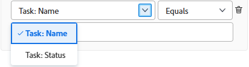

# Assegnare il lavoro in blocco utilizzando il bilanciamento dei carichi di lavoro

<!--Audited: 07/2024-->

Puoi assegnare risorse a più attività e problemi in blocco utilizzando il Bilanciatore dei carichi di lavoro di Adobe Workfront.

Per informazioni generali sull&#39;assegnazione del lavoro agli utenti che utilizzano il Bilanciatore dei carichi di lavoro, vedere [Panoramica sull&#39;assegnazione del lavoro nel Bilanciatore dei carichi di lavoro](../../resource-mgmt/workload-balancer/assign-work-in-workload-balancer.md).

## Requisiti di accesso

+++ Espandi per visualizzare i requisiti di accesso per la funzionalità descritta in questo articolo.

<table style="table-layout:auto"> 
 <col> 
 <col> 
 <tbody> 
  <tr> 
   <td>Pacchetto Adobe Workfront</td> 
   <td>
Qualsiasi
</td>
  </tr>
  <tr> 
   <td>Licenza di Adobe Workfront</td> 
   <td>
Standard

       
Pianificare, quando si utilizza il Bilanciatore dei carichi di lavoro nell'area Risorse; lavorare, quando si utilizza il Bilanciatore dei carichi di lavoro di un team o progetto
</td>
  </tr>
  <tr> 
   <td>Configurazioni del livello di accesso</td> 
   <td> 
Modifica accesso a:
 
    <ul> 
     <li>Gestione risorse</li> 
     <li>Progetti</li> 
     <li>Tasks</li> 
     <li>Problemi</li> 
    </ul>
   </td> 
  </tr> 
  <tr> 
   <td>Autorizzazioni sugli oggetti</td> 
   <td>Autorizzazioni di Contribute o superiori per i progetti, le attività e i problemi che includono Assegnazioni</td> 
  </tr> 
 </tbody> 
</table>

Per informazioni, consulta [Requisiti di accesso nella documentazione di Workfront](/help/quicksilver/administration-and-setup/add-users/access-levels-and-object-permissions/access-level-requirements-in-documentation.md).

+++

## Considerazioni per l&#39;esecuzione di assegnazioni in blocco nel Bilanciatore dei carichi di lavoro

* Puoi gestire rapidamente le assegnazioni di risorse per più attività e problemi in uno o più progetti. Le modifiche nelle assegnazioni sono immediatamente visibili nel Bilanciatore dei carichi di lavoro.
* Non è possibile assegnare risorse ad elementi di lavoro completati o ad elementi di un progetto completato.
* Quando si assegnano mansioni e utenti in blocco, è possibile effettuare le seguenti operazioni:

   * Sostituisci le assegnazioni tra utenti e ruoli in tutte le combinazioni valide.
   * Annulla l’assegnazione di un utente da tutti i suoi elementi di lavoro.

**ESEMPI**

* L&#39;utente è responsabile dell&#39;esecuzione delle assegnazioni utente per diversi nuovi progetti. I progetti sono stati creati originariamente da modelli e le mansioni sono già assegnate alle varie attività all’interno dei progetti. Si desidera assegnare un utente specifico, Jackie Simms, a tutte le attività attualmente assegnate a una mansione. È possibile utilizzare la funzione Sostituisci per assegnare queste attività a Jackie Simms.
* A Jackie Simms vengono assegnate 45 attività in 3 progetti diversi. Jackie lascia l&#39;organizzazione e ora devi riassegnare le sue attività a un altro utente. È possibile utilizzare la funzione Sostituisci per assegnare queste attività alla nuova persona.
* A un altro utente, Rick Kuvec, vengono assegnate 10 attività per 2 progetti diversi. Ti rendi conto che Rick è stato assegnato a queste attività per errore, ma non sai a chi devono essere assegnate in questo momento. È necessario annullare l&#39;assegnazione di Rick a tutte le attività contemporaneamente. È possibile utilizzare la funzione Annulla assegnazione per rimuovere Rick da queste attività.

## Assegnare il lavoro in blocco nel Bilanciatore dei carichi di lavoro

1. Andare al Bilanciatore dei carichi di lavoro nel punto in cui si desidera assegnare il lavoro.

   È possibile assegnare il lavoro agli utenti utilizzando il Bilanciatore dei carichi di lavoro nell&#39;area Risorse, a livello di progetto o di team. Per ulteriori informazioni sulla posizione del Bilanciatore dei carichi di lavoro in Workfront, vedere [Individuare il Bilanciatore dei carichi di lavoro](../../resource-mgmt/workload-balancer/locate-workload-balancer.md).

1. Fai clic su **Assegnazioni in blocco**  nella parte superiore del Bilanciatore dei carichi di lavoro.

   Il pannello Assegnazioni in blocco si apre a destra del Bilanciatore dei carichi di lavoro.

1. (Condizionale) Se accedi al Bilanciatore dei carichi di lavoro dall&#39;area Risorse o per un team, espandi il menu a discesa **Progetto: Nome** e utilizza i modificatori di filtro per selezionare il progetto o i progetti per i quali desideri effettuare le assegnazioni. Puoi selezionare i progetti per Nome (opzione predefinita) o per Stato.

   Per informazioni sui modificatori di filtri di Workfront, vedere [Filtri e modificatori di condizioni](../../reports-and-dashboards/reports/reporting-elements/filter-condition-modifiers.md).

   >[!NOTE]
   >
   >Il Nome progetto è selezionato per impostazione predefinita quando si accede al Bilanciatore dei carichi di lavoro per un progetto.

   

1. (Facoltativo) Fai clic su **Seleziona attività progetto** per selezionare l&#39;attività o le attività per le quali desideri effettuare le assegnazioni. Quindi, nel menu a discesa **Attività: Nome**, seleziona le attività per Nome (questa è l&#39;opzione predefinita) o Stato e utilizza i modificatori di filtro per cercare attività specifiche.

   Per informazioni sui modificatori di filtri di Workfront, vedere [Filtri e modificatori di condizioni](../../reports-and-dashboards/reports/reporting-elements/filter-condition-modifiers.md).

   >[!NOTE]
   >
   >Non è possibile selezionare le attività in stato Completato.

   

   >[!TIP]
   >
   >Lasciare vuota questa selezione se si desidera effettuare assegnazioni in blocco per problemi e attività.

1. (Facoltativo) Fai clic sull&#39;icona **Elimina**  accanto a uno dei criteri selezionati

   Oppure

   Fai clic su **Cancella tutto** nell&#39;angolo superiore destro del pannello Assegnazioni in blocco per rimuovere tutte le selezioni.

1. Seleziona una delle seguenti opzioni e continua con i passaggi descritti di seguito:

   * [Sostituisci risorsa](#replace-user)
   * [Annulla assegnazione risorsa](#unassign-user)

   >[!TIP]
   >
   >Se nessun elemento corrisponde ai filtri selezionati, queste opzioni vengono disattivate.

<!--

### Assign user {#assign-user}

When you assign a user using Bulk Assignments in the Workload Balancer, the following things occur:

* A user is assigned to all work items currently assigned to a specified role within the selected projects.
* The user is not assigned to the following types of work items:

   * Items that are already assigned to a user.
   * Completed items.

* If the user you selected is not associated with the specified role, the role is replaced by the user in the user's Primary Role.

To assign a user to work items previously assigned to job roles:

1. Start assigning work items using Bulk Assignments in the Workload Balancer as described above and select **Assign**. 

1. In the **Role assignment** field, click the drop-down arrow to choose from a list of roles. Only roles currently assigned within the specified projects are displayed. This is a required field. 

   

1. In the **User to assign** field, click the drop-down arrow to choose from a list of suggested users or to type another user's name.

   Select users from the following areas:

   * **Suggested Assignments**: Users who can fulfill the selected role and who match the criteria for Smart Assignments. For more information, see [Smart assignments overview](../../manage-work/tasks/assign-tasks/smart-assignments.md).
   * **Other Assignments**: All users in the system who can fulfill the selected role. 
   
      >[!TIP]
      >
      >Only the first 50 users are listed in the Other Assignments area.

   After selecting a user, Workfront displays a note about the number of items where the user you specified will be assigned and what job role they will replace.

   >[!TIP]
   >
   >All the roles of the user display in the list, under the user's name.

1. Click **Assign**.

   The specified roles are replaced with the users that you selected.

   You receive a confirmation about how many work items have had the selected role replaced with the selected user.

   

-->

### Sostituisci risorsa {#replace-user}

È possibile sostituire una risorsa già assegnata agli elementi di lavoro con un&#39;altra risorsa nei progetti selezionati.

La risorsa può essere:

* Ruolo con ruolo
* Utente con utente
* Utente con ruolo
* Ruolo con utente

Quando sostituisci una risorsa con un’altra risorsa utilizzando Bulk Assignments (Assegnazioni in blocco) nel Bilanciatore dei carichi di lavoro, si verificano gli eventi seguenti:

* La risorsa sostitutiva viene assegnata a tutti gli elementi di lavoro attualmente assegnati alla risorsa originale nei progetti selezionati.
* La nuova risorsa non è assegnata ad alcun elemento di lavoro già contrassegnato come Completato.
* Per la sostituzione da utente a utente, se il ruolo associato al primo utente non corrisponde a nessuno dei ruoli del secondo utente, al secondo utente viene assegnato il ruolo principale.

Per sostituire una risorsa con un’altra risorsa:

1. Selezionare gli elementi di lavoro nell&#39;area delle assegnazioni in blocco del Bilanciatore dei carichi di lavoro come descritto in precedenza e selezionare **Sostituisci risorsa**.
1. Nel campo **Risorsa attualmente assegnata**, fare clic sulla freccia dell&#39;elenco a discesa per scegliere da un elenco di risorse. Vengono visualizzate solo le risorse attualmente assegnate ad elementi di lavoro incompleti all&#39;interno dei progetti specificati. Questo è un campo obbligatorio.

   

1. Nel campo **Risorsa da assegnare**, fare clic sulla freccia a discesa per scegliere da un elenco di risorse suggerite o per digitare un&#39;altra mansione o nome utente. Le risorse elencate per prime per impostazione predefinita corrispondono ai criteri per le assegnazioni intelligenti. Per ulteriori informazioni, vedere [Panoramica assegnazioni avanzate](../../manage-work/tasks/assign-tasks/smart-assignments.md).

   In Workfront viene visualizzata una nota sul numero di elementi in cui la risorsa attualmente assegnata sostituirà la seconda risorsa.

1. Fare clic su **Sostituisci**.

   La prima risorsa viene sostituita dalla seconda risorsa in tutti gli elementi di lavoro del progetto o dell&#39;attività selezionata.

   Viene visualizzata una conferma del numero di elementi di lavoro per i quali l&#39;assegnazione originale è stata sostituita con la seconda risorsa selezionata.

### Annulla assegnazione risorsa {#unassign-user}

È possibile annullare l&#39;assegnazione di una risorsa da tutti gli elementi di lavoro a cui sono assegnati nei progetti selezionati.

Quando si annulla l’assegnazione di un utente da tutte le sue assegnazioni utilizzando Assegnazioni in blocco nel Bilanciatore dei carichi di lavoro, si verificano i seguenti casi:

* L&#39;utente specificato viene rimosso da tutti gli elementi di lavoro a cui è assegnato.
* Se l’utente non assegnato è associato a ruoli, questi rimangono assegnati agli elementi di lavoro quando l’utente viene rimosso.

* Se l&#39;utente specificato è assegnato agli elementi di lavoro completati, l&#39;utente rimane assegnato a tali elementi di lavoro.

Per ulteriori informazioni sulle assegnazioni di utenti e ruoli, vedere [Panoramica sull&#39;assegnazione del lavoro nel Bilanciatore dei carichi di lavoro](../../resource-mgmt/workload-balancer/assign-work-in-workload-balancer.md).

Per annullare l’assegnazione di un utente agli elementi di lavoro nei progetti selezionati o per le attività o i problemi selezionati a cui è assegnato:

1. Selezionare gli elementi di lavoro nell&#39;area delle assegnazioni in blocco del Bilanciatore dei carichi di lavoro come descritto in precedenza e selezionare **Annulla assegnazione risorsa**.

1. Nel campo **Utente per annullare l&#39;assegnazione**, fare clic sulla freccia a discesa per scegliere da un elenco di utenti. Vengono visualizzati solo gli utenti attualmente assegnati a elementi di lavoro incompleti all’interno dei progetti specificati. Questo è un campo obbligatorio.

   

   In Workfront viene visualizzata una nota relativa al numero di elementi a cui l&#39;utente attualmente assegnato verrà revocato.

1. Fare clic su **Annulla assegnazione**.\
   Si riceve una conferma del numero di elementi di lavoro in cui è stato rimosso l&#39;utente specificato.

