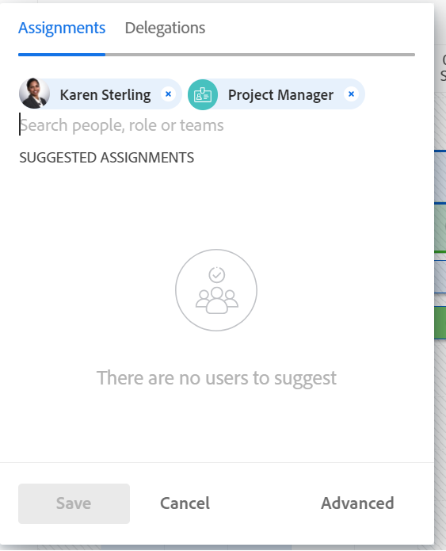

# Assegnare il lavoro manualmente utilizzando il Bilanciatore dei carichi di lavoro

È possibile assegnare manualmente gli elementi di lavoro agli utenti utilizzando il Bilanciatore dei carichi di lavoro di Adobe Workfront.

Per informazioni generali sull’assegnazione di lavoro agli utenti tramite il Bilanciatore dei carichi di lavoro, consulta [Panoramica sull’assegnazione del lavoro nel Bilanciatore dei carichi di lavoro](../../resource-mgmt/workload-balancer/assign-work-in-workload-balancer.md).

## Requisiti di accesso

Per eseguire i passaggi descritti in questo articolo, è necessario disporre dei seguenti diritti di accesso:

<table style="table-layout:auto"> 
 <col> 
 <col> 
 <tbody> 
  <tr> 
   <td role="rowheader">Piano Adobe Workfront*</td> 
   <td> 
Qualsiasi 
 </td> 
  </tr> 
  <tr> 
   <td role="rowheader">Licenza Adobe Workfront*</td> 
   <td> 
Pianificare, quando si utilizza il Bilanciatore dei carichi di lavoro nell'area Risorse

   
Utilizzare il Bilanciatore dei carichi di lavoro di un team o di un progetto

 </td> 
  </tr> 
  <tr> 
   <td role="rowheader">Livello di accesso*</td> 
   <td> 
Modifica accesso a:
 
    <ul> 
     <li> 
Gestione risorse
 </li> 
     <li> 
Progetti
 </li> 
     <li> 
Attività
 </li> 
     <li> 
Problemi
 </li> 
    </ul> 
<b>NOTA</b>

Se non disponi ancora dell’accesso, chiedi all’amministratore di Workfront se ha impostato restrizioni aggiuntive nel tuo livello di accesso. Per informazioni su come un amministratore di Workfront può modificare il livello di accesso, consulta <a href="../../administration-and-setup/add-users/configure-and-grant-access/create-modify-access-levels.md" class="MCXref xref">Creare o modificare livelli di accesso personalizzati</a>.
 </td>
</tr> 
  <tr> 
   <td role="rowheader">Autorizzazioni oggetto</td> 
   <td> 
Autorizzazioni di Contribute o superiori per i progetti, le attività e i problemi che includono Assegnazioni
 
Per informazioni sulla richiesta di accesso aggiuntivo, consulta <a href="../../workfront-basics/grant-and-request-access-to-objects/request-access.md" class="MCXref xref">Richiedi accesso agli oggetti </a>.
 </td> 
  </tr> 
 </tbody> 
</table>

&#42;Per conoscere il piano, il tipo di licenza o l&#39;accesso di cui si dispone, contattare l&#39;amministratore Workfront.

## Assegnazione manuale del lavoro nel Bilanciatore dei carichi di lavoro

È possibile assegnare elementi di lavoro non ancora assegnati a un utente o riassegnare elementi assegnati a utenti nel Bilanciatore dei carichi di lavoro.

1. Andare al Bilanciatore dei carichi di lavoro nel punto in cui si desidera assegnare il lavoro.

   È possibile assegnare il lavoro agli utenti utilizzando il Bilanciatore dei carichi di lavoro nell&#39;area Risorse, a livello di progetto o di team. Per ulteriori informazioni sulla posizione del Bilanciatore dei carichi di lavoro in Workfront, consulta [Individuare il Bilanciatore dei carichi di lavoro](../../resource-mgmt/workload-balancer/locate-workload-balancer.md).

1. (Facoltativo) Vai al **Lavoro non assegnato** e applica un filtro per visualizzare attività o problemi

   Oppure

   Vai a **Lavoro assegnato** ed espandere il nome di un utente per visualizzare gli elementi di lavoro assegnati, se si desidera riassegnare i relativi elementi.

1. Fai clic su **Menu Altro**  a sinistra del nome di un elemento di lavoro, quindi fare clic su **Assegna a**.

   

   >[!TIP]
   >
   >Per assegnare attività o problemi, è inoltre possibile utilizzare le seguenti scelte rapide:
   >
   >* In Windows: CTRL+clic sulla barra delle attività o dei problemi.
   >* In Mac: CMD+fai clic sulla barra delle attività o dei problemi.

1. Esegui una delle operazioni seguenti:

   * Inizia a digitare il nome di un utente, una mansione o un team che desideri assegnare all’elemento in **Cerca persone, ruolo o team** , selezionarlo quando viene visualizzato nell&#39;elenco, quindi fare clic su **Salva**.

   >[!TIP]
   >
   >Quando aggiungi un utente, osserva l’avatar, il ruolo principale dell’utente e il suo indirizzo e-mail per distinguere gli utenti con nomi identici.
   >
   >Gli utenti devono essere associati ad almeno una mansione per visualizzarla quando vengono aggiunti.
   >
   > Per consentire agli utenti di visualizzare le e-mail degli utenti, nel proprio livello di accesso deve essere abilitata l’impostazione Visualizza informazioni di contatto. Per informazioni, consulta [Concedere l’accesso agli utenti](../../administration-and-setup/add-users/configure-and-grant-access/grant-access-other-users.md).

   

   >[!TIP]
   >
   > Se l’amministratore di Workfront o di gruppo ha abilitato le deleghe nell’ambiente, utilizza la scheda Assegnazioni per assegnare gli utenti all’attività o al problema. Utilizzare la scheda Deleghe per visualizzare gli utenti delegati all&#39;elemento di lavoro. Per informazioni sulla delega del lavoro, consulta [Gestire la delega di attività e problemi](../../manage-work/delegate-work/how-to-delegate-work.md).

   In questo modo l&#39;elemento di lavoro viene assegnato o riassegnato agli assegnatari specificati.

   Se si assegna un elemento solo a un team o a una mansione, l&#39;elemento viene visualizzato solo nell&#39;area Lavoro non assegnato. È necessario assegnare gli elementi di lavoro agli utenti per visualizzarli nell&#39;area Lavoro assegnato del Bilanciatore dei carichi di lavoro.

   >[!TIP]
   >
   >Puoi assegnare più utenti, mansioni o team. Puoi assegnare solo utenti attivi, mansioni e team.
   >
   >
   >Se un utente, una mansione o un team è stato assegnato prima della disattivazione, rimane assegnato all&#39;elemento di lavoro. In questo caso, consigliamo quanto segue:
   >
   >   
   >   
   >   * Riassegnare l&#39;elemento di lavoro alle risorse attive.
   >   * Associare gli utenti di un team disattivato a un team attivo e riassegnare l&#39;elemento di lavoro al team attivo.
   >   
   >

   * Clic **Avanzate** per accedere ad Assegnazioni avanzate.

     Per ulteriori informazioni sull&#39;esecuzione di assegnazioni avanzate, vedere [Crea assegnazioni avanzate](../../manage-work/tasks/assign-tasks/create-advanced-assignments.md).

1. (Facoltativo) Fai clic su **Mostra icona allocazioni** , quindi fare clic su **Menu Altro**  > **Modifica allocazioni**.

   Oppure

   Fare doppio clic su un&#39;allocazione giornaliera o settimanale per modificare la quantità di tempo assegnata all&#39;elemento di lavoro.

   Per informazioni sulla modifica delle allocazioni utente nel Bilanciatore dei carichi di lavoro, vedi la sezione &quot;Modifica allocazioni utente&quot; nell’articolo [Gestire le allocazioni utente nel Bilanciatore dei carichi di lavoro](../../resource-mgmt/workload-balancer/manage-user-allocations-workload-balancer.md).

   Per informazioni sulla rimozione delle assegnazioni da un elemento di lavoro tramite il Bilanciatore dei carichi di lavoro, vedere [Revoca assegnazione lavoro nel Bilanciatore dei carichi di lavoro](../../resource-mgmt/workload-balancer/unassign-work-in-workload-balancer.md).

    
