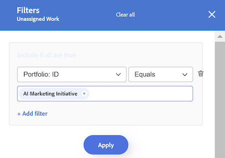
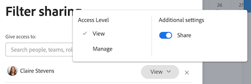

# Filtrare le informazioni nel Bilanciatore dei carichi di lavoro

<!-- Audited: 6/2025 -->

<!--
(when they add custom fields to fitlering, add the caveat you added for the Resource Planner : only field NAMES and not LABELS are to be found in the drop-down >> ADD THIS IN THE STEP BELOW WHEN ADDING A FILTER)
-->

In qualità di responsabile delle risorse, puoi utilizzare il Bilanciatore dei carichi di lavoro per visualizzare e gestire il carico di lavoro degli utenti. Per informazioni più generali sul Bilanciatore dei carichi di lavoro, vedi i seguenti articoli:

* [Panoramica del Bilanciatore dei carichi di lavoro](../../resource-mgmt/workload-balancer/overview-workload-balancer.md)
* [Navigare nel Bilanciatore dei carichi di lavoro](../../resource-mgmt/workload-balancer/navigate-the-workload-balancer.md)

>[!IMPORTANT]
>
>Per trovare in modo efficiente gli elementi di lavoro e concentrarsi sugli utenti o sugli elementi gestiti, si consiglia vivamente di utilizzare i filtri nel Bilanciatore dei carichi di lavoro. Questo consente di visualizzare le informazioni corrette prima di iniziare a gestire le assegnazioni delle risorse.
>
>Quando esci dal Bilanciatore dei carichi di lavoro dopo aver salvato e applicato un nuovo filtro, il filtro viene comunque applicato anche dopo la disconnessione e la riaccesso.

Questo articolo contiene informazioni sui filtri nel Bilanciatore dei carichi di lavoro. Per informazioni sui filtri in Workfront, vedere [Panoramica sui filtri](../../reports-and-dashboards/reports/reporting-elements/filters-overview.md).

## Requisiti di accesso

<table style="table-layout:auto"> 
 <col> 
 <col>
 <tbody> 
  <tr> 
   <td>Pacchetto Adobe Workfront</td> 
   <td>
Qualsiasi
</td>
  </tr>
  <tr> 
   <td>Licenza Adobe Workfront</td> 
   <td>
Standard

       
Pianificare, quando si utilizza il Bilanciatore dei carichi di lavoro nell'area Risorse; lavorare, quando si utilizza il Bilanciatore dei carichi di lavoro di un team o progetto
</td>
  </tr>
  <tr> 
   <td>Configurazioni del livello di accesso</td> 
   <td> 
Accesso di visualizzazione o superiore ai seguenti elementi:
 
    <ul> 
     <li>Gestione risorse</li> 
     <li>Progetti</li> 
     <li>Attività</li> 
     <li>Problemi</li>
     <li>Filtri, visualizzazioni e raggruppamenti</li>
    </ul>
    
Modificare l’accesso a Filtri, Viste e Raggruppamenti durante la creazione o la modifica di filtri 
 </td>
  </tr> 
  <tr> 
   <td>Autorizzazioni oggetto</td> 
   <td> 
Visualizza o autorizzazioni superiori per i progetti, le attività e i problemi

   
Gestire le autorizzazioni per i filtri da modificare o eliminare

   </td> 
  </tr> 
 </tbody> 
</table>

Per informazioni, consulta [Requisiti di accesso nella documentazione di Workfront](/help/quicksilver/administration-and-setup/add-users/access-levels-and-object-permissions/access-level-requirements-in-documentation.md).

## Panoramica dei filtri nel Bilanciatore dei carichi di lavoro

Quando si lavora con i filtri nel Bilanciatore dei carichi di lavoro, considera quanto segue:

* A seconda della posizione da cui accedi al Bilanciatore dei carichi di lavoro, Workfront potrebbe già filtrare le informazioni. Per ulteriori informazioni, vedi la seguente sezione in questo articolo: [Filtri preapplicati nel Bilanciatore dei carichi di lavoro](#pre-applied-filters-in-the-workload-balancer).
* Puoi creare e applicare un filtro senza salvarlo, oppure salvare un filtro da riutilizzare in un secondo momento.
* Quando applichi un filtro senza salvarlo, puoi ripristinare gli elenchi originali aggiornando la pagina.
* Puoi visualizzare i filtri creati o quelli condivisi da altri utenti con te.
* Quando elimini o modifichi un filtro condiviso, questo viene eliminato o modificato anche per tutti gli utenti con cui lo hai condiviso.
* I filtri creati nel Bilanciatore dei carichi di lavoro in un’area non sono disponibili in altre aree.

  Ad esempio, i filtri creati nell’area Risorse non sono disponibili nel Bilanciatore dei carichi di lavoro di un progetto o di un team.

  Per informazioni su dove individuare il Bilanciatore dei carichi di lavoro, vedere [Individuare il Bilanciatore dei carichi di lavoro](../../resource-mgmt/workload-balancer/locate-workload-balancer.md).

* Puoi visualizzare gli elementi che corrispondono ai filtri selezionati solo se corrispondono anche alle date nella timeline visualizzata nella schermata del Bilanciatore dei carichi di lavoro.

## Filtri preapplicati nel Bilanciatore dei carichi di lavoro {#pre-applied-filters-in-the-workload-balancer}

Il Bilanciatore dei carichi di lavoro visualizza le informazioni in due aree separate:

* **Area Lavoro non assegnato**: elementi di lavoro non ancora assegnati agli utenti.
* **Area di lavoro assegnata**: elementi di lavoro assegnati agli utenti.

  Per informazioni su ciò che viene visualizzato in ciascuna area, consulta [Navigare nel Bilanciatore dei carichi di lavoro](../../resource-mgmt/workload-balancer/navigate-the-workload-balancer.md).

>[!IMPORTANT]
>
>Ogni area del Bilanciatore dei carichi di lavoro ha un proprio set di filtri che funzionano in modo indipendente l’uno dall’altro. È necessario configurare entrambi i filtri per indicare le informazioni che si desidera visualizzare in ogni area.

Il Bilanciatore dei carichi di lavoro visualizza gli utenti e i relativi elementi di lavoro.
Gli elementi di lavoro assegnati agli utenti vengono visualizzati solo quando le date degli elementi corrispondono all’intervallo di tempo visualizzato sullo schermo.

A seconda della posizione da cui accedi al Bilanciatore dei carichi di lavoro, le aree Non assegnato e Assegnato vengono già filtrate in base a determinati criteri, come descritto nella tabella seguente:

<table style="table-layout:auto"> 
 <col> 
 <col> 
 <col> 
 <tbody> 
  <tr> 
   <td role="rowheader"><strong>Area Workfront in cui è possibile accedere al Bilanciatore dei carichi di lavoro</strong></td> 
   <td><b>Elementi visualizzati nell'area Lavoro non assegnato per impostazione predefinita</b> </td> 
   <td><b>Elementi visualizzati nell'area Lavoro assegnato per impostazione predefinita</b> </td> 
  </tr> 
  <tr> 
   <td role="rowheader">Area risorse</td> 
   <td>Per impostazione predefinita, nessun elemento viene visualizzato qui. È necessario personalizzare i filtri per visualizzare gli elementi di lavoro in quest'area.</td> 
   <td>Utenti membri di uno qualsiasi dei team e dei relativi elementi di lavoro. </td> 
  </tr> 
  <tr> 
   <td role="rowheader">Un team</td> 
   <td>Elementi di lavoro assegnati al team o al team e a una mansione. </td> 
   <td> 
Utenti membri del team selezionato e relativi elementi di lavoro.
 </td> 
  </tr> 
  <tr> 
   <td role="rowheader">Un progetto</td> 
   <td> 
In quest'area vengono visualizzati gli elementi di lavoro non assegnati o gli elementi assegnati a team o mansioni nel progetto selezionato.
 </td> 
   <td> 
Utenti assegnati ad almeno un elemento di lavoro nel progetto selezionato e ai relativi elementi di lavoro nel progetto quando è selezionato il filtro predefinito di sistema <b>Elementi di lavoro di questo progetto</b>. 

Quando il filtro predefinito di sistema <b>Elementi di lavoro di questo progetto</b> è deselezionato, nell'area Lavoro assegnato di un progetto vengono visualizzati tutti gli elementi di lavoro degli utenti assegnati ad almeno un elemento del progetto selezionato.    Questo filtro è deselezionato per impostazione predefinita.

 <b>Nota</b>: è possibile abilitare l'opzione <b>Mostra tutti gli utenti</b> nel Bilanciatore dei carichi di lavoro del progetto per visualizzare tutti gli utenti nel sistema. Per ulteriori informazioni, consulta <a href="../workload-balancer/navigate-the-workload-balancer.md" class="MCXref xref">Navigare nel Bilanciatore dei carichi di lavoro</a>

</td> 
  </tr> 
 </tbody> 
</table>

## Creare filtri del Bilanciatore dei carichi di lavoro

Il processo di creazione dei filtri per le aree Lavoro non assegnato e Lavoro assegnato nel Bilanciatore dei carichi di lavoro è identico indipendentemente da dove si accede al Bilanciatore dei carichi di lavoro. Per informazioni sull&#39;individuazione del Bilanciatore dei carichi di lavoro, vedere [Individuare il Bilanciatore dei carichi di lavoro](../../resource-mgmt/workload-balancer/locate-workload-balancer.md).

Puoi creare un filtro da zero o modificare uno dei filtri predefiniti. Per informazioni sui filtri esistenti che è possibile modificare, vedere la sezione [Modificare un filtro esistente nel Bilanciatore dei carichi di lavoro](#edit-an-existing-filter-in-the-workload-balancer) in questo articolo.

1. Passa al Bilanciatore dei carichi di lavoro.

   Per informazioni sull&#39;accesso al Bilanciatore dei carichi di lavoro, vedere [Navigare nel Bilanciatore dei carichi di lavoro](../../resource-mgmt/workload-balancer/navigate-the-workload-balancer.md).

1. Nell&#39;angolo superiore destro delle aree **Lavoro non assegnato** o **Lavoro assegnato**, fare clic sull&#39;icona **Filtro** . La casella **Filtri** viene visualizzata a destra e il nome dell&#39;area in cui si sta creando il filtro viene visualizzato nell&#39;intestazione.

   

1. (Facoltativo e condizionale) Se accedi al Bilanciatore dei carichi di lavoro nell&#39;area **Risorse**, il filtro predefinito potrebbe essere già applicato all&#39;area **Lavoro assegnato**. Puoi modificare e salvare una copia del filtro Predefinito.

   >[!TIP]
   >
   >Il filtro Predefinito visualizza gli utenti che appartengono a uno qualsiasi dei team e i relativi elementi di lavoro. Puoi modificare una copia di questo filtro.

   Se accedi al [!UICONTROL Bilanciatore dei carichi di lavoro] da un progetto, il filtro **Elementi di lavoro** del progetto potrebbe essere già applicato. Vengono visualizzati solo gli elementi di lavoro assegnati agli utenti del progetto. Puoi duplicare e salvare una copia di questo filtro.

   Per impostazione predefinita, nel [!UICONTROL Bilanciatore dei carichi di lavoro] del progetto vengono visualizzati tutti gli elementi di lavoro assegnati a tutti gli utenti del progetto.

1. Fare clic su **Nuovo filtro**.

1. Per creare un filtro, eseguire le operazioni seguenti:

   1. Selezionare un nome di campo nel primo menu a discesa o fare clic su **Sfoglia campi** nella parte inferiore del menu a discesa per digitare il nome di un campo che non viene visualizzato per impostazione predefinita.

      >[!IMPORTANT]
      >
      >Quando si fa riferimento a campi personalizzati, è necessario digitare il nome del campo e non l’etichetta del campo. L’etichetta del campo viene visualizzata in un modulo personalizzato associato a un oggetto. Per informazioni sulla differenza tra l&#39;etichetta e il nome di un campo personalizzato, vedere [Creare un modulo personalizzato](/help/quicksilver/administration-and-setup/customize-workfront/create-manage-custom-forms/form-designer/design-a-form/design-a-form.md).

   1. (Condizionale) Se hai fatto clic su **Sfoglia campi**, digita il nome di un campo nel campo **Cerca** e selezionalo quando viene visualizzato nell&#39;elenco.

      

      >[!TIP]
      >
      >Puoi selezionare un campo dalle sezioni seguenti:
      >
      >* **Selezioni recenti**: i campi filtrati di recente.
      >* **Suggerito**: i campi più comunemente utilizzati.

   1. Selezionare un modificatore dal secondo menu a discesa. Per informazioni sui modificatori di filtri di Workfront, vedere [Filtri e modificatori di condizioni](../../reports-and-dashboards/reports/reporting-elements/filter-condition-modifiers.md).
   1. Seleziona o digita un valore per il campo per cui stai filtrando.

      >[!NOTE]
      >
      > Quando si desidera visualizzare gli oggetti di lavoro di un portfolio specifico, è possibile applicare il seguente filtro: Portfolio ID è uguale a &lt; NOME PORTFOLIO >.
      >
      >
      >
      >Per escludere i progetti con lo stato In sospeso, è necessario applicare il seguente filtro: Progetto: Stato diverso da In sospeso. Questo impedisce la visualizzazione degli elementi di lavoro nei progetti in sospeso nel Bilanciatore dei carichi di lavoro.
      >
      >

   1. (Facoltativo) Fai clic sull&#39;icona **Elimina**  per rimuovere un criterio di filtro.

1. (Facoltativo) Fai clic su **Aggiungi filtro** per aggiungere un altro criterio di filtro, quindi ripeti le azioni del passaggio 4.

   <!--(NOTE: ensure this stays correct)-->

1. Fare clic su **Applica** per applicare i risultati del filtro all&#39;area del Bilanciatore dei carichi di lavoro selezionata senza salvarla. L&#39;elenco degli elementi di lavoro viene aggiornato a sinistra.

   >[!IMPORTANT]
   >
   >I risultati vengono visualizzati nel Bilanciatore dei carichi di lavoro quando tutte le istruzioni di filtro aggiunte sono true contemporaneamente.

   Il filtro viene mantenuto finché non aggiorni la pagina e il pulsante **Applica** viene sostituito con un pulsante **Salva come nuovo**.

1. Fai clic su **Salva come nuovo** per salvare il filtro per utilizzi futuri.

   >[!TIP]
   >
   >Facendo clic su **Annulla** in qualsiasi momento si ritorna all&#39;area di creazione del filtro.

1. Nel campo **Filtro senza titolo** immettere il nuovo nome del filtro.
1. (Facoltativo) Seleziona un&#39;icona per il nuovo filtro dal menu a discesa **Icon**.

   

1. (Facoltativo) Aggiungi un filtro **Descrizione**. La descrizione viene visualizzata sotto il nome del filtro nell’elenco dei filtri.
1. Fai clic su **Salva**. Il filtro salvato viene visualizzato nell&#39;area **I miei filtri** della casella del filtro.

   Per informazioni sull&#39;applicazione di filtri salvati, vedere la sezione [Eliminare un filtro salvato nel Bilanciatore dei carichi di lavoro](#delete-a-saved-filter-in-the-workload-balancer) in questo articolo.

1. (Facoltativo) Passa il puntatore del mouse sull&#39;icona **Filtro**  nell&#39;angolo superiore destro delle aree **Lavoro non assegnato** o **Lavoro assegnato** per visualizzare una descrizione comando con il nome o il numero di filtri attualmente applicati.

   

## Duplicare un filtro

Puoi duplicare e modificare un filtro per crearne uno nuovo.

1. Passa al Bilanciatore dei carichi di lavoro.

   Per informazioni sull&#39;accesso al Bilanciatore dei carichi di lavoro, vedere [Navigare nel Bilanciatore dei carichi di lavoro](../../resource-mgmt/workload-balancer/navigate-the-workload-balancer.md).

1. Nell&#39;angolo superiore destro delle aree **Lavoro non assegnato** o **Lavoro assegnato**, fare clic sull&#39;icona **Filtro** .  La casella **Filtri** viene visualizzata a destra e il nome dell&#39;area in cui si sta duplicando il filtro viene visualizzato nell&#39;intestazione.

1. Passa il puntatore del mouse su un filtro esistente, quindi fai clic sul menu **Altro** .
1. Fai clic su **Duplica**.

   >[!TIP]
   >
   > Durante la modifica di un filtro, puoi fare clic sul menu **Altro**  nell&#39;angolo inferiore sinistro della casella **Modifica filtro**, quindi fare clic su **Duplica**.

1. Modifica le seguenti informazioni per il filtro duplicato:

   * Nome
   * Icona
   * Descrizione
   * Qualsiasi campo, modificatore o valore.

1. (Facoltativo) Fai clic su **Aggiungi filtro** per aggiungere altre istruzioni al filtro duplicato.
1. Fai clic su **Salva** per salvare il filtro duplicato nell&#39;area **I miei filtri**. Il filtro originale rimane invariato e il filtro duplicato viene salvato come nuovo filtro.

## Modificare un filtro esistente nel Bilanciatore dei carichi di lavoro {#edit-an-existing-filter-in-the-workload-balancer}

Puoi modificare un filtro salvato nel Bilanciatore dei carichi di lavoro.

>[!TIP]
>
>Quando modifichi un filtro condiviso con altri, vengono visualizzate anche le modifiche apportate.

1. Passa al Bilanciatore dei carichi di lavoro.

   Per informazioni sull&#39;accesso al Bilanciatore dei carichi di lavoro, vedere [Navigare nel Bilanciatore dei carichi di lavoro](../../resource-mgmt/workload-balancer/navigate-the-workload-balancer.md).

1. Nell&#39;angolo superiore destro delle aree **Unassigned** o **Assigned Work**, fare clic sull&#39;icona **Filter** . Il generatore di filtri viene visualizzato a destra.

1. Passa il puntatore del mouse sul filtro che desideri modificare, quindi fai clic sull&#39;icona **Modifica** .

1. Esegui una delle operazioni seguenti:

   * Modificare le istruzioni di filtro.
   * Fare clic su **Aggiungi filtro** per aggiungere nuove istruzioni di filtro.
   * Fai clic sull&#39;icona **Elimina**  per rimuovere le istruzioni di filtro esistenti.

1. (Facoltativo) Fai clic su **Applica**. I risultati vengono aggiornati nel Bilanciatore dei carichi di lavoro a sinistra per illustrare le modifiche apportate al filtro.

1. Fai clic su **Salva**. I risultati vengono aggiornati nel Bilanciatore dei carichi di lavoro a sinistra e il filtro viene aggiornato con le nuove informazioni selezionate.

## Eliminare un filtro salvato nel Bilanciatore dei carichi di lavoro {#delete-a-saved-filter-in-the-workload-balancer}

Prima di eliminare un filtro, considera quanto segue:

* Non puoi recuperare i filtri eliminati.
* Non puoi eliminare i filtri predefiniti.
* Non puoi eliminare un filtro non salvato. Vengono rimossi automaticamente dopo la disconnessione e dopo aver effettuato di nuovo l’accesso a Workfront.
* Quando elimini un filtro condiviso, questo viene eliminato anche per tutti gli utenti con cui è condiviso.
* Dopo aver eliminato tutti i filtri salvati, il Bilanciatore dei carichi di lavoro viene visualizzato in base ai valori predefiniti originali.

>[!NOTE]
>
>Quando elimini un filtro condiviso con altri, verrà eliminato anche per loro.

1. Passa al Bilanciatore dei carichi di lavoro.

   Per informazioni sull&#39;accesso al Bilanciatore dei carichi di lavoro, vedere [Navigare nel Bilanciatore dei carichi di lavoro](../../resource-mgmt/workload-balancer/navigate-the-workload-balancer.md).

1. Nell&#39;angolo superiore destro delle aree **Lavoro non assegnato** o **Lavoro assegnato**, fare clic sull&#39;icona **Filtro** . La casella **Filtri** viene visualizzata a destra.

1. Passa il puntatore del mouse su un filtro, fai clic sul menu **Altro** , quindi fai clic su **Elimina**.

   >[!TIP]
   >
   >Durante la modifica di un filtro, è possibile fare clic sul menu **Altro**  nell&#39;angolo inferiore sinistro della casella **Modifica filtro**, quindi fare clic su **Elimina**.

1. (Facoltativo) Fai clic su **Annulla** per annullare l&#39;eliminazione e tornare all&#39;elenco dei filtri.
1. Fai clic su **Elimina** per confermare l&#39;eliminazione. Il filtro viene eliminato per te e per tutti gli utenti che dispongono di autorizzazioni per esso.

## Condividere un filtro nel Bilanciatore dei carichi di lavoro

Puoi condividere un filtro creato o condiviso con te da altri utenti.

Quando condividi i filtri nel Bilanciatore dei carichi di lavoro, tieni presente quanto segue:

* Puoi condividere i filtri con utenti attivi, team, ruoli e aziende oppure renderli visibili per tutti gli utenti nell’istanza di Workfront.
* I filtri condivisi nell’area Risorse non sono visibili nel Bilanciatore dei carichi di lavoro di un progetto o di un team.
* I filtri del Bilanciatore dei carichi di lavoro condivisi con altri utenti non sono visibili in altre aree di Workfront.

Per condividere un filtro:

1. Passa al Bilanciatore dei carichi di lavoro.

   Per informazioni sull&#39;accesso al Bilanciatore dei carichi di lavoro, vedere [Navigare nel Bilanciatore dei carichi di lavoro](../../resource-mgmt/workload-balancer/navigate-the-workload-balancer.md).

1. Nell&#39;angolo superiore destro delle aree **Lavoro non assegnato** o **Lavoro assegnato**, fare clic sull&#39;icona **Filtro** . La casella **Filtri** viene visualizzata a destra.

1. Passa il puntatore del mouse su un filtro, quindi fai clic sul menu **Altro** .

1. Fai clic su **Condividi**. Viene visualizzata la casella **Condivisione filtro**.

   >[!TIP]
   >
   > Durante la modifica di un filtro, è possibile fare clic sul menu **Altro**  nell&#39;angolo inferiore sinistro della casella **Modifica filtro**, quindi fare clic su **Condividi**.

1. Nel campo **Concedi l&#39;accesso a**, digita i nomi di utenti, team, ruoli, gruppi o aziende con cui vuoi condividere il filtro, quindi selezionali quando vengono visualizzati.

1. (Facoltativo) Per modificare le autorizzazioni del filtro per un&#39;entità, fai clic sulla freccia rivolta a destra accanto al nome, quindi seleziona **Visualizza** o **Gestisci**.

   

1. (Facoltativo) Abilita o disabilita le autorizzazioni aggiuntive per un’entità effettuando una delle seguenti operazioni:

   1. Fai clic su **Visualizza** e disabilita l&#39;opzione **Condividi**. Questa opzione è attivata per impostazione predefinita.

   1. Fai clic su **Gestisci** e abilita l&#39;opzione **Condividi** o **Elimina**.

   >[!TIP]
   >
   >Gli utenti non possono ricevere un’autorizzazione superiore al loro livello di accesso. Se non hanno accesso a Modifica filtri nel loro livello di accesso, non possono ricevere le autorizzazioni per gestire un filtro. Workfront disabilita l’opzione Gestisci per questi utenti.

1. Fai clic su **Condividi**. Il filtro è condiviso con le entità specificate e viene visualizzato nell&#39;area **Condiviso con me** della casella **Filtri**.

   

<!--   

## Add a filter to your favorites list

You can mark a filter as a favorite for quicker access to it. 

The filters that you mark as a favorite do not count towards your system Favorites list. There is no limit for how many filters you can favorite. 

1. Go to the Workload Balancer
1. Click the **Filter** icon  in the upper-right corner of the **Unassigned Work** or **Assigned Work** areas. The filter builder box displays on the right. 
1. Mouse over a filter, then click the **Favorite** . 
(NOTE: insert screen shot here with Favorite as part of this menu - same as above ones but with Favorite)
1. The filter is listed in the **Favorited** section inside the filter panel. 
1. (Optional) Click the **Favorite** icon again to remove the filter from the list of favorite filters
(I logged bugs for "Favorited" and "Unfavorite" wordings - make sure these have not updated)
-->
