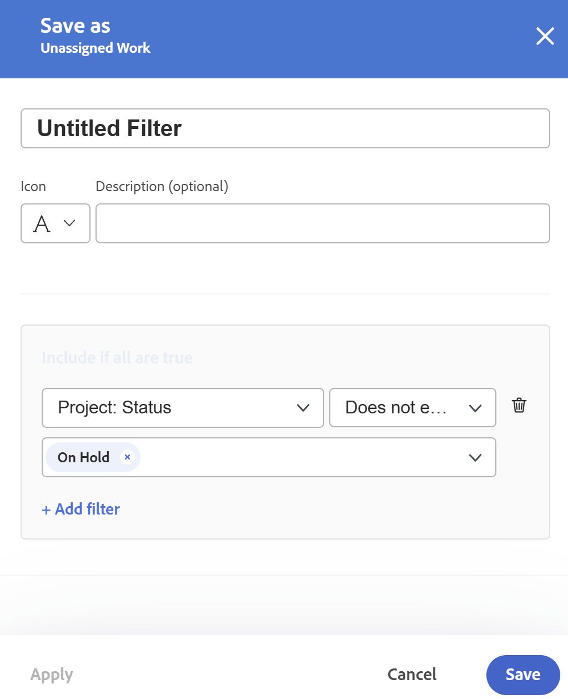

# Filtrare le informazioni nel Bilanciatore dei carichi di lavoro

<!--
(when they add custom fields to fitlering, add the caveat you added for the Resource Planner : only field NAMES and not LABELS are to be found in the drop-down >> ADD THIS IN THE STEP BELOW WHEN ADDING A FILTER)
-->

In qualità di responsabile delle risorse, puoi utilizzare il Bilanciatore dei carichi di lavoro per visualizzare e gestire il carico di lavoro degli utenti. Per informazioni più generali sul Bilanciatore dei carichi di lavoro, vedi i seguenti articoli:

* [Panoramica del Bilanciatore dei carichi di lavoro](../../resource-mgmt/workload-balancer/overview-workload-balancer.md)
* [Navigare nel Bilanciatore dei carichi di lavoro](../../resource-mgmt/workload-balancer/navigate-the-workload-balancer.md)

>[!IMPORTANT]
>
>Per trovare in modo efficiente gli elementi di lavoro e concentrarsi sugli utenti o sugli elementi gestiti, si consiglia vivamente di utilizzare i filtri nel Bilanciatore dei carichi di lavoro. Questo consente di visualizzare le informazioni corrette prima di iniziare a gestire le assegnazioni delle risorse.
>
>Quando salvi e applichi un nuovo filtro e poi ti sposti dal Bilanciatore dei carichi di lavoro, il filtro viene mantenuto anche dopo la disconnessione e la riaccesso.

Questo articolo contiene informazioni sui filtri nel Bilanciatore dei carichi di lavoro. Per informazioni sui filtri in Workfront, consulta [Panoramica sui filtri](../../reports-and-dashboards/reports/reporting-elements/filters-overview.md).

## Requisiti di accesso

Devi avere i seguenti:

<table style="table-layout:auto"> 
 <col> 
 </col> 
 <col> 
 </col> 
 <tbody> 
  <tr> 
   <td role="rowheader">Piano Adobe Workfront*</td> 
   <td> 
Qualsiasi piano
 </td> 
  </tr> 
  <tr> 
   <td role="rowheader">Licenza Adobe Workfront*</td> 
   <td> 
Pianificare, quando si utilizza il Bilanciatore dei carichi di lavoro nell'area Risorse

   
Utilizzare il Bilanciatore dei carichi di lavoro di un team o di un progetto

 </td> 
  </tr> 
  <tr> 
   <td role="rowheader">Livello di accesso*</td> 
   <td> 
Accesso di visualizzazione o superiore ai seguenti elementi:
 
    <ul> 
     <li> 
Gestione risorse
 </li> 
     <li> 
Progetti
 </li> 
     <li> 
Attività
 </li> 
     <li> 
Problemi
 </li> 
     <li data-mc-conditions="QuicksilverOrClassic.Quicksilver"> 
Filtri, visualizzazioni e raggruppamenti
 </li> 
    </ul> 
Modificare l’accesso a Filtri, Viste e Raggruppamenti durante la creazione o la modifica di filtri 
 
<b>NOTA</b>

Se non disponi ancora dell’accesso, chiedi all’amministratore di Workfront se ha impostato restrizioni aggiuntive nel tuo livello di accesso. Per informazioni su come un amministratore di Workfront può modificare il livello di accesso, consulta <a href="../../administration-and-setup/add-users/configure-and-grant-access/create-modify-access-levels.md" class="MCXref xref">Creare o modificare livelli di accesso personalizzati</a>.
 </td>
</tr> 
  <tr> 
   <td role="rowheader">Autorizzazioni oggetto</td> 
   <td> 
Visualizza o autorizzazioni superiori per i progetti, le attività e i problemi

   
Gestire le autorizzazioni per i filtri da modificare o eliminare

     
 
Per informazioni sulla richiesta di accesso aggiuntivo, consulta <a href="../../workfront-basics/grant-and-request-access-to-objects/request-access.md" class="MCXref xref">Richiedi accesso agli oggetti </a>.
 </td> 
  </tr> 
 </tbody> 
</table>

*Per informazioni sulla pianificazione, il tipo di licenza o l&#39;accesso disponibili, contattare l&#39;amministratore Workfront.

## Panoramica dei filtri nel Bilanciatore dei carichi di lavoro

Quando si lavora con i filtri nel Bilanciatore dei carichi di lavoro, considera quanto segue:

* A seconda della posizione da cui accedi al Bilanciatore dei carichi di lavoro, Workfront potrebbe già filtrare le informazioni. Per informazioni sui filtri preapplicati, consulta la sezione [Filtri preapplicati nel Bilanciatore dei carichi di lavoro](#pre-applied-filters-in-the-workload-balancer) in questo articolo.
* Puoi creare e applicare un filtro senza salvarlo, oppure salvare un filtro da riutilizzare in un secondo momento.
* Quando applichi un filtro senza salvarlo, puoi ripristinare gli elenchi originali aggiornando la pagina.
* Puoi visualizzare i filtri creati o quelli condivisi da altri utenti con te.
* Quando elimini o modifichi un filtro condiviso, questo viene eliminato o modificato anche per tutti gli utenti con cui è condiviso.
* I filtri creati nel Bilanciatore dei carichi di lavoro in un’area non sono disponibili in altre aree.

  Ad esempio, i filtri creati nell’area Risorse non sono disponibili nel Bilanciatore dei carichi di lavoro di un progetto o di un team.

  Per informazioni su dove individuare il Bilanciatore dei carichi di lavoro, consulta [Individuare il Bilanciatore dei carichi di lavoro](../../resource-mgmt/workload-balancer/locate-workload-balancer.md).

* Puoi visualizzare solo gli elementi che corrispondono ai filtri selezionati e che corrispondono alle date all’interno della timeline visualizzata sullo schermo del Bilanciatore dei carichi di lavoro.

## Filtri preapplicati nel Bilanciatore dei carichi di lavoro {#pre-applied-filters-in-the-workload-balancer}

Il Bilanciatore dei carichi di lavoro visualizza le informazioni in due aree separate:

* **L’area Lavoro non assegnato**: elementi di lavoro non ancora assegnati agli utenti.
* **L’area Lavoro assegnato**: elementi di lavoro assegnati agli utenti.

  Per informazioni sulla visualizzazione in ciascuna area, consulta [Navigare nel Bilanciatore dei carichi di lavoro](../../resource-mgmt/workload-balancer/navigate-the-workload-balancer.md).

>[!IMPORTANT]
>
>Ogni area del Bilanciatore dei carichi di lavoro ha un proprio set di filtri che funzionano in modo indipendente l’uno dall’altro. È necessario configurare entrambi i filtri per indicare le informazioni che si desidera visualizzare in ogni area.

Il Bilanciatore dei carichi di lavoro visualizza gli utenti e i relativi elementi di lavoro.
Gli elementi di lavoro assegnati agli utenti vengono visualizzati solo quando le date degli elementi corrispondono all’intervallo di tempo visualizzato sullo schermo.

A seconda della posizione da cui accedi al Bilanciatore dei carichi di lavoro, le aree Non assegnato e Assegnato vengono già filtrate in base a determinati criteri, come descritto nella tabella seguente:

<table style="table-layout:auto"> 
 <col> 
 <col> 
 <col> 
 <tbody> 
  <tr> 
   <td role="rowheader"><strong>Area Workfront in cui è possibile accedere al Bilanciatore dei carichi di lavoro</strong></td> 
   <td><b>Elementi visualizzati nell'area Lavoro non assegnato per impostazione predefinita</b> </td> 
   <td><b>Elementi visualizzati nell'area Lavoro assegnato per impostazione predefinita</b> </td> 
  </tr> 
  <tr> 
   <td role="rowheader">Area risorse</td> 
   <td>Per impostazione predefinita, nessun elemento viene visualizzato qui. È necessario personalizzare i filtri per visualizzare gli elementi di lavoro in quest'area.</td> 
   <td>Utenti membri di uno qualsiasi dei team e dei relativi elementi di lavoro. </td> 
  </tr> 
  <tr> 
   <td role="rowheader">Un team</td> 
   <td>Elementi di lavoro assegnati al team o al team e a una mansione. </td> 
   <td> 
Utenti membri del team selezionato e relativi elementi di lavoro.
 </td> 
  </tr> 
  <tr> 
   <td role="rowheader">Un progetto</td> 
   <td> 
In quest'area vengono visualizzati gli elementi di lavoro non assegnati o gli elementi assegnati a team o mansioni nel progetto selezionato.
 </td> 
   <td> 
Utenti assegnati ad almeno un elemento di lavoro nel progetto selezionato e ai relativi elementi di lavoro nel progetto quando viene applicato il filtro predefinito del sistema <b>Elementi di lavoro di questo progetto</b> è selezionato. 

Quando il filtro predefinito del sistema <b>Elementi di lavoro di questo progetto</b> è deselezionato, nell’area Lavoro assegnato di un progetto vengono visualizzati tutti gli elementi di lavoro degli utenti assegnati ad almeno un elemento del progetto selezionato.  
 Questo filtro è deselezionato per impostazione predefinita.

<b>NOTA</b>

Per visualizzare tutti gli utenti del sistema, puoi abilitare l’opzione Mostra tutti gli utenti nel Bilanciatore dei carichi di lavoro di un progetto. Per ulteriori informazioni, consulta <a href="../workload-balancer/navigate-the-workload-balancer.md" class="MCXref xref">Navigare nel Bilanciatore dei carichi di lavoro</a>

</td> 
  </tr> 
 </tbody> 
</table>

## Creare filtri del Bilanciatore dei carichi di lavoro

Il processo di creazione dei filtri per le aree Lavoro non assegnato e Lavoro assegnato nel Bilanciatore dei carichi di lavoro è identico, indipendentemente da dove si accede al Bilanciatore dei carichi di lavoro. Per informazioni sull’individuazione del Bilanciatore dei carichi di lavoro, consulta [Individuare il Bilanciatore dei carichi di lavoro](../../resource-mgmt/workload-balancer/locate-workload-balancer.md).

Puoi creare un filtro da zero o modificare uno dei filtri predefiniti. Per informazioni sui filtri esistenti che è possibile modificare, vedi [Modificare un filtro esistente nel Bilanciatore dei carichi di lavoro](#edit-an-existing-filter-in-the-workload-balancer) in questo articolo.

1. Passa al Bilanciatore dei carichi di lavoro.

   Per informazioni sull’accesso al Bilanciatore dei carichi di lavoro, consulta [Navigare nel Bilanciatore dei carichi di lavoro](../../resource-mgmt/workload-balancer/navigate-the-workload-balancer.md).

1. Fai clic su **Filtro** icona  nell&#39;angolo superiore destro del **Lavoro non assegnato** o **Lavoro assegnato** aree.

   La casella del generatore di filtri viene visualizzata a destra. Il nome dell’area per la quale hai creato il filtro viene visualizzato nell’intestazione della casella.

   

1. (Facoltativo e condizionale) Se si accede al Bilanciatore dei carichi di lavoro nell&#39;area Risorse, è possibile che il filtro Predefinito predefinito sia già stato applicato all&#39;area Lavoro assegnato. Puoi modificare e salvare una copia del filtro Predefinito.

   >[!TIP]
   >
   >Il filtro Predefinito visualizza gli utenti che appartengono a uno qualsiasi dei team e i relativi elementi di lavoro. Puoi modificare una copia di questo filtro.

   Se accedi a [!UICONTROL Bilanciatore dei carichi di lavoro] da un progetto, il &quot;[!UICONTROL Elementi di lavoro di questo progetto]&quot;Il filtro&quot; potrebbe essere già applicato. Vengono visualizzati solo gli elementi di lavoro assegnati agli utenti del progetto. Puoi duplicare e salvare una copia di questo filtro.

   Per impostazione predefinita, il [!UICONTROL Bilanciatore dei carichi di lavoro] di un progetto visualizza tutti gli elementi di lavoro assegnati a tutti gli utenti del progetto.

1. Clic **Nuovo filtro.**

   

1. Per creare un filtro, eseguire le operazioni seguenti:

   1. Seleziona un nome di campo nel primo menu a discesa o fai clic su **Sfoglia campi** per iniziare a digitare il nome di un campo che non viene visualizzato per impostazione predefinita.

      >[!IMPORTANT]
      >
      >Quando si fa riferimento a campi personalizzati, è necessario digitare il nome del campo e non l’etichetta del campo. L’etichetta del campo viene visualizzata in un modulo personalizzato associato a un oggetto. Per informazioni sulla differenza tra l’etichetta e il nome di un campo personalizzato, consulta [Creare o modificare un modulo personalizzato](../../administration-and-setup/customize-workfront/create-manage-custom-forms/create-or-edit-a-custom-form.md).

   1. (Condizionale) Se hai fatto clic **Sfoglia campi**, digitare il nome di un campo nel **Ricerca** e selezionarlo quando viene visualizzato nell&#39;elenco.

      

      >[!TIP]
      >
      >Puoi selezionare un campo dalle sezioni seguenti:
      >
      >* **Selezioni recenti**: i campi per i quali hai filtrato di recente.
      >* **Campi consigliati**: i campi più comunemente utilizzati.

   1. Selezionare un modificatore dal secondo menu a discesa. Per informazioni sui modificatori di filtri di Workfront, consulta [Filtri e modificatori di condizioni](../../reports-and-dashboards/reports/reporting-elements/filter-condition-modifiers.md).
   1. Seleziona o digita un valore per il campo per cui stai filtrando.

      >[!NOTE]
      >
      > Quando si desidera visualizzare gli oggetti di lavoro di un portfolio specifico, è possibile applicare il seguente filtro: &quot;Il nome del Portfolio contiene marketing&quot;. In questo modo vengono visualizzati gli elementi di lavoro che appartengono a qualsiasi portfolio che contiene il nome &quot;marketing&quot;.
      >
      >

   1. (Facoltativo) Fai clic su **Elimina** icona  per rimuovere un criterio di filtro.

1. (Facoltativo) Fai clic su **Aggiungi filtro** per aggiungere un altro criterio di filtro, ripeti le azioni del passaggio 4.

   <!--(NOTE: ensure this stays correct)-->

1. Clic **Applica** per applicare i risultati del filtro all’area selezionata del Bilanciatore dei carichi di lavoro senza salvarlo.

   L&#39;elenco degli elementi di lavoro viene aggiornato a sinistra.

   >[!IMPORTANT]
   >
   >I risultati vengono visualizzati nel Bilanciatore dei carichi di lavoro quando tutte le istruzioni di filtro aggiunte sono true contemporaneamente.

   Il filtro viene mantenuto finché non aggiorni la pagina.

   Il **Applica** viene sostituito con un **Salva come nuovo** pulsante.

1. Clic **Salva come nuovo** per salvare il filtro per utilizzi futuri.

   

   >[!TIP]
   >
   >Clic **Annulla** in qualsiasi momento, ti riporta all’area di creazione del filtro.

1. Seleziona **Filtro senza titolo** e inserisci il nome del nuovo filtro.
1. Seleziona un’icona per il nuovo filtro dal menu **Icona** menu a discesa.

   

1. (Facoltativo) Aggiungi una descrizione del filtro per indicare cosa c’è di univoco. La descrizione viene visualizzata sotto il nome del filtro nell’elenco dei filtri.
1. Fai clic su **Salva**.

   I filtri salvati vengono visualizzati nell’area I miei filtri della casella del filtro.

   Per informazioni sull’applicazione di filtri salvati, consulta la sezione [Eliminare un filtro salvato nel Bilanciatore dei carichi di lavoro](#delete-a-saved-filter-in-the-workload-balancer) in questo articolo.

1. (Condizionale) Passa il puntatore del mouse sopra **Icona Filtro**  nell&#39;angolo superiore destro del **Lavoro non assegnato** o **Lavoro assegnato** aree per visualizzare una descrizione con il nome o il numero di filtri attualmente applicati.

   

## Duplicare un filtro

Puoi duplicare e modificare un filtro per crearne uno nuovo.

1. Passa al Bilanciatore dei carichi di lavoro.

   Per informazioni sull’accesso al Bilanciatore dei carichi di lavoro, consulta [Navigare nel Bilanciatore dei carichi di lavoro](../../resource-mgmt/workload-balancer/navigate-the-workload-balancer.md).

1. Fai clic su **Filtro** icona  nell&#39;angolo superiore destro del **Lavoro non assegnato** o **Lavoro assegnato** aree.

   La casella del generatore di filtri viene visualizzata a destra. Il nome dell’area per la quale hai creato il filtro viene visualizzato nell’intestazione della casella.

1. Passa il puntatore del mouse su un filtro esistente e fai clic su **Altro** menu , quindi fai clic su **Duplica**.

   

   >[!TIP]
   >
   > Durante la modifica di un filtro, puoi fare clic sul pulsante **Altro** nell&#39;angolo inferiore sinistro della casella Modifica filtro, quindi fare clic su **Duplica**.

1. Modifica le seguenti informazioni per il filtro duplicato:

   * Nome

     Per impostazione predefinita, il nuovo nome del filtro è &quot;(Nome filtro originale) Copia&quot;.

   * Icona
   * Descrizione
   * Qualsiasi campo, modificatore o valore.

1. (Facoltativo) Fai clic su **Aggiungi filtro** per aggiungere altre istruzioni al filtro duplicato.
1. Clic **Salva** per salvare il filtro duplicato in **I miei filtri** area.

   Il filtro originale rimane invariato e il filtro duplicato viene salvato come nuovo filtro.

## Modificare un filtro esistente nel Bilanciatore dei carichi di lavoro {#edit-an-existing-filter-in-the-workload-balancer}

Puoi modificare un filtro salvato nel Bilanciatore dei carichi di lavoro.

>[!TIP]
>
>Quando modifichi un filtro condiviso con altri, vengono visualizzate anche le modifiche apportate.

1. Passa al Bilanciatore dei carichi di lavoro.

   Per informazioni sull’accesso al Bilanciatore dei carichi di lavoro, consulta [Navigare nel Bilanciatore dei carichi di lavoro](../../resource-mgmt/workload-balancer/navigate-the-workload-balancer.md).

1. Fai clic su **Icona Filtro**  nell&#39;angolo superiore destro del **Non assegnati** o **Lavoro assegnato** aree.\
   Il generatore di filtri viene visualizzato a destra.

1. Passa il puntatore del mouse sul filtro da modificare, quindi fai clic sul pulsante **Modifica** .

   

1. Esegui una delle operazioni seguenti:

   * Modificare le istruzioni di filtro
   * Clic **Aggiungi filtro** per aggiungere nuove istruzioni di filtro
   * Fai clic su **Elimina** icona  per rimuovere le istruzioni di filtro esistenti.

1. (Facoltativo) Fai clic su **Applica**.

   I risultati vengono aggiornati nel Bilanciatore dei carichi di lavoro a sinistra per illustrare le modifiche apportate al filtro.

1. Clic **Salva.**

   I risultati vengono aggiornati nel Bilanciatore dei carichi di lavoro a sinistra e il filtro viene aggiornato con le nuove informazioni selezionate.

## Eliminare un filtro salvato nel Bilanciatore dei carichi di lavoro {#delete-a-saved-filter-in-the-workload-balancer}

Prima di eliminare un filtro, considera quanto segue:

* Non è possibile recuperare i filtri eliminati.
* Non è possibile eliminare i filtri predefiniti.
* Impossibile eliminare un filtro non salvato. Vengono rimossi automaticamente dopo la disconnessione e dopo aver effettuato nuovamente l’accesso a Workfront.
* Quando elimini un filtro condiviso, questo viene eliminato anche per tutti gli utenti con cui è condiviso.
* Dopo aver eliminato tutti i filtri salvati, il Bilanciatore dei carichi di lavoro viene visualizzato in base ai valori predefiniti originali.

>[!NOTE]
>
>Quando elimini un filtro condiviso con altri, verrà eliminato anche per loro.

1. Vai al Bilanciatore dei carichi di lavoro
1. Fai clic su **Icona Filtro**  nell&#39;angolo superiore destro del **Lavoro non assegnato** o **Lavoro assegnato** aree.\
   La casella del generatore di filtri viene visualizzata a destra.

1. Passa il puntatore del mouse su un filtro, quindi fai clic sul pulsante **Altro** menu , quindi fai clic su **Elimina**.
   

   >[!TIP]
   >
   >Durante la modifica di un filtro, puoi fare clic sul pulsante **Altro** nell&#39;angolo inferiore sinistro della casella Modifica filtro, quindi fare clic su **Elimina**.

1. (Facoltativo) Fai clic su **Annulla** per evitare l’eliminazione e tornare all’elenco dei filtri.
1. Clic **Elimina** per confermare l’eliminazione.

   Il filtro viene eliminato per te e per tutti gli utenti che disponevano delle autorizzazioni necessarie.

## Condividere un filtro nel Bilanciatore dei carichi di lavoro

Puoi condividere un filtro creato o condiviso con te da altri utenti.

Quando condividi i filtri nel Bilanciatore dei carichi di lavoro, tieni presente quanto segue:

* Puoi condividere i filtri con utenti attivi, team, ruoli e aziende oppure renderli visibili per tutti gli utenti nell’istanza di Workfront.
* I filtri condivisi nell’area Risorse non sono visibili nel Bilanciatore dei carichi di lavoro di un progetto o di un team.
* I filtri del Bilanciatore dei carichi di lavoro condivisi con altri utenti non sono visibili in altre aree di Workfront.

Per condividere un filtro:

1. Vai al Bilanciatore dei carichi di lavoro
1. Fai clic su **Icona Filtro**  nell&#39;angolo superiore destro del **Lavoro non assegnato** o **Lavoro assegnato** aree.\
   La casella del generatore di filtri viene visualizzata a destra.

1. Passa il puntatore del mouse su un filtro, quindi fai clic sul pulsante **Altro** menu , quindi fai clic su **Condividi.**

   

   >[!TIP]
   >
   > Durante la modifica di un filtro, puoi fare clic sul pulsante **Altro** nell&#39;angolo inferiore sinistro della casella Modifica filtro, quindi fare clic su **Condividi**.

   Viene visualizzata la casella Condivisione filtro.

1. Abilita **Visualizza a livello di sistema** impostazione. In questo modo, chiunque disponga dell’autorizzazione Workfront potrà visualizzare il filtro.

   Oppure

   Inizia a digitare i nomi di utenti, team, ruoli, gruppi o aziende con cui desideri condividere il filtro in **Concedi accesso a** campo.

   

1. (Facoltativo) Fai clic sulla freccia rivolta a destra accanto al nome di un’entità per modificare le relative autorizzazioni per il filtro, quindi abilita **Visualizza** o **Gestisci** opzione.

   

1. (Facoltativo) Abilita o disabilita le autorizzazioni aggiuntive per un’entità effettuando una delle seguenti operazioni:

   1. Clic **Visualizza** e disattiva **Condividi** opzione. È attivata per impostazione predefinita.

   1. Clic **Gestisci** e disabilitare **Condividi** o **Elimina** opzione. Sono attivati per impostazione predefinita.

   >[!TIP]
   >
   >Gli utenti non possono ricevere un’autorizzazione superiore al loro livello di accesso. Se non hanno accesso a Modifica filtri nel loro livello di accesso, non possono ricevere le autorizzazioni per gestire un filtro. Workfront disabilita l’opzione Gestisci per questi utenti e l’opzione è disabilitata.

1. Clic **Condividi**. Il filtro viene condiviso con le entità specificate.

   I filtri condivisi vengono visualizzati in **Condiviso con me** nella casella del filtro.

   

<!--   

## Add a filter to your favorites list

You can mark a filter as a favorite for quicker access to it. 

The filters that you mark as a favorite do not count towards your system Favorites list. There is no limit for how many filters you can favorite. 

1. Go to the Workload Balancer
1. Click the **Filter** icon  in the upper-right corner of the **Unassigned Work** or **Assigned Work** areas. The filter builder box displays on the right. 
1. Mouse over a filter, then click the **Favorite** . 
(NOTE: insert screen shot here with Favorite as part of this menu - same as above ones but with Favorite)
1. The filter is listed in the **Favorited** section inside the filter panel. 
1. (Optional) Click the **Favorite** icon again to remove the filter from the list of favorite filters
(I logged bugs for "Favorited" and "Unfavorite" wordings - make sure these have not updated)
-->
