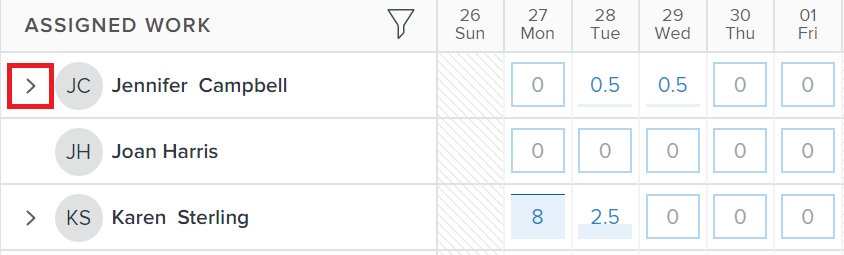

# Gestire le allocazioni utente nel Bilanciatore dei carichi di lavoro

<!-- Audited: 01/2024 -->

In qualità di Responsabile risorse, è possibile assegnare lavoro agli utenti e gestire le loro allocazioni giornaliere, settimanali o mensili dal Bilanciatore dei carichi di lavoro per assicurarsi che venga allocata una quantità di ore adatta alle loro programmazioni disponibili.

## Requisiti di accesso {#access-requirements}

+++ Espandi per visualizzare i requisiti di accesso per la funzionalità in questo articolo.

<table style="table-layout:auto"> 
 <col> 
 <col> 
 <tbody> 
  <tr> 
   <td>Pacchetto Adobe Workfront</td> 
   <td>
Qualsiasi
</td>
  </tr>
  <tr> 
   <td>Licenza Adobe Workfront</td> 
   <td>
Standard

       
Pianificare, quando si utilizza il Bilanciatore dei carichi di lavoro nell'area Risorse; lavorare, quando si utilizza il Bilanciatore dei carichi di lavoro di un team o progetto
</td>
  </tr>
  <tr> 
   <td>Configurazioni del livello di accesso</td> 
   <td> 
Modifica accesso a:
 
    <ul> 
     <li>Gestione risorse</li> 
     <li>Progetti</li> 
     <li>Attività</li> 
     <li>Problemi</li> 
    </ul>
   </td> 
  </tr> 
  <tr> 
   <td>Autorizzazioni oggetto</td> 
   <td> 
Autorizzazioni di Contribute o versioni successive che includono l'opzione Assegna assegnazioni alle attività e ai problemi per i quali si desidera gestire le allocazioni. 
 
Oppure 
 
Gestisci le autorizzazioni per le attività per le quali desideri aggiornare le ore pianificate, oltre ad aggiornare le allocazioni. Per informazioni sull'aggiornamento delle ore pianificate nel Bilanciatore dei carichi di lavoro, consulta la sezione <a href="#update-task-planned-hours-when-managing-user-allocations">Aggiorna le ore pianificate per l'attività durante la gestione delle allocazioni utente</a> in questo articolo.
 </td> 
  </tr> 
 </tbody> 
</table>

Per informazioni, consulta [Requisiti di accesso nella documentazione di Workfront](/help/quicksilver/administration-and-setup/add-users/access-levels-and-object-permissions/access-level-requirements-in-documentation.md).

+++

## Comprendere le allocazioni utente

Le allocazioni utente sono quantità di ore che indicano il tempo che un utente deve trascorrere in un dato giorno o giorno feriale, settimana o mese per completare l&#39;elemento di lavoro. Sono incluse nelle Ore pianificate dell’elemento di lavoro.

Questo articolo descrive come aggiornare le allocazioni orarie giornaliere, settimanali o mensili per gli utenti assegnati ad attività o problemi. Per informazioni sulla gestione delle allocazioni complessive per gli utenti e i ruoli alle attività, vedere [Gestire le ore di allocazione di utenti e ruoli nelle attività](../../manage-work/tasks/assign-tasks/manage-allocation-hours-on-tasks.md).

### Panoramica sull’allocazione degli utenti {#user-allocation-overview}

È possibile visualizzare l’allocazione utente come ore o come valore percentuale nel Bilanciatore dei carichi di lavoro. È possibile regolare le ore o le percentuali.

Le allocazioni utente sono incluse nel numero di ore pianificate di un elemento di lavoro. Per informazioni sulle ore pianificate, vedi [Panoramica sulle ore pianificate](../../manage-work/tasks/task-information/planned-hours.md).

Le ore pianificate dell&#39;attività vengono distribuite equamente tra tutti i giorni all&#39;interno della Durata dell&#39;attività per l&#39;utente assegnato all&#39;attività. Se ad esempio un&#39;attività ha una durata di 5 giorni e un totale di 10 ore pianificate, il numero di allocazioni giornaliere per l&#39;attività sarà di 2 ore. L’assegnazione settimanale è di 10 ore. Ciò significa che un utente è assegnato a lavorare sull&#39;attività per 2 ore al giorno. Tuttavia, è possibile modificare manualmente l’allocazione giornaliera per l’utente utilizzando il Bilanciatore dei carichi di lavoro.

>[!CAUTION]
>
>Il Bilanciatore dei carichi di lavoro visualizza solo <!--up to 1000 Planned Hours per work item per user, and--> per un massimo di 1000 giorni di durata di un elemento. Le allocazioni nel Bilanciatore dei carichi di lavoro vengono visualizzate come zero dopo il raggiungimento del limite di 1000 giorni. È consigliabile suddividere le attività in sottoattività più piccole <!--to accommodate a larger number of Planned Hours or--> per durate superiori a 1000 giorni.

Quando si individuano le allocazioni giornaliere, settimanali o mensili per attività o problemi nel Bilanciatore dei carichi di lavoro, tenere presente quanto segue:

* Puoi visualizzare le allocazioni giornaliere, settimanali e mensili degli utenti ai loro elementi di lavoro. Abilita la visualizzazione Settimana o Mese per visualizzare le allocazioni settimanali o mensili.
* Puoi utilizzare il Bilanciatore dei carichi di lavoro per modificare l’allocazione giornaliera, settimanale o mensile degli utenti alle attività o ai problemi. Per informazioni sulla regolazione della visualizzazione del Bilanciatore dei carichi di lavoro, vedere [Navigare nel Bilanciatore dei carichi di lavoro](../../resource-mgmt/workload-balancer/navigate-the-workload-balancer.md).

  >[!NOTE]
  >
  >È consigliabile decidere l&#39;intervallo di tempo (giornaliero, settimanale o mensile) da utilizzare sempre per la gestione delle allocazioni utente e non passare da un elemento all&#39;altro per gli stessi elementi di lavoro. L&#39;aggiornamento delle allocazioni settimanali per lo stesso utente per il quale sono state precedentemente aggiornate le allocazioni giornaliere modifica l&#39;allocazione giornaliera per l&#39;utente.

* È possibile aggiornare le allocazioni per i giorni lavorativi e non lavorativi.
* Quando Workfront calcola automaticamente l&#39;allocazione giornaliera per l&#39;attività, è importante disporre dei timestamp per le date di inizio pianificato e di completamento pianificato degli elementi di lavoro, nonché della pianificazione del progetto.

  >[!INFO]
  >
  > Ad esempio, un&#39;attività può avere una durata di 2 giorni e 2 ore pianificate e ha un&#39;ora di inizio pianificata di 12:00 PM il primo giorno della durata con un utente e una pianificazione del progetto che termina alle 17. La capacità dell’utente per il primo giorno è di 5 ore. La capacità dell’utente per il secondo giorno è di 8 ore (se la pianificazione inizia alle 9 del mattino).
  >
  >Workfront calcola l’allocazione delle 2 ore nei 2 giorni della durata utilizzando la seguente formula:
  >
  >`Daily allocation hours = (Total Planned Hours / Total of available hours) * Daily available hours`
  >
  >Ad esempio, le ore di allocazione giornaliere per ogni giorno sono:
  >   
  >(2 / 13) * 5 = 0,77 ore di allocazione per il primo giorno
  >
  >(2 / 13) * 8 = 1,23 ore di assegnazione per il secondo giorno
  >
  >Nei calcoli precedenti, 13 indica il totale delle ore disponibili per l&#39;attività: 5 + 8 = 13

* Due utenti in fusi orari o pianificazioni diversi in fusi orari diversi rispetto a quelli degli utenti assegnati possono visualizzare le quantità di allocazione in modo diverso per due utenti che visualizzano gli stessi elementi di lavoro.

* Quando un utente ha programmato un’indisponibilità, il giorno o la parte di giorno vengono visualizzati in uno sfondo grigio e l’icona dell’aeroplano indica un’indisponibilità. Se l’amministratore di Workfront ha abilitato l’impostazione User Time Off (Ferie utente) nell’area Setup (Configura) per tenere conto del tempo libero dell’utente, le ore assegnate vengono spostate al giorno successivo disponibile nella timeline. Se l’impostazione è disabilitata, le ore allocate rimangono nel giorno contrassegnato per l’indisponibilità e l’utente visualizza come sovrassegnate. Per ulteriori informazioni, vedere [Configurare le preferenze di progetto a livello di sistema](../../administration-and-setup/set-up-workfront/configure-system-defaults/set-project-preferences.md).

  >[!TIP]
  >
  >Se l&#39;indisponibilità è stata contrassegnata dopo che l&#39;utente è stato assegnato a un elemento di lavoro, è necessario ricalcolare la sequenza temporale del progetto per visualizzare l&#39;allocazione spostata. Per informazioni, vedere [Ricalcolare i timeline del progetto](../../manage-work/projects/manage-projects/recalculate-project-timeline.md).

   * Quando a un&#39;attività sono assegnati più utenti e l&#39;assegnatario principale ha programmato un&#39;indisponibilità, la sequenza temporale viene spostata (se le date non sono fisse) e le ore pianificate di tutti gli assegnatari vengono ridistribuite nella nuova durata dell&#39;attività. Se l&#39;attività ha date fisse, la sequenza temporale non viene modificata a causa del tempo libero e le ore vengono riallocate tra i giorni rimanenti.
   * Se le allocazioni vengono effettuate manualmente, le ore pianificate non vengono riallocate dopo il tempo libero.

* Se all&#39;attività sono assegnati più utenti, la quantità di ore pianificate viene distribuita in modo uniforme a ogni utente per primo, quindi in modo uniforme a ogni giorno all&#39;interno della Durata dell&#39;attività. Questa distribuzione diventa l&#39;allocazione di ogni utente all&#39;attività.

  Ad esempio, potrebbero esistere i seguenti scenari:

   * Per un&#39;attività con una durata di 2 giorni e con 10 ore pianificate assegnate a un utente, l&#39;allocazione giornaliera per l&#39;utente è di 5 ore per ogni giorno per impostazione predefinita.
   * Per un&#39;attività con una durata di 2 giorni e con 10 ore pianificate assegnate a due utenti, l&#39;allocazione giornaliera per ogni utente è di 2,5 ore per ogni giorno per impostazione predefinita.

* Se un&#39;attività o un problema è stato completato prima della Data di completamento pianificata, il numero di ore allocate per i giorni rimanenti viene cancellato e non viene conteggiato per l&#39;allocazione complessiva dell&#39;utente. Questa opzione viene visualizzata solo quando sono abilitate sia l’icona Mostra allocazioni che l’impostazione Mostra date previste. Per ulteriori informazioni sull&#39;abilitazione delle impostazioni nel Bilanciatore dei carichi di lavoro, vedere [Navigare nel Bilanciatore dei carichi di lavoro](../../resource-mgmt/workload-balancer/navigate-the-workload-balancer.md).

  

* Quando un utente viene sovrassegnato, le ore assegnate vengono visualizzate con uno sfondo rosso nel campo utente.
* Quando l’utente è sottoassegnato o gli viene assegnato un numero uguale di ore per il tempo disponibile pianificato, le ore vengono visualizzate con uno sfondo blu.
* È possibile visualizzare l&#39;allocazione degli utenti in una visualizzazione grafico nella linea utente. Per informazioni sull&#39;abilitazione della visualizzazione grafico per le allocazioni utente, vedere la sezione &quot;Navigare nel Bilanciatore dei carichi di lavoro&quot; nell&#39;articolo [Navigare nel Bilanciatore dei carichi di lavoro](../../resource-mgmt/workload-balancer/navigate-the-workload-balancer.md).

  

### Criteri che reimpostano le allocazioni utente {#criteria-that-reset-user-allocations}

Non tutte le modifiche delle attività attivano le allocazioni modificate per la ridistribuzione. Tuttavia, alcune azioni potrebbero reimpostare le allocazioni già adeguate sulle risorse e ridistribuirle in modo uniforme a tutti i giorni durante la durata dell&#39;elemento di lavoro per ciascun assegnatario.

>[!NOTE]
>
>Se non è stata modificata la distribuzione automatica delle allocazioni sugli elementi di lavoro, le ore vengono ridistribuite in modo uniforme tra tutti gli assegnatari quando si modifica il numero di assegnatari, la durata di un&#39;attività o la quantità di ore pianificate sull&#39;elemento di lavoro.

#### Azioni che reimpostano le allocazioni corrette {#actions-that-reset-adjusted-allocations}

Le azioni seguenti reimpostano o modificano le allocazioni giornaliere, settimanali o mensili per gli utenti dopo averle regolate manualmente come descritto nella sezione [Modifica allocazioni utente](#modify-user-allocations) in questo articolo:

* Quando si riduce la lunghezza di un elemento di lavoro che riduce la quantità di giorni nella relativa durata, le ore allocate adeguate dei giorni persi vengono aggiunte alla quantità di allocazione dell&#39;ultimo giorno dell&#39;elemento di lavoro.
* Quando si modifica la quantità di ore pianificate per un&#39;assegnazione o per l&#39;elemento di lavoro, il nuovo numero di ore pianificate viene ridistribuito in modo uniforme per l&#39;intera durata dell&#39;elemento di lavoro.
* Quando si aggiunge o si rimuove un assegnatario da un elemento di lavoro e questo causa la modifica delle ore pianificate dell&#39;attività, i valori corretti vengono ridistribuiti in modo uniforme.

#### Azioni che non reimpostano le allocazioni adeguate {#actions-that-do-not-reset-adjusted-allocations}

Le seguenti modifiche a un elemento di lavoro non attivano le allocazioni corrette da reimpostare o modificare:

* Quando si spostano i giorni di un elemento di lavoro ma la quantità di giorni nella Durata non cambia, i valori allocati corretti rimangono invariati e si passa alle nuove date.
* Quando si aumenta la durata di un elemento di lavoro che aumenta il numero di giorni nella relativa durata, le ore allocate adeguate rimangono le stesse per i giorni adeguati. Vengono aggiunti giorni aggiuntivi all&#39;elemento di lavoro con 0 ore assegnate.
* Quando si aggiunge o si rimuove un assegnatario da un elemento di lavoro e ciò non comporta la modifica delle ore pianificate dell&#39;elemento, i valori adeguati rimangono invariati.

## Individuare le ore pianificate nel Bilanciatore dei carichi di lavoro

È possibile modificare le allocazioni degli utenti ad attività o problemi utilizzando il Bilanciatore dei carichi di lavoro individuando le Ore pianificate delle attività o dei problemi assegnati agli utenti.

Quando visualizzi le ore pianificate nel Bilanciatore dei carichi di lavoro, tieni presente quanto segue:

* Le ore pianificate totali per un’attività o un problema vengono visualizzate accanto al Nome attività o problema sulla sinistra del Bilanciatore dei carichi di lavoro.

* Il totale delle ore pianificate per un progetto viene visualizzato accanto al Nome progetto a sinistra del Bilanciatore dei carichi di lavoro. Rappresenta il totale delle ore pianificate per tutte le attività e i problemi elencati nel progetto nel Bilanciatore dei carichi di lavoro e non per tutte le ore pianificate del progetto.
* La quantità di tempo allocata giornalmente o settimanalmente per tutte le attività e per tutti i progetti viene visualizzata solo se si abilita manualmente l&#39;impostazione Mostra allocazioni. Per informazioni sull&#39;abilitazione delle impostazioni nel Bilanciatore dei carichi di lavoro, vedere [Navigare nel Bilanciatore dei carichi di lavoro](../../resource-mgmt/workload-balancer/navigate-the-workload-balancer.md).

## Modificare le allocazioni utente {#modify-user-allocations}

Come parte dell’assegnazione del lavoro agli utenti, puoi modificare le allocazioni degli utenti nel Bilanciatore dei carichi di lavoro per garantire che non vengano mai sovrassegnate o per garantire un preciso equilibrio di ore tra le risorse. Per informazioni su come identificare se un utente è sovrassegnato, vedere la sezione [Panoramica sull&#39;allocazione degli utenti](#user-allocation-overview) in questo articolo.

1. Assicurati di avere attività e problemi assegnati agli utenti. Per informazioni sull&#39;assegnazione del lavoro agli utenti nel Bilanciatore dei carichi di lavoro, vedere [Panoramica sull&#39;assegnazione del lavoro nel Bilanciatore dei carichi di lavoro](../../resource-mgmt/workload-balancer/assign-work-in-workload-balancer.md).
1. Passa al Bilanciatore dei carichi di lavoro.
1. (Facoltativo) Fai clic su **Settimana** o **Mese** per gestire le allocazioni settimanali o mensili per gli utenti.

   

1. Nell&#39;area **Lavoro assegnato**, individuare l&#39;utente per il quale si desidera modificare manualmente l&#39;allocazione e fare clic sulla freccia rivolta a destra a sinistra del nome utente per espandere l&#39;utente.

   

1. Fare clic sulla freccia rivolta a destra a sinistra del nome del progetto per espandere il progetto e visualizzare gli elementi di lavoro assegnati all&#39;utente.

   >[!TIP]
   >
   >Puoi modificare le allocazioni utente solo per attività e problemi. Non è possibile modificare le allocazioni utente per i progetti.

1. (Facoltativo) Fai clic sull&#39;icona **Mostra allocazioni**  per visualizzare le allocazioni per tutti gli elementi di lavoro.

   Il nome delle attività e dei progetti viene sostituito con l&#39;assegnazione dell&#39;utente per l&#39;attività o il progetto.

1. (Facoltativo) Fai clic sull&#39;icona **Impostazioni**  e seleziona una delle opzioni seguenti:

   1. **Includi ore da problemi**. Questo consente di gestire le allocazioni dei problemi oltre alle allocazioni delle attività.
   1. **Mostra lavoro completato**. In questo modo vengono visualizzati gli elementi completati e pianificati durante la sequenza temporale per la quale si gestiscono le allocazioni.
   1. **Mostra tempo rimanente**. Il numero totale di ore per ogni utente (nella riga utente) cambia. Se questa impostazione è abilitata, il Bilanciatore dei carichi di lavoro visualizza le ore disponibili per ogni utente anziché il numero di ore allocate.

      >[!TIP]
      >
      >Se si modificano le allocazioni quando questa impostazione è abilitata, il numero totale nella linea utente diminuisce.

   1. **Progetto** nella sezione **Seleziona tema colore**. In questo modo, ogni progetto e i rispettivi elementi di lavoro vengono visualizzati in colori univoci e risulta più facile capire quali elementi appartengono a ciascun progetto.
   1. **Percentuale** nella sezione **Visualizza allocazione utenti in**. In questo modo le allocazioni vengono visualizzate come valore percentuale. La capacità dell&#39;utilizzatore secondo il programma è considerata pari al 100%. Ad esempio, se un utente è associato a una pianificazione di 8 ore al giorno, 8 ore equivalgono a una capacità del 100%. Se vuoi assegnare all’utente un lavoro di 4 ore al giorno, devi aggiornare la sua allocazione al 50%.

      >[!NOTE]
      >
      >L&#39;amministratore di Workfront decide la pianificazione da utilizzare nel sistema per calcolare la capacità dell&#39;utente nell&#39;area Gestione risorse di Configura. Per ulteriori informazioni, vedere [Configurare le preferenze di Gestione risorse](../../administration-and-setup/set-up-workfront/configure-system-defaults/configure-resource-mgmt-preferences.md).

1. Fai clic sul menu **Altro**  per un elemento di lavoro, quindi fai clic su **Modifica allocazioni**.

   

   Oppure

   Fai doppio clic sul giorno, sulla settimana o sul mese nella barra di un’attività o di un problema.

   Le caselle di allocazione diventano modificabili.

1. Fai clic nella casella di ogni allocazione giornaliera, settimanale o mensile per aggiornare manualmente la quantità di ore o il valore percentuale per cui desideri allocare l&#39;utente ogni giorno, settimana o mese, quindi fai clic sull&#39;icona **Salva** .

   >[!TIP]
   >
   >Fai clic sull&#39;icona **Annulla**  per rimuovere le allocazioni modificate.

   

   Le allocazioni per l’aggiornamento utente.

   >[!TIP]
   >
   >Se un&#39;attività o un problema è stato completato prima della Data di completamento pianificata, il numero di ore allocate per i giorni rimanenti viene cancellato e non viene conteggiato per l&#39;allocazione complessiva dell&#39;utente. Questa opzione viene visualizzata solo quando sono abilitate sia l&#39;icona **Mostra allocazioni** che l&#39;impostazione **Mostra date previste**.

   Esistono i seguenti scenari:

   * Per le attività con tipi di durata non semplici o per problemi, il totale delle allocazioni deve corrispondere alle ore pianificate dell&#39;attività prima di poter fare clic sull&#39;icona del segno di spunta.
   * Per le attività con un tipo di durata semplice, il totale delle allocazioni può essere superiore o inferiore alle ore pianificate e puoi fare clic sull’icona del segno di spunta anche se non corrispondono. Questo aggiorna anche la quantità di ore pianificate per l&#39;attività. È necessario disporre delle autorizzazioni e dell&#39;accesso corretti per aggiornare le ore pianificate per le attività dal Bilanciatore dei carichi di lavoro.

     >[!TIP]
     >
     >A destra del nome dell&#39;attività viene visualizzata un&#39;icona di blocco quando si inizia a modificare le allocazioni per indicare che l&#39;attività ha un tipo di durata semplice.

     

   Per ulteriori informazioni sulle condizioni che devono essere soddisfatte per aggiornare le ore pianificate nel Bilanciatore dei carichi di lavoro, consulta la sezione [Aggiorna ore pianificate per l&#39;attività durante la gestione delle allocazioni utente](#update-task-planned-hours-when-managing-user-allocations) in questo articolo. Per informazioni sui tipi di durata delle attività, vedere [Panoramica sulla durata delle attività e sul tipo di durata](../../manage-work/tasks/taskdurtn/task-duration-and-duration-type.md).

1. (Facoltativo) Se l&#39;attività è assegnata a più utenti, ripetere questi passaggi per ogni utente assegnato all&#39;attività per aggiornare le allocazioni per ogni utente.

   Chiunque abbia accesso alla visualizzazione del Bilanciatore dei carichi di lavoro e visualizzi gli stessi utenti e gli stessi progetti gestiti ora visualizza l’allocazione aggiornata per gli utenti gestiti.

>[!TIP]
>
>A destra del nome dell’elemento di lavoro viene visualizzata un’icona a forma di matita per indicare che è stato regolato manualmente.

## Aggiorna le ore pianificate per l&#39;attività durante la gestione delle allocazioni utente {#update-task-planned-hours-when-managing-user-allocations}

È possibile aggiornare le ore pianificate di un&#39;attività durante la gestione delle allocazioni utente nel Bilanciatore dei carichi di lavoro per l&#39;attività. Ciò si verifica quando il totale delle ore allocate aggiornate non corrisponde al totale originale delle ore pianificate per un&#39;attività.

>[!IMPORTANT]
>
>* L&#39;aggiornamento delle ore pianificate per le attività può influire sull&#39;avanzamento del progetto.
>* L&#39;aggiornamento manuale delle ore pianificate mediante la modifica delle allocazioni giornaliere può avere un impatto sulle ore pianificate quando si rimuovono le assegnazioni dalle attività in futuro. Per ulteriori informazioni, consulta [Panoramica sulle ore pianificate](../../manage-work/tasks/task-information/planned-hours.md).
>
>* Non è possibile aggiornare le ore pianificate per i problemi aggiornando le allocazioni nel Bilanciatore dei carichi di lavoro.

Ciò è possibile quando esistono le seguenti condizioni:

* Si dispone delle autorizzazioni e dell&#39;accesso corretti per gestire le ore pianificate dal Bilanciatore dei carichi di lavoro. Tra questi:

   * Consente di gestire le autorizzazioni per le attività.
   * Aggiornare le ore pianificate nell&#39;accesso al Bilanciatore dei carichi di lavoro nell&#39;area Gestione risorse del proprio livello di accesso.

  Per ulteriori informazioni sull&#39;accesso necessario per utilizzare il Bilanciatore dei carichi di lavoro, consulta la sezione [Requisiti di accesso](#access-requirements) in questo articolo.

* L&#39;attività ha un Tipo di durata semplice.

