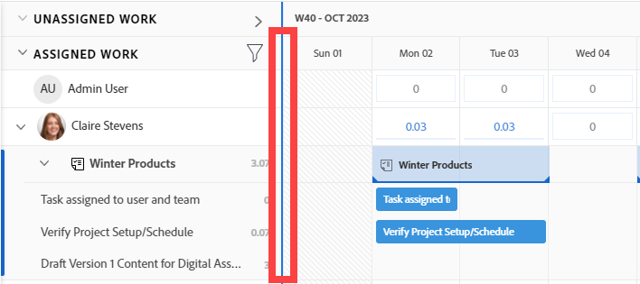
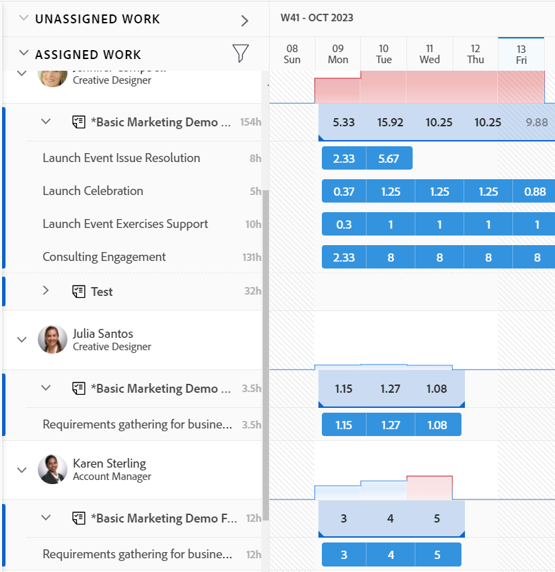

# Navigare nel Bilanciatore dei carichi di lavoro

{{preview-fast-release-general}}

<!--Audited: 12/2024-->

Utilizza il Bilanciatore dei carichi di lavoro in Adobe Workfront per assegnare il lavoro agli utenti in base alla loro disponibilità. Questo articolo descrive come utilizzare le impostazioni e le opzioni per navigare nel Bilanciatore dei carichi di lavoro e visualizzare le informazioni pertinenti. Gli articoli aggiuntivi elencati di seguito descrivono come utilizzare il Bilanciatore dei carichi di lavoro per gestire le risorse e la relativa allocazione al lavoro.

Il Bilanciatore dei carichi di lavoro è disponibile in più aree di Adobe Workfront. La navigazione è simile in tutte le aree.

Per ulteriori informazioni sulla posizione del Bilanciatore dei carichi di lavoro, vedere [Individuare il Bilanciatore dei carichi di lavoro](https://experienceleague.adobe.com/it/docs/workfront/using/manage-resources/the-workload-balancer/locate-workload-balancer).

## Requisiti di accesso

+++ Espandi per visualizzare i requisiti di accesso per la funzionalità in questo articolo.

<table style="table-layout:auto"> 
 <col> 
 <col> 
 <tbody> 
  <tr> 
   <td>Pacchetto Adobe Workfront</td> 
   <td>
Qualsiasi
</td>
  </tr>
  <tr> 
   <td>Licenza Adobe Workfront</td> 
   <td>
Standard

       
Pianificare, quando si utilizza il Bilanciatore dei carichi di lavoro nell'area Risorse; lavorare, quando si utilizza il Bilanciatore dei carichi di lavoro di un team o progetto
</td>
  </tr>
  <tr> 
   <td>Configurazioni del livello di accesso</td> 
   <td> 
Accesso di visualizzazione o superiore ai seguenti elementi:
 
    <ul> 
     <li>Gestione risorse</li> 
     <li>Progetti</li> 
     <li>Attività</li> 
     <li>Problemi</li> 
    </ul>
   </td> 
  </tr> 
  <tr> 
   <td>Autorizzazioni oggetto</td> 
   <td>Visualizza o autorizzazioni superiori per i progetti, le attività e i problemi</td> 
  </tr> 
 </tbody> 
</table>

Per informazioni, consulta [Requisiti di accesso nella documentazione di Workfront](/help/quicksilver/administration-and-setup/add-users/access-levels-and-object-permissions/access-level-requirements-in-documentation.md).

+++

## Considerazioni per la visualizzazione degli elementi nel Bilanciatore dei carichi di lavoro

Quando visualizzi il Bilanciatore dei carichi di lavoro, considera quanto segue:

* Il Bilanciatore dei carichi di lavoro visualizza gli elementi di lavoro in due aree separate, a seconda delle assegnazioni. Gli elementi di lavoro e gli utenti vengono visualizzati nelle seguenti aree:

   * **Lavoro non assegnato**: elementi che non hanno assegnazioni o che sono assegnati solo a mansioni o team.
   * **Lavoro assegnato**: elementi assegnati ad almeno un utente. Gli elementi assegnati vengono visualizzati sotto il nome dell&#39;utente assegnato.

  >[!NOTE]
  >
  >* Gli elementi di lavoro assegnati a una mansione o a un team e assegnati a un utente vengono visualizzati sia nell&#39;area Lavoro non assegnato che sotto il nome dell&#39;utente assegnato nell&#39;area Lavoro assegnato.
  >* Gli elementi di lavoro assegnati a un utente e una mansione, in cui la mansione è selezionata come assegnataria principale dell’elemento, vengono visualizzati nell’area Lavoro non assegnato.
  >* Gli elementi di lavoro assegnati a più utenti vengono visualizzati sotto tutti i nomi degli utenti assegnati nell’area Lavoro assegnato.
  >* Le assegnazioni di ruolo vengono visualizzate in elementi di lavoro nell&#39;area Lavoro non assegnato quando l&#39;impostazione Mostra assegnazioni di ruolo è abilitata. Per informazioni, vedere la sezione [Personalizzare la visualizzazione](#customize-the-view) in questo articolo.

  Per ulteriori informazioni, vedere [Aree di assegnazione nel Bilanciatore dei carichi di lavoro](/help/quicksilver/resource-mgmt/workload-balancer/assign-work-in-workload-balancer.md#assignment-areas-in-the-workload-balancer) in [Panoramica sull&#39;assegnazione di lavoro nel Bilanciatore dei carichi di lavoro](/help/quicksilver/resource-mgmt/workload-balancer/assign-work-in-workload-balancer.md).

* Quando un progetto non ha attività in un determinato periodo di tempo, la barra a livello di progetto è vuota per quel periodo di tempo.

  

* Se non disponi delle autorizzazioni necessarie per visualizzare alcuni elementi, questi verranno visualizzati come **elementi di lavoro non accessibili** o **progetti non accessibili**.

  

* I nomi degli elementi di lavoro vengono visualizzati a sinistra, mentre la sequenza temporale a destra.
* Il totale delle ore pianificate per ogni elemento di lavoro viene visualizzato a destra del nome dell&#39;elemento di lavoro e a sinistra della barra che rappresenta la sequenza temporale dell&#39;elemento di lavoro.
* Il totale delle ore pianificate per ciascun progetto viene visualizzato a destra del nome del progetto e a sinistra della barra che rappresenta la timeline del progetto.

  Le informazioni sulle ore pianificate per il progetto corrispondono al totale delle ore pianificate per tutti gli elementi elencati nel Bilanciatore dei carichi di lavoro e non al totale delle ore pianificate per il progetto.

Per ulteriori informazioni sulla visualizzazione delle informazioni nel Bilanciatore dei carichi di lavoro, vedi anche i seguenti articoli:

* [Individuare il Bilanciatore dei carichi di lavoro](../workload-balancer/locate-workload-balancer.md)
* [Filtrare le informazioni nel Bilanciatore dei carichi di lavoro](../workload-balancer/filter-information-workload-balancer.md)
* [Condividere il Bilanciatore dei carichi di lavoro con un collegamento](../workload-balancer/share-link-for-workload-balancer.md)
* [Aggiorna elementi di lavoro nel Bilanciatore dei carichi di lavoro utilizzando il Riepilogo](../workload-balancer/update-items-in-summary-panel-in-workload-balancer.md)

Per informazioni sulla gestione delle risorse tramite il Bilanciatore dei carichi di lavoro, vedi anche i seguenti articoli:

* [Panoramica sull&#39;assegnazione del lavoro nel Bilanciatore dei carichi di lavoro](https://experienceleague.adobe.com/it/docs/workfront/using/manage-resources/the-workload-balancer/assign-work-in-workload-balancer)
* [Gestione delle allocazioni utente nel Bilanciatore dei carichi di lavoro](https://experienceleague.adobe.com/it/docs/workfront/using/manage-resources/the-workload-balancer/manage-user-allocations-workload-balancer)

## Navigare nel Bilanciatore dei carichi di lavoro per più progetti nell&#39;area Risorse

La navigazione nel Bilanciatore dei carichi di lavoro è simile in tutte le aree da cui è possibile accedervi.

Le sottosezioni seguenti descrivono come visualizzare le informazioni nel Bilanciatore dei carichi di lavoro per più progetti.

È possibile regolare una serie di impostazioni e opzioni nel Bilanciatore dei carichi di lavoro per visualizzare le informazioni su cui è necessario concentrarsi nell’intervallo di tempo che ha più senso per te.

Dopo aver selezionato le impostazioni da applicare alla vista, il Bilanciatore dei carichi di lavoro memorizza tali impostazioni ogni volta che vi si accede da un browser o dispositivo.

### Accesso al Bilanciatore dei carichi di lavoro per più progetti nell’area Risorse

Per navigare nel Bilanciatore dei carichi di lavoro per più progetti:

{{step1-to-resourcing}}

1. Fai clic su **Bilanciatore dei carichi di lavoro** nel pannello a sinistra.

   

   Il Bilanciatore dei carichi di lavoro visualizza le informazioni sull’assegnazione del lavoro a partire dalla settimana corrente nelle due aree seguenti:

   * Nell&#39;area **Lavoro non assegnato** sono visualizzati i seguenti elementi di lavoro:

      * Gli elementi di lavoro (attività e problemi) assegnati a ruoli, team o a cui non è stato assegnato vengono visualizzati dopo l’applicazione dei filtri.
Nell&#39;area Lavoro non assegnato non viene visualizzato alcun elemento di lavoro per impostazione predefinita. È consigliabile utilizzare i filtri per visualizzare informazioni rilevanti per l&#39;utente in quest&#39;area.

        Per informazioni sull&#39;utilizzo dei filtri, vedere [Informazioni sui filtri nel Bilanciatore dei carichi di lavoro](../workload-balancer/filter-information-workload-balancer.md).

      * Le assegnazioni di ruolo negli elementi di lavoro vengono visualizzate solo quando si abilita l&#39;impostazione Mostra assegnazioni di ruolo. Per informazioni, vedere la sezione [Personalizzare la visualizzazione](#customize-the-view) in questo articolo.

      * I progetti vengono visualizzati solo se si abilita l&#39;impostazione Raggruppa per progetto. Per informazioni, vedere la sezione [Personalizzare la visualizzazione](#customize-the-view) in questo articolo.

   * Nell&#39;area **Lavoro assegnato** sono visualizzati i seguenti elementi di lavoro:

      * Per impostazione predefinita, tutti gli utenti attivi nel sistema vengono visualizzati in quest&#39;area. È consigliabile utilizzare i filtri per limitare la quantità di informazioni in quest’area. Se gli utenti sono assegnati agli elementi, anche gli elementi di lavoro vengono visualizzati sotto il loro nome.

      * Le attività e i problemi assegnati ad almeno un utente vengono visualizzati sotto il nome dell&#39;utente.

        Gli elementi di lavoro sotto i nomi degli utenti nell’area Lavoro assegnato sono ordinati in base ai seguenti criteri, in questo ordine:

         1. Data inizio pianificata (prima la meno recente)
         1. Data di completamento pianificata (prima la meno recente)
         1. Alfabetico per progetto (solo quando i primi due criteri sono identici per più elementi di lavoro)

            >[!TIP]
            >
            >* Puoi personalizzare l’ordinamento dei progetti selezionando un’opzione dall’impostazione &quot;Ordina progetti per&quot;.
            >
            >* I progetti vengono visualizzati solo quando si abilita l&#39;impostazione &quot;Raggruppa per progetto&quot;.
            > 
            >Per informazioni sulla personalizzazione delle impostazioni, vedere la sezione [Personalizzare la visualizzazione](#customize-the-view) in questo articolo.

1. (Facoltativo) Fai clic sull&#39;icona **Filtro**  nell&#39;area **Lavoro assegnato**, quindi seleziona il **Filtro predefinito** nell&#39;area **Suggested** della casella del filtro.

   Quando si applica il filtro Predefinito, vengono visualizzati gli utenti che appartengono a uno dei team e i relativi elementi di lavoro. Puoi modificare una copia di questo filtro.

   >[!TIP]
   >
   >Il filtro Predefinito è disponibile solo nel Bilanciatore dei carichi di lavoro nell’area Risorse.

1. Per navigare nel Bilanciatore dei carichi di lavoro, procedi come segue:

   * [Selezionare un intervallo di tempo nel Bilanciatore dei carichi di lavoro](#select-a-time-frame-in-the-workload-balancer)
   * [Personalizzare la visualizzazione](#customize-the-view)
   * [Assegnazione di elementi di lavoro e adeguamento delle allocazioni utente](#assign-work-items-and-adjust-user-allocations)
   * [Visualizzare le allocazioni in un grafico](#view-allocations-in-a-chart)

### Selezionare un intervallo di tempo nel Bilanciatore dei carichi di lavoro

1. Accedere al Bilanciatore dei carichi di lavoro nell&#39;area **Risorse**, come descritto nella sezione [Accedere al Bilanciatore dei carichi di lavoro per più progetti nell&#39;area Risorse](#access-the-workload-balancer-for-multiple-projects-in-the-resourcing-area) in questo articolo.

   Il Bilanciatore dei carichi di lavoro visualizza le informazioni sull’assegnazione del lavoro a partire dalla settimana corrente.

1. Utilizzare lo scorrimento orizzontale per visualizzare la sequenza temporale degli elementi di lavoro che si estendono oltre i limiti dello schermo.
1. Fai clic sulle icone **avanti o indietro**  nell&#39;angolo superiore sinistro per spostarti nella timeline, quindi fai clic su **Oggi** per tornare alla settimana corrente.
1. Fare clic sul menu a discesa dell&#39;intervallo di tempo **&#x200B;**&#x200B;sulla barra degli strumenti, quindi fare clic sulla data di inizio del periodo che si desidera visualizzare. Per impostazione predefinita, la prima settimana selezionata nel calendario è quella a cui si è passati.

   

1. Seleziona il numero di settimane da visualizzare contemporaneamente nel Bilanciatore dei carichi di lavoro tra le seguenti opzioni:
   * 1 settimana
   * 2 settimane
   * 4 settimane. Questa è l&#39;impostazione predefinita.
   * 6 settimane
   * 3 mesi

   

1. Fai clic su una delle seguenti opzioni nella barra degli strumenti per visualizzare le informazioni in base a diversi intervalli di tempo:
   * **Giorno**: visualizza le informazioni per giorno per quattro settimane a partire dalla data odierna, per impostazione predefinita.
   * **Settimana**: visualizza le informazioni per settimana per quattro settimane.
   * **Mese**: visualizza le informazioni per mese per tre mesi.

1. Continua a navigare nel Bilanciatore dei carichi di lavoro come descritto nelle sezioni seguenti.

### Personalizzare la visualizzazione

1. Accedere al Bilanciatore dei carichi di lavoro nell&#39;area **Risorse**, come descritto nella sezione [Accedere al Bilanciatore dei carichi di lavoro per più progetti nell&#39;area Risorse](#access-the-workload-balancer-for-multiple-projects-in-the-resourcing-area) in questo articolo.

   I nomi degli elementi di lavoro sono elencati a sinistra e sono rappresentati da barre sul lato destro del Bilanciatore dei carichi di lavoro. La lunghezza della barra rappresenta la timeline di un elemento di lavoro.

1. (Facoltativo e consigliato) Utilizzare i filtri nelle aree Lavoro non assegnato e Lavoro assegnato per visualizzare solo gli elementi di lavoro o gli utenti rilevanti.

   Per ulteriori informazioni, vedere [Informazioni sul filtro nel Bilanciatore dei carichi di lavoro](../workload-balancer/filter-information-workload-balancer.md).

   Per impostazione predefinita, le barre blu rappresentano le timeline dei progetti e delle attività, mentre le barre laterali rappresentano i problemi.

   È possibile modificare il colore delle barre per i progetti e le attività quando si seleziona il tema del colore in modo che corrisponda al progetto. Per ulteriori informazioni, continuare a leggere questa procedura.

   Gli elementi di lavoro nell’area Lavoro assegnato sono ordinati per progetti in base ai seguenti criteri, in questo ordine:
   1. Data inizio pianificata (prima la meno recente)
   1. Data di completamento pianificata (prima la meno recente)
   1. Alfabetico per progetto (solo quando i primi due criteri sono identici per più elementi di lavoro)

1. Fare clic sulla **freccia rivolta verso destra** a sinistra delle aree Non assegnato o Assegnato per espandere tutti gli elementi sotto i nomi di progetto (nell&#39;area Non assegnato) e sotto i nomi utente (nell&#39;area Assegnato).

   >[!TIP]
   >
   >Gli elementi di lavoro vengono elencati sotto i nomi dei progetti nell&#39;area Non assegnato solo quando si abilita l&#39;impostazione &quot;Raggruppa per progetto&quot;.

1. Fare clic sulla **freccia rivolta verso il basso** a sinistra delle aree Non assegnato o Assegnato per comprimere tutti gli elementi sotto i nomi di progetto (nell&#39;area Non assegnato) e sotto i nomi utente (nell&#39;area Assegnato).

1. Passa il puntatore del mouse, quindi trascina e rilascia la **linea di separazione** tra il pannello sinistro e l&#39;area della timeline per modificare le dimensioni del pannello sinistro.

   

1. Fare clic sull&#39;icona **Impostazioni** .

   Il pannello Impostazioni viene visualizzato a destra.

   Immagine di esempio nell&#39;ambiente di anteprima:
   

   Immagine di esempio nell’ambiente di produzione:
   

   Seleziona tra le opzioni elencate di seguito per aggiornare le informazioni visualizzate nel Bilanciatore dei carichi di lavoro, quindi fai clic sull&#39;icona **X** in alto a destra nella casella Impostazioni per chiuderla.

   * **Raggruppa per progetto**: quando questa opzione è selezionata, gli elementi nelle aree Lavoro non assegnato e Lavoro assegnato sono raggruppati per progetto. Questa opzione è selezionata per impostazione predefinita.

   * **Includi ore da problemi**: quando questa opzione è selezionata, i problemi assegnati agli utenti vengono visualizzati con il nome dell&#39;utente nell&#39;area Lavoro assegnato e i problemi non assegnati agli utenti vengono visualizzati nell&#39;area Lavoro non assegnato. Le ore pianificate conteggiate dai problemi vengono conteggiate in base alle ore pianificate per il progetto e per l’utente nell’area Lavoro assegnato.
   * **Mostra date previste**: se selezionata, oltre alla sequenza temporale pianificata viene visualizzata la sequenza temporale prevista degli elementi di lavoro. Osserva quanto segue:
      * La timeline prevista di progetto, attività e problemi viene visualizzata come una linea blu scuro sopra le barre delle attività, dei problemi e dei progetti.
      * La timeline proiettata che si trova al di fuori della timeline pianificata viene visualizzata in blu chiaro, anche quando si aggiorna il tema colore, come descritto di seguito.
      * La timeline proiettata per gli elementi ai quali non hai accesso alla visualizzazione viene visualizzata in grigio chiaro con una linea al di sotto.
      * Quando un&#39;attività o un problema viene completato prima della data di completamento pianificata, i numeri di allocazione per i giorni rimanenti vengono cancellati e non vengono conteggiati per l&#39;allocazione dell&#39;utente. Questa opzione viene visualizzata solo quando sono abilitate sia l’impostazione Mostra date previste che l’icona Mostra allocazione.

     >[!TIP]
     >
     >Si noti che gli elementi di lavoro vengono visualizzati nel Bilanciatore dei carichi di lavoro quando le timeline pianificate o previste (non necessariamente entrambe nello stesso momento) si verificano durante l’intervallo di tempo selezionato.

   * **Mostra lavoro completato**: quando questa opzione è attivata, le attività e i problemi completati vengono visualizzati nell&#39;area Lavoro assegnato. Questa opzione è attivata per impostazione predefinita.

     Al termine dell’operazione, nell’angolo superiore destro della barra delle attività o dei problemi viene visualizzata un’icona di spunta verde. La stessa icona viene visualizzata per un progetto quando vengono completate le attività o i problemi per l’intervallo di tempo selezionato.
   * **Mostra tempo rimanente**: quando questa opzione è attivata, in Workfront viene visualizzata la differenza tra il tempo giornaliero per il quale l&#39;utente è disponibile a lavorare in base alle proprie pianificazioni e le ore per le quali è allocato nell&#39;area Lavoro assegnato per gli utenti. Questa funzione è disabilitata per impostazione predefinita e il tempo allocato viene visualizzato per impostazione predefinita.
   * **Mostra assegnazioni ruolo**: quando questa opzione è attivata, le assegnazioni ruolo vengono visualizzate nell&#39;area Lavoro non assegnato sotto gli elementi di lavoro assegnati. Questa opzione è attivata per impostazione predefinita.

   * Nella sezione **Seleziona tema colore** selezionare il colore desiderato per le barre del progetto e dell&#39;attività.

     >[!TIP]
     >
     >L&#39;impostazione per la selezione del tema colore non influisce sul colore delle barre dei problemi. I problemi vengono sempre visualizzati in una barra con colori campione.

     Selezionare una delle opzioni seguenti:
      * **Predefinito**: le barre di tutti i progetti e dei relativi elementi di lavoro vengono visualizzate in blu.
      * **Progetto**: le barre associate a ciascun progetto e alle relative attività cambiano in base al nome del progetto. Tutte le attività appartenenti al progetto vengono visualizzate in barre di colore corrispondente al progetto. Le barre del progetto vengono visualizzate in una tonalità più chiara per distinguerle dalle attività. Le barre del progetto includono anche l’icona di un progetto quando si sceglie di non visualizzare le allocazioni.
      * **Stato progetto**: le barre associate a ciascun progetto e ai relativi elementi di lavoro cambiano in base al colore dello stato del progetto.

        Lo stato del progetto è quello associato al gruppo del progetto. Se il gruppo non dispone di stati specifici, il colore delle barre degli elementi di lavoro è quello dello stato del progetto a livello di sistema. Vengono visualizzati sia gli stati di sistema che quelli personalizzati. Per informazioni sugli stati dei gruppi, vedere [Creare o modificare lo stato di un gruppo](../../administration-and-setup/manage-groups/manage-group-statuses/create-or-edit-a-group-status.md).

   * Nella sezione **Visualizzazione dell&#39;allocazione utente in** selezionare una delle opzioni seguenti:
      * **Ore**: visualizza il tempo allocato come ore. Questa è l&#39;impostazione predefinita.
      * **Percentuale**: visualizza il tempo allocato come percentuale del tempo totale disponibile
   * Nella sezione **Preferenze di ordinamento**, seleziona la modalità di ordinamento degli elementi nel Bilanciatore dei carichi di lavoro. Selezionare una delle opzioni seguenti:
      * **Ordina utenti per ruolo principale**: gli utenti vengono visualizzati in ordine alfabetico dei ruoli principali nell&#39;area Lavoro assegnato.
      * **Ordinare gli utenti in ordine alfabetico**: gli utenti vengono visualizzati in ordine alfabetico in base al nome nell&#39;area Lavoro assegnato.
      * **Ordina progetti per**: selezionare un campo del progetto dal menu a discesa per ordinare alfabeticamente i progetti in base a tale campo nelle aree Lavoro non assegnato o Assegnato.

   >[!TIP]
   >
   >È possibile ordinare per progetti solo quando l&#39;impostazione Raggruppa per progetto è abilitata. In caso contrario, l&#39;impostazione è inattiva.

1. (Facoltativo e condizionale) Quando modifichi il tema colore in Stato progetto, passa il puntatore del mouse sul nome di un progetto a sinistra per visualizzarne lo stato.

   

### Assegnazione di elementi di lavoro e adeguamento delle allocazioni utente

1. Accedere al Bilanciatore dei carichi di lavoro nell&#39;area Risorse, come descritto nella sezione [Accedere al Bilanciatore dei carichi di lavoro per più progetti nell&#39;area Risorse](#access-the-workload-balancer-for-multiple-projects-in-the-resourcing-area) in questo articolo.
1. Fai clic sull&#39;icona **Mostra allocazioni**  per visualizzare le ore pianificate giornaliere o settimanali per gli elementi di lavoro.

   Questo sostituisce il nome nelle barre degli elementi di lavoro con la quantità di ore pianificate giornaliere o settimanali nelle aree Lavoro non assegnato e Lavoro assegnato. Questa impostazione è disabilitata per impostazione predefinita.

   I giorni che mostrano le sovrassegnazioni vengono visualizzati in rosso.

   >[!TIP]
   >
   >* L’opzione Mostra allocazioni ha effetto solo sulle visualizzazioni per progetti, attività, problemi ed elementi inaccessibili. Le ore pianificate giornaliere per gli utenti vengono visualizzate per impostazione predefinita e non possono essere nascoste.
   >* Per visualizzare le ore pianificate giornaliere per i progetti, è necessario abilitare l&#39;impostazione Raggruppa per progetto.
   >* Quando visualizzi il Bilanciatore dei carichi di lavoro per settimana, le ore visualizzate corrispondono alle ore pianificate settimanali.

1. (Facoltativo) Passa il cursore del mouse sul tempo allocato nella linea utente per comprendere la capacità e l’allocazione dell’utente. La capacità è la disponibilità dell&#39;utente in base alla sua pianificazione.

   

1. (Facoltativo) Fai clic sull&#39;icona **Nascondi allocazioni**  per visualizzare il nome delle attività e dei problemi nelle barre degli elementi di lavoro.
1. Fai clic sull&#39;icona **Altro menu**  a destra del nome di un&#39;attività, un problema, un o un ruolo, quindi fai clic su una delle opzioni seguenti.

   

   * **Assegna a**, quindi inizia a digitare il nome di un utente, una mansione o un team a cui assegnare l&#39;elemento di lavoro nel campo **Cerca persone, mansione o team**.

     Fare clic su **Avanzate** per accedere alla schermata Assegnazioni avanzate per l&#39;elemento di lavoro. Per ulteriori informazioni, vedere [Creare assegnazioni avanzate](/help/quicksilver/manage-work/tasks/assign-tasks/create-advanced-assignments.md).

     Per assegnare attività o problemi, è inoltre possibile utilizzare le seguenti scelte rapide:

      * In Windows: CTRL+clic sulla barra delle attività o dei problemi.
      * In Mac: CMD+fai clic sulla barra delle attività o dei problemi.

     Per ulteriori informazioni sull&#39;assegnazione di elementi di lavoro agli utenti nel Bilanciatore dei carichi di lavoro, vedere [Panoramica sull&#39;assegnazione di lavoro nel Bilanciatore dei carichi di lavoro](../workload-balancer/assign-work-in-workload-balancer.md).

     >[!NOTE]
     >
     >Le assegnazioni di ruolo vengono visualizzate in elementi di lavoro nell&#39;area Lavoro non assegnato solo quando l&#39;impostazione Mostra assegnazioni di ruolo è abilitata. Per informazioni, vedere la sezione [Personalizzare la visualizzazione](#customize-the-view) in questo articolo. Solo le assegnazioni di ruolo dispongono dell&#39;opzione **Assegna a** nel **menu Altro**.

     >[!TIP]
     >
     >Se l’amministratore di Workfront o di gruppo ha abilitato le deleghe nell’ambiente, utilizza la scheda Assegnazioni per assegnare gli utenti all’attività o al problema. Per informazioni sulla delega del lavoro, vedere [Delegare attività e problemi](../../manage-work/delegate-work/how-to-delegate-work.md).

   * **Modifica allocazioni**, quindi modifica le allocazioni giornaliere o settimanali per l&#39;utente. Per informazioni sulla gestione delle allocazioni utente, vedere [Gestione delle allocazioni utente nel Bilanciatore dei carichi di lavoro](../workload-balancer/manage-user-allocations-workload-balancer.md).

   * **Apri riepilogo**. Il pannello Riepilogo si apre a destra, quindi fai clic sul campo Assegnazioni e inizia a digitare il nome di un utente, ruolo o team nel campo **Cerca persone, ruolo o team** per assegnare l&#39;elemento. Per ulteriori informazioni, vedere la sezione [Visualizzare ulteriori informazioni sulle attività e sui problemi](#display-more-information-about-tasks-and-issues) in questo articolo.

1. (Facoltativo) Fai doppio clic su un&#39;allocazione giornaliera o settimanale per un utente nella barra di un elemento di lavoro per modificare il numero di ore allocate, quindi fai clic sull&#39;icona **Salva**  per salvare le allocazioni oppure sull&#39;icona **Annulla**  per rimuovere le allocazioni corrette.

   >[!TIP]
   >
   >Le icone Salva e Annulla vengono visualizzate verso la fine di un’attività o della barra della timeline di un problema.
   >
   >

   Per informazioni sulla gestione delle allocazioni utente, vedere [Gestione delle allocazioni utente nel Bilanciatore dei carichi di lavoro](../workload-balancer/manage-user-allocations-workload-balancer.md).

1. Fai clic su **Assegnazioni in blocco** per assegnare elementi di lavoro in blocco.

   Per ulteriori informazioni, consulta [Assegnare il lavoro in blocco utilizzando il Bilanciatore dei carichi di lavoro](../workload-balancer/assign-work-in-workload-balancer-in-bulk.md).
1. Trascina gli elementi dall&#39;area **Lavoro non assegnato** o da un utente e rilasciali su un altro utente per assegnarli.

   Per ulteriori informazioni, consulta [Assegnare il lavoro nel Bilanciatore dei carichi di lavoro trascinandolo](../workload-balancer/assign-work-in-workload-balancer-by-drag-and-drop.md).

### Visualizzare le allocazioni in un grafico

Anziché visualizzare le allocazioni in numeri giornalieri o settimanali, è possibile visualizzarle in un grafico.

1. Accedere al Bilanciatore dei carichi di lavoro nell&#39;area Risorse, come descritto nella sezione [Accedere al Bilanciatore dei carichi di lavoro per più progetti nell&#39;area Risorse](#access-the-workload-balancer-for-multiple-projects-in-the-resourcing-area) in questo articolo.
1. Fai clic sull&#39;icona **Grafico**  per visualizzare l&#39;allocazione utente in un formato grafico.

   I giorni in cui l’utente è sovrassegnato vengono visualizzati come blocchi rossi e i giorni in cui l’utente è sottoassegnato o alla capacità come blocchi blu.

   Le dimensioni dei blocchi indicano la quantità di allocazione: più grande è la casella, maggiore è il tempo che l’utente viene assegnato agli elementi di lavoro per quel giorno o quella settimana.

   

### Visualizza ulteriori informazioni su attività e problemi

Puoi visualizzare ulteriori informazioni sulle attività e sui problemi nel Bilanciatore dei carichi di lavoro.

1. Accedere al Bilanciatore dei carichi di lavoro nell&#39;area Risorse, come descritto nella sezione [Accedere al Bilanciatore dei carichi di lavoro per più progetti nell&#39;area Risorse](#access-the-workload-balancer-for-multiple-projects-in-the-resourcing-area) in questo articolo.
1. Per visualizzare ulteriori informazioni nel pannello Riepilogo, effettuate una delle seguenti operazioni:

   * Fai clic sulla barra di un’attività o di un problema per aprire il pannello Riepilogo a destra.
   * Fai clic sull&#39;icona **Apri riepilogo** , quindi fai clic sulla barra di un&#39;attività o di un problema per aprire il pannello Riepilogo.
   * Fai clic sul menu **Altro** a destra di un&#39;attività o di un problema, quindi fai clic su **Apri riepilogo**.

   Per informazioni sull&#39;aggiornamento delle informazioni sulle attività nel Riepilogo nel Bilanciatore dei carichi di lavoro, vedere [Aggiornare gli elementi di lavoro nel Bilanciatore dei carichi di lavoro utilizzando il Riepilogo](../workload-balancer/update-items-in-summary-panel-in-workload-balancer.md).

1. Passa il puntatore del mouse sul nome di un’attività o di un problema per visualizzare ulteriori informazioni. Sopra l’attività o il problema viene visualizzata una casella con le seguenti informazioni:

   * Nome dell’attività o del problema.
   * Nome del progetto.
   * Le date di inizio e di completamento pianificate.
   * Il numero di ore pianificate.
   * Per le attività, il numero del predecessore.
   * Per le attività, un indicatore nell&#39;angolo superiore della casella che indica se l&#39;attività è pronta per essere lavorata o meno.

   

1. Fare clic sul nome di un elemento di lavoro a sinistra per accedervi. L’elemento di lavoro viene aperto in una nuova scheda del browser.

### Visualizzare il Bilanciatore dei carichi di lavoro a schermo intero

1. Accedere al Bilanciatore dei carichi di lavoro nell&#39;area Risorse, come descritto nella sezione [Accedere al Bilanciatore dei carichi di lavoro per più progetti nell&#39;area Risorse](#access-the-workload-balancer-for-multiple-projects-in-the-resourcing-area) in questo articolo.

1. Fai clic sull&#39;icona **Schermo intero**  per visualizzare il Bilanciatore dei carichi di lavoro a schermo intero.

   Il Bilanciatore dei carichi di lavoro occupa l’intera schermata. Le finestre e le schede del browser sono escluse dalla visualizzazione.

1. Fai clic sull&#39;icona **Esci da schermo intero**  per tornare alla schermata predefinita e visualizzare il Bilanciatore dei carichi di lavoro nella scheda del browser.

## Navigare nel Bilanciatore dei carichi di lavoro di un team

La navigazione nel Bilanciatore dei carichi di lavoro di un team è simile alla navigazione nel Bilanciatore dei carichi di lavoro per più progetti. Per informazioni, vedere la sezione [Navigare nel Bilanciatore dei carichi di lavoro per più progetti](#navigate-the-workload-balancer-for-multiple-projects-in-the-resourcing-area) in questo articolo.

{{step1-to-team}}

Per impostazione predefinita, viene visualizzata la pagina del team predefinito.

1. Fai clic su **Bilanciatore dei carichi di lavoro** nel pannello a sinistra.

   

   Il Bilanciatore dei carichi di lavoro di un team visualizza le seguenti informazioni, per impostazione predefinita:

   * Nell&#39;area **Lavoro non assegnato**: elementi di lavoro assegnati al team o al team e ai ruoli e che non sono assegnati agli utenti. Le assegnazioni di ruolo vengono visualizzate in elementi di lavoro nell&#39;area Lavoro non assegnato quando l&#39;impostazione Mostra assegnazioni di ruolo è abilitata.
   * Nell&#39;area **Lavoro assegnato**: gli elementi di lavoro assegnati agli utenti vengono visualizzati sotto i nomi degli utenti.

1. Continuare a navigare nel Bilanciatore dei carichi di lavoro di un team come descritto in [Passare al Bilanciatore dei carichi di lavoro per più progetti nell&#39;area Risorse](#navigate-the-workload-balancer-for-multiple-projects-in-the-resourcing-area) di questo articolo.

## Navigare nel Bilanciatore dei carichi di lavoro di un singolo progetto

{{step1-to-projects}}

1. Fai clic sul nome di un progetto per aprire la pagina del progetto.
1. Fai clic su **Bilanciatore dei carichi di lavoro** nel pannello a sinistra.

   

   Il Bilanciatore dei carichi di lavoro per il progetto visualizza le seguenti informazioni, per impostazione predefinita:

   * Nell&#39;area **Lavoro non assegnato**: elementi di lavoro del progetto assegnati a ruoli o team e non assegnati a utenti. Le assegnazioni di ruolo vengono visualizzate in elementi di lavoro nell&#39;area Lavoro non assegnato quando l&#39;impostazione Mostra assegnazioni di ruolo è abilitata.
   * Nell&#39;area **Lavoro assegnato**: elementi di lavoro del progetto assegnati ad almeno un utente.

   È consigliabile utilizzare i filtri per mostrare solo gli utenti che sono importanti per te.

   Ad esempio, puoi considerare la possibilità di visualizzare solo gli utenti che appartengono ai tuoi team o gruppi. Per ulteriori informazioni, vedere [Informazioni sul filtro nel Bilanciatore dei carichi di lavoro](../workload-balancer/filter-information-workload-balancer.md).

1. (Facoltativo) Fai clic sull&#39;icona **Filtro**  nell&#39;area Lavoro assegnato e seleziona l&#39;opzione **Elementi di lavoro del progetto** nell&#39;area **Suggested** del pannello dei filtri. Questo filtro è deselezionato per impostazione predefinita.

   Quando questa opzione è selezionata, vengono visualizzati solo gli elementi assegnati agli utenti del progetto selezionato.

   Quando l’opzione non è selezionata, vengono visualizzati tutti gli elementi assegnati agli utenti del progetto, indipendentemente dai progetti a cui appartengono gli elementi.

1. (Facoltativo e consigliato) Applica un filtro nell&#39;area Lavoro assegnato per visualizzare gli utenti importanti ma che potrebbero non essere assegnati agli elementi del progetto, quindi fai clic sull&#39;icona **Mostra tutti gli utenti** .

   Visualizzando tutti gli utenti, è possibile visualizzare tutti gli utenti di Workfront non ancora assegnati al lavoro o ad altri ruoli nel progetto.

   Puoi applicare prima un filtro per ridurre il numero di utenti visualizzati.

   Ad esempio, potrebbe essere utile filtrare prima per gli utenti che appartengono ai team o ai gruppi, quindi visualizzare tutti gli utenti.

   Per informazioni su come creare un filtro, vedere [Informazioni sul filtro nel Bilanciatore dei carichi di lavoro](../workload-balancer/filter-information-workload-balancer.md).

   >[!NOTE]
   >
   > L’opzione Mostra tutti gli utenti è disponibile solo per il Bilanciatore dei carichi di lavoro di un progetto.

1. (Facoltativo) Fai clic sull&#39;icona **Mostra allocazioni ruolo** .

   Viene visualizzato il pannello Allocazione ruoli.

   Dalla Pianificazione scenario è possibile visualizzare informazioni sulle ore pianificate associate alle mansioni sul progetto e alle mansioni associate alle iniziative collegate ai progetti.

   Per ulteriori informazioni, vedere [Panoramica sulla riconciliazione delle allocazioni di risorse tra progetti e iniziative](../../scenario-planner/overview-reconcile-allocations-between-projects-initiatives.md).

   >[!NOTE]
   >
   >Non è possibile visualizzare le informazioni sulle mansioni dell&#39;iniziativa se l&#39;organizzazione non ha acquistato una licenza per Workfront Scenario Planner. In questo caso, puoi visualizzare solo le ore pianificate associate alle mansioni sul progetto. Per ulteriori informazioni, vedere [Accesso necessario per utilizzare la Pianificazione scenario](../../scenario-planner/access-needed-to-use-sp.md).

1. Continuare a navigare nel Bilanciatore dei carichi di lavoro di un progetto come descritto nella sezione [Passare al Bilanciatore dei carichi di lavoro per più progetti](#navigate-the-workload-balancer-for-multiple-projects-in-the-resourcing-area) di questo articolo.

### Navigare nel Bilanciatore dei carichi di lavoro di un utente

Puoi accedere al Bilanciatore dei carichi di lavoro sul tuo profilo utente.

{{step1-click-profile-pic}}

1. Fai clic su **Bilanciatore dei carichi di lavoro** nel pannello a sinistra.

   Viene visualizzato il Bilanciatore dei carichi di lavoro per l’utente.

   

   Il Bilanciatore dei carichi di lavoro di un utente visualizza quanto segue per impostazione predefinita:

   * **Lavoro assegnato**: le attività e i problemi assegnati all&#39;utente specifico.

   >[!NOTE]
   >
   >Il Bilanciatore dei carichi di lavoro in un profilo utente è di sola lettura e non è possibile modificare assegnazioni e allocazioni.

1. Continuare a navigare nel Bilanciatore dei carichi di lavoro di un utente come descritto nella sezione [Passare al Bilanciatore dei carichi di lavoro per più progetti](#navigate-the-workload-balancer-for-multiple-projects-in-the-resourcing-area) di questo articolo.

<!--old content below - this used to be a one-large-procedure article - outdated, and rewrote it above with several smaller procedures: 

# Navigate the Workload Balancer

<!-drafted note for 22.4 release: remove all production/ preview references at Prod release>

The highlighted information on this page refers to functionality not yet generally available. It is available only in the Preview environment. 

Use the Workload Balancer to understand the availability of your resources as well as to assign work to your users. This article walks you through using the icons and settings available to update the view for and navigate the Workload Balancer.

>[!NOTE]
>
>The Workload Balancer is a resource scheduling tool that will eventually replace the current resource scheduling tools which are currently deprecated. 
>
>For more information about removing the resource scheduling tools and replacing them with the Workload Balancer, see [Deprecation of Resource Scheduling tools in Adobe Workfront](../../resource-mgmt/resource-mgmt-overview/deprecate-resource-scheduling.md).
>
>We recommend that you use the Workload Balancer for scheduling your resources.

The Workload Balancer is available in multiple areas of Adobe Workfront. Navigating it is similar in all areas. This article describes how to navigate the Workload Balancer for multiple projects in the Resourcing area. For more information about where the Workload Balancer is located, see [Locate the Workload Balancer](../../resource-mgmt/workload-balancer/locate-workload-balancer.md).

For information about managing resources using the Workload Balancer, also consider reading the following articles:

* [Overview of assigning work in the Workload Balancer](../../resource-mgmt/workload-balancer/assign-work-in-workload-balancer.md)
* [Manage user allocations in the Workload Balancer](../../resource-mgmt/workload-balancer/manage-user-allocations-workload-balancer.md)

## Access requirements

You must have the following access to perform the steps in this article:

<table style="table-layout:auto"> 
 <col> 
 <col> 
 <tbody> 
  <tr> 
   <td role="rowheader">Adobe Workfront plan*</td> 
   <td> 
Any 
 </td> 
  </tr> 
  <tr> 
   <td role="rowheader">Adobe Workfront license*</td> 
   <td> 
Plan, when using the Workload Balancer in all areas in the Production environment

   
Work, when using the Workload Balancer of a project, in the Preview environment 
 </td> 
  </tr> 
  <tr> 
   <td role="rowheader">Access level configurations*</td> 
   <td> 
View or higher access to the following:
 
    <ul> 
     <li> 
Resource Management
 </li> 
     <li> 
Projects
 </li> 
     <li> 
Tasks
 </li> 
     <li> 
Issues
 </li> 
    </ul> 
If you still don't have access, ask your Workfront administrator if they set additional restrictions in your access level. For information on how a Workfront administrator can change your access level, see <a href="../../administration-and-setup/add-users/configure-and-grant-access/create-modify-access-levels.md" class="MCXref xref">Create or modify custom access levels</a>.
 </td> 
  </tr> 
  <tr> 
   <td role="rowheader">Object permissions</td> 
   <td> 
View or higher permissions to the projects, tasks, and issues 
 
For information on requesting additional access, see <a href="../../workfront-basics/grant-and-request-access-to-objects/request-access.md" class="MCXref xref">Request access to objects </a>.
 </td> 
  </tr> 
 </tbody> 
</table>

*To find out what plan, license type, or access you have, contact your Workfront administrator.

## Considerations for viewing items in the Workload Balancer

Consider the following when viewing the Workload Balancer:

* Projects display in the Workload Balancer only when the Group by Project setting is enabled. This setting is enabled by default.
* Mousing over a task or an issue displays the following additional information about the task or issue:

  * Project name

  * Task or issue name

  * Parent task

  * Planned Start and Completion Dates

  * Number of Planned Hours

  * Ready to start or Not ready status

  

* When a project has no tasks during a period of time, the bar at the project level becomes a dimmed color.

  

* When you don't have permissions to see certain items, they display as **Inaccessible work items** or **Inaccessible projects**.

  

* The names of the work items display on the left and within the timeline selected on the right. 
* The total of Planned Hours for each work item displays to the right of the name of the work items on the left. 
* The total of the Planned Hours for each project displays to the right of the name of the project on the left.

  The Planned Hours information for the project is a total of Planned Hours from all items listed in the Workload Balancer, and not a total of Planned Hours on the project.

## Overview of the Unassigned Work and Assigned Work areas

The Workload Balancer displays work items in two separate areas, depending on their assignments.

The two areas of the Workload Balancer display the following information:

<table style="table-layout:auto"> 
 <col> 
 <col> 
 <tbody> 
  <tr> 
   <td role="rowheader">Unassigned Work</td> 
   <td> 
This area displays tasks and issues unassigned to users. 
 
Projects display when the Group by Project setting is enabled.
 
This area does not display any work items by default. We recommend using filters to display relevant information for you in this area.
 
After you apply a filter, this area displays the following work items:
 
    <ul> 
     <li>unassigned</li> 
     <li>assigned to a team </li> 
     <li>assigned to a job role</li> 
     <li> 
assigned to a team and a role at the same time
 </li> 
    </ul> 
Tip: Items assigned to a user as the primary assignee do not display in the Unassigned Work area. 
 </td> 
  </tr> 
  <tr> 
   <td role="rowheader">Assigned Work</td> 
   <td> 
 All active users in the system display in this area by default. We recommend using filters to limit the amount of information in this area.  
 
Both tasks and issues display in the Assigned Work area. 
 
Projects display when the Group by Project setting is enabled.
 
The work items that the users are assigned to display under their names. 
 
If a work item is assigned to multiple users, the item displays under each assigned user. 
 </td> 
  </tr> 
 </tbody> 
</table>

For information about applying a filter in the Workload Balancer, see [Filter information in the Workload Balancer](../../resource-mgmt/workload-balancer/filter-information-workload-balancer.md).

## Navigate the Workload Balancer

You can update the view in the Workload Balancer to display exactly the information you need to focus on in the time frame that makes the most sense to you.

After selecting the settings you want to apply to your view, the Workload Balancer remembers these settings every time you access it from any browser or device.

1. Click the **Main Menu** icon  in the upper-right corner of Workfront, then click **Resourcing**.
1. Click **Workload Balancer** in the left panel.

   The Workload Balancer displays work assignment information starting with the current week. The names of work items are listed on the left side as well as represented by bars on the right side of the of the Workload Balancer within their respective timelines. By default, blue bars represent the timelines of projects and tasks and maroon bars represent issues.

   >[!TIP]
   >
   >You can change the color of the bars for projects and tasks when you select your color scheme to match the project. For more information, continue reading this procedure.

   The work items that display under the name of users in the Workload Balancer are sorted by the following criteria, in this order:

   1. Planned Start Date (oldest first)
   1. Planned Completion Date (oldest first)
   1. Alphabetical by project (only when the first two criteria are identical for multiple work items)

1. Click the right-pointing arrow to the left of the Unassigned or Assigned areas to expand all items under the project names (in the Unassigned area) and under the user names (in the Assigned area).
1. Click the down-pointing arrow to the left of the Unassigned or Assigned areas to collapse all items under the project names (in the Unassigned area) and under the user names (in the Assigned area).
1. Use the horizontal scroll to navigate the timelines of work items that extends beyond the limits of the screen. 
1. Use the vertical scroll to display additional users and work items. 
1. Drag and drop the separation line between the left panel and the timeline areas to adjust the size of the left panel.

   

1. Click the **Filter icon**  in the upper-right corner of the **Unassigned Work** or the **Assigned Work** areas to select the type of information to display in the Workload Balancer.

   For information about filtering information in the Workload Balancer, see [Manage filters in the Workload Balancer](../../resource-mgmt/workload-balancer/filter-information-workload-balancer.md). 

1. Click the right-pointing arrow next to **Unassigned Work** to expand this area or the down-pointing arrow to collapse it.

   >[!TIP]
   >
   >No items display in this area by default. You must apply a filter to view unassigned work items.

1. Drag and drop the separation line between the **Unassigned Work** and **Assigned Work** areas to adjust their size.

   

1. Click the back or forward icons  to navigate the timeline, then click **Today** to return to the current week. 

1. Click the **time frame drop-down menu** on the toolbar, then click the beginning date of the period you want to display. By default, the first week selected on the calendar is the week you navigated to.

   

1. Click one of the following options in the toolbar to display information by different time frames:

   <table style="table-layout:auto"> 
    <col> 
    <col> 
    <tbody> 
     <tr> 
      <td role="rowheader">Day</td> 
      <td>Displays information by day for four weeks starting with today's date, by default. </td> 
     </tr> 
     <tr> 
      <td role="rowheader">Week</td> 
      <td>Displays information by week for four weeks. </td> 
     </tr> 
     <tr data-mc-conditions=""> 
      <td role="rowheader">Month</td> 
      <td> 
Displays information by month for three months. 
 </td> 
     </tr> 
    </tbody> 
   </table>

1. Select the number of weeks you want to display at one time in the Workload Balancer from the following options:

   * 1 week
   * 2 weeks
   * 4 weeks. This is the default setting.
   * 6 weeks
   * 3 months
        

1. Click the **Settings** icon .

   The Settings panel displays.

   

   Select from the options listed below to update the information you view in the Workload Balancer, then click the **X icon** in the upper-right of the Settings box to close it.

   * **Group by Project**: When this is selected, the items in the Unassigned and Assigned Work areas are grouped by project. This is selected by default.

     

   * **Include hours from issues**: When this is selected, issues assigned to users display under the user's name in the Assigned Work area and issues that are not assigned to users display in the Unassigned Work area. The Planned Hours from the issues count towards the Planned Hours for the project and for the user in the Assigned Work area. 

        

   
      * **Show Projected Dates**: When this is selected, the projected timeline of work items displays in addition to the planned timeline. Notice the following:

         * The projected timeline of project, tasks, and issues displays as a dark blue line above the task, issue, and project bars.
         * The projected timeline that is outside of the planned timeline displays in light blue, even when you update the color theme, as described below.
         * The projected timeline for the items that you have no access to view displays in light gray with a line underneath.
         * When a task or issue completes before the due Planned Completion Date the allocation numbers for the remaining days are struck through and do not count towards the user's allocation. This displays only when both the Show Projected Dates setting and the Show allocation icon are enabled.

         

         >[!TIP]
         >
         >Notice that work items display in the Workload Balancer when either their planned or the projected timelines (not necessarily both at the same time) occur during the timeframe selected.

   * **Show completed work**: When this is enabled, tasks and issues that are completed display in the Assigned Work area. This is enabled by default.

     A green checkmark icon  displays to the upper-right corner of a task or issue bar when they are completed. The same icon displays for a project when the tasks or issues for the selected time frame of the project are completed. 
   
   * **Show remaining time**: When this is enabled, Workfront displays the difference between the daily time for which the user is available to work based on their schedules and the hours for which they are allocated in the Assigned Work area for the users. This is disabled by default and allocated time displays by default.

   * In the **Select color theme** section, select the color that you want for the project and task bars.  

      >[!NOTE]
      >
      >The setting for selecting the color theme  does not affect the color of the issue bars. Issues always display in a maroon-color bar. 

      Select from the following:

      * **Default**: The bars for all projects and their work items display in blue.  
      * **Project**: The bars associated with each project and its tasks change according to the name of the project. All tasks that belong to the project display in bars that match the color of the project. The project bars display in a lighter shade to distinguish them from the tasks. The project bars also include a project icon when choosing not to display allocations.
      * **Project Status**: The bars associated with each project and its work items change to the color of the status of the project.

        >[!TIP]
        >
        >* The project status is that associated with the Group of the project. If the Group does not have group-specific statuses, the color of the work item bars is that of the system-level project status. Both system as well as custom statuses display. For information about group statuses, see [Create or edit a group status](../../administration-and-setup/manage-groups/manage-group-statuses/create-or-edit-a-group-status.md).
        
   * In the **Display user allocation in** section, select from the following:

      * **Hours**: Displays allocated time as hours. This is the default. 
      * **Percentage**: Displays allocated time as a percentage of the total available time

   * In the **Sorting preferences** section, select how you want the items to be sorted in the Workload Balancer. Select from the following options: 

      * **Sort users by Primary Role**: Users display in the alphabetical order of their Primary Roles in the Assigned Work area.

      * **Sort users alphabetically**: Users display in the alphabetical order of their first names in the Assigned Work area.

      * **Sort projects by**: Select a project field from the drop-down menu to sort projects alphabetically by that field in the Unassigned or Assigned Work areas. 

      >[!TIP]
      >
      >You can sort by projects only when the Group by Project setting is enabled. Otherwise, this setting is dimmed.

1. (Optional and conditional) If you changed the color theme to Project Status, hover over the name of a project on the left to view the status of the project.

   

1. (Conditional and recommended) In the Workload Balancer of a project, apply a filter in the Assigned Work area to display users that are important to you but might not be assigned to items on the project, then click the **Show all users** icon . This displays other users in the system that are not yet assigned on the project. For information about how to build a filter, see [Manage filters in the Workload Balancer](../workload-balancer/filter-information-workload-balancer.md).

 
   >[!TIP]
   >
   >The Show all users icon is available only for the Workload Balancer of a project. 

1. Click the **Chart icon**  to display the user allocation in a chart format. Days where the user is overallocated display as red blocks, and days where the user is underallocated or at capacity display as blue blocks. The size of the blocks indicates the amount of the allocation: the larger the box, the more time the user is allocated to work items for that day or week.

   

1. Click the **Show allocations icon**  to view the daily or weekly Planned Hours for work items.

   This replaces the name in the bars of the work items with the amount of daily or weekly Planned Hours in the Unassigned and Assigned Work areas. This setting is disabled by default.

   >[!TIP]
   >
   >* The Show allocations setting only affects what displays for projects, tasks, issues and inaccessible items. Daily Planned Hours for users display by default and cannot be hidden.
   >* You must enable the Group by Project setting to display daily Planned Hours for projects. 
   >* When you view the Workload Balancer by week, the hours displayed are the weekly Planned Hours. 

   Days that show overallocations display in red. 

1. (Optional) Hover over the allocated time in the user line to understand what the capacity and allocation of the user. The capacity is the availability of the user according to their schedule.

   

1. (Optional) Click the **Hide allocations icon**  to display the name of the tasks in the bars of the work items. 
1. Click the **More menu** icon  to the right of a task or issue name, then click one of options below. 

   

      * **Assign this to**, then start typing the name of a user, role, or team you want to assign the work item to in the **Search people, role, or teams** field.
    
      >[!TIP]
      >
      >You can also use the following shortcuts to assign tasks or issues:
      >
      >* In Windows: CTRL+click the task or issue bar.
      >* In Mac: CMD+click the task or issue bar.

      For more information about assigning work items to users in the Workload Balancer, see [Overview of assigning work in the Workload Balancer](../../resource-mgmt/workload-balancer/assign-work-in-workload-balancer.md). 

      >[!TIP]
      >
      >If your Workfront or group administrator enabled delegations in your environment, use the Assignments tab to assign users to the task or issue. For information about delegating work, see [Manage task and issue delegation](../../manage-work/delegate-work/how-to-delegate-work.md).

   * **Edit allocations**, then edit the daily or weekly allocations for the user. For information about managing user allocations, see [Manage user allocations in the Workload Balancer](../../resource-mgmt/workload-balancer/manage-user-allocations-workload-balancer.md).

1. Click the bar of a task or issue to open the Summary panel on the right

   Or

   Click **Open Summary** icon , then click the bar of a task or issue to open the Summary panel

   Or

   Click the **More** menu  to the right of a task or issue, then click **Open Summary**.

   For information about updating task information in the Summary in the Workload Balancer, see [Update work items in the Workload Balancer using the Summary](../../resource-mgmt/workload-balancer/update-items-in-summary-panel-in-workload-balancer.md).

    The Summary panel opens on the right. 

1. Click **Bulk Assignments** to assign work items in bulk.

   For more information, see [Assign work in bulk using the Workload Balancer](../../resource-mgmt/workload-balancer/assign-work-in-workload-balancer-in-bulk.md). 

1. Click the **Full screen** icon  to display the Workload Balancer in full screen, then click the **Exit full screen** icon  to return to the default screen. 
1. (Optional) Double-click a daily or weekly allocation for a user inside the bar of a work item to edit the number of allocated hours, then click the **Save** icon  to save the allocations or the **Cancel** icon  to remove the allocations you adjusted.

   >[!TIP]
   >
   >The Save and Cancel icons display towards the end of a task or an issue's timeline bar.

   For information about managing user allocations, see [Manage user allocations in the Workload Balancer](../../resource-mgmt/workload-balancer/manage-user-allocations-workload-balancer.md). 

1. Click the name of a work item on the left to access it. 
1. Click the **Shareable link icon**  to copy the direct URL for the Workload Balancer to your clipboard. 
1. (Optional) Share the link with any user who does not have direct access to the Workload Balancer.

   For information about sharing the Workload Balancer with a link, see [Share the Workload Balancer with a link](../../resource-mgmt/workload-balancer/share-link-for-workload-balancer.md). 

1. (Conditional) From the Workload Balancer of a project, click the **Show role allocations** icon .

   The Role Allocation panel displays. You can view information about Planned Hours associated with job roles on the project and job roles associated with initiatives from the Scenario Planner. For more information, see [Overview of reconciling resource allocations between projects and initiatives](../../scenario-planner/overview-reconcile-allocations-between-projects-initiatives.md).

   >[!TIP]
   >
   >You cannot view initiative job role information if your organization has not purchased a license for the Workfront Scenario Planner. In this case, you can only view the planned hours associated with job roles on the project. For more information, see [Access needed to use the Scenario Planner](../../scenario-planner/access-needed-to-use-sp.md).

-->
