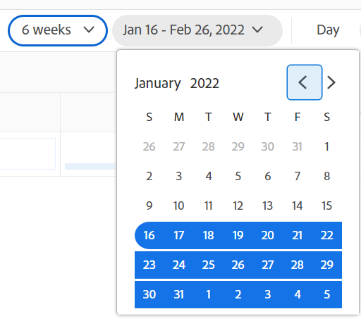
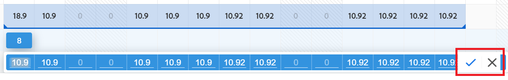
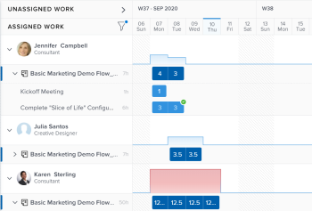

# Naviga nel bilanciamento del carico di lavoro

Utilizza il servizio di bilanciamento del carico di lavoro in Adobe Workfront per assegnare il lavoro agli utenti in base alla loro disponibilità. Questo articolo descrive come utilizzare le impostazioni e le opzioni per navigare nel servizio di bilanciamento del carico di lavoro e visualizzare le informazioni pertinenti per l&#39;utente. Gli articoli aggiuntivi elencati di seguito descrivono come utilizzare il servizio di bilanciamento del carico di lavoro per gestire le risorse e la relativa allocazione al lavoro.

Il servizio di bilanciamento del carico di lavoro è disponibile in più aree di Adobe Workfront. La navigazione è simile in tutte le aree.

Per ulteriori informazioni sulla posizione del servizio di bilanciamento del carico di lavoro, vedi [Individua il servizio di bilanciamento del carico di lavoro](https://experienceleague.adobe.com/docs/workfront/using/manage-resources/the-workload-balancer/locate-workload-balancer.html?lang=en).

## Requisiti di accesso

<!--drafted - replace table for P&P:

<table style="table-layout:auto"> 
 <col> 
 <col> 
 <tbody> 
  <tr> 
   <td role="rowheader">Adobe Workfront plan*</td> 
   <td> 
Any 
 </td> 
  </tr> 
  <tr> 
   <td role="rowheader">Adobe Workfront license*</td> 
<td>
Current license: Standard 

    Or 

Legacy license:

    <ul>
    <li>
Plan, when using the Workload Balancer for a team or in the Resourcing area 
</li>
    <li>
Work, when using the Workload Balancer of a project 
</li>
    </ul>
 </td> 
  </tr> 
  <tr> 
   <td role="rowheader">Access level configurations*</td> 
   <td> 
View or higher access to the following:
 
    <ul> 
     <li> 
Resource Management
 </li> 
     <li> 
Projects
 </li> 
     <li> 
Tasks
 </li> 
     <li> 
Issues
 </li> 
    </ul> 
If you still don't have access, ask your Workfront administrator if they set additional restrictions in your access level. For information on how a Workfront administrator can change your access level, see <a href="../../administration-and-setup/add-users/configure-and-grant-access/create-modify-access-levels.md" class="MCXref xref">Create or modify custom access levels</a>.
 </td> 
  </tr> 
  <tr> 
   <td role="rowheader">Object permissions</td> 
   <td> 
View or higher permissions to the projects, tasks, and issues 
 
For information on requesting additional access, see <a href="../../workfront-basics/grant-and-request-access-to-objects/request-access.md" class="MCXref xref">Request access to objects </a>.
 </td> 
  </tr> 
 </tbody> 
</table>
-->

Per eseguire i passaggi descritti in questo articolo, è necessario disporre dei seguenti diritti di accesso:

<table style="table-layout:auto"> 
 <col> 
 <col> 
 <tbody> 
  <tr> 
   <td role="rowheader">piano Adobe Workfront*</td> 
   <td> 
Qualsiasi 
 </td> 
  </tr> 
  <tr> 
   <td role="rowheader">Licenza Adobe Workfront*</td> 
   <td> 
Pianificare, quando si utilizza il servizio di bilanciamento del carico di lavoro per un team o nell'area di determinazione origine 

   
Operazioni da eseguire quando si utilizza il servizio di bilanciamento del carico di lavoro di un progetto 

 </td> 
  </tr> 
  <tr> 
   <td role="rowheader">Configurazioni a livello di accesso*</td> 
   <td> 
Visualizza o accedi di più a quanto segue:
 
    <ul> 
     <li> 
Gestione risorse
 </li> 
     <li> 
Progetti
 </li> 
     <li> 
Attività
 </li> 
     <li> 
Problemi
 </li> 
    </ul> 
Se non disponi ancora dell’accesso, chiedi all’amministratore Workfront se ha impostato ulteriori restrizioni nel livello di accesso. Per informazioni su come un amministratore Workfront può modificare il livello di accesso, consulta <a href="../../administration-and-setup/add-users/configure-and-grant-access/create-modify-access-levels.md" class="MCXref xref">Creare o modificare livelli di accesso personalizzati</a>.
 </td> 
  </tr> 
  <tr> 
   <td role="rowheader">Autorizzazioni oggetto</td> 
   <td> 
Visualizza o autorizzazioni superiori per progetti, attività e problemi 
 
Per informazioni sulla richiesta di accesso aggiuntivo, vedi <a href="../../workfront-basics/grant-and-request-access-to-objects/request-access.md" class="MCXref xref">Richiedere l’accesso agli oggetti </a>.
 </td> 
  </tr> 
 </tbody> 
</table>

*Per sapere quale piano, tipo di licenza o accesso si dispone, contattare l&#39;amministratore Workfront.

## Considerazioni sulla visualizzazione degli elementi nel load balancer

Quando visualizzi il servizio di bilanciamento del carico di lavoro, considera quanto segue:

* Il servizio di bilanciamento del carico di lavoro visualizza gli elementi di lavoro in due aree separate, a seconda delle assegnazioni. Gli elementi di lavoro e gli utenti vengono visualizzati nelle aree seguenti:

   * **Lavoro non assegnato**: Articoli senza assegnazioni o assegnati solo a ruoli o team di lavoro.
   * **Lavoro assegnato**: Elementi assegnati ad almeno un utente. Gli elementi assegnati vengono visualizzati sotto il nome dell&#39;utente assegnato.

   >[!NOTE]
   >
   >* Gli elementi assegnati a un ruolo di lavoro o a un team che sono anche assegnati a un utente che è l&#39;assegnatario principale non vengono visualizzati nell&#39;area Lavoro non assegnato.
   >
   >* Gli elementi assegnati a un utente e un ruolo di lavoro in cui il ruolo di lavoro è selezionato come assegnatario principale dell&#39;articolo vengono visualizzati nell&#39;area Lavoro non assegnato.
   >* Gli elementi assegnati a più utenti vengono visualizzati sotto i nomi di tutti gli utenti nell&#39;area Lavoro assegnato.

* Quando un progetto non ha attività durante un periodo di tempo, la barra a livello di progetto diventa di colore scuro.

   

* Quando non disponi delle autorizzazioni necessarie per visualizzare alcuni elementi, questi vengono visualizzati come **Elementi di lavoro inaccessibili** o **Progetti inaccessibili**.

   

* I nomi degli elementi di lavoro vengono visualizzati a sinistra e la relativa timeline viene visualizzata a destra.
* Il totale delle ore pianificate per ogni elemento di lavoro viene visualizzato a destra del nome dell&#39;elemento di lavoro e a sinistra della barra che rappresenta la timeline dell&#39;elemento di lavoro.
* Il totale delle ore pianificate per ciascun progetto viene visualizzato a destra del nome del progetto e a sinistra della barra che rappresenta la timeline del progetto.

   Le informazioni sulle ore pianificate per il progetto sono un totale di ore pianificate per tutti gli elementi elencati nel servizio di bilanciamento del carico di lavoro e non un totale di ore pianificate per il progetto.

Per ulteriori informazioni sulla visualizzazione delle informazioni nel servizio di bilanciamento del carico di lavoro, consulta anche i seguenti articoli:

* [Individua il servizio di bilanciamento del carico di lavoro](../workload-balancer/locate-workload-balancer.md)
* [Filtrare le informazioni nel servizio di bilanciamento del carico di lavoro](../workload-balancer/filter-information-workload-balancer.md)
* [Condivisione del bilanciamento del carico di lavoro con un collegamento](../workload-balancer/share-link-for-workload-balancer.md)
* [Aggiornare gli elementi di lavoro nel servizio di bilanciamento del carico di lavoro utilizzando il riepilogo](../workload-balancer/update-items-in-summary-panel-in-workload-balancer.md)

Per informazioni sulla gestione delle risorse tramite il servizio di bilanciamento del carico di lavoro, consulta anche i seguenti articoli:

* [Panoramica dell’assegnazione del lavoro nel servizio di bilanciamento del carico di lavoro](https://experienceleague.adobe.com/docs/workfront/using/manage-resources/the-workload-balancer/assign-work-in-workload-balancer.html?lang=en)
* [Gestire le allocazioni di utenti nel load balancer](https://experienceleague.adobe.com/docs/workfront/using/manage-resources/the-workload-balancer/manage-user-allocations-workload-balancer.html?lang=en)

## Naviga nel servizio di bilanciamento del carico di lavoro per più progetti nell’area Risorse

La navigazione nel servizio di bilanciamento del carico di lavoro è simile in tutte le aree di accesso.

Nelle sottosezioni seguenti viene descritto come visualizzare le informazioni nel servizio di bilanciamento del carico di lavoro per più progetti.

È possibile regolare una serie di impostazioni e opzioni nel servizio di bilanciamento del carico di lavoro per visualizzare le informazioni sulle quali è necessario concentrarsi nell&#39;intervallo di tempo più appropriato.

Dopo aver selezionato le impostazioni che si desidera applicare alla visualizzazione, il servizio di bilanciamento del carico di lavoro ricorda queste impostazioni ogni volta che si accede alla visualizzazione da un browser o un dispositivo.

### Accedere al servizio di bilanciamento del carico di lavoro per più progetti nell&#39;area Risorse

Per navigare nel servizio di bilanciamento del carico di lavoro per più progetti:

1. Fai clic sul pulsante **Menu principale** icona  nell’angolo in alto a destra di Workfront, quindi fai clic su **Risorsa**.
1. Fai clic su **Bilanciamento del carico di lavoro** nel pannello a sinistra.

   

   Il servizio di bilanciamento del carico di lavoro visualizza le informazioni sull&#39;assegnazione del lavoro a partire dalla settimana corrente nelle due aree seguenti:

   * La **Lavoro non assegnato** area visualizza i seguenti elementi di lavoro:

      * Elementi di lavoro (attività e problemi) assegnati a ruoli, team o che non vengono assegnati dopo l’applicazione dei filtri.
Per impostazione predefinita, nell’area Lavoro non assegnato non vengono visualizzati elementi di lavoro. È consigliabile utilizzare i filtri per visualizzare informazioni rilevanti per l’utente in questa area.

         Per informazioni sull’utilizzo dei filtri, consulta [Filtrare le informazioni nel servizio di bilanciamento del carico di lavoro](../workload-balancer/filter-information-workload-balancer.md).

      * I progetti vengono visualizzati solo quando abiliti l’impostazione Raggruppa per progetto . Per informazioni, consulta la sezione . [Personalizzare la visualizzazione](#customize-the-view) in questo articolo.
   * La **Lavoro assegnato** area visualizza i seguenti elementi di lavoro:

      * Per impostazione predefinita, tutti gli utenti attivi nel sistema vengono visualizzati in quest&#39;area. È consigliabile utilizzare i filtri per limitare la quantità di informazioni in quest’area. Se gli utenti sono assegnati agli elementi, anche gli elementi di lavoro vengono visualizzati con il loro nome.

      * Attività e problemi assegnati ad almeno un utente vengono visualizzati sotto il nome dell&#39;utente.

         Gli elementi di lavoro sotto i nomi degli utenti nell&#39;area Lavoro assegnato sono ordinati in base ai seguenti criteri, in questo ordine:

         1. Data inizio pianificata (prima meno recente)
         1. Data completamento pianificata (prima meno recente)
         1. Alfabetico per progetto (solo quando i primi due criteri sono identici per più elementi di lavoro)

            >[!TIP]
            >
            >* Puoi personalizzare l’ordinamento dei progetti selezionando un’opzione dall’impostazione &quot;Ordina progetti per&quot;.
            >
            >* I progetti vengono visualizzati solo quando abiliti l’impostazione &quot;Raggruppa per progetto&quot;.

            > 
            >Per informazioni sulla personalizzazione delle impostazioni, consulta la sezione . [Personalizzare la visualizzazione](#customize-the-view) in questo articolo.

1. (Facoltativo) Fai clic sul pulsante **Filtro** icona  in **Lavoro assegnato** , quindi seleziona la **Filtro predefinito** in **Suggerito** area della casella del filtro.

   Quando si applica il filtro Predefinito, vengono visualizzati gli utenti appartenenti a uno qualsiasi dei team e i relativi elementi di lavoro. Puoi modificare una copia di questo filtro.

   >[!TIP]
   >
   >Il filtro Predefinito è disponibile solo nel servizio di bilanciamento del carico di lavoro nell&#39;area Origine.

1. Procedi come segue per navigare nel servizio di bilanciamento del carico di lavoro:

   * [Selezionare un intervallo di tempo nel servizio di bilanciamento del carico di lavoro](#select-a-time-frame-in-the-workload-balancer)
   * [Personalizzare la visualizzazione](#customize-the-view)
   * [Assegnare gli elementi di lavoro e regolare le allocazioni degli utenti](#assign-work-items-and-adjust-user-allocations)
   * [Visualizza le allocazioni in un grafico](#view-allocations-in-a-chart)

### Selezionare un intervallo di tempo nel servizio di bilanciamento del carico di lavoro

1. Accedi al servizio di bilanciamento del carico di lavoro nel **Risorsa** area, come descritto nella sezione [Accedere al servizio di bilanciamento del carico di lavoro per più progetti nell&#39;area Risorse](#access-the-workload-balancer-for-multiple-projects-in-the-resourcing-area) in questo articolo.

   Il servizio di bilanciamento del carico di lavoro visualizza le informazioni sull&#39;assegnazione del lavoro a partire dalla settimana corrente.

1. Utilizzare lo scorrimento orizzontale per visualizzare la timeline degli elementi di lavoro che si estendono oltre i limiti dello schermo.
1. Fai clic sul pulsante **indietro o avanti** icone  nell’angolo in alto a sinistra per navigare nella timeline, quindi fai clic su **Oggi** per tornare alla settimana corrente.
1. Fai clic sul pulsante **menu a discesa dell&#39;intervallo temporale** sulla barra degli strumenti, fare clic sulla data di inizio del periodo da visualizzare. Per impostazione predefinita, la prima settimana selezionata nel calendario corrisponde alla settimana in cui è stato effettuato il passaggio.

   

1. Seleziona il numero di settimane da visualizzare contemporaneamente nel servizio di bilanciamento del carico di lavoro dalle seguenti opzioni:
   * 1 settimana
   * 2 settimane
   * 4 settimane. Questa è l’impostazione predefinita.
   * 6 settimane
   * 3 mesi

   

1. Fare clic su una delle seguenti opzioni nella barra degli strumenti per visualizzare le informazioni in base a diversi intervalli di tempo:
   * **Giorno**: Visualizza le informazioni per giorno per quattro settimane a partire dalla data odierna, per impostazione predefinita.
   * **Settimana**: Visualizza le informazioni per settimana per quattro settimane.
   * **Mese**: Visualizza le informazioni per mese per tre mesi.

1. Continua a navigare nel servizio di bilanciamento del carico di lavoro come descritto nelle sezioni seguenti.

### Personalizzare la visualizzazione

1. Accedi al servizio di bilanciamento del carico di lavoro nel **Risorsa** area, come descritto nella sezione [Accedere al servizio di bilanciamento del carico di lavoro per più progetti nell&#39;area Risorse](#access-the-workload-balancer-for-multiple-projects-in-the-resourcing-area) in questo articolo.

   I nomi degli elementi di lavoro sono elencati sul lato sinistro e sono rappresentati da barre sul lato destro del servizio di bilanciamento del carico di lavoro. La lunghezza della barra rappresenta la timeline di un elemento di lavoro.

1. (Facoltativo e consigliato) Utilizza i filtri nelle aree di lavoro non assegnate e assegnate per visualizzare solo gli elementi di lavoro o gli utenti pertinenti all’utente.

   Per ulteriori informazioni, consulta [Filtrare le informazioni nel servizio di bilanciamento del carico di lavoro](../workload-balancer/filter-information-workload-balancer.md).

   Per impostazione predefinita, le barre blu rappresentano le linee temporali dei progetti e delle attività e le barre laterali rappresentano i problemi.

   È possibile modificare il colore delle barre dei progetti e delle attività quando si seleziona il tema colore in base al progetto. Per ulteriori informazioni, continuare a leggere questa procedura.

   Gli elementi di lavoro nell&#39;area Lavoro assegnato sono ordinati in base ai progetti in base ai seguenti criteri, in questo ordine:
   1. Data inizio pianificata (prima meno recente)
   1. Data completamento pianificata (prima meno recente)
   1. Alfabetico per progetto (solo quando i primi due criteri sono identici per più elementi di lavoro)

1. Fai clic sul pulsante **freccia verso destra** a sinistra delle aree Non assegnate o Assegnate per espandere tutti gli elementi sotto i nomi dei progetti (nell’area Non assegnato) e sotto i nomi utente (nell’area Assegnato).

   >[!TIP]
   >
   >Gli elementi di lavoro sono elencati sotto i nomi dei progetti nell&#39;area Non assegnata solo quando si abilita l&#39;impostazione &quot;Raggruppa per progetto&quot;.

1. Fai clic sul pulsante **freccia rivolta verso il basso** a sinistra delle aree Non assegnate o Assegnate per comprimere tutti gli elementi sotto i nomi dei progetti (nell’area Non assegnato) e sotto i nomi utente (nell’area Assegnato).

1. Trascina e rilascia la **linea di separazione** tra il pannello sinistro e l&#39;area della timeline per regolare le dimensioni del pannello sinistro.

   

1. Fai clic sul pulsante **Impostazioni** icona .

   Il pannello Impostazioni viene visualizzato a destra.

   

   Seleziona tra le opzioni elencate di seguito per aggiornare le informazioni visualizzate nel servizio di bilanciamento del carico di lavoro, quindi fai clic sul pulsante **Icona X** in alto a destra della casella Impostazioni per chiuderla.

   * **Raggruppa per progetto**: Quando questa opzione è selezionata, gli elementi nelle aree Lavoro non assegnato e Lavoro assegnato vengono raggruppati per progetto. Questa opzione è selezionata per impostazione predefinita.

   * **Includi ore dai problemi**: Quando questa opzione è selezionata, i problemi assegnati agli utenti vengono visualizzati sotto il nome dell&#39;utente nell&#39;area Lavoro assegnato e i problemi non assegnati agli utenti vengono visualizzati nell&#39;area Lavoro non assegnato. Le ore pianificate a partire dai problemi contano verso le ore pianificate per il progetto e per l’utente nell’area Lavoro assegnato.
   * **Mostra date previste**: Quando questa opzione è selezionata, viene visualizzata la timeline proiettata degli elementi di lavoro in aggiunta alla timeline pianificata. Osserva quanto segue:
      * La sequenza temporale proiettata di progetti, attività e problemi viene visualizzata in blu scuro sopra le barre delle attività, dei problemi e dei progetti.
      * La timeline proiettata al di fuori della timeline pianificata viene visualizzata in blu chiaro, anche quando si aggiorna il tema del colore, come descritto di seguito.
      * La timeline proiettata per gli elementi a cui non hai accesso viene visualizzata in grigio chiaro con una linea sottostante.
      * Quando un&#39;attività o un problema viene completato prima della data di completamento prevista, i numeri di allocazione per i giorni rimanenti vengono eliminati e non vengono conteggiati per l&#39;allocazione dell&#39;utente. Viene visualizzato solo quando sono abilitate sia l’impostazione Mostra date previste che l’icona Mostra allocazione .

      >[!TIP]
      >
      >Gli elementi di lavoro vengono visualizzati nel bilanciamento del carico di lavoro quando si verificano le rispettive timeline pianificate o proiettate (non necessariamente entrambe nello stesso momento) durante l&#39;intervallo di tempo selezionato.

   * **Mostra lavoro completato**: Quando questa opzione è abilitata, le attività e i problemi completati vengono visualizzati nell&#39;area Lavoro assegnato. Questa opzione è attivata per impostazione predefinita.

      Un&#39;icona di spunta verde viene visualizzata nell&#39;angolo superiore destro di un&#39;attività o di una barra dei problemi al termine. La stessa icona viene visualizzata per un progetto quando le attività o i problemi relativi all’intervallo di tempo selezionato del progetto vengono completati.
   * **Mostra il tempo rimanente**: Quando questa opzione è abilitata, Workfront visualizza la differenza tra l’orario giornaliero per il quale l’utente è disponibile a lavorare in base alle proprie pianificazioni e le ore per le quali è allocato nell’area Lavoro assegnato per gli utenti. Per impostazione predefinita, questa opzione è disabilitata e il tempo assegnato viene visualizzato per impostazione predefinita.
   * In **Seleziona tema colore** selezionare il colore desiderato per il progetto e le barre delle attività.

      >[!TIP]
      >
      >L&#39;impostazione per selezionare il tema colore non influisce sul colore delle barre dei problemi. I problemi vengono sempre visualizzati in una barra di colore marrone.

      Seleziona una delle seguenti opzioni:
      * **Predefinito**: Le barre di tutti i progetti e i relativi elementi di lavoro vengono visualizzate in blu.
      * **Progetto**: Le barre associate a ciascun progetto e alle relative attività vengono modificate in base al nome del progetto. Tutte le attività che appartengono al progetto vengono visualizzate in barre che corrispondono al colore del progetto. Le barre del progetto vengono visualizzate in una tonalità più chiara per distinguerle dalle attività. Le barre del progetto includono anche un&#39;icona del progetto quando si sceglie di non visualizzare le allocazioni.
      * **Stato del progetto**: Le barre associate a ciascun progetto e ai relativi elementi di lavoro vengono modificate in base al colore dello stato del progetto.

         Lo stato del progetto è quello associato al gruppo del progetto. Se il gruppo non dispone di stati specifici per il gruppo, il colore delle barre degli elementi di lavoro è quello dello stato del progetto a livello di sistema. Vengono visualizzati sia lo stato del sistema che quello personalizzato. Per informazioni sugli stati del gruppo, consulta [Creare o modificare uno stato di gruppo](../../administration-and-setup/manage-groups/manage-group-statuses/create-or-edit-a-group-status.md).
   * In **Visualizza l&#39;allocazione degli utenti in** seleziona una delle seguenti opzioni:
      * **Ore**: Visualizza il tempo assegnato come ore. Questa è l’impostazione predefinita.
      * **Percentuale**: Visualizza il tempo allocato come percentuale del tempo totale disponibile
   * In **Ordinamento delle preferenze** seleziona la modalità di ordinamento degli elementi nel servizio di bilanciamento del carico di lavoro. Seleziona tra le seguenti opzioni:
      * **Ordina gli utenti per ruolo principale**: Gli utenti vengono visualizzati nell&#39;ordine alfabetico dei ruoli principali nell&#39;area Lavoro assegnato.
      * **Ordinare gli utenti in ordine alfabetico**: Nell’area Lavoro assegnato, gli utenti vengono visualizzati in ordine alfabetico dei propri nomi.
      * **Ordina progetti per**: Selezionare un campo del progetto dal menu a discesa per ordinare i progetti in ordine alfabetico in base al campo nelle aree Lavoro non assegnato o Assegnato.

   >[!TIP]
   >
   >Puoi ordinare i progetti solo quando l’impostazione Raggruppa per progetto è abilitata. In caso contrario, questa impostazione è oscurata.

1. (Facoltativo e condizionale) Quando modifichi il tema colore in Stato progetto, posiziona il cursore del mouse sul nome di un progetto a sinistra per visualizzare lo stato del progetto.

   

### Assegnare gli elementi di lavoro e regolare le allocazioni degli utenti

1. Accedi al servizio di bilanciamento del carico di lavoro nell&#39;area Origine, come descritto nella sezione [Accedere al servizio di bilanciamento del carico di lavoro per più progetti nell&#39;area Risorse](#access-the-workload-balancer-for-multiple-projects-in-the-resourcing-area) in questo articolo.
1. Fai clic sul pulsante **Icona Mostra allocazioni**  per visualizzare l&#39;orario pianificato giornaliero o settimanale per gli elementi di lavoro.

   Questo sostituisce il nome nelle barre degli elementi di lavoro con la quantità di ore pianificate giornaliere o settimanali nelle aree di lavoro non assegnate e assegnate. Questa impostazione è disabilitata per impostazione predefinita.

   I giorni che mostrano sovrassegnazioni vengono visualizzati in rosso.

   >[!TIP]
   >
   >* L&#39;opzione Mostra allocazioni influisce solo sugli elementi visualizzati per progetti, attività, problemi e elementi inaccessibili. L’ora pianificata giornaliera per gli utenti viene visualizzata per impostazione predefinita e non può essere nascosta.
   >* Per visualizzare le ore pianificate giornaliere per i progetti, è necessario abilitare l’impostazione Raggruppa per progetto.
   >* Quando si visualizza il bilanciamento del carico di lavoro per settimana, le ore visualizzate sono le ore settimanali pianificate.

1. (Facoltativo) Passa il cursore del mouse sul tempo assegnato nella riga utente per comprendere la capacità e l’allocazione dell’utente. La capacità è la disponibilità dell&#39;utente in base alla sua pianificazione.

   

1. (Facoltativo) Fai clic sul pulsante **Icona Nascondi allocazioni**  per visualizzare il nome delle attività e i problemi nelle barre degli elementi di lavoro.
1. Fai clic sul pulsante **Menu Altro** icona  a destra del nome di un&#39;attività o di un problema, quindi fai clic su una delle opzioni seguenti.

   

   * **Assegna a**, quindi inizia a digitare il nome di un utente, di un ruolo o di un team a cui si desidera assegnare l&#39;elemento di lavoro nel **Cercare persone, ruoli o team** campo .

      È inoltre possibile utilizzare le seguenti scelte rapide per assegnare attività o problemi:

      * In Windows: CTRL+clic sull&#39;attività o sulla barra dei problemi.
      * In Mac: CMD+clic sull&#39;attività o sulla barra dei problemi.

      Per ulteriori informazioni sull&#39;assegnazione di elementi di lavoro agli utenti nel servizio di bilanciamento del carico di lavoro, vedi [Panoramica dell’assegnazione del lavoro nel servizio di bilanciamento del carico di lavoro](../workload-balancer/assign-work-in-workload-balancer.md).

      >[!TIP]
      >
      >Se nell’ambiente l’amministratore di Workfront o di gruppo ha abilitato le deleghe, utilizza la scheda Assegnazioni per assegnare gli utenti all’attività o al problema. Per informazioni sulla delega del lavoro, vedi [Gestione dell&#39;attività e della delega dei problemi](../../manage-work/delegate-work/how-to-delegate-work.md).

   * **Modifica allocazioni**, quindi modifica le allocazioni giornaliere o settimanali per l’utente. Per informazioni sulla gestione delle allocazioni degli utenti, consulta [Gestire le allocazioni di utenti nel load balancer](../workload-balancer/manage-user-allocations-workload-balancer.md).

   * **Apri riepilogo**. Il pannello Riepilogo si apre a destra, quindi fai clic sul campo Assegnazioni e inizia a digitare il nome di un utente, di un ruolo o di un team nel **Cercare persone, ruoli o team** campo per assegnare l’elemento. Per ulteriori informazioni, consulta la sezione . [Visualizza ulteriori informazioni su attività e problemi](#display-more-information-about-tasks-and-issues) in questo articolo.

1. (Facoltativo) Fai doppio clic su un&#39;allocazione giornaliera o settimanale per un utente all&#39;interno della barra di un elemento di lavoro per modificare il numero di ore assegnate, quindi fai clic sul pulsante **Salva** icona  per salvare le allocazioni o **Annulla** icona   per rimuovere le allocazioni modificate.

   >[!TIP]
   >
   >Le icone Salva e Annulla vengono visualizzate verso la fine di un’attività o della barra della timeline di un problema.
   >
   >

   Per informazioni sulla gestione delle allocazioni degli utenti, consulta [Gestire le allocazioni di utenti nel load balancer](../workload-balancer/manage-user-allocations-workload-balancer.md).

1. Fai clic su **Assegnazioni in blocco** per assegnare gli elementi di lavoro in blocco.

   Per ulteriori informazioni, consulta [Assegnare il lavoro in blocco utilizzando il bilanciamento del carico di lavoro](../workload-balancer/assign-work-in-workload-balancer-in-bulk.md).
1. Trascina gli elementi dal **Lavoro non assegnato** o da un utente e rilasciarli su un altro utente per assegnarli.

   Per ulteriori informazioni, consulta [Assegnare il lavoro nel bilanciamento del carico di lavoro trascinandolo e rilasciandolo](../workload-balancer/assign-work-in-workload-balancer-by-drag-and-drop.md).

### Visualizza le allocazioni in un grafico

Invece di visualizzare le allocazioni in numeri giornalieri o settimanali, puoi visualizzarle in un grafico.

1. Accedi al servizio di bilanciamento del carico di lavoro nell&#39;area Origine, come descritto nella sezione [Accedere al servizio di bilanciamento del carico di lavoro per più progetti nell&#39;area Risorse](#access-the-workload-balancer-for-multiple-projects-in-the-resourcing-area) in questo articolo.
1. Fai clic sul pulsante **Icona Grafico**  per visualizzare l&#39;allocazione utente in formato grafico.

   I giorni in cui l’utente è sovrassegnato vengono visualizzati come blocchi rossi e i giorni in cui l’utente è sottoallocato o alla capacità vengono visualizzati come blocchi blu.

   La dimensione dei blocchi indica la quantità di allocazione: maggiore è la casella, maggiore è il tempo assegnato all&#39;utente agli articoli di lavoro per quel giorno o settimana.

   

### Visualizza ulteriori informazioni su attività e problemi

Puoi visualizzare ulteriori informazioni sulle attività e sui problemi nel servizio di bilanciamento del carico di lavoro.

1. Accedi al servizio di bilanciamento del carico di lavoro nell&#39;area Origine, come descritto nella sezione [Accedere al servizio di bilanciamento del carico di lavoro per più progetti nell&#39;area Risorse](#access-the-workload-balancer-for-multiple-projects-in-the-resourcing-area) in questo articolo.
1. Per visualizzare ulteriori informazioni nel pannello Riepilogo, effettua una delle seguenti operazioni:

   * Fai clic sulla barra di un’attività o su un problema per aprire il pannello Riepilogo a destra.
   * Fai clic sul pulsante **Apri riepilogo** icona , quindi fai clic sulla barra di un’attività o su un problema per aprire il pannello Riepilogo .
   * Fai clic sul pulsante **Altro** a destra di un&#39;attività o di un problema, quindi fare clic **Apri riepilogo**.

   Per informazioni sull&#39;aggiornamento delle informazioni sull&#39;attività nel Riepilogo nel servizio di bilanciamento del carico di lavoro, vedi [Aggiornare gli elementi di lavoro nel servizio di bilanciamento del carico di lavoro utilizzando il riepilogo](../workload-balancer/update-items-in-summary-panel-in-workload-balancer.md).

1. Passa il puntatore del mouse sul nome di un&#39;attività o di un problema per visualizzare ulteriori informazioni. Sopra l’attività o al problema viene visualizzata una casella con le seguenti informazioni:

   * Nome dell&#39;attività o del problema.
   * Nome del progetto.
   * Le date di inizio e di completamento previste.
   * Numero di ore pianificate.
   * Per le attività, il numero del predecessore.
   * Per le attività, nell&#39;angolo superiore della casella viene visualizzato un indicatore che indica se l&#39;attività è pronta o meno.

   

1. Fare clic sul nome di un elemento di lavoro a sinistra per accedervi. L’elemento di lavoro viene visualizzato in una nuova scheda del browser.

### Visualizza il bilanciamento del carico di lavoro a schermo intero

1. Accedi al servizio di bilanciamento del carico di lavoro nell&#39;area Origine, come descritto nella sezione [Accedere al servizio di bilanciamento del carico di lavoro per più progetti nell&#39;area Risorse](#access-the-workload-balancer-for-multiple-projects-in-the-resourcing-area) in questo articolo.

1. Fai clic sul pulsante **Schermo intero** icona  per visualizzare il bilanciamento del carico di lavoro a schermo intero.

   Il servizio di bilanciamento del carico di lavoro occupa l’intero schermo. Le finestre e le schede del browser sono escluse dalla visualizzazione.

1. Fai clic sul pulsante **Esci da schermo intero** icona  per tornare alla schermata predefinita e visualizzare il servizio di bilanciamento del carico di lavoro all’interno della scheda del browser.

## Spostarsi nel bilanciamento del carico di lavoro di un team

La navigazione nel bilanciamento del carico di lavoro di un team è simile alla navigazione nel bilanciamento del carico di lavoro per più progetti. Per informazioni, consulta la sezione . [Navigare nel servizio di bilanciamento del carico di lavoro per più progetti](#navigate-the-workload-balancer-for-multiple-projects-in-the-resourcing-area) in questo articolo.

1. Fai clic sul pulsante **Menu principale** icona , quindi fai clic su **Team**.
Per impostazione predefinita viene visualizzata la pagina del team principale.
1. Fai clic su **Bilanciamento del carico di lavoro** nel pannello a sinistra. Il servizio di bilanciamento del carico di lavoro di un team deve essere visualizzato per impostazione predefinita.

   

   Per impostazione predefinita, il servizio di bilanciamento del carico di lavoro di un team visualizza le seguenti informazioni:

   * In **Lavoro non assegnato** area: Elementi di lavoro assegnati al team o al team e ruoli di lavoro e non assegnati agli utenti.
   * In **Lavoro assegnato** area: Gli elementi di lavoro assegnati agli utenti vengono visualizzati sotto i nomi degli utenti.

1. Continua a navigare nel servizio di bilanciamento del carico di lavoro di un team come descritto in [Naviga nel servizio di bilanciamento del carico di lavoro per più progetti nell’area Risorse](#navigate-the-workload-balancer-for-multiple-projects-in-the-resourcing-area) sezione di questo articolo.

## Navigare nel bilanciamento del carico di lavoro di un singolo progetto

1. Fai clic sul pulsante **Menu principale** icona , quindi fai clic su **Progetti**.
1. Fai clic sul nome di un progetto per aprire la pagina del progetto.
1. Fai clic su **Bilanciamento del carico di lavoro** nel pannello a sinistra. Potrebbe essere necessario fare clic su **Mostra altro**, quindi **Bilanciamento del carico di lavoro**.

   

   Per impostazione predefinita, il servizio di bilanciamento del carico di lavoro per il progetto visualizza le seguenti informazioni:

   * In **Lavoro non assegnato** area: Elementi di lavoro del progetto assegnati a ruoli o team e non assegnati agli utenti.
   * In **Lavoro assegnato** area: Elementi di lavoro del progetto assegnati ad almeno un utente.

   È consigliabile utilizzare i filtri per mostrare solo gli utenti che sono importanti per te.

   Ad esempio, puoi visualizzare solo gli utenti appartenenti ai tuoi team o gruppi. Per ulteriori informazioni, consulta [Filtrare le informazioni nel servizio di bilanciamento del carico di lavoro](../workload-balancer/filter-information-workload-balancer.md).

1. (Facoltativo) Fai clic sul pulsante **Filtro** icona  nell’area Lavoro assegnato e seleziona la **Elementi di lavoro di questo progetto** dall&#39;opzione **Suggerito** area del pannello del filtro. Questo filtro è deselezionato per impostazione predefinita.

   Quando questa opzione è selezionata, vengono visualizzati solo gli elementi assegnati agli utenti nel progetto selezionato.

   Quando l’opzione non è selezionata, vengono visualizzati tutti gli elementi assegnati agli utenti del progetto, indipendentemente dai progetti a cui appartengono gli elementi.

1. (Facoltativo e consigliato) Applica un filtro nell’area Lavoro assegnato per visualizzare gli utenti che sono importanti per te ma che potrebbero non essere assegnati agli elementi del progetto, quindi fai clic sul pulsante **Mostra tutti gli utenti** icona .

   Mostrando tutti gli utenti, puoi visualizzare tutti gli utenti in Workfront che non sono ancora assegnati al lavoro o ad altri ruoli del progetto.

   Puoi applicare prima un filtro, per ridurre il numero di utenti visualizzati.

   Ad esempio, puoi filtrare prima gli utenti che appartengono ai tuoi team o gruppi e quindi visualizzare tutti gli utenti.

   Per informazioni su come creare un filtro, consulta [Filtrare le informazioni nel servizio di bilanciamento del carico di lavoro](../workload-balancer/filter-information-workload-balancer.md).

   >[!NOTE]
   >
   > L’opzione Mostra tutti gli utenti è disponibile solo per il servizio di bilanciamento del carico di lavoro di un progetto.

1. (Facoltativo) Fai clic sul pulsante **Mostra allocazioni ruolo** icona .

   Viene visualizzato il pannello Assegnazione ruolo .

   È possibile visualizzare le informazioni relative alle ore pianificate associate ai ruoli del lavoro nel progetto e ai ruoli di lavoro associati alle iniziative collegate ai progetti dal Planner scenario.

   Per ulteriori informazioni, consulta [Panoramica sulla riconciliazione delle assegnazioni di risorse tra progetti e iniziative](../../scenario-planner/overview-reconcile-allocations-between-projects-initiatives.md).

   >[!NOTE]
   >
   >Non è possibile visualizzare le informazioni sul ruolo del lavoro dell&#39;iniziativa se l&#39;organizzazione non ha acquistato una licenza per Workfront Scenario Planner. In questo caso, è possibile visualizzare solo le ore pianificate associate ai ruoli di lavoro nel progetto. Per ulteriori informazioni, consulta [Accesso necessario per utilizzare il planner dello scenario](../../scenario-planner/access-needed-to-use-sp.md).

1. Continua a navigare nel servizio di bilanciamento del carico di lavoro di un progetto come descritto in [Navigare nel servizio di bilanciamento del carico di lavoro per più progetti](#navigate-the-workload-balancer-for-multiple-projects-in-the-resourcing-area) sezione di questo articolo.

<!--old content below - this used to be a one-large-procedure article - outdated, and rewrote it above with several smaller procedures: 

# Navigate the Workload Balancer

<!-drafted note for 22.4 release: remove all production/ preview references at Prod release>

The highlighted information on this page refers to functionality not yet generally available. It is available only in the Preview environment. 

Use the Workload Balancer to understand the availability of your resources as well as to assign work to your users. This article walks you through using the icons and settings available to update the view for and navigate the Workload Balancer.

>[!NOTE]
>
>The Workload Balancer is a resource scheduling tool that will eventually replace the current resource scheduling tools which are currently deprecated. 
>
>For more information about removing the resource scheduling tools and replacing them with the Workload Balancer, see [Deprecation of Resource Scheduling tools in Adobe Workfront](../../resource-mgmt/resource-mgmt-overview/deprecate-resource-scheduling.md).
>
>We recommend that you use the Workload Balancer for scheduling your resources.

The Workload Balancer is available in multiple areas of Adobe Workfront. Navigating it is similar in all areas. This article describes how to navigate the Workload Balancer for multiple projects in the Resourcing area. For more information about where the Workload Balancer is located, see [Locate the Workload Balancer](../../resource-mgmt/workload-balancer/locate-workload-balancer.md).

For information about managing resources using the Workload Balancer, also consider reading the following articles:

* [Overview of assigning work in the Workload Balancer](../../resource-mgmt/workload-balancer/assign-work-in-workload-balancer.md)
* [Manage user allocations in the Workload Balancer](../../resource-mgmt/workload-balancer/manage-user-allocations-workload-balancer.md)

## Access requirements

You must have the following access to perform the steps in this article:

<table style="table-layout:auto"> 
 <col> 
 <col> 
 <tbody> 
  <tr> 
   <td role="rowheader">Adobe Workfront plan*</td> 
   <td> 
Any 
 </td> 
  </tr> 
  <tr> 
   <td role="rowheader">Adobe Workfront license*</td> 
   <td> 
Plan, when using the Workload Balancer in all areas in the Production environment

   
Work, when using the Workload Balancer of a project, in the Preview environment 
 </td> 
  </tr> 
  <tr> 
   <td role="rowheader">Access level configurations*</td> 
   <td> 
View or higher access to the following:
 
    <ul> 
     <li> 
Resource Management
 </li> 
     <li> 
Projects
 </li> 
     <li> 
Tasks
 </li> 
     <li> 
Issues
 </li> 
    </ul> 
If you still don't have access, ask your Workfront administrator if they set additional restrictions in your access level. For information on how a Workfront administrator can change your access level, see <a href="../../administration-and-setup/add-users/configure-and-grant-access/create-modify-access-levels.md" class="MCXref xref">Create or modify custom access levels</a>.
 </td> 
  </tr> 
  <tr> 
   <td role="rowheader">Object permissions</td> 
   <td> 
View or higher permissions to the projects, tasks, and issues 
 
For information on requesting additional access, see <a href="../../workfront-basics/grant-and-request-access-to-objects/request-access.md" class="MCXref xref">Request access to objects </a>.
 </td> 
  </tr> 
 </tbody> 
</table>

*To find out what plan, license type, or access you have, contact your Workfront administrator.

## Considerations for viewing items in the Workload Balancer

Consider the following when viewing the Workload Balancer:

* Projects display in the Workload Balancer only when the Group by Project setting is enabled. This setting is enabled by default.
* Mousing over a task or an issue displays the following additional information about the task or issue:

  * Project name

  * Task or issue name

  * Parent task

  * Planned Start and Completion Dates

  * Number of Planned Hours

  * Ready to start or Not ready status

  

* When a project has no tasks during a period of time, the bar at the project level becomes a dimmed color.

  

* When you don't have permissions to see certain items, they display as **Inaccessible work items** or **Inaccessible projects**.

  

* The names of the work items display on the left and within the timeline selected on the right. 
* The total of Planned Hours for each work item displays to the right of the name of the work items on the left. 
* The total of the Planned Hours for each project displays to the right of the name of the project on the left.

  The Planned Hours information for the project is a total of Planned Hours from all items listed in the Workload Balancer, and not a total of Planned Hours on the project.

## Overview of the Unassigned Work and Assigned Work areas

The Workload Balancer displays work items in two separate areas, depending on their assignments.

The two areas of the Workload Balancer display the following information:

<table style="table-layout:auto"> 
 <col> 
 <col> 
 <tbody> 
  <tr> 
   <td role="rowheader">Unassigned Work</td> 
   <td> 
This area displays tasks and issues unassigned to users. 
 
Projects display when the Group by Project setting is enabled.
 
This area does not display any work items by default. We recommend using filters to display relevant information for you in this area.
 
After you apply a filter, this area displays the following work items:
 
    <ul> 
     <li>unassigned</li> 
     <li>assigned to a team </li> 
     <li>assigned to a job role</li> 
     <li> 
assigned to a team and a role at the same time
 </li> 
    </ul> 
Tip: Items assigned to a user as the primary assignee do not display in the Unassigned Work area. 
 </td> 
  </tr> 
  <tr> 
   <td role="rowheader">Assigned Work</td> 
   <td> 
 All active users in the system display in this area by default. We recommend using filters to limit the amount of information in this area.  
 
Both tasks and issues display in the Assigned Work area. 
 
Projects display when the Group by Project setting is enabled.
 
The work items that the users are assigned to display under their names. 
 
If a work item is assigned to multiple users, the item displays under each assigned user. 
 </td> 
  </tr> 
 </tbody> 
</table>

For information about applying a filter in the Workload Balancer, see [Filter information in the Workload Balancer](../../resource-mgmt/workload-balancer/filter-information-workload-balancer.md).

## Navigate the Workload Balancer

You can update the view in the Workload Balancer to display exactly the information you need to focus on in the time frame that makes the most sense to you.

After selecting the settings you want to apply to your view, the Workload Balancer remembers these settings every time you access it from any browser or device.

1. Click the **Main Menu** icon  in the upper-right corner of Workfront, then click **Resourcing**.
1. Click **Workload Balancer** in the left panel.

   The Workload Balancer displays work assignment information starting with the current week. The names of work items are listed on the left side as well as represented by bars on the right side of the of the Workload Balancer within their respective timelines. By default, blue bars represent the timelines of projects and tasks and maroon bars represent issues.

   >[!TIP]
   >
   >You can change the color of the bars for projects and tasks when you select your color scheme to match the project. For more information, continue reading this procedure.

   The work items that display under the name of users in the Workload Balancer are sorted by the following criteria, in this order:

   1. Planned Start Date (oldest first)
   1. Planned Completion Date (oldest first)
   1. Alphabetical by project (only when the first two criteria are identical for multiple work items)

1. Click the right-pointing arrow to the left of the Unassigned or Assigned areas to expand all items under the project names (in the Unassigned area) and under the user names (in the Assigned area).
1. Click the down-pointing arrow to the left of the Unassigned or Assigned areas to collapse all items under the project names (in the Unassigned area) and under the user names (in the Assigned area).
1. Use the horizontal scroll to navigate the timelines of work items that extends beyond the limits of the screen. 
1. Use the vertical scroll to display additional users and work items. 
1. Drag and drop the separation line between the left panel and the timeline areas to adjust the size of the left panel.

   

1. Click the **Filter icon**  in the upper-right corner of the **Unassigned Work** or the **Assigned Work** areas to select the type of information to display in the Workload Balancer.

   For information about filtering information in the Workload Balancer, see [Manage filters in the Workload Balancer](../../resource-mgmt/workload-balancer/filter-information-workload-balancer.md). 

1. Click the right-pointing arrow next to **Unassigned Work** to expand this area or the down-pointing arrow to collapse it.

   >[!TIP]
   >
   >No items display in this area by default. You must apply a filter to view unassigned work items.

1. Drag and drop the separation line between the **Unassigned Work** and **Assigned Work** areas to adjust their size.

   

1. Click the back or forward icons  to navigate the timeline, then click **Today** to return to the current week. 

1. Click the **time frame drop-down menu** on the toolbar, then click the beginning date of the period you want to display. By default, the first week selected on the calendar is the week you navigated to.

   

1. Click one of the following options in the toolbar to display information by different time frames:

   <table style="table-layout:auto"> 
    <col> 
    <col> 
    <tbody> 
     <tr> 
      <td role="rowheader">Day</td> 
      <td>Displays information by day for four weeks starting with today's date, by default. </td> 
     </tr> 
     <tr> 
      <td role="rowheader">Week</td> 
      <td>Displays information by week for four weeks. </td> 
     </tr> 
     <tr data-mc-conditions=""> 
      <td role="rowheader">Month</td> 
      <td> 
Displays information by month for three months. 
 </td> 
     </tr> 
    </tbody> 
   </table>

1. Select the number of weeks you want to display at one time in the Workload Balancer from the following options:

   * 1 week
   * 2 weeks
   * 4 weeks. This is the default setting.
   * 6 weeks
   * 3 months
        

1. Click the **Settings** icon .

   The Settings panel displays.

   

   Select from the options listed below to update the information you view in the Workload Balancer, then click the **X icon** in the upper-right of the Settings box to close it.

   * **Group by Project**: When this is selected, the items in the Unassigned and Assigned Work areas are grouped by project. This is selected by default.

     

   * **Include hours from issues**: When this is selected, issues assigned to users display under the user's name in the Assigned Work area and issues that are not assigned to users display in the Unassigned Work area. The Planned Hours from the issues count towards the Planned Hours for the project and for the user in the Assigned Work area. 

        

   
      * **Show Projected Dates**: When this is selected, the projected timeline of work items displays in addition to the planned timeline. Notice the following:

         * The projected timeline of project, tasks, and issues displays as a dark blue line above the task, issue, and project bars.
         * The projected timeline that is outside of the planned timeline displays in light blue, even when you update the color theme, as described below.
         * The projected timeline for the items that you have no access to view displays in light gray with a line underneath.
         * When a task or issue completes before the due Planned Completion Date the allocation numbers for the remaining days are struck through and do not count towards the user's allocation. This displays only when both the Show Projected Dates setting and the Show allocation icon are enabled.

         

         >[!TIP]
         >
         >Notice that work items display in the Workload Balancer when either their planned or the projected timelines (not necessarily both at the same time) occur during the timeframe selected.

   * **Show completed work**: When this is enabled, tasks and issues that are completed display in the Assigned Work area. This is enabled by default.

     A green checkmark icon  displays to the upper-right corner of a task or issue bar when they are completed. The same icon displays for a project when the tasks or issues for the selected time frame of the project are completed. 
   
   * **Show remaining time**: When this is enabled, Workfront displays the difference between the daily time for which the user is available to work based on their schedules and the hours for which they are allocated in the Assigned Work area for the users. This is disabled by default and allocated time displays by default.

   * In the **Select color theme** section, select the color that you want for the project and task bars.  

      >[!NOTE]
      >
      >The setting for selecting the color theme  does not affect the color of the issue bars. Issues always display in a maroon-color bar. 

      Select from the following:

      * **Default**: The bars for all projects and their work items display in blue.  
      * **Project**: The bars associated with each project and its tasks change according to the name of the project. All tasks that belong to the project display in bars that match the color of the project. The project bars display in a lighter shade to distinguish them from the tasks. The project bars also include a project icon when choosing not to display allocations.
      * **Project Status**: The bars associated with each project and its work items change to the color of the status of the project.

        >[!TIP]
        >
        >* The project status is that associated with the Group of the project. If the Group does not have group-specific statuses, the color of the work item bars is that of the system-level project status. Both system as well as custom statuses display. For information about group statuses, see [Create or edit a group status](../../administration-and-setup/manage-groups/manage-group-statuses/create-or-edit-a-group-status.md).
        
   * In the **Display user allocation in** section, select from the following:

      * **Hours**: Displays allocated time as hours. This is the default. 
      * **Percentage**: Displays allocated time as a percentage of the total available time

   * In the **Sorting preferences** section, select how you want the items to be sorted in the Workload Balancer. Select from the following options: 

      * **Sort users by Primary Role**: Users display in the alphabetical order of their Primary Roles in the Assigned Work area.

      * **Sort users alphabetically**: Users display in the alphabetical order of their first names in the Assigned Work area.

      * **Sort projects by**: Select a project field from the drop-down menu to sort projects alphabetically by that field in the Unassigned or Assigned Work areas. 

      >[!TIP]
      >
      >You can sort by projects only when the Group by Project setting is enabled. Otherwise, this setting is dimmed.

1. (Optional and conditional) If you changed the color theme to Project Status, hover over the name of a project on the left to view the status of the project.

   

1. (Conditional and recommended) In the Workload Balancer of a project, apply a filter in the Assigned Work area to display users that are important to you but might not be assigned to items on the project, then click the **Show all users** icon . This displays other users in the system that are not yet assigned on the project. For information about how to build a filter, see [Manage filters in the Workload Balancer](../workload-balancer/filter-information-workload-balancer.md).

 
   >[!TIP]
   >
   >The Show all users icon is available only for the Workload Balancer of a project. 

1. Click the **Chart icon**  to display the user allocation in a chart format. Days where the user is overallocated display as red blocks, and days where the user is underallocated or at capacity display as blue blocks. The size of the blocks indicates the amount of the allocation: the larger the box, the more time the user is allocated to work items for that day or week.

   

1. Click the **Show allocations icon**  to view the daily or weekly Planned Hours for work items.

   This replaces the name in the bars of the work items with the amount of daily or weekly Planned Hours in the Unassigned and Assigned Work areas. This setting is disabled by default.

   >[!TIP]
   >
   >* The Show allocations setting only affects what displays for projects, tasks, issues and inaccessible items. Daily Planned Hours for users display by default and cannot be hidden.
   >* You must enable the Group by Project setting to display daily Planned Hours for projects. 
   >* When you view the Workload Balancer by week, the hours displayed are the weekly Planned Hours. 

   Days that show overallocations display in red. 

1. (Optional) Hover over the allocated time in the user line to understand what the capacity and allocation of the user. The capacity is the availability of the user according to their schedule.

   

1. (Optional) Click the **Hide allocations icon**  to display the name of the tasks in the bars of the work items. 
1. Click the **More menu** icon  to the right of a task or issue name, then click one of options below. 

   

      * **Assign this to**, then start typing the name of a user, role, or team you want to assign the work item to in the **Search people, role, or teams** field.
    
      >[!TIP]
      >
      >You can also use the following shortcuts to assign tasks or issues:
      >
      >* In Windows: CTRL+click the task or issue bar.
      >* In Mac: CMD+click the task or issue bar.

      For more information about assigning work items to users in the Workload Balancer, see [Overview of assigning work in the Workload Balancer](../../resource-mgmt/workload-balancer/assign-work-in-workload-balancer.md). 

      >[!TIP]
      >
      >If your Workfront or group administrator enabled delegations in your environment, use the Assignments tab to assign users to the task or issue. For information about delegating work, see [Manage task and issue delegation](../../manage-work/delegate-work/how-to-delegate-work.md).

   * **Edit allocations**, then edit the daily or weekly allocations for the user. For information about managing user allocations, see [Manage user allocations in the Workload Balancer](../../resource-mgmt/workload-balancer/manage-user-allocations-workload-balancer.md).

1. Click the bar of a task or issue to open the Summary panel on the right

   Or

   Click **Open Summary** icon , then click the bar of a task or issue to open the Summary panel

   Or

   Click the **More** menu  to the right of a task or issue, then click **Open Summary**.

   For information about updating task information in the Summary in the Workload Balancer, see [Update work items in the Workload Balancer using the Summary](../../resource-mgmt/workload-balancer/update-items-in-summary-panel-in-workload-balancer.md).

    The Summary panel opens on the right. 

1. Click **Bulk Assignments** to assign work items in bulk.

   For more information, see [Assign work in bulk using the Workload Balancer](../../resource-mgmt/workload-balancer/assign-work-in-workload-balancer-in-bulk.md). 

1. Click the **Full screen** icon  to display the Workload Balancer in full screen, then click the **Exit full screen** icon  to return to the default screen. 
1. (Optional) Double-click a daily or weekly allocation for a user inside the bar of a work item to edit the number of allocated hours, then click the **Save** icon  to save the allocations or the **Cancel** icon  to remove the allocations you adjusted.

   >[!TIP]
   >
   >The Save and Cancel icons display towards the end of a task or an issue's timeline bar.

   For information about managing user allocations, see [Manage user allocations in the Workload Balancer](../../resource-mgmt/workload-balancer/manage-user-allocations-workload-balancer.md). 

1. Click the name of a work item on the left to access it. 
1. Click the **Shareable link icon**  to copy the direct URL for the Workload Balancer to your clipboard. 
1. (Optional) Share the link with any user who does not have direct access to the Workload Balancer.

   For information about sharing the Workload Balancer with a link, see [Share the Workload Balancer with a link](../../resource-mgmt/workload-balancer/share-link-for-workload-balancer.md). 

1. (Conditional) From the Workload Balancer of a project, click the **Show role allocations** icon .

   The Role Allocation panel displays. You can view information about Planned Hours associated with job roles on the project and job roles associated with initiatives from the Scenario Planner. For more information, see [Overview of reconciling resource allocations between projects and initiatives](../../scenario-planner/overview-reconcile-allocations-between-projects-initiatives.md).

   >[!TIP]
   >
   >You cannot view initiative job role information if your organization has not purchased a license for the Workfront Scenario Planner. In this case, you can only view the planned hours associated with job roles on the project. For more information, see [Access needed to use the Scenario Planner](../../scenario-planner/access-needed-to-use-sp.md).

-->