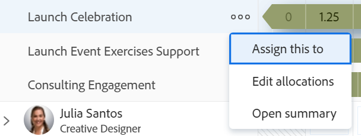

# Revoca assegnazione lavoro nel Bilanciatore dei carichi di lavoro

È possibile annullare l’assegnazione degli utenti agli elementi di lavoro nell’area Lavoro assegnato del Bilanciatore dei carichi di lavoro di Adobe Workfront o riassegnarli ad altri utenti, ruoli o team.

È possibile annullare l’assegnazione degli utenti agli elementi di lavoro manualmente, trascinandoli o in blocco. Questo articolo descrive come annullare l’assegnazione manuale degli utenti.

Per informazioni sulla rimozione dell’assegnazione degli utenti tramite trascinamento, consulta [Assegnare il lavoro nel Bilanciatore dei carichi di lavoro trascinandolo](../../resource-mgmt/workload-balancer/assign-work-in-workload-balancer-by-drag-and-drop.md)

Per informazioni sulla revoca dell’assegnazione di utenti in blocco, consulta [Assegnare il lavoro in blocco utilizzando il Bilanciatore dei carichi di lavoro](../../resource-mgmt/workload-balancer/assign-work-in-workload-balancer-in-bulk.md).

## Requisiti di accesso

Per eseguire i passaggi descritti in questo articolo, è necessario disporre dei seguenti diritti di accesso:

<table style="table-layout:auto"> 
 <col> 
 <col> 
 <tbody> 
  <tr> 
   <td role="rowheader">Piano Adobe Workfront*</td> 
   <td> 
Qualsiasi 
 </td> 
  </tr> 
  <tr> 
   <td role="rowheader">Licenza Adobe Workfront*</td> 
   <td> 
Pianificare, quando si utilizza il Bilanciatore dei carichi di lavoro nell'area Risorse

   
Utilizzare il Bilanciatore dei carichi di lavoro di un team o di un progetto

</td> 
  </tr> 
  <tr> 
   <td role="rowheader">Configurazioni del livello di accesso*</td> 
   <td> 
Modifica accesso a:
 
    <ul> 
     <li> 
Gestione risorse
 </li> 
     <li> 
Progetti
 </li> 
     <li> 
Attività
 </li> 
     <li> 
Problemi
 </li> 
    </ul> 
Se non disponi ancora dell’accesso, chiedi all’amministratore di Workfront se ha impostato restrizioni aggiuntive nel tuo livello di accesso. Per informazioni su come un amministratore di Workfront può modificare il livello di accesso, consulta <a href="../../administration-and-setup/add-users/configure-and-grant-access/create-modify-access-levels.md" class="MCXref xref">Creare o modificare livelli di accesso personalizzati</a>.
 </td> 
  </tr> 
  <tr> 
   <td role="rowheader">Autorizzazioni oggetto</td> 
   <td> 
Autorizzazioni di Contribute o superiori per i progetti, le attività e i problemi che includono Assegnazioni
 
Per informazioni sulla richiesta di accesso aggiuntivo, consulta <a href="../../workfront-basics/grant-and-request-access-to-objects/request-access.md" class="MCXref xref">Richiedi accesso agli oggetti </a>.
 </td> 
  </tr> 
 </tbody> 
</table>

&#42;Per conoscere il piano, il tipo di licenza o l&#39;accesso di cui si dispone, contattare l&#39;amministratore Workfront.

 

## Annullare l’assegnazione degli elementi di lavoro nel Bilanciatore dei carichi di lavoro

È possibile annullare l&#39;assegnazione degli elementi agli utenti e spostarli nell&#39;area Lavoro non assegnato oppure riassegnarli ad altri utenti.

Per annullare l&#39;assegnazione degli elementi di lavoro agli utenti:

1. Nel Bilanciatore dei carichi di lavoro, vai al **Lavoro assegnato** ed espandere un utente.
1. Esegui una delle operazioni seguenti:

   * Individuare l&#39;elemento di cui si desidera annullare l&#39;assegnazione nell&#39;area di un utente, fare clic su di esso e trascinarlo nell&#39;area Non assegnato o nell&#39;area di un altro utente.
   * Fai clic su **Altro** icona  a destra del nome di un elemento di lavoro, fare clic su **Assegna a**, quindi rimuovere il nome delle entità assegnate all&#39;elemento di lavoro o immettere un altro nome e fare clic su **Salva**.

     

   L’elemento viene visualizzato nell’area Lavoro non assegnato se corrisponde ai criteri di filtro per tale area e non è assegnato ad altri utenti, oppure nell’area utente se è assegnato a un altro utente.

   Per informazioni sul filtro delle informazioni nel Bilanciatore dei carichi di lavoro, consulta [Filtrare le informazioni nel Bilanciatore dei carichi di lavoro](../../resource-mgmt/workload-balancer/filter-information-workload-balancer.md).
