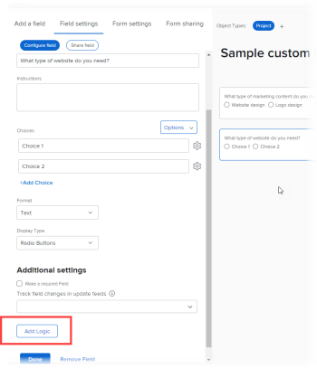

# Aggiungere logica di visualizzazione e logica di salto a un modulo personalizzato

È possibile utilizzare le regole avanzate per rendere dinamico un modulo personalizzato e più rilevante per gli utenti che lo compilano. Quando un utente risponde in un determinato modo a un campo a scelta multipla in un modulo, una regola intelligente mostra ciò che si desidera che visualizzi successivamente, in base a tale risposta.

I tipi di campo a scelta multipla sono Menu a discesa, Caselle di controllo e Pulsanti di scelta.

* **Logica di visualizzazione**: è possibile configurare una regola logica di visualizzazione nel campo, nel widget o nella sezione che si desidera che l&#39;utente visualizzi solo dopo aver selezionato una scelta specifica in un campo a scelta multipla precedente.

  **Esempio:** stai creando un modulo di richiesta di contenuto marketing in cui gli utenti della tua organizzazione possono richiedere un nuovo logo, un aggiornamento del sito Web, una brochure o altri tipi di contenuti di marketing. In base al tipo di contenuto desiderato dall&#39;utente, è necessario richiedere diversi tipi di dettagli, ad esempio colori e idee per il design, se è necessario un logo, o un elenco di caratteristiche del prodotto, se è necessaria una brochure.

  Nel campo che richiede colori e dettagli per un nuovo logo, è possibile aggiungere una regola di logica di visualizzazione che visualizza tale campo solo dopo che l&#39;utente ha selezionato il pulsante di opzione Logo nel primo campo.

  Allo stesso modo, nel campo in cui vengono richieste informazioni sulle caratteristiche del prodotto, è possibile aggiungere una regola di logica di visualizzazione che visualizzi tale campo solo dopo che un utente ha selezionato il pulsante di opzione Brochure nel primo campo.

  

  Puoi configurare le regole della logica di visualizzazione su qualsiasi campo personalizzato, widget o interruzione di sezione che segue un campo a scelta multipla.

* **Ignora regola logica**: configurare questa regola per nascondere parti di un modulo non necessarie all&#39;utente. Quando l’utente seleziona un elemento specifico in un campo a scelta multipla precedente, la regola di salto della logica li salta alla fine del modulo o a un campo, widget o sezione personalizzati che desideri che vengano visualizzati.

  **Esempio:** Qualcuno utilizza il modulo di richiesta del contenuto di marketing qui sopra per richiedere un white paper, fornito dalle vendite e non dal marketing. Per questo utente, una regola di logica di salto può nascondere la richiesta di domande per i dettagli e saltare a una riga di testo che li rimanda al reparto di cui hanno bisogno.

  

  In questo caso, è possibile aggiungere un campo Testo descrittivo che rimanda l&#39;utente al reparto Vendite. Nel primo campo personalizzato in cui viene richiesto di specificare il tipo di contenuto di marketing di cui l&#39;utente ha bisogno, è possibile aggiungere una regola di logica di salto che visualizza solo la riga di testo quando un utente seleziona il pulsante di opzione White Paper nel primo campo.

  Questa funzione è particolarmente utile se si aggiungono molti altri campi relativi a logo, aggiornamenti di siti Web e brochure, che l&#39;utente non deve necessariamente visualizzare.
È possibile applicare una regola di salto della logica solo a un campo personalizzato, non a un widget o a una sezione.

## Requisiti di accesso

Per eseguire i passaggi descritti in questo articolo, è necessario disporre dei seguenti elementi:

<table style="table-layout:auto"> 
 <col> 
 <col> 
 <tbody> 
  <tr data-mc-conditions=""> 
   <td role="rowheader"> 
Piano Adobe Workfront*
 </td> 
   <td>Qualsiasi</td> 
  </tr> 
  <tr> 
   <td role="rowheader">Licenza Adobe Workfront*</td> 
   <td> 
Piano 
 </td> 
  </tr> 
  <tr data-mc-conditions=""> 
   <td role="rowheader">Configurazioni del livello di accesso*</td> 
   <td> 
Accesso amministrativo ai moduli personalizzati
 
Per informazioni su come gli amministratori di Workfront concedono questo accesso, vedere <a href="../../administration-and-setup/add-users/configure-and-grant-access/grant-users-admin-access-certain-areas.md" class="MCXref xref">Concedere agli utenti l'accesso amministrativo ad alcune aree</a>.
 </td> 
  </tr>  
 </tbody> 
</table>

&#42;Per informazioni sulle configurazioni del piano, del tipo di licenza o del livello di accesso disponibili, contattare l&#39;amministratore Workfront.

## Creare un modulo personalizzato di esempio con logica di visualizzazione e salto

Il modo migliore per imparare ad aggiungere logica di visualizzazione e salto a un modulo personalizzato consiste nell’esempio pratico illustrato nelle due sezioni seguenti:

* [Logica di visualizzazione - esempio pratico](#display-logic-practical-example)
* [Logica di salto: esempio pratico](#skip-logic-practical-example)

### Logica di visualizzazione: esempio pratico {#display-logic-practical-example}

In questo esempio verrà creato un modulo personalizzato con un campo pulsante di scelta a scelta multipla. Quindi aggiungerai la logica di visualizzazione che collega questo campo a un secondo campo.

1. Fai clic sull&#39;icona **del** menu principale nell&#39;angolo superiore destro di Adobe Workfront, quindi fai clic su **Configurazione** .

1. Nel pannello a sinistra, seleziona **Forms personalizzato** .

1. Fai clic su **Nuovo modulo personalizzato**, seleziona **Progetto** nella casella visualizzata, quindi seleziona **Continua**.

1. Nella casella di testo **Titolo modulo**, digita **Modulo personalizzato di esempio - Logica di visualizzazione dell&#39;apprendimento e logica di salto** per denominare il modulo.

   

1. Per aggiungere il primo campo nel modulo:

   1. Apri la scheda **Aggiungi campo**.

      

   1. Seleziona il tipo di campo **Pulsanti di scelta**, quindi digita *Di quale tipo di contenuto di marketing hai bisogno?* come **etichetta** per il campo.

   1. In **Scelte**, sostituisci **Scelta 1** e **Scelta 2** con il testo seguente per creare due opzioni che gli utenti possono scegliere nel campo:

      *Aggiornamento sito Web*

      *Progettazione logo*

1. Per aggiungere il campo personalizzato successivo e aggiungervi una regola di logica di visualizzazione:

   1. Apri di nuovo la scheda **Aggiungi un campo** e aggiungi un nuovo campo **Pulsanti di scelta** denominato *Che tipo di aggiornamento del sito Web è necessario?*

      Le scelte per questo campo verranno aggiunte in seguito.

   1. Nella sezione **Impostazioni aggiuntive**, selezionare **Aggiungi logica**.

      

1. Nella casella visualizzata, con la scheda **Logica di visualizzazione** aperta, configura il secondo campo in modo che venga visualizzato solo per gli utenti che hanno selezionato *Progettazione sito Web* nel primo campo:

   1. Nel primo elenco a discesa, seleziona **Che tipo di contenuto di marketing ti serve?**
   1. Nel secondo elenco a discesa, selezionare **Progettazione sito Web**.
   1. Lasciando il terzo menu a discesa impostato su **Selected**, selezionare **Save**.

   Osserva i quadratini colorati piccoli con una D, che indica che il secondo campo è collegato con logica di visualizzazione alla selezione dell’utente nel primo campo:

   

1. Seleziona **Anteprima** per assicurarti che la logica funzioni nel modo desiderato nel modulo, quindi seleziona **Fine anteprima**.

1. Fai clic su **Salva + Chiudi** per salvare il modulo, quindi continua con [Ignora logica, esempio pratico](#skip-logic-practical-example) di seguito.

### Logica di salto: esempio pratico {#skip-logic-practical-example}

La logica di salto funziona in modo simile alla logica di visualizzazione, ma agisce come l’inverso: invece di visualizzare campi a scelta multipla personalizzati specifici in base alle selezioni utente precedenti, puoi determinare quali devono essere nascoste (saltate) perché non sono rilevanti per l’utente.

Per saperne di più, continua a lavorare sul modulo personalizzato di esempio creato nella sezione [Logica di visualizzazione - esempio pratico](#display-logic-practical-example) in questo articolo.

1. Fai clic sull&#39;icona **del** menu principale nell&#39;angolo superiore destro di Adobe Workfront, quindi fai clic su **Configurazione** .

1. Fare clic su **Forms personalizzato**.
1. Fai clic sul nome del modulo **Modulo personalizzato di esempio - Logica di visualizzazione di apprendimento e logica di salto** creato nei passaggi precedenti, per aprirlo per la modifica.
1. Selezionare il campo a discesa creato denominato *Quale tipo di sito Web è necessario?*, aggiungi le seguenti scelte per il campo, quindi fai clic su **Applica**:

   *E-commerce*

   *Brochure*

   *Appartenenza*

1. Apri la scheda **Aggiungi campo**, crea un campo **di testo con formattazione** denominato *Qual è l&#39;obiettivo per il sito Web?*, quindi fare clic su **Applica**.

   In questa organizzazione, il team di redazione tecnica crea un sito di documentazione della Guida e non il reparto Marketing. Pertanto, non sono necessarie ulteriori informazioni da parte di un utente che seleziona la documentazione di Aiuto nel secondo campo. Creeremo una riga di testo (un campo di testo descrittivo) che comunicherà loro di visualizzare il team di redazione tecnica. E utilizzeremo una regola di logica skip che salta l’utente a quella riga di testo.

1. Per creare la riga di testo:

   1. Apri la scheda **Aggiungi un campo** e crea un **campo Testo descrittivo**.

   1. Per l&#39;**etichetta**, digitare *Vedere team di scrittura tecnico*.

   1. Per il **testo descrittivo**, digitare *Rivolgersi al team di redazione tecnica per informazioni sulla creazione della documentazione della Guida in linea*.

   1. Seleziona **Applica**.

1. Per creare la regola di salto della logica:

   1. Selezionare il secondo campo a discesa, *Che tipo di sito Web è necessario?*
   1. Nella sezione **Impostazioni aggiuntive** s, selezionare **Modifica logica**.
   1. Nella casella visualizzata aprire la scheda **Ignora logica**.
   1. Imposta il primo elenco a discesa su **Documentazione della Guida**, lascia il secondo impostato su **Selezionato**, quindi imposta il terzo elenco a discesa su **Consulta il team di redazione tecnica**.
   1. Seleziona **Salva**.

   Osserva i quadratini logici di salto piccoli con una S, che indicano che l’utente salterà qualcosa dopo aver selezionato una determinata scelta nel secondo campo.

   

1. Fai clic su **Anteprima**  per assicurarti che la logica venga applicata nel modo desiderato.
1. Fai clic su **Salva +Chiudi**.

Per creare un modulo di questo tipo, è possibile aggiungere altri campi di testo per richiedere informazioni agli utenti che selezionano E-commerce o Brochure nel secondo campo. Questi campi possono chiedere chi è il pubblico target del sito web, quale è l’obiettivo per crearlo, qual è il budget e così via.

E, con le regole logiche, si possono creare percorsi di domande ramificati.

Ad esempio, per gli utenti che selezionano E-commerce, puoi creare campi in cui porre domande su foto del prodotto, descrizioni, prezzi e opzioni di pagamento. Per gli utenti che selezionano la brochure, è possibile creare campi che richiedono informazioni sul contenuto.

L’utente che ha selezionato la documentazione di Aiuto non vedrà mai questi campi aggiuntivi che sono irrilevanti per lui.

>[!TIP]
>
>È possibile aggiungere logica di visualizzazione e logica di salto a un campo personalizzato se si verificano tutte le condizioni seguenti relative al campo:
>
>* È un campo a scelta multipla (pulsanti di scelta, menu a discesa o caselle di controllo)
>* È preceduto da un campo a scelta multipla
>* È seguito da un altro campo personalizzato
>

<!--
<h2 data-mc-conditions="QuicksilverOrClassic.Draft mode">Multi-field display logic statements</h2>
-->

