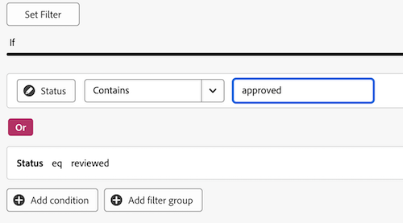

# Creare un dashboard di report per la revisione e le approvazioni

Puoi creare una dashboard di rapporti nell’area Dashboard Canvas per visualizzare informazioni dettagliate e di alto livello su revisioni e approvazioni con la funzionalità Unified Approvals.

>[!IMPORTANT]
>
>Questa funzionalità è disponibile solo per i clienti che utilizzano il servizio Unified Approvals e sono iscritti alla versione beta di Canvas Dashboards. Per ulteriori informazioni, vedere [Informazioni sulla versione beta delle dashboard di Canvas](/help/quicksilver/product-announcements/betas/canvas-dashboards-beta/canvas-dashboards-beta-information.md).

## Creare un dashboard

{{step1-to-dashboards}}

1. Nel pannello a sinistra, fai clic su **Dashboard Canvas**.
1. Fai clic su **Nuovo dashboard**.
1. Denomina il dashboard.
1. Aggiungi una descrizione (facoltativo).
1. Fai clic su **Crea**.
   

Dopo aver creato un dashboard, è possibile iniziare ad aggiungere indicatori KPI, grafici e tabelle. Per ulteriori informazioni, consulta le sezioni seguenti:

* [Aggiungere informazioni di revisione e approvazione di alto livello con KPI e grafici](#add-high-level-review-and-approval-information-with-kpis-and-charts)
* [Aggiungere informazioni dettagliate di revisione e approvazione con le tabelle](#add-detailed-review-and-approval-information-with-tables)

## Aggiungere informazioni di revisione e approvazione di alto livello con KPI e grafici

È possibile visualizzare informazioni di alto livello sulle approvazioni di documenti con indicatori KPI e grafici.

Per ulteriori informazioni, vedere [Creare un report KPI](/help/quicksilver/reports-and-dashboards/canvas-dashboards/add-reports/build-kpi-report.md) e [Creare un report grafico](/help/quicksilver/reports-and-dashboards/canvas-dashboards/add-reports/build-chart-report.md).

### KPI

#### Approvazioni in sospeso

1. [Creare un dashboard](#create-a-dashboard) come descritto nella sezione precedente.
1. Nell&#39;angolo superiore destro della pagina dei dettagli del dashboard, fai clic su **Aggiungi report**.

1. Nella casella **Aggiungi report** selezionare **Crea report**.

1. Sul lato sinistro, selezionare **KPI**.

1. Nell&#39;angolo superiore destro fare clic su **Crea report**.

1. Segui i passaggi seguenti per configurare la sezione **Dettagli**:

   1. Digitare *In sospeso* nel campo **Nome**.
   1. Digitare *Approvazioni in sospeso* nel campo **Descrizione**. Viene visualizzata come didascalia sotto il valore dell&#39;indicatore KPI.

1. Segui i passaggi seguenti per configurare la sezione **Genera KPI**:

   1. Nel pannello a sinistra, fai clic sull&#39;icona **Genera KPI** .

   1. Fare clic su **Seleziona campo**.

   1. Individua e seleziona la cartella **Approvazione documento**.

   1. Seleziona **Stato**.

   1. Nel menu a discesa **Tipo di aggregazione**, selezionare **Conteggio**.

1. Segui i passaggi seguenti per configurare la sezione **Filtro**:

   1. Nel pannello a sinistra, fai clic sull&#39;icona **Filtro** .

   1. Selezionare **Modifica filtro**.

   1. Fai clic su **Aggiungi condizione**.

   1. Fai clic sul filtro delle condizioni vuoto, fai clic su **Scegli un campo**, quindi scegli **Stato**.
   1. Lascia l&#39;operatore come **Uguale**, quindi digita _in attesa di revisione_ nella casella di testo.

      
1. Fai clic su **Salva** nell&#39;angolo in alto a destra dello schermo.

#### Approvazioni scadute

1. [Creare un dashboard](#create-a-dashboard) come descritto nella sezione precedente.
1. Nell&#39;angolo superiore destro della pagina dei dettagli del dashboard, fai clic su **Aggiungi report**.

1. Nella casella **Aggiungi report** selezionare **Crea report**.

1. Sul lato sinistro, selezionare **KPI**.

1. Nell&#39;angolo superiore destro fare clic su **Crea report**.

1. Segui i passaggi seguenti per configurare la sezione **Dettagli**:

   1. Digitare _Scaduto_ nel campo **Nome**.
   1. Digitare _Scadenza fase di approvazione nel campo_ Descrizione **nel campo**. Questa descrizione viene visualizzata come didascalia sotto il valore dell&#39;indicatore KPI.

1. Segui i passaggi seguenti per configurare la sezione **Genera KPI**:

   1. Nel pannello a sinistra, fai clic sull&#39;icona **Genera KPI** .

   1. Fare clic su **Seleziona campo**.

   1. Individua e seleziona la cartella **Approvazione documento**.

   1. Seleziona **Stato**.

   1. Nel menu a discesa **Tipo di aggregazione**, selezionare **Conteggio**.

1. Segui i passaggi seguenti per configurare la sezione **Filtro**:

   1. Nel pannello a sinistra, fai clic sull&#39;icona **Filtro** .

   1. Selezionare **Modifica filtro**.

   1. Fai clic su **Aggiungi condizione**.

   1. Fai clic sul filtro delle condizioni vuoto, quindi fai clic su **Scegli un campo**.

   1. Selezionare **Fase approvazione** > **Scadenza**.
   1. Cambia l&#39;operatore in **Minore di**.
   1. Attiva **Imposta data relativa** su **ON**, quindi digita _$$TODAY_ nella casella di testo.

      
   1. Fai clic su **Aggiungi condizione**.
   1. Fai clic sul filtro delle condizioni vuoto, quindi fai clic su **Scegli un campo**.
   1. Seleziona **Stato**.
   1. Cambia l&#39;operatore in **Non contiene**, quindi digita _approvato_ nella casella di testo.

      
1. Fai clic su **Salva** nell&#39;angolo in alto a destra dello schermo.

#### Approvazioni completate

1. [Creare un dashboard](#create-a-dashboard) come descritto nella sezione precedente.
1. Nell&#39;angolo superiore destro della pagina dei dettagli del dashboard, fai clic su **Aggiungi report**.

1. Nella casella **Aggiungi report** selezionare **Crea report**.

1. Sul lato sinistro, selezionare **KPI**.

1. Nell&#39;angolo superiore destro fare clic su **Crea report**.

1. Segui i passaggi seguenti per configurare la sezione **Dettagli**:

   1. Digita _Completed_ nel campo **Name**.
   1. Digitare _Conteggio stato approvazione_ nel campo **Descrizione**. Questa descrizione viene visualizzata come didascalia sotto il valore dell&#39;indicatore KPI.

1. Segui i passaggi seguenti per configurare la sezione **Genera KPI**:

   1. Nel pannello a sinistra, fai clic sull&#39;icona **Genera KPI** .

   1. Fare clic su **Seleziona campo**.

   1. Individua e seleziona la cartella **Approvazione documento**.

   1. Seleziona **Stato**.

   1. Nel menu a discesa **Tipo di aggregazione**, selezionare **Conteggio**.

1. Segui i passaggi seguenti per configurare la sezione **Filtro**:

   1. Nel pannello a sinistra, fai clic sull&#39;icona **Filtro** .

   1. Selezionare **Modifica filtro**.

   1. Fai clic su **Aggiungi condizione**.

   1. Fai clic sul filtro delle condizioni vuoto, quindi fai clic su **Scegli un campo**.

   1. Seleziona **Stato**.

   1. Cambia l&#39;operatore in **Contains** e digita _approve_ nella casella di testo.

      
   1. Fai clic su **Aggiungi condizione**.
   1. Fai clic su **And** per modificarlo in **Or**.
   1. Fai clic sul filtro delle condizioni vuoto, quindi fai clic su **Scegli un campo**.
   1. Seleziona **Stato**.
   1. Cambia l&#39;operatore in **Uguale**, quindi digita _revisionato_ nella casella di testo.

      
1. Fai clic su **Salva** nell&#39;angolo in alto a destra dello schermo.

#### Approvazioni abbandonate

1. [Creare un dashboard](#create-a-dashboard) come descritto nella sezione precedente.
1. Nell&#39;angolo superiore destro della pagina dei dettagli del dashboard, fai clic su **Aggiungi report**.

1. Nella casella **Aggiungi report** selezionare **Crea report**.

1. Sul lato sinistro, selezionare **KPI**.

1. Nell&#39;angolo superiore destro fare clic su **Crea report**.

1. Segui i passaggi seguenti per configurare la sezione **Dettagli**:

   1. Digitare _Abandoned_ nel campo **Name**.
   1. Digitare _Scadenza approvazione oltre le 2 settimane precedenti_ nel campo **Descrizione**. Questa descrizione viene visualizzata come didascalia sotto il valore dell&#39;indicatore KPI.

1. Segui i passaggi seguenti per configurare la sezione **Genera KPI**:

   1. Nel pannello a sinistra, fai clic sull&#39;icona **Genera KPI** .

   1. Fare clic su **Seleziona campo**.

   1. Individuare e selezionare la cartella **Fase di approvazione documento**.

   1. Seleziona **Scadenza**.

   1. Nel menu a discesa **Tipo di aggregazione**, selezionare **Conteggio**.

1. Segui i passaggi seguenti per configurare la sezione **Filtro**:

   1. Nel pannello a sinistra, fai clic sull&#39;icona **Filtro** .

   1. Selezionare **Modifica filtro**.

   1. Fai clic su **Aggiungi condizione**.

   1. Fare clic sul filtro delle condizioni vuoto, quindi fare clic su **Scegli un campo**.

   1. Seleziona **Stato**.

   1. Cambia l&#39;operatore in **Non contiene** e digita _approvato_ nella casella di testo.

      
   1. Fai clic su **Aggiungi condizione**.
   1. Fai clic sul filtro delle condizioni vuoto, quindi fai clic su **Scegli un campo**.
   1. Seleziona **Scadenza**.
   1. Cambia l&#39;operatore in **Minore di**, quindi attiva **Imposta data relativa** in **ON**.
   1. Digitare _$$TODAY-2w_ nella casella di testo.

      
1. Fai clic su **Salva** nell&#39;angolo in alto a destra dello schermo.

### Grafici

#### Grafico Approvazioni per barra delle decisioni

1. [Creare un dashboard](#create-a-dashboard) come descritto nella sezione precedente.
1. Nell&#39;angolo superiore destro della pagina dei dettagli del dashboard, fai clic su **Aggiungi report**.

1. Nella casella **Aggiungi report** selezionare **Crea report**.

1. Sul lato sinistro, selezionare **Grafico**.

1. Nell&#39;angolo superiore destro fare clic su **Crea report**.

1. Segui i passaggi seguenti per configurare la sezione **Dettagli**:

   1. Digitare _Approvazioni per decisione_ nel campo **Nome**.
   1. (Facoltativo) Digitare una descrizione nel campo **Descrizione**. Questo testo viene visualizzato come descrizione accanto al nome del grafico.
1. Segui i passaggi seguenti per configurare la sezione **Genera grafico**:

   1. Nel pannello a sinistra, fai clic sull&#39;icona **Genera grafico** .

   1. Nel menu a discesa **Tipo di grafico**, lascia selezionata **Barra**.
   1. Nel menu a discesa **Tipo barra**, lascia selezionato **Semplice**.
   1. Fai clic su **Aggiorna campo** per l&#39;asse **Inferiore (X)**, quindi seleziona **Approvazione documento** > **Stato**.
   1. Impostare il tipo di aggregazione **&#x200B;**&#x200B;su **Count**.
   1. Fai clic su **Aggiorna campo** per l&#39;asse **Sinistra (Y)**, quindi seleziona **Stato**.
1. Segui i passaggi seguenti per configurare la sezione **Filtro**:
   1. Nel pannello a sinistra, fai clic sull&#39;icona **Filtro** .
   1. Fai clic su **Modifica filtro**, quindi su **Aggiungi condizione**.
   1. Fai clic sul filtro delle condizioni vuoto, quindi fai clic su **Scegli un campo**.
   1. Selezionare **Versione documento** > **Versione**.
   1. Cambia l&#39;operatore in **Is Not Null**.

      
1. Fai clic su **Salva** nell&#39;angolo in alto a destra dello schermo.

#### Grafico a barre delle revisioni

1. [Creare un dashboard](#create-a-dashboard) come descritto nella sezione precedente.
1. Nell&#39;angolo superiore destro della pagina dei dettagli del dashboard, fai clic su **Aggiungi report**.

1. Nella casella **Aggiungi report** selezionare **Crea report**.

1. Sul lato sinistro, selezionare **Grafico**.

1. Nell&#39;angolo superiore destro fare clic su **Crea report**.

1. Segui i passaggi seguenti per configurare la sezione **Dettagli**:

   1. Digita _Revisioni_ nel campo **Nome**.
   1. Digitare _Numero di revisioni per i documenti con decisioni incomplete pianificate prima della fine di questo mese_ nel campo **Descrizione**. Questo testo viene visualizzato come descrizione accanto al nome del grafico.

1. Segui i passaggi seguenti per configurare la sezione **Genera grafico**:

   1. Nel pannello a sinistra, fai clic sull&#39;icona **Genera grafico** .

   1. Nel menu a discesa **Tipo di grafico**, lascia selezionata **Barra**.
   1. Nel menu a discesa **Tipo barra**, lascia selezionato **Semplice**.
   1. Fai clic su **Aggiorna campo** per l&#39;asse **Inferiore (X)**, quindi seleziona **Approvazione documento** > **Versione documento** > **Versione**.
   1. Impostare il tipo di aggregazione **&#x200B;**&#x200B;su **Count**.
   1. Fai clic su **Aggiorna campo** per l&#39;asse **Sinistra (Y)**, quindi seleziona **Approvazione documento** > **Versione documento** > **Documento** > **Nome**.

1. Segui i passaggi seguenti per configurare la sezione **Filtro**:
   1. Nel pannello a sinistra, fai clic sull&#39;icona **Filtro** .
   1. Fai clic su **Modifica filtro**, quindi su **Aggiungi condizione**.
   1. Fai clic sul filtro delle condizioni vuoto, quindi fai clic su **Scegli un campo**.

   1. Seleziona **Fase di approvazione** > **Partecipanti alla fase di approvazione** > **Data decisione**.

   1. Cambia l&#39;operatore in **Is Null**.

      
   1. Fai clic su **Aggiungi condizione**.
   1. Fai clic sul filtro delle condizioni vuoto, quindi fai clic su **Scegli un campo**.
   1. Seleziona **Fase di approvazione** > **Scadenza**.
   1. Cambia l&#39;operatore in **Minore di o uguale a**, quindi attiva **Imposta data relativa** in **ON**.
   1. Digitare _$$TODAYem_ nella casella di testo.

      
1. Fai clic su **Salva** nell&#39;angolo in alto a destra dello schermo.

## Aggiungere informazioni dettagliate di revisione e approvazione con le tabelle

Per ulteriori informazioni sulla creazione di un report di tabella, vedere [Creare un report di tabella](/help/quicksilver/reports-and-dashboards/canvas-dashboards/add-reports/build-table-report.md).

### Elenco approvazioni in sospeso

1. [Creare un dashboard](#create-a-dashboard) come descritto nella sezione precedente.
1. Nell&#39;angolo superiore destro della pagina dei dettagli del dashboard, fai clic su **Aggiungi report**.

1. Nella casella **Aggiungi report** selezionare **Crea report**.

1. Sul lato sinistro, selezionare **Tabella**.

1. Nell&#39;angolo superiore destro fare clic su **Crea report**.

1. Segui i passaggi seguenti per configurare la sezione **Dettagli**:

   1. Digitare _Approvazioni in sospeso_ nel campo **Nome**.
   1. Digitare una descrizione nel campo **Descrizione**. Questo testo viene visualizzato come descrizione accanto al nome del grafico.

1. Segui i passaggi seguenti per configurare la sezione **Tabella di compilazione**:

   1. Nel pannello a sinistra, fai clic sull&#39;icona **Colonne tabella** .
   1. Fare clic su **Aggiungi colonna**.
   1. Scorri verso il basso e seleziona **Approvazioni documenti** > **Stato**.
   1. Aggiungi le seguenti colonne:

   <table>
    <tr>
    <td><strong>Nome progetto</strong></td>
    <td>Versione documento &gt; Documento &gt; Progetto &gt; Nome</td>
    </tr>
    <tr>
    <td><strong>Nome documento</strong></td>
    <td>Document Version &gt; Document &gt; type <em>Name</em> nella casella di ricerca.</td>
    </tr>
    <tr>
    <td><strong>Versione documento</strong></td>
    <td>Versione documento &gt; Documento &gt; Versione</td>
    </tr>
    <tr>
    <td><strong>Scadenza</strong></td>
    <td>Approvazione documento &gt; Fase approvazione &gt; Scadenza</td>
    </tr>
    <tr>
    <td><strong>Richiesta di</strong></td>
    <td>Approvazione documento &gt; Fase approvazione &gt; Partecipanti fase approvazione* &gt; Richiedente &gt; digita <em>Nome</em> nella casella di ricerca.</td>
    </tr>
    <tr>
    <td><strong>Data richiesta</strong></td>
    <td>Documento Approvazione &gt; Fase di approvazione &gt; Partecipanti fase di approvazione* &gt; Creato in</td>
    </tr>
    <tr>
    <td><strong>Approvatore</strong></td>
    <td>Approvazione documento &gt; Fase approvazione &gt; Partecipanti fase approvazione* &gt; Utente partecipante &gt; digitare <em>Nome</em> nella casella di ricerca.</td>
    </tr>
    </table>

   *I partecipanti alla fase di approvazione sono troncati a _Pa fase di approvazione_

1. Segui i passaggi seguenti per configurare la sezione **Filtro**:
   1. Nel pannello a sinistra, fai clic sull&#39;icona **Filtro** .
   1. Fai clic su **Modifica filtro**, quindi su **Aggiungi condizione**.
   1. Fai clic sul filtro delle condizioni vuoto, quindi fai clic su **Scegli un campo**.
   1. Seleziona **Stato**.
   1. Cambia l&#39;operatore in **Equal**, quindi digita _in attesa di approvazione_ nella casella di testo.

      
   1. (Facoltativo) Aggiungi altri filtri come descritto nella sezione **Filtri opzionali** di seguito.
1. Fai clic su **Salva** nell&#39;angolo in alto a destra dello schermo.

**Filtri facoltativi**

Per visualizzare informazioni più specifiche a seconda del caso di utilizzo, puoi aggiungere condizioni di filtro aggiuntive. È possibile ricreare la tabella e aggiungere nuove condizioni di filtro in base al caso d’uso.

+++ Espandi per visualizzare altre opzioni filtro

**Progetti personali**

1. Fai clic su **Modifica filtro** > **Aggiungi condizione**:
   1. Fai clic sul filtro delle condizioni vuoto, quindi fai clic su **Scegli un campo**.
   1. Seleziona **Versione documento** > **Documento** > **Progetto** > **Proprietario** > digita _Nome_ nella casella di ricerca.
   1. Cambia l&#39;operatore in **Uguale**, quindi scegli **Me (Utente connesso)** per visualizzare i progetti in Workfront in cui sei contrassegnato come proprietario del progetto.

      
1. Fai clic su **Salva** nell&#39;angolo in alto a destra dello schermo.

**Approvazioni inviate**

1. Fai clic su **Modifica filtro** > **Aggiungi condizione**:
   1. Fare clic sul filtro delle condizioni vuoto, quindi fare clic su **Scegli un campo**.
   1. Selezionare **Fase approvazione** > **Partecipanti fase approvazione** > **Richiedente** > digitare _Nome_ nella casella di ricerca.
   1. Cambia l&#39;operatore in **Uguale**, quindi scegli **Me (Utente connesso)** per visualizzare i progetti in Workfront in cui sei contrassegnato come proprietario del progetto.

      
1. Fai clic su **Salva** nell&#39;angolo in alto a destra dello schermo.

+++

### Elenco approvazioni scadute

1. [Creare un dashboard](#create-a-dashboard) come descritto nella sezione precedente.

1. Nell&#39;angolo superiore destro della pagina dei dettagli del dashboard, fai clic su **Aggiungi report**.

1. Nella casella **Aggiungi report** selezionare **Crea report**.

1. Sul lato sinistro, selezionare **Tabella**.

1. Nell&#39;angolo superiore destro fare clic su **Crea report**.

1. Segui i passaggi seguenti per configurare la sezione **Dettagli**:

   1. Digitare _Approvazioni scadute_ nel campo **Nome**.
   1. (Facoltativo) Digitare una descrizione nel campo **Descrizione**. Questo testo viene visualizzato come descrizione accanto al nome del grafico.

1. Segui i passaggi seguenti per configurare la sezione **Tabella di compilazione**:

   1. Nel pannello a sinistra, fai clic sull&#39;icona **Colonne tabella** .
   1. Fare clic su **Aggiungi colonna**.
   1. Scorri verso il basso e seleziona **Approvazioni documenti** > **Stato**.
   1. Aggiungi le seguenti colonne:

      <table>
        <tr>
        <td><strong>Nome progetto</strong></td>
        <td>Versione documento &gt; Documento &gt; Progetto &gt; Nome</td>
        </tr>
        <tr>
        <td><strong>Nome documento</strong></td>
        <td>Document Version &gt; Document &gt; type <em>Name</em> nella casella di ricerca.</td>
        </tr>
        <tr>
        <td><strong>Versione documento</strong></td>
        <td>Versione documento &gt; Documento &gt; Versione</td>
        </tr>
        <tr>
        <td><strong>Scadenza</strong></td>
        <td>Documento &gt; Fase di approvazione &gt; Scadenza</td>
        </tr>
        <tr>
        <td><strong>Richiesta di</strong></td>
        <td>Documento &gt; Fase approvazione &gt; Partecipanti fase approvazione* &gt; Richiedente &gt; digita <em>Nome</em> nella casella di ricerca.</td>
        </tr>
        <tr>
        <td><strong>Data richiesta</strong></td>
        <td>Documento &gt; Fase di approvazione &gt; Partecipanti fase di approvazione* &gt; Creato in</td>
        </tr>
        <tr>
        <td><strong>Approvatore</strong></td>
        <td>Documento &gt; Fase di approvazione &gt; Partecipanti fase di approvazione* &gt; Utente partecipante &gt; digita <em>Nome</em> nella casella di ricerca.</td>
        </tr>
        </table>

      *I partecipanti alla fase di approvazione sono troncati a _Pa fase di approvazione_

1. Segui i passaggi seguenti per configurare la sezione **Filtro**:
   1. Nel pannello a sinistra, fai clic sull&#39;icona **Filtro** .
   1. Fai clic su **Modifica filtro**, quindi su **Aggiungi condizione**.
   1. Fai clic sul filtro delle condizioni vuoto, quindi fai clic su **Scegli un campo**.
   1. Selezionare **Fase approvazione** > **Scadenza**.
   1. Cambia l&#39;operatore in **Minore di**, quindi attiva **Imposta data relativa** in **ON**.
   1. Digitare _$$TODAY_ nel campo di testo.

      
   1. (Facoltativo) Aggiungi altri filtri come descritto nella sezione **Filtri opzionali** di seguito.
1. Fai clic su **Salva** nell&#39;angolo in alto a destra dello schermo.

**Filtri facoltativi**

Per visualizzare informazioni più specifiche a seconda del caso di utilizzo, puoi aggiungere condizioni di filtro aggiuntive. Potrebbe essere necessario ricreare la tabella e aggiungere nuove condizioni di filtro facoltative in base al caso d’uso.

+++ Espandi per visualizzare altre opzioni filtro

**Progetti personali**

1. Fai clic su **Modifica filtro** > **Aggiungi condizione**:
   1. Fare clic sul filtro delle condizioni vuoto, quindi fare clic su **Scegli un campo**.
   1. Seleziona **Versione documento** > **Documento** > **Progetto** > **Proprietario** > digita _Nome_ nella casella di ricerca.
   1. Cambia l&#39;operatore in **Uguale**, quindi scegli **Io (Utente connesso)** per visualizzare i progetti in Workfront in cui sei contrassegnato come proprietario del progetto.

      
1. Fai clic su **Salva** nell&#39;angolo in alto a destra dello schermo.

**Approvazioni inviate**

1. Fai clic su **Modifica filtro** > **Aggiungi condizione**:
   1. Fare clic sul filtro delle condizioni vuoto, quindi fare clic su **Scegli un campo**.
   1. Selezionare **Fase approvazione** > **Partecipanti fase approvazione** > **Richiedente** > digitare _Nome_ nella casella di ricerca.
   1. Cambia l&#39;operatore in **Uguale**, quindi scegli **Io (Utente connesso)** per visualizzare i progetti in Workfront in cui sei contrassegnato come proprietario del progetto.

      
1. Fai clic su **Salva** nell&#39;angolo in alto a destra dello schermo.

**Team**

1. Fai clic su **Modifica filtro** > **Aggiungi condizione**:
   1. Fare clic sul filtro delle condizioni vuoto, quindi fare clic su **Scegli un campo**.
   1. Selezionare **Fase approvazione** > **Partecipanti fase approvazione** > **Team partecipante** > digitare _Nome_ nella casella di ricerca.
   1. Cambia l&#39;operatore in **Uguale**, quindi scegli **I miei team predefiniti (Utente connesso)** o **I miei altri team (Utente connesso)** per visualizzare i progetti assegnati al tuo team predefinito o ad altri team a cui sei connesso.

      
1. Fai clic su **Salva** nell&#39;angolo in alto a destra dello schermo.
+++
