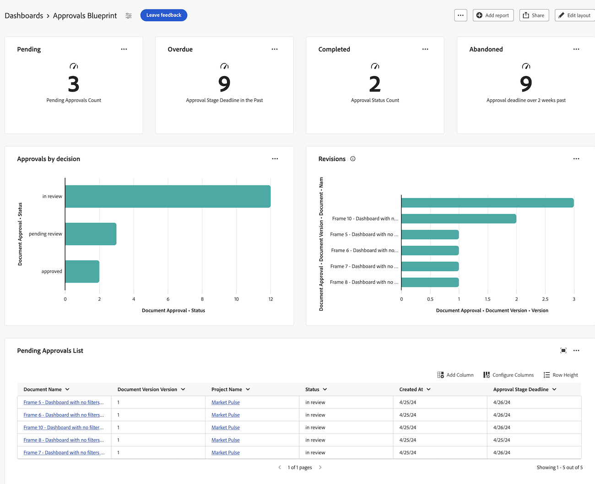
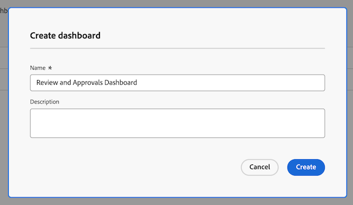
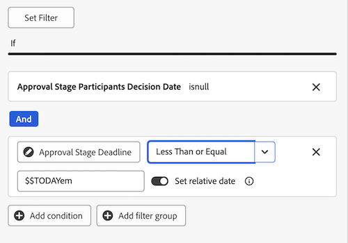
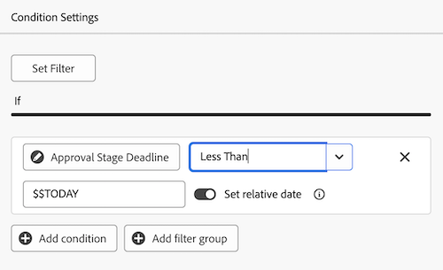

# Creare un dashboard di report per la revisione e le approvazioni

Puoi creare una dashboard di rapporti nell’area Dashboard Canvas per visualizzare informazioni dettagliate e di alto livello su revisioni e approvazioni con la funzionalità Unified Approvals.

>[!IMPORTANT]
>
>Questa funzionalità è disponibile solo per i clienti che utilizzano il servizio Unified Approvals e sono iscritti alla versione beta di Canvas Dashboards.

## Creare un dashboard

{{step1-to-dashboards}}

1. Nel pannello a sinistra, fai clic su **Dashboard Canvas**.
1. Fai clic su **Nuovo dashboard**.
1. Denomina il dashboard.
1. Aggiungi una descrizione (facoltativo).
1. Fai clic su **Crea**.
   

Dopo aver creato un dashboard, è possibile iniziare ad aggiungere indicatori KPI, grafici e tabelle. Per ulteriori informazioni, consulta le sezioni seguenti:

* [Aggiungere informazioni di revisione e approvazione di alto livello con KPI e grafici](#add-high-level-review-and-approval-information-with-kpis-and-charts)
* [Aggiungere informazioni dettagliate di revisione e approvazione con le tabelle](#add-detailed-review-and-approval-information-with-tables)

## Aggiungere informazioni di revisione e approvazione di alto livello con KPI e grafici

È possibile visualizzare informazioni di alto livello sulle approvazioni di documenti con indicatori KPI e grafici. Le informazioni di drill-down non sono attualmente disponibili nella versione beta.

### KPI

#### Approvazioni in sospeso

1. [Creare un dashboard](#create-a-dashboard) come descritto nella sezione precedente.
1. Nella scheda **KPI**, fai clic su **Aggiungi**.
1. Digita _Pending_ nella casella di testo **KPI Title**.
1. Digita _Approvazioni in sospeso_ nella casella di testo **Didascalia KPI**. Questo testo descrive ciò che l’indicatore KPI sta mostrando.
1. Nella parte superiore della pagina fare clic su **Seleziona campo KPI**.
1. Scorri verso il basso e individua la **cartella Approvazione documento**.
1. Scegli **Stato**, quindi seleziona **Conteggio** dal menu a discesa.
1. Fai clic su **Modifica filtro** > **Aggiungi condizione**.
   1. Fai clic sul filtro delle condizioni vuoto, fai clic su **Scegli un campo**, quindi scegli **Stato**.
   1. Lascia l&#39;operatore come **Uguale** e digita _in attesa di revisione_ nella casella di testo.

      
1. Fai clic su **Fine** nell&#39;angolo in alto a destra dello schermo.

#### Approvazioni scadute

1. [Creare un dashboard](#create-a-dashboard) come descritto nella sezione precedente.
1. Nella scheda **KPI**, fai clic su **Aggiungi**.
1. Digita _Scaduto_ nella casella di testo **Titolo KPI**.
1. Digita _Scadenza fase di approvazione nel passato_ nella casella di testo **Didascalia KPI**. Questo testo descrive ciò che l’indicatore KPI sta mostrando.
1. Nella parte superiore della pagina fare clic su **Seleziona campo KPI**.
1. Scorri verso il basso e individua la **cartella Approvazione documento**.
1. Scegli **Stato**, quindi seleziona **Conteggio** dal menu a discesa.
1. Fai clic su **Modifica filtro** > **Aggiungi condizione**:
   1. Fai clic sul filtro delle condizioni vuoto, fai clic su **Scegli un campo**, quindi scegli **Scadenza**.
   1. Cambia l&#39;operatore in **Minore di** e attiva la data relativa, quindi digita _$$TODAY_ nella casella di testo.

      
1. Fai clic su **Aggiungi condizione**:
   1. Fai clic sul filtro delle condizioni vuoto, fai clic su **Scegli un campo**, quindi scegli **Stato**.
   1. Cambia l&#39;operatore in **Non contiene**, quindi digita _approvato_ nella casella di testo.

      
1. Fai clic su **Fine** nell&#39;angolo in alto a destra dello schermo.

#### Approvazioni completate

1. [Creare un dashboard](#create-a-dashboard) come descritto nella sezione precedente.
1. Nella scheda **KPI**, fai clic su **Aggiungi**.
1. Digita _Completed_ nella casella di testo **KPI Title**.
1. Digitare _Conteggio stato approvazione_ nella casella di testo **Didascalia KPI**. Questo testo descrive ciò che l’indicatore KPI sta mostrando.
1. Nella parte superiore della pagina fare clic su **Seleziona campo KPI**.
1. Scorri verso il basso e individua la **cartella Approvazione documento**.
1. Scegli **Stato**, quindi seleziona **Conteggio** dal menu a discesa.
1. Fai clic su **Modifica filtro** > **Aggiungi condizione**:
   1. Fai clic sul filtro delle condizioni vuoto, fai clic su **Scegli un campo**, quindi scegli **Stato**.
   1. Cambia l&#39;operatore in **Contains** e digita _approve_ nella casella di testo.

      
1. Fai clic su **Aggiungi condizione**:
   1. Fai clic su **And** per modificarlo in **Or**.
   1. Fai clic sul filtro delle condizioni vuoto, fai clic su **Scegli un campo**, quindi scegli **Stato**.
   1. Cambia l&#39;operatore in **Uguale a**, quindi digita _revisionato_ nella casella di testo.

      
1. Fai clic su **Fine** nell&#39;angolo in alto a destra dello schermo.

#### Approvazioni abbandonate

1. [Creare un dashboard](#create-a-dashboard) come descritto nella sezione precedente.
1. Nella scheda **KPI**, fai clic su **Aggiungi**.
1. Digitare _Abandoned_ nella casella di testo **KPI Title**.
1. Digita _Scadenza approvazione oltre le 2 settimane precedenti_ nella casella di testo **Didascalia KPI**. Questo testo descrive ciò che l’indicatore KPI sta mostrando.
1. Nella parte superiore della pagina fare clic su **Seleziona campo KPI**.
1. Scorri verso il basso e individua la cartella **Document Approval Stage**.
1. Scegli **Scadenza**, quindi seleziona **Conteggio** dal menu a discesa.
1. Fai clic su **Modifica filtro** > **Aggiungi condizione**:
   1. Fai clic sul filtro delle condizioni vuoto, fai clic su **Scegli un campo**, quindi scegli **Stato**.
   1. Cambia l&#39;operatore in **Non contiene** e digita _approvato_ nella casella di testo.

      
1. Fai clic su **Aggiungi condizione**:
   1. Fai clic sul filtro delle condizioni vuoto, fai clic su **Scegli un campo**, quindi scegli **Scadenza**.
   1. Cambia l&#39;operatore in **Minore di**, quindi attiva la data relativa e digita _$$TODAY-2w_ nella casella di testo.

      
1. Fai clic su **Fine** nell&#39;angolo in alto a destra dello schermo.

### Grafici

#### Grafico Approvazioni per barra delle decisioni

1. [Creare un dashboard](#create-a-dashboard) come descritto nella sezione precedente.
1. Nella scheda **Grafico**, fai clic su **Aggiungi**.
1. Digita _Approvazioni per decisione_ nella casella di testo **Nome**.
1. (Facoltativo) Digitare una descrizione nella casella di testo **Descrizione**. Questo testo viene visualizzato come descrizione accanto al nome del grafico.
1. Fare clic su **Apri dettagli grafico**.
1. Nel menu a discesa **Tipo di grafico**, lascia selezionato **Grafico a barre**.
1. Nel menu a discesa **Tipo barra**, lascia selezionato **Semplice**.
1. Fare clic su **Aggiorna campo** per l&#39;asse **Inferiore (X)** e scegliere la prima cartella **Approvazione documento** e quindi **Stato**.
1. Imposta il tipo di aggregazione su **Count**.
1. Fare clic su **Aggiorna campo** per l&#39;asse **Sinistra (Y)** e scegliere la prima opzione **Approvazione documento**, quindi **Stato**.
1. Fai clic sull&#39;icona della scheda Filtro .
1. Fai clic su **Modifica filtro** > **Aggiungi condizione**:
   1. Fare clic sul filtro delle condizioni vuoto, fare clic su **Scegli un campo**, quindi scegliere **Versione documento**.
   1. Cambia l&#39;operatore in **Is Not Null**.

      
1. Fai clic su **Fine** nell&#39;angolo in alto a destra dello schermo.

#### Grafico a barre delle revisioni

1. [Creare un dashboard](#create-a-dashboard) come descritto nella sezione precedente.
1. Nella scheda **Grafico**, fai clic su **Aggiungi**.
1. Digita _Revisioni_ nella casella di testo **Nome**.
1. Digitare _Numero di revisioni per i documenti con decisioni incomplete pianificate prima della fine di questo mese_ nella casella di testo **Descrizione**. Questo testo viene visualizzato come descrizione accanto al nome del grafico.
1. Fare clic su **Apri dettagli grafico**.
1. Nel menu a discesa **Tipo di grafico**, lascia selezionato **Grafico a barre**.
1. Nel menu a discesa **Tipo barra**, lascia selezionato **Semplice**.
1. Fare clic su **Aggiorna campo** per l&#39;asse **Inferiore (X)** e scegliere la prima cartella **Approvazione documento** e quindi **Versione documento** > **Versione**.
1. Imposta il tipo di aggregazione su **Count**.
1. Fai clic su **Aggiorna campo** per l&#39;asse **Sinistra (Y)** e scegli la prima opzione **Approvazione documento**, quindi **Versione documento** > **Documento** > **Nome**.
1. Fare clic sull&#39;icona della scheda Filtro .
1. Fai clic su **Modifica filtro** > **Aggiungi condizione**:
   1. Fai clic sul filtro delle condizioni vuoto, fai clic su **Scegli un campo**, quindi scegli **Data decisione partecipanti fase di approvazione**.
   1. Cambia l&#39;operatore in **Is Null**.

      
1. Fai clic su **Modifica filtro** > **Aggiungi condizione**:
   1. Fai clic sul filtro delle condizioni vuoto, fai clic su **Scegli un campo**, quindi scegli **Scadenza fase di approvazione**.
   1. Modifica l&#39;operatore in **Minore di o uguale a**, quindi attiva Imposta data relativa e digita _$$TODAYem_ nella casella di testo.

      
1. Fai clic su **Fine** nell&#39;angolo in alto a destra dello schermo.

## Aggiungere informazioni dettagliate di revisione e approvazione con le tabelle

### Elenco approvazioni in sospeso

1. [Creare un dashboard](#create-a-dashboard) come descritto nella sezione precedente.
1. Nella scheda **Tabella**, fai clic su **Aggiungi**.
1. Digitare _Approvazioni in sospeso_ nella casella di testo **Nome**.
1. (Facoltativo) Digitare una descrizione nella casella di testo **Descrizione**. Questo testo viene visualizzato come descrizione accanto al nome del grafico.
1. Fare clic su **Apri impostazioni colonna**.
1. Fai clic su **Aggiungi colonna**, scorri verso il basso e fai clic sulla prima cartella **Approvazioni documenti**, quindi scegli **Stato**.
1. Aggiungi le seguenti colonne:

   <table>
    <tr>
    <td><strong>Nome progetto</strong></td>
    <td>Versione documento &gt; Documento &gt; Progetto &gt; Nome</td>
    </tr>
    <tr>
    <td><strong>Nome documento</strong></td>
    <td>Document Version &gt; Document &gt; type _Name_ nella casella di ricerca.</td>
    </tr>
    <tr>
    <td><strong>Versione documento</strong></td>
    <td>Versione documento &gt; Documento &gt; Versione</td>
    </tr>
    <tr>
    <td><strong>Scadenza</strong></td>
    <td>Approvazione documento &gt; Fase approvazione &gt; Scadenza</td>
    </tr>
    <tr>
    <td><strong>Richiesta di</strong></td>
    <td>Documento Approvazione &gt; Fase approvazione &gt; Partecipanti fase approvazione* &gt; Richiedente &gt; digita _Name_ nella casella di ricerca.</td>
    </tr>
     <tr>
    <td><strong>Data richiesta</strong></td>
    <td>Documento Approvazione &gt; Fase di approvazione &gt; Partecipanti fase di approvazione* &gt; Creato in</td>
    </tr>
     <tr>
    <td><strong>Approvatore</strong></td>
    <td>Document Approval &gt; Approval Stage &gt; Approval Stage Participants* &gt; Participant User &gt; type _Name_ nella casella di ricerca.</td>
    </tr>
    <table>

   *I partecipanti alla fase di approvazione vengono troncati nella fase di approvazione Pa.

1. Continua con [Aggiungi il filtro richiesto di seguito](#add-the-required-filter).

#### Aggiungi il filtro approvazioni in sospeso richiesto

1. Fare clic sull&#39;icona della scheda Filtro .
1. Fai clic su **Modifica filtro** > **Aggiungi condizione**:
   1. Fai clic sul filtro delle condizioni vuoto, fai clic su **Scegli un campo**, quindi scegli **Stato**.
   1. Cambia l&#39;operatore in **Equal**, quindi digita _in attesa di approvazione_.

      
1. Aggiungi i filtri facoltativi come descritto di seguito oppure fai clic su **Fine** nell&#39;angolo in alto a destra dello schermo.

**Filtri facoltativi**

Per visualizzare informazioni più specifiche a seconda del caso di utilizzo, puoi aggiungere condizioni di filtro aggiuntive. È possibile ricreare la tabella e aggiungere nuove condizioni di filtro in base al caso d’uso.

+++ Espandi per visualizzare altre opzioni filtro

**Progetti personali**

1. Fai clic su **Modifica filtro** > **Aggiungi condizione**:
   1. Fai clic sul filtro delle condizioni vuoto, fai clic su **Scegli un campo**, quindi scegli **Versione documento** > **Documento** > **Progetto** > **Proprietario** > digita _Nome_ nella casella di ricerca.
   1. Cambia l&#39;operatore in **Uguale**, quindi scegli **Io (Utente connesso)** per visualizzare i progetti in Workfront in cui sei contrassegnato come proprietario del progetto.

      
1. Fai clic su **Fine** nell&#39;angolo in alto a destra dello schermo.

**Approvazioni inviate**

1. Fai clic su **Modifica filtro** > **Aggiungi condizione**:
   1. Fai clic sul filtro delle condizioni vuoto, fai clic su **Scegli un campo**, quindi scegli **Fase approvazione** > **Partecipanti fase approvazione** > **Richiedente** > digita _Nome_ nella casella di ricerca.
   1. Cambia l&#39;operatore in **Uguale**, quindi scegli **Io (Utente connesso)** per visualizzare i progetti in Workfront in cui sei contrassegnato come proprietario del progetto.

      
1. Fai clic su **Fine** nell&#39;angolo in alto a destra dello schermo.

+++

### Elenco approvazioni scadute

1. [Creare un dashboard](#create-a-dashboard) come descritto nella sezione precedente.
1. Nella scheda Tabella fare clic su **Aggiungi**.
1. Digita _Approvazioni scadute_ nella casella di testo **Nome**.
1. (Facoltativo) Digitare una descrizione nella casella di testo **Descrizione**. Questo testo viene visualizzato come descrizione accanto al nome del grafico.
1. Fare clic su **Apri impostazioni colonna**.
1. Fai clic su **Aggiungi colonna**, scorri verso il basso e fai clic sulla prima cartella **Approvazioni documenti**, quindi scegli **Stato**.
1. Aggiungi le seguenti colonne:

   <table>
    <tr>
    <td><strong>Nome progetto</strong></td>
    <td>Versione documento &gt; Documento &gt; Progetto &gt; Nome</td>
    </tr>
    <tr>
    <td><strong>Nome documento</strong></td>
    <td>Document Version &gt; Document &gt; type _Name_ nella casella di ricerca.</td>
    </tr>
    <tr>
    <td><strong>Versione documento</strong></td>
    <td>Versione documento &gt; Documento &gt; Versione</td>
    </tr>
    <tr>
    <td><strong>Scadenza</strong></td>
    <td>Documento &gt; Fase di approvazione &gt; Scadenza</td>
    </tr>
    <tr>
    <td><strong>Richiesta di</strong></td>
    <td>Documento &gt; Fase approvazione &gt; Partecipanti fase approvazione* &gt; Richiedente &gt; digita _Name_ nella casella di ricerca.</td>
    </tr>
     <tr>
    <td><strong>Data richiesta</strong></td>
    <td>Documento &gt; Fase di approvazione &gt; Partecipanti fase di approvazione* &gt; Creato in</td>
    </tr>
     <tr>
    <td><strong>Approvatore</strong></td>
    <td>Documento &gt; Fase di approvazione &gt; Partecipanti fase di approvazione* &gt; Utente partecipante &gt; digita _Name_ nella casella di ricerca.</td>
    </tr>
    <table>

   *I partecipanti alla fase di approvazione vengono troncati nella fase di approvazione Pa.

1. Continua con [Aggiungi il filtro richiesto di seguito](#add-the-required-filter-1).

#### Aggiungi il filtro approvazioni scadute richieste

1. Fare clic sull&#39;icona della scheda Filtro .
1. Fai clic su **Modifica filtro** > **Aggiungi condizione**:
   1. Fai clic sul filtro delle condizioni vuoto, fai clic su **Scegli un campo**, quindi scegli **Fase approvazione** > **Scadenza**.
   1. Modifica l&#39;operatore in **Minore di**, attiva **Imposta data relativa**, quindi digita _$$TODAY_.

      
1. Aggiungi i filtri facoltativi come descritto di seguito oppure fai clic su **Fine** nell&#39;angolo in alto a destra dello schermo.

**Filtri facoltativi**

Per visualizzare informazioni più specifiche a seconda del caso di utilizzo, puoi aggiungere condizioni di filtro aggiuntive. Potrebbe essere necessario ricreare la tabella e aggiungere nuove condizioni di filtro facoltative in base al caso d’uso.

+++ Espandi per visualizzare altre opzioni filtro

**Progetti personali**

1. Fai clic su **Modifica filtro** > **Aggiungi condizione**:
   1. Fai clic sul filtro delle condizioni vuoto, fai clic su **Scegli un campo**, quindi scegli **Versione documento** > **Documento** > **Progetto** > **Proprietario** > digita _Nome_ nella casella di ricerca.
   1. Cambia l&#39;operatore in **Uguale**, quindi scegli **Io (Utente connesso)** per visualizzare i progetti in Workfront in cui sei contrassegnato come proprietario del progetto.

      
1. Fai clic su **Fine** nell&#39;angolo in alto a destra dello schermo.

**Approvazioni inviate**

1. Fai clic su **Modifica filtro** > **Aggiungi condizione**:
   1. Fai clic sul filtro delle condizioni vuoto, fai clic su **Scegli un campo**, quindi scegli **Fase approvazione** > **Partecipanti fase approvazione** > **Richiedente** > digita _Nome_ nella casella di ricerca.
   1. Cambia l&#39;operatore in **Uguale**, quindi scegli **Io (Utente connesso)** per visualizzare i progetti in Workfront in cui sei contrassegnato come proprietario del progetto.

      
1. Fai clic su **Fine** nell&#39;angolo in alto a destra dello schermo.

**Team**

1. Fai clic su **Modifica filtro** > **Aggiungi condizione**:
   1. Fai clic sul filtro delle condizioni vuoto, fai clic su **Scegli un campo**, quindi scegli **Fase approvazione** > **Partecipanti fase approvazione** > **Team partecipante** > digita _Nome_ nella casella di ricerca.
   1. Cambia l&#39;operatore in **Uguale**, quindi scegli **I miei team predefiniti (Utente connesso)** o **I miei altri team (Utente connesso)** per visualizzare i progetti assegnati al tuo team predefinito o ad altri team a cui sei connesso.

      
1. Fai clic su **Fine** nell&#39;angolo in alto a destra dello schermo.
+++
