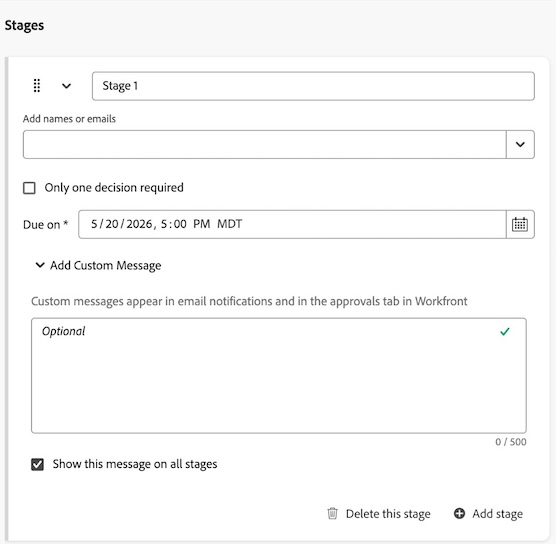

# Creare un flusso di lavoro di approvazione documento

{{highlighted-preview}}

Puoi richiedere l’approvazione di un documento in Adobe Workfront ad altri utenti o team, oppure chiedere loro di rivedere un documento senza doverlo approvare.

>[!IMPORTANT]
>
>Il contenuto di questo articolo fa riferimento alla funzionalità di approvazione dei documenti aggiornata, disponibile solo per account specifici. Per informazioni sui processi di approvazione standard, vedere gli articoli elencati in [Approvazioni di lavoro](/help/quicksilver/review-and-approve-work/manage-approvals/manage-approvals.md).

## Requisiti di accesso

+++ Espandi per visualizzare i requisiti di accesso per la funzionalità descritta in questo articolo.

<table style="table-layout:auto"> 
 <col> 
 <col> 
 <tbody> 
  <tr> 
   <td role="rowheader">Pacchetto Adobe Workfront</td> 
   <td> 
Qualsiasi pacchetto Workfront per gestire le approvazioni utilizzando lo storage Workfront legacy

Qualsiasi pacchetto di flusso di lavoro per gestire le approvazioni tramite l’archiviazione cloud Adobe
 </td> 
  </tr> 
  <tr> 
   <td role="rowheader">Licenza di Adobe Workfront</td>  
   <td>
   
Collaboratore o successiva

   
Revisione o successiva

   
Se utilizzi l’integrazione Frame.io, devi disporre di una licenza Standard per creare flussi di lavoro di approvazione.

   </td> 
  </tr> 
  <tr> 
   <td role="rowheader">Configurazioni del livello di accesso</td> 
   <td> 
Accesso di visualizzazione o superiore a progetti, attività, problemi, modelli, portafogli, programmi, report, dashboard e calendari, documenti
 </td> 
  </tr>
  <tr> 
   <td role="rowheader">Autorizzazioni sugli oggetti</td> 
   <td> 
Gestire l’accesso all’oggetto associato alla richiesta di accesso o approvazione 
 </td> 
  </tr> 
 </tbody> 
</table>

Per informazioni, consulta [Requisiti di accesso nella documentazione di Workfront](/help/quicksilver/administration-and-setup/add-users/access-levels-and-object-permissions/access-level-requirements-in-documentation.md).

+++

## Creare un flusso di lavoro di approvazione dal pannello Riepilogo nell’area dei documenti legacy in Produzione

Se l&#39;organizzazione utilizza l&#39;archiviazione Workfront, quando si accede ai documenti in Workfront verrà visualizzata l&#39;area documenti legacy. Per ulteriori informazioni sull&#39;archiviazione Workfront, vedere [Differenze tra l&#39;archiviazione cloud Adobe e l&#39;archiviazione Workfront legacy](/help/quicksilver/review-and-approve-work/esm-overview.md#differences-between-adobe-cloud-storage-and-legacy-workfront-storage).

Per creare un flusso di lavoro di approvazione:

1. Vai al progetto, all&#39;attività o al problema che contiene il documento, quindi seleziona **Documenti** nel pannello a sinistra.

1. Fare clic sul documento necessario per aprire il pannello Riepilogo documento per tale documento.

1. Seleziona la versione del documento per cui desideri creare un’approvazione nel menu a discesa della versione. La versione più recente è selezionata per impostazione predefinita.

1. Scorri fino alla sezione **Approvazioni**, quindi fai clic su **Crea flusso di lavoro**.

1. Compila i seguenti dettagli:

   <table>
   <tr>
   <td><strong>Nome fase</strong></td>
   <td>Aggiungete un nome di fase. È possibile modificare il nome in modo che sia più descrittivo, ad esempio <em>Revisione iniziale</em> o <em>Approvazione finale</em>.</td>
   </tr>
   <tr>
   <td><strong>Aggiungi nomi o e-mail</strong></td>
   <td>Inizia a digitare il nome di un utente o team da aggiungere come approvatore o revisore. Se si dispone solo di revisori, questi riceveranno una notifica e avranno la possibilità di completare la revisione, ma non sarà necessaria o presa alcuna decisione.</td>
   </tr>
   <tr>
   <td><strong>È necessaria una sola decisione (opzionale)</strong></td>
   <td>La prima persona che prende una decisione completa la fase.</td>
   </tr>
   <tr>
   <td><strong>Data di scadenza (facoltativo)</strong></td>
   <td>Imposta una data di scadenza per l’approvazione. Gli utenti e i team ricevono una notifica via e-mail 72 ore e in seguito 24 ore prima della data di scadenza specificata.</td>
   </tr>
   </table>

1. (Facoltativo) Ripeti il passaggio precedente per aggiungere altre fasi in base alle esigenze.

   >[!NOTE]
   >
   >Se aggiungi più fasi, il flusso di lavoro di approvazione procede nell’ordine in cui sono elencate. Quando tutte le decisioni necessarie vengono prese, inizia la fase successiva e la fase precedente viene bloccata.

   

## Creare un flusso di lavoro di approvazione dal pannello Riepilogo nell’area dei documenti legacy in Anteprima

Se l&#39;organizzazione utilizza l&#39;archiviazione Workfront, quando si accede ai documenti in Workfront verrà visualizzata l&#39;area documenti legacy. Per ulteriori informazioni sull&#39;archiviazione Workfront, vedere [Differenze tra l&#39;archiviazione cloud Adobe e l&#39;archiviazione Workfront legacy](/help/quicksilver/review-and-approve-work/esm-overview.md#differences-between-adobe-cloud-storage-and-legacy-workfront-storage).

Per creare un flusso di lavoro di approvazione:

1. Vai al progetto, all&#39;attività o al problema che contiene il documento, quindi seleziona **Documenti** nel pannello a sinistra.

1. Fare clic sul documento necessario per aprire il pannello Riepilogo documento per tale documento.

1. Selezionare la versione del documento per cui si desidera creare un&#39;approvazione nel menu a discesa versione. La versione più recente è selezionata per impostazione predefinita.

1. Scorri fino alla sezione **Approvazioni**, quindi fai clic su **Crea flusso di lavoro**.

1. Compila i seguenti dettagli:

   <table>
   <tr>
   <td><strong>Nome fase</strong></td>
   <td>Aggiungete un nome di fase. È possibile modificare il nome in modo che sia più descrittivo, ad esempio <em>Revisione iniziale</em> o <em>Approvazione finale</em>.</td>
   </tr>
   <tr>
   <td><strong>Aggiungi nomi o e-mail</strong></td>
   <td>Inizia a digitare il nome di un utente o team da aggiungere come approvatore o revisore. Se si dispone solo di revisori, questi riceveranno una notifica e avranno la possibilità di completare la revisione, ma non sarà necessaria o presa alcuna decisione.</td>
   </tr>
   <tr>
   <td><strong>È necessaria una sola decisione (facoltativo)</strong></td>
   <td>La prima persona che prende una decisione completa la fase.</td>
   </tr>
   <tr>
   <td><strong>Scadenza il (facoltativo)</strong></td>
   <td>Imposta una data di scadenza per l’approvazione. Gli utenti e i team ricevono una notifica via e-mail 72 ore e in seguito 24 ore prima della data di scadenza specificata.</td>
   </tr>
   <tr>
   <td><strong>Aggiungi messaggio personalizzato (facoltativo)</strong></td>
   <td>Digitare un messaggio nella casella di testo <strong>Aggiungi messaggio personalizzato</strong>. Il messaggio viene visualizzato nella notifica e-mail di approvazione e nella scheda Approvazioni in Workfront.
   
Quando si aggiunge una seconda fase, <strong>Mostra questo messaggio in tutte le fasi</strong> è selezionato per impostazione predefinita. Lascia selezionata questa opzione per utilizzare lo stesso messaggio in ogni fase. Per utilizzare un messaggio diverso per ogni fase, deselezionare <strong>Mostra il messaggio in tutte le fasi</strong>, quindi digitare il messaggio specifico per la fase nella casella di testo <strong>Aggiungi messaggio personalizzato</strong> di ogni fase, in base alle esigenze.
</td>
   </tr>
   </table>

1. (Facoltativo) Ripeti il passaggio precedente per aggiungere altre fasi in base alle esigenze.

   >[!NOTE]
   >
   >* Se aggiungi più fasi, il flusso di lavoro di approvazione procede nell’ordine in cui sono elencate. Quando tutte le decisioni necessarie vengono prese, inizia la fase successiva e la fase precedente viene bloccata.
   >* Se modifichi un messaggio personalizzato dopo la creazione del flusso di lavoro di approvazione, a tutti i partecipanti esistenti viene inviata una notifica e-mail aggiornata. Se aggiungi un partecipante in un secondo momento, il messaggio personalizzato viene incluso nella notifica e-mail.

   

## Creare un flusso di lavoro di approvazione dal pannello Riepilogo nella nuova area Documenti in Produzione

Se la tua organizzazione utilizza l’archiviazione cloud Adobe, quando accedi ai documenti in Workfront visualizzerai la nuova area Documenti. Per ulteriori informazioni sull&#39;archiviazione cloud Adobe, consulta [Panoramica sull&#39;archiviazione cloud Adobe](/help/quicksilver/review-and-approve-work/esm-overview.md).

Per creare un flusso di lavoro di approvazione:

1. Vai al progetto, all&#39;attività o al problema che contiene il documento, quindi seleziona **Documenti** nel pannello a sinistra.

1. Fai clic sul documento, quindi fai clic sull&#39;icona **Approvazioni** sul lato destro della pagina.

   

1. Fai clic su **Crea flusso di lavoro**, quindi compila i seguenti dettagli:

   <table>
   <tr>
   <td><strong>Nome fase</strong></td>
   <td>Aggiungete un nome di fase. È possibile modificare il nome in modo che sia più descrittivo, ad esempio <em>Revisione iniziale</em> o <em>Approvazione finale</em>.</td>
   </tr>
   <tr>
   <td><strong>Aggiungi nomi o e-mail</strong></td>
   <td>Inizia a digitare il nome di un utente o team da aggiungere come approvatore o revisore. Se si dispone solo di revisori, questi riceveranno una notifica e avranno la possibilità di completare la revisione, ma non sarà necessaria o presa alcuna decisione.</td>
   </tr>
   <tr>
   <td><strong>È necessaria una sola decisione (opzionale)</strong></td>
   <td>La prima persona che prende una decisione completa la fase.</td>
   </tr>
   <tr>
   <td><strong>Data di scadenza (facoltativo)</strong></td>
   <td>Imposta una data di scadenza per l’approvazione. Gli utenti e i team ricevono una notifica via e-mail 72 ore e in seguito 24 ore prima della data di scadenza specificata.</td>
   </tr>
   </table>

1. (Facoltativo) Ripeti il passaggio precedente per aggiungere altre fasi in base alle esigenze.

   >[!NOTE]
   >
   >Se aggiungi più fasi, il flusso di lavoro di approvazione procede nell’ordine in cui sono elencate. Quando tutte le decisioni necessarie vengono prese, inizia la fase successiva e la fase precedente viene bloccata.

   

## Creare un flusso di lavoro di approvazione dal pannello Riepilogo nella nuova area Documenti in Anteprima

Se la tua organizzazione utilizza l’archiviazione cloud Adobe, quando accedi ai documenti in Workfront visualizzerai la nuova area Documenti. Per ulteriori informazioni sull&#39;archiviazione cloud Adobe, consulta [Panoramica sull&#39;archiviazione cloud Adobe](/help/quicksilver/review-and-approve-work/esm-overview.md).

Per creare un flusso di lavoro di approvazione:

1. Vai al progetto, all&#39;attività o al problema che contiene il documento, quindi seleziona **Documenti** nel pannello a sinistra.

1. Fai clic sul documento, quindi fai clic sull&#39;icona **Approvazioni** sul lato destro della pagina.

   

1. Fai clic su **Crea flusso di lavoro**, quindi compila i seguenti dettagli:

   <table>
   <tr>
   <td><strong>Nome fase</strong></td>
   <td>Aggiungete un nome di fase. È possibile modificare il nome in modo che sia più descrittivo, ad esempio <em>Revisione iniziale</em> o <em>Approvazione finale</em>.</td>
   </tr>
   <tr>
   <td><strong>Aggiungi nomi o e-mail</strong></td>
   <td>Inizia a digitare il nome di un utente o team da aggiungere come approvatore o revisore. Se si dispone solo di revisori, questi riceveranno una notifica e avranno la possibilità di completare la revisione, ma non sarà necessaria o presa alcuna decisione.</td>
   </tr>
   <tr>
   <td><strong>È necessaria una sola decisione (facoltativo)</strong></td>
   <td>La prima persona che prende una decisione completa la fase.</td>
   </tr>
   <tr>
   <td><strong>Scadenza il (facoltativo)</strong></td>
   <td>Imposta una data di scadenza per l’approvazione. Gli utenti e i team ricevono una notifica via e-mail 72 ore e in seguito 24 ore prima della data di scadenza specificata.</td>
   </tr>
   <tr>
   <td><strong>Aggiungi messaggio personalizzato (facoltativo)</strong></td>
   <td>Digitare un messaggio nella casella di testo <strong>Aggiungi messaggio personalizzato</strong>. Il messaggio viene visualizzato nella notifica e-mail di approvazione e nella scheda Approvazioni in Workfront.
   
Quando si aggiunge una seconda fase, <strong>Mostra questo messaggio in tutte le fasi</strong> è selezionato per impostazione predefinita. Lascia selezionata questa opzione per utilizzare lo stesso messaggio in ogni fase. Per utilizzare un messaggio diverso per ogni fase, deselezionare <strong>Mostra il messaggio in tutte le fasi</strong>, quindi digitare il messaggio specifico per la fase nella casella di testo <strong>Aggiungi messaggio personalizzato</strong> di ogni fase.
</td>
   </tr>
   </table>

1. (Facoltativo) Ripeti il passaggio precedente per aggiungere altre fasi in base alle esigenze.

   >[!NOTE]
   >
   >* Se aggiungi più fasi, il flusso di lavoro di approvazione procede nell’ordine in cui sono elencate. Quando tutte le decisioni necessarie vengono prese, inizia la fase successiva e la fase precedente viene bloccata.
   >* Se modifichi un messaggio personalizzato dopo la creazione del flusso di lavoro di approvazione, a tutti i partecipanti esistenti viene inviata una notifica e-mail aggiornata. Se aggiungi un partecipante in un secondo momento, il messaggio personalizzato viene incluso nella notifica e-mail.

   

<!--
## Resubmit an approval on a new version

Document approval decisions are not automatically reset when you upload a new version. For example, if your document is approved with changes, the decision will show "changes" as the decision, even if you upload a new version with the specified changes. You can clear the decision on a new version if you manually resubmit the approval.

1. Go to the project, task, or issue that contains the document, then select **Documents**.
1. Find the document you need.

1. Scroll down to the **Approvals** section in the Summary, click the More icon, then click Resubmit.

   
-->
