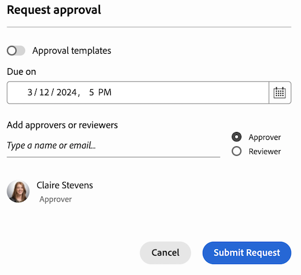

# Creare una richiesta di revisione o approvazione documento

cÈ possibile richiedere ad altri utenti o team l&#39;approvazione di un documento in Adobe Workfront oppure chiedere loro di rivedere un documento senza doverlo approvare.

>[!IMPORTANT]
>
>Il contenuto di questo articolo fa riferimento alla funzionalità di approvazione dei documenti aggiornata, disponibile solo per account specifici. Per informazioni sui processi di approvazione standard, vedere gli articoli elencati in [Approvazioni di lavoro](/help/quicksilver/review-and-approve-work/manage-approvals/manage-approvals.md).

## Requisiti di accesso

+++ Espandi per visualizzare i requisiti di accesso per la funzionalità in questo articolo.

Per eseguire i passaggi descritti in questo articolo, è necessario disporre dei seguenti diritti di accesso:

<table style="table-layout:auto"> 
 <col> 
 <col> 
 <tbody> 
  <tr> 
   <td role="rowheader">Piano Adobe Workfront*</td> 
   <td> 
Qualsiasi
 </td> 
  </tr> 
  <tr> 
   <td role="rowheader">Licenza Adobe Workfront*</td>  
   <td> 
Revisione o successiva
 </td> 
  </tr> 
  <tr> 
   <td role="rowheader">Configurazioni del livello di accesso*</td> 
   <td> 
Accesso a progetti, attività, problemi, modelli, Portfoli, programmi, report, dashboard e calendari, documenti o versioni successive
 
Nota: se non disponi ancora dell’accesso, chiedi all’amministratore di Workfront se ha impostato restrizioni aggiuntive nel tuo livello di accesso. Per informazioni su come un amministratore di Workfront può modificare il tuo livello di accesso, consulta <a href="/help/quicksilver/administration-and-setup/add-users/configure-and-grant-access/create-modify-access-levels.md" class="MCXref xref">Creare o modificare livelli di accesso personalizzati</a>.
 </td> 
  </tr>
  <tr> 
   <td role="rowheader">Autorizzazioni oggetto</td> 
   <td> 
Gestire l’accesso all’oggetto associato alla richiesta di accesso o approvazione 
 
Per informazioni sulla richiesta di accesso aggiuntivo, vedere <a href="/help/quicksilver/workfront-basics/grant-and-request-access-to-objects/request-access.md" class="MCXref xref">Richiedere l'accesso agli oggetti </a>.
 </td> 
  </tr> 
 </tbody> 
</table>

&#42;Per conoscere il piano, il tipo di licenza o l&#39;accesso di cui si dispone, contattare l&#39;amministratore di Workfront.

+++

## Creare una richiesta di revisione o approvazione documento dalla pagina del documento

1. Passa il puntatore del mouse sul documento, quindi fai clic su Dettagli documento.
   

1. Accanto al nome del documento, seleziona la versione del documento per cui desideri creare un’approvazione nel menu a discesa della versione. Per impostazione predefinita, viene selezionata la versione più recente.

1. Fai clic su **Approvazioni** nel riquadro a sinistra.

1. (Facoltativo) Imposta una scadenza per l’approvazione. Gli utenti e i team ricevono una notifica via e-mail 72 ore e in seguito 24 ore prima della scadenza specificata.

1. Per aggiungere un responsabile approvazione, fare clic su **Responsabile approvazione** e iniziare a digitare il nome di un utente o di un team.

1. Per aggiungere un revisore, selezionare la casella di controllo **Revisore** e iniziare a digitare il nome di un utente o di un team.

   

1. Ripeti il passaggio precedente per aggiungere altri approvatori o revisori.

## Creare una richiesta di revisione o approvazione del documento dal riquadro Riepilogo documento

1. Vai al progetto, all&#39;attività o al problema che contiene il documento, quindi seleziona **Documenti**.

1. Fare clic sul documento necessario per aprire il riquadro Riepilogo documento per il documento.

1. Seleziona la versione del documento per cui desideri creare un’approvazione nel menu a discesa della versione. Per impostazione predefinita, viene selezionata la versione più recente.

1. Scorri verso il basso fino alla sezione **Approvazioni** nel riquadro Riepilogo documento, quindi fai clic su **Aggiungi**.

1. (Facoltativo) Imposta una scadenza per l’approvazione. Gli utenti e i team ricevono una notifica via e-mail 72 ore e in seguito 24 ore prima della scadenza specificata.

1. Per aggiungere un responsabile approvazione, fare clic su **Responsabile approvazione** e iniziare a digitare il nome di un utente o di un team.

1. Per aggiungere un revisore, selezionare la casella di controllo **Revisore** e iniziare a digitare il nome di un utente o di un team.

   

1. Ripeti il passaggio precedente per aggiungere altri approvatori o revisori.

<!--
## Resubmit an approval on a new version

Document approval decisions are not automatically reset when you upload a new version. For example, if your document is approved with changes, the decision will show "changes" as the decision, even if you upload a new version with the specified changes. You can clear the decision on a new version if you manually resubmit the approval.

1. Go to the project, task, or issue that contains the document, then select **Documents**.
1. Find the document you need.

1. Scroll down to the **Approvals** section in the Summary, click the More icon, then click Resubmit.

   
-->
