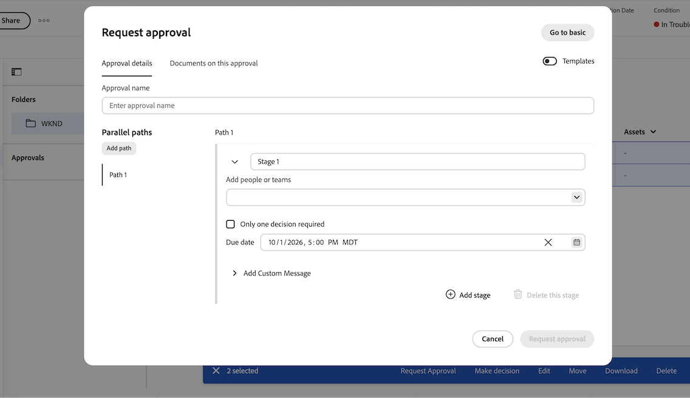

# Creare un’approvazione raggruppata

Le informazioni su questa pagina non sono disponibili nell&#39;ambiente Sandbox di anteprima perché l&#39;integrazione Frame.io non è disponibile. Questa funzionalità sarà disponibile negli ambienti di produzione il 14 e 15 ottobre 2026.

Un’approvazione raggruppata raggruppa più documenti in un unico flusso di lavoro di approvazione. È possibile utilizzare la modalità Base e Avanzate, più fasi e percorsi paralleli con approvazioni raggruppate, proprio come con le approvazioni a documento singolo.

Le approvazioni raggruppate sono disponibili solo nella nuova area Documenti, che viene visualizzata quando l’organizzazione utilizza l’archiviazione cloud Adobe. Per ulteriori informazioni, consulta [Panoramica sull&#39;archiviazione cloud Adobe](/help/quicksilver/review-and-approve-work/esm-overview.md).

## Requisiti di accesso

+++ Espandi per visualizzare i requisiti di accesso per la funzionalità descritta in questo articolo.

<table style="table-layout:auto">
 <col>
 <col>
 <tbody>
  <tr>
   <td role="rowheader">Pacchetto Adobe Workfront</td>
   <td> 
Qualsiasi pacchetto di flusso di lavoro per gestire le approvazioni tramite l’archiviazione cloud Adobe
 </td>
  </tr>
  <tr>
   <td role="rowheader">Licenza di Adobe Workfront</td>
   <td>
   
Collaboratore o successiva

   
Revisione o successiva

   
Per gli oggetti che utilizzano l’archiviazione cloud di Adobe, è necessario disporre di una licenza Standard per creare flussi di lavoro di approvazione.

   </td>
  </tr>
  <tr>
   <td role="rowheader">Configurazioni del livello di accesso</td>
   <td> 
Accesso di visualizzazione o superiore a progetti, attività, problemi, modelli, portafogli, programmi, report, dashboard, calendari e documenti
</td>
  </tr>
  <tr>
   <td role="rowheader">Autorizzazioni sugli oggetti</td>
   <td> 
Gestire l’accesso all’oggetto associato alla richiesta o all’approvazione
</td>
  </tr>
 </tbody>
</table>

Per informazioni, consulta [Requisiti di accesso nella documentazione di Workfront](/help/quicksilver/administration-and-setup/add-users/access-levels-and-object-permissions/access-level-requirements-in-documentation.md).

+++

## Creare un’approvazione di base raggruppata

Per creare un’approvazione raggruppata in una sola fase:

1. Vai al progetto, all&#39;attività o al problema che contiene i documenti, quindi seleziona **Documenti** nel pannello a sinistra.

1. Fare clic sul primo documento che si desidera includere, quindi fare clic sui documenti aggiuntivi per selezionare più documenti.

1. Con i documenti selezionati, fai clic su **Richiedi approvazione** nel menu in basso. La finestra di dialogo **Richiedi approvazione** si apre in modalità Base.

   

1. Compila i seguenti dettagli:

   <table>
   <tr>
   <td><strong>Utilizzare un modello di approvazione (facoltativo)</strong></td>
   <td>Il campo dei modelli è compresso per impostazione predefinita. Fai clic sul campo per espanderlo, quindi seleziona un modello dal menu a discesa. Se il modello ha un percorso e una fase, viene applicato in modalità Base. Se il modello ha più di una fase o più percorsi, la finestra di dialogo passa automaticamente alla modalità Avanzata e qualsiasi input immesso in modalità Base viene sostituito dal contenuto del modello.</td>
   </tr>
   <tr>
   <td><strong>Aggiungi persone o team in anteprima</strong></td>
   <td>
Inizia a digitare un nome utente, un team o un indirizzo e-mail, quindi scegli se si tratta di un <strong>Approvatore</strong> o di un <strong>Revisore</strong>. Workfront aggiunge ogni membro attivo di un team singolarmente.

   
Nota: se un utente è già stato aggiunto, o appartiene a più team aggiunti, viene incluso una volta.
</td>
   </tr>
   <tr>
   <td><strong>È necessaria una sola decisione (facoltativo)</strong></td>
   <td>La prima persona che prende una decisione completa la fase.</td>
   </tr>
   <tr>
   <td><strong>Scadenza il (facoltativo)</strong></td>
   <td>Imposta una data di scadenza per l’approvazione. Gli utenti ricevono una notifica via e-mail 72 ore e in seguito 24 ore prima della data di scadenza specificata.</td>
   </tr>
   <tr>
   <td><strong>Aggiungi messaggio personalizzato (facoltativo)</strong></td>
   <td>Digitare un messaggio nella casella di testo <strong>Aggiungi messaggio personalizzato</strong>. Il messaggio viene visualizzato nella notifica e-mail di approvazione e nella scheda Approvazioni in Workfront.</td>
   </tr>
   </table>

1. (Facoltativo) Fai clic sulla scheda **Documenti** per esaminare i documenti inclusi in questa approvazione.

1. Fai clic su **Richiedi approvazione**.

   

## Creare un’approvazione raggruppata avanzata

La modalità avanzata supporta i percorsi paralleli. Ogni percorso viene eseguito in modo indipendente e contiene uno o più stadi sequenziali. Quando vengono prese tutte le decisioni necessarie in una fase, inizia la fase successiva in tale percorso, la fase precedente viene bloccata e i revisori e gli approvatori della nuova fase ricevono una notifica e-mail.

Una decisione &quot;Lavoro necessario&quot; interrompe il percorso su cui si trova, ma non influisce sul flusso di lavoro di approvazione su altri percorsi.

<!--
You can configure up to 30 paths and 100 stages total.
-->

Per creare un’approvazione avanzata raggruppata:

1. Vai al progetto, all&#39;attività o al problema che contiene i documenti, quindi seleziona **Documenti** nel pannello a sinistra.

1. Fare clic sul primo documento che si desidera includere, quindi fare clic sui documenti aggiuntivi per selezionare più documenti.

1. Con i documenti selezionati, fai clic su **Richiedi approvazione** nel menu in basso.

   

1. Nella parte superiore destra della finestra di dialogo **Richiedi approvazione**, fai clic su **Vai a pagina avanzata**. Qualsiasi input immesso in modalità Base viene mantenuto e applicato a **Percorso 1**, **Stadio 1**.

   >[!TIP]
   >
   >Durante la creazione dell&#39;approvazione, puoi tornare alla modalità Base facendo clic su **Vai alla modalità Base** in alto a destra. Dopo aver inviato la richiesta di approvazione, l&#39;opzione **Vai a base** non è più disponibile.

1. Inserire i dettagli per la fase 1 del percorso 1:

   <table>
   <tr>
   <td><strong>Nome fase</strong></td>
   <td>Le fasi sono denominate <em>Fase 1</em>, <em>Fase 2</em> e così via per impostazione predefinita. Rinomina la fase in modo che sia più descrittiva, ad esempio <em>Revisione iniziale</em> o <em>Approvazione finale</em>.</td>
   </tr>
   <tr>
   <td><strong>Aggiungi persone o team in anteprima</strong></td>
   <td>
Inizia a digitare un nome utente, un team o un indirizzo e-mail, quindi scegli se si tratta di un <strong>Approvatore</strong> o di un <strong>Revisore</strong>. Workfront aggiunge ogni membro attivo di un team singolarmente.

   
Nota: se un utente è già stato aggiunto, o appartiene a più team aggiunti, viene incluso una volta.
</td>
   </tr>
   <tr>
   <td><strong>È necessaria una sola decisione (facoltativo)</strong></td>
   <td>La prima persona che prende una decisione completa la fase.</td>
   </tr>
   <tr>
   <td><strong>Scadenza il (facoltativo)</strong></td>
   <td>La prima fase di ogni percorso supporta una data di scadenza assoluta. Ogni fase successiva del percorso supporta una data di scadenza relativa (il numero di giorni a partire da cui si apre la fase). Gli utenti ricevono una notifica via e-mail 72 ore e in seguito 24 ore prima della data di scadenza.</td>
   </tr>
   <tr>
   <td><strong>Aggiungi messaggio personalizzato (facoltativo)</strong></td>
   <td>Digitare un messaggio nella casella di testo <strong>Aggiungi messaggio personalizzato</strong>. Il messaggio viene visualizzato nella notifica e-mail di approvazione e nella scheda Approvazioni in Workfront.
Quando si aggiunge una seconda fase, <strong>Mostra questo messaggio in tutte le fasi</strong> è selezionato per impostazione predefinita. Lascia selezionata questa opzione per utilizzare lo stesso messaggio in ogni fase. Per utilizzare un messaggio diverso per ogni fase, deselezionare <strong>Mostra il messaggio in tutte le fasi</strong>, quindi digitare il messaggio specifico per la fase nella casella di testo <strong>Aggiungi messaggio personalizzato</strong> di ogni fase.
</td>
   </tr>
   </table>

1. (Facoltativo) Aggiungere fasi aggiuntive al percorso 1:
   1. Fare clic su **Aggiungi fase** per aggiungere un&#39;altra fase al percorso corrente. Le fasi di un percorso vengono eseguite in sequenza nell&#39;ordine in cui sono elencate.
   1. Inserisci i dettagli per la nuova fase, quindi ripeti questo passaggio per aggiungere altre fasi in base alle esigenze.

      >[!NOTE]
      >
      >È possibile riordinare gli stadi all&#39;interno di un tracciato, ma non è possibile spostare uno stadio da un tracciato all&#39;altro. Ogni percorso può avere un numero diverso di stadi.

1. (Facoltativo) Aggiungi un percorso parallelo:
   1. In **Percorsi paralleli** sul lato sinistro della schermata, fare clic su **Aggiungi percorso** per aggiungere un altro percorso.
   1. Seguire gli stessi passaggi per aggiungere stadi e partecipanti al nuovo percorso. Ogni percorso viene eseguito in modo indipendente, in modo da poter avere un numero diverso di stadi e partecipanti diversi in ogni percorso.

1. (Facoltativo) Per rimuovere un percorso, passa il cursore sull’etichetta del percorso e fai clic sull’icona del cestino. Impossibile rimuovere **Percorso 1** e riordinare i percorsi. Altri percorsi possono essere rimossi solo se nessuna fase all&#39;interno del percorso è bloccata o completata.

1. (Facoltativo) Per cancellare tutti i percorsi e gli stadi e ricominciare, fai clic su **Reimposta** nell&#39;angolo in alto a destra.

1. (Facoltativo) Fai clic sulla scheda **Documenti** per esaminare i documenti inclusi in questa approvazione.

1. Fai clic su **Richiedi approvazione**.

   

<!--

## Add additional documents to a grouped approval

You can add additional documents to a grouped approval after the approval has been created as long as the first stage has not been completed. 

To add an additional document to a grouped approval:

1. Click any document in the grouped approval, then click **Manage Approval** in the bottom menu.
1. Click **Documents on this approval**, then click **Add**.

   
1. Choose the documents you want to add, then click **Add to approval**. 
1. Once you add all of the documents, click **Edit approval**. The new documents are added to the grouped approval and all participants are notified of the change.

-->

## Limitazioni note

* Al momento non è possibile aggiungere o rimuovere documenti da un flusso di lavoro di approvazione raggruppato una volta creato. Questa funzionalità è pianificata per una versione futura.
* Le approvazioni raggruppate sono temporaneamente limitate a 3 percorsi e 25 documenti per gruppo.