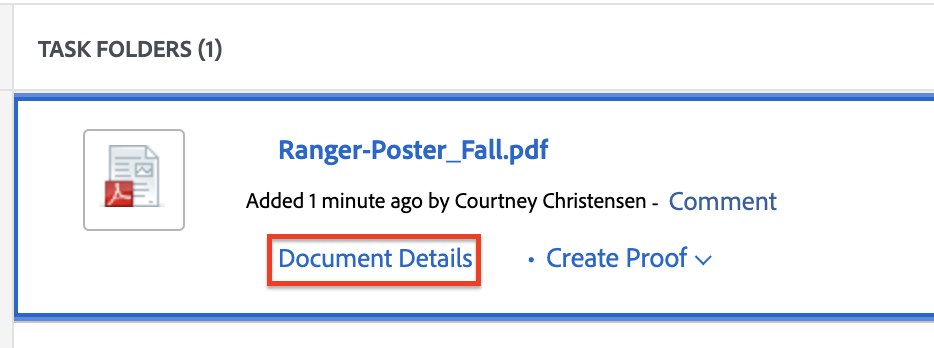

# Creare una richiesta di revisione o approvazione per una risorsa Frame.io

>[!IMPORTANT]
>
>Il contenuto di questo articolo si riferisce alla funzionalità di approvazione aggiornata, disponibile solo per account specifici. Per informazioni sui processi di approvazione standard, vedere gli articoli elencati in [Approvazioni di lavoro](/help/quicksilver/review-and-approve-work/manage-approvals/manage-approvals.md).

<!--
## Access requirements

You must have the following access to perform the steps in this article:

<table style="table-layout:auto"> 
 <col> 
 <col> 
 <tbody> 
  <tr> 
   <td role="rowheader">Adobe Workfront plan*</td> 
   <td> 
Any
 </td> 
  </tr> 
  <tr> 
   <td role="rowheader">Adobe Workfront license*</td>  
   <td> 
Review or higher
 </td> 
  </tr> 
  <tr> 
   <td role="rowheader">Access level configurations*</td> 
   <td> 
View or higher access to Projects, Tasks, Issues, Templates, Portfolios, Programs, Reports, Dashboards, and Calendars, Documents
 
Note: If you still don't have access, ask your Workfront administrator if they set additional restrictions in your access level. For information on how a Workfront administrator can modify your access level, see <a href="/help/quicksilver/administration-and-setup/add-users/configure-and-grant-access/create-modify-access-levels.md" class="MCXref xref">Create or modify custom access levels</a>.
 </td> 
  </tr>
  <tr> 
   <td role="rowheader">Object permissions</td> 
   <td> 
Manage access to the object associated with the request access or approval 
 
For information on requesting additional access, see <a href="/help/quicksilver/workfront-basics/grant-and-request-access-to-objects/request-access.md" class="MCXref xref">Request access to objects </a>.
 </td> 
  </tr> 
 </tbody> 
</table>

&#42;To find out what plan, license type, or access you have, contact your Workfront administrator.
-->

## Creare una richiesta di revisione o approvazione dal riepilogo del documento

1. Vai al progetto, all&#39;attività o al problema che contiene Frame.io connesso, quindi seleziona **Documenti**.

   >[!TIP]
   >
   >Le risorse collegate a Frame.io hanno accanto il logo Frame.io.

1. Fai clic sulla risorsa connessa Frame.io necessaria per aprire il pannello Riepilogo documento.

1. (Facoltativo) Nel menu a discesa **Versione**, seleziona la versione della risorsa per la quale vuoi creare un&#39;approvazione. La versione più recente è selezionata per impostazione predefinita.

1. Scorri verso il basso fino alla sezione **Approvazioni**, quindi fai clic su **Aggiungi**.

1. (Facoltativo) Imposta una scadenza per l’approvazione. Gli utenti e i team ricevono una notifica via e-mail 72 ore e in seguito 24 ore prima della scadenza specificata.

1. Per aggiungere un responsabile approvazione, fare clic su **Responsabile approvazione** e iniziare a digitare il nome di un utente o di un team.

1. Per aggiungere un revisore, selezionare la casella di controllo **Revisore** e iniziare a digitare il nome di un utente o di un team.

   

1. Ripeti il passaggio precedente per aggiungere altri approvatori o revisori.

## Creare una richiesta di revisione o approvazione dalla pagina Dettagli documento

1. Passa il puntatore del mouse sul documento, quindi fai clic su **Dettagli documento**.
   

1. Accanto al nome del documento, selezionare la versione del documento per la quale si desidera creare un&#39;approvazione. La versione più recente è selezionata per impostazione predefinita.

1. Nel pannello a sinistra, fai clic su **Approvazioni**.

1. (Facoltativo) Imposta una scadenza per l’approvazione. Gli utenti e i team ricevono una notifica via e-mail 72 ore e in seguito 24 ore prima della scadenza specificata.

1. Per aggiungere un responsabile approvazione, fare clic su **Responsabile approvazione** e iniziare a digitare il nome di un utente o di un team.

1. Per aggiungere un revisore, selezionare la casella di controllo **Revisore** e iniziare a digitare il nome di un utente o di un team.

   

1. Ripeti il passaggio precedente per aggiungere altri approvatori o revisori.

<!--
## Resubmit an approval on a new version

Document approval decisions are not automatically reset when you upload a new version. For example, if your document is approved with changes, the decision will show "changes" as the decision, even if you upload a new version with the specified changes. You can clear the decision on a new version if you manually resubmit the approval.

1. Go to the project, task, or issue that contains the document, then select **Documents**.
1. Find the document you need.

1. Scroll down to the **Approvals** section in the Summary, click the More icon, then click Resubmit.

   
-->
