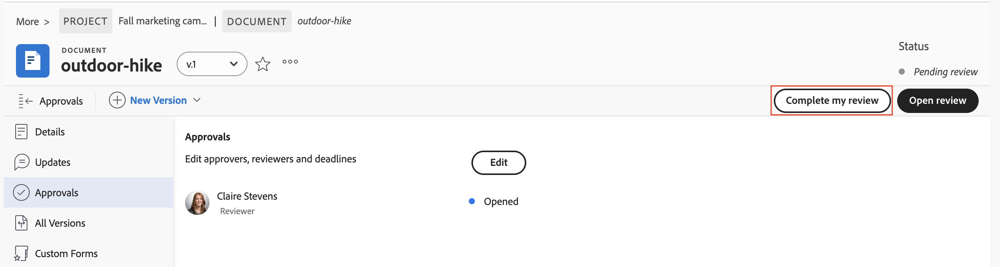

# Revisione e approvazione con il visualizzatore Frame.io

È possibile rivedere e approvare i documenti in Workfront utilizzando il visualizzatore Frame.io.

La revisione dei documenti Workfront con il visualizzatore Frame.io consente di lasciare commenti o contrassegnare sezioni specifiche di un documento, un&#39;immagine o un video per collaborare in modo efficiente con il team e garantire che il feedback sia chiaro e actionable.

Per ulteriori informazioni sull&#39;integrazione Frame.io con Workfront, consulta [Panoramica sull&#39;integrazione Frame.io](/help/quicksilver/review-and-approve-work/native-integrations/frame-io/frame-int-overview.md).

<!--## Access requirements

+++ Expand to view access requirements for the functionality in this article.

<table style="table-layout:auto"> 
 <col> 
 </col> 
 <col> 
 </col> 
 <tbody> 
  <tr> 
   <td role="rowheader">Adobe Workfront package</td> 
   <td> 
 Any
 </td> 
  </tr> 
  <tr> 
   <td role="rowheader">Adobe Workfront license</td> 
   <td> 
Request or higher

   
Contributor or higher
 </td> 
  </tr> 
  <tr data-mc-conditions=""> 
   <td role="rowheader">Access level configurations</td> 
   <td> 
Edit access to Documents
  </td> 
  </tr> 
  <tr data-mc-conditions=""> 
   <td role="rowheader">Object permissions</td> 
   <td> 
Edit access to the object associated with the document
  </td> 
  </tr> 
 </tbody> 
</table>

For information, see [Access requirements in Workfront documentation](/help/quicksilver/administration-and-setup/add-users/access-levels-and-object-permissions/access-level-requirements-in-documentation.md).

+++ -->

## Prerequisiti

* È necessario che nell’istanza di Workfront siano configurate l’integrazione Workfront e Frame.io. Per ulteriori informazioni, vedere [Panoramica dell&#39;integrazione Frame.io](/help/quicksilver/review-and-approve-work/native-integrations/frame-io/frame-int-overview.md#integration-requirements).

## Rivedere un documento

In qualità di revisore, puoi aggiungere commenti e contrassegnare le risorse. Al termine, puoi contrassegnare la recensione come completata in Workfront. Per far avanzare la risorsa nel processo di approvazione, non è necessario contrassegnare la revisione come completata.

1. Vai alla notifica e-mail di revisione e fai clic su **Vai alla revisione**.
o
Vai alla home page di Workfront, trova il widget Le mie approvazioni, quindi fai clic su **Apri revisione**.

   >[!NOTE]
   > 
   >Potrebbe essere necessario aggiungere il widget Approvazioni personali alla home page. Per ulteriori informazioni, vedere [Aggiungere, modificare o rimuovere widget nella Home](/help/quicksilver/workfront-basics/using-home/using-the-home-area/add-edit-remove-widgets-in-new-home.md).

1. In Frame.io, usate gli strumenti di commento per lasciare un feedback o porre domande.
I commenti e il markup delle risorse sono visibili solo nel visualizzatore Frame.io. I commenti non vengono visualizzati in Workfront. Per ulteriori informazioni sull&#39;utilizzo del visualizzatore Frame.io, vedere [Commenti sul supporto](https://help.frame.io/en/articles/9105251-commenting-on-your-media).
1. Quando si è soddisfatti del documento, tornare alla pagina Dettagli documento in Workfront e contrassegnare la revisione come completata.

   

## Approvare un documento

In qualità di approvatore, puoi aggiungere commenti e contrassegnare le risorse. È necessario decidere se portare avanti il processo di approvazione.

Il documento non passa a uno stato approvato finché tutti gli approvatori assegnati non scelgono &quot;approvato&quot;.

Per prendere una decisione su un documento:

1. Vai alla notifica e-mail di revisione e fai clic su **Vai alla revisione**.
o
Vai alla home page di Workfront, trova il widget Le mie approvazioni, quindi fai clic su **Apri revisione**.

   >[!NOTE]
   > 
   >Potrebbe essere necessario aggiungere il widget Approvazioni personali alla home page. Per ulteriori informazioni, vedere [Aggiungere, modificare o rimuovere widget nella Home](/help/quicksilver/workfront-basics/using-home/using-the-home-area/add-edit-remove-widgets-in-new-home.md).

1. In Frame.io, usate gli strumenti di commento per lasciare un feedback o porre domande. I commenti e il markup delle risorse sono visibili solo nel visualizzatore Frame.io. Per ulteriori informazioni sull&#39;utilizzo del visualizzatore Frame.io, vedere [Commenti sul supporto](https://help.frame.io/en/articles/9105251-commenting-on-your-media).
1. Una volta che si è soddisfatti del documento, è possibile scegliere una delle seguenti decisioni nel visualizzatore Frame.io:

   * **Approva**: la risorsa non necessita di modifiche ed è pronta per l&#39;uso.
   * **Lavoro necessario**: la risorsa richiede modifiche e non è pronta per l&#39;uso. Una volta apportate le modifiche specificate, la risorsa deve essere caricata come nuova versione e passare attraverso un altro ciclo di approvazioni. Per ulteriori informazioni, vedere [Caricare una nuova versione del documento e richiedere un&#39;approvazione](/help/quicksilver/review-and-approve-work/document-reviews-and-approvals/manage-document-approvals/upload-new-doc-version.md). <!--do they need to tell someone it was uploaded via comment tagging?-->

   Una volta presa una decisione, il proprietario del documento riceve una notifica tramite e-mail.

   Per ulteriori informazioni sulle decisioni in Workfront, consulta [Panoramica sullo stato delle decisioni](/help/quicksilver/review-and-approve-work/document-reviews-and-approvals/manage-document-approvals/document-approval-status.md).

   

<!--is document owner the correct term?-->
